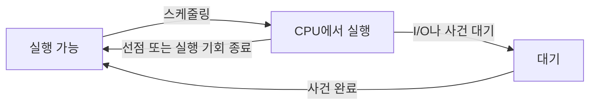
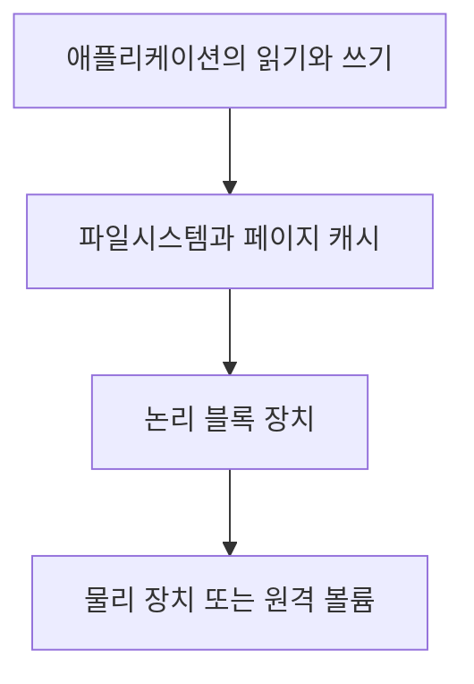
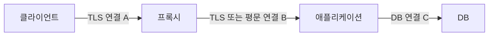
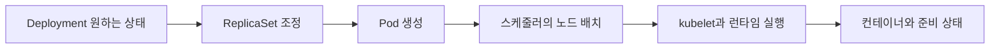
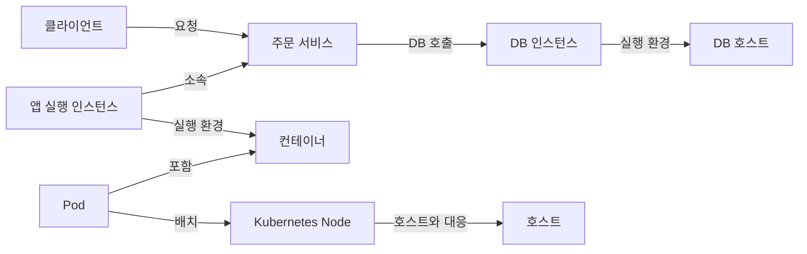
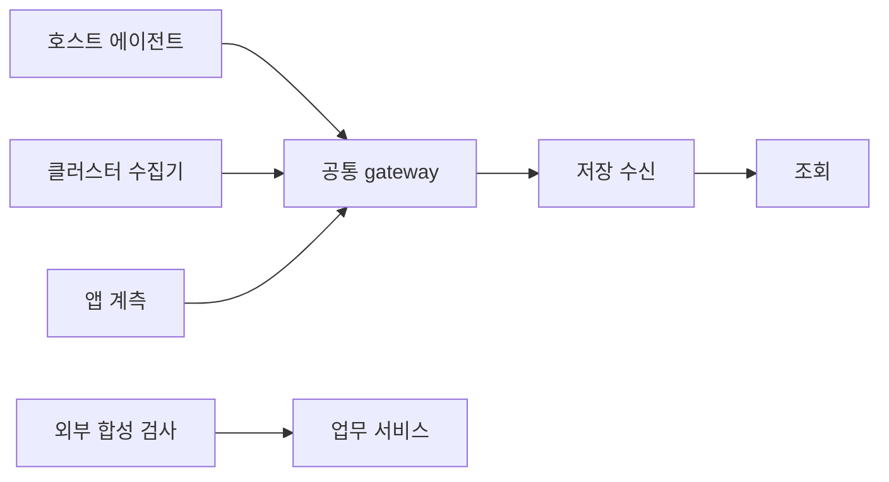
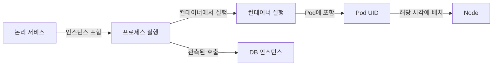

<a id="book-top"></a>

# 통합 모니터링 도메인 지식서

> 제1.0판 · 기준일: 2026-10-04 · 상세 본문 80장

통합 모니터링 제품을 설계·구현하는 개발자를 위한 지식서입니다. 공식 자료로 확인한 설명, 가상 계산, 설계 제안을 구분합니다.

이 파일 안에서 장 사이를 이동할 수 있습니다. 원문은 docs/에서 관리하며, 실제 실행으로 확인한 범위와 실행하지 않은 예제는 검증 기록에 구분했습니다.

## 목차

- **시작하기**
  - [이 지식서를 읽는 방법](#chapter-docs-reading-guide)
  - [제1판의 범위와 사실 확인 원칙](#chapter-docs-scope)
- **공통 관측**
  - [모니터링 공통 개념](#chapter-docs-foundations-readme)
  - [처음 읽는 시스템 지도: 요청 하나가 지나가는 길](#chapter-docs-foundations-system-map)
  - [시계열과 지표의 데이터 모델](#chapter-docs-foundations-time-series)
  - [평균과 백분위수 및 분포의 집계](#chapter-docs-foundations-distributions)
  - [성능을 읽는 순서: 처리량, 대기열, 표본과 실험](#chapter-docs-foundations-performance-and-statistics)
  - [서비스 수준 지표와 오류 예산](#chapter-docs-foundations-service-level-objectives)
  - [시간과 관측 데이터의 품질](#chapter-docs-foundations-time-and-data-quality)
  - [트레이스와 로그 및 프로파일의 연결](#chapter-docs-foundations-traces-logs-profiles)
  - [분산 시스템: 복제, 합의, 시간과 불확실한 결과](#chapter-docs-foundations-distributed-systems)
- **호스트**
  - [호스트 도메인](#chapter-docs-host-readme)
  - [CPU 실행 시간과 스케줄링 대기](#chapter-docs-host-cpu)
  - [메모리와 가상 주소 공간 및 메모리 압력](#chapter-docs-host-memory)
  - [블록 I/O와 파일시스템 용량](#chapter-docs-host-disk-io)
  - [프로세스와 스레드 및 파일 디스크립터](#chapter-docs-host-processes)
  - [Windows의 CPU와 메모리 관측](#chapter-docs-host-windows)
  - [가상화: 호스트, 하이퍼바이저와 게스트](#chapter-docs-host-virtualization)
  - [GPU와 가속기: 활동, 메모리와 분할](#chapter-docs-host-gpu)
  - [CPU와 메모리의 위치: NUMA, 캐시, 스케줄링과 압력](#chapter-docs-host-numa-and-pressure)
  - [호스트 수집 명세: 원천 필드에서 지표까지](#chapter-docs-host-collection-contracts)
- **네트워크**
  - [네트워크 도메인](#chapter-docs-network-readme)
  - [주소, 경로, 이름 해석](#chapter-docs-network-addressing-routing-dns)
  - [TCP, UDP, 연결과 전송 속도](#chapter-docs-network-tcp-and-udp)
  - [TLS, HTTP와 요청 단계별 시간](#chapter-docs-network-tls-http)
  - [인터페이스, 장비, 흐름과 능동 검사](#chapter-docs-network-network-metrics)
  - [링크, 오버레이, MTU와 경로 제어](#chapter-docs-network-layers-and-routing)
  - [네트워크 장비 수집: SNMP, MIB와 인터페이스 수명](#chapter-docs-network-snmp-and-device-models)
  - [경로 수렴과 QoS: 연결은 살아 있는데 통신이 느린 이유](#chapter-docs-network-routing-convergence-and-qos)
- **스토리지**
  - [스토리지 도메인](#chapter-docs-storage-readme)
  - [블록, 파일, 객체 저장소와 성능 경계](#chapter-docs-storage-models-and-performance)
  - [저장 용량, 복제, 스냅샷과 복구 가능성](#chapter-docs-storage-capacity-and-protection)
  - [저장 경로를 따라가기: RAID, LVM, SAN과 NAS](#chapter-docs-storage-raid-lvm-and-paths)
- **컨테이너**
  - [컨테이너 도메인](#chapter-docs-containers-readme)
  - [컨테이너의 격리와 실행 수명](#chapter-docs-containers-isolation-and-lifecycle)
  - [컨테이너 CPU와 메모리 자원 제어](#chapter-docs-containers-resource-control)
  - [컨테이너 파일시스템, 쓰기 계층과 볼륨](#chapter-docs-containers-filesystems)
  - [컨테이너 수집의 플랫폼 차이: cgroup v1·v2와 Windows](#chapter-docs-containers-platform-differences)
- **Kubernetes**
  - [쿠버네티스 도메인](#chapter-docs-kubernetes-readme)
  - [Kubernetes 객체와 제어 루프](#chapter-docs-kubernetes-objects-and-control-loops)
  - [Pod 수명, 컨테이너 상태와 건강 검사](#chapter-docs-kubernetes-pod-lifecycle)
  - [자원 요청, 제한, 배치와 확장](#chapter-docs-kubernetes-resources-and-scheduling)
  - [Kubernetes 수집 경로와 데이터의 의미](#chapter-docs-kubernetes-collection)
  - [Kubernetes 네트워크와 저장소의 연결 관계](#chapter-docs-kubernetes-network-and-storage)
  - [워크로드 종류와 제어 평면의 가용성](#chapter-docs-kubernetes-workloads-and-control-plane)
  - [CNI와 CSI: Pod 연결과 볼륨 준비가 실패하는 위치](#chapter-docs-kubernetes-cni-csi-and-data-paths)
  - [API 변경, CRD와 Operator를 관측하는 방법](#chapter-docs-kubernetes-operators-and-api-lifecycle)
- **애플리케이션**
  - [애플리케이션 도메인](#chapter-docs-application-readme)
  - [요청, 동시성, 대기열과 연결 풀](#chapter-docs-application-requests-and-concurrency)
  - [웹 서버와 연결 풀: 요청이 기다리는 여러 장소](#chapter-docs-application-servers-and-pools)
  - [시간 제한, 취소, 재시도와 과부하](#chapter-docs-application-timeouts-and-retries)
  - [JVM과 .NET: 메모리, GC, 실행 자원](#chapter-docs-application-managed-runtimes)
  - [Go, Node.js, Python의 동시성과 관측](#chapter-docs-application-async-runtimes)
  - [브라우저, 실제 사용자 관측과 합성 검사](#chapter-docs-application-user-experience)
  - [계측을 넣는 위치: 자동 계측, 수동 span, eBPF와 프로파일](#chapter-docs-application-instrumentation-and-profiling)
- **데이터베이스**
  - [데이터베이스 도메인](#chapter-docs-database-readme)
  - [트랜잭션, 격리, MVCC와 잠금](#chapter-docs-database-transactions-and-locks)
  - [쿼리, 인덱스, 실행 계획과 비용](#chapter-docs-database-queries-and-indexes)
  - [PostgreSQL 관측: 활동, 누적 통계와 정리 작업](#chapter-docs-database-postgresql)
  - [MySQL과 MariaDB 관측](#chapter-docs-database-mysql-mariadb)
  - [SQL Server와 Oracle: 대기와 실행 통계](#chapter-docs-database-sqlserver-oracle)
  - [로그, 지속성, 복제와 복구](#chapter-docs-database-replication-and-recovery)
  - [DB 고가용성: 장애 전환, fencing과 복구 완료의 의미](#chapter-docs-database-high-availability)
  - [문서형, 분산형, 분석형 DB의 관측](#chapter-docs-database-distributed-and-analytical)
  - [시계열·그래프·문서·열 지향 DB를 비교하는 기준](#chapter-docs-database-specialized-data-models)
  - [DB 수집 명세: 읽기 전용 쿼리, 단위, 권한과 통계 수명](#chapter-docs-database-collection-contracts)
- **미들웨어**
  - [미들웨어 도메인](#chapter-docs-middleware-readme)
  - [캐시와 Redis: 적중, 메모리, 만료와 지속성](#chapter-docs-middleware-cache-redis)
  - [Kafka: 파티션, offset, lag와 처리 보장](#chapter-docs-middleware-kafka)
  - [메시지 큐: 발행 확인, 전달, 처리와 재전달](#chapter-docs-middleware-message-queues)
  - [검색 엔진: 색인, 가시성, shard와 요청 지연](#chapter-docs-middleware-search-engines)
  - [프록시, 로드밸런서와 서비스 메시](#chapter-docs-middleware-proxies-and-mesh)
  - [스트림 처리: event time, watermark, checkpoint와 역압](#chapter-docs-middleware-stream-processing)
- **클라우드**
  - [클라우드 도메인](#chapter-docs-cloud-readme)
  - [클라우드 자원 계층과 API 수집](#chapter-docs-cloud-resources-and-apis)
  - [클라우드 지표의 기간, 통계와 정규화](#chapter-docs-cloud-provider-metrics)
  - [관리형 서비스와 서버리스 관측](#chapter-docs-cloud-managed-and-serverless)
  - [클라우드 네트워크: 경로, 정책과 흐름 로그](#chapter-docs-cloud-networking)
  - [클라우드 한도, 비용과 용량: 사용량만으로 보이지 않는 제약](#chapter-docs-cloud-quotas-cost-and-capacity)
- **도메인 간 분석**
  - [도메인 간 장애 분석](#chapter-docs-cross-domain-readme)
  - [사례: 느린 주문 요청과 DB 연결 대기](#chapter-docs-cross-domain-slow-requests)
  - [사례: 재시작, 메모리 한도와 볼륨 부족](#chapter-docs-cross-domain-resource-failures)
  - [사례: 캐시 미스, 재시도와 처리 적체](#chapter-docs-cross-domain-backlogs-and-retries)
  - [사례: 여러 그래프가 동시에 멈춘 경우](#chapter-docs-cross-domain-missing-observations)
  - [재현 실습: 계산, 실제 엔진, 운영 검증의 경계](#chapter-docs-cross-domain-reproducible-labs)
  - [종합 연습: 주문 지연을 증거로 좁혀 가기](#chapter-docs-cross-domain-capstone-investigation)
- **제품 설계**
  - [도메인 지식을 제품 설계에 연결하기](#chapter-docs-product-readme)
  - [관측 대상의 식별과 시간에 따른 관계](#chapter-docs-product-entities-and-topology)
  - [수집, 변환, 전송과 유실의 경계](#chapter-docs-product-collection-pipelines)
  - [텔레메트리 저장과 조회의 의미](#chapter-docs-product-storage-and-query)
  - [알림 조건, 상태, 통지와 장애 사건](#chapter-docs-product-alerts-and-incidents)
  - [모니터링 제품 자체의 관측과 접근 경계](#chapter-docs-product-self-observation-and-access)
  - [어댑터 계약: 서로 다른 원천을 정확히 연결하는 규칙](#chapter-docs-product-adapter-contracts)
  - [모니터링 제품의 용량과 손실 예산](#chapter-docs-product-capacity-and-loss-budgets)
- **참조와 검증**
  - [통합 모니터링 용어집](#chapter-docs-glossary)
  - [단위와 대표 지표의 해석 참조표](#chapter-docs-metric-catalog)
  - [제1판의 분야별 범위](#chapter-docs-coverage)
  - [제1판 검증 기록](#chapter-docs-validation)
  - [제1판의 검토와 수정 기록](#chapter-docs-review)
  - [문서 작성 가이드](#chapter-contributing)
  - [주제 문서 작성 템플릿](#chapter-templates-topic)
  - [지표 명세 작성 템플릿](#chapter-templates-metric)

---

<a id="chapter-docs-reading-guide"></a>

<a id="chapter-docs-reading-guide--이-지식서를-읽는-방법"></a>

## 이 지식서를 읽는 방법

이 책은 통합 모니터링 제품을 만드는 개발자가 도메인 지식을 처음부터 익히도록 구성한 제1판입니다. 낯선 용어가 나와도 외부 문서를 모두 읽어야 다음으로 넘어가도록 구성하지 않았습니다. 핵심 설명은 본문에 두고 출처는 그 설명을 확인할 근거로 연결했습니다.

<a id="chapter-docs-reading-guide--한-파일로-읽기"></a>

### 한 파일로 읽기

**[BOOK.html](BOOK.html)을 브라우저에서 열면** 목차 검색·표·그림을 포함한 전체를 읽을 수 있습니다. 본문 검색은 Ctrl+F를 사용합니다. Markdown을 선호하면 [BOOK.md](#book-top), 작은 파일별 탐색은 [분야별 목차](#book-top)를 사용합니다. 내용의 원본은 `docs/`이며 두 통합본은 같은 원문에서 생성됩니다.

<a id="chapter-docs-reading-guide--처음-읽는-순서"></a>

### 처음 읽는 순서

처음에는 [시스템 지도](#chapter-docs-foundations-system-map)부터 읽습니다. 호스트·프로세스·서비스·컨테이너·Pod가 어떻게 다른지 이해한 뒤 개별 지표로 들어가면 용어를 외우는 부담이 줄어듭니다.

| 단계 | 읽을 내용 | 스스로 설명해 볼 질문 |
| --- | --- | --- |
| 1 | 시스템 지도 → 시계열 → 분포 → 성능과 통계 | 현재값·누적값·평균·p95는 어떤 질문에 답하는가? |
| 2 | CPU → 메모리 → I/O → 주소·DNS → TCP → TLS·HTTP | 실행과 대기는 어떻게 다르고 어느 경계에서 시간이 걸리는가? |
| 3 | 컨테이너 격리 → cgroup → Pod 수명 → 배치 → CNI·CSI | 호스트가 한가한데 컨테이너가 제한되거나 Pod가 준비되지 않을 수 있는가? |
| 4 | 요청 → 연결 풀 → transaction·잠금 → 쿼리 → 복제·HA | 요청이 어떤 자원을 기다리고 언제 성공했다고 말할 수 있는가? |
| 5 | 캐시·Kafka·메시지·검색·스트림 → 클라우드 | 처리 진행과 실제 업무 완료를 어떻게 구분하는가? |
| 6 | 실제 실습 → 종합 분석 연습 → 제품 설계 | 원천의 뜻과 불확실성을 수집·저장·화면까지 보존할 수 있는가? |

모든 분야를 한 번에 암기할 필요는 없습니다. 첫 번째로 읽을 때는 개념과 계산 예시를 따라가고, 두 번째에는 자신의 제품에서 사용할 원천 필드·권한·수명·결측 처리를 확인합니다. Windows·GPU·특정 DB처럼 당장 필요하지 않은 구현 사례도 공통 개념을 익힌 뒤 찾아볼 수 있습니다.

<a id="chapter-docs-reading-guide--각-장을-읽는-방법"></a>

### 각 장을 읽는 방법

기존 58장에는 선수 개념을 풀어 쓴 “먼저 이해할 것”을 추가했습니다. 새 장도 상황과 쉬운 설명에서 시작합니다. 이어서 동작·원천·예시·한계·제품 적용·이해 확인을 읽습니다. 예시의 숫자를 한 번 직접 계산하면 어떤 분모와 시간 범위를 사용하는지 확인할 수 있습니다.

낯선 약어는 [용어집](#chapter-docs-glossary)에서 짧은 정의를 보고 연결된 장으로 돌아옵니다. 표에 있는 수치가 임계값인지, 가상의 계산 입력인지, 실제 측정값인지도 확인합니다.

<a id="chapter-docs-reading-guide--목적별-찾아보기"></a>

### 목적별 찾아보기

| 목적 | 경로 |
| --- | --- |
| 새 수집기 구현 | [시계열](#chapter-docs-foundations-time-series) → [호스트 계약](#chapter-docs-host-collection-contracts) / [SNMP](#chapter-docs-network-snmp-and-device-models) / [DB 계약](#chapter-docs-database-collection-contracts) → [어댑터 계약](#chapter-docs-product-adapter-contracts) |
| 느린 요청 조사 | [trace](#chapter-docs-foundations-traces-logs-profiles) → [연결 풀](#chapter-docs-application-servers-and-pools) → [잠금](#chapter-docs-database-transactions-and-locks) → [사례](#chapter-docs-cross-domain-slow-requests) |
| 실행·자원 장애 조사 | CPU·메모리 → cgroup·Pod → [자원 장애](#chapter-docs-cross-domain-resource-failures) |
| 대상·관계 설계 | 프로세스·Pod·cloud ID → [entity와 topology](#chapter-docs-product-entities-and-topology) |
| 알림 구현 | [데이터 품질](#chapter-docs-foundations-time-and-data-quality) → [SLO](#chapter-docs-foundations-service-level-objectives) → [알림](#chapter-docs-product-alerts-and-incidents) → [PromQL 실습](#chapter-docs-cross-domain-reproducible-labs) |
| 용량 계획 | [성능과 통계](#chapter-docs-foundations-performance-and-statistics) → [보존과 질의](#chapter-docs-product-storage-and-query) → [용량과 손실 예산](#chapter-docs-product-capacity-and-loss-budgets) |

<a id="chapter-docs-reading-guide--문장의-종류"></a>

### 문장의 종류

| 표시 | 읽는 방법 |
| --- | --- |
| 공식 출처·적용 버전 | 그 범위의 정의와 동작 |
| 가상·합성·설명용 | 학습을 위한 입력과 상황; 실제 성능 수치 아님 |
| 실제 실행·실습 | 기록한 버전과 설정에서 얻은 결과 |
| 제품 적용 제안 | 사용자의 현재 구현을 확인한 사실이 아닌 설계 제안 |
| 가설·가능성 | 더 확인할 설명 후보 |
| 실행 미검증 | 공식 설명은 있지만 이 환경에서 실행하지 않은 예제 |

장의 `검토됨`을 모든 환경의 실행 인증으로 읽지 않습니다. [검토 기록](#chapter-docs-review)과 [검증 기록](#chapter-docs-validation)에 범위를 분리했습니다.

<a id="chapter-docs-reading-guide--끝까지-유지할-질문"></a>

### 끝까지 유지할 질문

어떤 수치에도 **누구의 값인지, 어디서 쟀는지, 단위와 분모가 무엇인지, 어느 시간의 값인지, 어떻게 집계했는지, 수집이 성공했는지**를 묻습니다. 이 질문들을 설명할 수 있으면 기술 이름이 바뀌어도 원천을 읽고 새 도메인을 제품에 연결할 출발점을 갖게 됩니다.

[통합 목차로](#book-top)

---

<a id="chapter-docs-scope"></a>

<a id="chapter-docs-scope--제1판의-범위와-사실-확인-원칙"></a>

## 제1판의 범위와 사실 확인 원칙

이 지식서는 통합 모니터링 제품을 설계·구현하는 개발자를 위한 제1.0판입니다. 도메인 지식이 많지 않은 독자가 **개념 → 동작 → 관측 → 해석 → 장애 분석 → 제품 설계**를 한 권에서 따라가도록 작성했습니다. 특정 OS·클라우드·DB 하나만 지원하는 제품으로 가정하지 않습니다.

<a id="chapter-docs-scope--완성판의-범위"></a>

### 완성판의 범위

12개 분야의 개요와 80개 상세 장, 용어·지표 참조, 실제 실습과 검증 기록을 제공합니다. CPU·메모리·I/O·네트워크부터 컨테이너·Kubernetes·앱·DB·미들웨어·클라우드, 그리고 제품 자체의 데이터 처리를 연결합니다. 개요 파일이나 링크 목록만으로 상세 장 수를 늘리지 않았습니다.

이 판의 완성은 정한 학습 범위의 원고·예시·연결·검토를 갖추었다는 의미입니다. 모든 제조사의 모든 API 필드를 열거한 사전이나, 아직 주어지지 않은 사용자 제품의 실제 연동 인증을 의미하지 않습니다. 버전별 모든 조합을 실제로 실행한 것으로 표시하지 않습니다.

<a id="chapter-docs-scope--근거의-종류"></a>

### 근거의 종류

| 내용 | 근거와 표현 |
| --- | --- |
| OS·엔진·프로토콜 정의 | 공식 문서·명세·API·프로젝트 코드·연구 원문 연결 |
| 조건에 따라 달라지는 동작 | 버전·설정·범위를 함께 적음 |
| 계산 예시 | 가상 입력임을 표시하고 단위·산술 확인 |
| 제품 모델 | 설계 제안으로 표시 |
| 장애 사례 | 사실·가설·추가 증거·반증 조건 구분 |
| 실제 실습 | 실행 버전·설정·입력·출력·한계 보존 |
| 운영 성능·비용 | 실제 자료가 없으면 사실인 것처럼 숫자를 만들지 않음 |

같은 이름의 지표도 원천이 다르면 의미가 달라질 수 있습니다. CPU의 분모, 메모리 계정, 복제 지연, DB 시간 단위, cloud의 기간 집계를 원천별로 확인합니다. 원문을 연결하는 것으로 핵심 설명을 대신하지 않습니다.

<a id="chapter-docs-scope--확인-날짜와-버전"></a>

### 확인 날짜와 버전

장은 해당 설명을 검토한 날짜와 범위를 표시합니다. 기존 장의 출처 확인일 2026-10-03과 편집 검토일 2026-10-04는 서로 다른 기록입니다. 확인일이 제품의 출시일을 뜻하지도 않습니다.

고정 버전 문서와 `latest` 문서는 구분합니다. 실습 버전은 재현을 위해 고정했으며 최신 버전 추천을 의미하지 않습니다. 실제 제품 어댑터는 대상에서 OS·엔진·runtime·API 버전과 capability를 확인해야 합니다.

<a id="chapter-docs-scope--세-가지-검증"></a>

### 세 가지 검증

- **문서 검토:** 설명·단위·범위·가상 예시·제안의 구분을 확인합니다.
- **자동 문서·코드 검사:** 구조·로컬 링크·목차·대표 계산·계약 입력·생성본 일치를 확인합니다.
- **실제 실행:** 명시한 로컬 환경에서 SQLite·HTTP·Windows API·PromQL 동작을 확인합니다.

외부 URL의 HTTP 조회는 접근 상태 검사이며 문장별 사실 판정과 다릅니다. 실제 운영 클러스터·상용 장비·cloud 계정에서 실행하지 않은 항목은 실행 완료로 표시하지 않습니다. 세부 증거는 [검증 기록](#chapter-docs-validation)과 [검토 기록](#chapter-docs-review)에 있습니다.

<a id="chapter-docs-scope--여러-기술을-통합하는-원칙"></a>

### 여러 기술을 통합하는 원칙

공통 단위로 바꿀 수 있는 값과 엔진 고유 의미를 유지해야 하는 값을 구분합니다. 지원 불가·권한 부족·일시 실패·대상 삭제를 서로 다른 상태로 저장하도록 제안합니다. 제품이 이미 특정 기술을 지원한다고 가정해 존재하지 않는 adapter나 field를 만들어 설명하지 않습니다.

<a id="chapter-docs-scope--개정-기준"></a>

### 개정 기준

원천 의미나 API가 바뀌거나 반례가 발견되면 관련 장과 검증을 함께 고칩니다. 새 기술은 공통 원리를 반복하는 대신 기존 개념과 어떤 점이 달라지는지 설명합니다. [분야별 범위](#chapter-docs-coverage)와 [작성 가이드](#chapter-contributing)를 기준으로 관리합니다.

[통합 목차로](#book-top)

---

<a id="chapter-docs-foundations-readme"></a>

<a id="chapter-docs-foundations-readme--모니터링-공통-개념"></a>

## 모니터링 공통 개념

> 상태: 검토됨 · 적용 범위: 도메인 공통, 일부 Prometheus 예시 · 출처 확인일: 2026-10-03

통합 모니터링에서 여러 도메인의 데이터를 함께 읽으려면 무엇을, 어디에서, 언제, 어떤 방식으로 관측했는지 알아야 합니다. 이 문서는 도메인별 설명에서 공통으로 사용할 출발점을 정리합니다.

<a id="chapter-docs-foundations-readme--관측-데이터의-종류"></a>

### 관측 데이터의 종류

| 종류 | 의미 | 활용 예시 |
| --- | --- | --- |
| 메트릭 Metrics | 실행 중 측정한 수치 | 요청 수와 메모리 사용량의 변화 |
| 로그 Logs | 발생한 사건에 대한 기록 | 실패 메시지와 처리 문맥 확인 |
| 트레이스 Traces | 요청이 여러 작업을 거치는 경로 | 요청 처리 중 시간이 소요된 구간 확인 |
| 프로파일 Profiles | 코드 수준의 자원 사용 기록 | CPU 시간을 소비하는 함수 조사 |

각 데이터의 정의는 [OpenTelemetry Signals](https://opentelemetry.io/docs/concepts/signals/)를 참고했습니다. 표의 활용 예시는 이 문서의 설명을 위한 것입니다. 실제 수집 가능 여부와 지원 수준은 사용할 도구·계측 방식·버전에서 확인합니다.

<a id="chapter-docs-foundations-readme--지표의-값과-형태"></a>

### 지표의 값과 형태

Prometheus에서 Counter는 재시작 시 초기화될 수 있는 누적 증가값이고, Gauge는 오르내릴 수 있는 현재값입니다. Histogram은 관측값을 구간별로 집계하는 분포 표현이며, Summary는 관측 수·합계와 설정한 분위수를 제공할 수 있습니다. 이 명칭을 다른 수집 체계의 데이터형과 대응시킬 때는 각 체계의 정의를 확인합니다. [Prometheus Metric types](https://prometheus.io/docs/concepts/metric_types/)

예를 들어 오류 누적 횟수가 1,000이라는 사실만으로 최근 오류가 늘었다고 판단하기는 어렵습니다. 어느 구간에서 얼마나 증가했는지, 같은 구간의 전체 요청은 몇 건인지 함께 정의해야 합니다.

가상 예시로, 같은 완료 시점 기준으로 집계한 5분간 요청 1,000건 중 오류가 20건이면 오류율은 `20 / 1,000 × 100 = 2%`입니다. 오류의 정의, 대상 요청의 범위, 재시도 포함 여부는 이 계산을 사용하는 제품에서 정해야 합니다.

<a id="chapter-docs-foundations-readme--집계-시-주의할-점"></a>

### 집계 시 주의할 점

인스턴스별 p95를 단순 평균해 전체 요청의 p95로 표시하면 안 됩니다. 전체 분포를 합칠 수 있는 원천 데이터를 사용하고, 히스토그램이라면 구간의 호환성과 집계 방식을 확인해야 합니다. [Prometheus Histograms and summaries](https://prometheus.io/docs/practices/histograms/)

다음은 이 프로젝트에서 지표 문서를 작성할 때 확인할 항목입니다.

| 확인 항목 | 문서에서 답할 질문 |
| --- | --- |
| 대상 | 호스트 전체, CPU 하나, 컨테이너, 프로세스 중 무엇인가? |
| 측정 위치 | 요청을 보낸 쪽인가, 처리한 쪽인가? |
| 단위와 분모 | 초인가 밀리초인가? 비율의 기준은 용량인가 설정 한도인가? |
| 시간 | 순간값인가 누적값인가? 어느 시간 구간을 집계했는가? |
| 집계 | 합계·평균·최댓값·분위수 중 무엇이며 왜 적절한가? |
| 수집 상태 | 값이 없는 것인가, 0인가, 이전 값이 남아 있는가? |

<a id="chapter-docs-foundations-readme--제품-적용-제안"></a>

### 제품 적용 제안

이 저장소에서는 측정값과 함께 관측 시각, 수집 시각, 수집 성공 여부, 대상 식별 정보를 기록하는 방향을 제안합니다. 실제 저장 형식은 제품 설계 시 결정합니다.

화면에서는 데이터가 없는 상황을 자동으로 0이나 정상 상태로 바꾸지 않고, 수집 상태를 확인할 수 있게 합니다. 서로 다른 도메인의 그래프를 비교할 때는 조회 시간 구간과 집계 간격을 맞추는 기능을 검토합니다.

<a id="chapter-docs-foundations-readme--상세-본문"></a>

### 상세 본문

1. [처음 읽는 시스템 지도: 요청 하나가 지나가는 길](#chapter-docs-foundations-system-map)
2. [시계열과 지표의 데이터 모델](#chapter-docs-foundations-time-series)
3. [평균과 백분위수 및 분포의 집계](#chapter-docs-foundations-distributions)
4. [성능을 읽는 순서: 처리량, 대기열, 표본과 실험](#chapter-docs-foundations-performance-and-statistics)
5. [서비스 수준 지표와 오류 예산](#chapter-docs-foundations-service-level-objectives)
6. [시간과 관측 데이터의 품질](#chapter-docs-foundations-time-and-data-quality)
7. [트레이스와 로그 및 프로파일의 연결](#chapter-docs-foundations-traces-logs-profiles)
8. [분산 시스템: 복제, 합의, 시간과 불확실한 결과](#chapter-docs-foundations-distributed-systems)

관련 문서: [지표 명세 템플릿](#chapter-templates-metric), [도메인 간 장애 분석](#chapter-docs-cross-domain-readme)

[통합 목차로](#book-top)

---

<a id="chapter-docs-foundations-system-map"></a>

<a id="chapter-docs-foundations-system-map--처음-읽는-시스템-지도-요청-하나가-지나가는-길"></a>

## 처음 읽는 시스템 지도: 요청 하나가 지나가는 길

> 상태: 검토됨 · 적용 범위: 입문용 구조 설명, Linux 프로세스와 Kubernetes 개념 · 검토일: 2026-10-04 · 수치는 학습용 예시

통합 모니터링은 여러 종류의 그래프를 한 화면에 모으는 데서 끝나지 않습니다. “사용자가 느리다고 할 때 어떤 구성 요소의 어떤 동작을 확인해야 하는가”를 설명할 수 있어야 합니다. 처음에는 제품 이름보다 **일을 하는 프로그램, 그 프로그램이 사용하는 자원, 프로그램 사이의 통신**을 구분하면 됩니다.

<a id="chapter-docs-foundations-system-map--온라인-주문으로-시작하기"></a>

### 온라인 주문으로 시작하기

가상의 쇼핑 서비스에서 사용자가 주문 버튼을 누릅니다. 다음은 가능한 구성 한 가지이며, 모든 서비스가 이 구조를 따르지는 않습니다.

```text
사용자 브라우저
  → 이름을 IP 주소로 찾는 DNS
  → HTTPS 연결을 받는 프록시/로드 밸런서
  → 주문 업무를 수행하는 애플리케이션
      → 자주 읽는 정보를 보관하는 캐시
      → 주문을 저장하는 데이터베이스
      → 나중에 발송할 작업을 담는 메시지 큐
```

DNS 질의는 캐시 때문에 생략될 수 있고, 연결도 재사용할 수 있습니다. 따라서 매 요청마다 DNS·TCP·TLS 준비 시간이 모두 발생한다고 더하지 않습니다. HTTP는 요청과 응답의 의미를 정하고, 실제 연결 재사용과 프로토콜 버전에 따라 전송 동작이 달라집니다. [HTTP 의미](https://www.rfc-editor.org/rfc/rfc9110.html)

주문 응답을 받은 뒤 메시지 소비자가 배송 준비를 시작한다면, 주문 API의 완료와 배송 작업의 완료는 서로 다른 사건입니다. 첫 화면에서는 “요청이 성공했는가”를 보고, 별도 화면에서는 “주문이 실제로 처리되었는가”를 봐야 합니다. 이는 이 책에서 반복해서 사용할 **측정 경계**의 예입니다.

<a id="chapter-docs-foundations-system-map--프로그램-아래에는-무엇이-있는가"></a>

### 프로그램 아래에는 무엇이 있는가

| 말 | 처음 이해할 때의 뜻 | 다른 개념과 구분 |
| --- | --- | --- |
| 프로그램 | 실행할 명령을 담은 코드와 파일 | 파일이 있다는 사실만으로 실행 중은 아님 |
| 프로세스 | 실행 중인 프로그램의 자원·주소 공간을 다루는 단위 | 같은 프로그램을 여러 프로세스로 실행 가능 |
| 스레드 | 프로세스 안의 실행 흐름 | 같은 프로세스의 스레드들은 메모리 등을 공유 |
| 운영체제와 커널 | CPU 실행, 메모리, 파일, 통신 등의 자원을 관리 | 앱의 업무 성공 여부까지 자동 판단하지는 않음 |
| 호스트 | 이 책에서 관측할 운영체제 인스턴스 | 물리 서버 또는 가상 머신일 수 있음 |
| 컨테이너 | 격리된 실행 환경과 자원 제어를 제공하는 실행 단위 | 일반적인 Linux 컨테이너는 호스트 커널을 공유 |
| Kubernetes Pod | 함께 배치되는 하나 이상의 컨테이너 묶음 | 업무상 서비스 이름과 수명이 같지 않음 |

스레드의 공유 범위는 [POSIX 스레드](https://man7.org/linux/man-pages/man7/pthreads.7.html), Linux 컨테이너의 격리 수단은 [namespaces](https://man7.org/linux/man-pages/man7/namespaces.7.html), Pod의 공유 네트워크·스토리지 모델은 [Kubernetes Pods](https://kubernetes.io/docs/concepts/workloads/pods/)를 기준으로 설명했습니다. 표는 처음 읽기 위한 요약이며 정확한 자원 계정은 뒤의 개별 장에서 다룹니다.

CPU는 일을 실행하고, 메모리는 실행 중 필요한 상태를 담고, 저장장치는 보존할 데이터를 다루며, 네트워크는 다른 실행 환경과 데이터를 주고받습니다. “서버가 느리다”는 말에는 CPU를 기다리는 경우, DB의 잠금이 풀리기를 기다리는 경우, 외부 서비스 응답을 기다리는 경우가 모두 들어갈 수 있습니다.

<a id="chapter-docs-foundations-system-map--포함-관계와-호출-관계를-따로-그리기"></a>

### 포함 관계와 호출 관계를 따로 그리기

```text
포함·실행 관계: 호스트 → Pod → 컨테이너 → 애플리케이션 프로세스
호출 관계:     주문 서비스 → 결제 서비스 → 결제 DB
```

위 첫 줄은 Linux 기반 Kubernetes 환경을 단순화한 예입니다. 호스트의 시스템 프로세스가 모두 Pod 안에 들어가지는 않습니다. 두 번째 줄의 서비스들은 서로 다른 호스트에서 실행될 수 있습니다. 어떤 Pod가 특정 Node에서 실행된다는 정보만으로 “그 Pod가 그 Node의 다른 모든 Pod를 호출한다”는 관계를 만들면 안 됩니다.

Pod가 재생성되면 같은 업무 이름을 유지해도 UID가 바뀔 수 있습니다. 제품에서는 서비스의 장기 추세와 짧게 생존하는 실행 인스턴스의 장애를 연결하되, 과거 인스턴스의 CPU 누적값을 새 인스턴스에 이어 붙이지 않습니다. [객체 이름과 UID](https://kubernetes.io/docs/concepts/overview/working-with-objects/names/)

<a id="chapter-docs-foundations-system-map--네-가지-관측-자료를-함께-읽기"></a>

### 네 가지 관측 자료를 함께 읽기

가상의 주문 지연을 설명해 봅시다.

| 자료 | 예시 | 여기까지 알 수 있는 것 |
| --- | --- | --- |
| 메트릭 | 최근 5분 주문 p95가 2초 | 어느 집단의 지연이 커졌음 |
| 트레이스 | 한 주문의 DB 구간이 1.7초 | 그 요청에서 시간이 걸린 경계 |
| 로그 | 해당 요청에서 DB 잠금 대기 기록 | 기록한 시점의 사건과 문맥 |
| 프로파일 | 프로세스 CPU 표본에 특정 함수가 많음 | 관측한 CPU 실행의 분포 |

트레이스의 DB 구간에는 연결 확보·네트워크·서버 처리 등이 어떤 범위로 계측되었는지 확인해야 합니다. CPU 프로파일만으로 CPU를 쓰지 않고 기다린 전체 시간을 복원할 수도 없습니다. 신호들은 서로를 보완합니다. [OpenTelemetry 신호](https://opentelemetry.io/docs/concepts/signals/)

<a id="chapter-docs-foundations-system-map--숫자를-보기-전에-하는-다섯-질문"></a>

### 숫자를 보기 전에 하는 다섯 질문

1. **누구의 값인가?** 호스트 전체인지, 컨테이너 하나인지, 요청 집단인지 확인합니다.
2. **무엇을 셌는가?** 사용자가 누른 주문 수와 내부 재시도 횟수는 다릅니다.
3. **언제의 값인가?** 현재값, 누적값, 5분 동안의 합계는 다릅니다.
4. **무엇으로 나눴는가?** CPU 50%의 분모가 한 코어인지 전체 호스트인지 확인합니다.
5. **관측이 성공했는가?** 값이 없다는 사실을 사용량 0으로 바꾸지 않습니다.

가상 예로 8개 논리 CPU인 호스트에서 한 프로세스가 1초 동안 CPU 시간 2초를 사용했다면, 여러 실행 흐름을 합쳐 평균 2개 CPU를 사용한 것입니다. 한 CPU 기준 200%, 호스트 전체 기준 25%입니다. 둘 중 하나만 참인 것이 아니라 분모가 다릅니다. 자세한 계정 규칙은 [CPU](#chapter-docs-host-cpu)에서 설명합니다.

<a id="chapter-docs-foundations-system-map--이해-확인"></a>

### 이해 확인

1. DB CPU가 낮으면 주문 지연이 DB와 무관한가? **아닙니다. 잠금이나 I/O 대기처럼 CPU를 많이 쓰지 않는 지연이 있습니다.**
2. 컨테이너와 서비스는 같은 개수인가? **하나의 서비스가 여러 컨테이너 인스턴스로 실행될 수 있어 고정 관계가 아닙니다.**
3. 주문 API가 200을 반환하면 배송까지 완료되었는가? **API가 약속한 완료 경계를 먼저 확인해야 합니다.**

다음: [시계열과 데이터 모델](#chapter-docs-foundations-time-series) · [학습 안내](#chapter-docs-reading-guide)

[통합 목차로](#book-top)

---

<a id="chapter-docs-foundations-time-series"></a>

<a id="chapter-docs-foundations-time-series--시계열과-지표의-데이터-모델"></a>

## 시계열과 지표의 데이터 모델

> 상태: 검토됨 · 범위: 공통 원리, Prometheus 및 OpenTelemetry 데이터 모델 · 공식 자료 확인: 2026-10-03 · 편집 검토일: 2026-10-04

<a id="chapter-docs-foundations-time-series--먼저-이해할-것"></a>

### 먼저 이해할 것

온도계의 현재 온도와 자동차의 누적 주행거리는 읽는 방법이 다릅니다. 현재 온도는 그대로 비교할 수 있지만 최근 이동 속도는 주행거리 증가량과 경과 시간을 알아야 합니다. 지표의 gauge와 counter도 이 차이에서 시작합니다. 이 비유는 값의 유형을 설명하며, 실제 카운터의 재시작과 단위는 아래 정의를 따릅니다.

지표를 구현할 때 먼저 정해야 하는 것은 그래프 모양이 아니라 값의 의미입니다. `120`이라는 숫자만 저장하면 요청 120건인지, 초당 120건인지, 누적 120초인지 알 수 없습니다. 이 장에서는 관측 대상을 식별하고 시간에 따른 값을 계산하는 기준을 설명합니다.

<a id="chapter-docs-foundations-time-series--시계열은-같은-대상을-시간에-따라-측정한-기록이다"></a>

### 시계열은 같은 대상을 시간에 따라 측정한 기록이다

Prometheus에서는 지표 이름과 라벨 집합이 하나의 시계열을 식별합니다. 라벨 값이 바뀌거나 라벨이 추가·제거되면 다른 시계열이 됩니다. 표본은 시각과 값으로 구성됩니다. [Prometheus 데이터 모델](https://prometheus.io/docs/concepts/data_model/)

다음은 설명을 위해 만든 지표입니다.

```text
demo_requests_total{service="orders", instance="a", result="ok"}
demo_requests_total{service="orders", instance="b", result="ok"}
demo_requests_total{service="orders", instance="a", result="error"}
```

세 줄은 세 개의 시계열입니다. `service`로 합치면 서비스 단위의 값을 얻지만, 합산 이후에는 인스턴스별 문제를 구분할 수 없습니다. 원천 차원과 조회 시 제거할 차원을 구분해서 설계합니다.

이 문서에서 **차원**은 데이터를 구분하거나 묶는 속성입니다. 라벨은 Prometheus에서 차원을 표현하는 방식입니다. OpenTelemetry의 Resource 속성과 측정값의 Attribute를 모두 무조건 동일한 라벨로 변환할 필요는 없습니다. 대응 방식은 수집·저장 모델에서 결정합니다.

<a id="chapter-docs-foundations-time-series--현재값과-누적값"></a>

### 현재값과 누적값

| 형태 | 의미 | 예 | 시간 구간을 해석하는 방법 |
| --- | --- | --- | --- |
| 현재값 | 관측 시점의 상태 | 사용 중 연결 수 | 현재값·최댓값·평균 등 질문에 맞게 조회 |
| 누적 증가값 | 시작 이후 발생한 양 | 처리 요청 누적 수 | 같은 대상의 두 관측값 차이 또는 증가율 계산 |
| 분포 | 여러 관측값의 분포 | 요청 지연 히스토그램 | 건수·합계·구간별 개수를 조합 |

Prometheus의 Counter는 재시작 등으로 초기화될 수 있는 누적 증가값이고, Gauge는 감소도 가능한 값입니다. 형태가 같아 보이는 두 숫자에도 서로 다른 계산이 필요합니다. [Prometheus 지표 유형](https://prometheus.io/docs/concepts/metric_types/)

메모리 현재값이 4 GiB에서 5 GiB가 되었다면 차이는 순증가 1 GiB입니다. 이를 그 구간의 총 할당량이라고 부를 수는 없습니다. 구간 안에서 할당과 해제가 반복되었을 수 있기 때문입니다. 반면 누적 할당 바이트를 별도 계측했다면 그 증가량이 해당 계측 범위의 할당량을 설명합니다.

<a id="chapter-docs-foundations-time-series--누적값을-증가율로-바꾸기"></a>

### 누적값을 증가율로 바꾸기

대상이 바뀌지 않고 초기화도 없다고 가정하면 두 점 사이의 평균 증가율은 다음과 같습니다.

```text
평균 증가율 = (C₂ - C₁) / (t₂ - t₁)
```

가상 입력이 `t₁=0초, C₁=12,000건`, `t₂=20초, C₂=12,500건`이면 증가량은 500건이고 평균 요청률은 25건/초입니다. 이것은 20초 구간 평균이며 모든 순간에 초당 25건이 들어왔다는 뜻은 아닙니다.

다음 구간에 값이 12,500에서 80으로 떨어지면 음수 요청률을 출력하면 안 됩니다. 재시작, 대상 교체, 계수기 초기화, 데이터 순서 문제 중 무엇인지 판단해야 합니다. 원천 자료만으로 재시작 전의 마지막 증가량을 복구할 수 없는 경우도 있습니다.

Prometheus의 `rate()`는 범위 내 Counter의 초당 평균 증가율을 계산하면서 초기화와 구간 경계 외삽을 처리합니다. 따라서 단순한 마지막 값 차이를 초로 나눈 계산과 항상 같지는 않습니다. 집계 전 각 시계열에 `rate()`를 적용해야 개별 초기화를 감지할 수 있습니다. [Prometheus rate](https://prometheus.io/docs/prometheus/latest/querying/functions/#rate)

```promql
sum by (service) (
  rate(demo_requests_total[5m])
)
```

이 쿼리는 예시 지표가 실제로 수집된다는 전제에서 서비스별 요청률을 계산합니다. 5분은 설명용 범위이며 수집 주기와 탐지 목적에 맞춰 정합니다. 이 쿼리를 실제 서버에 실행하지는 않았습니다. 개별 reset을 합산 전에 처리해야 한다는 원리는 별도의 합성 입력으로 [promtool 실습](#chapter-docs-cross-domain-reproducible-labs)에서 확인했습니다.

<a id="chapter-docs-foundations-time-series--delta와-cumulative"></a>

### Delta와 Cumulative

OpenTelemetry에서는 합계나 히스토그램이 어느 기간을 나타내는지 Aggregation Temporality로 구분합니다. Cumulative는 같은 시작 시각부터 누적하고, Delta는 각 구간의 양을 표현합니다. 시작 시각과 종료 시각은 초기화·누락을 해석하는 중요한 문맥입니다. [OpenTelemetry Metrics Data Model](https://opentelemetry.io/docs/specs/otel/metrics/data-model/#temporality)

설명용 입력은 다음과 같습니다.

| 구간 | 실제 발생량 | Cumulative 표현 | Delta 표현 |
| --- | ---: | ---: | ---: |
| 0–10초 | 30건 | 30건 | 30건 |
| 10–20초 | 50건 | 80건 | 50건 |
| 20–30초 | 20건 | 100건 | 20건 |

Cumulative의 `30 + 80 + 100`은 전체 건수가 아닙니다. 초기화가 없다면 마지막 누적값은 100건입니다. Delta는 겹치지 않는 세 구간을 합쳐 100건을 얻습니다. Delta 구간 하나가 누락되면 다음 구간의 값만으로 그 양을 알아낼 수 없습니다.

제품에서 두 형태를 변환한다면 시계열별 이전 값, 시작 시각, 마지막 처리 위치가 필요할 수 있습니다. 전송 중복을 다시 더하거나 서로 다른 실행 인스턴스의 누적값을 이어 붙이지 않도록 변환 상태의 식별 범위를 정합니다. 이는 위 데이터 모델을 바탕으로 한 구현 제안입니다.

<a id="chapter-docs-foundations-time-series--카디널리티와-대상-수명"></a>

### 카디널리티와 대상 수명

카디널리티는 여기서 서로 다른 시계열의 수를 뜻합니다. 지표마다 실제로 관측된 라벨 조합 수를 세어야 합니다. 모든 조합이 생긴다는 단순 가정에서는 차원별 값의 개수 곱으로 상한 규모를 추정할 수 있습니다.

가상 예시에서 인스턴스 40개, 경로 30종류, 결과 4종류라면 지표 하나에 최대 `40 × 30 × 4 = 4,800`개 조합이 생깁니다. 여기에 고유 요청 ID 100만 개를 추가하면 조합 공간이 크게 늘어납니다. 모든 조합이 실제 저장된다는 뜻은 아니지만, 요청 ID가 안정적인 집계 차원이 아니라는 점을 보여줍니다.

Prometheus는 라벨 조합마다 별도의 시계열이 생기므로 사용자 ID처럼 값의 종류가 제한되지 않는 차원을 주의해서 선택하도록 설명합니다. 단위는 seconds·bytes 같은 기본 단위를 명확히 드러내는 관례가 있습니다. [Prometheus 이름과 라벨 설계](https://prometheus.io/docs/practices/naming/)

**제품 적용 제안:** 상세 요청 ID는 로그·트레이스에서 탐색하고, 지표에는 정규화한 경로와 제한된 결과 분류를 사용하는 방식을 검토합니다. 활성 시계열 수뿐 아니라 새 시계열이 생기는 속도도 측정하면 짧게 살아 있는 대상이 만드는 비용을 설명하기 쉽습니다.

<a id="chapter-docs-foundations-time-series--구현-시-보존할-정보"></a>

### 구현 시 보존할 정보

| 정보 | 없으면 생길 수 있는 문제 |
| --- | --- |
| 대상과 실행 수명 | 재시작 전후의 값이 하나의 연속 계수기로 취급됨 |
| 단위 | ms와 s가 같은 값으로 합산됨 |
| 현재값·누적값·구간값의 구분 | 현재값에 rate를 적용하거나 누적값을 모두 더함 |
| 구간 시작·종료와 관측 시각 | 겹친 구간을 중복 합산하거나 누락을 놓침 |
| 수집 상태 | 알 수 없는 값을 정상적인 0으로 해석함 |

<a id="chapter-docs-foundations-time-series--이해-확인"></a>

### 이해 확인

1. 누적 요청 수가 10초 동안 300 증가했다면 무엇을 알 수 있는가? **그 구간 평균 요청률은 30건/초이다. 순간 최대 요청률은 알 수 없다.**
2. 연결 수 Gauge가 8에서 3으로 감소했다면 신규 연결이 없었다고 볼 수 있는가? **아니다. 생성과 종료의 순변화만 알 수 있다.**
3. 재시작 후 같은 이름의 대상에 이전 누적값을 이어 붙여도 되는가? **실행 수명과 초기화 의미를 확인해야 한다. 이름만으로 연속성을 보장할 수 없다.**

다음: [분포와 집계](#chapter-docs-foundations-distributions) · 관련: [공통 개념](#chapter-docs-foundations-readme), [지표 템플릿](#chapter-templates-metric)

[통합 목차로](#book-top)

---

<a id="chapter-docs-foundations-distributions"></a>

<a id="chapter-docs-foundations-distributions--평균과-백분위수-및-분포의-집계"></a>

## 평균과 백분위수 및 분포의 집계

> 상태: 검토됨 · 범위: 기초 통계, Prometheus 히스토그램 예시 · 공식 자료 확인: 2026-10-03 · 편집 검토일: 2026-10-04

<a id="chapter-docs-foundations-distributions--먼저-이해할-것"></a>

### 먼저 이해할 것

평균 100ms라는 값만으로 모든 사용자가 100ms를 기다렸다고 알 수는 없습니다. 대부분은 10ms, 일부는 매우 오래 기다렸을 수도 있습니다. 평균은 전체 비용을 요약하고, 백분위수는 정렬된 집단의 어느 위치까지가 얼마나 걸렸는지를 설명합니다. 둘 다 표본 수와 계산 정의가 있어야 해석할 수 있습니다.

서비스의 평균 지연이 같아도 사용자가 겪는 느린 요청의 수는 다를 수 있습니다. 이 장에서는 평균·백분위수·히스토그램을 구분하고 여러 대상의 결과를 합칠 때 무엇을 보존해야 하는지 설명합니다.

<a id="chapter-docs-foundations-distributions--평균은-총량을-건수로-나눈-값이다"></a>

### 평균은 총량을 건수로 나눈 값이다

서로 겹치지 않는 요청 집합의 전체 평균은 각 집합의 지연 합계를 모두 더하고 전체 요청 수로 나눈 값입니다.

```text
전체 평균 지연 = Σ 지연 합계 / Σ 요청 수
```

가상 입력을 사용해 계산합니다.

| 인스턴스 | 요청 수 | 요청당 평균 | 지연 합계 |
| --- | ---: | ---: | ---: |
| A | 900건 | 10 ms | 9,000 ms |
| B | 100건 | 1,000 ms | 100,000 ms |
| 전체 | 1,000건 | 109 ms | 109,000 ms |

두 평균을 단순히 평균 낸 505 ms는 전체 요청 평균이 아닙니다. 인스턴스별 건수가 다르므로 가중치가 필요합니다. 같은 원리는 호스트별 비율이나 여러 구간의 오류율에도 적용됩니다. 무엇을 가중치로 삼아야 하는지는 지표의 정의에서 결정합니다.

<a id="chapter-docs-foundations-distributions--백분위수는-순서상의-위치를-설명한다"></a>

### 백분위수는 순서상의 위치를 설명한다

p95는 95번째 백분위수입니다. 구현마다 유한 표본의 위치 선택이나 보간 방식이 다를 수 있으므로, 이 장의 직접 계산에는 **정렬 후 `ceil(0.95 × N)`번째 값을 선택하는 규칙**을 사용합니다. 이 규칙을 모든 도구의 구현이라고 가정하지 않습니다.

위 예시에서 A의 모든 요청이 10 ms, B의 모든 요청이 1,000 ms였다고 추가로 가정하면, 1,000개를 정렬한 950번째 값은 1,000 ms입니다. 따라서 이 예시의 전체 p95는 1,000 ms입니다. A의 p95 10 ms와 B의 p95 1,000 ms를 평균 낸 505 ms와 다릅니다.

Prometheus의 Summary가 노출한 분위수는 인스턴스 간에 단순 합산·평균해서 전체 분위수로 만들 수 없습니다. Histogram은 분포를 합친 뒤 분위수를 계산하는 방식을 제공합니다. [Prometheus Histograms and summaries](https://prometheus.io/docs/practices/histograms/)

백분위수에는 대상 집합, 시간 구간, 표본 수, 계산 방식이 함께 필요합니다. 요청 20개의 p95와 요청 200만 개의 p95를 같은 안정성을 가진 추정치처럼 해석하지 않습니다.

<a id="chapter-docs-foundations-distributions--히스토그램은-값을-구간별로-센다"></a>

### 히스토그램은 값을 구간별로 센다

다음은 1,000개 지연값을 초 단위로 집계한 **가상의 누적 버킷**입니다.

| 상한 | 상한 이하 요청 수 | 해당 구간만의 요청 수 |
| --- | ---: | ---: |
| 0.05초 | 500 | 500 |
| 0.10초 | 800 | 300 |
| 0.25초 | 950 | 150 |
| 1.00초 | 1,000 | 50 |
| +Inf | 1,000 | 0 |

상한 이하 건수이므로 버킷 값을 모두 더하면 요청 수가 중복됩니다. `(0.10, 0.25]` 구간의 개수는 `950 - 800 = 150`입니다. 이 표만으로 0.20초 이하의 정확한 요청 수를 알 수는 없습니다. 가능한 수는 800건 이상 950건 이하입니다.

구간 안에서 균등하게 분포한다고 **추가 가정**하면 0.20초 이하를 900건으로 보간할 수 있지만, 이는 원본 관측값이 보장하는 정확한 건수가 아닙니다. SLO 경계가 0.20초라면 그 경계를 원천 분포에서 직접 구분할 수 있는지 검토합니다.

Prometheus의 Classic Histogram은 `le`로 표현하는 누적 버킷과 `_count`, `_sum`을 사용합니다. Native Histogram은 복합 표본으로 분포를 표현합니다. 형식별 구간 호환성과 수집·조회 지원을 확인해야 합니다. [Prometheus Histogram 유형](https://prometheus.io/docs/concepts/metric_types/#histogram)

<a id="chapter-docs-foundations-distributions--실제-조회식의-구조"></a>

### 실제 조회식의 구조

다음은 예시 Classic Histogram을 서비스별로 합친 후 p95를 계산하는 PromQL입니다. `demo_request_duration_seconds_bucket`과 `service`가 실제 존재한다는 전제이며 여기서 실행 검증하지 않았습니다.

```promql
histogram_quantile(
  0.95,
  sum by (service, le) (
    rate(demo_request_duration_seconds_bucket[5m])
  )
)
```

`le`를 남기는 이유는 각 버킷의 경계를 보존하기 위해서입니다. 동일 서비스의 버킷 의미가 호환되어야 하며, 결과에는 버킷 안의 분포를 추정하는 데서 오는 오차가 있습니다. [Prometheus histogram_quantile](https://prometheus.io/docs/prometheus/latest/querying/functions/#histogram_quantile)

이 조회식은 시간 구간 안의 분포를 이용합니다. 매 분의 p95만 저장했다면 그 값을 평균해서 1시간 p95를 복원할 수 없습니다. 장기 집계에 필요한 분포 정보를 어느 해상도로 보존할지 저장 설계에서 결정해야 합니다.

<a id="chapter-docs-foundations-distributions--비율도-분자와-분모를-보존한다"></a>

### 비율도 분자와 분모를 보존한다

가상 예시에서 A는 요청 100건 중 오류 10건, B는 요청 900건 중 오류 9건입니다.

```text
A 오류율 = 10 / 100 = 10%
B 오류율 = 9 / 900 = 1%
전체 오류율 = (10 + 9) / (100 + 900) = 1.9%
비율의 단순 평균 = (10% + 1%) / 2 = 5.5%
```

전체 요청의 오류율을 묻는다면 1.9%가 답입니다. 인스턴스마다 동일한 비중을 부여한 평균 비율을 의도했다면 5.5%도 계산 자체는 정의할 수 있지만, 화면 이름에 그 의미를 밝혀야 합니다.

<a id="chapter-docs-foundations-distributions--제품-적용-제안"></a>

### 제품 적용 제안

| 조회 목적 | 보존하거나 확인할 정보 |
| --- | --- |
| 전체 평균 | 합계와 개수, 동일한 단위·관측 범위 |
| 전체 오류율 | 오류 수와 대상 요청 수, 오류 분류 기준 |
| 전체 백분위수 | 합칠 수 있는 분포 또는 원본 표본 |
| 특정 경계 이하의 비율 | 그 경계를 판정할 수 있는 분포 정보 |
| 시간 구간 확대 | 원천 집계 구간과 합산 가능 여부 |

무응답·취소·타임아웃을 지연 분포에서 제외하면 느린 요청이 통계에서 사라질 수 있습니다. 이는 각 계측의 완료 조건을 확인해야 한다는 설계상 문제입니다. 어떤 결과를 기록하는지와 지연 측정 종료 시점을 명세합니다.

<a id="chapter-docs-foundations-distributions--이해-확인"></a>

### 이해 확인

1. 하루 평균을 시간별 평균 24개의 평균으로 구해도 되는가? **각 시간의 표본 수가 같거나 그 집계 정의를 의도한 경우를 제외하면, 합계와 개수로 계산해야 한다.**
2. p99가 낮으면 모든 요청이 빨랐는가? **아니다. 백분위수 위의 요청과 측정에서 제외된 요청을 추가로 봐야 한다.**
3. 히스토그램에서 100 ms와 300 ms 버킷만 있으면 200 ms 이하 건수를 정확히 아는가? **아니다. 구간 안의 원본 분포가 필요하다.**

관련: [시계열](#chapter-docs-foundations-time-series), [서비스 수준 목표](#chapter-docs-foundations-service-level-objectives)

[통합 목차로](#book-top)

---

<a id="chapter-docs-foundations-performance-and-statistics"></a>

<a id="chapter-docs-foundations-performance-and-statistics--성능을-읽는-순서-처리량-대기열-표본과-실험"></a>

## 성능을 읽는 순서: 처리량, 대기열, 표본과 실험

> 상태: 검토됨 · 적용 범위: 성능 분석의 기초와 통제 실험 설계 · 검토일: 2026-10-04 · 식의 수치는 가상 예시

초당 처리하는 일이 많다는 것과 한 건을 빨리 끝낸다는 것은 다릅니다. 식당이 시간당 100명을 응대하더라도 한 사람이 오래 기다릴 수 있듯이, 처리량과 지연을 함께 봐야 합니다. 식당 비유는 대기와 처리의 차이를 설명할 뿐, 실제 서버가 일정한 처리 속도를 가진다는 뜻은 아닙니다.

<a id="chapter-docs-foundations-performance-and-statistics--처리량과-응답-시간"></a>

### 처리량과 응답 시간

측정 경계를 “애플리케이션에 들어와 응답 완료까지”로 정해 봅시다. 도착률은 들어온 요청 수/초이고 완료 처리량은 끝낸 요청 수/초입니다. 미완료 요청 수는 두 흐름의 차이로 변합니다. 취소·거절·유실을 어느 경계에서 세는지도 지정해야 합니다.

가상 예에서 처음 20건이 처리 중이고, 10초 동안 500건이 들어와 450건이 끝났다면 마지막 미완료는 70건입니다. 초당 45건을 완료했다고 해서 초당 50건의 유입을 지속해서 감당한다고 결론 낼 수 없습니다. 시간이 지날수록 적체가 늘고 있기 때문입니다.

안정된 장기 평균과 같은 시스템 경계에서는 Little의 법칙 `L = λW`로 평균 체류 개수, 처리율, 평균 체류 시간을 연결합니다. 순간값끼리 곱하거나, 계속 커지는 대기열의 짧은 관측창에 무조건 대입하면 의미가 달라집니다. [John D. C. Little의 회고와 적용 조건](https://pubsonline.informs.org/doi/10.1287/opre.1110.0940)

예시로 평균 완료 100건/초, 평균 체류 0.2초인 안정 구간의 평균 체류 개수는 20건입니다. 이는 스레드 20개가 반드시 필요하다는 뜻이 아닙니다. 비동기 처리에서는 요청이 대기하는 동안 실행 스레드를 점유하지 않을 수 있습니다.

<a id="chapter-docs-foundations-performance-and-statistics--cpu가-50인데-왜-느린가"></a>

### CPU가 50%인데 왜 느린가

자원 평균은 편중을 숨길 수 있습니다. 8개 CPU 중 한 CPU만 100%이고 나머지가 쉬면 단순 평균은 12.5%입니다. 한 실행 흐름에 직렬화된 병목이 있다면 남는 CPU가 있다고 그 흐름이 자동으로 분산되지 않습니다.

성능 분석에서 유용한 가설은 “사용률이 높은가”뿐 아니라 “실행을 기다리는가”, “한도가 적용되었는가”, “특정 자원에 몰렸는가”입니다. 이 책은 이를 [CPU](#chapter-docs-host-cpu), [NUMA와 압력](#chapter-docs-host-numa-and-pressure), [연결 풀](#chapter-docs-application-servers-and-pools)로 나누어 확인합니다.

평균 서비스 시간 10ms인 단일 처리 창구가 있다는 **단순화한 예시**에서 서비스 자체의 이상적인 처리 상한은 100건/초입니다. 이 값은 운영 권장 한도가 아닙니다. 도착 간격의 변동, 긴 작업, 잠금, 큐 제한이 있으면 그보다 낮은 유입에서도 꼬리 지연이 커질 수 있습니다. 포화 직전 운영을 평균값 하나로 정당화하지 않습니다.

<a id="chapter-docs-foundations-performance-and-statistics--표본과-모집단을-구분하기"></a>

### 표본과 모집단을 구분하기

모집단은 알고 싶은 전체 집단이고, 표본은 실제로 관측한 일부입니다. “실패 요청은 전부, 성공 요청은 1%”를 저장한 트레이스에서 단순 실패 비율을 구하면 전체 서비스 오류율이 아닙니다. 각 선택 확률을 알고 가중할 수 있는지 확인하거나 전체 카운터를 사용합니다. [OpenTelemetry 샘플링](https://opentelemetry.io/docs/concepts/sampling/)

또한 적은 요청에서 계산한 p99는 흔들리기 쉽습니다. 이 책의 nearest-rank 정의라면 20개 요청의 p99는 정렬 후 `ceil(0.99 × 20) = 20`번째, 즉 최댓값입니다. 구현별 보간 정의에 따라 다른 수치가 나올 수 있으므로 “p99”라는 이름만으로 계산을 재현할 수는 없습니다. [NIST 백분위수 정의](https://www.itl.nist.gov/div898/handbook/prc/section2/prc262.htm)

<a id="chapter-docs-foundations-performance-and-statistics--부하-발생-방식이-결과를-바꾼다"></a>

### 부하 발생 방식이 결과를 바꾼다

이전 요청이 끝나야 다음 요청을 보내는 실험은 대상이 느려질 때 유입도 줄어듭니다. 일정한 예정 도착률을 유지하는 실험은 같은 지연에서 적체나 거절이 더 분명하게 나타날 수 있습니다. 결과를 비교하려면 연결 수, 동시 요청 수, 목표 도착률, 실제 시작률, 완료율을 함께 기록합니다. [Grafana k6의 open/closed 모델](https://grafana.com/docs/k6/latest/using-k6/scenarios/concepts/open-vs-closed/)

예시로 응답이 10ms에서 100ms로 느려졌는데 순차 클라이언트 1개만 사용하면, 이상적인 요청 발생률도 100/초에서 10/초로 줄어듭니다. 이 실험에서 큐가 작았다는 사실은 같은 100/초의 실제 유입을 감당했다는 증거가 아닙니다. 누락된 예정 요청을 측정하지 않는 방식은 사용자 대기 경험을 과소평가할 수 있습니다.

<a id="chapter-docs-foundations-performance-and-statistics--비교-가능한-실험-만들기"></a>

### 비교 가능한 실험 만들기

| 기록 | 필요한 이유 |
| --- | --- |
| 대상·클라이언트·수집기 버전과 설정 | 코드나 기본값 변경을 분리 |
| 데이터 크기와 작업 구성 | 작은 캐시 적중 조회와 큰 범위 조회를 구분 |
| 준비 구간과 측정 구간 | 연결 생성, JIT, 캐시 준비의 영향을 구분 |
| 동시성·도착 모델·실패 집계 | 대기·거절·타임아웃을 빠뜨리지 않음 |
| 반복 결과와 분포 | 한 번의 우연한 최솟값을 성능 보장으로 쓰지 않음 |
| 수정한 변수와 유지한 변수 | 어떤 변화가 결과에 영향을 줬는지 추적 |

한 번의 전후 비교만으로 원인을 확정하지 않습니다. 예를 들어 배포 뒤 지연이 줄어도 동시에 트래픽이 절반으로 감소했다면 코드 개선만의 효과를 분리하지 못한 것입니다. 가능한 경우 같은 작업 구성과 부하에서 반복하고, 관측되지 않은 교란 요인을 기록합니다.

<a id="chapter-docs-foundations-performance-and-statistics--제품-적용-제안"></a>

### 제품 적용 제안

평균 지연 그래프 옆에 요청 수·실패 수·대기 수를 함께 제공합니다. 지연 분포에는 표본 수와 샘플링 여부를 표시합니다. 비교 화면은 두 시간창의 요청 종류와 버전 분포가 얼마나 다른지도 보여 주도록 설계합니다. 자동 분석은 “CPU와 지연이 동시에 증가”를 상관 증거로 기록하고 원인 확정 문장과 구분합니다.

<a id="chapter-docs-foundations-performance-and-statistics--이해-확인"></a>

### 이해 확인

1. p99가 좋아졌는데 타임아웃이 늘었다면? **성공 응답만 지연 통계에 포함했는지 확인합니다. 실패한 긴 요청이 빠졌을 수 있습니다.**
2. 처리량과 유입률이 다르면 무엇을 보는가? **관측 경계·취소·거절과 적체 변화를 함께 봅니다.**
3. 한 번의 벤치마크로 모든 환경의 임계값을 정할 수 있는가? **실험 조건 밖으로 일반화할 근거가 없습니다.**

관련: [분포](#chapter-docs-foundations-distributions) · [실제 실행 기록](#chapter-docs-validation)

[통합 목차로](#book-top)

---

<a id="chapter-docs-foundations-service-level-objectives"></a>

<a id="chapter-docs-foundations-service-level-objectives--서비스-수준-지표와-오류-예산"></a>

## 서비스 수준 지표와 오류 예산

> 상태: 검토됨 · 범위: SLI·SLO와 알림 계산 · 공식 자료 확인: 2026-10-03 · 편집 검토일: 2026-10-04

<a id="chapter-docs-foundations-service-level-objectives--먼저-이해할-것"></a>

### 먼저 이해할 것

오류가 한 건도 없어야 한다고만 정하면 어떤 개선이 우선인지 판단하기 어렵습니다. SLI는 실제로 잰 서비스 품질, SLO는 그 품질의 목표입니다. 오류 예산은 정한 범위에서 목표를 충족하면서 허용할 수 있는 실패량을 수치로 표현합니다. 업무의 성공 정의부터 정해야 CPU 사용률과 사용자 만족도를 혼동하지 않습니다.

CPU나 메모리 지표는 시스템의 상태를 설명하지만 사용자가 요청을 성공적으로 처리했는지 직접 말해주지는 않습니다. 서비스 수준 목표를 정의하면 인프라의 변화와 사용자 영향을 연결할 기준을 만들 수 있습니다.

<a id="chapter-docs-foundations-service-level-objectives--sli와-slo"></a>

### SLI와 SLO

서비스 수준 지표 SLI는 서비스 품질을 수치화한 측정값입니다. SLO는 그 지표에 대해 정한 목표입니다. 지연, 오류, 가용성뿐 아니라 업무 결과의 정확성도 중요할 수 있으며, 서버 관측만으로 사용자 문제를 모두 포착하지 못할 수 있습니다. [Google SRE Service Level Objectives](https://sre.google/sre-book/service-level-objectives/)

다음은 하나의 **설명용 SLO 정의**입니다. 실제 제품의 기본값이 아닙니다.

| 항목 | 정의 예시 |
| --- | --- |
| 대상 | 운영 환경의 주문 조회 API |
| 유효 요청 | 인증된 사용자의 지원 API 요청 중 사전에 정한 범위 |
| 좋은 요청 | 올바른 결과를 반환하고, 관측한 지연이 300 ms 이하인 요청 |
| 관측 지점 | 서비스 앞단에서 요청 시작과 완료를 측정 |
| 목표 | 최근 28일 유효 요청의 99.5% 이상이 좋은 요청 |
| 제외 정책 | 계획된 제외가 있다면 이유와 조건을 사전에 명시 |

정의의 핵심은 계산 가능한 분자와 분모입니다. HTTP 200이라는 이유만으로 업무 결과가 옳다고 가정하지 않고, 4xx를 항상 장애 또는 항상 정상으로 분류하지도 않습니다. 무엇이 사용자에게 실패인지 해당 서비스의 의미로 결정합니다.

<a id="chapter-docs-foundations-service-level-objectives--요청-기반-오류-예산"></a>

### 요청 기반 오류 예산

좋은 요청을 `G`, 유효 요청을 `N`, 목표 비율을 `S`라 하면 다음과 같이 정의합니다.

```text
SLI = G / N
나쁜 요청 수 = N - G
허용된 나쁜 요청 수 = N × (1 - S)
오류 예산 소비 비율 = (N - G) / (N × (1 - S))
```

가상 입력으로 `N=2,000,000`, `S=0.995`, 나쁜 요청 2,500건을 사용합니다.

```text
허용량 = 2,000,000 × 0.005 = 10,000건
소비 비율 = 2,500 / 10,000 = 25%
실제 SLI = 1 - 2,500 / 2,000,000 = 99.875%
```

현재 관측 구간에서는 목표를 만족하며 허용량의 25%를 사용했습니다. 이동 구간 SLO에서는 과거 요청이 구간 밖으로 나가고 새 요청이 들어오므로 총 예산과 남은 양도 함께 바뀝니다. 처음에 고정된 요청량을 영구적인 분모로 사용하지 않습니다.

`N=0`이면 이 비율은 정의되지 않습니다. 요청이 없었다는 사실과 서비스를 사용할 수 있었다는 사실을 구분해야 합니다. 이때 무트래픽 상태, 외부 검사 결과, 관측 데이터 누락 여부를 어떻게 표현할지는 제품 정책입니다.

<a id="chapter-docs-foundations-service-level-objectives--시간-기반-가용성과-구분하기"></a>

### 시간 기반 가용성과 구분하기

시간 기반으로 불가용 기간을 합산하는 모델과 요청 기반 성공률은 서로 다른 지표입니다. 트래픽이 많은 1분의 장애와 한산한 1분의 장애는 요청 기반 결과에 다르게 반영될 수 있습니다.

따라서 요청 기반 99.5%를 곧바로 일정 분수의 허용 중단 시간으로 바꾸면 안 됩니다. 시간 기반 계산을 하려면 시간 단위의 정상 판정 규칙과 측정 누락 처리, 대상 범위를 먼저 정의해야 합니다.

<a id="chapter-docs-foundations-service-level-objectives--burn-rate의-의미"></a>

### Burn rate의 의미

Burn rate는 목표가 허용하는 오류 비율에 비해 관측된 오류 비율이 얼마나 큰지 표현합니다. 긴 구간과 짧은 구간을 함께 평가하는 알림은 오류가 충분히 지속되었고 현재도 진행 중인지 확인하는 방법입니다. 저트래픽에서는 적은 실패로 비율이 크게 변할 수 있습니다. [Google SRE Alerting on SLOs](https://sre.google/workbook/alerting-on-slos/)

```text
Burn rate = 관측 구간의 나쁜 요청 비율 / (1 - S)
```

위의 99.5% 목표에서 최근 오류 비율이 2%라면 `0.02 / 0.005 = 4`입니다. 이것은 허용 오류 비율의 네 배라는 뜻입니다. 단순히 앞으로 7일 뒤 예산이 소진된다고 확정할 수는 없습니다. 향후 요청량과 오류 비율, 이동 구간 안의 과거 기록에 따라 결과가 달라집니다.

<a id="chapter-docs-foundations-service-level-objectives--알림은-대응할-수-있는-조건으로-정의한다"></a>

### 알림은 대응할 수 있는 조건으로 정의한다

다음은 제품에서 지원할 수 있는 **알림 명세 제안**입니다.

| 필드 | 필요한 이유 |
| --- | --- |
| SLO와 유효 요청 정의 | 알림이 어떤 사용자 경험을 설명하는지 고정 |
| 긴 평가 구간 | 누적된 영향을 평가 |
| 짧은 평가 구간 | 현재도 문제가 지속되는지 확인 |
| 최소 표본 또는 별도 저트래픽 정책 | 한두 요청에 따른 불안정한 판단 처리 |
| 데이터 누락 정책 | 수집 실패를 성공으로 계산하는 오류 방지 |
| 정상 복귀 조건 | 오류가 줄어든 뒤 알림을 언제 해제할지 명시 |
| 조사 링크 | 관련 서비스·배포·의존성·로그로 이동 |

서비스 품질 알림과 원인 조사용 자원 지표를 연결합니다. 예를 들어 SLO 악화가 탐지되면 해당 서비스의 DB 대기와 CPU 압력을 조사할 수 있지만, 두 값이 동시에 변했다는 사실만으로 원인을 확정하지 않습니다.

<a id="chapter-docs-foundations-service-level-objectives--이해-확인"></a>

### 이해 확인

1. 목표가 99.5%이고 유효 요청 10만 건이면 허용된 나쁜 요청 수는? **500건이다.**
2. 오류 비율이 1%이면 Burn rate는? **2이다.**
3. 요청 지표가 수집되지 않은 시간을 성공으로 채워도 되는가? **성공 여부를 모르는 상태이므로 명시적인 데이터 품질 정책이 필요하다.**

관련: [분포와 집계](#chapter-docs-foundations-distributions), [시간과 데이터 품질](#chapter-docs-foundations-time-and-data-quality), [제품 설계](#chapter-docs-product-readme)

[통합 목차로](#book-top)

---

<a id="chapter-docs-foundations-time-and-data-quality"></a>

<a id="chapter-docs-foundations-time-and-data-quality--시간과-관측-데이터의-품질"></a>

## 시간과 관측 데이터의 품질

> 상태: 검토됨 · 범위: 수집 시각, 지연, 누락, 중복, 시계 · 공식 자료 확인: 2026-10-03 · 편집 검토일: 2026-10-04

<a id="chapter-docs-foundations-time-and-data-quality--먼저-이해할-것"></a>

### 먼저 이해할 것

사진을 찍은 시각과 사진을 받은 시각은 다를 수 있습니다. 모니터링 데이터도 발생·관측·수신·조회 시각이 다를 수 있습니다. 늦게 도착한 과거 값을 지금의 상태처럼 보여 주거나, 기록이 없는 구간을 0으로 채우면 장애 분석이 달라집니다. 이 장은 숫자 자체보다 먼저 확인해야 할 시간과 품질을 설명합니다.

관측 데이터는 사건 그 자체가 아니라 사건의 일부를 특정 위치와 시각에서 기록한 결과입니다. 장애 분석에서는 값뿐 아니라 기록이 어떻게 도착했는지도 알아야 합니다.

<a id="chapter-docs-foundations-time-and-data-quality--사건-시각과-수집-시각"></a>

### 사건 시각과 수집 시각

OpenTelemetry 로그 모델은 사건이 발생한 시각인 `Timestamp`와 수집 체계가 그 사건을 관측한 시각인 `ObservedTimestamp`를 구분합니다. 원천 사건 시각을 모르면 해당 값이 없을 수도 있습니다. [OpenTelemetry Logs Data Model](https://opentelemetry.io/docs/specs/otel/logs/data-model/)

가상 예시는 다음과 같습니다.

| 사건 | 원천 시각 | 수집기가 읽은 시각 | 조회 가능 시각 |
| --- | --- | --- | --- |
| 요청 실패 | 10:00:00 | 10:00:02 | 10:00:04 |
| 처리 지연 로그 | 10:00:01 | 10:00:08 | 10:00:09 |

도착 순서만으로 사건 순서를 정하면 늦게 도착한 기록을 뒤의 사건으로 잘못 볼 수 있습니다. 반대로 여러 호스트의 원천 시계가 어긋나 있다면 원천 시각만으로 정확한 인과 순서를 정할 수도 없습니다.

제품 설계에서는 원천 시각을 보존하고, 수집·저장·조회 시각을 별도 진단 정보로 기록하는 방식을 검토합니다. 모든 데이터에 같은 필드가 있다고 가정하지 말고 실제 확보한 시각의 의미를 명시합니다.

<a id="chapter-docs-foundations-time-and-data-quality--벽시계와-경과-시간"></a>

### 벽시계와 경과 시간

Linux의 `CLOCK_REALTIME`은 시스템의 실제 시각을 나타내며 설정 변경의 영향을 받을 수 있습니다. `CLOCK_MONOTONIC`은 벽시계의 불연속 변경으로 역행하지 않는 시간 기준입니다. 시스템 일시 정지의 포함 여부 등은 시계 종류에 따라 다릅니다. [Linux clock_gettime](https://man7.org/linux/man-pages/man2/clock_gettime.2.html)

같은 프로세스에서 작업 시간을 재는 코드에는 경과 시간 측정에 적합한 시계를 사용하고, 사건을 다른 시스템과 연결할 때는 원천 시각과 시간 동기화 상태를 고려합니다. 이것은 OS 시계의 성질에 근거한 구현 제안입니다.

가상 예시로 원천 시계가 수집기보다 5초 빠르면, 실제 전송에 1초가 걸려도 `수집 시각 - 원천 시각 = -4초`로 보일 수 있습니다. 음수 차이는 곧바로 전송 로직의 오류를 뜻하지 않습니다. 시계 차이와 필드 정의부터 확인합니다.

<a id="chapter-docs-foundations-time-and-data-quality--0과-데이터-없음은-다르다"></a>

### 0과 데이터 없음은 다르다

| 관측 상태 | 의미 | 표시 제안 |
| --- | --- | --- |
| 정상 수집된 0 | 정의한 측정에서 값이 실제 0 | 0과 관측 시각 표시 |
| 수집 실패 | 대상의 실제 값은 모름 | 수집 실패 표시 |
| 미지원 | 그 방식으로 해당 항목을 제공하지 않음 | 지원 범위 표시 |
| 권한 부족 | 제공 가능하나 조회할 수 없음 | 권한 상태 표시 |
| 대상 종료 | 해당 실행 대상의 수명이 끝남 | 종료 시각과 과거 이력 유지 |
| 오래된 값 | 새 표본을 얻지 못했지만 이전 값이 남음 | 값의 나이와 최신성 표시 |

Prometheus의 즉시 조회에는 Lookback과 Staleness 규칙이 있습니다. 특정 시각의 조회 결과가 반드시 그 시각에 새로 수집된 표본은 아닙니다. 조회 엔진의 규칙과 실제 표본 시각을 함께 이해해야 합니다. [Prometheus Staleness](https://prometheus.io/docs/prometheus/latest/querying/basics/#staleness)

화면에서 마지막 값을 계속 유지하는 동작은 사용성상 선택할 수 있으나, 언제까지 유효한지 숨기지 않는 편이 좋습니다. 이 정책은 제품마다 정해야 하며 도구의 기본 동작을 다른 시스템에 그대로 일반화하지 않습니다.

<a id="chapter-docs-foundations-time-and-data-quality--수집-간격과-평가-구간"></a>

### 수집 간격과 평가 구간

수집 간격은 새 값을 얻는 빈도이고, 평가 구간은 계산에 사용하는 시간 범위입니다. 15초마다 읽은 누적값으로 5분 평균 증가율을 계산할 수 있습니다. 그래프 표시 간격은 다시 별개의 선택입니다.

다음은 원리 설명용 가상 예시입니다. 60초 동안 총 600건이 발생했다면 평균은 10건/초입니다. 그러나 첫 1초에 600건이 몰렸는지, 매초 10건씩 들어왔는지는 총량만으로 알 수 없습니다. 장기 평균만 보관한 데이터로 짧은 과부하를 복원할 수 없습니다.

동일한 평균 지표도 수집 시점, 구간 경계, 반올림, 누락 정책이 다르면 숫자가 다르게 보일 수 있습니다. 먼저 두 지표의 정의를 맞춘 뒤 제품 오류 여부를 조사합니다.

<a id="chapter-docs-foundations-time-and-data-quality--중복과-늦은-데이터"></a>

### 중복과 늦은 데이터

수집기가 실패 후 재전송할 때 같은 이벤트가 중복 도착할 수 있는지는 실제 전송 계약에 달려 있습니다. 한 번만 도착한다고 가정해서는 안 되며, 재전송된 데이터가 이미 처리된 것인지 판단할 근거를 설계해야 합니다.

| 데이터 | 중복 판단을 설계할 때 볼 정보 |
| --- | --- |
| 구간 메트릭 | 대상·지표·속성·구간·생산자 수명 |
| 로그 | 원천 식별자, 파일 위치 또는 이벤트 식별 정보 |
| 트레이스 | Trace ID, Span ID, 갱신 의미 |

이 표는 범용 식별자를 확정한 명세가 아니라 설계 질문입니다. 같은 시각과 메시지를 가진 서로 다른 정상 로그도 있으므로 문자열과 시각만으로 무조건 제거하지 않습니다. 중복 제거 범위와 원천의 보장 수준을 먼저 정합니다.

늦은 데이터가 도착하면 과거 그래프가 갱신될 수 있습니다. 알림을 다시 평가할지, 보고서를 확정한 뒤 수정할지, 허용 지연을 넘긴 데이터를 어떻게 다룰지도 저장·조회 정책에 포함합니다.

<a id="chapter-docs-foundations-time-and-data-quality--분석에서-확인할-순서"></a>

### 분석에서 확인할 순서

1. 대상과 지표 정의가 일치하는지 확인합니다.
2. 원천 시각, 최신성, 수집 성공 여부를 봅니다.
3. 같은 단위·조회 구간·집계 방식으로 비교합니다.
4. 데이터가 누락·중복·지연되었는지 조사합니다.
5. 그 다음 시스템의 실제 변화에 대한 가설을 세웁니다.

<a id="chapter-docs-foundations-time-and-data-quality--이해-확인"></a>

### 이해 확인

1. 전송 지연을 계산했더니 음수이면 데이터가 시간을 거슬러 이동했는가? **서로 다른 시계의 오차와 timestamp의 의미를 먼저 확인해야 한다.**
2. 60초 동안 600건이면 매초 10건씩 처리했는가? **구간 평균은 10건/초지만 내부의 발생 분포는 알 수 없다.**
3. 마지막 값이 화면에 보이면 최근에도 수집에 성공했는가? **조회 시각과 마지막 실제 표본 시각을 구분해야 한다.**

관련: [시계열](#chapter-docs-foundations-time-series), [도메인 간 분석](#chapter-docs-cross-domain-readme), [제품 자체의 관측](#chapter-docs-product-readme)

[통합 목차로](#book-top)

---

<a id="chapter-docs-foundations-traces-logs-profiles"></a>

<a id="chapter-docs-foundations-traces-logs-profiles--트레이스와-로그-및-프로파일의-연결"></a>

## 트레이스와 로그 및 프로파일의 연결

> 상태: 검토됨 · 범위: OpenTelemetry 개념·명세, W3C Trace Context · 공식 자료 확인: 2026-10-03 · 편집 검토일: 2026-10-04

<a id="chapter-docs-foundations-traces-logs-profiles--먼저-이해할-것"></a>

### 먼저 이해할 것

메트릭은 여러 요청의 요약, trace는 한 요청이 지나간 작업의 연결, log는 기록된 사건, profile은 코드가 사용한 자원 분포를 살펴보는 자료입니다. 여행의 통계·동선·메모가 서로 다른 정보를 주는 것과 비슷합니다. 한 자료에서 없는 정보를 다른 자료가 자동으로 복원한다고 가정하지 않고 측정 경계를 함께 봅니다.

메트릭으로 서비스가 느려진 시각을 찾았다면 개별 요청의 처리 경로, 실패 기록, 자원을 사용하는 코드를 조사해야 합니다. 트레이스·로그·프로파일은 서로 다른 관측값이며 연결 근거를 확보했을 때 함께 해석할 수 있습니다.

<a id="chapter-docs-foundations-traces-logs-profiles--trace와-span"></a>

### Trace와 Span

Trace는 관련 작업들의 처리 흐름이고 Span은 그 안의 한 작업 구간을 표현합니다. Span에는 이름, 시작·종료 시각, 문맥, 속성, 상태 등이 있습니다. 부모 관계 외에 Link로 다른 Span 문맥과의 관계를 표현할 수도 있습니다. [OpenTelemetry Tracing API](https://opentelemetry.io/docs/specs/otel/trace/api/)

| 개념 | 이 문서에서 사용할 의미 |
| --- | --- |
| Trace ID | 관련 추적 문맥을 연결하는 식별자 |
| Span ID | 특정 작업 구간의 식별자 |
| Parent | 작업을 발생시킨 부모 문맥 |
| Attribute | 경로·대상·결과 등 작업의 속성 |
| Event | 작업 중 특정 시각에 기록한 사건 |
| Link | 단일 부모 관계만으로 표현하기 어려운 관련 문맥 |

예를 들어 주문 요청이 DB를 읽고 외부 결제 API를 호출했다면 각 호출 구간을 별도 Span으로 기록할 수 있습니다. 어떤 함수를 하나의 Span으로 볼지는 계측 범위의 선택이며, 트레이스가 프로그램의 모든 함수 실행을 자동으로 기록하는 것은 아닙니다.

<a id="chapter-docs-foundations-traces-logs-profiles--문맥-전파"></a>

### 문맥 전파

HTTP 요청을 통해 다른 서비스로 문맥을 전파할 때 W3C Trace Context의 `traceparent`와 `tracestate`를 사용할 수 있습니다. `traceparent` 버전 `00`은 버전, 16바이트 Trace ID, 8바이트 Parent ID, 플래그를 문자열로 표현합니다. Trace ID와 Parent ID에는 모든 비트가 0인 값이 허용되지 않습니다. [W3C Trace Context](https://www.w3.org/TR/trace-context/)

다음 문자열은 형식 설명을 위해 만든 값입니다.

```text
00-1234567890abcdef1234567890abcdef-1234567890abcdef-01
```

이 문맥을 수신한 계측은 관련 작업을 연결하고 다음 호출에 현재 문맥을 전파합니다. 비동기 작업, 스레드 풀, 메시지 처리에서는 코드의 실행 위치가 바뀌므로 문맥을 전달하는 경로를 확인해야 합니다. 헤더가 있다는 사실만으로 모든 중간 구간이 실제 저장되었다고 보장하지는 않습니다.

**제품 적용 제안:** 서비스 간 연결이 끊겼다면 계측 미적용, 전파 실패, 샘플링, 수집 누락을 구분해 조사합니다. 같은 시각과 비슷한 URL만으로 동일 요청이라고 확정하지 않습니다.

<a id="chapter-docs-foundations-traces-logs-profiles--span-시간을-합산하면-안-되는-경우"></a>

### Span 시간을 합산하면 안 되는 경우

같은 시간 기준에서 관측했다고 가정한 병렬 호출 예시입니다.

| 구간 | 시작 | 종료 | 길이 |
| --- | ---: | ---: | ---: |
| 부모 요청 | 0 ms | 300 ms | 300 ms |
| 외부 호출 A | 20 ms | 220 ms | 200 ms |
| 외부 호출 B | 50 ms | 250 ms | 200 ms |

자식 길이를 합하면 400 ms지만 부모 요청은 300 ms입니다. 두 호출의 시간이 겹치기 때문입니다. 자식 구간의 합집합은 20–250 ms로 230 ms이며, 부모에서 그 구간을 제외하면 70 ms입니다.

이 70 ms도 곧바로 CPU 실행 시간이라고 부를 수 없습니다. 계측되지 않은 대기나 다른 작업이 포함될 수 있습니다. 다른 호스트의 시각을 사용할 때는 [시계 차이](#chapter-docs-foundations-time-and-data-quality)도 확인합니다.

<a id="chapter-docs-foundations-traces-logs-profiles--로그는-사건의-내용을-보존한다"></a>

### 로그는 사건의 내용을 보존한다

OpenTelemetry 로그 모델은 Body, 심각도, Resource, 속성뿐 아니라 선택적인 Trace ID와 Span ID를 표현할 수 있습니다. [OpenTelemetry Logs Data Model](https://opentelemetry.io/docs/specs/otel/logs/data-model/)

로그를 구조화하면 문자열을 추측해서 분해하는 대신 `operation`, `result`, `duration`처럼 정의한 필드를 조회할 수 있습니다. 다만 같은 필드명이 항상 같은 의미를 갖는 것은 아니므로 생산자와 스키마를 함께 관리하는 방식이 필요합니다.

오류 로그 수와 실패 요청 수는 다를 수 있습니다. 요청 하나가 여러 오류를 기록하거나, 재시도 중 오류를 기록한 뒤 최종 성공할 수도 있습니다. 로그에서 지표를 만들 때는 사건과 요청 중 무엇을 세는지 명시합니다.

<a id="chapter-docs-foundations-traces-logs-profiles--샘플링의-판단-시점"></a>

### 샘플링의 판단 시점

Head sampling은 처리 초기에 표본 선택을 하고, Tail sampling은 수집한 Span의 결과나 지연 등을 바탕으로 선택합니다. Head 단계에서 버린 데이터를 Tail 단계가 되살릴 수는 없습니다. Tail 방식에는 판단에 필요한 데이터를 모으고 기다리는 비용이 있습니다. [OpenTelemetry Sampling](https://opentelemetry.io/docs/concepts/sampling/)

| 질문 | Head에서 검토할 사항 | Tail에서 검토할 사항 |
| --- | --- | --- |
| 언제 선택하는가? | 결과를 보기 전의 초기 문맥 | 도착한 구간과 결과 정보 |
| 어떤 비용이 드는가? | 원천에서 수집량을 줄이는 효과 | 버퍼, 판단 대기, 같은 Trace의 라우팅 |
| 무엇을 놓칠 수 있는가? | 이후에 실패할 드문 요청 | 늦게 도착하거나 앞에서 버린 Span |

표는 설계상 비교입니다. 특정 구현이 모든 오류 Trace를 보존한다고 주장하려면 상위 샘플링, 용량 제한, 대기 시간, 전송 실패까지 검증해야 합니다.

<a id="chapter-docs-foundations-traces-logs-profiles--표본으로-전체-오류율을-계산하는-함정"></a>

### 표본으로 전체 오류율을 계산하는 함정

**가상 입력:** 전체 요청 10,000건 중 실패 100건입니다. 실패를 모두 저장하고 성공 9,900건 중 99건만 저장했다고 가정합니다.

```text
전체 오류율 = 100 / 10,000 = 1%
저장된 Trace의 오류 비율 = 100 / (100 + 99) ≈ 50.25%
```

저장된 Trace의 오류 비율은 전체 서비스 오류율이 아닙니다. 표본 선택 확률과 포함 조건을 모르면 전체 비율을 복구할 수 없습니다. 서비스 수준 계산에는 그 목적에 맞게 계측된 전체 건수 또는 통계적으로 설명 가능한 추정 방식을 사용합니다.

<a id="chapter-docs-foundations-traces-logs-profiles--프로파일은-자원-소비를-코드에-연결한다"></a>

### 프로파일은 자원 소비를 코드에 연결한다

On-CPU 프로파일은 CPU에서 실행되던 코드, Off-CPU 프로파일은 실행하지 못하고 기다린 경로, Heap 프로파일은 보유 메모리, Allocation 프로파일은 할당 활동을 조사하는 관점입니다. 실제 제공 종류는 런타임과 프로파일러에 따라 달라집니다. [OpenTelemetry Profiles](https://opentelemetry.io/docs/concepts/signals/profiles/)

CPU 프로파일에서 함수 A의 표본이 많다는 것은 선택한 수집 방식에서 그 경로가 많이 관측되었다는 뜻입니다. 함수 호출 횟수나 개별 요청의 전체 응답 시간과 곧바로 같지는 않습니다. 프로파일의 표본 단위, 시간 구간, 심볼 해석, 수집 부하를 함께 기록합니다.

**조사 예:** 요청은 느린데 On-CPU 프로파일에 두드러진 계산 경로가 없다면 DB·잠금·I/O 등의 대기를 조사할 수 있습니다. 이것은 다음 조사 방향이며 프로파일 부재만으로 대기를 증명하는 것은 아닙니다.

<a id="chapter-docs-foundations-traces-logs-profiles--연결에-필요한-최소-문맥"></a>

### 연결에 필요한 최소 문맥

| 연결 | 확인할 정보 |
| --- | --- |
| 메트릭 → 실행 인스턴스 | 대상 ID, 서비스와 배포 속성, 실행 수명 |
| Trace → 로그 | 확보한 Trace·Span 문맥과 시간 범위 |
| 실행 인스턴스 → 프로파일 | 프로세스 수명, 수집 구간, 코드 버전 |
| 서비스 → 호스트·Pod | 사건 당시 배치 관계 |

<a id="chapter-docs-foundations-traces-logs-profiles--이해-확인"></a>

### 이해 확인

- 자식 Span 시간 합계가 부모보다 크면 데이터 오류인가? **병렬 구간이면 정상일 수 있다.**
- 저장된 Trace 중 실패가 50%이면 서비스 실패율도 50%인가? **표본 선택 조건을 알아야 한다.**
- Heap 프로파일과 Allocation 프로파일은 같은 질문인가? **현재 보유량과 할당 활동은 다른 관점이다.**

관련: [시간과 데이터 품질](#chapter-docs-foundations-time-and-data-quality), [애플리케이션](#chapter-docs-application-readme), [도메인 간 분석](#chapter-docs-cross-domain-readme)

[통합 목차로](#book-top)

---

<a id="chapter-docs-foundations-distributed-systems"></a>

<a id="chapter-docs-foundations-distributed-systems--분산-시스템-복제-합의-시간과-불확실한-결과"></a>

## 분산 시스템: 복제, 합의, 시간과 불확실한 결과

> 상태: 검토됨 · 적용 범위: 분산 시스템의 개념, Raft 논문과 제품 연결 · 검토일: 2026-10-04

서버가 여러 대면 한 대의 고장을 견딜 수 있지만, 서로 다른 서버가 서로 다른 사실을 알고 있을 수 있습니다. “요청을 보냈다”, “서버가 실행했다”, “복제본에도 반영했다”, “클라이언트가 성공 응답을 받았다”는 네 사건은 한 사건이 아닙니다. 이 차이가 복제 지연, 재시도, 데이터 일관성을 이해하는 출발점입니다.

<a id="chapter-docs-foundations-distributed-systems--복제와-분할"></a>

### 복제와 분할

복제는 같은 데이터를 여러 곳에 유지하는 것이고, 분할 또는 샤딩은 데이터를 나누어 담당하는 것입니다. 가상으로 주문 1~100을 A, 101~200을 B가 담당하고 각자 복제본이 있다면, A가 정상이라는 사실만으로 B의 주문을 읽을 수 있다고 보장하지 못합니다.

제품은 클러스터 한 개의 초록색 상태 외에도 분할별 리더, 복제 진행, 읽기·쓰기 성공률을 보존해야 합니다. 복제본 수를 단순히 처리 용량의 배수로 계산하지 않습니다. 쓰기 복제와 합의에 추가 작업이 생기며 읽기 허용 범위도 엔진과 설정에 따라 다릅니다.

<a id="chapter-docs-foundations-distributed-systems--성공-여부를-모르는-상태"></a>

### 성공 여부를 모르는 상태

다음은 가상 시간표입니다.

1. 클라이언트가 주문 생성 요청을 보냅니다.
2. 서버가 주문을 저장하고 커밋합니다.
3. 응답이 전달되기 전에 연결이 끊깁니다.
4. 클라이언트는 타임아웃을 기록합니다.

서버의 성공과 클라이언트의 실패 기록이 동시에 참일 수 있습니다. 재시도 때 같은 업무 식별자를 사용하고 중복 실행을 제어하는 방법이 필요한 이유입니다. 어떤 시스템의 “정확히 한 번” 보장도 저장소·메시지·외부 결제 등 어디까지 하나의 보장 경계에 포함되는지 확인해야 합니다. [AWS 멱등 API 설계](https://aws.amazon.com/builders-library/making-retries-safe-with-idempotent-APIs/)

<a id="chapter-docs-foundations-distributed-systems--합의와-리더"></a>

### 합의와 리더

합의는 참여자들이 같은 결정 또는 로그 순서에 동의하는 문제입니다. Raft는 리더 선출과 로그 복제를 분리해 설명합니다. 리더가 있다는 사실만으로 모든 요청이 안전하게 커밋된 것은 아니며, 해당 프로토콜의 복제·임기·커밋 규칙이 함께 필요합니다. 리더가 바뀌면 아직 커밋되지 않은 항목의 처리도 그 규칙을 따릅니다. [Raft 논문](https://raft.github.io/raft.pdf)

고정된 voting member 5개에서 과반은 3개입니다. 3개가 서로 통신 가능하고 프로토콜 조건을 만족하는 쪽이 진행할 수 있습니다. 연결이 2개와 3개로 갈라졌다면 “프로세스가 5개 다 살아 있다”와 “모든 구성원이 쓰기를 처리할 수 있다”는 다릅니다. 구성원 변경 중에는 별도 규칙이 적용되므로 이 산술만으로 재구성 절차를 구현하지 않습니다.

모니터링에서는 프로세스 생존, 멤버십, 리더 변화, 제안과 적용의 진행, 합의 지연, 클라이언트 성공을 서로 다른 상태로 수집합니다. etcd의 leader 변경이나 fsync 지연이 업무 장애로 이어졌는지는 API 지연과 실제 요청 실패를 함께 봅니다. [etcd 지표](https://etcd.io/docs/v3.6/metrics/)

<a id="chapter-docs-foundations-distributed-systems--일관성이라는-말의-범위"></a>

### 일관성이라는 말의 범위

| 개념 | 입문용 질문 |
| --- | --- |
| 선형화 가능성 | 완료된 한 연산 뒤 시작한 다른 연산이 그 순서를 존중하는가? |
| 직렬화 가능성 | 동시 트랜잭션 결과가 어떤 직렬 실행과 동등한가? |
| 최종적 일관성 | 새 갱신이 멈추고 전달 조건이 충족되면 복제본들이 수렴하는가? |
| 인과적 일관성 | 원인에 의존하는 관측의 순서를 유지하는가? |

위 말들은 같은 강도를 다른 표현으로 부르는 것이 아닙니다. 예를 들어 직렬화 가능성만으로 외부 실시간 순서까지 설명하지 못합니다. 정확한 의미와 제품의 보장 범위는 API별로 확인합니다. [Jepsen의 일관성 모델 설명](https://jepsen.io/consistency), [MongoDB 인과적 일관성](https://www.mongodb.com/docs/manual/core/causal-consistency-read-write-concerns/)

CAP의 가용성은 운영 대시보드의 월간 가용률과 같은 정의가 아닙니다. 네트워크 분할을 허용하는 비동기 모델에서 모든 요청에 대한 응답 보장과 선형화 가능한 일관성을 동시에 보장할 수 없다는 한계를 다룹니다. 이를 “어떤 DB든 C/A/P 세 개 중 둘을 자유롭게 고른다”는 제품 분류표로 사용하면 조건이 사라집니다. [Gilbert와 Lynch의 원 논문](https://groups.csail.mit.edu/tds/papers/Gilbert/Brewer2.pdf)

<a id="chapter-docs-foundations-distributed-systems--시각만으로-사건을-정렬하지-않기"></a>

### 시각만으로 사건을 정렬하지 않기

서버 A의 로그 10:00:00과 B의 로그 09:59:59가 실제 인과 순서를 뒤집어 보여 줄 수 있습니다. 두 장비의 시계 오차가 있기 때문입니다. 요청 ID, 메시지 ID, 로그 위치, 부모 span 같은 연결 증거를 사용합니다. timestamp가 더 크다는 이유만으로 “더 최신 데이터”를 선택하는 시스템에서는 충돌 해소 규칙과 시계 가정도 명세해야 합니다. [시간과 관측 품질](#chapter-docs-foundations-time-and-data-quality)

<a id="chapter-docs-foundations-distributed-systems--이해-확인"></a>

### 이해 확인

1. 클라이언트 타임아웃은 DB 롤백을 뜻하는가? **아닙니다. 결과가 불확실할 수 있습니다.**
2. 5개 프로세스가 살아 있으면 합의 클러스터는 정상인가? **멤버 간 연결과 커밋 진행을 확인해야 합니다.**
3. 읽기 지연 0초이면 모든 복제본이 최신인가? **어떤 위치와 정의로 측정한 지연인지부터 확인합니다.**

관련: [타임아웃과 재시도](#chapter-docs-application-timeouts-and-retries) · [고가용성과 장애 전환](#chapter-docs-database-high-availability)

[통합 목차로](#book-top)

---

<a id="chapter-docs-host-readme"></a>

<a id="chapter-docs-host-readme--호스트-도메인"></a>

## 호스트 도메인

> 상태: 검토됨 · 적용 범위: 호스트 공통 개요, Linux 설명 예시 · 출처 확인일: 2026-10-03

호스트 영역에서는 애플리케이션과 DB가 실행되는 운영체제 및 자원의 상태를 다룹니다. 첫 번째 목표는 어떤 자원을 얼마나 쓰는지 파악하고, 두 번째 목표는 자원 때문에 작업이 지연되는지 확인하는 것입니다.

<a id="chapter-docs-host-readme--기본-개념과-문서-범위"></a>

### 기본 개념과 문서 범위

이 프로젝트에서는 물리 서버 또는 가상 머신의 운영체제 인스턴스를 호스트 관측의 출발점으로 삼습니다. 컨테이너·프로세스의 자원 사용량과 호스트 전체 사용량은 측정 범위를 명시해 설명합니다.

| 영역 | 이해할 개념 | 우선 관측할 항목 |
| --- | --- | --- |
| CPU | 코어, 실행 시간, 스케줄링, 실행 대기 | CPU별 사용 시간, 실행 대기, 프로세스별 사용 |
| 메모리 | 가용 메모리, 캐시, 스왑, 메모리 회수 | 사용·가용량, 스왑 활동, 메모리 압력 |
| 디스크와 파일시스템 | 용량과 I/O 성능, 장치와 마운트 지점 | 여유 용량, inode, 처리량, 작업 수, 지연 |
| 프로세스 | 프로세스·스레드, 파일 디스크립터, 수명 | 실행 상태, 자원 사용량, 시작·종료 |
| 인터페이스 | 호스트의 송수신 경계 | 송수신량, 오류, 드롭 |

표는 상세 문서와 지표를 선정하기 위한 제안입니다. 정확한 원천 지표와 사용 가능 여부는 OS와 수집기별로 명세합니다.

<a id="chapter-docs-host-readme--linux에서-확인할-수-있는-예시"></a>

### Linux에서 확인할 수 있는 예시

Linux의 `/proc/meminfo`에는 `MemFree`와 `MemAvailable`이 있습니다. `MemAvailable`은 스왑 없이 새 애플리케이션에 제공할 수 있는 메모리의 추정치로, 단순한 미사용 메모리와 다릅니다. 메모리 항목은 커널 구성 등에 따라 달라질 수 있습니다. [Linux proc 문서](https://docs.kernel.org/filesystems/proc.html#meminfo)

PSI는 CPU·메모리·I/O 자원 경합으로 작업이 멈춘 시간의 영향을 보여줍니다. 인터페이스는 `/proc/pressure/` 아래에 있으며, 사용률만으로 표현하기 어려운 자원 압력을 조사하는 데 활용할 수 있습니다. 실제 지원 여부는 대상 커널과 설정에서 확인합니다. [Linux PSI 문서](https://docs.kernel.org/accounting/psi.html)

<a id="chapter-docs-host-readme--장애-분석-예시"></a>

### 장애 분석 예시

아래는 원인을 확정한 사례가 아니라 조사 순서의 예시입니다.

| 증상 | 확인할 증거 | 함께 볼 도메인 |
| --- | --- | --- |
| CPU 사용 증가와 응답 지연 | 특정 프로세스·CPU에 집중되는지, 요청량과 실행 대기가 함께 늘었는지 | 애플리케이션 |
| 메모리 부족 의심 | 가용량·압력·스왑 활동과 프로세스별 증가 추세 | 애플리케이션, DB |
| 디스크가 느리다는 보고 | 파일시스템 용량 문제인지, I/O 지연·대기 문제인지 구분할 자료 | DB, 스토리지 |
| 호스트 지표 수집 중단 | 마지막 성공 시각, 수집기 상태, 대상 접근 결과 | 네트워크, 수집 파이프라인 |

<a id="chapter-docs-host-readme--제품-적용-제안"></a>

### 제품 적용 제안

호스트 상세 화면에서 자원 변화와 주요 프로세스를 같은 시간 범위로 탐색할 수 있게 합니다. CPU나 메모리 비율에는 계산 기준을 노출하고, 호스트 식별 정보와 재부팅 시각을 함께 다루는 방안을 검토합니다.

호스트와 Kubernetes Node를 연결할 때는 이름만으로 일치시키는 방식의 한계를 검토하고, 실제 환경에서 확보할 수 있는 식별자를 정합니다.

<a id="chapter-docs-host-readme--상세-본문"></a>

### 상세 본문

1. [CPU 실행 시간과 스케줄링 대기](#chapter-docs-host-cpu)
2. [메모리와 가상 주소 공간 및 메모리 압력](#chapter-docs-host-memory)
3. [블록 I/O와 파일시스템 용량](#chapter-docs-host-disk-io)
4. [프로세스와 스레드 및 파일 디스크립터](#chapter-docs-host-processes)
5. [Windows의 CPU와 메모리 관측](#chapter-docs-host-windows)
6. [가상화: 호스트, 하이퍼바이저와 게스트](#chapter-docs-host-virtualization)
7. [GPU와 가속기: 활동, 메모리와 분할](#chapter-docs-host-gpu)
8. [CPU와 메모리의 위치: NUMA, 캐시, 스케줄링과 압력](#chapter-docs-host-numa-and-pressure)
9. [호스트 수집 명세: 원천 필드에서 지표까지](#chapter-docs-host-collection-contracts)

관련 문서: [공통 개념](#chapter-docs-foundations-readme), [컨테이너](#chapter-docs-containers-readme), [쿠버네티스](#chapter-docs-kubernetes-readme), [네트워크](#chapter-docs-network-readme)

[통합 목차로](#book-top)

---

<a id="chapter-docs-host-cpu"></a>

<a id="chapter-docs-host-cpu--cpu-실행-시간과-스케줄링-대기"></a>

## CPU 실행 시간과 스케줄링 대기

> 상태: 검토됨 · 범위: Linux CPU 관측, man-pages 6.19 및 Linux 6.12 회계 코드 확인 · 공식 자료 확인: 2026-10-03 · 편집 검토일: 2026-10-04

<a id="chapter-docs-host-cpu--먼저-이해할-것"></a>

### 먼저 이해할 것

CPU 사용 시간은 프로그램이 실제로 실행 기회를 사용한 시간입니다. 응답을 기다린 경과 시간 전체와는 다릅니다. 여러 스레드가 동시에 실행되면 1초 동안 CPU 시간 합계가 1초보다 커질 수 있습니다. 따라서 CPU 100%를 읽을 때는 한 논리 CPU 기준인지 호스트 전체 기준인지부터 확인합니다.

CPU 사용률을 이해하려면 실제 실행 시간, 실행 기회를 기다린 시간, I/O 등 다른 사건을 기다린 시간을 구분해야 합니다. 이 장은 호스트와 프로세스의 CPU 지표를 계산하고 느린 서비스와 연결하는 방법을 설명합니다.

<a id="chapter-docs-host-cpu--실행-가능-상태와-실행-중-상태"></a>

### 실행 가능 상태와 실행 중 상태

운영체제의 스케줄러는 실행 가능한 스레드 중 다음에 CPU를 사용할 대상을 선택합니다. 실행할 수 있어도 다른 스레드가 CPU를 사용 중이면 기다릴 수 있습니다. 우선순위·스케줄링 정책·CPU affinity는 실행 기회에 영향을 줍니다. [Linux sched](https://man7.org/linux/man-pages/man7/sched.7.html)

이 장에서 논리 CPU는 운영체제가 작업을 배치하는 CPU 단위입니다. 논리 CPU 개수만으로 물리 코어 수나 실제 처리 성능을 동일하게 비교하지 않습니다. SMT, 주파수, 명령 특성, 캐시와 메모리 접근 등이 성능 해석에 영향을 줄 수 있어 하드웨어 조건을 함께 기록합니다.



그림은 이해를 위한 단순화입니다. 모든 대기를 CPU 부족으로 분류하지 않습니다. Linux 일반 스케줄러의 내부 알고리즘도 버전에 따라 변하며, 커널 문서는 6.6부터 EEVDF로 전환하기 시작했다고 설명합니다. 모든 Linux를 CFS 하나로 설명하지 않습니다. [Linux EEVDF](https://docs.kernel.org/scheduler/sched-eevdf.html)

<a id="chapter-docs-host-cpu--호스트-cpu-시간의-원천"></a>

### 호스트 CPU 시간의 원천

`/proc/stat`의 `cpu` 행은 집계값, `cpuN` 행은 개별 CPU의 시간을 제공합니다. 단위는 `USER_HZ`이며 실제 변환값은 `_SC_CLK_TCK`로 확인합니다. [Linux proc_stat](https://man7.org/linux/man-pages/man5/proc_stat.5.html)

| 필드 | 의미 |
| --- | --- |
| user | 사용자 모드 실행 시간 |
| nice | nice 우선순위가 적용된 사용자 모드 실행 시간 |
| system | 커널 모드 실행 시간 |
| idle | idle 태스크 시간 |
| iowait | I/O 대기와 관련된 CPU 시간 회계 항목 |
| irq | 하드웨어 인터럽트 처리 시간 |
| softirq | 소프트웨어 인터럽트 처리 시간 |
| steal | 가상화 환경에서 다른 실행 때문에 빼앗긴 시간 |

`guest`와 `guest_nice`는 별도로 노출되지만 해당 게스트 시간은 각각 user와 nice 회계에도 포함됩니다. 총합에 다시 더하면 중복됩니다. 이는 Linux 6.12의 `account_guest_time()`에서도 확인됩니다. [Linux CPU 회계 코드](https://github.com/torvalds/linux/blob/v6.12/kernel/sched/cputime.c)

<a id="chapter-docs-host-cpu--사용률은-포함하는-시간의-정의가-필요하다"></a>

### 사용률은 포함하는 시간의 정의가 필요하다

서로 같은 구간의 증가량을 `Δ`로 표현하면, 위 표의 첫 여덟 항목을 사용해 다음과 같이 정의할 수 있습니다.

```text
ΔT = Δuser + Δnice + Δsystem + Δidle
     + Δiowait + Δirq + Δsoftirq + Δsteal

실행 시간 비율 = (Δuser + Δnice + Δsystem + Δirq + Δsoftirq) / ΔT
비 idle 비율 = (ΔT - Δidle) / ΔT
```

두 공식은 서로 다른 질문에 답합니다. 이 문서에서는 구분을 설명하려고 이름을 붙였으며 특정 수집기의 `CPU usage` 정의라고 주장하지 않습니다. 수집기가 어떤 항목을 포함하는지 지표 명세에 기록합니다.

논리 CPU 4개를 10초 동안 관측한 **가상 입력**입니다. 모든 값은 초로 변환했고 온라인 CPU 집합은 일정하다고 가정합니다.

| 구분 | 증가한 CPU 시간 |
| --- | ---: |
| user와 nice | 12초 |
| system | 4초 |
| irq와 softirq | 1초 |
| idle | 20초 |
| iowait | 2초 |
| steal | 1초 |
| 총합 | 40초 |

실행 시간 비율은 `17 / 40 = 42.5%`, 비 idle 비율은 `20 / 40 = 50%`입니다. 이름을 모두 CPU 사용률이라고만 적으면 서로 다른 정상적인 계산을 제품 간 오류로 오해할 수 있습니다.

실제 수집에서는 CPU 추가·제거, 재부팅, 카운터 감소, 0인 분모를 처리해야 합니다. 특히 iowait는 정확한 병목 시간으로 해석하기 어렵고 일부 조건에서 감소할 수 있다고 문서에 명시되어 있습니다. [Linux proc_stat의 iowait 설명](https://man7.org/linux/man-pages/man5/proc_stat.5.html)

<a id="chapter-docs-host-cpu--프로세스의-100퍼센트는-호스트의-100퍼센트와-다를-수-있다"></a>

### 프로세스의 100퍼센트는 호스트의 100퍼센트와 다를 수 있다

`/proc/PID/stat`에는 사용자 시간 `utime`, 시스템 시간 `stime`, 시작 시각 `starttime` 등이 있습니다. 시간 단위를 확인해 프로세스의 CPU 사용 시간을 계산할 수 있습니다. [Linux proc_pid_stat](https://man7.org/linux/man-pages/man5/proc_pid_stat.5.html)

다음은 자식 프로세스 시간을 제외한 프로세스 자체 시간을 사용하는 **정의 예시**입니다.

```text
사용한 CPU 코어 수 = Δ(utime + stime) / CLK_TCK / 경과 초
논리 CPU 1개 기준 비율 = 사용한 CPU 코어 수 × 100
호스트 전체 기준 비율 = 사용한 CPU 코어 수 / 온라인 CPU 수 × 100
```

여러 스레드가 10초 동안 합계 25 CPU초를 사용했다면 평균 2.5개 논리 CPU에 해당합니다. 한 CPU 기준으로 250%, CPU 8개 호스트 전체 기준으로 31.25%입니다. CPU 집합이 바뀌는 구간이나 제한된 CPU 집합을 사용하는 프로세스에는 분모를 별도로 정의해야 합니다.

<a id="chapter-docs-host-cpu--load-average와-psi"></a>

### Load average와 PSI

Linux load average는 실행 가능 상태와 D 상태의 작업을 포함한 부하 평균입니다. `/proc/loadavg`는 1·5·15분 부하와 현재 실행 가능한 스케줄링 대상 수 등을 제공합니다. CPU 사용률 퍼센트가 아닙니다. [Linux proc_loadavg](https://man7.org/linux/man-pages/man5/proc_loadavg.5.html)

PSI는 자원 부족으로 작업이 멈춘 시간을 관측합니다. `some`은 일부 작업이 멈춘 시간의 비율이며, `avg10`, `avg60`, `avg300`은 각 시간 규모의 추이를 보여줍니다. `total`은 누적 정체 시간으로 마이크로초 단위입니다. CPU `full`은 시스템 전체 수준에서 의미가 정의되지 않으므로 일반적인 전 CPU 포화 지표처럼 쓰지 않습니다. [Linux PSI](https://docs.kernel.org/accounting/psi.html)

**해석:** 사용률이 높아도 요청이 목표 시간 안에 처리되면 자원을 잘 활용하고 있을 수 있습니다. 반대로 호스트 평균이 낮아도 특정 CPU, 단일 스레드, affinity 또는 컨테이너 한도에서 병목이 생길 수 있습니다. 이 판단은 관측 범위와 서비스 지연을 함께 비교해야 한다는 분석 원칙입니다.

<a id="chapter-docs-host-cpu--장애-조사-순서"></a>

### 장애 조사 순서

| 관측 | 조사할 가설 | 추가 증거 |
| --- | --- | --- |
| 높은 user 비율 | 애플리케이션 계산량 증가 | 요청량, 실행 스레드, CPU 프로파일 |
| 높은 system·인터럽트 비율 | 커널 처리 증가 | 시스템 호출, 통신량, 장치·커널 프로파일 |
| 높은 load와 낮은 실행 비율 | CPU 이외 대기 또는 제한 | 작업 상태, I/O 지연, cgroup 상태 |
| 호스트 평균은 낮고 일부 요청만 느림 | 특정 실행 자원에 집중 | CPU별 사용, 스레드별 시간, 배치·affinity |
| steal 증가 | 가상화 계층의 실행 기회 문제 | 하이퍼바이저 지표와 같은 시간대 비교 |

표는 가설이며 지표 하나로 원인을 확정하지 않습니다.

<a id="chapter-docs-host-cpu--읽기-전용-수집-예시"></a>

### 읽기 전용 수집 예시

Linux에서 다음 명령은 원천 값을 읽습니다. 일반적으로 작은 `/proc` 조회이지만 가시성은 컨테이너·권한 설정에 따라 다릅니다. 두 번 이상 관측하고 경과 시각을 함께 기록해야 증가율을 구할 수 있습니다. 이 문서 작성 환경에서는 실행하지 않았습니다.

```bash
getconf CLK_TCK
cat /proc/stat
cat /proc/loadavg
cat /proc/pressure/cpu
```

<a id="chapter-docs-host-cpu--제품-적용-제안과-이해-확인"></a>

### 제품 적용 제안과 이해 확인

제품에는 호스트 평균, CPU별 분포, 실행 시간의 구성, 프로세스별 사용과 수집 품질을 연결합니다. CPU 비율의 분모와 포함 항목을 도움말에서 확인할 수 있게 합니다.

- CPU 8개 중 1개만 계속 실행 중이면 호스트 평균은 얼마인가? **동일한 시간 기준에서는 12.5%이다. 해당 CPU의 병목 가능성은 남는다.**
- iowait 20%면 디스크 장치가 20% 사용됐는가? **그렇게 해석할 수 없다. 장치 통계와 다른 회계 항목이다.**
- 프로세스 250%는 잘못된 값인가? **한 논리 CPU 기준이고 여러 스레드를 합쳤다면 가능한 값이다.**

관련: [메모리](#chapter-docs-host-memory), [블록 I/O](#chapter-docs-host-disk-io), [컨테이너 자원 제어](#chapter-docs-containers-resource-control)

[통합 목차로](#book-top)

---

<a id="chapter-docs-host-memory"></a>

<a id="chapter-docs-host-memory--메모리와-가상-주소-공간-및-메모리-압력"></a>

## 메모리와 가상 주소 공간 및 메모리 압력

> 상태: 검토됨 · 범위: Linux 호스트·프로세스, Windows 비교의 기초 · 공식 자료 확인: 2026-10-03 · 편집 검토일: 2026-10-04

<a id="chapter-docs-host-memory--먼저-이해할-것"></a>

### 먼저 이해할 것

메모리는 실행 중인 코드와 데이터, 파일 캐시 등을 보관합니다. 파일 캐시는 다시 쓸 자료를 가까이 두는 용도라서, 남는 메모리가 적어 보이는 상황이 곧 부족을 뜻하지는 않습니다. 반대로 프로세스가 잡은 가상 주소 전체를 실제 RAM 사용량으로 더하면 과장됩니다. 예약·상주·공유·회수 가능 범위를 구분하는 것이 시작입니다.

메모리 사용량은 하나의 숫자로 끝나지 않습니다. 운영체제가 사용할 수 있는 물리 메모리, 프로세스의 주소 공간, 현재 RAM에 올라온 페이지, 재사용 가능한 캐시, 컨테이너에 부과된 사용량을 구분해야 합니다.

<a id="chapter-docs-host-memory--주소-공간과-실제-사용량을-구분한다"></a>

### 주소 공간과 실제 사용량을 구분한다

프로세스가 주소 공간에 영역을 갖고 있다는 사실과 그 전체가 RAM에 상주한다는 사실은 다릅니다. 파일 매핑과 공유 영역도 있으므로 가상 메모리 크기를 프로세스의 물리 메모리 사용량으로 읽으면 안 됩니다.

Linux의 `smaps`는 매핑별 크기, 상주량 RSS, 비례 분담량 PSS, 공유·개인 페이지 등을 보여줍니다. RSS는 상주한 양이고 PSS는 공유 페이지의 비용을 공유하는 프로세스들에 나누어 귀속하는 관점입니다. [Linux proc_pid_smaps](https://man7.org/linux/man-pages/man5/proc_pid_smaps.5.html)

다음은 다른 공유자가 없다고 가정한 **계산 예시**입니다.

| 프로세스 | 개인 상주량 | 두 프로세스가 공유한 상주량 | RSS | PSS |
| --- | ---: | ---: | ---: | ---: |
| A | 50 MiB | 100 MiB | 150 MiB | 100 MiB |
| B | 80 MiB | 100 MiB | 180 MiB | 130 MiB |

RSS를 합하면 330 MiB이지만 이 예시의 고유 물리 페이지는 `50 + 80 + 100 = 230 MiB`입니다. PSS 합계도 230 MiB입니다. 이 값이 호스트 전체 메모리 사용량이라는 뜻은 아닙니다. 커널과 다른 프로세스 등 표에 없는 사용량이 있기 때문입니다.

<a id="chapter-docs-host-memory--호스트-메모리의-주요-항목"></a>

### 호스트 메모리의 주요 항목

| 항목 | 의미와 해석 |
| --- | --- |
| MemTotal | 운영체제가 사용할 수 있는 RAM 총량 |
| MemFree | 현재 미사용 RAM |
| MemAvailable | 스왑 없이 새 작업에 제공할 수 있는 메모리의 추정량 |
| Cached | 파일 데이터 등의 페이지 캐시 관측 항목 |
| Dirty | 저장 장치에 써야 하는 변경된 메모리 |
| Writeback | 현재 쓰기 작업이 진행 중인 메모리 |
| SwapTotal·SwapFree | 스왑 총량과 남은 양 |

이들은 `/proc/meminfo`의 항목입니다. 일부 필드는 커널 구성에 따라 달라집니다. [Linux proc_meminfo](https://man7.org/linux/man-pages/man5/proc_meminfo.5.html)

`MemAvailable`은 단순히 `MemFree + Cached`가 아닙니다. 커널은 회수 가능성과 필요한 여유 등을 고려해 추정합니다. 모든 메모리 항목이 서로 배타적인 것도 아니므로 항목을 임의로 합쳐 총량을 맞추지 않습니다. [Linux proc의 meminfo 설명](https://docs.kernel.org/filesystems/proc.html#meminfo)

메모리에 캐시가 많이 남아 있다는 사실만으로 누수라고 판단하지 않습니다. 반대로 캐시라는 이유만으로 즉시 전부 회수할 수 있다고 가정하지도 않습니다. 가용량, 회수·쓰기 동작, 실제 지연을 함께 봅니다.

<a id="chapter-docs-host-memory--가용량-기준-사용-비율의-정의-예시"></a>

### 가용량 기준 사용 비율의 정의 예시

```text
가용량 기준 비가용 비율 = 1 - MemAvailable / MemTotal
```

가상 입력에서 총량이 16 GiB, 가용량이 6 GiB이면 비율은 62.5%입니다. 이는 이 문서가 정한 표시 정의이며 특정 프로세스들이 정확히 10 GiB를 독점한다는 의미는 아닙니다. `1 - MemFree / MemTotal`과도 다릅니다.

제품에서는 원천 바이트 수를 보존하고 표시 단위만 변환하는 방식을 권합니다. `GiB=2³⁰ bytes`, `GB=10⁹ bytes`를 혼용하지 않습니다. 원천 인터페이스의 단위와 변환을 지표 명세에 기록합니다.

<a id="chapter-docs-host-memory--페이지-폴트와-스왑-활동"></a>

### 페이지 폴트와 스왑 활동

페이지 폴트는 필요한 페이지에 접근하는 과정에서 추가 처리가 필요한 사건입니다. Linux `getrusage`는 I/O 없이 처리된 minor fault와 I/O가 필요한 major fault를 구분합니다. major fault를 모두 스왑 읽기로 단정할 수는 없습니다. 파일 매핑 접근 등도 조사해야 합니다. [Linux getrusage](https://man7.org/linux/man-pages/man2/getrusage.2.html)

스왑 사용량이 남아 있는 상태와 지금 스왑 읽기·쓰기가 활발한 상태는 다른 질문입니다. `/proc/vmstat`에는 `pswpin`, `pswpout` 등 VM 활동 계수기가 있습니다. 사용량과 해당 활동의 증가 추세를 나누어 관측합니다. [Linux proc_vmstat](https://man7.org/linux/man-pages/man5/proc_vmstat.5.html)

메모리 PSI는 메모리 자원 때문에 작업이 멈추는 현상을 보는 데 쓰입니다. 가용량만으로 성능 영향을 확정하기보다 [CPU 장에서 설명한 PSI](#chapter-docs-host-cpu)와 페이지 폴트, 응답 지연을 함께 조사합니다.

<a id="chapter-docs-host-memory--메모리-약속과-overcommit"></a>

### 메모리 약속과 Overcommit

Linux는 메모리 약속을 처리하는 Overcommit 정책을 제공합니다. 모드 0은 휴리스틱, 1은 적극적인 허용, 2는 정해진 약속 한도에 따른 정책입니다. `Committed_AS`와 `CommitLimit`은 이 문맥에서 읽어야 하며 현재 RSS와 같은 값이 아닙니다. [Linux Overcommit Accounting](https://docs.kernel.org/mm/overcommit-accounting.html)

따라서 메모리 요청이 성공했다는 사실만으로 이후 모든 접근에 필요한 물리 자원이 항상 확보되었다고 판단하지 않습니다. 할당 실패, 회수 지연, OOM 사건은 적용된 정책과 당시 자원 상태에서 분석해야 합니다.

이 장은 Overcommit 설정 변경을 권하지 않습니다. 모니터링 명세에서는 현재 설정을 기록하고 해당 상태에서 지표를 해석합니다.

<a id="chapter-docs-host-memory--windows-지표와의-연결"></a>

### Windows 지표와의 연결

Windows의 Working Set은 프로세스가 사용하는 가상 주소 중 현재 물리 메모리에 상주한 페이지를 다룹니다. 공유 페이지가 포함될 수 있고 Working Set에서 나간 페이지가 반드시 즉시 디스크에 쓰였다는 뜻은 아닙니다. [Microsoft Working Set](https://learn.microsoft.com/en-us/windows/win32/memory/working-set)

Working Set, Private Bytes, Commit 관련 항목은 서로 다른 의미입니다. Linux의 RSS·가상 크기·가용량과 이름만 맞춰 일대일 변환하지 말고 각각의 정의를 보존합니다. 자세한 API와 분모는 [Windows 관측](#chapter-docs-host-windows)에서 다룹니다.

<a id="chapter-docs-host-memory--장애-분석"></a>

### 장애 분석

| 증상 | 구분할 가설 | 확인할 자료 |
| --- | --- | --- |
| 프로세스 메모리 증가 | 실제 보유 객체 증가, 캐시, 할당기 유지, 매핑 변화 | RSS·PSS·매핑과 런타임 힙·할당 프로파일 |
| 가용량 감소와 응답 지연 | 회수·스왑·쓰기 부담 | PSI, 페이지 폴트, 스왑 활동, I/O |
| 컨테이너 종료 | cgroup 한도, 전역 부족, 다른 종료 원인 | cgroup 이벤트, 종료 정보, 커널·런타임 기록 |
| 가상 크기만 크게 증가 | 주소 공간 확보 또는 매핑 변화 | 상주량과 실제 접근·할당 패턴 |

증가하는 메모리 그래프 하나만으로 누수라고 결론 내리지 않습니다. 업무량을 맞춘 반복 관측, 해제 이후의 보유 상태, 객체 또는 매핑의 증가 근거가 필요합니다.

<a id="chapter-docs-host-memory--읽기-전용-수집-예시"></a>

### 읽기 전용 수집 예시

다음 명령은 Linux에서 파일을 읽는 예시입니다. 프로세스 상세 매핑 조회에는 소유권·보안 설정에 따른 권한이 필요할 수 있으며, 큰 프로세스의 상세 페이지 정보 반복 조회는 부하를 검토해야 합니다. 여기서는 실행하지 않았습니다.

```bash
cat /proc/meminfo
cat /proc/vmstat
cat /proc/pressure/memory
```

프로세스별로는 실제 PID의 `smaps` 또는 제공되는 `smaps_rollup` 인터페이스를 검토합니다. 수집 중 프로세스가 종료될 수 있으므로 읽기 실패를 메모리 0으로 변환하지 않습니다.

<a id="chapter-docs-host-memory--이해-확인"></a>

### 이해 확인

- RSS 합계가 호스트 물리 사용량보다 커질 수 있는가? **공유 페이지를 여러 번 더할 수 있으므로 가능하다.**
- 가용량이 6 GiB이면 어떤 작업도 그 크기까지 반드시 성공하는가? **추정량이며 정책·범위·변화가 있으므로 보장이 아니다.**
- 스왑 사용량이 높으면 현재도 스왑 I/O가 많은가? **현재 활동의 증가량을 별도로 봐야 한다.**

관련: [CPU](#chapter-docs-host-cpu), [블록 I/O](#chapter-docs-host-disk-io), [컨테이너 자원 제어](#chapter-docs-containers-resource-control), [Windows](#chapter-docs-host-windows)

[통합 목차로](#book-top)

---

<a id="chapter-docs-host-disk-io"></a>

<a id="chapter-docs-host-disk-io--블록-io와-파일시스템-용량"></a>

## 블록 I/O와 파일시스템 용량

> 상태: 검토됨 · 범위: Linux 블록 계층과 statvfs, sysstat iostat · 공식 자료 확인: 2026-10-03 · 편집 검토일: 2026-10-04

<a id="chapter-docs-host-disk-io--먼저-이해할-것"></a>

### 먼저 이해할 것

저장장치에서는 남은 공간과 처리 속도를 따로 봅니다. 창고가 넓어도 출입구가 막힐 수 있듯이 공간이 충분한데 읽기·쓰기가 느릴 수 있습니다. 작은 파일을 많이 읽는 작업과 큰 파일 하나를 읽는 작업은 총 byte가 같아도 I/O 횟수가 다릅니다. IOPS·처리량·지연·용량을 함께 보는 이유입니다.

디스크 문제는 공간이 부족한 문제와 읽기·쓰기가 느린 문제로 나뉩니다. 두 문제는 함께 발생할 수 있지만 수집 원천과 계산은 다릅니다. 이 장에서는 장치별 I/O 통계와 마운트된 파일시스템의 용량을 구분합니다.

<a id="chapter-docs-host-disk-io--관측-계층을-먼저-정한다"></a>

### 관측 계층을 먼저 정한다



그림은 대표적인 경로를 단순화한 것입니다. 직접 I/O, 네트워크 파일시스템, 객체 API 등은 경로가 달라집니다. 계층 사이에서 병합·분할·캐시가 개입할 수 있으므로 애플리케이션 호출 수와 장치 작업 수를 같은 단위로 간주하지 않습니다.

Linux 블록 통계에는 완료된 읽기·쓰기 작업, 병합된 요청, 전송 섹터, 작업별 시간, 진행 중 작업 등이 있습니다. 인접한 요청은 병합될 수 있고 통계는 재부팅·장치 재초기화 등에서 초기화될 수 있습니다. [Linux I/O statistics](https://docs.kernel.org/admin-guide/iostats.html)

<a id="chapter-docs-host-disk-io--원천-카운터와-단위"></a>

### 원천 카운터와 단위

`/sys/block/장치/stat`와 `/proc/diskstats`에서 블록 계층의 통계를 얻습니다. 해당 섹터 카운터는 장치의 물리 섹터 크기와 무관하게 **512바이트 단위**입니다. 작업 시간은 병렬 요청 각각의 시간을 더하므로 1초 동안 1,000 ms보다 많이 증가할 수 있습니다. [Linux Block statistics](https://docs.kernel.org/block/stat.html)

| 관측량 | 종류 | 계산에 사용하는 의미 |
| --- | --- | --- |
| 완료 읽기·쓰기 수 | 누적값 | 구간 완료 작업 수 |
| 읽기·쓰기 섹터 수 | 누적값 | 512를 곱해 구간 바이트 수 계산 |
| 읽기·쓰기 시간 | 누적값 | 해당 작업 시간 합계 |
| 진행 중 I/O 수 | 현재값 | 관측 시점의 진행 중 작업 |
| I/O 활성 시간 | 누적값 | 장치의 I/O 활동 시간 회계 |
| 가중 I/O 시간 | 누적값 | 진행 중 작업 수를 반영한 시간 합계 |

커널과 장치 종류에 따라 추가 discard·flush 필드가 있습니다. 필드 수와 버전을 확인하고 읽기·쓰기만의 계산을 전체 작업의 계산이라고 표시하지 않습니다.

<a id="chapter-docs-host-disk-io--iops와-처리량-및-평균-지연"></a>

### IOPS와 처리량 및 평균 지연

아래는 같은 장치·구간에서 초기화가 없는 경우의 **읽기 지표 정의**입니다.

```text
읽기 IOPS = Δ완료 읽기 수 / 경과 초
읽기 처리량 = Δ읽기 섹터 × 512 / 경과 초
평균 읽기 크기 = Δ읽기 섹터 × 512 / Δ완료 읽기 수
평균 읽기 지연 = Δ읽기 시간(ms) / Δ완료 읽기 수
```

가상 입력에서 10초 동안 읽기 2,000회, 읽기 섹터 32,768개, 읽기 시간 합계 6,000 ms가 증가했습니다.

| 계산 결과 | 값 |
| --- | ---: |
| 읽기 IOPS | 200회/초 |
| 읽기 데이터량 | 16 MiB |
| 읽기 처리량 | 1.6 MiB/초 |
| 평균 읽기 크기 | 8.192 KiB |
| 평균 읽기 지연 | 3 ms |

이 평균으로 p95 지연을 알 수는 없습니다. 구간을 걸쳐 시작·완료되는 요청과 원천 회계 방식 때문에 짧은 구간의 단순 비율은 실제 개별 요청 분포와 다를 수도 있습니다. 작업 수가 0일 때 평균 지연은 정의되지 않으므로 0 ms와 구분하는 정책을 정합니다.

`iostat`의 `await`는 대기열과 처리 시간을 포함하는 평균이며 장치 내부 순수 실행 시간만 뜻하지 않습니다. 읽기와 쓰기, flush 등을 나누어 보면 요청 구성 변화의 영향을 조사할 수 있습니다. [iostat 매뉴얼](https://man7.org/linux/man-pages/man1/iostat.1.html)

<a id="chapter-docs-host-disk-io--활성-시간-비율과-처리-한도"></a>

### 활성 시간 비율과 처리 한도

가상 예시에서 10초 동안 I/O 활성 시간이 8,000 ms 증가하면 활성 시간 비율은 80%입니다. 이를 장치가 이론적 최대 IOPS의 80%를 사용했다는 뜻으로 해석하면 안 됩니다.

병렬 요청을 처리하는 SSD나 RAID에서는 `iostat`의 `%util`이 장치 성능 한도를 직접 나타내지 않는다고 문서에 명시되어 있습니다. 커널의 활성 시간 집계에도 버전별 회계 특성이 있습니다. [iostat의 %util](https://man7.org/linux/man-pages/man1/iostat.1.html), [Linux I/O 시간 회계](https://docs.kernel.org/admin-guide/iostats.html)

포화 여부는 지연, 작업량, 작업 크기, 대기·동시 처리량, 서비스의 성능 한도를 함께 비교합니다. 모델별 성능 수치를 임의의 모든 디스크 기준값으로 사용하지 않습니다.

<a id="chapter-docs-host-disk-io--파일시스템의-용량"></a>

### 파일시스템의 용량

`statvfs`는 마운트된 파일시스템의 통계를 제공합니다. `f_blocks`, `f_bfree`, `f_bavail`은 `f_frsize` 단위로 해석하며, `f_bavail`은 비특권 사용자에게 사용 가능한 블록입니다. inode 관련 필드도 별도로 존재합니다. 모든 파일시스템에서 모든 필드가 같은 의미를 갖는다고 보장되지는 않습니다. [statvfs](https://man7.org/linux/man-pages/man2/statvfs.2.html)

```text
총 바이트 = f_blocks × f_frsize
미사용 바이트 = f_bfree × f_frsize
비특권 사용자 가용 바이트 = f_bavail × f_frsize
사용 바이트 = (f_blocks - f_bfree) × f_frsize
```

설명용으로 총 1,000블록, 미사용 200블록, 비특권 가용 150블록을 가정합니다. 사용량은 800블록입니다. 총량 기준 비율은 80%, `사용량 / (사용량 + 비특권 가용량)`은 약 84.21%입니다. 분모가 다르므로 결과가 달라집니다. 제품이 제공하는 비율은 정의를 명시합니다.

파일을 만들 수 없는 문제를 공간 바이트만으로 조사하지 않습니다. inode, 할당량, 마운트의 읽기 전용 상태 등도 확인할 대상입니다.

<a id="chapter-docs-host-disk-io--파일을-지웠는데-공간이-남지-않는-경우"></a>

### 파일을 지웠는데 공간이 남지 않는 경우

Linux에서 마지막 이름을 삭제해도 프로세스가 파일을 열고 있으면 마지막 참조가 닫힐 때까지 파일이 유지될 수 있습니다. [Linux unlink](https://man7.org/linux/man-pages/man2/unlink.2.html)

따라서 파일 이름으로 디렉터리를 합산한 결과와 파일시스템이 보고한 사용량이 다르면 열린 삭제 파일도 조사 후보입니다. 스냅샷·할당 방식·마운트 범위 등 다른 이유도 있으므로 이를 유일한 원인이라고 단정하지 않습니다.

<a id="chapter-docs-host-disk-io--장애-조사와-수집-구현"></a>

### 장애 조사와 수집 구현

| 증상 | 다음에 확인할 내용 |
| --- | --- |
| 높은 평균 지연 | 읽기·쓰기 구성, 작업 크기, 동시 작업과 하위 계층 지연 |
| 처리량이 일정 수준에서 멈춤 | 장치·호스트·클라우드 볼륨 한도, 작업의 병렬성 |
| 사용량 급증 | 어떤 마운트와 파일·업무가 증가했는지 |
| 공간은 있어 보이는데 쓰기 실패 | 비특권 가용량, inode, 할당량, 오류와 마운트 상태 |
| DB 쓰기 지연 | DB 로그·동기화 동작과 호스트·볼륨 지표의 같은 시간대 변화 |

**제품 적용 제안:** 장치와 파티션, device mapper 계층을 무조건 합산하지 않습니다. 같은 I/O를 서로 다른 계층에서 중복 계산할 수 있으므로 장치 관계와 집계 경계를 정의합니다. 이름 변경에 대비해 장치 식별과 수명도 보존합니다.

Linux의 읽기 전용 조회 예시는 다음과 같습니다. `iostat`는 sysstat 설치가 필요하며 옵션은 설치 버전에서 확인합니다. 파일시스템 조회는 원격·불응답 마운트에서 지연될 수 있어 수집기에 시간 제한을 설계합니다. 이 문서에서는 명령을 실행하지 않았습니다.

```bash
cat /proc/diskstats
iostat -dx -y 1 3
df -h
df -i
```

<a id="chapter-docs-host-disk-io--이해-확인"></a>

### 이해 확인

- 초당 100회 I/O가 항상 초당 1,000회보다 적은 바이트를 처리하는가? **작업 크기가 달라 알 수 없다.**
- `%util=100%`면 모든 SSD가 최대 성능인가? **병렬 장치의 성능 한도를 그 값만으로 확정할 수 없다.**
- 평균 지연이 3 ms면 모든 요청이 3 ms 이내인가? **평균은 지연 분포의 상한을 보장하지 않는다.**

관련: [메모리](#chapter-docs-host-memory), [스토리지](#chapter-docs-storage-readme), [분포와 집계](#chapter-docs-foundations-distributions)

[통합 목차로](#book-top)

---

<a id="chapter-docs-host-processes"></a>

<a id="chapter-docs-host-processes--프로세스와-스레드-및-파일-디스크립터"></a>

## 프로세스와 스레드 및 파일 디스크립터

> 상태: 검토됨 · 범위: Linux procfs와 프로세스 인터페이스 · 공식 자료 확인: 2026-10-03 · 편집 검토일: 2026-10-04

<a id="chapter-docs-host-processes--먼저-이해할-것"></a>

### 먼저 이해할 것

프로세스는 실행 중인 프로그램을 관측하는 기본 단위입니다. 프로세스가 존재한다고 계속 CPU에서 실행되는 것은 아니며, 스레드가 I/O나 다른 자원을 기다릴 수 있습니다. PID는 재사용될 수 있으므로 이름과 번호만으로 장기간 같은 실행이라고 판단하지 않습니다. 열린 파일과 소켓도 프로세스가 사용하는 자원입니다.

호스트 지표를 원인 조사로 연결하려면 어떤 실행 대상이 자원을 사용했는지 알아야 합니다. 프로세스 수명과 스레드, 파일 디스크립터, I/O 범위를 구분하면 수집기의 대상 모델을 정확하게 만들 수 있습니다.

<a id="chapter-docs-host-processes--이름과-pid만으로-수명을-구분하기-어렵다"></a>

### 이름과 PID만으로 수명을 구분하기 어렵다

`/proc/PID/stat`에는 시작 시각 `starttime`이 부팅 이후 clock tick 단위로 제공됩니다. 프로세스 이름에는 공백 등 구분자를 해석할 때 주의할 문자가 있을 수 있어 이 파일을 단순 공백 분리만으로 처리하지 않습니다. [Linux proc_pid_stat](https://man7.org/linux/man-pages/man5/proc_pid_stat.5.html)

**제품 적용 제안:** 호스트와 부팅 수명, PID namespace, PID, 시작 시각을 조합해 실행을 구분합니다. 관측 중 실행이 바뀌었는지 재확인하는 절차를 둡니다. 이 조합은 설계안이며 모든 환경에서 완전한 고유성을 자동 보장한다고 주장하지 않습니다.

프로세스의 표시 이름은 변경되거나 잘릴 수 있습니다. 전체 실행 파일 경로, 명령행, 서비스 소속도 각각의 가시성과 의미가 있으므로 이름 하나를 업무 서비스 식별자로 사용하지 않습니다.

<a id="chapter-docs-host-processes--프로세스와-스레드의-상태"></a>

### 프로세스와 스레드의 상태

Linux `status`에는 스레드 그룹·스레드 ID, 부모 ID, 상태와 스레드 수 등이 있습니다. `FDSize`는 할당된 디스크립터 슬롯의 크기이며 현재 열린 파일 수와 같은 의미가 아닙니다. [Linux proc_pid_status](https://man7.org/linux/man-pages/man5/proc_pid_status.5.html)

| 상태 | 해석의 출발점 |
| --- | --- |
| R | 실행 중이거나 실행 가능한 상태 |
| S | 인터럽트 가능한 대기 |
| D | 인터럽트 불가능한 대기 상태로 표시되는 범주 |
| T·t | 중지 또는 추적에 따른 중지 |
| Z | 종료했지만 상태 회수가 남은 좀비 |

대기 상태만으로 특정 디스크나 잠금이 원인이라고 단정하지 않습니다. 스레드 스택, 대기 지점, I/O와 런타임 정보를 더 확인합니다.

좀비는 계속 애플리케이션 코드를 실행하는 상태가 아닙니다. 부모가 종료 상태를 회수하지 않으면 필요한 프로세스 정보가 남을 수 있으므로, 좀비 증가에서는 부모의 회수 동작을 조사합니다. [Linux wait](https://man7.org/linux/man-pages/man2/wait.2.html)

<a id="chapter-docs-host-processes--파일-디스크립터는-파일만-가리키지-않는다"></a>

### 파일 디스크립터는 파일만 가리키지 않는다

파일 디스크립터 FD는 프로세스가 연 객체에 접근하는 번호입니다. `/proc/PID/fd`에는 디스크립터별 링크가 있으며 일반 파일뿐 아니라 소켓·파이프 등도 나타납니다. 링크 조회와 상세 정보 접근에는 권한 조건이 있습니다. [Linux proc_pid_fd](https://man7.org/linux/man-pages/man5/proc_pid_fd.5.html)

`RLIMIT_NOFILE`은 열 수 있는 최대 디스크립터 번호보다 1 큰 경계이며 soft·hard limit의 의미를 구분합니다. 제한을 넘는 관련 호출은 `EMFILE`로 실패할 수 있습니다. [Linux getrlimit](https://man7.org/linux/man-pages/man2/getrlimit.2.html)

**분석 예:** 서비스의 신규 연결이 실패하고 FD 사용이 증가한다면 연결·파일을 닫는 동작, 풀의 수명, 제한값을 조사합니다. FD 수가 많다는 사실만으로 누수라고 판단하지 않고 업무 동시성과 해제 이후의 변화를 비교합니다.

<a id="chapter-docs-host-processes--프로세스-io의-두-관점"></a>

### 프로세스 I/O의 두 관점

`/proc/PID/io`는 프로세스와 회수한 자식의 I/O 정보를 포함할 수 있습니다. `rchar`·`wchar`는 관련 읽기·쓰기 호출이 반환한 바이트를, `read_bytes`·`write_bytes`는 저장 계층과 관련된 회계를 다룹니다. 취소된 쓰기와 지원 범위도 확인해야 합니다. [Linux proc_pid_io](https://man7.org/linux/man-pages/man5/proc_pid_io.5.html)

논리적으로 많이 읽었어도 캐시에서 처리되면 저장 장치 읽기와 수치가 다를 수 있습니다. 부모와 자식의 값을 합산할 때는 포함 범위를 먼저 검토합니다. 이 지표를 네트워크 송수신량 또는 디스크 장치 전체 처리량과 동일시하지 않습니다.

<a id="chapter-docs-host-processes--수집-중-변하는-대상"></a>

### 수집 중 변하는 대상

프로세스 목록을 읽은 다음 상세 파일을 여는 사이에 대상이 종료될 수 있습니다. 여러 파일이 모두 하나의 원자적인 순간을 나타낸다고 가정하지 않습니다. 이것은 수집 설계에서 처리해야 하는 동시성 문제입니다.

| 상황 | 처리 제안 |
| --- | --- |
| 상세 조회 시 대상 없음 | 종료·교체 가능성을 기록하고 이전 값과 연결을 재확인 |
| 접근 거부 | 권한 제한 상태를 기록 |
| 카운터가 감소 | 수명 변경·초기화·원천 회계 조건 확인 |
| 스레드 수와 목록 불일치 | 수집 시각 차이와 조회 중 변화 확인 |

프로세스별 고비용 정보는 필요한 대상과 빈도로 제한합니다. 원천 파일을 읽는 권한과 부하를 수집 명세에 적고, 실패를 0으로 바꾸지 않습니다. 이 장에서는 프로세스 조회 명령을 실행하지 않았습니다.

<a id="chapter-docs-host-processes--이해-확인"></a>

### 이해 확인

- `FDSize=1024`면 현재 1,024개 FD가 열려 있는가? **할당 슬롯 크기이므로 그렇지 않다.**
- 프로세스 이름이 같으면 재시작 전후의 누적값을 이어 붙여도 되는가? **실행 수명을 확인해야 한다.**
- 부모와 자식의 I/O를 모두 더하면 항상 전체인가? **원천의 자식 포함 조건을 확인해야 한다.**

관련: [CPU](#chapter-docs-host-cpu), [메모리](#chapter-docs-host-memory), [블록 I/O](#chapter-docs-host-disk-io), [컨테이너 격리](#chapter-docs-containers-isolation-and-lifecycle)

[통합 목차로](#book-top)

---

<a id="chapter-docs-host-windows"></a>

<a id="chapter-docs-host-windows--windows의-cpu와-메모리-관측"></a>

## Windows의 CPU와 메모리 관측

> 상태: 검토됨 · 범위: Windows Win32 성능 API와 PDH · 공식 자료 확인: 2026-10-03 · 편집 검토일: 2026-10-04

<a id="chapter-docs-host-windows--먼저-이해할-것"></a>

### 먼저 이해할 것

Windows와 Linux는 CPU·메모리를 관측할 수 있지만 원천 이름과 계정이 다릅니다. 같은 CPU 50%라도 API가 어느 CPU 집합을 합쳤는지, idle을 어디에 포함했는지 알아야 합니다. Windows의 working set과 commit도 서로 다른 질문에 답합니다. 이 장은 Linux 필드명을 그대로 치환하지 않고 API 정의에서 계산을 시작합니다.

운영체제마다 CPU 시간과 메모리 사용을 노출하는 방식이 다릅니다. 통합 모니터링 제품은 화면의 공통 개념을 제공하되 원천 API의 의미를 보존해야 합니다. 이 장은 Windows에서 자주 혼동하는 계산을 설명합니다.

<a id="chapter-docs-host-windows--시스템-cpu-시간"></a>

### 시스템 CPU 시간

`GetSystemTimes`는 Idle·Kernel·User 시간을 100 ns 단위로 제공합니다. **Kernel 시간에는 Idle 시간이 포함됩니다.** 또한 64개를 넘는 프로세서가 있는 시스템에서는 호출 스레드의 주 Processor Group 범위라는 제약이 있으므로 반환값을 무조건 시스템 전체로 취급하지 않습니다. [Microsoft GetSystemTimes](https://learn.microsoft.com/en-us/windows/win32/api/processthreadsapi/nf-processthreadsapi-getsystemtimes)

같은 수집 범위가 유지되고 카운터가 유효하다는 전제에서 계산합니다.

```text
총 시간 증가량 = ΔKernel + ΔUser
비 Idle 시간 증가량 = ΔKernel + ΔUser - ΔIdle
비 Idle CPU 비율 = 비 Idle 시간 증가량 / 총 시간 증가량
```

설명을 위해 단위를 초로 바꾼 가상 입력이 `ΔKernel=28`, `ΔUser=12`, `ΔIdle=20`이면 총량은 40 CPU초이고 비 Idle 비율은 50%입니다. Kernel 28초를 모두 실제 커널 실행으로 읽거나 총량에 Idle 20초를 다시 더하면 잘못된 계산입니다.

이 비율은 해당 API의 시간 회계를 바탕으로 한 값입니다. 주파수·터보 동작 등을 반영하는 다른 성능 카운터와 숫자가 같다고 가정하지 않습니다. 제품 간 비교는 같은 카운터 정의와 수집 범위에서 수행합니다.

<a id="chapter-docs-host-windows--프로세스-cpu-시간과-수명"></a>

### 프로세스 CPU 시간과 수명

`GetProcessTimes`는 생성·종료 시각 및 프로세스 스레드들의 Kernel·User 시간 합계를 제공합니다. 시간 단위는 100 ns이며 여러 코어에서 실행하면 CPU 시간 합계가 벽시계 경과 시간을 넘을 수 있습니다. 조회에는 적절한 프로세스 정보 접근 권한이 필요합니다. [Microsoft GetProcessTimes](https://learn.microsoft.com/en-us/windows/win32/api/processthreadsapi/nf-processthreadsapi-getprocesstimes)

```text
사용 CPU초 = Δ(Kernel + User) × 10⁻⁷
평균 사용 CPU 수 = 사용 CPU초 / 실제 경과 초
```

가상 예시에서 4초 동안 60,000,000 단위가 증가했다면 6 CPU초, 평균 1.5 CPU입니다. 한 CPU를 100%로 표시하면 150%입니다. 전체 기준으로 정규화하려면 프로세서 집합과 분모를 추가로 정의합니다.

**제품 적용 제안:** 프로세스 번호와 생성 시각을 함께 관측해 실행 수명을 식별합니다. 수집 중 종료되거나 권한이 부족해 정보를 읽지 못한 경우를 CPU 사용량 0으로 바꾸지 않습니다.

<a id="chapter-docs-host-windows--물리-메모리와-commit"></a>

### 물리 메모리와 Commit

`GetPerformanceInfo`가 반환하는 `PERFORMANCE_INFORMATION`에는 물리 메모리와 Commit 관련 필드가 있습니다. 크기 필드 중 다수는 페이지 수이고 `PageSize`는 바이트 수입니다. [Microsoft PERFORMANCE_INFORMATION](https://learn.microsoft.com/en-us/windows/win32/api/psapi/ns-psapi-performance_information)

| 필드 | 의미 |
| --- | --- |
| PhysicalTotal | 물리 메모리의 페이지 수 |
| PhysicalAvailable | 바로 재사용할 수 있는 물리 페이지 수 |
| CommitTotal | 현재 약속된 메모리의 페이지 수 |
| CommitLimit | 현재 Commit 한도에 해당하는 페이지 수 |
| PageSize | 페이지 하나의 바이트 수 |

Commit은 RAM 상주량과 다릅니다. 페이지를 Commit하면 CommitTotal에 반영되지만 실제 물리 메모리 부과는 접근 시점과 관련됩니다. CommitLimit은 페이지 파일 확장 등의 조건에 따라 변할 수 있습니다. [Microsoft PERFORMANCE_INFORMATION 필드 정의](https://learn.microsoft.com/en-us/windows/win32/api/psapi/ns-psapi-performance_information)

```text
물리 가용 바이트 = PhysicalAvailable × PageSize
Commit 비율 = CommitTotal / CommitLimit
```

Commit 비율과 물리 메모리 비율을 두 개의 지표로 제공합니다. 한쪽을 다른 쪽의 대체값으로 사용하지 않습니다.

<a id="chapter-docs-host-windows--working-set과-privateusage"></a>

### Working Set과 PrivateUsage

`PROCESS_MEMORY_COUNTERS_EX`의 `WorkingSetSize`는 현재 Working Set의 바이트 수입니다. `PrivateUsage`는 프로세스의 Commit Charge를 나타냅니다. `PagefileUsage`라는 이름도 해당 구조에서는 Commit Charge 의미이므로 실제 페이지 파일에 쓰인 바이트 수라고 읽으면 안 됩니다. [Microsoft PROCESS_MEMORY_COUNTERS_EX](https://learn.microsoft.com/en-us/windows/win32/api/psapi/ns-psapi-process_memory_counters_ex)

가상의 프로세스가 Working Set 400 MiB, PrivateUsage 1 GiB를 보고해도 모순이 아닙니다. 서로 다른 양을 측정하기 때문입니다. 정확히 어떤 페이지가 상주·공유·개인 상태인지는 추가 관측이 필요합니다.

<a id="chapter-docs-host-windows--성능-카운터-수집"></a>

### 성능 카운터 수집

PDH는 Windows 성능 카운터를 조회하고 기록을 다루는 API입니다. 카운터 제공자에서 내보낸 데이터를 소비하는 기능이며, 모든 카운터를 동일한 산식으로 계산하는 계층은 아닙니다. [Microsoft PDH 사용](https://learn.microsoft.com/en-us/windows/win32/perfctrs/using-the-pdh-functions-to-consume-counter-data)

제품 수집기에서 다음을 명세하는 방식을 제안합니다.

- 카운터 경로와 제공자, 인스턴스 식별 방식
- 원천값과 계산된 값 중 무엇을 사용하는지
- 단위, 카운터 유형, 필요한 표본 수와 간격
- 인스턴스 생성·종료와 시스템 재부팅 처리
- OS 버전·언어·권한에 따른 검색과 조회 결과

카운터 이름의 번역 여부, 프로세서 그룹 범위, 제공자의 설치 여부는 대상 환경에서 검증합니다. PDH 수집과 메모리 API는 이 판에서 실행하지 않았습니다. `GetSystemTimes`와 현재 프로세스의 `GetProcessTimes`는 [로컬 실습](#chapter-docs-cross-domain-reproducible-labs)에서 실제 표본과 계산을 확인했습니다.

<a id="chapter-docs-host-windows--linux와-비교할-때"></a>

### Linux와 비교할 때

| 질문 | Linux에서 읽을 개념 | Windows에서 읽을 개념 |
| --- | --- | --- |
| CPU 시간을 얼마나 사용했는가? | CPU·프로세스 시간 회계 | System·Process 시간 회계 |
| 물리 메모리 여유는 있는가? | MemAvailable의 추정 의미 | PhysicalAvailable의 정의 |
| 프로세스가 무엇을 보유하는가? | RSS·PSS·매핑 | Working Set·PrivateUsage |
| 메모리 약속이 얼마나 남았는가? | Overcommit 정책과 Commit 항목 | CommitTotal·CommitLimit |

공통 질문을 연결하는 표이며 값의 완전한 동등성을 의미하지 않습니다.

<a id="chapter-docs-host-windows--이해-확인"></a>

### 이해 확인

- GetSystemTimes의 Kernel+User+Idle을 총량으로 쓰는가? **Idle이 Kernel에 포함되므로 중복이다.**
- PrivateUsage가 1 GiB면 페이지 파일에 1 GiB가 쓰여 있는가? **Commit Charge이므로 그렇게 해석할 수 없다.**
- 프로세서 128개 시스템에서 한 번 호출한 GetSystemTimes가 전체를 대표하는가? **문서의 Processor Group 범위를 먼저 확인해야 한다.**

관련: [CPU](#chapter-docs-host-cpu), [메모리](#chapter-docs-host-memory), [시계열](#chapter-docs-foundations-time-series)

[통합 목차로](#book-top)

---

<a id="chapter-docs-host-virtualization"></a>

<a id="chapter-docs-host-virtualization--가상화-호스트-하이퍼바이저와-게스트"></a>

## 가상화: 호스트, 하이퍼바이저와 게스트

> 상태: 검토됨 · 적용 범위: 가상화 관측 모델, libvirt 통계 사례 · 출처 확인일: 2026-10-03 · 편집 검토일: 2026-10-04

<a id="chapter-docs-host-virtualization--먼저-이해할-것"></a>

### 먼저 이해할 것

가상 머신은 물리 호스트 위에 별도의 운영체제 실행 환경을 제공합니다. VM 안에서 보이는 vCPU는 물리 CPU 사용 기회와 연결되지만 같은 식별자는 아닙니다. 게스트의 사용량과 하이퍼바이저가 기록한 실행·대기를 함께 보면 두 계층 중 어디에서 지연이 생기는지 조사할 수 있습니다.

VM 내부가 보는 자원과 물리 호스트가 VM에 제공하는 자원은 서로 다른 관측입니다. 두 계층을 연결해야 게스트의 부하와 호스트의 경쟁을 구분할 수 있습니다.

<a id="chapter-docs-host-virtualization--세-계층의-질문"></a>

### 세 계층의 질문

| 계층 | 확인할 질문 |
| --- | --- |
| 물리 호스트 | CPU·메모리·장치 전체에 어떤 경쟁이 있는가 |
| 하이퍼바이저와 VM | VM의 실행 시간·배정·대기는 어떠한가 |
| 게스트 OS | 내부 프로세스와 파일시스템은 어떻게 동작하는가 |

이 표는 제품 모델입니다. 게스트 내부를 수집하지 않은 경우 하이퍼바이저 자료로 내부 프로세스의 원인을 확정하지 않습니다.

<a id="chapter-docs-host-virtualization--cpu-시간과-대기"></a>

### CPU 시간과 대기

libvirt의 domain 통계에는 `cpu.time`의 nanoseconds 누적 시간과 vCPU별 시간이 있습니다. 지원 환경에서는 vCPU의 runqueue 대기 통계도 제공되며 필드에 따라 필요한 커널 기능이 있습니다. 하이퍼바이저별 필드는 의미와 가용성이 다를 수 있습니다. [libvirt virsh domstats](https://libvirt.org/manpages/virsh.html#domstats)

합성 예에서 domain CPU 시간이 10초 동안 20,000,000,000 ns 증가했다면 평균 2 CPU를 사용한 규모입니다. 이를 4 vCPU로 나눠 정규화하면 50%입니다. 단, domain 전체 시간이 포함하는 작업 범위와 vCPU 시간의 차이를 원천에서 확인해야 합니다. 게스트의 CPU 비율과 값이 반드시 일치한다고 가정하지 않습니다.

게스트 Linux의 steal은 가상 CPU가 실행되지 못한 시간의 관측과 관련됩니다. 이것을 게스트 애플리케이션이 실제로 실행한 시간에 더하면 의미가 달라집니다. 원천 해석은 [CPU 시간](#chapter-docs-host-cpu)에서 설명합니다.

<a id="chapter-docs-host-virtualization--메모리에는-여러-경계가-있다"></a>

### 메모리에는 여러 경계가 있다

VM에 설정한 최대 메모리, 현재 배정, VM 프로세스의 호스트 RSS, 게스트의 사용 가능 메모리는 서로 다른 값입니다. libvirt도 balloon 관련 통계에서 이와 같은 범주를 구분하며 일부 자료는 게스트 통계의 마지막 갱신 시각을 포함합니다. [libvirt domstats memory fields](https://libvirt.org/manpages/virsh.html#domstats)

제품에서는 제공되지 않는 게스트 값을 0으로 표시하지 않고 “게스트 관측 없음”으로 구분하도록 제안합니다. 메모리 회수·공유·예약의 방식이 다르면 여러 VM의 값을 합해 물리 사용량으로 삼을 수 없습니다.

<a id="chapter-docs-host-virtualization--vm과-저장네트워크의-연결"></a>

### VM과 저장·네트워크의 연결

가상 디스크의 지연은 VM 내부 파일시스템, 가상 장치, 호스트 저장 계층과 원격 저장소를 지나며 발생할 수 있습니다. 동일한 I/O가 여러 계층에서 집계되므로 VM 디스크와 호스트 디스크의 처리량을 더해 업무 처리량으로 표시하지 않습니다.

관계 모델의 예는 다음과 같습니다.

```text
VM → 유효 시점의 실행 호스트
VM 가상 NIC → 호스트 가상 네트워크 → 물리 NIC
VM 가상 디스크 → 이미지/볼륨 → 백엔드 저장소
게스트 OS → 수집 에이전트가 확인한 VM 식별 근거
```

이 관계는 제품이 확인한 근거를 저장하는 설계입니다. VM 이름이나 IP가 같다는 이유만으로 동일성을 확정하지 않습니다. 이동이나 복제 뒤의 관계 변화를 시점과 함께 보존합니다.

<a id="chapter-docs-host-virtualization--가상-진단"></a>

### 가상 진단

게스트 요청 지연이 증가했는데 내부 CPU 실행량은 낮다면 vCPU 대기, 호스트 경쟁, 저장 경로와 내부 잠금을 비교합니다. 반대로 한 VM만 높은 CPU 실행량을 보인다면 해당 게스트 작업을 조사합니다. 한 가지 지표로 모든 VM 지연을 호스트 과할당 탓으로 분류하지 않습니다.

다른 하이퍼바이저용 어댑터는 고유한 API, counter 단위, 누적·평균 집계 방식과 식별 수명을 검증해야 합니다. 이 장의 libvirt 필드명을 VMware·Hyper-V의 동일 이름 지표로 취급하지 않습니다.

<a id="chapter-docs-host-virtualization--이해-확인"></a>

### 이해 확인

1. VM 4 vCPU는 항상 물리 코어 4개를 전용 사용한다는 뜻인가? **배정과 스케줄링 정책을 확인해야 합니다.**
2. 게스트 메모리 사용량과 호스트 VM 프로세스 RSS는 같은가? **측정 계층이 다릅니다.**
3. 이동 전후 호스트 관계를 현재 값만 남겨도 되는가? **과거 장애 분석에는 당시 관계가 필요합니다.**

다음: [GPU와 가속기](#chapter-docs-host-gpu) · [호스트 목차](#chapter-docs-host-readme)

[통합 목차로](#book-top)

---

<a id="chapter-docs-host-gpu"></a>

<a id="chapter-docs-host-gpu--gpu와-가속기-활동-메모리와-분할"></a>

## GPU와 가속기: 활동, 메모리와 분할

> 상태: 검토됨 · 적용 범위: NVML R550의 활용률 정의, NVIDIA MIG·DCGM, AMD SMI API · 출처 확인일: 2026-10-03 · 편집 검토일: 2026-10-04

<a id="chapter-docs-host-gpu--먼저-이해할-것"></a>

### 먼저 이해할 것

GPU는 많은 연산을 병렬로 처리하도록 구성된 장치입니다. GPU가 활동한 시간, 장치 메모리 용량, 메모리 전송 활동은 다른 값입니다. 가득 찬 책상이 항상 바쁜 작업자를 뜻하지 않듯이 VRAM 점유율이 높다고 GPU 계산량도 높다고 알 수 없습니다. 장치·분할 방식과 원천 지표의 정의를 먼저 확인합니다.

GPU 사용률 100%는 이론 최대 연산량의 100%를 달성했다는 뜻으로 일반화할 수 없습니다. 먼저 어떤 엔진과 어느 시간 구간의 활동을 측정했는지 확인합니다.

<a id="chapter-docs-host-gpu--활동-시간과-처리-효율"></a>

### 활동 시간과 처리 효율

NVML R550의 `nvmlUtilization_t.gpu`는 표본 기간에 하나 이상의 kernel이 실행된 시간 비율입니다. `memory`는 device memory가 읽히거나 쓰인 시간 비율이며 사용 중인 메모리 용량의 비율이 아닙니다. 이 장은 해당 릴리스의 정의를 명시적으로 사용합니다. [NVML R550 utilization structure](https://docs.nvidia.com/deploy/archive/R550/nvml-api/structnvmlUtilization__t.html)

합성 예에서 1초 동안 어떤 kernel이 계속 실행됐더라도 연산 유닛을 얼마나 효율적으로 사용했는지는 이 시간 비율만으로 알 수 없습니다. 반대로 VRAM 80 GiB 중 60 GiB를 사용했다면 용량 비율은 75%이며 memory activity 75%와 다른 값입니다.

| 관측 축 | 단위 예 | 질문 |
| --- | --- | --- |
| 엔진 활동 | % 또는 비율 | 관측 기간 중 얼마나 활동했는가 |
| 메모리 용량 | bytes | 얼마나 확보·사용했는가 |
| 메모리·링크 처리량 | bytes/s | 데이터가 얼마나 이동했는가 |
| 전력·온도 | W, °C | 자원·열 조건은 어떠한가 |
| 작업 성능 | samples/s, tokens/s 등 | 실제 업무를 얼마나 처리했는가 |

표의 업무 단위는 제품과 애플리케이션이 정의해야 합니다. 서로 다른 모델·batch·입력 길이의 처리율을 같은 조건의 성능처럼 비교하지 않습니다.

<a id="chapter-docs-host-gpu--분할-장치와-물리-장치"></a>

### 분할 장치와 물리 장치

MIG는 지원되는 GPU의 계산·메모리 자원을 여러 GPU 인스턴스로 나누는 기능입니다. 물리 장치 전체와 분할 인스턴스의 자원 범위를 구분해야 합니다. [NVIDIA MIG Introduction](https://docs.nvidia.com/datacenter/tesla/mig-user-guide/latest/introduction.html)

제품에는 물리 GPU 식별, 인스턴스 식별, 프로파일과 유효 시점을 별도로 보관하도록 제안합니다. 분할을 재구성했을 때 이전 인스턴스의 사용률을 새 인스턴스에 이어 붙이지 않습니다. 전체 장치와 하위 인스턴스 값을 단순 합산하는 것도 피합니다.

<a id="chapter-docs-host-gpu--자세한-프로파일링과-가용성"></a>

### 자세한 프로파일링과 가용성

DCGM의 profiling은 하드웨어 카운터로 더 자세한 활동을 관측합니다. 지원 조합에는 하드웨어·소프트웨어 제약이 있고 다른 NVIDIA 개발 도구의 프로파일링과 충돌할 수 있습니다. 기본 상태 수집과 고급 프로파일링을 같은 가용성으로 취급하지 않습니다. [NVIDIA DCGM Profiling](https://docs.nvidia.com/datacenter/dcgm/latest/learn/modules/profiling.html)

AMD SMI의 `amdsmi_get_gpu_activity`도 graphics·memory·multimedia 엔진 활동을 구분하며 지원되지 않는 경우를 반환할 수 있습니다. 이 API의 VM guest 지원 범위는 공식 설명을 확인해야 합니다. NVIDIA 지표와 단순 이름 치환을 하지 않습니다. [AMD SMI Python API](https://rocm.docs.amd.com/projects/amdsmi/en/latest/reference/amdsmi-py-api.html#amdsmi_get_gpu_activity)

<a id="chapter-docs-host-gpu--가상-분석"></a>

### 가상 분석

GPU 활동은 낮고 업무 지연은 높다면 CPU 전처리, 데이터 읽기, batch 형성 대기와 장치로의 복사를 조사합니다. GPU 활동이 높은데 처리율이 낮다면 메모리 대역폭·연산 유형·통신·실행 구성을 비교합니다. 높은 온도나 전력 제한과 성능 변화가 함께 보인다면 장치가 보고한 제한 사유를 확인하고 추측과 사실을 구분합니다.

<a id="chapter-docs-host-gpu--제품-설계"></a>

### 제품 설계

값마다 장치 모델, 드라이버·라이브러리 버전, 단위, 표본 기간, 물리·분할·프로세스 범위를 명시합니다. 지원 안 함과 실제 활동 0을 구별합니다. GPU를 사용하는 프로세스와 컨테이너·Pod를 연결할 때는 [프로세스 식별 수명](#chapter-docs-host-processes)과 [컨테이너 격리](#chapter-docs-containers-isolation-and-lifecycle)를 함께 확인합니다.

<a id="chapter-docs-host-gpu--이해-확인"></a>

### 이해 확인

1. GPU 활동 100%는 최대 FLOPS 달성인가? **그 지표만으로는 알 수 없습니다.**
2. memory activity는 VRAM 용량 사용률인가? **NVML의 해당 필드에서는 다른 의미입니다.**
3. 미지원 지표를 0으로 채워도 되는가? **관측 불가를 유휴 상태로 잘못 표현합니다.**

관련: [호스트 목차](#chapter-docs-host-readme) · [애플리케이션](#chapter-docs-application-readme)

[통합 목차로](#book-top)

---

<a id="chapter-docs-host-numa-and-pressure"></a>

<a id="chapter-docs-host-numa-and-pressure--cpu와-메모리의-위치-numa-캐시-스케줄링과-압력"></a>

## CPU와 메모리의 위치: NUMA, 캐시, 스케줄링과 압력

> 상태: 검토됨 · 적용 범위: Linux NUMA·CPU affinity·PSI 인터페이스 · 검토일: 2026-10-04 · 명령은 이 환경에서 실행하지 않음

서버 전체에 메모리가 남아 있어도 어떤 CPU가 가까이 접근할 수 있는 메모리는 부족할 수 있습니다. NUMA는 CPU와 메모리의 위치에 따라 접근 특성이 달라지는 구조입니다. 가까운 창고와 먼 창고를 떠올리면 쉽지만, 실제 비용은 장비 구조·배치·접근 패턴에 따라 달라지므로 “원격 메모리는 항상 몇 배 느리다”는 고정 배수를 사용하지 않습니다.

<a id="chapter-docs-host-numa-and-pressure--논리-cpu-코어-소켓과-노드"></a>

### 논리 CPU, 코어, 소켓과 노드

소켓은 CPU 패키지를 꽂는 하드웨어 위치이고, 코어는 실행 자원을 가진 처리 단위입니다. SMT를 지원하고 활성화한 코어는 여러 논리 CPU로 노출될 수 있습니다. 논리 CPU 개수가 두 배라고 모든 작업의 처리 성능이 두 배가 되지는 않습니다. NUMA node와 소켓의 대응 역시 장비별로 확인합니다. Linux는 CPU topology와 node 정보를 sysfs로 제공합니다. [Linux CPU topology](https://docs.kernel.org/admin-guide/cputopology.html)

이 책의 CPU 사용률 분모는 명시하지 않으면 모호합니다. 하이퍼스레드 16개인 서버의 8개 논리 CPU 사용을 “물리 코어 8개가 온전히 사용됨”으로 바꾸어 적지 않습니다. 명령 처리량은 캐시 적중, 메모리 대기, 실행 명령, 주파수 등에도 영향을 받습니다.

<a id="chapter-docs-host-numa-and-pressure--메모리-배치-정책"></a>

### 메모리 배치 정책

Linux 메모리 정책에는 기본 정책, 특정 노드 선호, 노드 집합으로 제한하는 bind, 노드 간 분산을 시도하는 interleave 등이 있습니다. CPU 배치와 메모리 배치는 같은 설정이 아닙니다. 프로세스가 실행될 수 있는 CPU를 제한했어도 모든 기존 페이지가 자동으로 그 CPU 근처로 옮겨졌다고 가정하지 않습니다. 정책의 범위와 기존 페이지에 대한 효과를 별도로 확인해야 합니다. [NUMA memory policy](https://docs.kernel.org/6.12/admin-guide/mm/numa_memory_policy.html)

가상의 2노드 장비에서 node 0은 사용 가능 1GiB, node 1은 63GiB인데 작업의 허용 메모리 집합이 node 0으로 제한되어 있다고 합시다. 전체 여유 64GiB라는 합계만 보면 배치 제한에 따른 압력을 놓칩니다. 실제 할당 결과는 정책, cpuset, 회수·스왑 상태에 달려 있으며 이 예시만으로 OOM 발생을 단정하지 않습니다.

<a id="chapter-docs-host-numa-and-pressure--캐시와-메모리-대기"></a>

### 캐시와 메모리 대기

CPU는 작은 캐시에 자주 사용하는 데이터를 유지합니다. cache miss는 요청한 데이터가 해당 캐시에 없어 다음 계층에서 가져와야 하는 사건입니다. 모든 miss가 디스크 I/O를 뜻하지 않습니다. 메모리 접근 대기 중에도 CPU 시간 계정과 명령 처리량은 서로 다른 모습을 보일 수 있습니다.

`perf stat`은 지원되는 성능 이벤트의 개수, 실행 시간 등을 관측하는 도구입니다. `cycles`, `instructions` 같은 이름이 있더라도 이벤트 지원과 가상화·권한·멀티플렉싱을 확인해야 합니다. 여러 이벤트를 동시에 요구해 번갈아 측정했다면 실제 측정 시간과 스케일링 여부가 해석에 영향을 줍니다. [perf stat](https://man7.org/linux/man-pages/man1/perf-stat.1.html)

합성 예로 2억 instructions / 1억 cycles = IPC 2입니다. 이것만으로 다른 CPU나 다른 업무보다 2배 빠르다고 비교할 수 없습니다. 같은 일을 끝냈는지, 같은 명령 구성이었는지, 경과 시간과 주파수는 어땠는지 함께 확인해야 합니다.

<a id="chapter-docs-host-numa-and-pressure--affinity와-스케줄링"></a>

### affinity와 스케줄링

affinity는 실행할 수 있는 CPU 집합을 제한합니다. Linux 스레드별 affinity mask는 시스템에 실제 존재하는 CPU와 cpuset 등 추가 제한의 영향을 받습니다. 호스트 전체가 한가한데 특정 스레드의 실행 대기가 늘면 허용 CPU 집합도 조사합니다. [sched_setaffinity](https://man7.org/linux/man-pages/man2/sched_setaffinity.2.html)

`/proc/PID/status`의 `Cpus_allowed_list`와 `Mems_allowed_list`는 처음 조사할 단서입니다. CPU 시간 한도는 [cgroup 자원 제어](#chapter-docs-containers-resource-control), 작업 상태는 [프로세스](#chapter-docs-host-processes)와 연결해서 읽습니다.

<a id="chapter-docs-host-numa-and-pressure--psi를-읽는-정확한-방법"></a>

### PSI를 읽는 정확한 방법

PSI의 `some`은 적어도 일부 작업이 해당 자원을 기다린 구간을 나타내며, 메모리·I/O `full`은 모든 비유휴 작업이 동시에 멈춘 구간을 다룹니다. `avg10`, `avg60`, `avg300`과 누적 마이크로초인 `total`은 서로 다른 출력입니다. CPU `full`은 시스템 전체에서는 정의되지 않는다는 제한이 있습니다. [PSI 정의](https://docs.kernel.org/accounting/psi.html)

예시로 같은 범위의 `memory some total`이 10초 동안 2,000,000µs 늘었다면 그 구간의 정체 비중은 20%입니다. 작업 10개가 각각 20%씩 느려졌다는 뜻도, 메모리가 20% 사용되었다는 뜻도 아닙니다. 여러 작업의 대기가 겹칠 수 있습니다.

<a id="chapter-docs-host-numa-and-pressure--읽기-전용-조사와-제품-적용-제안"></a>

### 읽기 전용 조사와 제품 적용 제안

```bash
lscpu
cat /sys/devices/system/node/online
cat /proc/pressure/memory
cat /proc/self/status
```

위 명령은 구조와 상태 조회 예시입니다. `/proc/self`는 조회 프로세스 자신의 정보이므로 제품 대상 PID로 바꾸면 접근 권한과 프로세스 수명도 처리해야 합니다. `perf` 수집은 별도 권한·오버헤드 평가가 필요하며 기본 수집에 무조건 포함하지 않습니다.

제품 화면은 전체 CPU 평균, CPU별 편중, NUMA node별 메모리, 허용 CPU·메모리 집합, cgroup 한도, PSI를 연결합니다. 하드웨어 이벤트가 지원되지 않는 경우 0으로 채우지 않고 지원 불가 상태로 보존합니다.

<a id="chapter-docs-host-numa-and-pressure--이해-확인"></a>

### 이해 확인

1. 캐시 miss가 늘면 디스크가 느려진 것인가? **해당 캐시 계층과 다음 접근 대상을 확인해야 합니다.**
2. 메모리 여유 합계가 많으면 배치 문제를 배제할 수 있는가? **NUMA 정책과 허용 노드 제한을 봐야 합니다.**
3. PSI 20%와 메모리 사용률 20%는 같은가? **시간 비중과 용량 비중으로 서로 다릅니다.**

[통합 목차로](#book-top)

---

<a id="chapter-docs-host-collection-contracts"></a>

<a id="chapter-docs-host-collection-contracts--호스트-수집-명세-원천-필드에서-지표까지"></a>

## 호스트 수집 명세: 원천 필드에서 지표까지

> 상태: 검토됨 · 적용 범위: Linux procfs·cgroup v2와 Windows API · 검토일: 2026-10-04 · Linux 명령은 문서 검토, Windows API 일부는 로컬 실험

수집기는 숫자를 읽는 프로그램이면서 그 숫자의 뜻을 보존하는 프로그램입니다. 예를 들어 원천에 `1024`가 있어도 단위가 kB인지 page인지 byte인지 모르면 정확한 지표를 만들 수 없습니다. 이 장은 모니터링 제품의 첫 어댑터를 구현할 때 사용할 최소 계약을 제안합니다. 표의 정규화 이름은 이 책의 설계 예시이며 특정 exporter의 공식 이름이 아닙니다.

<a id="chapter-docs-host-collection-contracts--원천별-계약"></a>

### 원천별 계약

| 원천·필드 | 원천 단위·유형 | 정규화와 범위 | 연속성·누락 처리 |
| --- | --- | --- | --- |
| `/proc/stat`의 cpu user 등 | USER_HZ 단위 누적 시간 | `sysconf(_SC_CLK_TCK)`로 초 변환, CPU별 또는 전체 | boot 식별 변화·감소·CPU 집합 변경을 확인 |
| `/proc/PID/stat` utime, stime | clock ticks 누적 | 해당 프로세스의 CPU 초, 자식 시간은 별도 | PID와 starttime으로 실행 수명 구분 |
| `/proc/meminfo` MemTotal, MemAvailable | 표시된 kB, 현재량 | 해당 인터페이스에서 1kB=1024B로 변환 | 없는 필드는 지원 불가; MemFree로 몰래 대체하지 않음 |
| `/proc/diskstats` sectors read/written | 512B 섹터 누적 수 | 완료된 장치 I/O byte 수 | 장치 재생성·리셋을 구분; 계층 합산 금지 |
| `/proc/diskstats` read/write milliseconds | 누적 ms | 완료 작업 증가량으로 나누면 해당 평균 시간 | 완료 수 증가가 0이면 평균 없음 |
| `cpu.stat` usage_usec | 누적 µs | cgroup CPU 초로 변환 | cgroup 재생성과 counter 감소 확인 |
| `memory.current` | byte 현재량 | cgroup과 자식의 현재 계정 | 프로세스 RSS와 동일시하지 않음 |
| `GetSystemTimes` | 100ns 누적 시간 | kernel에는 idle 포함; API의 CPU group 범위 | 두 표본의 차분, 총시간 0은 결측 |

Linux 정의는 [proc stat](https://man7.org/linux/man-pages/man5/proc_stat.5.html), [PID stat](https://man7.org/linux/man-pages/man5/proc_pid_stat.5.html), [meminfo](https://man7.org/linux/man-pages/man5/proc_meminfo.5.html), [디스크 통계](https://docs.kernel.org/admin-guide/iostats.html), [cgroup v2](https://docs.kernel.org/admin-guide/cgroup-v2.html)에 근거합니다. Windows는 [GetSystemTimes](https://learn.microsoft.com/en-us/windows/win32/api/processthreadsapi/nf-processthreadsapi-getsystemtimes)를 사용합니다. 다른 API의 단위를 이 표에서 추측하지 않습니다.

<a id="chapter-docs-host-collection-contracts--읽기-한-번이-하나의-원자적-스냅샷은-아니다"></a>

### 읽기 한 번이 하나의 원자적 스냅샷은 아니다

파일 A를 읽고 B를 읽는 사이에도 프로세스가 종료되고 장치가 변경될 수 있습니다. 값마다 실제 수집 시간 또는 배치의 시작·종료 구간을 기록합니다. “목록에는 있었는데 상세 파일이 없다”는 것은 수집 중 종료일 수 있으므로 파일 파싱 오류와 같은 상태로 처리하지 않습니다.

`/proc/PID/stat`는 공백만으로 필드 분리를 끝내면 안 됩니다. 괄호로 둘러싸인 comm에 공백 등이 있을 수 있기 때문입니다. starttime 검증을 포함해 상세를 읽는 중 PID가 재사용되었는지도 확인합니다. `/proc`의 다른 사용자 프로세스 가시성은 권한·마운트 옵션 등에 따라 제한될 수 있습니다. [procfs](https://man7.org/linux/man-pages/man5/proc.5.html)

<a id="chapter-docs-host-collection-contracts--차분-변환의-상태-기계"></a>

### 차분 변환의 상태 기계

다음은 두 표본 차분을 사용하는 이 책의 **단순 어댑터 정책**입니다. Prometheus의 외삽을 포함하는 `rate()` 알고리즘과 동일한 구현이라고 부르지 않습니다.

```text
첫 표본 / 새 실행 수명       → 기준만 저장, 증가율은 없음
같은 수명 + 시각 증가 + 값 증가 → (현재값 - 이전값) / 경과시간
같은 시각                   → 중복 판단; 분모 0으로 나누지 않음
역순 도착                   → 시계열 순서 정책으로 처리; 음수 경과시간 금지
값 감소 / 리셋 표식 변경     → 불연속 기록, 기준 재설정
수집 실패                   → 실패 사건 기록, 값 0을 합성하지 않음
```

가상 입력 `100→160`을 15초 간격으로 읽으면 4/초입니다. 다음 표본이 같은 시각에 다시 오면 0/초를 추가하지 않습니다. 새 실행 수명의 첫 값이 12라면 `12−160`을 음수 처리량으로 저장하지 않습니다. 32bit wrap이 가능한 원천은 wrap을 확정할 추가 정보와 최대 증가량 조건이 있을 때에만 별도 복원 정책을 사용합니다.

<a id="chapter-docs-host-collection-contracts--평균과-비율의-입력을-보존하기"></a>

### 평균과 비율의 입력을 보존하기

장치의 읽기 시간 증가가 9,000ms이고 완료 읽기 수 증가가 3,000이라면 평균은 3ms입니다. 총 9초를 관측 경과 10초로 나눈 90%는 이 평균과 다른 계산이며 장치 포화율로 이름 붙일 근거가 없습니다. 여러 작업의 시간이 중첩될 수 있습니다.

제품에는 평균만 저장하기보다 시간 합과 작업 수를 함께 저장하는 편이 이후 집계에 유리합니다. 반대로 gauge는 순간 관측이므로 서로 다른 시각의 메모리 값을 단순 합해 사용량이라고 부르지 않습니다.

<a id="chapter-docs-host-collection-contracts--권한과-실행-비용"></a>

### 권한과 실행 비용

| 수집 방법 | 권한·범위 | 비용 관리 |
| --- | --- | --- |
| procfs·sysfs 읽기 | 파일별 권한, namespace, hidepid 등에 의존 | 고빈도 전체 PID 열거와 상세 수집을 분리 |
| `smaps` 계열 | 프로세스 접근 제약; 매핑 규모 영향 | 모든 프로세스의 고빈도 기본 수집으로 단정하지 않음 |
| 네트워크 통계 netlink | namespace별 인터페이스, API 권한 확인 | 동일 namespace의 목록과 통계 연결 |
| Windows API/PDH | API별 접근권, counter 정의·언어 차이 | 필요한 counter 묶음과 실제 샘플 간격 유지 |

수집기가 root 또는 관리자 권한이면 의미가 더 정확해지는 것은 아닙니다. 권한은 접근 가능 범위의 문제입니다. 얻은 값의 단위·계정 범위는 동일하게 확인해야 합니다.

<a id="chapter-docs-host-collection-contracts--받아들이기-전의-사례-검사"></a>

### 받아들이기 전의 사례 검사

어댑터에는 정상 증가뿐 아니라 재부팅, 프로세스 교체, 수집 실패, 같은 시각 재전송, clock 이동, 지원하지 않는 필드, 분모 0을 넣어 봅니다. 입력과 기대 상태는 [수집 계약 검사](#chapter-docs-product-adapter-contracts)에서 구체화합니다.

Windows CPU의 실제 원천 표본과 산식은 [실습](#chapter-docs-cross-domain-reproducible-labs)에 기록했습니다. 그 실행으로 Linux 계정 규칙이나 모든 Windows processor group 조합을 검증했다고 표시하지 않습니다.

<a id="chapter-docs-host-collection-contracts--이해-확인"></a>

### 이해 확인

1. 장치 논리 sector 크기가 4096B면 diskstats sector도 4096B인가? **해당 통계는 512B 단위이므로 별도로 해석합니다.**
2. 첫 표본으로 초당 CPU 사용량을 만들 수 있는가? **이 차분 정책에서는 이전 표본이 필요합니다.**
3. permission denied를 값 0으로 저장해도 되는가? **접근 실패와 0 사용량을 구분해야 합니다.**

[통합 목차로](#book-top)

---

<a id="chapter-docs-network-readme"></a>

<a id="chapter-docs-network-readme--네트워크-도메인"></a>

## 네트워크 도메인

> 상태: 검토됨 · 적용 범위: 통신 관측의 공통 개요, TCP 예시 · 출처 확인일: 2026-10-03

네트워크 영역은 통신이 시작되고 목적지에 도달하며 데이터를 주고받는 과정을 다룹니다. 요청 실패나 지연을 조사할 때 어느 지점에서 무엇을 관측했는지 구분하는 것이 출발점입니다.

<a id="chapter-docs-network-readme--구성-요소와-관측-범위"></a>

### 구성 요소와 관측 범위

| 영역 | 이해할 개념 | 우선 관측할 항목 |
| --- | --- | --- |
| 인터페이스와 장비 | 포트, 링크, 인터페이스, 대역폭 | 송수신량, 패킷 수, 오류·드롭, 링크 상태 |
| 경로 | 주소, 라우팅, NAT, 방화벽 | 출발지·목적지, 경로와 연결 허용 상태 |
| 전송 | TCP·UDP, 연결, 흐름 제어 | 연결 성공·실패, 연결 수, 재전송, 왕복 지연 |
| 이름과 보안 세션 | DNS, TLS, 인증서 | 이름 해석 결과·시간, 핸드셰이크 결과·시간 |
| 요청 중계 | HTTP, 프록시, 로드밸런서 | 요청률, 상태 코드, 대상별 응답 시간 |

표는 문서 범위와 관측 항목의 제안입니다. 호스트에서 보는 연결, 장비가 보는 흐름, 애플리케이션 요청을 각각 구분해서 명세합니다.

<a id="chapter-docs-network-readme--tcp를-해석하는-예시"></a>

### TCP를 해석하는 예시

TCP에는 연결 상태, 확인 응답 ACK, 연결 초기화 RST, 재전송 같은 동작이 있습니다. 예를 들어 재전송 타이머가 만료되면 재전송 큐의 세그먼트를 다시 보내는 처리가 정의되어 있습니다. [RFC 9293 TCP](https://www.rfc-editor.org/rfc/rfc9293.html#section-3.10.8)

분석에서는 재전송 증가를 관측한 위치와 시간 구간을 기록한 뒤, 양 끝단과 경로의 증거를 더 확인하는 방식을 제안합니다. 재전송 횟수만으로 특정 장비를 원인으로 지정하지 않습니다.

<a id="chapter-docs-network-readme--장애-분석-예시"></a>

### 장애 분석 예시

| 증상 | 먼저 구분할 내용 | 확인할 자료 |
| --- | --- | --- |
| 서비스에 연결할 수 없음 | 이름 해석, 전송 연결, TLS, 요청 처리 중 실패 단계 | 단계별 결과, 대상 주소·포트, 양 끝단 기록 |
| 통신이 느림 | 연결 수립 시간과 연결 이후 처리 시간 | 연결 시간, RTT, 재전송, 서버 처리 시간 |
| 특정 경로에서만 실패 | 출발지·목적지·프로토콜·경로의 공통점 | 장비·인터페이스 상태, 경로와 정책 변화 |
| 전송량 급증 | 어떤 대상과 방향에서 증가했는가 | 인터페이스·흐름별 송수신량, 관련 업무 변화 |

이는 조사 흐름의 예시입니다. 실제 측정에 프록시나 로드밸런서가 개입한다면 각 통신 구간을 나눠 비교합니다.

<a id="chapter-docs-network-readme--제품-적용-제안"></a>

### 제품 적용 제안

통신 관측에는 출발지·목적지·방향·프로토콜·관측 지점을 함께 보관합니다. 전송량의 bytes와 bits, 누적량과 초당 전송률을 화면과 명세에서 구분합니다.

장비 수집, 호스트 수집, 흐름 데이터, 능동 검사마다 확인할 수 있는 범위를 문서화합니다. 통신 경로를 애플리케이션과 연결하는 방법은 실제 확보한 식별 정보에 따라 설계합니다.

<a id="chapter-docs-network-readme--상세-본문"></a>

### 상세 본문

1. [주소, 경로, 이름 해석](#chapter-docs-network-addressing-routing-dns)
2. [TCP, UDP, 연결과 전송 속도](#chapter-docs-network-tcp-and-udp)
3. [TLS, HTTP와 요청 단계별 시간](#chapter-docs-network-tls-http)
4. [인터페이스, 장비, 흐름과 능동 검사](#chapter-docs-network-network-metrics)
5. [링크, 오버레이, MTU와 경로 제어](#chapter-docs-network-layers-and-routing)
6. [네트워크 장비 수집: SNMP, MIB와 인터페이스 수명](#chapter-docs-network-snmp-and-device-models)
7. [경로 수렴과 QoS: 연결은 살아 있는데 통신이 느린 이유](#chapter-docs-network-routing-convergence-and-qos)

관련 문서: [호스트](#chapter-docs-host-readme), [애플리케이션](#chapter-docs-application-readme), [쿠버네티스](#chapter-docs-kubernetes-readme)

[통합 목차로](#book-top)

---

<a id="chapter-docs-network-addressing-routing-dns"></a>

<a id="chapter-docs-network-addressing-routing-dns--주소-경로-이름-해석"></a>

## 주소, 경로, 이름 해석

> 상태: 검토됨 · 적용 범위: IP와 DNS의 공통 원리 · 출처 확인일: 2026-10-03 · 편집 검토일: 2026-10-04

<a id="chapter-docs-network-addressing-routing-dns--먼저-이해할-것"></a>

### 먼저 이해할 것

DNS는 이름을 주소 정보로 찾고, IP 주소와 라우팅은 패킷이 목적지 쪽으로 이동하는 데 사용됩니다. 주소를 알아냈다는 사실만으로 목적지까지 연결되는 것은 아닙니다. 이름 조회 실패와 경로 실패를 분리하면 어느 계층부터 조사해야 하는지 좁힐 수 있습니다.

연결 대상에는 서로 다른 이름이 있습니다. 사용자가 입력한 서비스 이름, DNS가 반환한 주소, 실제 연결한 주소, 중계 뒤의 주소를 구별해야 합니다. 이 장의 주소와 수치는 설명을 위한 가상 예입니다.

<a id="chapter-docs-network-addressing-routing-dns--주소와-네트워크의-경계"></a>

### 주소와 네트워크의 경계

IPv4 주소는 32비트이고 IPv6 주소는 128비트입니다. IPv6는 단순히 긴 IPv4 표기법이 아니며 헤더와 단편화 처리도 다릅니다. IPv6에서는 경로 중간 라우터가 패킷을 단편화하지 않고 출발지가 단편화를 수행합니다. 따라서 큰 패킷에서만 통신이 멈추면 MTU와 ICMPv6 전달도 조사 대상입니다. [IPv6 명세, RFC 8200](https://www.rfc-editor.org/rfc/rfc8200.html)

CIDR의 `/n`은 네트워크 접두사의 비트 수입니다. 일반적인 목적지 기반 전달에서는 일치하는 경로 중 접두사가 가장 긴 경로를 선택합니다. 다만 실제 장비에는 정책 라우팅, 여러 라우팅 테이블, 동일 비용 경로 등이 있으므로 접두사 비교만으로 모든 실제 경로가 결정되는 것은 아닙니다. [CIDR, RFC 4632 §5.1](https://www.rfc-editor.org/rfc/rfc4632.html#section-5.1)

가상의 한 라우팅 테이블을 생각해 봅시다.

| 경로 | 다음 전달 대상 | 목적지 192.0.2.150과 일치 |
| --- | --- | --- |
| 0.0.0.0/0 | 기본 게이트웨이 A | 예 |
| 192.0.2.0/24 | 게이트웨이 B | 예 |
| 192.0.2.128/25 | 게이트웨이 C | 예 |

다른 정책이 없는 이 예에서는 `/25` 경로를 선택합니다. `/24`의 전체 주소 공간은 `2^(32−24) = 256`개입니다. 이것이 모든 환경에서 할당 가능한 호스트 수가 256개라는 뜻은 아닙니다. 주소 예약 규칙은 네트워크와 플랫폼별로 별도 확인합니다.

제품에서 주소는 영구적인 장비 식별자로 사용하기 어렵습니다. 동일한 사설 주소가 다른 네트워크에 존재할 수 있으므로 다음처럼 범위를 포함하는 모델을 제안합니다.

```text
주소 관측 = 네트워크 범위 + 주소 계열 + 주소 + 관측 시각
연결 관측 = 위 정보 + 전송 프로토콜 + 양 끝 포트 + 관측 위치
```

<a id="chapter-docs-network-addressing-routing-dns--nat를-지날-때-무엇이-달라지는가"></a>

### NAT를 지날 때 무엇이 달라지는가

Basic NAT는 주소를 변환하고 NAPT는 주소와 전송 계층 식별자도 변환합니다. 따라서 내부에서 본 출발지 주소·포트와 외부에서 본 값이 다를 수 있습니다. [Traditional NAT, RFC 3022](https://datatracker.ietf.org/doc/html/rfc3022)

예를 들어 수집기 A가 `내부 주소:41000 → 서버:443`, 수집기 B가 `변환 주소:52000 → 서버:443`을 보았다면 두 기록을 문자열 일치만으로 연결할 수 없습니다. 변환 장비의 매핑, 연결 시간, 네트워크 범위를 추가 근거로 사용해야 합니다. 관측 근거가 없으면 연결 관계를 확정하지 않고 후보로 보관하는 것이 이 지식서의 설계 제안입니다.

<a id="chapter-docs-network-addressing-routing-dns--dns는-이름에-대한-레코드를-조회한다"></a>

### DNS는 이름에 대한 레코드를 조회한다

DNS의 권한 서버는 자신이 관리하는 영역의 정보를 제공하고, 재귀 해석기는 요청자를 대신해 답을 구합니다. 해석기는 캐시를 사용할 수 있어 매번 권한 서버에 접근하지 않습니다. 레코드의 TTL은 캐시에서 사용할 수 있는 기간을 제한하는 값입니다. [DNS 개념, RFC 1034](https://www.rfc-editor.org/rfc/rfc1034.html)

| 레코드 | 이 장에서 필요한 의미 | 모니터링 질문 |
| --- | --- | --- |
| A | 이름에 연결된 IPv4 주소 | 어떤 주소를 받았는가 |
| AAAA | 이름에 연결된 IPv6 주소 | IPv6 경로도 정상인가 |
| CNAME | 다른 정규 이름에 대한 별칭 | 별칭을 따라 최종적으로 무엇을 조회했는가 |

AAAA 질의에 IPv4 전송을 사용할 수도 있습니다. DNS 질의 자체의 IP 버전과 답에 들어 있는 주소 버전은 독립적입니다. [DNS IPv6 확장, RFC 3596](https://www.rfc-editor.org/rfc/rfc3596.html)

<a id="chapter-docs-network-addressing-routing-dns--dns-실패를-한-종류로-합치지-않는다"></a>

### DNS 실패를 한 종류로 합치지 않는다

`NXDOMAIN`은 이름이 존재하지 않는다는 응답입니다. `NODATA`는 해당 이름에서 원하는 유형의 답을 얻지 못한 상태이며, 별도 RCODE가 아니라 응답 내용으로 판별합니다. 예를 들어 A는 있지만 AAAA는 없는 경우와 이름 자체가 없는 경우가 다릅니다. 부정 응답도 조건에 따라 캐시되며 SOA 정보가 그 유효 기간 결정에 관여합니다. [부정 캐싱, RFC 2308](https://www.rfc-editor.org/rfc/rfc2308.html)

분석용으로는 다음 결과를 따로 보관하도록 제안합니다.

| 관측 결과 | 다음 확인 |
| --- | --- |
| 정상 주소 반환 | 실제 선택한 주소와 연결 결과 |
| NXDOMAIN | 질의 이름, 검색 접미사, 권한 영역 변경 |
| NODATA | 질의 유형과 다른 유형의 존재 여부 |
| SERVFAIL 등 오류 응답 | 해석기와 상위 질의의 오류 근거 |
| 시간 초과 | 응답 자체의 미수신과 재시도 횟수 |

이 구분에 따르면 시간 초과를 NXDOMAIN으로 저장하면 안 됩니다. 전자는 이름의 부재를 확인한 것이 아닙니다.

<a id="chapter-docs-network-addressing-routing-dns--가상-장애-분석"></a>

### 가상 장애 분석

서비스 주소를 변경했는데 일부 요청이 계속 이전 서버로 간다고 가정합니다. 먼저 클라이언트가 받은 DNS 답과 TTL을 확인합니다. 다음으로 기존 연결을 재사용하는지 확인합니다. 이름을 새로 해석하지 않고 기존 연결을 계속 사용한다면 DNS 답의 변경만으로 연결 대상이 즉시 바뀌지 않습니다.

여기서 수집해야 할 증거는 변경 시각 하나가 아니라 `질의 시각 → 응답 주소 → 연결 생성 시각 → 실제 원격 주소`입니다. 이 예는 원인 후보를 구분하는 절차이며 특정 장애의 실측 결과가 아닙니다.

<a id="chapter-docs-network-addressing-routing-dns--이해-확인"></a>

### 이해 확인

1. DNS에 IPv6 주소가 있으면 클라이언트가 IPv6로 질의했음을 알 수 있는가? **아니요. 질의 전송과 레코드 주소 계열은 독립적입니다.**
2. 같은 IP 주소면 같은 장비인가? **네트워크 범위와 유효 시각을 확인해야 합니다.**
3. DNS 시간 초과로 이름이 없다고 결론 낼 수 있는가? **아니요. 응답을 받지 못한 상태입니다.**

다음: [TCP·UDP와 연결 상태](#chapter-docs-network-tcp-and-udp) · [네트워크 목차](#chapter-docs-network-readme)

[통합 목차로](#book-top)

---

<a id="chapter-docs-network-tcp-and-udp"></a>

<a id="chapter-docs-network-tcp-and-udp--tcp-udp-연결과-전송-속도"></a>

## TCP, UDP, 연결과 전송 속도

> 상태: 검토됨 · 적용 범위: TCP RFC 9293, UDP, QUIC의 기본 차이 · 출처 확인일: 2026-10-03 · 편집 검토일: 2026-10-04

<a id="chapter-docs-network-tcp-and-udp--먼저-이해할-것"></a>

### 먼저 이해할 것

앱이 보낸 데이터는 네트워크를 지나 상대에게 전달됩니다. TCP는 순서 있는 byte 흐름을 제공하고 UDP는 datagram 경계를 제공합니다. TCP 연결이 살아 있어도 상대 앱이 처리를 끝냈다는 뜻은 아닙니다. 손실 복구, 흐름 제어, 혼잡 제어가 전송 속도와 지연에 어떤 역할을 하는지 살펴봅니다.

네트워크가 연결되었다는 말은 애플리케이션의 작업이 성공했다는 뜻까지 포함하지 않습니다. 연결, 데이터 전송, 업무 응답을 각각 관측해야 합니다.

<a id="chapter-docs-network-tcp-and-udp--tcp가-제공하는-것"></a>

### TCP가 제공하는 것

TCP는 신뢰성 있고 순서가 있는 바이트 스트림을 제공합니다. 세그먼트의 순서 번호와 확인 응답, 재전송이 전달을 지원합니다. 애플리케이션이 한 번에 쓴 바이트가 상대의 한 번의 읽기와 일대일 대응한다는 메시지 경계는 제공하지 않습니다. 연결이 존재한다는 사실만으로 상대 애플리케이션의 진행이나 생존을 계속 보증하지도 않습니다. [TCP 명세, RFC 9293 §2.2](https://www.rfc-editor.org/rfc/rfc9293.html#section-2.2)

그 결과 모니터링 제품에는 적어도 다음 경계가 필요합니다.

```text
연결 시도 → 연결 성립 → 데이터 전달 → 응답 파싱 → 업무 결과
```

TCP 연결 성공 뒤 HTTP 오류가 반환될 수 있고, 응답이 오기 전에 클라이언트가 포기해도 서버가 이미 작업을 수행했을 수 있습니다. 업무 결과를 판단하려면 상위 프로토콜과 애플리케이션 기록이 필요합니다.

<a id="chapter-docs-network-tcp-and-udp--상태를-읽는-방법"></a>

### 상태를 읽는 방법

TCP의 정상 연결 시작에는 SYN, SYN에 대한 확인 응답, 최종 확인 응답의 교환이 사용됩니다. 종료에는 FIN을 통한 방향별 종료와 RST를 통한 초기화가 있습니다. `CLOSE-WAIT`는 상대의 종료를 받은 뒤 로컬 애플리케이션의 종료를 기다리는 상태이고, `TIME-WAIT`는 종료 처리와 오래된 세그먼트에 대응하기 위한 상태입니다. [TCP 상태 정의와 처리, RFC 9293 §3.3.2](https://www.rfc-editor.org/rfc/rfc9293.html#section-3.3.2)

| 관측 | 조사 가설 | 바로 단정하면 안 되는 것 |
| --- | --- | --- |
| SYN 관련 대기 증가 | 경로, 수신측 수용, 응답 전달 문제 | 서버 CPU가 반드시 원인 |
| CLOSE-WAIT가 지속 증가 | 종료 처리 지연이나 누락 | 모든 CLOSE-WAIT가 누수 |
| TIME-WAIT 증가 | 연결 생성·종료가 빈번함 | 상태가 존재하므로 장애 |
| RST 증가 | 어느 측에서 어떤 단계에 초기화했는지 확인 | 모두 방화벽 차단 |

표는 진단 제안입니다. 절대 개수와 함께 생성률, 지속 시간, 프로세스·대상별 집중도를 봅니다. 짧은 요청이 많은 시스템과 긴 연결을 유지하는 시스템은 같은 개수도 의미가 다릅니다.

<a id="chapter-docs-network-tcp-and-udp--흐름-제어와-혼잡-제어"></a>

### 흐름 제어와 혼잡 제어

수신 윈도 `rwnd`는 수신측이 허용하는 범위를, 혼잡 윈도 `cwnd`는 송신측이 네트워크 상황에 따라 허용하는 미확인 데이터 범위를 제한합니다. RFC 5681의 모델에서 송신은 두 윈도의 작은 값에 제약받습니다. 실제 혼잡 제어 알고리즘은 OS와 설정에 따라 다르므로 이 문서의 원리를 특정 알고리즘의 세부 동작과 동일시하지 않습니다. [TCP 혼잡 제어, RFC 5681](https://www.rfc-editor.org/rfc/rfc5681.html)

가상 계산으로, 지속적으로 전송할 데이터가 있고 유효 윈도가 512 KiB, RTT가 80 ms인 이상화된 상태를 가정합니다.

```text
윈도 / RTT = 512 KiB / 0.08 s = 6,400 KiB/s = 6.25 MiB/s
```

이는 윈도 때문에 생기는 대략적인 처리율 경계입니다. 링크 속도, 손실, ACK 동작, 프로토콜 오버헤드, 서버 처리와 애플리케이션 공급 속도를 제외한 계산이므로 보장 속도가 아닙니다. 반대로 목표가 100 MiB/s이고 RTT가 0.08초라면 `100 × 0.08 = 8 MiB`의 데이터가 경로에 떠 있어야 하는 규모를 먼저 생각할 수 있습니다.

<a id="chapter-docs-network-tcp-and-udp--rtt와-재전송"></a>

### RTT와 재전송

RTT는 왕복 관측값이며 편도 지연과 다릅니다. 재전송 타이머는 RTT 추정과 변동을 고려하고, 타이머 만료 뒤에는 백오프가 적용됩니다. [TCP 재전송 타이머, RFC 6298](https://www.rfc-editor.org/rfc/rfc6298.html)

재전송이 보이면 “송신측이 확인되지 않은 데이터를 다시 보냈다”는 사실을 얻습니다. 이것만으로 특정 링크의 실제 손실률을 알 수는 없습니다. 데이터와 ACK의 경로, 관측 누락, 순서 변경, 지연을 비교해야 합니다. 같은 바이트가 여러 번 재전송될 수도 있으므로 재전송 수와 고유 손실 패킷 수를 같은 값으로 두지 않는 분석을 제안합니다.

<a id="chapter-docs-network-tcp-and-udp--udp와-quic"></a>

### UDP와 QUIC

UDP는 데이터그램을 전달하며 UDP 자체가 전달 성공이나 중복 방지, 순서를 보장하지 않습니다. 수신 여부와 재시도는 상위 프로토콜에서 추가할 수 있습니다. [UDP, RFC 768](https://www.rfc-editor.org/rfc/rfc768.html)

QUIC는 UDP 위에서 동작하지만 연결, 보안, 신뢰성 있는 스트림과 흐름 제어를 제공하는 별도 전송 프로토콜입니다. 따라서 “UDP이므로 모든 데이터가 비신뢰 방식”이라는 분류는 틀립니다. QUIC의 연결과 스트림 지표를 UDP 인터페이스 통계만으로 대체할 수 없습니다. [QUIC, RFC 9000](https://www.rfc-editor.org/rfc/rfc9000.html)

<a id="chapter-docs-network-tcp-and-udp--관측-명세-제안"></a>

### 관측 명세 제안

연결 기록에는 전송 프로토콜, 양 끝 주소·포트, 연결 시도/성립/종료 시각, 종료 사유의 원천을 둡니다. RTT는 측정 방법과 표본 수를 붙이고, 전송량은 원본 바이트인지 재전송과 헤더를 포함하는지 정의합니다. HTTP/2와 QUIC에서는 연결 하나에 여러 요청이 있을 수 있으므로 연결 수를 요청 수로 사용하지 않습니다.

<a id="chapter-docs-network-tcp-and-udp--이해-확인"></a>

### 이해 확인

1. `write()` 두 번이면 상대의 읽기도 두 번인가? **TCP는 바이트 스트림이므로 그렇지 않습니다.**
2. 연결 수립 성공으로 결제 성공을 판정할 수 있는가? **업무 결과를 추가 확인해야 합니다.**
3. 윈도 1 MiB, RTT 0.1초의 이상화된 경계는? **10 MiB/s이며 실측 보장값이 아닙니다.**

다음: [TLS와 HTTP](#chapter-docs-network-tls-http) · [네트워크 목차](#chapter-docs-network-readme)

[통합 목차로](#book-top)

---

<a id="chapter-docs-network-tls-http"></a>

<a id="chapter-docs-network-tls-http--tls-http와-요청-단계별-시간"></a>

## TLS, HTTP와 요청 단계별 시간

> 상태: 검토됨 · 적용 범위: TLS 1.3, HTTP 의미론·HTTP/2·HTTP/3, curl 시간 필드 · 출처 확인일: 2026-10-03 · 편집 검토일: 2026-10-04

<a id="chapter-docs-network-tls-http--먼저-이해할-것"></a>

### 먼저 이해할 것

HTTPS를 이해할 때는 보호된 연결을 만드는 TLS와 요청·응답의 뜻을 정하는 HTTP를 나눠 봅니다. 인증서 검증에 실패하는 문제와 서버가 HTTP 500을 응답하는 문제는 조사 위치가 다릅니다. 프록시가 여러 개이면 연결마다 TLS 종단과 측정 시간이 달라질 수 있습니다.

응답 시간 하나만 저장하면 어디에서 시간이 소모됐는지 구분하기 어렵습니다. 동시에 측정 도구가 제공하는 시간이 구간 길이인지 시작 이후 누적 시간인지 확인해야 합니다.

<a id="chapter-docs-network-tls-http--보안-연결의-의미"></a>

### 보안 연결의 의미

TLS 1.3은 핸드셰이크에서 보안 매개변수를 설정하고 인증과 키 교환을 수행합니다. 인증서 기반 서버 인증 외에 사전 공유 키 방식도 있으며 모든 연결이 매번 같은 인증서 교환을 하는 것은 아닙니다. 재개와 0-RTT도 별도 경로이고, 0-RTT 데이터에는 재전송 공격에 대한 제약이 있으므로 일반 요청과 동일한 안전성을 가정하면 안 됩니다. [TLS 1.3, RFC 8446](https://www.rfc-editor.org/rfc/rfc8446.html)

인증서의 유효 기간만 확인해서는 대상 서비스의 신원을 검증했다고 할 수 없습니다. RFC 9525는 DNS 이름 검증에 `subjectAltName`의 `dNSName`을 사용하며 Common Name의 이름을 검증 대상으로 삼지 않도록 규정합니다. IP 신원에는 `iPAddress`의 정확한 일치가 필요합니다. [TLS 서비스 신원, RFC 9525](https://www.rfc-editor.org/rfc/rfc9525.html)

제품에서는 다음 결과를 분리하는 방식을 제안합니다.

| 검사 | 확인하는 질문 |
| --- | --- |
| 전송 연결 | 주소·포트까지 연결되는가 |
| TLS 핸드셰이크 | 프로토콜 협상이 끝났는가 |
| 인증서 검증 | 신뢰·이름·시간 조건을 통과하는가 |
| HTTP 응답 | 원하는 응답 상태와 내용을 얻었는가 |

인증서 검증을 끈 검사 결과는 검증을 켠 사용자 경로와 같은 성공률로 합치지 않습니다.

<a id="chapter-docs-network-tls-http--http-버전과-관측-단위"></a>

### HTTP 버전과 관측 단위

HTTP의 메서드, 상태 코드, 표현과 캐시 의미는 전송 형식과 구분됩니다. `GET`, `POST`, `200`, `503` 등은 요청과 응답 의미를 설명하지만, HTTP 성공 코드가 특정 업무의 최종 완료까지 정의하지는 않습니다. 예를 들어 `202 Accepted`는 처리 요청을 받아들였으나 처리가 완료되지 않은 상태를 나타냅니다. [HTTP 의미론, RFC 9110](https://www.rfc-editor.org/rfc/rfc9110.html)

HTTP/2는 한 연결에서 여러 스트림을 사용합니다. 이로써 요청을 다중화하지만 기반 TCP에서 누락된 바이트로 생기는 전송 계층의 대기는 없애지 못합니다. [HTTP/2, RFC 9113](https://www.rfc-editor.org/rfc/rfc9113.html)

HTTP/3은 QUIC를 사용합니다. 스트림을 구분하는 전송 기반이 달라지지만 헤더 압축의 의존성 등 별도의 대기 원인은 남을 수 있습니다. “HTTP/3에는 모든 형태의 대기가 없다”는 결론은 성립하지 않습니다. [HTTP/3, RFC 9114](https://www.rfc-editor.org/rfc/rfc9114.html)

이에 따라 제품은 TCP 연결, QUIC 연결, HTTP 스트림, 업무 요청을 서로 다른 개체로 모델링하는 것이 좋습니다. 이 문단은 위 프로토콜 차이에 따른 설계 제안입니다.

<a id="chapter-docs-network-tls-http--누적-타이머를-더하면-안-되는-이유"></a>

### 누적 타이머를 더하면 안 되는 이유

curl의 `time_namelookup`, `time_connect`, `time_appconnect`, `time_starttransfer`, `time_total`은 각각 시작 이후 해당 단계에 도달한 시간을 나타냅니다. 연결 대상에는 프록시가 포함될 수 있고 재사용·리다이렉트·프로토콜에 따라 해석이 달라집니다. [curl 공식 매뉴얼: write-out](https://curl.se/docs/manpage.html#-w)

아래는 **새 TCP 연결, 직접 HTTPS 접근, 리다이렉트 없음, 순차 단계**라는 가정의 합성 데이터입니다.

| 필드 | 시작 이후 시간 |
| --- | ---: |
| 이름 해석 완료 | 0.010 s |
| TCP 연결 완료 | 0.040 s |
| TLS 완료 | 0.090 s |
| 첫 응답 바이트 | 0.240 s |
| 전체 완료 | 0.300 s |

```text
이름 해석             = 10 ms
TCP 연결 구간          = 40 − 10 = 30 ms
TLS 구간               = 90 − 40 = 50 ms
TLS 후 첫 바이트까지    = 240 − 90 = 150 ms
첫 바이트 후 완료까지   = 300 − 240 = 60 ms
합계                   = 300 ms
```

누적값을 그대로 더한 680 ms는 잘못된 총시간입니다. 또 150 ms 전체를 서버 CPU 시간으로 부르면 안 됩니다. 요청 전송, 양방향 경로, 서버 대기와 실행 등이 포함될 수 있습니다. 위 차감식은 HTTP/3이나 기존 연결 재사용의 모든 경로에 일반화하는 공식이 아닙니다.

<a id="chapter-docs-network-tls-http--프록시가-있으면-연결도-여러-개다"></a>

### 프록시가 있으면 연결도 여러 개다

다음은 관측 경계를 설명하는 가상의 배치입니다.



클라이언트가 확인한 인증서는 연결 A의 종단에 대한 것입니다. 연결 B의 인증서나 지연은 따로 확인해야 합니다. 프록시의 요청 시간과 애플리케이션의 처리 시간이 겹칠 수 있으므로 합산하지 말고 타임라인과 측정 범위로 비교합니다.

<a id="chapter-docs-network-tls-http--관측-설계-예시"></a>

### 관측 설계 예시

지연 지표에 대상 이름, 실제 주소, HTTP 버전, 연결 재사용 여부, 프록시 사용 여부, 결과 분류를 연결합니다. 경로별 통계를 만들 때 `/orders/123` 같은 원문 URL 대신 `/orders/{id}` 같은 라우트 템플릿을 사용하는 방법은 [시계열 카디널리티](#chapter-docs-foundations-time-series)와 연결됩니다. 쿼리 문자열은 개인정보와 높은 카디널리티를 모두 유발할 수 있으므로 수집 필드 정책을 명시합니다.

<a id="chapter-docs-network-tls-http--이해-확인"></a>

### 이해 확인

1. 인증서 만료가 멀면 TLS 검증은 성공하는가? **이름, 신뢰 체인 등 다른 조건도 필요합니다.**
2. TTFB에서 TLS 완료 시간을 빼면 서버 CPU 시간인가? **아니요. 그 구간에 여러 대기·전송·실행이 포함됩니다.**
3. HTTP 요청 1,000개면 연결도 1,000개인가? **연결 재사용과 다중화 때문에 그렇지 않습니다.**

다음: [인터페이스와 흐름 관측](#chapter-docs-network-network-metrics) · [네트워크 목차](#chapter-docs-network-readme)

[통합 목차로](#book-top)

---

<a id="chapter-docs-network-network-metrics"></a>

<a id="chapter-docs-network-network-metrics--인터페이스-장비-흐름과-능동-검사"></a>

## 인터페이스, 장비, 흐름과 능동 검사

> 상태: 검토됨 · 적용 범위: Linux 링크 통계, IF-MIB, IPFIX와 관측 설계 · 출처 확인일: 2026-10-03 · 편집 검토일: 2026-10-04

<a id="chapter-docs-network-network-metrics--먼저-이해할-것"></a>

### 먼저 이해할 것

네트워크의 byte 수는 어느 인터페이스에서 어느 방향으로 셌는지가 중요합니다. 같은 패킷을 물리 NIC와 가상 인터페이스에서 각각 관측할 수도 있습니다. 오류·drop·재전송도 같은 사건의 다른 이름이 아닙니다. 수집 경계와 카운터 수명을 보존해야 여러 도메인의 숫자를 정확히 비교할 수 있습니다.

네트워크 수집의 핵심은 관측 위치입니다. 같은 트래픽이 물리 NIC, 가상 인터페이스, 터널, 라우터에서 반복 관측될 수 있습니다. 모든 계층의 바이트를 더하면 업무가 전송한 고유 바이트가 되지 않습니다.

<a id="chapter-docs-network-network-metrics--인터페이스-통계가-세는-것"></a>

### 인터페이스 통계가 세는 것

Linux는 `rtnl_link_stats64`의 패킷·바이트·오류·드롭 통계를 제공하고 netlink 등으로 읽을 수 있습니다. `/proc/net/dev`는 일부 항목을 합쳐 표시합니다. 세부 오류가 일반 오류 카운터에도 포함될 수 있으므로 전체 오류와 세부 오류를 다시 합산하면 중복될 수 있습니다. 장치 종류와 드라이버가 어떤 통계를 제공하는지도 확인해야 합니다. [Linux 인터페이스 통계](https://docs.kernel.org/networking/statistics.html)

| 관측 항목 | 필요한 정의 | 흔한 오해 |
| --- | --- | --- |
| rx/tx bytes | 어느 계층에서 센 바이트인가 | 모든 값이 애플리케이션 페이로드 |
| packets | 세는 단위와 오프로딩 영향은 무엇인가 | 모든 계층에서 패킷 수가 동일 |
| errors | 포함되는 세부 오류는 무엇인가 | 모든 errors와 세부 errors를 합산 |
| drops | 어느 큐·장치에서 버렸는가 | drop이 곧 원격 애플리케이션 실패 수 |
| 상태 | 설정상 활성과 실제 동작 상태 중 무엇인가 | 관리상 켜져 있으면 통신 성공 |

표는 수집 명세에서 답해야 할 질문입니다. 원천별로 확인되지 않은 필드를 임의로 동일 의미에 매핑하지 않습니다.

<a id="chapter-docs-network-network-metrics--바이트에서-전송률-계산하기"></a>

### 바이트에서 전송률 계산하기

카운터가 초기화되지 않은 10초 동안 송신량이 1,250,000,000 bytes 증가한 합성 예입니다.

```text
bytes/s = 1,250,000,000 / 10 = 125,000,000
bits/s  = 125,000,000 × 8 = 1,000,000,000 = 1 Gbit/s
```

속도를 10 Gbit/s로 정의한 인터페이스라면 이 정의의 송신 비율은 10%입니다. 분모가 정확히 같은 방향과 계층의 용량을 나타내는지 확인해야 합니다. 가상 인터페이스나 속도를 알 수 없는 장치에는 이 계산을 강제로 적용하지 않습니다.

전이중 링크를 송신 80%, 수신 80%로 관측했다면 두 방향을 더한 160%를 하나의 방향에 대한 포화율로 표시하지 않는 모델을 제안합니다. 방향별 값과 합산 처리량의 의미를 구분합니다.

<a id="chapter-docs-network-network-metrics--snmp와-if-mib"></a>

### SNMP와 IF-MIB

IF-MIB에는 인터페이스 식별, 상태, 속도와 카운터가 정의되어 있습니다. `ifHCInOctets`와 `ifHCOutOctets`는 64비트 카운터이며 `ifCounterDiscontinuityTime`은 카운터 연속성이 끊긴 시점을 해석하는 데 사용합니다. 수집기는 ifIndex의 범위와 재초기화에 따른 변화를 고려해야 합니다. [인터페이스 MIB, RFC 2863](https://www.rfc-editor.org/rfc/rfc2863.html)

가상 계산으로 32비트 바이트 카운터의 범위는 `2^32 = 4,294,967,296 bytes`입니다. 초당 1,250,000,000 bytes가 지속되면 약 `3.44초`에 한 번 범위를 순환합니다. 60초 간격 수집에서는 여러 번 순환한 횟수를 두 표본만으로 복원할 수 없습니다. 이 사례는 빠른 링크에서 카운터 폭을 확인해야 하는 이유를 보여 줍니다.

<a id="chapter-docs-network-network-metrics--흐름-데이터는-패킷-전체가-아니다"></a>

### 흐름 데이터는 패킷 전체가 아니다

IPFIX는 관측 지점에서 얻은 흐름 정보를 템플릿과 데이터 레코드로 내보내는 프로토콜입니다. Observation Domain ID는 Exporting Process 범위에서 해석합니다. 수신기는 전송 세션과 관측 도메인을 고려해 템플릿과 레코드를 구분해야 합니다. Sequence Number는 데이터 레코드의 누락 판단에 사용할 수 있으며 템플릿 레코드 수와 같은 카운터가 아닙니다. [IPFIX, RFC 7011](https://www.rfc-editor.org/rfc/rfc7011.html)

제품 명세에는 다음을 포함하도록 제안합니다.

- exporter와 observation domain의 식별 범위
- 단방향·양방향 흐름 여부와 집계 키
- 시작·종료 시각, 내보내기 지연, 활성·비활성 종료 조건
- 표본 추출 여부, 방식, 확률 또는 비율의 원천
- 원본 측정량과 보정 추정량의 구분

샘플링 비율만 보고 모든 값에 기계적으로 같은 배수를 곱하지 않습니다. 무엇을 표본으로 뽑았고 exporter가 이미 보정했는지 먼저 확인해야 합니다. 흐름 수, 고유 연결 수, 바이트 추정량은 같은 추정 문제가 아닙니다.

<a id="chapter-docs-network-network-metrics--능동-검사와-실제-요청의-차이"></a>

### 능동 검사와 실제 요청의 차이

능동 검사는 지정한 출발지에서 정해진 요청을 보냅니다. 실제 사용자 트래픽은 지역, 인증, 캐시, 데이터 크기와 경로가 다를 수 있습니다. 따라서 능동 검사의 성공은 그 검사 조건에서의 성공으로 저장하는 설계를 제안합니다.

예를 들어 사내 검사기는 성공하지만 외부 사용자가 실패한다면 두 결과를 평균내기 전에 출발지, 이름 해석 결과, 프록시, 주소 계열을 비교합니다. 반대로 ICMP 검사가 실패하고 HTTPS가 성공하면 “호스트 다운”으로 단정할 수 없습니다. 검사 프로토콜이 서로 다르기 때문입니다.

<a id="chapter-docs-network-network-metrics--가상-분석-순서"></a>

### 가상 분석 순서

송신량 증가와 지연이 함께 발생하면 먼저 같은 인터페이스·방향·시간 구간인지 맞춥니다. 다음으로 오류·드롭, 연결 RTT·재전송, 애플리케이션 지연을 비교합니다. 마지막으로 흐름별 기여도를 조사합니다. 상관관계가 있다는 이유만으로 대역폭 포화를 확정하지 않습니다.

<a id="chapter-docs-network-network-metrics--이해-확인"></a>

### 이해 확인

1. 물리 NIC와 터널의 바이트를 더하면 고유 업무 전송량인가? **같은 전송을 중복해서 셀 수 있습니다.**
2. 32비트 카운터가 한 번 감소하면 정확히 한 번 순환했다고 알 수 있는가? **초기화나 여러 번의 순환 가능성도 있습니다.**
3. 흐름 데이터에서 exporter 식별이 필요한 이유는? **도메인과 템플릿 식별자가 전역적으로 유일하다고 볼 수 없기 때문입니다.**

관련: [시계열과 카운터](#chapter-docs-foundations-time-series) · [네트워크 목차](#chapter-docs-network-readme)

[통합 목차로](#book-top)

---

<a id="chapter-docs-network-layers-and-routing"></a>

<a id="chapter-docs-network-layers-and-routing--링크-오버레이-mtu와-경로-제어"></a>

## 링크, 오버레이, MTU와 경로 제어

> 상태: 검토됨 · 범위: Ethernet의 주소 해석, IPv6 ND·PMTUD, VXLAN, 기본 BGP 관측 · 공식 자료 확인: 2026-10-03 · 편집 검토일: 2026-10-04

<a id="chapter-docs-network-layers-and-routing--먼저-이해할-것"></a>

### 먼저 이해할 것

같은 망의 다음 장치에 전달하는 문제와 멀리 있는 목적지까지 경로를 찾는 문제는 다릅니다. ARP·ND는 가까운 링크의 이웃 정보를, 라우팅은 다음 경로를 다룹니다. 터널은 원래 패킷에 바깥 포장을 추가하므로 보낼 수 있는 내부 크기도 달라집니다.

IP 주소가 맞고 서버 포트가 열려 있어도 통신이 실패할 수 있습니다. 실제 패킷은 다음 홉의 링크 주소를 찾고, 터널 헤더를 포함한 크기 제한을 지키며, 설치된 경로를 따라 이동해야 합니다. 이 장에서는 네트워크 지표를 해석할 때 필요한 계층별 경계를 설명합니다.

<a id="chapter-docs-network-layers-and-routing--다음-홉의-주소-해석"></a>

### 다음 홉의 주소 해석

Ethernet의 IPv4 통신에서 ARP는 프로토콜 주소와 링크 주소의 대응을 구하는 데 사용됩니다. 라우팅이 선택한 다음 홉의 주소를 해석하는 것이므로 목적지가 원격 네트워크에 있으면 일반적으로 원격 서버 자체가 아니라 로컬 다음 홉의 MAC 주소가 필요합니다. [RFC 826](https://www.rfc-editor.org/rfc/rfc826.txt)

IPv6 Neighbor Discovery는 이웃의 링크 주소 확인, 라우터 발견, 이웃 도달 가능성 확인 등의 기능을 정의합니다. IPv4의 ARP 자료를 IPv6 관측에 그대로 적용할 수 없습니다. [RFC 4861](https://www.rfc-editor.org/rfc/rfc4861.txt)

| 관측 | 가능한 해석 | 추가 확인 |
| --- | --- | --- |
| 경로가 없음 | 패킷 전달 경로 선택 실패 | 올바른 network namespace와 routing table인지 |
| 다음 홉 해석 실패 | 링크·이웃·주소 설정 문제 후보 | VLAN·서브넷·다음 홉 상태 |
| 이웃 항목이 있음 | 과거 또는 현재 대응 정보를 알고 있음 | 실제 도달성·항목 상태·유효 시간 |
| 링크는 Up | 링크 수준 상태가 성립 | IP 경로·정책·업무 요청 성공은 별도 |

제품이 호스트의 이웃 표를 보여준다면 수집한 네트워크 범위를 붙여야 합니다. 컨테이너의 이웃 표와 호스트의 이웃 표가 같은 관측 대상이라고 가정하지 않습니다.

<a id="chapter-docs-network-layers-and-routing--오버레이와-실제-운반-경로"></a>

### 오버레이와 실제 운반 경로

VXLAN은 L2 프레임을 UDP/IP 위에 캡슐화하고 VNI로 오버레이 네트워크를 구분합니다. VTEP는 터널의 끝점입니다. 내부 주소가 나타내는 통신과 외부 터널 주소가 나타내는 통신을 구분해야 합니다. [RFC 7348](https://www.rfc-editor.org/rfc/rfc7348.txt)


내부 대상 100쌍의 통신이 외부 터널 몇 개로 합쳐질 수 있습니다. 물리 NIC에서 본 흐름 수와 내부 업무 연결 수가 다르다고 해서 반드시 누락은 아닙니다. 또한 가상 NIC·터널·물리 NIC의 바이트를 모두 더하면 같은 데이터를 중복 계산할 수 있습니다.

<a id="chapter-docs-network-layers-and-routing--mtu와-헤더-비용"></a>

### MTU와 헤더 비용

MTU는 해당 계층에서 한 번에 운반하는 패킷 크기의 제한입니다. VXLAN은 캡슐화 헤더 때문에 내부 패킷보다 큰 외부 패킷을 만듭니다. RFC는 캡슐화 크기를 수용하도록 하부 네트워크 MTU를 구성하는 등의 처리를 설명합니다. [VXLAN frame format과 MTU](https://www.rfc-editor.org/rfc/rfc7348.txt)

**외부 IPv4 옵션 없음, VLAN 태그 없음, 내부 Ethernet 헤더 14 B, FCS를 터널 내부에 넣지 않는 경우**의 설명용 계산입니다.

```text
외부 IP MTU = 1,500 B
외부 IPv4 = 20 B
UDP = 8 B
VXLAN = 8 B
내부 Ethernet = 14 B

내부 IP 패킷의 최대 크기 = 1,500 - 20 - 8 - 8 - 14
                       = 1,450 B
```

이 1,450 B는 애플리케이션 payload 크기가 아닙니다. 내부 IP와 TCP·UDP 헤더가 더 들어갑니다. IPv6 외부 헤더, 다른 터널, 추가 태그·암호화가 있으면 다시 계산해야 합니다. 모든 Kubernetes Pod의 MTU가 1,450이라는 뜻도 아닙니다.

IPv6 PMTUD는 경로의 더 작은 MTU를 Packet Too Big 메시지 등을 통해 알아내도록 정의합니다. 필요한 메시지가 전달되지 않는 경로에서는 작은 요청은 성공하지만 큰 패킷 전송이 멈추는 문제를 조사해야 합니다. [RFC 8201](https://www.rfc-editor.org/rfc/rfc8201.txt)

<a id="chapter-docs-network-layers-and-routing--경로-제어와-실제-전달"></a>

### 경로 제어와 실제 전달

BGP는 경로 정보를 교환하며, 받은 경로·로컬에서 선택한 경로·이웃에게 광고하는 경로의 논리적 구분을 둡니다. 정책과 next-hop 도달성 등이 경로 선택·광고에 영향을 줍니다. [RFC 4271](https://www.rfc-editor.org/rfc/rfc4271.txt)

따라서 `BGP session Established`는 이웃과의 제어 연결 상태를 보여주는 증거입니다. 원하는 목적지 prefix가 수신·선택·설치되었는지, 실제 패킷이 전달되는지까지 모두 증명하지 않습니다. 라우터별 추가 경로 선택 규칙은 해당 OS·버전의 명세가 필요합니다.

**관측 모델 제안:** peer 상태와 지속 시간, prefix 수 변화, route withdrawal, 선택한 next hop, 전달 표, 해당 경로의 능동 검사 결과를 함께 저장합니다. 경로의 변경 시각도 보존해야 과거 장애를 현재 경로로 설명하는 오류를 줄일 수 있습니다.

<a id="chapter-docs-network-layers-and-routing--조사-순서-예시"></a>

### 조사 순서 예시

큰 응답에서만 timeout이 난다는 가상 증상이라면 다음 가설을 비교합니다.

1. DNS·연결·TLS 단계 중 어느 단계까지 실제 성공했는지 확인합니다.
2. 같은 출발·목적지에서 패킷 크기와 성공 여부의 관계를 확인합니다.
3. 실제 경로의 터널과 인터페이스 MTU, ICMP 오류 관측을 확인합니다.
4. 재전송·서버 처리 지연·클라이언트 수신 지연도 비교합니다.

큰 응답에서만 느리다는 사실 하나로 MTU 문제를 확정하지 않습니다. 압축·메모리·응답 생성 비용도 응답 크기에 따라 달라질 수 있습니다.

<a id="chapter-docs-network-layers-and-routing--이해-확인"></a>

### 이해 확인

1. 원격 서버 IP의 ARP 항목이 없으면 통신할 수 없는가? **Ethernet의 로컬 다음 홉 주소가 필요한 경로일 수 있다.**
2. BGP 연결이 정상이면 모든 prefix가 정상인가? **수신·선택·설치·실제 전달은 따로 확인해야 한다.**
3. 내부 IP MTU 1,450 B를 업무 payload 1,450 B로 사용해도 되는가? **내부 전송·IP 헤더 크기를 추가로 고려해야 한다.**

관련: [주소와 DNS](#chapter-docs-network-addressing-routing-dns), [인터페이스·흐름 지표](#chapter-docs-network-network-metrics), [Kubernetes 네트워크](#chapter-docs-kubernetes-network-and-storage)

[통합 목차로](#book-top)

---

<a id="chapter-docs-network-snmp-and-device-models"></a>

<a id="chapter-docs-network-snmp-and-device-models--네트워크-장비-수집-snmp-mib와-인터페이스-수명"></a>

## 네트워크 장비 수집: SNMP, MIB와 인터페이스 수명

> 상태: 검토됨 · 적용 범위: SNMPv3·IF-MIB·SNMPv2-MIB 표준, 수집기 설계 · 검토일: 2026-10-04 · 실제 장비 질의는 실행하지 않음

SNMP는 장비의 관리 정보를 질의하는 프로토콜이고, MIB는 그 정보의 이름·타입·의미를 정의한 모음입니다. OID는 그 정의를 계층적인 숫자 주소로 식별합니다. 장비 이름이 같다고 모든 제조사의 CPU 지표가 같은 OID에 있는 것은 아닙니다. 표준 MIB와 제조사별 확장을 구분해야 합니다.

<a id="chapter-docs-network-snmp-and-device-models--먼저-식별하고-그다음-수집하기"></a>

### 먼저 식별하고 그다음 수집하기

장비 관리 주소는 이동하거나 재사용될 수 있습니다. 수집 대상 키에는 테넌트·관리 영역·장비 정체성을 넣고, 접속 주소는 속성으로 관리하도록 제안합니다. `sysObjectID`는 관리 하위 시스템의 제조사 식별자이며 개별 장비의 전역 고유 일련번호가 아닙니다. `sysName`도 운영자가 바꿀 수 있는 이름입니다. [SNMPv2-MIB RFC 3418](https://www.rfc-editor.org/rfc/rfc3418.html)

`sysUpTime.0`은 **네트워크 관리 부분이 마지막으로 초기화된 뒤의 시간**이며 1/100초 단위입니다. 장비의 물리 전원 켜짐 이후 시간과 항상 같다고 표시하지 않습니다. 32bit TimeTicks는 약 497.1일에 순환할 수 있으므로 감소를 모두 장비 재부팅으로 분류하지 않습니다.

<a id="chapter-docs-network-snmp-and-device-models--인터페이스-필드-계약"></a>

### 인터페이스 필드 계약

아래 OID는 인덱스가 붙기 전의 열 주소입니다. 예를 들어 인터페이스 인덱스 7의 입력 octet은 `1.3.6.1.2.1.31.1.1.1.6.7`입니다.

| 필드 | 열 OID | 의미·단위 | 수집 규칙 |
| --- | --- | --- | --- |
| ifIndex | 1.3.6.1.2.1.2.2.1.1 | 인터페이스 인덱스 | 장비·관리 수명 범위에서 식별 |
| ifAdminStatus | 1.3.6.1.2.1.2.2.1.7 | 운영자가 원하는 상태 | up/down/testing 코드 보존 |
| ifOperStatus | 1.3.6.1.2.1.2.2.1.8 | 실제 동작 상태 | down 외 dormant·lowerLayerDown 등 구분 |
| ifHCInOctets | 1.3.6.1.2.1.31.1.1.1.6 | Counter64, 수신 octet | 프레이밍 문자 포함이라는 정의 보존 |
| ifHCOutOctets | 1.3.6.1.2.1.31.1.1.1.10 | Counter64, 송신 octet | 수신과 별도 증가율 |
| ifHighSpeed | 1.3.6.1.2.1.31.1.1.1.15 | 1,000,000bit/s 단위 속도 추정 | 비율 분모; 0·미지원 처리 |
| ifCounterDiscontinuityTime | 1.3.6.1.2.1.31.1.1.1.19 | 마지막 카운터 불연속의 sysUpTime | 변경 시 차분 연결 중단 |

정의와 OID는 [IF-MIB RFC 2863](https://www.rfc-editor.org/rfc/rfc2863.html)에 근거합니다. `ifDescr`, `ifName`, `ifAlias`는 정체성 보조 정보이며 독립된 영구 UUID처럼 사용하지 않습니다. 관리 상태가 의도적으로 down인 포트와, up을 원하지만 실제로 down인 포트의 알림 정책을 분리합니다.

<a id="chapter-docs-network-snmp-and-device-models--속도-계산-예시"></a>

### 속도 계산 예시

동일 인터페이스·연속 카운터에서 20초 동안 수신 값이 500,000,000octet 늘고 `ifHighSpeed=1000`이라면 수신은 200,000,000bit/s, 표의 분모 기준 20%입니다. 송신 30%를 더해 “full duplex 사용률 50%”로 만들지 않습니다. 각 방향에 독립된 용량이 있는지 인터페이스 특성을 확인합니다.

32bit Counter를 사용할 때는 수집 사이 여러 번 순환하면 단순 차분으로 복원할 수 없습니다. 1Gbit/s가 계속 흐른다는 단순 가정에서 32bit octet 카운터는 약 34.36초 만에 한 바퀴 돕니다. Counter64 지원 여부를 확인하고 32bit fallback에서는 가능한 최대 증가량과 수집 간격을 함께 다룹니다.

<a id="chapter-docs-network-snmp-and-device-models--조회와-알림은-서로-보완한다"></a>

### 조회와 알림은 서로 보완한다

GET은 지정한 객체를 읽고, GETNEXT·GETBULK는 테이블을 순회하는 데 사용합니다. GETBULK의 반복 수를 크게 하면 패킷 크기·장비 부하·응답 절단이 문제가 될 수 있습니다. 마지막 응답의 일부 행만으로 전체 인터페이스가 삭제되었다고 처리하지 않고, walk 완료 상태를 기록합니다. [SNMP 프로토콜 연산 RFC 3416](https://www.rfc-editor.org/rfc/rfc3416.html)

Trap은 비확인 통지이고 Inform은 응답을 사용하는 통지입니다. 그러나 Inform을 썼다는 사실만으로 제품 저장소에 영구 반영되었다고 보장되지는 않습니다. 장애 발생 시각·수신 시각·중복·유실을 다루고, 주기 조회로 현재 상태를 재확인합니다.

SNMPv3에서는 보안 모델과 인증·프라이버시 수준을 명시합니다. USM의 인증과 암호화 선택은 별도이며, “v3”라는 문자열만으로 암호화가 활성화됐다고 판단하지 않습니다. 키·암호는 지표 label이나 로그에 기록하지 않습니다. [SNMPv3 USM RFC 3414](https://www.rfc-editor.org/rfc/rfc3414.html)

<a id="chapter-docs-network-snmp-and-device-models--제조사-확장과-장비-상태"></a>

### 제조사 확장과 장비 상태

전원·팬·온도·광 송수신·무선 품질 등은 제조사 MIB 또는 별도 API와 적용 모델을 확인합니다. 원천 단위가 0.1℃인지 ℃인지, optical power가 mW인지 dBm인지, 경보 한계가 장치에서 제공되는지부터 명세합니다. 수집되지 않는 온도를 0℃로 채우지 않습니다.

표준으로 확인한 범위와 실제 모델별 검증 범위를 어댑터 capability에 따로 표시합니다. 동일 MIB 이름이 있다는 이유만으로 모든 모델의 센서·카운터를 검증했다고 광고하지 않습니다.

<a id="chapter-docs-network-snmp-and-device-models--이해-확인"></a>

### 이해 확인

1. sysUpTime 감소는 항상 호스트 재부팅인가? **관리 프로세스 초기화나 wrap 등을 구분해야 합니다.**
2. ifIndex=7은 모든 장비의 같은 포트인가? **장비와 관리 범위가 필요한 지역 식별자입니다.**
3. SNMP 응답 timeout이면 포트가 down인가? **관리 경로·자격 증명·부하를 먼저 구분합니다.**

관련: [네트워크 지표](#chapter-docs-network-network-metrics) · [수집 계약](#chapter-docs-product-adapter-contracts)

[통합 목차로](#book-top)

---

<a id="chapter-docs-network-routing-convergence-and-qos"></a>

<a id="chapter-docs-network-routing-convergence-and-qos--경로-수렴과-qos-연결은-살아-있는데-통신이-느린-이유"></a>

## 경로 수렴과 QoS: 연결은 살아 있는데 통신이 느린 이유

> 상태: 검토됨 · 적용 범위: OSPFv2, BGP 기반 EVPN, DiffServ 표준 개념 · 검토일: 2026-10-04 · 장비별 구현 실험 없음

네트워크 장비는 경로를 배우는 제어 평면과 실제 패킷을 전달하는 데이터 평면을 구분해서 볼 수 있습니다. 지도에 새 길이 등록된 것과 차가 실제로 그 길을 통과하는 것은 다른 확인입니다. 라우팅 프로토콜 세션이 정상이어도 경로 선택·전달 테이블·정책·물리 링크 문제가 남을 수 있습니다.

<a id="chapter-docs-network-routing-convergence-and-qos--ospf의-이웃과-경로"></a>

### OSPF의 이웃과 경로

OSPF는 링크 상태 정보를 교환하고 그 정보를 바탕으로 경로를 계산합니다. 이웃 발견, adjacency 형성, 링크 상태 DB 교환, 경로 계산은 관련되지만 같은 상태가 아닙니다. 특히 broadcast 네트워크에서 모든 이웃 쌍이 Full 상태가 되어야 하는 것은 아니며 DR·BDR 역할과 adjacency 조건을 확인해야 합니다. [OSPFv2 RFC 2328](https://www.rfc-editor.org/rfc/rfc2328.html)

따라서 수집기에서 `2-Way != Full`을 모든 이웃의 장애 규칙으로 사용하지 않습니다. 인터페이스 종류, area, 이웃 ID, 상태 전환, adjacency의 기대 관계를 함께 저장합니다. 경로 수 변화와 실제 대상 통신도 비교합니다.

<a id="chapter-docs-network-routing-convergence-and-qos--수렴은-하나의-타이머가-아니다"></a>

### 수렴은 하나의 타이머가 아니다

가상 장애에서 링크 이상을 감지하고, 다른 장비에 변경이 전달되고, 경로가 다시 계산되고, 실제 forwarding 상태가 반영되는 데 시간이 걸립니다. 이 사건들은 병렬로 일어날 수 있어 장비별 로그의 구간을 단순히 더하면 중복될 수 있습니다.

예시로 링크 단절을 10:00:00에 관측하고 마지막 사용자 실패가 10:00:04에 발생했더라도 정확한 수렴 시간 4초라고 바로 쓰지 않습니다. 장비 시계 오차, probe 주기, 경로별 복구 시점, 앱 재시도의 영향을 확인해야 합니다. 제품에서는 관측된 장애 구간과 제어 평면 사건을 따로 제공합니다.

<a id="chapter-docs-network-routing-convergence-and-qos--evpn과-vxlan의-역할"></a>

### EVPN과 VXLAN의 역할

VXLAN은 이더넷 프레임을 UDP 기반 overlay에 실어 나르는 방식이고, EVPN은 BGP로 네트워크 가상화의 도달성 정보를 전달하는 제어 평면으로 사용할 수 있습니다. 둘을 같은 프로토콜의 별명처럼 다루지 않습니다. [VXLAN RFC 7348](https://www.rfc-editor.org/rfc/rfc7348.html), [EVPN overlay RFC 8365](https://www.rfc-editor.org/rfc/rfc8365.html)

가상으로 BGP 세션은 Established지만 원격 endpoint 통신이 실패한다면 필요한 route가 수신·선택·설치되었는지 확인합니다. 다음으로 VTEP 간 실제 경로, MTU, 정책, endpoint 주소 매핑을 봅니다. 같은 VNI 번호도 서로 다른 관리 영역에서 재사용될 수 있어 전역 고유 ID로 사용하지 않습니다.

<a id="chapter-docs-network-routing-convergence-and-qos--qos-큐와-드롭"></a>

### QoS, 큐와 드롭

QoS는 트래픽을 분류하고 혼잡 시 어떻게 처리할지 정하는 정책을 포함합니다. DiffServ는 패킷의 DS field와 per-hop behavior 등의 구조를 정의합니다. DSCP 값만으로 네트워크 전체에서 동일한 지연·대역폭이 보장된다고 해석하지 않습니다. 관리 영역 경계에서 정책이나 marking이 달라질 수 있습니다. [DiffServ RFC 2475](https://www.rfc-editor.org/rfc/rfc2475.html)

입문 단계에서는 다음을 구분하면 됩니다.

| 동작 | 핵심 질문 |
| --- | --- |
| 분류·마킹 | 어떤 트래픽을 어떤 등급으로 판단했는가? |
| 큐잉·스케줄링 | 혼잡할 때 어느 큐의 패킷을 먼저 내보내는가? |
| shaping | 전송 시점을 늦추어 속도 형태를 조절하는가? |
| policing | 약속한 범위를 넘는 트래픽을 어떻게 처리하는가? |

실제 지표는 장비별로 큐 점유·최고 수위·드롭 이유·정책 hit 등을 수집합니다. 인터페이스 총 drop만으로 어느 QoS 정책이 원인인지 확정하지 않습니다. 인터페이스 오류와 혼잡 드롭도 별도로 해석합니다.

<a id="chapter-docs-network-routing-convergence-and-qos--평균-사용률이-짧은-혼잡을-숨긴다"></a>

### 평균 사용률이 짧은 혼잡을 숨긴다

합성 예시로 1초 중 0.1초에만 10Gbit/s가 흐르면 1초 평균은 1Gbit/s입니다. 짧은 구간에 어떤 포트·큐에 얼마나 유입되었는지를 모르면 평균 10%라는 값만으로 순간 큐 압박을 배제하지 못합니다. 이 산술이 실제 드롭을 증명하는 것은 아니며 버퍼와 송신 경로 관측이 추가로 필요합니다.

링크 집성도 멤버별 분포를 봅니다. 여러 물리 링크의 속도 합계가 모든 단일 흐름의 가능한 속도라는 뜻은 아닙니다. 분배 방식과 흐름 편중을 해당 장비 설정에서 확인합니다.

<a id="chapter-docs-network-routing-convergence-and-qos--제품-적용-제안과-이해-확인"></a>

### 제품 적용 제안과 이해 확인

경로·이웃·인터페이스·큐·서비스 probe를 같은 시간창으로 연결합니다. 알림은 원하는 adjacency와 관리 상태를 반영하고, 모든 “비 Full”이나 낮은 평균 사용률을 한 규칙으로 판정하지 않습니다.

1. OSPF 이웃이 2-Way면 항상 장애인가? **네트워크 종류와 기대 adjacency를 확인합니다.**
2. EVPN 세션이 정상인 것은 실제 패킷 전달의 충분조건인가? **route 설치와 데이터 경로 검증이 남습니다.**
3. 평균 포트 사용률 10%면 큐 혼잡이 없는가? **짧은 편중과 큐별 상태를 확인해야 합니다.**

[통합 목차로](#book-top)

---

<a id="chapter-docs-storage-readme"></a>

<a id="chapter-docs-storage-readme--스토리지-도메인"></a>

## 스토리지 도메인

> 상태: 검토됨 · 적용 범위: 스토리지 공통 관점, Amazon EBS 설명 예시 · 출처 확인일: 2026-10-03

스토리지 영역은 데이터가 저장되는 계층과 읽기·쓰기 성능을 다룹니다. 사용 가능한 용량, 처리할 수 있는 작업량, 개별 작업의 지연을 각각 이해하는 것이 목적입니다.

<a id="chapter-docs-storage-readme--기본-관측-관점"></a>

### 기본 관측 관점

IOPS는 초당 I/O 작업 수를 뜻합니다. 작업 크기와 처리량 한도가 다르면 같은 IOPS에서도 성능 해석이 달라집니다. Amazon EBS 문서에서도 I/O 크기와 IOPS·처리량 제한의 관계를 설명하며, 인스턴스 내부와 볼륨에서 센 작업 수가 다를 수 있음을 다룹니다. 이는 관측 계층을 명시해야 하는 구체적인 사례입니다. [Amazon EBS I/O characteristics](https://docs.aws.amazon.com/ebs/latest/userguide/ebs-io-characteristics.html)

가상 계산 예시로, 같은 계층에서 집계한 작업이 초당 1,000회이고 평균 크기가 8 KiB라면 데이터량은 초당 8,000 KiB, 약 7.81 MiB입니다. 이는 단위 관계를 설명하는 계산이며 실제 시스템의 달성 성능을 예측한 값은 아닙니다.

<a id="chapter-docs-storage-readme--구성-요소와-주요-관측-항목"></a>

### 구성 요소와 주요 관측 항목

| 영역 | 정리할 대상 | 관측할 질문 |
| --- | --- | --- |
| 블록 | 장치, 볼륨, 읽기·쓰기 요청 | 얼마나 자주, 얼마나 큰 작업을, 얼마나 오래 처리하는가? |
| 파일 | 파일시스템, 마운트, 공유 파일 서비스 | 용량·파일 수와 접근 상태는 어떠한가? |
| 객체 | 버킷, 객체, API 요청 | 요청 성공·실패·지연과 저장량은 어떠한가? |
| 분산 저장 | 복제, 배치, 장애 영역, 복구 | 어느 대상의 문제이며 복구가 진행되는가? |

표는 상세 문서의 범위입니다. 공통 화면에서 비교할 수 있는 항목과 저장 방식별로 별도 설명할 항목을 명세합니다.

<a id="chapter-docs-storage-readme--장애-분석-예시"></a>

### 장애 분석 예시

DB 쓰기가 느려졌다면 DB가 기다리는 지점, 호스트에서 관측한 I/O, 저장 서비스에서 관측한 지연을 같은 시간 범위로 비교합니다. 용량 부족, 작업량 증가, 한도 도달, 장치·경로 문제를 가설로 두고 해당 계층의 증거를 확인합니다.

<a id="chapter-docs-storage-readme--제품-적용-제안"></a>

### 제품 적용 제안

애플리케이션·DB에서 마운트 지점과 볼륨으로 이동할 수 있는 관계를 기록합니다. 용량 그래프와 성능 그래프의 대상을 맞추고, 장치명 변경이나 볼륨 교체를 식별할 방법을 정합니다.

<a id="chapter-docs-storage-readme--상세-본문"></a>

### 상세 본문

1. [블록, 파일, 객체 저장소와 성능 경계](#chapter-docs-storage-models-and-performance)
2. [저장 용량, 복제, 스냅샷과 복구 가능성](#chapter-docs-storage-capacity-and-protection)
3. [저장 경로를 따라가기: RAID, LVM, SAN과 NAS](#chapter-docs-storage-raid-lvm-and-paths)

관련 문서: [호스트](#chapter-docs-host-readme), [DB](#chapter-docs-database-readme), [클라우드](#chapter-docs-cloud-readme)

[통합 목차로](#book-top)

---

<a id="chapter-docs-storage-models-and-performance"></a>

<a id="chapter-docs-storage-models-and-performance--블록-파일-객체-저장소와-성능-경계"></a>

## 블록, 파일, 객체 저장소와 성능 경계

> 상태: 검토됨 · 적용 범위: 저장 인터페이스의 공통 모델, NFS·S3·EBS 사례 · 출처 확인일: 2026-10-03 · 편집 검토일: 2026-10-04

<a id="chapter-docs-storage-models-and-performance--먼저-이해할-것"></a>

### 먼저 이해할 것

앱이 저장소를 사용하는 방식에는 블록 주소, 파일 경로, 객체 key 등이 있습니다. 저장 위치가 원격이라고 모두 같은 파일시스템 동작을 제공하는 것은 아닙니다. 사용하는 API의 완료·일관성·지속성 의미를 이해한 뒤 그 경계의 요청 수와 지연을 관측해야 합니다.

저장소를 이해할 때는 사용 인터페이스, 실제 배치, 보호 방식, 성능 제한을 구분합니다. “디스크” 하나로 모델링하면 파일 서비스와 객체 서비스의 의미를 잃습니다.

<a id="chapter-docs-storage-models-and-performance--세-인터페이스"></a>

### 세 인터페이스

| 방식 | 접근 모델 | 우선 관측할 질문 |
| --- | --- | --- |
| 블록 | 장치의 주소 범위 읽기·쓰기 | I/O 수·크기·지연·처리량 |
| 파일 | 파일·디렉터리와 메타데이터 작업 | 데이터 I/O와 이름·속성·잠금 작업 |
| 객체 | key와 객체에 대한 API 작업 | 요청 수·크기·지연·결과·가시성 |

NFS 4.1은 파일 접근과 상태 관리 등을 네트워크 프로토콜로 다룹니다. 파일 읽기의 지연에는 원격 통신과 서버 처리가 포함될 수 있습니다. [NFS 4.1, RFC 8881](https://www.rfc-editor.org/rfc/rfc8881.html)

S3는 bucket 안의 key로 객체를 구분합니다. S3의 문서화된 읽기 일관성 보장은 특정 서비스의 보장이며 모든 객체 저장소를 “항상 eventual” 또는 “항상 strong”으로 분류하지 않습니다. [Amazon S3 개요와 일관성](https://docs.aws.amazon.com/AmazonS3/latest/userguide/Welcome.html)

<a id="chapter-docs-storage-models-and-performance--iops와-처리량을-함께-읽는다"></a>

### IOPS와 처리량을 함께 읽는다

같은 계층·구간에서의 처리량은 작업 수와 평균 작업 크기의 곱으로 계산할 수 있습니다. 합성 예에서 10,000 IOPS와 4 KiB가 주어지면 약 39.06 MiB/s이고, 1,000 IOPS와 1 MiB라면 1,000 MiB/s입니다. IOPS가 큰 첫 사례가 바이트 처리량도 더 큰 것은 아닙니다.

```text
10,000 × 4 KiB = 40,000 KiB/s = 39.0625 MiB/s
```

EBS는 I/O 크기와 볼륨 유형에 따라 작업을 나누거나 합쳐 처리량·IOPS 제한을 적용할 수 있습니다. 클라이언트의 호출 수와 서비스에서 계상하는 I/O 수를 같은 것으로 가정하지 않습니다. [EBS I/O Characteristics](https://docs.aws.amazon.com/ebs/latest/userguide/ebs-io-characteristics.html)

<a id="chapter-docs-storage-models-and-performance--여러-제한-중-먼저-도달한-것이-중요하다"></a>

### 여러 제한 중 먼저 도달한 것이 중요하다

가상의 장치가 20,000 IOPS와 250 MiB/s 한도를 가진다고 가정합니다. 평균 크기 32 KiB이면 처리량 한도가 허용하는 작업 수는 `250 × 1024 / 32 = 8,000 IOPS`입니다. 두 제한을 동시에 고려한 단순 경계는 8,000 IOPS이며 실제 성능은 지연·큐·접근 패턴 등으로 더 낮을 수 있습니다.

이 수치는 제품 사양이 아닌 합성 예입니다. 클라우드에서는 볼륨 한도 외에 인스턴스·네트워크·계정 범위 제한도 따로 확인합니다.

<a id="chapter-docs-storage-models-and-performance--파일-저장소의-작은-작업"></a>

### 파일 저장소의 작은 작업

많은 작은 파일의 생성·열기·속성 조회는 순차 대용량 전송과 다른 부하입니다. EFS도 작업 크기·동시성·처리량 모드 등 성능 조건을 구분합니다. [EFS Performance Specifications](https://docs.aws.amazon.com/efs/latest/ug/performance.html)

제품에서는 데이터 bytes/s만으로 파일 서비스의 여유를 판정하지 않고 메타데이터 작업과 지연을 별도로 수집하도록 제안합니다. 작은 파일 100만 개를 처리하는 작업은 총 바이트가 작아도 많은 요청을 유발할 수 있습니다.

<a id="chapter-docs-storage-models-and-performance--읽기쓰기-완료와-지속성"></a>

### 읽기·쓰기 완료와 지속성

Linux `fsync()`는 파일의 변경된 데이터·메타데이터를 저장 장치로 동기화합니다. 파일의 directory entry까지 보존하려면 디렉터리에 대한 동기화도 별도로 필요할 수 있습니다. 단순 write 반환과 지속성 보장 경계는 같지 않습니다. [Linux fsync](https://man7.org/linux/man-pages/man2/fsync.2.html)

모니터링에서는 buffered write 지연과 동기화 지연을 구분하고, 실제 저장 스택의 완료·실패 보장을 확인하도록 제안합니다. DB의 WAL은 이 경계와 연결됩니다. [DB 로그와 복구](#chapter-docs-database-replication-and-recovery)

<a id="chapter-docs-storage-models-and-performance--이해-확인"></a>

### 이해 확인

1. IOPS가 높으면 bytes/s도 반드시 높은가? **작업 크기가 필요합니다.**
2. 애플리케이션 write 반환은 항상 영구 저장 완료인가? **캐시와 동기화 경계를 확인해야 합니다.**
3. 파일 서버의 bytes/s가 낮으면 여유로운가? **메타데이터와 작은 작업 병목이 있을 수 있습니다.**

다음: [용량과 데이터 보호](#chapter-docs-storage-capacity-and-protection) · [스토리지 목차](#chapter-docs-storage-readme)

[통합 목차로](#book-top)

---

<a id="chapter-docs-storage-capacity-and-protection"></a>

<a id="chapter-docs-storage-capacity-and-protection--저장-용량-복제-스냅샷과-복구-가능성"></a>

## 저장 용량, 복제, 스냅샷과 복구 가능성

> 상태: 검토됨 · 적용 범위: 공통 용량 모델, Ceph Squid erasure coding·EBS snapshot 사례 · 출처 확인일: 2026-10-03 · 편집 검토일: 2026-10-04

<a id="chapter-docs-storage-capacity-and-protection--먼저-이해할-것"></a>

### 먼저 이해할 것

데이터를 여러 사본으로 보관하면 물리 사용량이 늘 수 있고, snapshot은 원본과 블록을 공유할 수 있습니다. 사용자가 보는 논리 크기와 실제 저장 소비량을 따로 계산해야 하는 이유입니다. 보호 기능의 존재와 실제로 원하는 시점으로 복구할 수 있다는 증거도 구분합니다.

논리 데이터 용량, 할당 용량, 물리 사용량, 보호 복제본과 복구 가능성은 서로 다른 축입니다. TB 하나만 표시하면 어떤 값을 합했는지 알 수 없습니다.

<a id="chapter-docs-storage-capacity-and-protection--용량의-여러-의미"></a>

### 용량의 여러 의미

제품에서는 다음 값을 분리하도록 제안합니다.

| 값 | 정의할 내용 |
| --- | --- |
| 논리 데이터 | 앱이 저장한 내용의 크기 |
| 프로비저닝 용량 | 볼륨·계정에 제공한 크기 |
| 파일시스템 사용량 | 해당 파일시스템이 사용하는 공간 |
| 백엔드 물리량 | 복제·압축·메타데이터까지 포함하는 실제 점유 |
| 복구용 보존량 | snapshot·backup·버전과 로그의 추가 보존 |

압축·중복 제거·얇은 할당이 있으면 위 값의 관계는 단순 일대일이 아닙니다. 각 저장 시스템의 계상 범위를 확인하고 합산 가능한 계층만 더합니다.

<a id="chapter-docs-storage-capacity-and-protection--복제와-erasure-coding"></a>

### 복제와 erasure coding

Ceph의 replicated pool은 객체 복사본을 유지하고 erasure-coded pool은 data chunk와 coding chunk를 사용합니다. `k`개 데이터와 `m`개 coding chunk 구성의 저장 비율은 조건에 따라 `(k+m)/k`로 계산할 수 있습니다. 실제 장애 허용은 배치와 failure domain까지 고려해야 합니다. [Ceph Squid Erasure Code](https://docs.ceph.com/en/squid/rados/operations/erasure-code/)

메타데이터·여유·정렬·복구 공간을 제외한 합성 예입니다.

```text
논리 데이터 12 TiB, 3개 복사본 → 36 TiB
논리 데이터 12 TiB, k=6, m=3 → 12 × 9/6 = 18 TiB
```

후자가 이 계산에서 적은 공간을 쓰더라도 지연·복구 비용·작은 쓰기 특성까지 동일한 것은 아닙니다. “chunk 3개 손실 대응”과 “임의의 물리 호스트 3개 장애 대응”도 배치 조건 없이 같은 보장으로 바꾸지 않습니다.

<a id="chapter-docs-storage-capacity-and-protection--스냅샷과-백업"></a>

### 스냅샷과 백업

EBS snapshot은 증분 방식으로 이전 snapshot 이후 변경된 블록을 보존합니다. 이용자는 복원에 필요한 전체 논리 볼륨을 얻지만 snapshot별 실제 저장량을 볼륨 논리 크기의 단순 합으로 계산하면 안 됩니다. [EBS Snapshots](https://docs.aws.amazon.com/ebs/latest/userguide/ebs-snapshots.html)

실행 중 볼륨의 snapshot은 애플리케이션의 메모리·캐시까지 자동으로 일관된 상태로 만드는 작업이 아닙니다. EBS 문서도 필요한 경우 쓰기를 멈추거나 볼륨 상태를 정리하는 절차를 구분합니다. [Create EBS Snapshots](https://docs.aws.amazon.com/ebs/latest/userguide/ebs-creating-snapshot.html)

제품에서는 snapshot 작업 성공, 데이터 일관성 절차, 별도 장애 영역 보관, 복원 검증을 각각 관측하도록 제안합니다. snapshot이라는 명칭만으로 삭제·계정 장애·지역 장애까지 보호한다고 단정하지 않습니다.

<a id="chapter-docs-storage-capacity-and-protection--복구-작업이-성능과-용량을-사용한다"></a>

### 복구 작업이 성능과 용량을 사용한다

복제본 복구·재균형 작업과 애플리케이션 I/O가 같은 장치를 사용할 수 있습니다. 이때 보호 상태, 복구 진행률, 사용 가능한 공간과 요청 지연을 함께 보는 모델을 제안합니다. 용량이 가득 차기 직전이면 정상 쓰기뿐 아니라 복구용 임시 여유도 부족할 수 있습니다.

<a id="chapter-docs-storage-capacity-and-protection--용량-예측의-조건"></a>

### 용량 예측의 조건

합성 예에서 사용 가능한 여유가 600 GiB이고 매일 순증가가 20 GiB로 유지된다면 단순 선형 예상은 30일입니다. 다음 조건이 바뀌면 예상도 달라집니다.

- 보존 기간 만료로 삭제가 시작되는 시점
- 압축·복제 설정이나 데이터 유형의 변화
- snapshot과 로그의 보존 증가
- 임시 병합·재구축 작업의 공간 요구

예상 30일을 보장 날짜로 표시하지 않고, 관측 구간·증가율·모델과 오차를 표시하는 것이 좋습니다.

<a id="chapter-docs-storage-capacity-and-protection--이해-확인"></a>

### 이해 확인

1. k=4, m=2의 이상화된 보호 공간 비율은? **1.5배입니다.**
2. snapshot 10개가 논리 볼륨 10배의 실제 저장량인가? **증분·중복 구조를 확인해야 합니다.**
3. 저장 성공과 복구 시험 성공은 같은가? **복구 가능성은 별도 검증 대상입니다.**

관련: [DB 복구](#chapter-docs-database-replication-and-recovery) · [스토리지 목차](#chapter-docs-storage-readme)

[통합 목차로](#book-top)

---

<a id="chapter-docs-storage-raid-lvm-and-paths"></a>

<a id="chapter-docs-storage-raid-lvm-and-paths--저장-경로를-따라가기-raid-lvm-san과-nas"></a>

## 저장 경로를 따라가기: RAID, LVM, SAN과 NAS

> 상태: 검토됨 · 적용 범위: Linux MD·device mapper, iSCSI·NFS 개념 · 검토일: 2026-10-04 · 장치 변경 명령과 장애 주입은 실행하지 않음

앱에서 보이는 파일과 물리 디스크 사이에는 여러 계층이 있을 수 있습니다. 가상으로 `/data/order.db`는 파일시스템 위에 있고, 파일시스템은 논리 볼륨, 논리 볼륨은 RAID 장치, RAID는 여러 디스크를 사용할 수 있습니다. 클라우드와 스토리지 어레이에서는 더 아래의 일부 계층이 사용자에게 공개되지 않습니다.

<a id="chapter-docs-storage-raid-lvm-and-paths--용량을-한-번만-세기"></a>

### 용량을 한 번만 세기

```text
애플리케이션 파일 → 파일시스템 → LVM LV → MD RAID → 물리 장치
```

위 경로의 각 층에서 100GB 쓰기 지표가 보인다고 합쳐서 업무 쓰기 500GB라고 부르면 중복입니다. 계층마다 병합·분할·복제·캐시가 있어 값이 정확히 같지도 않을 수 있습니다. 용량 역시 논리 제공량, 할당량, 실제 소비량을 구분합니다. [Linux 블록 통계](https://docs.kernel.org/admin-guide/iostats.html)

<a id="chapter-docs-storage-raid-lvm-and-paths--raid를-이해하는-데-필요한-것"></a>

### RAID를 이해하는 데 필요한 것

RAID는 여러 장치를 묶어 데이터를 배치하는 방식입니다. 아래 계산은 동일 크기 장치 N개, 장치당 C, 메타데이터와 예약 공간을 제외한 **기하학적 예시**입니다. 제품별 usable capacity는 별도로 확인합니다.

| 배치 | 단순 용량 예시 | 장애 해석의 출발점 |
| --- | --- | --- |
| RAID 0 스트라이핑 | N×C | 중복 정보가 없으므로 한 구성원 장애가 배열 데이터에 영향 |
| RAID 1 전체 미러 | C | 같은 데이터를 여러 사본에 보관; 남은 유효 사본이 중요 |
| RAID 5 단일 패리티 | (N−1)×C | 정상 상태에서 한 구성원 손실 복원을 위한 중복 정보 |
| RAID 6 이중 패리티 | (N−2)×C | 정상 상태에서 두 구성원 손실 복원을 위한 중복 정보 |
| RAID 10, 2개씩 미러 후 스트라이프 예시 | N×C/2 | 어느 미러 쌍이 손실되었는지가 중요; “임의 절반 고장 허용” 아님 |

Linux MD는 여러 RAID 수준과 배열·구성원 상태, 복구·동기화 정보를 제공합니다. 실제 RAID 10 배치에는 표의 단순 예시 외의 layout도 있습니다. dirty와 degraded가 겹친 RAID 5/6은 패리티와 누락 데이터 문제로 특별한 위험이 있으며, 배열을 강제로 시작하는 행동은 관측과 구분해야 합니다. [Linux MD](https://docs.kernel.org/admin-guide/md.html)

예시로 6개×4TiB의 RAID 6 단순 용량은 16TiB입니다. 하나가 고장 나도 읽기가 가능할 수 있지만 남은 내고장성은 이전과 같지 않습니다. 재구축은 정상 업무 I/O와 같은 자원을 사용할 수 있어, 재구축 진행률과 업무 지연을 함께 봅니다. 진행률 증가 속도를 잠깐 관측해 계산한 완료 예정 시각은 조건부 추정입니다.

RAID는 삭제·잘못된 UPDATE·랜섬웨어까지 과거 상태로 돌려주는 백업이 아닙니다. 동일한 잘못된 쓰기가 중복 사본에도 반영될 수 있습니다. 복원 검증은 [보호와 복구](#chapter-docs-storage-capacity-and-protection)에서 별도로 다룹니다.

<a id="chapter-docs-storage-raid-lvm-and-paths--lvm과-thin-provisioning"></a>

### LVM과 thin provisioning

LVM은 물리 볼륨 PV, 볼륨 그룹 VG, 논리 볼륨 LV를 관리합니다. 이 책의 Kubernetes PV와 LVM PV는 이름이 같아 보여도 다른 개념입니다. 수집 스키마에는 `lvm.physical_volume`처럼 종류를 붙여 혼동을 막습니다. [LVM 매뉴얼](https://man7.org/linux/man-pages/man8/lvm.8.html)

thin provisioning은 논리 크기와 실제 backing block 할당을 분리합니다. thin pool에는 데이터 공간과 매핑 정보를 담는 메타데이터 공간이 있으며, 둘 중 무엇이 부족한지 구분해야 합니다. 공간 소진 시 동작은 설정과 상태에 따라 달라지므로 항상 자동 확장된다고 가정하지 않습니다. [device mapper thin provisioning](https://docs.kernel.org/admin-guide/device-mapper/thin-provisioning.html)

예시로 실제 pool 10TiB 위에 논리 8TiB 볼륨 3개를 만들면 논리 합계 24TiB입니다. “각 볼륨에 여유가 있다”는 사실이 pool에 모든 쓰기를 수용할 물리 여유가 있다는 뜻은 아닙니다. snapshot과 공유 블록 때문에 논리 크기들의 합이 실제 소비량과 다를 수도 있습니다.

<a id="chapter-docs-storage-raid-lvm-and-paths--san과-nas의-관측-경계"></a>

### SAN과 NAS의 관측 경계

SAN은 네트워크로 연결된 블록 스토리지 환경을 다룰 때 사용하는 용어입니다. iSCSI는 SCSI 명령을 TCP 연결을 통해 전달하는 프로토콜입니다. 네트워크가 정상이어도 대상 장치의 명령 처리 지연이나 경로 문제가 남을 수 있습니다. [iSCSI RFC 7143](https://www.rfc-editor.org/rfc/rfc7143.html)

NAS는 네트워크를 통해 파일 접근을 제공하는 환경입니다. NFS에서는 파일 작업과 프로토콜 상태를 봐야 하므로 로컬 블록 장치 통계만으로 서버의 디스크 지연을 직접 계산할 수 없습니다. 같은 파일 열기 지연에도 이름 조회, 권한, 메타데이터, RPC, 서버 I/O가 관여할 수 있습니다. [NFSv4.1 RFC 8881](https://www.rfc-editor.org/rfc/rfc8881.html)

여러 경로가 같은 저장장치에 도달하는 구성은 경로별 상태와 장치 정체성을 따로 저장합니다. 두 경로 이름을 두 개의 독립 용량으로 합산하지 않습니다. 경로 전환과 큐 정체는 호스트, 네트워크, 어레이의 관측 시간을 맞춰 분석합니다.

<a id="chapter-docs-storage-raid-lvm-and-paths--수집과-제품-적용-제안"></a>

### 수집과 제품 적용 제안

`lsblk`의 계층 관계, LVM의 UUID·논리 크기·pool 소비율, MD의 degraded·구성원 상태·동기화 진행, 마운트와 파일시스템 여유를 연결합니다. 장치 이름은 재부팅·재연결 때 달라질 수 있어 WWID·UUID 등 원천 식별자의 적용 범위를 확인합니다. 일부 명령은 장치 메타데이터 접근 권한이 필요하며 전체 장치 탐색 비용도 측정합니다.

“볼륨 가득 참” 화면에서 사용자에게 어느 층이 가득 찼는지를 보여 주는 것이 핵심입니다. 파일시스템, thin pool 데이터, thin pool 메타데이터, 원격 quota를 한 비율로 덮지 않습니다.

<a id="chapter-docs-storage-raid-lvm-and-paths--이해-확인"></a>

### 이해 확인

1. RAID가 있으니 백업이 불필요한가? **잘못된 변경의 복구와 장치 고장 대응은 다릅니다.**
2. 24TiB를 논리 제공했으니 물리 디스크도 24TiB 사용 중인가? **thin 할당과 실제 소비를 확인합니다.**
3. 같은 LUN으로 가는 경로 2개를 용량 2배로 합산하는가? **하나의 대상과 두 경로를 구분해야 합니다.**

[통합 목차로](#book-top)

---

<a id="chapter-docs-containers-readme"></a>

<a id="chapter-docs-containers-readme--컨테이너-도메인"></a>

## 컨테이너 도메인

> 상태: 검토됨 · 적용 범위: 컨테이너 공통 개요, Linux cgroup v2 예시 · 출처 확인일: 2026-10-03

컨테이너 영역에서는 격리된 실행 환경과 자원 제어를 이해합니다. Kubernetes를 사용하지 않는 환경에서도 필요한 지식이므로 독립 도메인으로 다룹니다.

<a id="chapter-docs-containers-readme--기본-개념"></a>

### 기본 개념

일반적인 Linux 컨테이너는 격리된 프로세스 환경에서 실행되며 호스트 커널을 공유합니다. 자체 커널을 가진 가상 머신과 관측 경계를 구분해야 합니다. 별도 VM을 사용하는 실행 방식은 해당 런타임 문서에서 따로 다룹니다. [Docker What is a container](https://docs.docker.com/get-started/docker-concepts/the-basics/what-is-a-container/)

cgroup은 프로세스를 계층적으로 묶어 시스템 자원을 제어하는 Linux 기능입니다. cgroup v2에서는 상위 계층의 제한이 하위 계층에도 영향을 줍니다. 따라서 컨테이너 설정을 해석할 때 실제 자원 제어 계층을 함께 살펴봐야 합니다. [Linux cgroup v2](https://docs.kernel.org/admin-guide/cgroup-v2.html)

<a id="chapter-docs-containers-readme--구성-요소와-주요-관측-항목"></a>

### 구성 요소와 주요 관측 항목

| 영역 | 이해할 개념 | 관측 설계 시 기록할 정보 |
| --- | --- | --- |
| 실행 대상 | 이미지와 실행 인스턴스, 프로세스 | 컨테이너 ID, 이미지 식별자, 시작·종료 시각 |
| 격리 | 프로세스·네트워크·파일시스템의 관측 경계 | 컨테이너 내부와 호스트 측 수집 위치 |
| CPU와 메모리 | 사용량, 한도, 경합 | 사용량과 적용된 제한, 제한에 걸린 흔적 |
| 파일과 통신 | 쓰기 계층, 마운트, 인터페이스 | 파일·볼륨·통신 대상을 연결할 정보 |

표는 공통 관측 설계를 위한 제안입니다. 원천 필드와 계산식은 OS·런타임·cgroup 버전별로 작성합니다.

<a id="chapter-docs-containers-readme--장애-분석-예시"></a>

### 장애 분석 예시

컨테이너 안의 애플리케이션이 느릴 때는 호스트 전체의 자원 여유와 컨테이너에 적용된 한도를 각각 확인합니다. 조사 가설은 실행 환경의 제한, 호스트 경합, 애플리케이션 내부 대기로 나누고 해당 계층의 자료로 검증합니다.

컨테이너가 종료되었다면 종료 이유·코드·직전 로그·자원 상태를 모읍니다. 이후 런타임이나 오케스트레이터가 수행한 재시작과 새 대상 생성을 시간순으로 연결합니다.

<a id="chapter-docs-containers-readme--제품-적용-제안"></a>

### 제품 적용 제안

호스트·컨테이너·프로세스를 연결하고, 설정 한도와 사용량을 함께 보여줍니다. 표시 이름과 실행 인스턴스 ID를 구분하며, 재생성 전후의 이력을 조회할 수 있도록 설계합니다.

<a id="chapter-docs-containers-readme--상세-본문"></a>

### 상세 본문

1. [컨테이너의 격리와 실행 수명](#chapter-docs-containers-isolation-and-lifecycle)
2. [컨테이너 CPU와 메모리 자원 제어](#chapter-docs-containers-resource-control)
3. [컨테이너 파일시스템, 쓰기 계층과 볼륨](#chapter-docs-containers-filesystems)
4. [컨테이너 수집의 플랫폼 차이: cgroup v1·v2와 Windows](#chapter-docs-containers-platform-differences)

관련 문서: [호스트](#chapter-docs-host-readme), [쿠버네티스](#chapter-docs-kubernetes-readme), [애플리케이션](#chapter-docs-application-readme)

[통합 목차로](#book-top)

---

<a id="chapter-docs-containers-isolation-and-lifecycle"></a>

<a id="chapter-docs-containers-isolation-and-lifecycle--컨테이너의-격리와-실행-수명"></a>

## 컨테이너의 격리와 실행 수명

> 상태: 검토됨 · 범위: Linux namespaces, OCI Runtime Specification 1.2.1 · 공식 자료 확인: 2026-10-03 · 편집 검토일: 2026-10-04

<a id="chapter-docs-containers-isolation-and-lifecycle--먼저-이해할-것"></a>

### 먼저 이해할 것

컨테이너는 프로그램이 보는 실행 환경을 격리하고 자원을 제어하는 단위입니다. 업무 서비스 이름이 유지되어도 내부 실행은 종료·재생성될 수 있습니다. 지금 실행 중인 것과 사용자가 접근할 준비가 된 것은 다르며, 수집 주기 사이에 끝나는 짧은 실행은 주기 조회만으로 놓칠 수 있습니다.

컨테이너 이름, 이미지, 프로세스, namespace는 서로 다른 대상입니다. 이들을 구분해야 컨테이너가 재생성되었을 때 이전 지표와 로그를 올바르게 연결하고, 수집기가 어느 환경을 보고 있는지 설명할 수 있습니다.

<a id="chapter-docs-containers-isolation-and-lifecycle--namespace가-바꾸는-관측-범위"></a>

### Namespace가 바꾸는 관측 범위

Linux namespace는 특정 종류의 시스템 자원을 별도의 관점으로 보여줍니다. `/proc/PID/ns`의 항목으로 프로세스의 namespace 소속을 조사할 수 있으며 조회에는 권한 조건이 있습니다. [Linux namespaces](https://man7.org/linux/man-pages/man7/namespaces.7.html)

| 종류 | 구분되는 관점 | 모니터링에 미치는 영향 |
| --- | --- | --- |
| PID | 프로세스 번호의 관점 | 같은 프로세스가 안팎에서 다른 번호로 보일 수 있음 |
| Mount | 마운트 목록과 경로 | 같은 경로 문자열이 다른 파일시스템을 가리킬 수 있음 |
| Network | 인터페이스·주소·소켓 등 | 호스트의 연결 목록과 컨테이너 내부 목록이 다름 |
| UTS | 호스트 이름 등 | 이름만으로 물리 호스트를 확정할 수 없음 |
| IPC | 특정 프로세스 간 통신 자원 | 공유 통신 자원의 관측 범위를 확인해야 함 |
| User | 사용자·그룹 ID의 매핑 | 내부 UID와 호스트에서의 권한 의미가 다를 수 있음 |

이 표는 관측상 의미를 요약한 것입니다. 컨테이너마다 모든 namespace가 새로 만들어지거나 독립적으로 사용된다고 가정하지 않습니다.

일반적인 Kubernetes Pod에서는 컨테이너들이 네트워크 namespace와 IP·포트 공간을 공유합니다. 따라서 Pod 안의 컨테이너별 네트워크 지표를 합칠 때 같은 경계를 여러 번 세지 않는지 확인해야 합니다. 특수 네트워크 설정은 별도로 기록합니다. [Kubernetes Pod networking](https://kubernetes.io/docs/concepts/workloads/pods/#pod-networking)

<a id="chapter-docs-containers-isolation-and-lifecycle--이미지와-실행-인스턴스"></a>

### 이미지와 실행 인스턴스

이미지는 실행에 사용할 콘텐츠이고 컨테이너는 실행 환경의 인스턴스입니다. 이미지 태그는 다른 콘텐츠를 가리키도록 바뀔 수 있으며 digest는 이미지 콘텐츠를 특정하는 데 사용합니다. [Kubernetes Images](https://kubernetes.io/docs/concepts/containers/images/)

**제품 적용 제안:** 배포 이력에는 사용자가 지정한 태그와 실제 확인된 이미지 식별자를 함께 기록합니다. 같은 태그가 붙었다는 이유만으로 두 실행 인스턴스가 같은 코드를 사용했다고 확정하지 않습니다.

<a id="chapter-docs-containers-isolation-and-lifecycle--oci가-정의하는-기본-상태"></a>

### OCI가 정의하는 기본 상태

OCI Runtime Specification 1.2.1은 `creating`, `created`, `running`, `stopped` 등의 상태를 정의합니다. `created`는 환경이 준비됐으나 사용자 프로그램은 아직 실행되지 않은 상태이고, `stopped`는 컨테이너 프로세스가 종료된 상태입니다. OCI의 컨테이너 ID는 호스트 안에서의 고유성을 요구하며 호스트 간 고유성은 요구하지 않습니다. [OCI Runtime and Lifecycle](https://github.com/opencontainers/runtime-spec/blob/v1.2.1/runtime.md)


그림은 정상적인 기본 흐름의 설명이며 모든 실패 경로나 런타임의 추가 상태를 열거하지 않습니다. Kubernetes의 Pod phase와 이 상태를 같은 값으로 변환하지 않습니다. Pod는 여러 컨테이너를 포함할 수 있는 별도 대상입니다.

<a id="chapter-docs-containers-isolation-and-lifecycle--재시작과-재생성"></a>

### 재시작과 재생성

운영 화면의 이름이 같아도 프로그램 실행 수명이나 컨테이너 인스턴스가 바뀔 수 있습니다. 어떤 동작이 ID를 유지하고 어떤 동작이 새 ID를 만드는지는 런타임과 상위 관리자의 의미를 확인합니다.

다음은 제품에서 다룰 식별 정보의 제안입니다.

| 계층 | 기록할 정보 |
| --- | --- |
| 호스트 | 제품 내 호스트 ID, 부팅 수명 |
| 런타임 | 종류, 버전, 런타임에서 보는 컨테이너 ID |
| 실행 인스턴스 | 시작·종료, 프로세스와 종료 정보 |
| 코드 | 이미지 참조와 확인한 콘텐츠 식별 정보 |
| 상위 소속 | Pod·워크로드·서비스와 관계가 유효했던 시간 |

Namespace inode나 PID만을 모든 호스트와 시간에 걸쳐 영구 고유한 ID처럼 사용하지 않습니다. 원천이 보장하는 범위를 명시하고 그 바깥 범위는 별도 식별 정보로 구분합니다.

<a id="chapter-docs-containers-isolation-and-lifecycle--짧게-실행되는-대상의-누락"></a>

### 짧게 실행되는 대상의 누락

**가상 예시:** 실행 중인 컨테이너만 60초마다 나열하는 수집기가 있습니다. 어떤 컨테이너가 5초에 시작해 12초에 끝났다면 0초와 60초의 두 목록에 모두 없을 수 있습니다.

이 예시에서 목록에 없다는 사실은 실행하지 않았다는 증거가 아닙니다. 이벤트 수집, 종료된 대상 조회, 런타임 기록 등 이용 가능한 보조 경로를 검토해야 합니다. 어떤 이벤트가 얼마나 보존되는지는 각 구현의 계약을 확인합니다.

<a id="chapter-docs-containers-isolation-and-lifecycle--장애-조사"></a>

### 장애 조사

컨테이너에서 파일을 찾지 못하면 이미지 구성뿐 아니라 Mount namespace와 마운트된 볼륨을 확인합니다. 외부 접속이 다르면 Network namespace와 경로를 확인합니다. 호스트에서 찾은 PID를 컨테이너 내부에서 그대로 사용하면 다른 대상을 가리키거나 존재하지 않을 수 있습니다.

수집기는 대상 자체의 종료, 조회 권한 부족, 런타임 API 실패를 구분해서 기록하는 편이 좋습니다. 이 정보가 없으면 마지막 정상값 이후의 빈 구간을 설명하기 어렵습니다.

<a id="chapter-docs-containers-isolation-and-lifecycle--이해-확인"></a>

### 이해 확인

- 같은 Pod의 두 컨테이너가 같은 IP를 가지면 중복 데이터인가? **일반적인 Pod 네트워크 모델에서는 공유가 정상이다. 관측 경계를 확인한다.**
- 같은 이미지 태그면 코드가 항상 같은가? **태그만으로는 콘텐츠 동일성을 보장하지 않는다.**
- OCI ID만으로 모든 호스트의 컨테이너를 구분할 수 있는가? **명세가 요구하는 고유성 범위는 호스트 내부이다.**

관련: [자원 제어](#chapter-docs-containers-resource-control), [프로세스](#chapter-docs-host-processes), [쿠버네티스](#chapter-docs-kubernetes-readme)

[통합 목차로](#book-top)

---

<a id="chapter-docs-containers-resource-control"></a>

<a id="chapter-docs-containers-resource-control--컨테이너-cpu와-메모리-자원-제어"></a>

## 컨테이너 CPU와 메모리 자원 제어

> 상태: 검토됨 · 범위: Linux cgroup v2, 일반적인 fair 계열 CPU 제어 · 공식 자료 확인: 2026-10-03 · 편집 검토일: 2026-10-04

<a id="chapter-docs-containers-resource-control--먼저-이해할-것"></a>

### 먼저 이해할 것

호스트에 남는 CPU와 메모리가 많아도 컨테이너에 정한 한도에 걸릴 수 있습니다. 건물에 빈 공간이 있어도 특정 방의 사용 제한은 따로 있는 것과 비슷합니다. CPU quota는 실행 시간을 제한하고 메모리 제어는 다른 방식으로 작동하므로, 두 자원의 한도를 동일한 실패 규칙으로 설명하지 않습니다.

호스트에 자원이 남아 있는데 컨테이너가 느리거나 종료될 수 있습니다. 컨테이너가 사용할 수 있는 범위는 호스트 전체 용량뿐 아니라 자신과 상위 그룹에 적용된 제어 정책으로 결정되기 때문입니다.

<a id="chapter-docs-containers-resource-control--격리와-자원-제어는-서로-다른-기능이다"></a>

### 격리와 자원 제어는 서로 다른 기능이다

Namespace는 프로세스가 보는 시스템 자원의 범위를 나누는 기능이고 cgroup은 프로세스 집합의 자원을 제어·회계하는 기능입니다. Namespace가 있다고 CPU 시간과 메모리가 자동으로 일정량 제한되는 것은 아닙니다. [Linux namespaces](https://man7.org/linux/man-pages/man7/namespaces.7.html), [Linux cgroup v2](https://docs.kernel.org/admin-guide/cgroup-v2.html)

컨테이너 런타임은 이 기능들을 구성합니다. 실제 컨테이너의 설정과 커널에 적용된 상태를 함께 읽어야 하며, 이 장의 v2 파일명을 v1 환경에 그대로 적용하지 않습니다.

<a id="chapter-docs-containers-resource-control--cpu-한도와-상대-가중치"></a>

### CPU 한도와 상대 가중치

Docker의 CPU 설정에는 사용할 CPU 시간 규모를 제한하는 값, 실행할 CPU 집합, 경쟁 시 상대적 배분에 영향을 주는 값이 있습니다. 예를 들어 CPU shares는 절대적인 코어 수 예약과 다릅니다. [Docker Resource constraints](https://docs.docker.com/engine/containers/resource_constraints/)

cgroup v2의 `cpu.max`는 quota와 period를 표현하며 `max`는 그 항목의 제한 없음을 뜻합니다. `cpu.stat`은 `usage_usec` 등 사용 시간과 지원되는 경우 제한 관련 통계를 제공합니다. [Linux cgroup v2 CPU](https://docs.kernel.org/admin-guide/cgroup-v2.html#cpu)

설명을 위한 설정 예시는 다음과 같습니다.

```text
cpu.max = 150000 100000
설정된 평균 대역폭 = 150000 / 100000 = 1.5 CPU
```

이는 특정 물리 코어 1.5개를 독점한다는 뜻이 아닙니다. 같은 그룹의 여러 스레드가 공유하는 CPU 시간 예산입니다. CPU 집합, 상위 그룹, 다른 작업과의 경합도 실제 실행 기회에 영향을 줍니다.

<a id="chapter-docs-containers-resource-control--사용량과-설정-한도-비율-계산"></a>

### 사용량과 설정 한도 비율 계산

```text
평균 사용 CPU 수 = Δusage_usec / (경과 초 × 1,000,000)
설정 한도 기준 비율 = 평균 사용 CPU 수 / (quota / period)
```

**가상 입력:** 10초 동안 12,000,000 µs를 사용했고 설정이 1.5 CPU라면 평균 1.2 CPU, 설정 한도 기준 80%입니다. 호스트가 8 CPU라면 호스트 전체 대비 15%입니다. 세 숫자는 다른 관점입니다.

제품은 `1.2 CPU`, `설정 한도 대비 80%`, `호스트 대비 15%`처럼 분모를 드러내는 편이 좋습니다. 한도가 `max`인 경우 유한한 한도 비율을 만들지 않고, 한도 변경 시각을 함께 기록하는 정책을 검토합니다.

<a id="chapter-docs-containers-resource-control--throttling은-무엇을-말하는가"></a>

### Throttling은 무엇을 말하는가

CPU bandwidth 제어는 일정 구간의 시간 예산을 다 사용한 그룹의 실행을 제한할 수 있습니다. 관련 통계에는 제한 평가 구간 수와 throttling 발생 수 등이 있으며, 단위와 필드는 인터페이스별로 확인해야 합니다. [Linux CPU Bandwidth Control](https://docs.kernel.org/scheduler/sched-bwc.html)

```text
제한 발생 구간 비율의 예 = Δnr_throttled / Δnr_periods
```

분모 100, 분자 30이면 30%입니다. 이것을 요청의 30%가 실패했다거나 CPU 성능의 30%를 잃었다고 해석하면 안 됩니다. 제한 발생 빈도와 업무 영향은 다른 양입니다. 누적 throttled 시간도 벽시계 구간과 단순히 나눈 뒤 모든 환경에서 동일한 손실 비율로 부르지 않습니다.

평균 사용량이 한도보다 낮아도 짧은 구간에 실행이 집중되면 제한이 발생할 수 있다는 가설을 조사할 수 있습니다. 실제 판정에는 같은 시각의 제한 통계와 지연, 평가 주기, 계층 설정을 비교합니다.

<a id="chapter-docs-containers-resource-control--메모리-사용과-두-종류의-경계"></a>

### 메모리 사용과 두 종류의 경계

| v2 항목 | 의미 |
| --- | --- |
| memory.current | 그룹과 하위 그룹에 부과된 현재 메모리 |
| memory.high | 초과 시 회수·제한을 유도하는 경계 |
| memory.max | 회수할 수 없을 때 cgroup OOM으로 이어질 수 있는 한도 |
| memory.stat | 사용 구성과 활동의 상세 정보 |
| memory.events | high·max·oom·oom_kill 등의 누적 사건 |

`memory.high` 초과 자체는 OOM killer를 호출하는 조건이 아닙니다. `memory.events`는 계층의 사건을 포함할 수 있고, `memory.events.local`은 로컬 범위를 다룹니다. [Linux cgroup v2 Memory](https://docs.kernel.org/admin-guide/cgroup-v2.html#memory)

`memory.current`를 프로세스 RSS나 런타임 힙 크기와 같은 값으로 취급하지 않습니다. 비교하려는 지표의 부과 범위와 메모리 유형을 먼저 맞춥니다. 런타임이 보여주는 Working Set에도 자체 정의가 있을 수 있으므로 이름만으로 차감식을 추정하지 않습니다.

<a id="chapter-docs-containers-resource-control--호스트에-여유가-있어도-실패하는-이유"></a>

### 호스트에 여유가 있어도 실패하는 이유

설명용 환경에서 호스트는 32 GiB이고 컨테이너 메모리 한도는 1 GiB라고 가정합니다. 컨테이너가 겪는 할당 문제를 호스트 여유량만으로 배제할 수 없습니다. 반대로 컨테이너가 자기 한도 이내여도 다른 작업이 만드는 호스트 압력을 조사할 필요가 있습니다.

따라서 아래 네 범위를 연결합니다.

1. 애플리케이션의 힙·직접 할당·매핑.
2. 컨테이너 또는 워크로드 cgroup에 부과된 사용량.
3. 상위 cgroup의 설정과 다른 하위 그룹의 활동.
4. 호스트 전체 가용량과 압력.

이 연결은 분석 모델 제안입니다. 실제 cgroup 계층은 런타임·서비스 관리자·오케스트레이터에서 확인합니다.

<a id="chapter-docs-containers-resource-control--장애-분석"></a>

### 장애 분석

| 관측 | 원인 후보 | 추가 확인 |
| --- | --- | --- |
| 지연과 CPU 제한 발생 증가 | 시간 예산 또는 상위 그룹 경합 | 사용 CPU 수, 제한 빈도, 계층, 요청 분포 |
| 메모리 high 사건 증가 | 회수와 메모리 압력 | memory.stat, PSI, 앱 지연 |
| OOM 관련 사건과 종료 | cgroup 또는 다른 범위의 OOM | 사건 증가량, 커널 기록, 런타임 종료 이유 |
| 종료만 관측됨 | OOM 외의 종료도 가능 | 종료 이유·신호·이벤트와 직전 상태 |

종료 코드 하나를 OOM의 충분한 증거로 삼지 않습니다. 예를 들어 강제 종료 신호를 전달하는 경로는 메모리 부족 외에도 존재하므로 사건의 출처를 확인합니다.

<a id="chapter-docs-containers-resource-control--수집기의-관측-경계"></a>

### 수집기의 관측 경계

컨테이너 내부의 `/proc/self/cgroup`은 수집 프로세스 자신의 소속을 보여주는 출발점입니다. 그것이 곧 모든 애플리케이션의 그룹은 아닙니다. 마운트와 namespace에서 보이는 경로, 대상 PID, 런타임 메타데이터를 연결해 대상 그룹을 찾는 절차가 필요합니다.

**제품 적용 제안:** 사용량만 저장하지 않고 적용 한도·가중치·부모 관계·관측 위치와 설정 변경 시각을 함께 기록합니다. 설명되지 않는 비율에는 임의의 분모를 채우지 않습니다.

<a id="chapter-docs-containers-resource-control--이해-확인"></a>

### 이해 확인

- 1.5 CPU 한도는 전용 물리 코어를 예약하는가? **시간 대역폭과 독점 코어는 다른 설정이다.**
- throttling 발생 비율 30%가 요청 실패율인가? **아니다. 각 지표의 관측 단위가 다르다.**
- memory.high 초과와 OOM kill은 같은 사건인가? **아니다. 회수·제한과 종료 사건을 구분해야 한다.**

관련: [CPU](#chapter-docs-host-cpu), [메모리](#chapter-docs-host-memory), [컨테이너 격리와 수명](#chapter-docs-containers-isolation-and-lifecycle), [쿠버네티스](#chapter-docs-kubernetes-readme)

[통합 목차로](#book-top)

---

<a id="chapter-docs-containers-filesystems"></a>

<a id="chapter-docs-containers-filesystems--컨테이너-파일시스템-쓰기-계층과-볼륨"></a>

## 컨테이너 파일시스템, 쓰기 계층과 볼륨

> 상태: 검토됨 · 적용 범위: Docker의 계층 모델과 Linux OverlayFS, 구현별 차이 명시 · 출처 확인일: 2026-10-03 · 편집 검토일: 2026-10-04

<a id="chapter-docs-containers-filesystems--먼저-이해할-것"></a>

### 먼저 이해할 것

이미지는 실행의 바탕이 되는 파일 계층을 제공하고, 컨테이너의 쓰기 계층과 외부 볼륨은 다른 수명을 가질 수 있습니다. 같은 이미지 계층을 여러 컨테이너가 공유하면 크기를 단순 합산해 실제 디스크 사용량을 과장할 수 있습니다. 파일이 어느 계층에 있는지부터 확인합니다.

컨테이너 내부의 파일 크기, 컨테이너 쓰기 계층 크기, 호스트 저장소 사용량은 서로 다른 값입니다. 이미지를 여러 컨테이너가 공유할 수 있어 단순 합산이 특히 위험합니다.

<a id="chapter-docs-containers-filesystems--이미지와-쓰기-계층"></a>

### 이미지와 쓰기 계층

Docker의 계층 모델에서 이미지는 읽기 전용 계층을 공유하고 컨테이너별 변경은 쓰기 계층에 기록됩니다. 컨테이너 삭제 후 쓰기 계층은 보존되지 않습니다. Docker 공식 문서는 Engine 29.0 이후 새 설치의 기본 image store가 containerd 기반일 수 있음을 구분하므로 모든 설치를 overlay2 경로로 가정하지 않습니다. [Docker Storage Drivers](https://docs.docker.com/engine/storage/drivers/)

관측 설계에는 런타임, image store·snapshotter·storage driver, backing filesystem을 메타데이터로 두는 것이 좋습니다. 특정 호스트 경로를 제품의 보편적인 수집 경로로 하드코딩하지 않습니다.

<a id="chapter-docs-containers-filesystems--overlayfs의-copy-up"></a>

### OverlayFS의 copy-up

OverlayFS는 lower와 upper 계층을 합친 관측을 제공합니다. 하위 계층 파일을 변경할 때 copy-up이 필요할 수 있고, 삭제는 원본 lower 파일 제거와 다른 표식으로 표현할 수 있습니다. 따라서 컨테이너에서 파일을 삭제했다고 이미지의 공유 저장 공간이 바로 줄어드는 것은 아닙니다. [Linux OverlayFS](https://docs.kernel.org/filesystems/overlayfs.html)

가상 예에서 공유 이미지 1 GiB와 각 컨테이너의 독립 변경 100 MiB를 가진 컨테이너 10개가 있다고 가정합니다. 중복 없이 단순 합한 논리 규모는 `1 GiB + 10 × 100 MiB = 2024 MiB`입니다. 각 컨테이너에 이미지까지 포함한 1124 MiB를 더한 11240 MiB와 다릅니다. 실제 물리 할당은 압축·메타데이터·CoW 등의 영향을 추가로 받습니다.

<a id="chapter-docs-containers-filesystems--볼륨은-다른-수명을-가진다"></a>

### 볼륨은 다른 수명을 가진다

Docker volume은 컨테이너의 쓰기 계층과 별도로 관리되며 컨테이너의 수명보다 오래 유지할 수 있습니다. 마운트된 경로의 내용과 원래 이미지 안의 경로 내용도 구분해야 합니다. [Docker Volumes](https://docs.docker.com/engine/storage/volumes/)

제품은 쓰기 계층, 명시적 볼륨, bind mount와 메모리 기반 마운트를 별도 유형으로 기록하도록 제안합니다. 사용량을 집계할 때 이미 호스트 파일시스템에 포함된 볼륨을 다시 더하지 않습니다.

<a id="chapter-docs-containers-filesystems--공간-부족의-여러-원인"></a>

### 공간 부족의 여러 원인

컨테이너가 “파일을 쓸 수 없다”는 오류를 내면 다음을 비교합니다.

- 해당 경로가 어떤 마운트에 속하는가
- backing filesystem의 bytes와 inode 여유가 있는가
- 컨테이너·Pod·프로젝트 수준의 제한이 적용됐는가
- 로그·이미지·종료된 컨테이너의 보존이 공간을 차지하는가
- 삭제됐지만 열린 파일이 남아 있는가

이는 조사 목록입니다. 파일 삭제나 이미지 정리를 자동으로 실행하는 절차는 아닙니다. inode와 열린 파일의 의미는 [호스트 I/O](#chapter-docs-host-disk-io)에 설명했습니다.

<a id="chapter-docs-containers-filesystems--가상-성능-문제"></a>

### 가상 성능 문제

처음 파일을 변경할 때만 지연이 크다면 copy-up 관련 작업인지 확인할 수 있습니다. 하지만 이 패턴 하나로 확정하지 않고 실제 storage driver와 I/O를 확인합니다. 쓰기 집약적인 DB는 볼륨의 실제 저장 경로, 동기화와 캐시 정책까지 함께 분석합니다.

<a id="chapter-docs-containers-filesystems--이해-확인"></a>

### 이해 확인

1. 컨테이너 내부 디렉터리 크기를 모두 더하면 호스트 물리 사용량인가? **공유 계층을 중복 계산할 수 있습니다.**
2. 모든 Docker 설치는 overlay2를 사용하는가? **버전과 image store 설정에 따라 다릅니다.**
3. 컨테이너 삭제는 연결된 모든 데이터의 삭제인가? **볼륨 등 다른 수명의 저장소가 있습니다.**

관련: [Kubernetes 볼륨](#chapter-docs-kubernetes-network-and-storage) · [컨테이너 목차](#chapter-docs-containers-readme)

[통합 목차로](#book-top)

---

<a id="chapter-docs-containers-platform-differences"></a>

<a id="chapter-docs-containers-platform-differences--컨테이너-수집의-플랫폼-차이-cgroup-v1v2와-windows"></a>

## 컨테이너 수집의 플랫폼 차이: cgroup v1·v2와 Windows

> 상태: 검토됨 · 적용 범위: Linux cgroup 인터페이스, Windows 격리 모드의 공식 정의 · 검토일: 2026-10-04 · 플랫폼 간 실행 비교 없음

컨테이너라는 이름이 같아도 원천 계정은 다를 수 있습니다. Linux의 파일 경로를 Windows에서도 찾거나 cgroup v1의 값을 v2 단위로 읽으면 수집기는 실행되어도 틀린 숫자를 만듭니다. 먼저 OS, runtime, 격리 모드, 자원 제어 인터페이스를 식별합니다.

<a id="chapter-docs-containers-platform-differences--cgroup-v1과-v2의-대표-차이"></a>

### cgroup v1과 v2의 대표 차이

| 목적 | v1 원천 예 | v2 원천 예 | 변환 시 확인 |
| --- | --- | --- | --- |
| CPU 누적 사용 | `cpuacct.usage`, ns | `cpu.stat`의 `usage_usec`, µs | 각각 10⁹, 10⁶으로 나누어 초 |
| CPU 시간 quota | `cpu.cfs_quota_us`, `cpu.cfs_period_us` | `cpu.max` quota와 period | 무제한 표현과 상위 그룹 제약 |
| 메모리 계정 | `memory.usage_in_bytes` | `memory.current` | 포함 계정·계층·근사성 |
| 메모리 한도 | `memory.limit_in_bytes` | `memory.max` | 큰 sentinel 값과 `max` 문자열 |
| OOM·한도 사건 | v1 전용 파일 | `memory.events`, `memory.events.local` | 이벤트 의미·하위 그룹 포함 여부 |

v1 CPU 계정은 [cpuacct](https://docs.kernel.org/admin-guide/cgroup-v1/cpuacct.html), quota는 [CFS bandwidth control](https://docs.kernel.org/scheduler/sched-bwc.html), 메모리는 [v1 memory controller](https://docs.kernel.org/admin-guide/cgroup-v1/memory.html), v2는 [통합 hierarchy](https://docs.kernel.org/admin-guide/cgroup-v2.html)를 기준으로 합니다. 이름 대응은 완전한 의미 동등성을 보장하지 않습니다.

가상 원천 v1 `2,000,000,000ns`와 v2 `2,000,000µs`는 각각 CPU 시간 2초입니다. 숫자만 복사하면 1,000배 차이가 납니다. 이 값을 wall time 1초로 나누면 평균 2CPU이며, quota나 호스트 전체 비율은 별도 분모가 필요합니다.

<a id="chapter-docs-containers-platform-differences--메모리-사용량의-이름을-조심하기"></a>

### 메모리 사용량의 이름을 조심하기

v1 `memory.usage_in_bytes`는 효율을 위해 정확한 즉시 총합이 아닌 값일 수 있다고 문서가 설명합니다. v2 `memory.current`는 cgroup과 descendants의 사용을 다룹니다. 어느 쪽이든 모든 프로세스 RSS의 단순 합과 같다고 보장하지 않습니다.

working set을 캐시 일부를 빼서 계산하는 exporter도 있지만 “절대로 회수할 수 없는 메모리”라는 물리적 진실로 이름 붙이지 않습니다. 원천 계정, 뺀 필드, 음수 처리, 페이지 단위를 명세해야 합니다. 캐시 제거 정의가 다른 두 어댑터의 값을 같은 그래프에 조용히 이어 붙이지 않습니다.

<a id="chapter-docs-containers-platform-differences--windows의-격리-모드"></a>

### Windows의 격리 모드

Windows process isolation 컨테이너는 호스트와 커널을 공유하는 방식이고, Hyper-V isolation은 각 컨테이너를 최적화된 가상 머신 경계에서 실행합니다. 호스트·컨테이너 이미지 버전의 호환성 조건도 모드에 따라 달라집니다. [Windows isolation modes](https://learn.microsoft.com/en-us/virtualization/windowscontainers/manage-containers/hyperv-container)

따라서 Linux namespace·cgroup 경로가 Windows의 동일한 수집 계약이라고 쓰지 않습니다. CPU count·maximum·weight 등 자원 제어의 설정과 실제 계정은 Windows runtime과 격리 방식의 정의를 따릅니다. [Windows resource controls](https://learn.microsoft.com/en-us/virtualization/windowscontainers/manage-containers/resource-controls)

Hyper-V isolation을 사용한다고 해당 VM의 모든 보조 비용이 업무 프로세스 메모리와 동일하게 나타난다고 가정하지 않습니다. 호스트, utility VM, 컨테이너 내부 프로세스를 연결할 수 있는 원천 관계를 확인합니다.

<a id="chapter-docs-containers-platform-differences--컨테이너-정체성과-pid"></a>

### 컨테이너 정체성과 PID

runtime의 컨테이너 ID, sandbox ID, Pod UID, 호스트 PID는 서로 다른 종류의 식별자입니다. 호스트에서 보이는 PID와 컨테이너 안의 PID도 namespace에 따라 달라질 수 있습니다. 전체 ID와 그 적용 범위를 보존하고 화면에서만 줄여 표시하는 방식을 제안합니다. [Linux PID namespaces](https://man7.org/linux/man-pages/man7/pid_namespaces.7.html)

runtime 소켓 접근은 단순 지표 읽기 이상의 권한을 제공할 수 있어 실제 API 권한 범위를 확인합니다. 수집 실패를 우회하려고 광범위한 제어 API를 자동 활성화하는 방식으로 문서화하지 않습니다. 필요한 읽기 계약을 구체화하는 것이 우선입니다.

<a id="chapter-docs-containers-platform-differences--제품-적용-제안과-이해-확인"></a>

### 제품 적용 제안과 이해 확인

어댑터 capability에 OS·runtime 버전·cgroup 버전·격리 모드·지원 필드·원천 단위를 기록합니다. 같은 정규화 이름을 제공할 때도 원래 필드와 계산 정의를 조회할 수 있도록 유지합니다.

1. cpuacct.usage를 10⁶으로 나누면 초인가? **v1 해당 필드는 ns이므로 10⁹으로 나눕니다.**
2. 컨테이너 메모리는 프로세스 RSS 합계와 같은가? **계정 범위가 달라질 수 있습니다.**
3. Windows Hyper-V isolation도 호스트 커널을 그대로 공유하는가? **별도 VM 격리 경계를 사용합니다.**

[통합 목차로](#book-top)

---

<a id="chapter-docs-kubernetes-readme"></a>

<a id="chapter-docs-kubernetes-readme--쿠버네티스-도메인"></a>

## 쿠버네티스 도메인

> 상태: 검토됨 · 적용 범위: Kubernetes 공통 개념 · 출처 확인일: 2026-10-03

쿠버네티스 영역에서는 클러스터의 구성, 워크로드 실행 상태, 자원 사용 및 변경 이력을 연결합니다. 원하는 상태가 실제로 실현되고 있는지, 문제가 어느 계층에서 시작됐는지 이해하는 것이 목적입니다.

<a id="chapter-docs-kubernetes-readme--기본-구성"></a>

### 기본 구성

클러스터는 제어 평면과 노드로 구성됩니다. API 서버는 Kubernetes API를 제공하고, 스케줄러는 아직 노드가 정해지지 않은 Pod의 배치를 결정합니다. 컨트롤러는 리소스의 상태를 조정하며, 노드의 kubelet과 컨테이너 런타임은 Pod와 컨테이너 실행을 담당합니다. [Kubernetes Components](https://kubernetes.io/docs/concepts/overview/components/)

| 관측 계층 | 정리할 대상 | 답하려는 질문 |
| --- | --- | --- |
| 클러스터 | 제어 평면과 전체 용량 | 클러스터의 관리 기능이 동작하는가? |
| 노드 | 상태, 자원, 배치된 워크로드 | 특정 노드에 문제가 집중되는가? |
| 워크로드 | Deployment·StatefulSet·DaemonSet·Job 등 | 의도한 수와 상태로 실행되는가? |
| Pod와 컨테이너 | 생명주기, 재시작, 종료 이유, 사용량 | 실행·준비·종료 과정 중 어디에 문제가 있는가? |
| 통신과 저장 | Service, 통신 경로, 볼륨 | 외부 의존 자원에 접근할 수 있는가? |

표는 문서 범위와 관측 설계를 위한 제안입니다. 리소스 종류별 상세 동작은 별도 문서에서 다룹니다.

<a id="chapter-docs-kubernetes-readme--상태를-해석할-때의-주의점"></a>

### 상태를 해석할 때의 주의점

Pod의 `Running` 단계는 모든 요청이 정상 처리되고 있다는 보장이 아닙니다. 단계, 컨테이너 상태, 준비 상태와 실제 요청 결과를 구분해서 읽어야 합니다. Pod는 고유 UID를 가지며, 교체된 Pod는 같은 이름을 사용하더라도 이전 Pod와 다른 대상입니다. [Kubernetes Pod Lifecycle](https://kubernetes.io/docs/concepts/workloads/pods/pod-lifecycle/)

<a id="chapter-docs-kubernetes-readme--장애-분석-예시"></a>

### 장애 분석 예시

| 증상 | 조사할 자료 | 다음 분석 방향 |
| --- | --- | --- |
| Pod가 실행 준비를 마치지 못함 | Pod 상태·이유·이벤트, 배치 여부 | 배치 조건, 이미지 준비, 볼륨과 설정 확인 |
| 컨테이너 재시작 증가 | 종료 이유·종료 코드, 이전 실행 로그, 같은 시각의 자원 상태 | 애플리케이션 종료와 자원 문제의 가설 검증 |
| 특정 노드의 여러 워크로드가 느림 | 노드 자원과 조건, 배치 목록, 통신 상태 | 호스트·네트워크 분석으로 연결 |
| 배포 이후 요청 실패 증가 | 변경 시각, 대상 버전, 준비 상태, 요청 오류 | 배포 영향과 외부 의존성 문제 비교 |

이는 조사 가설의 예시입니다. 재시작 횟수나 상태 하나만으로 원인을 확정하지 않습니다.

<a id="chapter-docs-kubernetes-readme--제품-적용-제안"></a>

### 제품 적용 제안

클러스터·네임스페이스·워크로드·Pod·컨테이너 사이를 이동하면서 같은 시간대의 상태와 지표를 확인할 수 있게 합니다. 이름과 UID를 함께 관리하고, 종료된 대상도 과거 사건 분석에서 찾을 수 있도록 수명 정보를 검토합니다.

API에서 얻는 리소스 상태, 런타임에서 얻는 사용량, 애플리케이션이 보고하는 요청 결과는 수집 원천을 표시합니다. 관리형 클러스터의 접근 가능한 범위는 공급자와 권한별로 확인합니다.

<a id="chapter-docs-kubernetes-readme--상세-본문"></a>

### 상세 본문

1. [Kubernetes 객체와 제어 루프](#chapter-docs-kubernetes-objects-and-control-loops)
2. [Pod 수명, 컨테이너 상태와 건강 검사](#chapter-docs-kubernetes-pod-lifecycle)
3. [자원 요청, 제한, 배치와 확장](#chapter-docs-kubernetes-resources-and-scheduling)
4. [Kubernetes 수집 경로와 데이터의 의미](#chapter-docs-kubernetes-collection)
5. [Kubernetes 네트워크와 저장소의 연결 관계](#chapter-docs-kubernetes-network-and-storage)
6. [워크로드 종류와 제어 평면의 가용성](#chapter-docs-kubernetes-workloads-and-control-plane)
7. [CNI와 CSI: Pod 연결과 볼륨 준비가 실패하는 위치](#chapter-docs-kubernetes-cni-csi-and-data-paths)
8. [API 변경, CRD와 Operator를 관측하는 방법](#chapter-docs-kubernetes-operators-and-api-lifecycle)

관련 문서: [호스트](#chapter-docs-host-readme), [애플리케이션](#chapter-docs-application-readme), [도메인 간 분석](#chapter-docs-cross-domain-readme)

[통합 목차로](#book-top)

---

<a id="chapter-docs-kubernetes-objects-and-control-loops"></a>

<a id="chapter-docs-kubernetes-objects-and-control-loops--kubernetes-객체와-제어-루프"></a>

## Kubernetes 객체와 제어 루프

> 상태: 검토됨 · 적용 범위: Kubernetes API의 공통 객체 모델과 내장 컨트롤러 · 출처 확인일: 2026-10-03 · 편집 검토일: 2026-10-04

<a id="chapter-docs-kubernetes-objects-and-control-loops--먼저-이해할-것"></a>

### 먼저 이해할 것

Kubernetes에서는 원하는 상태를 API 객체에 적고 controller가 실제 상태를 맞추려고 반복합니다. 복제 수 3을 요청했다는 것과 준비된 Pod가 3개라는 것은 다른 사실입니다. 이 반복 구조를 알아야 desired·current·ready 숫자의 차이를 바로 장애로 단정하지 않고 진행 상태로 해석할 수 있습니다.

Kubernetes를 모니터링하려면 실행 중인 프로세스뿐 아니라 원하는 상태와 관측된 상태를 함께 이해해야 합니다. API 요청 성공은 요청한 컨테이너가 이미 준비되었다는 뜻이 아닙니다.

<a id="chapter-docs-kubernetes-objects-and-control-loops--선언과-실행-사이의-단계"></a>

### 선언과 실행 사이의 단계

컨트롤러는 API의 원하는 상태를 관찰하고 실제 상태가 그 방향으로 움직이도록 작업합니다. 여러 컨트롤러가 서로 다른 부분을 담당하며, 한 컨트롤러가 모든 실행을 직접 수행하는 구조가 아닙니다. [Kubernetes Controllers](https://kubernetes.io/docs/concepts/architecture/controller/)

아래는 일반적인 Deployment를 단순화한 흐름입니다. 재시도와 실패 경로는 생략했습니다.



이때 API server는 API 접근을 처리하고, scheduler는 아직 배치되지 않은 Pod의 노드를 선택하며, kubelet은 노드에서 Pod의 실행을 관리합니다. etcd는 클러스터 데이터의 저장소입니다. [Kubernetes 구성 요소](https://kubernetes.io/docs/concepts/overview/components/)

따라서 “배포가 느리다”는 현상은 API 처리, 객체 조정, 배치, 이미지 준비, 컨테이너 시작, 준비 검사 중 어디에서 지연됐는지 나눠 봅니다. 이 경계는 제품의 이벤트 타임라인 설계 제안입니다.

<a id="chapter-docs-kubernetes-objects-and-control-loops--이름-uid-소유-관계"></a>

### 이름, UID, 소유 관계

객체 이름은 해당 리소스의 범위 안에서 식별에 쓰입니다. 이름이 같은 객체를 삭제 후 다시 만들 수 있으므로 수명 전체를 식별하려면 UID를 구분해야 합니다. Kubernetes는 클러스터 수명 동안 생성된 객체를 서로 다른 UID로 구별합니다. [Object Names and IDs](https://kubernetes.io/docs/concepts/overview/working-with-objects/names/)

제품 내부 키의 예는 다음과 같습니다. Kubernetes 자체의 새로운 표준 키를 정의하는 것이 아니라 다중 클러스터 수집을 위한 제안입니다.

```text
객체 인스턴스 키 = 제품의 클러스터 ID + metadata.uid
표시 경로 = API group / kind / namespace / name
```

소유 관계는 `metadata.ownerReferences`의 UID를 사용해 추적할 수 있습니다. 이름 접두사를 잘라서 Deployment를 추측하는 방법보다 직접적인 근거입니다. 모든 관계가 소유 관계는 아닙니다. Service의 선택 대상 관계와 Pod의 노드 배치 관계는 별도로 모델링해야 합니다. [Owners and Dependents](https://kubernetes.io/docs/concepts/overview/working-with-objects/owners-dependents/)

<a id="chapter-docs-kubernetes-objects-and-control-loops--원하는-수와-준비된-수"></a>

### 원하는 수와 준비된 수

Deployment에는 원하는 복제본 수와 갱신·준비·가용 상태를 설명하는 값들이 있습니다. 새 Pod는 준비되었더라도 `minReadySeconds`를 충족하기 전에는 가용 상태로 계산되지 않을 수 있습니다. 진행 제한 시간을 넘기면 진행 실패 조건을 보고하지만 이것이 자동 롤백을 의미하지는 않습니다. [Deployments](https://kubernetes.io/docs/concepts/workloads/controllers/deployment/)

가상 예로 원하는 복제본이 5, 생성된 Pod가 5, 준비된 Pod가 4, 가용 Pod가 3이라면 “Pod 5개 존재”만으로 배포 성공을 판단할 수 없습니다. 제품 화면에는 수치의 정의와 최신 관측 시각을 함께 표시합니다. 비율도 `가용 3 / 원하는 5 = 60%`와 `준비 4 / 생성 5 = 80%`가 서로 다른 질문임을 드러내야 합니다.

<a id="chapter-docs-kubernetes-objects-and-control-loops--삭제-요청과-삭제-완료"></a>

### 삭제 요청과 삭제 완료

finalizer가 있는 객체에 삭제를 요청하면 `deletionTimestamp`가 기록되고 정리 조건이 완료될 때까지 객체가 남을 수 있습니다. finalizer는 보통 수행할 코드를 직접 담는 것이 아니라 책임 있는 컨트롤러가 처리할 키를 표현합니다. [Finalizers](https://kubernetes.io/docs/concepts/overview/working-with-objects/finalizers/)

따라서 삭제 API 성공 직후 인벤토리에서 즉시 없애는 설계는 실제 남아 있는 대상을 감출 수 있습니다. 삭제 요청 시각과 관측상 제거 시각을 구별하고, 장시간 남는 경우 관련 컨트롤러와 정리 작업을 조사하도록 제안합니다.

<a id="chapter-docs-kubernetes-objects-and-control-loops--관측-시차를-다루는-방법"></a>

### 관측 시차를 다루는 방법

한 번의 화면 갱신에서 Deployment와 Pod를 서로 다른 시각에 읽을 수 있습니다. 그 사이 조정이 진행되면 집계가 잠시 일치하지 않을 수 있습니다. 제품은 이를 즉시 데이터 손상으로 단정하지 말고 수집 시각과 캐시 동기화 상태를 확인해야 합니다.

API의 `resourceVersion`은 변경 추적과 동시성 제어에 사용합니다. 일반 클라이언트는 이 값을 불투명한 문자열로 다뤄야 하며 임의의 숫자나 벽시계 시간으로 해석하지 않습니다. [Kubernetes API Concepts](https://kubernetes.io/docs/reference/using-api/api-concepts/)

<a id="chapter-docs-kubernetes-objects-and-control-loops--이해-확인"></a>

### 이해 확인

1. 동일 namespace/name으로 다시 만든 Pod는 과거 Pod와 같은가? **UID가 다른 객체입니다.**
2. API가 Deployment 생성을 받아들이면 모든 Pod가 준비되었는가? **제어 루프와 실행 단계를 더 관측해야 합니다.**
3. 소유 관계와 Service 선택 관계를 같은 간선으로 저장해도 되는가? **의미가 달라 별도 관계로 표현해야 합니다.**

다음: [Pod의 상태와 검사](#chapter-docs-kubernetes-pod-lifecycle) · [Kubernetes 목차](#chapter-docs-kubernetes-readme)

[통합 목차로](#book-top)

---

<a id="chapter-docs-kubernetes-pod-lifecycle"></a>

<a id="chapter-docs-kubernetes-pod-lifecycle--pod-수명-컨테이너-상태와-건강-검사"></a>

## Pod 수명, 컨테이너 상태와 건강 검사

> 상태: 검토됨 · 적용 범위: 일반 Pod와 컨테이너의 상태 해석 · 출처 확인일: 2026-10-03 · 편집 검토일: 2026-10-04

<a id="chapter-docs-kubernetes-pod-lifecycle--먼저-이해할-것"></a>

### 먼저 이해할 것

Pod에는 전체를 요약하는 phase, 내부 컨테이너 상태, 준비 여부 등의 여러 상태가 있습니다. 사람이 보는 짧은 상태 문자열 하나로 모두를 대신하면 중요한 차이를 잃습니다. 프로세스가 시작된 것과 요청을 받을 준비가 된 것을 구분하는 것이 이 장의 출발점입니다.

Pod의 phase, 컨테이너 state, condition, `kubectl`의 표시 문자열은 서로 다른 정보입니다. 모니터링 제품에서 하나의 상태 필드로 합치면 진단에 필요한 근거가 사라집니다.

<a id="chapter-docs-kubernetes-pod-lifecycle--상태의-층"></a>

### 상태의 층

| 층 | 예 | 해석 질문 |
| --- | --- | --- |
| Pod phase | Pending, Running, Succeeded, Failed, Unknown | Pod 수명의 큰 단계는 무엇인가 |
| 컨테이너 state | Waiting, Running, Terminated | 개별 컨테이너는 무엇을 하는가 |
| reason과 종료 기록 | CrashLoopBackOff, 종료 코드, 마지막 상태 | 현재 대기나 종료의 보고 사유는 무엇인가 |
| Pod condition | Ready 등 | 특정 조건이 충족됐는가 |

`Running`은 Pod가 노드에 배치되고 컨테이너 실행이 진행되는 큰 범주이며 모든 요청을 처리할 준비가 됐다는 뜻이 아닙니다. `CrashLoopBackOff`는 Pod phase가 아니라 반복 실패 뒤 재시도 대기를 설명하는 표시입니다. Pod가 대체되면 같은 Pod가 다른 노드로 이동하는 것이 아니라 새 UID의 Pod가 생성됩니다. [Pod Lifecycle](https://kubernetes.io/docs/concepts/workloads/pods/pod-lifecycle/)

위 차이에 따라 수집기는 원천의 phase, conditions, containerStatuses를 보존하고 사용자용 요약 상태를 별도 파생값으로 제공하는 방식을 제안합니다.

<a id="chapter-docs-kubernetes-pod-lifecycle--세-가지-probe"></a>

### 세 가지 probe

readiness는 트래픽을 받을 준비를 확인하고, liveness는 재시작을 통한 복구가 필요한지를 확인합니다. startup probe가 설정되어 있으면 성공하기 전까지 liveness와 readiness의 실행을 늦춰 느린 시작을 처리할 수 있습니다. 반복적인 liveness 또는 startup 실패는 설정된 임계 조건에 따라 컨테이너 재시작으로 이어질 수 있습니다. readiness 실패 자체는 같은 재시작 동작을 뜻하지 않습니다. [Probe 설정](https://kubernetes.io/docs/tasks/configure-pod-container/configure-liveness-readiness-startup-probes/)

| 가상의 검사 목적 | 사용할 의미 | 관측해야 할 후속 영향 |
| --- | --- | --- |
| 초기 데이터 적재가 끝났는지 | startup | 시작 소요 시간, 실패 후 재시작 |
| 요청 수용 준비가 되었는지 | readiness | 사용 가능한 서비스 대상 변화 |
| 프로세스가 복구 불가능한 정지 상태인지 | liveness | 재시작 전후 상태와 원인 |

모든 probe에서 같은 `/health`를 호출하면 편리할 수 있지만, 그 응답이 각각의 질문에 적합한지는 애플리케이션 설계 문제입니다. 예를 들어 공통 DB 장애에 liveness가 실패하도록 만들면 여러 Pod가 동시에 재시작하면서 복구를 더 어렵게 만들 수 있다는 가설을 검토해야 합니다.

readiness 상태가 바뀌었다고 모든 실제 패킷이 같은 순간에 멈췄다고 가정하지 않습니다. 서비스 설정, 전파 지연, 기존 연결을 별도로 관측합니다.

<a id="chapter-docs-kubernetes-pod-lifecycle--재시작-수가-알려-주지-않는-것"></a>

### 재시작 수가 알려 주지 않는 것

재시작 증가에는 애플리케이션 종료, probe 실패, 자원 문제 등 여러 원인이 있을 수 있습니다. 종료 코드 하나를 모든 런타임과 OS에 대한 원인 분류로 사용하지 않고 보고된 reason, 이벤트, 이전 컨테이너 로그와 노드 상태를 함께 확인합니다.

모니터링의 재시작 차분에는 `(클러스터, Pod UID, 컨테이너 이름)`의 수명이 필요합니다. 새 Pod의 카운터를 이전 Pod에 이어 붙이면 새 배포와 장애 재시작을 혼동할 수 있습니다. 이는 [시계열 초기화](#chapter-docs-foundations-time-series) 원리의 적용입니다.

<a id="chapter-docs-kubernetes-pod-lifecycle--init-컨테이너와-시작-지연"></a>

### init 컨테이너와 시작 지연

일반 init 컨테이너는 애플리케이션 컨테이너 전에 순서대로 완료됩니다. init 컨테이너가 끝나지 않으면 애플리케이션이 실행될 단계에 도달하지 못할 수 있습니다. 계속 실행되는 sidecar 방식의 init 컨테이너는 별도 수명 규칙이 있으므로 일반 init과 혼동하지 않습니다. [Init Containers](https://kubernetes.io/docs/concepts/workloads/pods/init-containers/)

시작 지연을 조사하는 순서는 다음과 같이 제안합니다.

1. 배치되지 않았다면 스케줄러의 판단 근거를 확인합니다.
2. 배치 뒤 대기한다면 이미지·볼륨·네트워크 준비와 init 상태를 확인합니다.
3. 실행은 됐지만 준비되지 않았다면 probe 결과와 애플리케이션 초기화를 봅니다.
4. 반복 종료라면 마지막 종료 사유와 이전 실행의 로그를 봅니다.

<a id="chapter-docs-kubernetes-pod-lifecycle--가상-사건-재구성"></a>

### 가상 사건 재구성

```text
10:00:00  Pod 생성
10:00:02  노드 배치
10:00:05  init 실행 시작
10:00:25  init 완료
10:00:27  애플리케이션 실행
10:00:47  Ready=True
```

전체 준비 시간은 47초입니다. 배치 2초, init 실행 20초, 앱 실행 뒤 준비 20초를 구분할 수 있지만 남은 구간의 원인을 이벤트 없이 임의로 이미지 다운로드라고 지정해서는 안 됩니다. 서로 다른 컴포넌트의 시계로 얻은 시각이라면 [시간 오차](#chapter-docs-foundations-time-and-data-quality)도 고려합니다.

<a id="chapter-docs-kubernetes-pod-lifecycle--읽기-전용-확인-예시"></a>

### 읽기 전용 확인 예시

다음은 `kubectl`과 해당 namespace의 조회 권한이 필요한 예시이며 실제 클러스터에서 실행하지 않았습니다. `POD_NAME`, `NAMESPACE`, `CONTAINER_NAME`을 조사 대상으로 바꿉니다.

```sh
kubectl get pod POD_NAME -n NAMESPACE -o yaml
kubectl describe pod POD_NAME -n NAMESPACE
kubectl logs POD_NAME -n NAMESPACE -c CONTAINER_NAME --previous --tail=100
```

이전 실행 로그의 보존 여부와 접근 권한에 따라 마지막 명령의 결과가 없을 수 있습니다. 로그에 민감한 값이 포함될 수 있으므로 제품 저장 정책에 맞춰 필드를 제한합니다.

<a id="chapter-docs-kubernetes-pod-lifecycle--이해-확인"></a>

### 이해 확인

1. Running이면 Ready인가? **아닙니다. 서로 다른 필드입니다.**
2. readiness 실패는 바로 컨테이너 재시작인가? **readiness 자체의 의미는 준비 상태입니다.**
3. 시작 시간 중 설명되지 않은 3초를 이미지 다운로드로 분류해도 되는가? **해당 단계의 증거가 필요합니다.**

다음: [자원과 스케줄링](#chapter-docs-kubernetes-resources-and-scheduling) · [Kubernetes 목차](#chapter-docs-kubernetes-readme)

[통합 목차로](#book-top)

---

<a id="chapter-docs-kubernetes-resources-and-scheduling"></a>

<a id="chapter-docs-kubernetes-resources-and-scheduling--자원-요청-제한-배치와-확장"></a>

## 자원 요청, 제한, 배치와 확장

> 상태: 검토됨 · 적용 범위: 일반 CPU·메모리 요청/제한과 HPA 원리 · 출처 확인일: 2026-10-03 · 편집 검토일: 2026-10-04

<a id="chapter-docs-kubernetes-resources-and-scheduling--먼저-이해할-것"></a>

### 먼저 이해할 것

request는 배치와 자원 판단에 쓰이는 요구량이고 limit은 실행 중 제어와 연결되는 한도입니다. 실제 사용량은 또 다른 값입니다. 이 셋을 구분하면 사용량이 낮은 Node에 Pod가 배치되지 않는 경우나, request보다 많이 쓰지만 정상인 경우를 이해할 수 있습니다.

CPU 사용률이 낮은 노드에도 Pod가 배치되지 않을 수 있습니다. 스케줄링에 사용하는 요청량, 실제 사용량, 실행 중 제한값은 서로 다른 값입니다.

<a id="chapter-docs-kubernetes-resources-and-scheduling--request-limit-usage"></a>

### request, limit, usage

CPU request는 배치 판단에 사용되고 Linux의 경쟁 상황에서는 CPU 가중치 설정에도 관련됩니다. CPU limit은 실행 시간의 상한 제어와 관련되고, 메모리 limit은 메모리 부족 처리로 이어질 수 있습니다. request를 넘었다고 즉시 컨테이너를 종료하는 일반 규칙은 없습니다. CPU 단위 `1`은 한 CPU 단위이며 `1000m`과 같습니다. 메모리의 `Mi`와 `M`은 각각 이진·십진 단위입니다. [Resource Management](https://kubernetes.io/docs/concepts/configuration/manage-resources-containers/)

Linux 제한의 실제 동작과 throttling 계산은 [cgroup 자원 제어](#chapter-docs-containers-resource-control)를 참고합니다. Pod 단위 자원 설정, 런타임과 Windows 노드의 적용 방식은 버전·기능 설정을 함께 확인합니다.

가상의 컨테이너가 request `500m`, limit `2`, 측정 사용량 `750m`이라고 가정합니다.

```text
실제 사용량 = 0.75 CPU
request 대비 = 0.75 / 0.5 = 150%
limit 대비   = 0.75 / 2 = 37.5%
```

두 비율은 모두 올바를 수 있습니다. “CPU 150%”만 보여 주면 어떤 분모인지 알 수 없습니다.

<a id="chapter-docs-kubernetes-resources-and-scheduling--capacity와-allocatable"></a>

### capacity와 allocatable

Node의 capacity와 Pod에 배정 가능한 allocatable은 다릅니다. 시스템용 예약과 퇴거를 위한 여유 등이 영향을 줍니다. 스케줄러는 allocatable을 사용 가능한 자원으로 다룹니다. [Node Allocatable](https://kubernetes.io/docs/tasks/administer-cluster/reserve-compute-resources/)

합성 예로 CPU capacity가 8, allocatable이 7, 기존 Pod 요청 합이 6.5라면 새 Pod request 1을 수용할 요청 여유는 부족합니다. 현재 실사용량이 2 CPU라는 사실만으로 배치할 수 있다고 결론 내리지 않습니다. 실제 배치에는 메모리, taint, affinity, 저장소 등의 조건도 추가됩니다.

<a id="chapter-docs-kubernetes-resources-and-scheduling--pod-요청량은-단순-합이-아닌-경우가-있다"></a>

### Pod 요청량은 단순 합이 아닌 경우가 있다

계속 실행되는 sidecar와 Pod overhead가 없고 일반 init 컨테이너만 있는 단순 경우, 자원별 유효 요청은 애플리케이션 컨테이너 요청 합과 init 컨테이너 요청의 최댓값 중 큰 값으로 생각할 수 있습니다. init 실행 단계와 앱 실행 단계가 다르기 때문입니다. [Init Containers: Resource sharing](https://kubernetes.io/docs/concepts/workloads/pods/init-containers/#resource-sharing-within-containers)

```text
앱 CPU 요청: 0.4 + 0.3 = 0.7
일반 init CPU 요청: 1.5, 0.2 → 최댓값 1.5
이 제한된 예의 유효 CPU 요청: max(0.7, 1.5) = 1.5
```

실제 제품에서는 이 단순식을 모든 Pod에 적용하지 않고 해당 버전의 sidecar, overhead, Pod 단위 자원 설정까지 포함하는 계산을 사용해야 합니다. 원천 API 값과 제품의 파생 계산을 구분해 저장합니다.

<a id="chapter-docs-kubernetes-resources-and-scheduling--oom과-퇴거는-구별한다"></a>

### OOM과 퇴거는 구별한다

컨테이너 메모리 제한에 따른 OOM 처리와 노드 자원 압박으로 인한 kubelet의 Pod 퇴거는 서로 다른 경로입니다. 노드 압박 퇴거는 메모리뿐 아니라 파일시스템 공간·inode 같은 조건에도 관련됩니다. 이 퇴거 경로는 PodDisruptionBudget이 막아 주는 일반적인 자발적 중단과 동일하게 취급할 수 없습니다. [Node-pressure Eviction](https://kubernetes.io/docs/concepts/scheduling-eviction/node-pressure-eviction/)

조사 시에는 Pod 종료 사유, cgroup의 OOM 관련 통계, Node 조건, 디스크 여유와 관련 이벤트를 함께 연결합니다. “메모리 사용량 높음” 하나만으로 모든 Pod 종료를 메모리 제한 초과로 분류하지 않습니다.

<a id="chapter-docs-kubernetes-resources-and-scheduling--hpa를-계산으로-이해하기"></a>

### HPA를 계산으로 이해하기

HPA의 기본 비례 계산은 다음과 같습니다. 실제 결정에는 누락 지표, 준비 상태, 허용 오차, 최소·최대 복제본, 안정화와 변경 정책 등이 추가됩니다. 자원 사용률 목표를 쓸 때 request가 분모에 관여합니다. [Horizontal Pod Autoscaling](https://kubernetes.io/docs/concepts/workloads/autoscaling/horizontal-pod-autoscale/)

```text
기본 권고 복제본 = ceil(현재 복제본 × 현재 지표 / 목표 지표)
```

가상의 동일 요청량을 가진 Pod 3개에서 유효한 평균 CPU 사용률이 request 대비 80%, 목표가 50%라고 하면 `ceil(3 × 80/50) = 5`입니다. 이는 제어 조건을 생략한 기본 계산 예이지, 모든 상황에서 즉시 5개가 된다는 예측이 아닙니다.

제품에서는 지표 값, 분모인 request, HPA 목표, 권고 수, 실제 수와 제한 조건을 나란히 보여 주는 방식을 제안합니다. 부하가 높은데 확장하지 않는 현상을 “HPA 고장”으로 표시하기 전에 누락 지표나 최대 복제본 제한을 확인할 수 있어야 합니다.

<a id="chapter-docs-kubernetes-resources-and-scheduling--이해-확인"></a>

### 이해 확인

1. request 대비 150%는 CPU limit 초과인가? **아닙니다. 분모가 다릅니다.**
2. 실사용 여유가 충분하면 반드시 새 Pod를 배치할 수 있는가? **요청량과 다른 배치 제약도 확인해야 합니다.**
3. HPA 기본 계산의 5는 반드시 즉시 생성되는 Pod 수인가? **추가 제어 조건이 적용됩니다.**

다음: [Kubernetes 수집 경로](#chapter-docs-kubernetes-collection) · [Kubernetes 목차](#chapter-docs-kubernetes-readme)

[통합 목차로](#book-top)

---

<a id="chapter-docs-kubernetes-collection"></a>

<a id="chapter-docs-kubernetes-collection--kubernetes-수집-경로와-데이터의-의미"></a>

## Kubernetes 수집 경로와 데이터의 의미

> 상태: 검토됨 · 적용 범위: API 객체, kube-state-metrics, Resource Metrics API, 컴포넌트 지표 · 출처 확인일: 2026-10-03 · 편집 검토일: 2026-10-04

<a id="chapter-docs-kubernetes-collection--먼저-이해할-것"></a>

### 먼저 이해할 것

Kubernetes의 객체 상태는 API에서, 실제 자원 사용량은 다른 계측 경로에서 얻을 수 있습니다. 같은 Pod를 설명해도 어느 원천을 읽었는지에 따라 업데이트 시점과 필드 의미가 다릅니다. 목록과 watch는 대상 발견·변경을 다루며, 모든 과거 사건의 완전한 기록을 보장하는 저장소로 사용하지 않습니다.

Kubernetes 수집은 하나의 API를 읽는 작업으로 끝나지 않습니다. 상태, 자원 사용, 컴포넌트 처리 성능, 애플리케이션 동작은 각각 다른 관측 경로가 있습니다.

<a id="chapter-docs-kubernetes-collection--수집-경로-비교"></a>

### 수집 경로 비교

| 경로 | 얻으려는 정보 | 이것만으로 알 수 없는 정보 |
| --- | --- | --- |
| Kubernetes API | 객체 설정·상태·관계 | 요청의 실제 사용자 지연 |
| kube-state-metrics | API 객체 상태의 지표 표현 | 컨테이너 CPU 실행량 자체 |
| Resource Metrics API | CPU와 메모리 사용 측정 | 모든 성능·오류 지표와 장기 이력 |
| 컴포넌트 metrics | API server 등 자체 처리 상태 | 업무 성공 여부 |
| 로그·트레이스·애플리케이션 지표 | 코드와 요청의 실행 증거 | 독립적인 전체 인벤토리 |

kube-state-metrics는 API 객체 상태를 지표로 제공하며 `kubectl`이 적용하는 표시용 해석과 결과가 다를 수 있습니다. 객체가 삭제되면 현재 노출 지표에서도 사라집니다. 이 때문에 과거 인벤토리 이력을 보존하려면 수집 측의 저장 모델이 필요합니다. [kube-state-metrics README](https://github.com/kubernetes/kube-state-metrics/blob/main/README.md)

<a id="chapter-docs-kubernetes-collection--cpu와-메모리의-측정-범위"></a>

### CPU와 메모리의 측정 범위

Resource Metrics API에서 CPU는 누적 CPU 카운터로부터 계산한 구간 평균 CPU 사용량이며 측정 window를 확인해야 합니다. 메모리는 관측 시점의 working set으로 제공되고 OS별 추정 방식에 차이가 있습니다. working set은 단순히 애플리케이션 heap이나 완전히 회수 불가능한 메모리와 같지 않습니다. metrics-server는 kubelet에서 지표를 가져와 이 API 경로로 제공합니다. [Resource metrics pipeline](https://kubernetes.io/docs/tasks/debug/debug-cluster/resource-metrics-pipeline/)

예를 들어 한 도구는 15초 평균 CPU를, 다른 도구는 5분 평균을 보여 주면 같은 시각에 값이 다를 수 있습니다. 서로 다른 계산 구간을 맞추지 않고 수집기 오류라고 판단하지 않습니다. 메모리는 [호스트 메모리](#chapter-docs-host-memory), [cgroup](#chapter-docs-containers-resource-control)의 관측 범위와 함께 비교합니다.

<a id="chapter-docs-kubernetes-collection--list와-watch로-현재-상태-유지하기"></a>

### list와 watch로 현재 상태 유지하기

API는 객체 목록 조회와 변경 watch를 지원합니다. 오래된 `resourceVersion`의 변경 이력이 더 이상 없으면 `410 Gone`이 반환될 수 있고, 클라이언트는 목록을 새로 가져와 watch를 다시 시작하는 복구가 필요합니다. `resourceVersion`은 일반 클라이언트가 숫자 순서를 임의로 비교하는 대상이 아닙니다. [Kubernetes API Concepts](https://kubernetes.io/docs/reference/using-api/api-concepts/)

다음은 제품 수집기의 설계 예입니다.

```text
초기 목록 조회 → 캐시 구축 → 반환된 버전에서 watch
  연결 단절 → 재연결과 변경 연속성 확인
  이력 만료 → 재목록 조회 → 캐시 재동기화
```

재목록 조회에 실패한 상태에서 이전 캐시의 모든 객체를 삭제 처리하지 않습니다. 목록을 다 받기 전에는 아직 관측하지 않은 객체와 삭제된 객체를 구분할 수 없기 때문입니다. 페이지를 나눠 받은 경우에도 수집 범위의 완료 여부가 필요합니다.

<a id="chapter-docs-kubernetes-collection--수집기-권한과-범위"></a>

### 수집기 권한과 범위

제품은 어떤 클러스터·namespace·리소스 종류를 수집하도록 설정했는지 명시해야 합니다. 권한이 없는 namespace에서 객체가 보이지 않는 것을 “대상 없음”으로 해석하면 안 됩니다. 수집 결과에 `성공`, `권한 거부`, `연결 실패`, `지원 안 함`, `부분 결과`를 구분하는 상태 모델을 제안합니다.

로그나 Secret 본문 등 내용 데이터의 수집은 인벤토리 메타데이터 수집과 별도로 설정합니다. 이 지식서의 예시는 모니터링 구현에 필요한 범위의 관측 설계이며 관리자 권한 일괄 부여를 전제로 하지 않습니다.

<a id="chapter-docs-kubernetes-collection--지표도-버전에-따라-변한다"></a>

### 지표도 버전에 따라 변한다

컴포넌트 지표에는 안정성 단계와 폐기·숨김·삭제 수명이 있습니다. Alpha 지표에 stable 지표와 같은 호환성 보장을 적용하면 안 됩니다. 지표 이름, 유형과 label의 호환성은 해당 단계와 버전의 정책을 확인해야 합니다. [Kubernetes System Metrics](https://kubernetes.io/docs/concepts/cluster-administration/system-metrics/)

수집기 호환성 표에는 다음을 넣도록 제안합니다.

- Kubernetes·수집 도구·런타임 버전
- endpoint와 필요한 권한
- 필수·선택 지표, 각 단위와 유형
- 누락 시 지원 안 함인지 일시 실패인지 판정하는 근거
- 원천 label을 제품 대상 ID로 연결하는 규칙

<a id="chapter-docs-kubernetes-collection--가상-데이터-불일치-조사"></a>

### 가상 데이터 불일치 조사

Pod가 API에는 있고 자원 지표에는 없다면 생성 직후 아직 측정되지 않았는지, kubelet 접근이 실패했는지, 이미 종료됐는지, 해당 실행의 지표 지원이 없는지 확인합니다. 빈 값을 CPU 0으로 채우면 이런 차이가 모두 사라집니다.

반대로 과거 시계열에만 Pod가 보이면 그 시계열은 과거 관측이고 API는 현재 상태일 수 있습니다. 조회 시각의 객체 관계를 복원하는 문제는 [대상 모델](#chapter-docs-product-readme)로 이어집니다.

<a id="chapter-docs-kubernetes-collection--이해-확인"></a>

### 이해 확인

1. kube-state-metrics가 모든 CPU 사용량을 측정하는가? **주 목적은 API 객체 상태의 지표화입니다.**
2. watch가 끊기면 모든 객체가 삭제된 것인가? **수집 연결의 실패와 대상의 삭제는 다릅니다.**
3. working set이 앱 heap인가? **관측 범위와 계산 방식이 다릅니다.**

다음: [네트워크와 저장소 연결](#chapter-docs-kubernetes-network-and-storage) · [Kubernetes 목차](#chapter-docs-kubernetes-readme)

[통합 목차로](#book-top)

---

<a id="chapter-docs-kubernetes-network-and-storage"></a>

<a id="chapter-docs-kubernetes-network-and-storage--kubernetes-네트워크와-저장소의-연결-관계"></a>

## Kubernetes 네트워크와 저장소의 연결 관계

> 상태: 검토됨 · 적용 범위: Service·EndpointSlice·NetworkPolicy·PV/PVC 공통 원리 · 출처 확인일: 2026-10-03 · 편집 검토일: 2026-10-04

<a id="chapter-docs-kubernetes-network-and-storage--먼저-이해할-것"></a>

### 먼저 이해할 것

Service는 바뀌는 Pod 집합에 접근하는 방법을 제공하고, 볼륨 자원은 데이터 제공과 수명을 관리합니다. 논리 주소가 존재한다는 것과 실제 endpoint가 준비된 것은 다릅니다. 저장 요청이 연결되었다는 상태도 앱이 파일을 성공적으로 썼다는 뜻은 아닙니다.

Pod가 실행되어도 서비스에 접근할 수 없거나 파일을 읽지 못할 수 있습니다. 실행 객체, 트래픽 경로, 저장소 연결을 각각 추적해야 합니다.

<a id="chapter-docs-kubernetes-network-and-storage--service와-실제-대상"></a>

### Service와 실제 대상

Service는 접근 대상의 집합을 추상화합니다. selector가 있는 일반 Service에서는 해당 Pod 집합과 EndpointSlice가 연결되고, selector가 없는 Service는 외부 대상 등을 별도로 연결할 수 있습니다. 따라서 모든 Service가 반드시 Pod를 선택한다고 가정하면 안 됩니다. [Service](https://kubernetes.io/docs/concepts/services-networking/service/)

다음은 조사에 사용할 관계의 예입니다.


이 그림은 논리 관계입니다. 패킷이 반드시 독립된 Service 프로세스를 통과한다는 의미가 아닙니다. 실제 전달 방식은 클러스터 네트워크 구현을 확인해야 합니다.

가상 장애로 Service는 존재하지만 연결이 안 된다면 selector의 일치 여부, EndpointSlice 대상과 준비 상태, 포트 매핑, 컨테이너의 실제 리스너를 차례로 비교합니다. 이름 해석 성공만으로 이 모든 단계가 정상이라고 결론 낼 수 없습니다.

<a id="chapter-docs-kubernetes-network-and-storage--networkpolicy의-판단-단위"></a>

### NetworkPolicy의 판단 단위

NetworkPolicy는 이를 구현하는 네트워크 플러그인이 필요합니다. 표준 정책의 허용 규칙은 적용되는 방향별로 합집합이며, 송신측 egress와 수신측 ingress가 모두 허용해야 하는 상황을 구분해야 합니다. 정책 객체를 만들었다는 사실과 실제 네트워크 구현이 적용했다는 사실을 분리해 관측합니다. [Network Policies](https://kubernetes.io/docs/concepts/services-networking/network-policies/)

제품에는 정책 목록뿐 아니라 선택되는 Pod·namespace, 방향, 프로토콜과 포트, 실제 관측 경로를 연결하는 것을 제안합니다. 실제 CNI 구현의 확장 정책이나 L7 정책은 표준 NetworkPolicy와 별도의 규칙으로 표시합니다.

<a id="chapter-docs-kubernetes-network-and-storage--저장소를-표현하는-객체"></a>

### 저장소를 표현하는 객체

PersistentVolume(PV)은 저장 자원을, PersistentVolumeClaim(PVC)은 그 자원에 대한 요청을 나타냅니다. 바인딩은 요청과 자원의 연결이고 컨테이너 내부 마운트 완료나 업무의 읽기 성공까지 의미하지는 않습니다. 접근 모드 `ReadWriteOnce`는 한 노드에서의 읽기·쓰기를 뜻하며 같은 노드의 여러 Pod 사용과 구별해야 합니다. `ReadWriteOncePod`는 한 Pod에 대한 제약이며 지원 범위를 확인해야 합니다. [Persistent Volumes](https://kubernetes.io/docs/concepts/storage/persistent-volumes/)

관계 모델의 예는 다음과 같습니다.

```text
Pod volume 참조 → PVC → PV → CSI driver / 공급자 볼륨
Pod 배치 노드 → 연결·마운트 작업 → 컨테이너 경로
```

이 관계에서 PVC 요청 용량, PV 용량, 파일시스템 사용량, 백엔드의 물리 사용량은 서로 다른 값입니다. 얇은 할당, 스냅샷, 복제와 파일시스템 메타데이터까지 고려하면 하나의 숫자로 대체할 수 없습니다.

<a id="chapter-docs-kubernetes-network-and-storage--장애를-단계별로-구분한다"></a>

### 장애를 단계별로 구분한다

| 가상 증상 | 확인할 단계 | 비교할 근거 |
| --- | --- | --- |
| PVC가 Pending | 프로비저닝·바인딩 | StorageClass, 요구 조건, 관련 이벤트 |
| Pod가 볼륨을 기다림 | 연결·마운트 | 노드, 드라이버, 볼륨의 현재 연결 |
| 파일 생성이 실패 | 파일시스템·권한·용량 | bytes와 inode 여유, 마운트 옵션, 오류 |
| 읽기·쓰기가 느림 | 앱→파일시스템→저장 장치 | I/O 크기, 대기, 경로와 백엔드 성능 |

표는 조사 순서이며 특정 오류 메시지를 모든 드라이버의 공통 원인으로 정한 분류표가 아닙니다. [호스트 I/O](#chapter-docs-host-disk-io)와 [스토리지](#chapter-docs-storage-readme)를 함께 읽습니다.

<a id="chapter-docs-kubernetes-network-and-storage--제품의-연결-정보-설계"></a>

### 제품의 연결 정보 설계

관계에는 원천, 확인 시각과 유효 기간을 보관하도록 제안합니다. Service 대상이 바뀌거나 Pod가 대체될 때 과거 요청을 현재 대상에 잘못 붙이지 않기 위해서입니다. 이름만 같은 새 PVC나 Pod와 이전 장애를 연결할 때도 UID와 시점을 사용합니다.

<a id="chapter-docs-kubernetes-network-and-storage--이해-확인"></a>

### 이해 확인

1. Service에는 항상 selector가 있는가? **selector 없는 Service도 있습니다.**
2. ReadWriteOnce는 정확히 한 Pod만 쓴다는 뜻인가? **한 노드 기준이며 ReadWriteOncePod와 다릅니다.**
3. PVC Bound면 앱의 파일 쓰기가 성공하는가? **마운트, 권한, 파일시스템과 실제 I/O를 더 확인해야 합니다.**

관련: [네트워크](#chapter-docs-network-readme) · [스토리지](#chapter-docs-storage-readme) · [Kubernetes 목차](#chapter-docs-kubernetes-readme)

[통합 목차로](#book-top)

---

<a id="chapter-docs-kubernetes-workloads-and-control-plane"></a>

<a id="chapter-docs-kubernetes-workloads-and-control-plane--워크로드-종류와-제어-평면의-가용성"></a>

## 워크로드 종류와 제어 평면의 가용성

> 상태: 검토됨 · 범위: Kubernetes workload controllers, etcd 3.6 문서 · 공식 자료 확인: 2026-10-03 · 편집 검토일: 2026-10-04

<a id="chapter-docs-kubernetes-workloads-and-control-plane--먼저-이해할-것"></a>

### 먼저 이해할 것

Deployment·StatefulSet·DaemonSet·Job은 서로 다른 실행 요구를 표현합니다. 같은 Pod 수를 세더라도 모든 Node에 하나씩 필요한 작업과 정해진 완료 수가 필요한 작업의 정상 기준은 다릅니다. 제어 평면의 저장·합의 상태와 실제 업무 성공도 별도로 관측해야 합니다.

Pod가 몇 개 실행 중인지 세는 것만으로 워크로드의 건강을 판단할 수 없습니다. 계속 실행되어야 하는 서버와 한 번 완료되어야 하는 배치의 성공 조건이 다르기 때문입니다. 또한 기존 Pod가 요청을 처리하는 능력과 새로운 Pod를 생성·배치하는 제어 평면의 능력을 구분해야 합니다.

<a id="chapter-docs-kubernetes-workloads-and-control-plane--컨트롤러별-원하는-결과"></a>

### 컨트롤러별 원하는 결과

| 종류 | 원하는 결과 | 모니터링 질문 |
| --- | --- | --- |
| Deployment | 교체 가능한 복제본과 배포 상태 관리 | 원하는 버전이 충분히 Available한가? |
| StatefulSet | 순서 있는 이름·식별과 저장 문맥을 가진 Pod 관리 | 각 ordinal과 볼륨, 업데이트 상태가 맞는가? |
| DaemonSet | 대상 Node마다 필요한 Pod 배치 | 실행 대상 Node 중 빠진 곳이 있는가? |
| Job | 지정한 작업의 완료 | 성공한 작업과 실패·재시도·미완료가 무엇인가? |
| CronJob | 일정에 따라 Job 생성 | 예정 시각, 실제 생성·시작·성공 시각이 맞는가? |

Deployment는 [객체와 제어 루프](#chapter-docs-kubernetes-objects-and-control-loops)에서 설명합니다. 다른 컨트롤러도 동일한 Pod 개수 지표로 정상 조건을 고정하면 의미를 잃습니다.

<a id="chapter-docs-kubernetes-workloads-and-control-plane--statefulset의-안정적인-이름과-실제-실행-수명"></a>

### StatefulSet의 안정적인 이름과 실제 실행 수명

StatefulSet은 Pod마다 ordinal 기반 식별과 안정적인 네트워크·저장 문맥을 제공합니다. 기본 `OrderedReady`와 `Parallel` 관리 정책은 생성·종료의 순서 보장에 차이가 있습니다. PVC 보존·삭제는 관련 정책과 버전을 확인해야 합니다. [StatefulSets](https://kubernetes.io/docs/concepts/workloads/controllers/statefulset/)

안정적인 `db-0` 이름이 프로세스의 무중단 실행이나 DB 데이터 복제의 정확성을 보장하지는 않습니다. 교체된 Pod는 새 실행 수명으로 관측하고, `db-0`이라는 논리 슬롯과 실행 UID를 둘 다 남깁니다. DB의 primary 선출·데이터 동기화는 사용하는 DB 또는 operator의 동작을 확인해야 합니다.

예를 들어 `db-0`이 Pending이면 앞 순서 Pod의 readiness, PVC의 바인딩·마운트, 배치 조건을 조사합니다. `db-0`이 Ready이어도 follower 복제 지연은 DB 자료로 확인해야 합니다.

<a id="chapter-docs-kubernetes-workloads-and-control-plane--daemonset의-분모"></a>

### DaemonSet의 분모

DaemonSet은 모든 Node 또는 선택한 Node에서 Pod가 실행되도록 관리합니다. Node 선택 조건에 따라 대상 집합이 달라지고, 컨트롤러는 일부 Node 상태에 대한 toleration을 자동 추가합니다. [DaemonSet](https://kubernetes.io/docs/concepts/workloads/controllers/daemonset/)

클러스터 Node 20개 중 이 DaemonSet이 대상으로 삼는 Node가 12개이며 Ready가 11개라는 가상 예시에서는 대상 대비 Ready 비율이 `11 / 12 ≈ 91.67%`입니다. 전체 20을 분모로 사용한 55%는 다른 질문의 답입니다. 자동으로 추가된 toleration이 있다는 사실과 모든 Node에서 반드시 정상 실행된다는 보장도 구분합니다.

<a id="chapter-docs-kubernetes-workloads-and-control-plane--job은-실행-시도와-업무-완료를-나누어-센다"></a>

### Job은 실행 시도와 업무 완료를 나누어 센다

Job은 Pod 실패 시 다시 실행할 수 있습니다. `parallelism=1`, `completions=1`, `restartPolicy=Never`라도 같은 프로그램이 두 번 시작되는 경우가 가능하다고 공식 문서는 설명합니다. 따라서 업무의 중복 실행 대응은 별도 설계 대상입니다. [Jobs](https://kubernetes.io/docs/concepts/workloads/controllers/job/)

수집에서는 Job UID, Pod별 시도, 성공·실패 조건, 완료 시각과 실패 이유를 연결합니다. 업무 처리 건수는 애플리케이션이 보고한 자료로 보완합니다. Pod가 성공 종료했다는 정보만으로 송금·파일 전달 같은 외부 업무가 한 번만 완료되었다고 증명할 수 없습니다.

<a id="chapter-docs-kubernetes-workloads-and-control-plane--cronjob의-일정과-실행"></a>

### CronJob의 일정과 실행

CronJob은 예정된 시각마다 Job 생성을 시도하지만 두 Job이 생기거나 생성되지 않는 경우를 완전히 막지는 않습니다. 일정, time zone, 시작 기한, 동시 실행 정책과 suspend를 함께 확인해야 합니다. [CronJob](https://kubernetes.io/docs/concepts/workloads/controllers/cron-jobs/)

아래는 설명용 시간표입니다.

```text
예정 = 02:00:00
Job 생성 = 02:00:08
Pod 작업 시작 = 02:00:38
성공 완료 = 02:04:38

예정 대비 생성 지연 = 8초
생성부터 시작까지 = 30초
작업 실행 = 240초
예정부터 완료까지 = 278초
```

작업 실행 시간 240초만 표시하면 스케줄·배치 지연 38초를 숨깁니다. 매일 성공해야 하는 백업이라면 현재 Running Pod가 0이라는 이유로 장애로 만들지 않고, 예정 회차의 성공과 결과물 검증 상태를 관측합니다.

<a id="chapter-docs-kubernetes-workloads-and-control-plane--etcd와-제어-평면"></a>

### etcd와 제어 평면

etcd의 상태 변경 합의에는 voting member의 과반수가 필요합니다. 3개 voting member에서는 2개, 5개에서는 3개가 필요합니다. 서버 프로세스 개수에 learner까지 단순히 더한 값으로 quorum을 계산하지 않습니다. [etcd 3.6 FAQ](https://etcd.io/docs/v3.6/faq/)

```text
고정된 voting member N의 quorum = floor(N / 2) + 1
3개 구성: 최대 1개 장애에서도 나머지 2개가 통신하면 과반수
5개 구성: 최대 2개 장애에서도 나머지 3개가 통신하면 과반수
```

이는 변경 없는 구성에서의 단순 장애 수 계산입니다. 살아 있는 멤버 간 네트워크 단절이나 디스크 지연을 무시한 가용성 보장이 아닙니다. etcd의 합의 지연에는 멤버 간 네트워크와 영속 기록의 지연이 영향을 줍니다. 문서에 실린 과거 벤치마크 수치를 모든 클러스터의 처리량으로 적용하지 않습니다. [etcd performance](https://etcd.io/docs/v3.6/op-guide/performance/)

모니터링에서는 API 요청의 오류·지연, 제어 루프의 진척, 스케줄 대기, etcd leader·quorum 상태와 디스크·네트워크 증거를 연결하는 방식을 사용합니다. 클라우드 관리형 제어 평면에서 노출되지 않는 항목은 미지원으로 표시하고 임의로 0을 채우지 않습니다.

<a id="chapter-docs-kubernetes-workloads-and-control-plane--이해-확인"></a>

### 이해 확인

1. `db-0` 이름이 같으면 이전 CPU Counter와 이어도 되는가? **실행 UID·시작 수명은 바뀔 수 있다.**
2. CronJob의 실행 시간이 짧으면 일정도 지켰는가? **예정·생성·시작·완료 시각을 따로 비교해야 한다.**
3. etcd 3대 중 2대가 켜져 있으면 항상 상태 변경이 가능한가? **서로 통신하며 합의를 수행할 수 있는 등 추가 조건이 필요하다.**

관련: [Pod 수명](#chapter-docs-kubernetes-pod-lifecycle), [수집 경로](#chapter-docs-kubernetes-collection), [DB 복제](#chapter-docs-database-replication-and-recovery)

[통합 목차로](#book-top)

---

<a id="chapter-docs-kubernetes-cni-csi-and-data-paths"></a>

<a id="chapter-docs-kubernetes-cni-csi-and-data-paths--cni와-csi-pod-연결과-볼륨-준비가-실패하는-위치"></a>

## CNI와 CSI: Pod 연결과 볼륨 준비가 실패하는 위치

> 상태: 검토됨 · 적용 범위: CNI 1.1.0, CSI 1.11.0과 Kubernetes 개념 · 검토일: 2026-10-04 · 클러스터 실행 검증 없음

CNI와 CSI는 특정 제품 이름이 아니라 플러그인과 실행 환경 사이의 약속입니다. CNI는 컨테이너 네트워크 설정, CSI는 스토리지 작업의 인터페이스를 다룹니다. “CNI를 쓴다”만으로 패킷이 터널을 지나는지, BGP 경로를 쓰는지, eBPF로 Service를 처리하는지는 알 수 없습니다.

<a id="chapter-docs-kubernetes-cni-csi-and-data-paths--pod가-연결되기까지"></a>

### Pod가 연결되기까지

개념적인 흐름은 Pod가 Node에 배치되고, 런타임이 sandbox를 준비하고, 네트워크 플러그인이 연결을 구성한 뒤 컨테이너가 실행되는 것입니다. 세부 호출 순서와 구현은 런타임·플러그인에 따라 확인합니다. CNI 규약의 핵심 작업에는 `ADD`, `DEL`, `CHECK`가 있고 1.1.0에는 `STATUS`, `GC`도 정의됩니다. 지원 규약 버전과 플러그인 제품 버전은 서로 다른 값입니다. [CNI 규약](https://www.cni.dev/docs/spec/)

IPAM은 주소 할당을 담당합니다. IP 주소를 받지 못하면 앱 코드가 시작되기도 전에 Pod 준비가 멈출 수 있습니다. `ADD` 성공은 네트워크 설정 결과를 의미하며, DB 자격 증명이나 HTTP 업무 성공을 검사한 결과는 아닙니다.

<a id="chapter-docs-kubernetes-cni-csi-and-data-paths--네-가지-네트워크-질문"></a>

### 네 가지 네트워크 질문

| 질문 | 관측 위치 | 실패 가설 예시 |
| --- | --- | --- |
| Pod 네트워크가 생성되었는가? | 런타임·kubelet 사건, CNI 로그·상태 | 주소 고갈, 플러그인 호출 실패 |
| 같은 Node의 Pod에 도달하는가? | namespace·인터페이스·정책 | 인터페이스·정책 설정 |
| 다른 Node의 Pod에 도달하는가? | 노드 경로·터널·MTU·방화벽 | 노드 간 경로 또는 캡슐화 문제 |
| Service 이름으로 도달하는가? | DNS·Service·EndpointSlice·전달 구현 | 이름 조회, endpoint 선택, 전달 규칙 |

이는 조사 분해안이며 테스트 결과 하나로 원인을 확정하는 표가 아닙니다. Kubernetes 네트워크 모델과 Service 구현을 확인한 뒤 실제 플러그인의 자료를 연결합니다. [클러스터 네트워크](https://kubernetes.io/docs/concepts/cluster-administration/networking/)

가상 예로 Pod IP 직접 접속은 되고 Service DNS 이름만 실패한다면 DNS 응답을 확인합니다. DNS가 올바른 Service IP를 반환한 뒤 연결이 실패한다면 Service 전달·endpoint·정책 경계를 조사합니다. 이 구분 없이 모두 “CNI 장애”로 묶으면 원인을 좁히기 어렵습니다.

<a id="chapter-docs-kubernetes-cni-csi-and-data-paths--구현-차이를-수집기에-보존하기"></a>

### 구현 차이를 수집기에 보존하기

overlay는 원래 패킷을 다른 패킷 안에 넣어 노드 간 전달할 수 있고, 직접 라우팅 방식은 해당 Pod 대역으로 가는 경로를 사용합니다. 프록시·eBPF 등 Service 전달 구현도 별개 선택입니다. 원천에 없는 경로·정책 정보를 추측해서 topology에 확정 관계로 넣지 않습니다.

예를 들어 VXLAN 경로의 유효 MTU는 [링크와 라우팅](#chapter-docs-network-layers-and-routing)의 헤더 계산과 함께 조사합니다. 작은 ping이 된다고 큰 HTTP 응답까지 문제없다는 결론은 성립하지 않습니다. 실제 경로, 패킷 크기, 단편화 관련 동작을 확인합니다.

<a id="chapter-docs-kubernetes-cni-csi-and-data-paths--csi의-준비-단계"></a>

### CSI의 준비 단계

CSI는 Identity, Controller, Node 서비스와 capability를 정의합니다. 모든 드라이버가 모든 호출 단계를 지원·요구하는 것은 아닙니다. 특히 controller publish와 staging의 필요 여부는 드라이버 capability에 따라 다룹니다. [CSI 1.11.0 규약](https://github.com/container-storage-interface/spec/blob/v1.11.0/spec.md)

| 단계 | 입문용 의미 | 대표 관측 |
| --- | --- | --- |
| CreateVolume | 사용할 저장 자원을 만듦 | provisioning 요청·결과·용량·시간 |
| ControllerPublishVolume | 대상 Node에서 사용 가능하도록 연결 준비 | attachment 처리 상태·오류 |
| NodeStageVolume | Node의 준비 위치에 볼륨을 준비 | staging 작업·파일시스템 관련 실패 |
| NodePublishVolume | 워크로드가 사용할 대상 경로로 제공 | publish 작업·mount 관련 실패 |
| 실제 앱 I/O | 앱이 파일을 읽고 씀 | 파일 접근 오류·지연·용량·inode |

표는 지원되는 경우의 개념적인 단계입니다. 한 단계가 성공해도 다음 단계의 성공을 보장하지 않습니다. PVC `Bound`는 바인딩 상태이며 앱의 파일 권한이나 I/O 지연을 검증하지 않습니다. [영구 볼륨](https://kubernetes.io/docs/concepts/storage/persistent-volumes/)

<a id="chapter-docs-kubernetes-cni-csi-and-data-paths--조사-예시와-제품-적용-제안"></a>

### 조사 예시와 제품 적용 제안

가상 사례에서 PVC는 Bound, Pod는 시작하지 못하고 `FailedMount` 사건이 보인다고 합시다. PVC를 새로 만드는 조치부터 시작하지 않고, Pod UID·Node·PVC/PV·드라이버·volume handle을 연결합니다. capability에 맞는 호출 단계의 오류와 스토리지 접근 상태를 확인합니다.

한 Node에서만 실패하면 그 Node의 플러그인·경로·권한 가설을, 여러 Node에서 같은 volume에 실패하면 공유 저장 자원 가설을 먼저 비교할 수 있습니다. 이는 범위를 좁히는 추론이지 확정된 원인 판정은 아닙니다.

제품에서는 Pod 준비 시간을 “스케줄링 전”, “네트워크·sandbox 준비”, “볼륨 준비”, “이미지·컨테이너 시작”, “readiness”의 관측 가능한 경계로 표시합니다. 사건이 없거나 시각이 충분하지 않으면 시간을 억지로 분배하지 않고 미확인 구간으로 남깁니다.

<a id="chapter-docs-kubernetes-cni-csi-and-data-paths--이해-확인"></a>

### 이해 확인

1. CNI 1.1.0이면 모든 plugin의 기능이 같은가? **규약 버전과 구현·지원 기능은 다릅니다.**
2. 모든 CSI 드라이버가 staging 단계를 수행하는가? **capability에 따라 다릅니다.**
3. PVC Bound면 mount도 성공했는가? **바인딩과 Node의 실제 준비 단계는 구분합니다.**

[통합 목차로](#book-top)

---

<a id="chapter-docs-kubernetes-operators-and-api-lifecycle"></a>

<a id="chapter-docs-kubernetes-operators-and-api-lifecycle--api-변경-crd와-operator를-관측하는-방법"></a>

## API 변경, CRD와 Operator를 관측하는 방법

> 상태: 검토됨 · 적용 범위: Kubernetes 공식 API·CRD·admission·Operator 문서 · 검토일: 2026-10-04 · 구현별 필드는 별도 확인

Kubernetes의 제어 루프는 “원하는 상태를 저장하고, 현재 상태를 그쪽으로 바꾸는 작업”입니다. Operator는 이 패턴으로 특정 애플리케이션의 운영 지식을 코드에 담습니다. DB Operator가 있다는 사실만으로 백업·복제·장애 전환이 모두 성공했다는 뜻은 아닙니다. 원하는 상태와 실제 작업 결과를 각각 봐야 합니다. [Operator 패턴](https://kubernetes.io/docs/concepts/extend-kubernetes/operator/)

<a id="chapter-docs-kubernetes-operators-and-api-lifecycle--crd-객체-controller의-역할"></a>

### CRD, 객체, controller의 역할

CRD는 새로운 API 종류와 schema 등을 등록하고, custom resource는 그 종류로 생성한 개별 객체입니다. Controller는 객체를 관측하고 필요한 조치를 수행하는 프로그램입니다. CRD만 등록했다고 실제 복제 서버를 생성하는 로직까지 생기지는 않습니다. [CustomResourceDefinition](https://kubernetes.io/docs/tasks/extend-kubernetes/custom-resources/custom-resource-definitions/)

가상 `DatabaseCluster` 객체에서 `spec.replicas=3`은 희망 수일 수 있습니다. 어떤 구현이 `status.readyReplicas=2`를 제공한다면 그 필드의 정의에 따라 준비 상태를 해석합니다. 이 이름은 설명용이며 모든 Operator에 공통으로 있는 Kubernetes 표준 필드라고 수집기에 고정하지 않습니다.

<a id="chapter-docs-kubernetes-operators-and-api-lifecycle--요청을-저장하기-전에도-실패할-수-있다"></a>

### 요청을 저장하기 전에도 실패할 수 있다

API 요청은 인증·인가·admission 등의 경계를 거칩니다. Mutating admission은 허용된 범위에서 객체를 바꿀 수 있고, validating admission은 객체 허용 여부를 판단합니다. Admission webhook의 지연·실패는 객체 생성과 변경의 가용성에 영향을 줄 수 있습니다. `failurePolicy`에 따른 동작도 함께 확인해야 합니다. [Admission webhook](https://kubernetes.io/docs/reference/access-authn-authz/extensible-admission-controllers/)

가상 예로 Deployment 생성 요청이 admission에서 거절되었다면 Pod가 Pending인 문제와 다릅니다. 아직 생성되지 않은 객체의 Pod 지표를 찾는 대신 API 응답 코드·거절 이유·해당 admission 경계를 조사합니다. API 처리의 성공과 이후 controller의 수렴 성공도 구분합니다.

<a id="chapter-docs-kubernetes-operators-and-api-lifecycle--generation과-resourceversion"></a>

### generation과 resourceVersion

`resourceVersion`은 클라이언트가 내부 의미를 가정하지 않는 opaque 값입니다. 숫자처럼 보여도 여러 자원 사이의 전역 시각으로 계산하지 않습니다. `generation`과 controller가 제공하는 `observedGeneration`의 관계는 해당 API 규약을 확인합니다. 원하는 변경을 아직 관측하지 않은 상태와 관측했지만 실패한 상태를 구분하는 단서가 될 수 있습니다. [Kubernetes API 규약](https://github.com/kubernetes/community/blob/master/contributors/devel/sig-architecture/api-conventions.md)

Conditions의 `True`, `False`, `Unknown`, reason, message, lastTransitionTime을 원형대로 보존합니다. `lastTransitionTime`을 마지막 수집 시각으로 덮으면 실제 상태 전환 시점을 잃습니다. 모든 custom resource가 동일한 Conditions 규약을 충실히 구현한다고 가정하지 않습니다.

<a id="chapter-docs-kubernetes-operators-and-api-lifecycle--api-버전-변경과-변환"></a>

### API 버전 변경과 변환

CRD는 여러 served version과 저장 버전을 다룰 수 있으며, 버전 사이에 conversion이 필요할 수 있습니다. 같은 객체를 API 버전별로 읽었다고 서로 다른 실제 자원 두 개로 생성하지 않도록 UID와 scope를 유지합니다. 필드 이름 변경은 metric 명세 버전과 parser 테스트에 반영합니다. [CRD 버전 관리](https://kubernetes.io/docs/tasks/extend-kubernetes/custom-resources/custom-resource-definition-versioning/)

수집 시작 때 discovery 결과로 group/version/resource와 namespaced 여부를 확인합니다. 객체 목록 수집 권한, status 가시성, watch 가능 여부를 각각 capability로 기록합니다. 403은 “자원이 0개”와 다르고, 사라진 API 버전은 “모든 객체가 삭제됨”과 다릅니다.

<a id="chapter-docs-kubernetes-operators-and-api-lifecycle--finalizer와-삭제-지연"></a>

### finalizer와 삭제 지연

finalizer가 남은 객체는 삭제 요청 뒤에도 정리 절차를 기다릴 수 있습니다. 그때 삭제 의도와 실제 리소스 제거 완료는 다른 상태입니다. [Finalizers](https://kubernetes.io/docs/concepts/overview/working-with-objects/finalizers/)

제품은 `deletionTimestamp`, finalizer 종류, controller 관측·실패 기록을 연결합니다. “오래 남았다”는 사실만으로 finalizer 제거를 자동 실행하지 않습니다. 외부 볼륨·DNS·계정 같은 정리 대상이 있는지 확인할 근거를 제공합니다.

<a id="chapter-docs-kubernetes-operators-and-api-lifecycle--제품-적용-제안과-이해-확인"></a>

### 제품 적용 제안과 이해 확인

API 상태, controller의 reconcile 성공·실패·재시도, 실제 업무 상태를 구분한 화면을 제안합니다. reconcile 횟수는 사용자의 업무 요청 횟수가 아니며 같은 desired state를 여러 번 처리할 수 있습니다. Operator마다 metric 이름과 semantics가 다르므로 공통 모델로 변환한 근거를 남깁니다.

1. CRD 설치만으로 DB 장애 전환이 동작하는가? **실제 controller와 그 설정·상태가 필요합니다.**
2. API 생성 성공이 workload 준비 완료인가? **비동기 수렴이 남아 있습니다.**
3. resourceVersion을 정수로 빼서 객체 나이를 계산하는가? **opaque 값이므로 그런 계산을 하지 않습니다.**

관련: [객체와 제어 루프](#chapter-docs-kubernetes-objects-and-control-loops) · [수집](#chapter-docs-kubernetes-collection)

[통합 목차로](#book-top)

---

<a id="chapter-docs-application-readme"></a>

<a id="chapter-docs-application-readme--애플리케이션-도메인"></a>

## 애플리케이션 도메인

> 상태: 검토됨 · 적용 범위: 언어·런타임 공통 관점 · 출처 확인일: 2026-10-03

애플리케이션 영역은 사용자 요청과 업무가 어떤 경로로 처리되고, 어디서 실패하거나 지연되는지 다룹니다. 런타임 내부 상태와 호스트·DB·외부 서비스의 영향을 연결해서 이해하는 것이 목적입니다.

<a id="chapter-docs-application-readme--기본-관측-관점"></a>

### 기본 관측 관점

온라인 요청을 처리하는 시스템에서는 요청 수, 오류, 지연 시간이 주요 관측 항목이며, 클라이언트와 서버 양쪽에서 관측한 결과를 비교하면 조사에 도움이 됩니다. 배치와 비동기 처리에는 처리 진행과 마지막 성공 시각 같은 별도의 관점이 필요합니다. [Prometheus Instrumentation](https://prometheus.io/docs/practices/instrumentation/)

<a id="chapter-docs-application-readme--구성-요소와-주요-관측-항목"></a>

### 구성 요소와 주요 관측 항목

아래는 언어와 프레임워크별 상세 문서를 작성하기 위한 공통 관측 모델 제안입니다.

| 영역 | 이해할 개념 | 주요 관측 항목 |
| --- | --- | --- |
| 요청 처리 | 경로, 처리 단계, 동시성, 시간 제한 | 요청률, 오류율, 지연 분포, 진행 중 요청 |
| 런타임 | 실행 모델, 메모리 관리, 스레드·이벤트 루프 | CPU, 힙, GC, 실행 대기, 런타임별 상태 |
| 자원 풀 | 스레드 풀과 연결 풀 | 사용·유휴 자원, 획득 대기, 획득 실패 |
| 외부 의존성 | DB·캐시·API 호출, 재시도 | 호출 수·실패·지연, 호출 상대, 재시도 횟수 |
| 비동기·배치 | 작업 실행, 큐, 완료 조건 | 대기 작업, 처리량, 실행 시간, 마지막 성공 |
| 사용자 접점 | 브라우저·모바일의 로딩과 요청 | 화면 로딩, 클라이언트 오류, 사용자 관측 지연 |

서비스 이름, 실행 인스턴스, 배포 버전, 요청 경로를 어떤 기준으로 구분할지 함께 정의합니다. 특정 프로세스의 상태와 서비스 전체의 요청 결과를 각각 탐색할 수 있어야 합니다.

<a id="chapter-docs-application-readme--장애-분석-예시"></a>

### 장애 분석 예시

가정한 상황은 주문 API의 지연 증가입니다. 먼저 지연된 요청의 시간·경로·배포 버전을 좁힌 다음 아래 가설을 비교합니다.

| 가설 | 확인할 증거 | 추가 조사 |
| --- | --- | --- |
| 애플리케이션 내부 처리가 느려짐 | 내부 처리 구간과 프로파일, 런타임 상태의 변화 | 코드 경로, 런타임, 호스트 |
| 연결 풀에서 오래 기다림 | 연결 획득 시간과 대기 수, 사용 중 연결 | 풀 설정과 DB 연결 상태 |
| DB 또는 외부 API 호출이 느림 | 의존성 호출 구간, 상대 시스템의 관측값 | DB·네트워크·외부 서비스 |
| 요청 구성이 달라짐 | 경로별 요청량과 지연 분포 | 특정 경로나 대용량 요청의 영향 |

이 표는 조사 예시이며 실제 원인은 증거로 확인합니다. 클라이언트가 측정한 DB 호출 구간과 DB 서버가 측정한 실행 시간의 범위를 먼저 맞춥니다.

<a id="chapter-docs-application-readme--제품-적용-제안"></a>

### 제품 적용 제안

서비스 요약에서 느린 요청의 사례로 이동하고, 해당 요청과 연관된 런타임·호스트·DB 정보를 연결하는 흐름을 검토합니다. 지연 분포에는 집계 범위와 표본 수를 함께 다루고, 오류를 분류하는 기준을 명세합니다.

자동 계측, 코드 계측, 외부 관측으로 확보하는 정보가 어떻게 다른지 기술별로 기록합니다. 데이터가 없는 구간은 현재 수집 범위에서 확인할 수 없는 것으로 표시합니다.

<a id="chapter-docs-application-readme--상세-본문"></a>

### 상세 본문

1. [요청, 동시성, 대기열과 연결 풀](#chapter-docs-application-requests-and-concurrency)
2. [웹 서버와 연결 풀: 요청이 기다리는 여러 장소](#chapter-docs-application-servers-and-pools)
3. [시간 제한, 취소, 재시도와 과부하](#chapter-docs-application-timeouts-and-retries)
4. [JVM과 .NET: 메모리, GC, 실행 자원](#chapter-docs-application-managed-runtimes)
5. [Go, Node.js, Python의 동시성과 관측](#chapter-docs-application-async-runtimes)
6. [브라우저, 실제 사용자 관측과 합성 검사](#chapter-docs-application-user-experience)
7. [계측을 넣는 위치: 자동 계측, 수동 span, eBPF와 프로파일](#chapter-docs-application-instrumentation-and-profiling)

관련 문서: [공통 개념](#chapter-docs-foundations-readme), [DB](#chapter-docs-database-readme), [미들웨어](#chapter-docs-middleware-readme), [도메인 간 분석](#chapter-docs-cross-domain-readme)

[통합 목차로](#book-top)

---

<a id="chapter-docs-application-requests-and-concurrency"></a>

<a id="chapter-docs-application-requests-and-concurrency--요청-동시성-대기열과-연결-풀"></a>

## 요청, 동시성, 대기열과 연결 풀

> 상태: 검토됨 · 적용 범위: 서버 애플리케이션의 공통 성능 모델 · 출처 확인일: 2026-10-03 · 편집 검토일: 2026-10-04

<a id="chapter-docs-application-requests-and-concurrency--먼저-이해할-것"></a>

### 먼저 이해할 것

동시 요청 수는 지금 끝나지 않은 일의 수이고 처리량은 시간 동안 끝낸 일의 수입니다. 주방에 주문서 20장이 쌓여 있다는 것과 초당 20장을 처리한다는 것은 다릅니다. 요청은 CPU에서 실행되거나 연결·잠금·외부 응답을 기다릴 수 있어 스레드 수와도 일대일로 같지 않습니다.

요청이 오래 걸린다고 CPU에서 오래 실행된 것은 아닙니다. 실행 기회를 기다리거나, DB 연결을 기다리거나, 원격 응답을 기다린 시간이 포함될 수 있습니다.

<a id="chapter-docs-application-requests-and-concurrency--먼저-관측-경계를-정의한다"></a>

### 먼저 관측 경계를 정의한다

이 장에서는 다음을 구분합니다.

| 값 | 정의 예시 |
| --- | --- |
| 도착률 | 서버가 수용한 요청 수 / 시간 |
| 완료율 | 정의한 종료 상태에 도달한 요청 수 / 시간 |
| 동시 요청 수 | 수용됐으나 아직 종료되지 않은 요청 수 |
| 대기 시간 | 정한 자원을 얻기 전까지 걸린 시간 |
| 서비스 시간 | 해당 자원을 사용하는 단계에 머문 시간 |
| 응답 시간 | 정한 시작과 종료 경계 사이의 전체 시간 |

여기서 서비스 시간도 반드시 CPU 시간은 아닙니다. DB 연결을 빌린 상태에서 원격 응답을 기다린다면 연결 풀 관점에서는 사용 중인 시간입니다. 어떤 자원의 경계를 측정하는지가 중요합니다.

<a id="chapter-docs-application-requests-and-concurrency--요청-수의-보존-관계"></a>

### 요청 수의 보존 관계

다음은 동일 경계의 요청을 빠짐없이 세는 경우에 직접 성립하는 계산입니다.

```text
구간 끝 진행 중 = 구간 시작 진행 중 + 구간 도착 − 구간 종료
```

가상의 10초 구간에서 시작 시 50개, 도착 1,200개, 종료 1,100개라면 끝에는 150개가 남습니다. 도착률은 120/s, 완료율은 110/s입니다. 종료에는 성공뿐 아니라 오류·취소 등 정의된 모든 종료를 포함해야 합니다. 성공만 세고 위 식에 대입하면 실제 대기열보다 과대 계산할 수 있습니다.

<a id="chapter-docs-application-requests-and-concurrency--little의-법칙과-적용-조건"></a>

### Little의 법칙과 적용 조건

장기 평균이 정의되고 관측 경계가 일치하는 시스템에서 평균 시스템 내 작업 수 `L`, 유효 도착률 `λ`, 평균 체류 시간 `W`는 `L = λW`로 연결됩니다. 대기열만 대상으로 하면 대기 작업 수와 대기 시간으로 동일한 경계를 맞춰야 합니다. [MIT Urban Operations Research: Little의 관계](https://web.mit.edu/urban_or_book/www/book/chapter4/4.4.html)

합성 예에서 안정된 처리율이 200 requests/s, 평균 체류 시간이 0.25초라면 평균 진행 중 요청은 50개입니다.

```text
L = 200 /s × 0.25 s = 50
```

이 관계에 p99 지연을 넣으면 평균 동시성 계산이 아닙니다. 장애로 대기열이 계속 늘어나는 짧은 구간에서 완료율과 일부 완료 요청의 평균만 곱하는 것도 경계가 맞지 않을 수 있습니다. 이 법칙은 필요한 스레드 수를 자동으로 정해 주는 공식도 아닙니다.

<a id="chapter-docs-application-requests-and-concurrency--연결-풀은-별도의-대기열이다"></a>

### 연결 풀은 별도의 대기열이다

연결 풀을 다음 단계로 모델링할 수 있습니다.

```text
획득 요청 → 풀 대기 → 연결 대여 → 쿼리와 결과 처리 → 반납
```

제품에서는 최대 크기, 현재 생성된 연결, 대여 중 연결, 유휴 연결, 획득 대기자, 획득 지연, 획득 실패를 분리하도록 제안합니다. 라이브러리에 따라 “active”나 “idle”의 정의가 다르므로 실제 API에 매핑할 때 원천 정의를 확인합니다.

가상으로 20개 연결 각각이 평균 0.1초 대여되고 항상 일이 있으며, 다른 제약이 없다면 `20 / 0.1 = 200건/s`라는 대여 완료 처리율 규모를 생각할 수 있습니다. 연결을 늘리면 DB의 동시 작업도 늘어납니다. 따라서 이 계산만으로 풀을 키우는 것이 최선이라고 결론 내릴 수 없습니다.

<a id="chapter-docs-application-requests-and-concurrency--대기열-길이와-나이"></a>

### 대기열 길이와 나이

작업 100개가 모두 1 ms 전에 들어온 경우와 가장 오래된 작업이 60초째 기다리는 경우는 다릅니다. 큐 깊이 외에 대기 시간 분포, 가장 오래된 작업 나이, 도착·완료·거부율을 함께 수집하도록 제안합니다.

유한 큐에서는 가득 찼을 때 거부가 발생할 수 있고, 무제한 큐에서는 메모리와 응답 시간이 먼저 문제가 될 수 있습니다. 어떤 정책이 채택됐는지는 프레임워크 설정과 실제 동작을 확인합니다. 거부된 요청을 수용된 요청의 지연 분포에서 빠뜨렸다면 성공적으로 들어온 요청만 빠르게 보일 수 있습니다.

<a id="chapter-docs-application-requests-and-concurrency--가상-진단"></a>

### 가상 진단

평균 지연이 80 ms에서 800 ms로 증가했고 CPU는 낮다고 가정합니다. 이때 다음 증거를 비교합니다.

- 풀 획득 지연이 증가했는가: 요청이 DB에 도달하기 전에 기다릴 수 있습니다.
- DB에 보낸 뒤 지연이 증가했는가: 쿼리·잠금·저장소·경로를 조사합니다.
- 실행기 큐가 늘었는가: 작업을 실행할 스레드나 이벤트 루프가 지연될 수 있습니다.
- 요청 종료율보다 도착률이 큰가: 진행 중 요청이 쌓이는지 확인합니다.

이 목록은 가설을 분리하는 방법이며 CPU가 낮다는 사실만으로 정상이나 DB 장애를 판정하지 않습니다.

<a id="chapter-docs-application-requests-and-concurrency--이해-확인"></a>

### 이해 확인

1. 평균 100 requests/s, 평균 지연 0.4초의 안정된 시스템 내 요청 수는? **평균 40개입니다.**
2. 도착률과 완료율이 항상 같은가? **쌓이거나 비워지는 구간에는 다를 수 있습니다.**
3. DB 연결을 대여한 시간이 곧 DB CPU 시간인가? **네트워크와 대기, 결과 처리까지 포함할 수 있습니다.**

다음: [시간 제한과 재시도](#chapter-docs-application-timeouts-and-retries) · [애플리케이션 목차](#chapter-docs-application-readme)

[통합 목차로](#book-top)

---

<a id="chapter-docs-application-servers-and-pools"></a>

<a id="chapter-docs-application-servers-and-pools--웹-서버와-연결-풀-요청이-기다리는-여러-장소"></a>

## 웹 서버와 연결 풀: 요청이 기다리는 여러 장소

> 상태: 검토됨 · 적용 범위: Tomcat 10.1, HikariCP·Spring Boot 공식 문서의 개념 · 검토일: 2026-10-04 · 실제 JVM 서버 실험 없음

웹 서버가 요청을 받았다고 즉시 업무 코드가 실행되는 것은 아닙니다. 실행 스레드, DB 연결, 외부 HTTP 연결 등을 기다릴 수 있습니다. 대기 장소를 하나로 뭉쳐 “서버 처리 시간”이라고 표시하면 어디에서 시간을 줄여야 하는지 알기 어렵습니다.

<a id="chapter-docs-application-servers-and-pools--한-요청의-가상-시간표"></a>

### 한 요청의 가상 시간표

```text
연결 수락 → 요청 처리 시작 → DB 연결 획득 → 쿼리 실행 → 응답 전송
              └ 작업 실행 대기 ┘   └ DB 내부 대기·실행 ┘
```

그림의 각 구간은 계측 위치에 따라 다르게 보입니다. DB 드라이버 span이 연결 풀 대기를 포함하는지 실제 계측 라이브러리의 정의를 확인해야 합니다. 가상 요청의 전체 500ms 중 pool 대기 300ms, DB 호출 150ms, 나머지 50ms라면 DB 내부를 2배 빠르게 만들어도 pool 대기를 그대로 둘 때 전체는 425ms입니다. 더 나아가 pool 대기 자체가 DB 지연에서 유발되었다면 독립적인 상수로 남지 않을 수 있으므로 이 산술은 고정 조건 예시입니다.

<a id="chapter-docs-application-servers-and-pools--tomcat의-세-가지-한도"></a>

### Tomcat의 세 가지 한도

Tomcat HTTP connector의 `maxThreads`, `maxConnections`, `acceptCount`는 같은 개수를 다른 이름으로 부르는 것이 아닙니다. 처리 스레드, 서버의 연결 처리 한도, OS 연결 대기열과 관련된 경계가 다릅니다. 공용 Executor를 쓰면 connector의 `maxThreads` 설정이 적용되지 않는 경우도 있습니다. [Tomcat 10.1 HTTP Connector](https://tomcat.apache.org/tomcat-10.1-doc/config/http.html)

keep-alive 연결이 많다는 사실만으로 같은 수의 업무 요청이 CPU에서 실행 중이라고 계산하지 않습니다. 비동기 Servlet이나 가상 스레드 사용 등 실행 방식이 달라지면 스레드 수의 의미도 확인합니다. 제품은 연결 수, 현재 처리 요청, executor 작업 수, 거절·timeout을 서로 다른 지표로 둡니다.

<a id="chapter-docs-application-servers-and-pools--db-연결-풀의-의미"></a>

### DB 연결 풀의 의미

연결 풀은 DB 연결을 매번 새로 만들지 않고 재사용하도록 관리합니다. HikariCP의 `maximumPoolSize`는 idle과 사용 중 연결을 합친 최대 크기이며, 풀이 한도에 도달해 사용할 연결이 없으면 `getConnection()`이 최대 `connectionTimeout` 동안 대기합니다. 이 timeout은 SQL 문장의 실행 시간 제한과 다릅니다. [HikariCP 설정](https://github.com/brettwooldridge/HikariCP#configuration-knobs-baby)

| 상태 | 입문용 뜻 | 중요한 후속 질문 |
| --- | --- | --- |
| active | 애플리케이션이 빌려 간 연결 | 실제 SQL 실행 중인가, 앱이 다른 작업을 기다리는가? |
| idle | 풀 안에서 대기하는 연결 | 다음 요청이 재사용할 수 있는 유효 연결인가? |
| pending | 연결을 빌리려고 기다리는 작업 | 얼마나 오래 기다리고, 결국 성공·실패하는가? |
| acquisition time | 연결을 얻기까지의 시간 | 생성·검증·대기 등 실제 계측 범위는 무엇인가? |
| usage time | 빌려 간 뒤 반환하기까지의 시간 | 트랜잭션과 외부 호출이 포함되는가? |

active의 구체적인 정의와 지원 항목은 풀 구현마다 확인합니다. Spring Boot는 지원 DataSource에 `jdbc.connections` 계열의 active·idle·max·min gauge를 제공하고 Hikari 전용 지표도 연동할 수 있습니다. 내보내는 backend에 따라 이름 표현이 달라질 수 있어 내부 meter 이름과 최종 지표 이름을 동일하다고 하드코딩하지 않습니다. [Spring Boot DataSource metrics](https://docs.spring.io/spring-boot/reference/actuator/metrics.html#actuator.metrics.supported.jdbc)

<a id="chapter-docs-application-servers-and-pools--풀-크기를-늘릴-때의-조건"></a>

### 풀 크기를 늘릴 때의 조건

가상으로 인스턴스 10개가 각각 최대 30개 DB 연결을 사용하면 설정상 최대 합계는 300개입니다. DB의 접속 한도에는 관리·복제·다른 앱도 사용할 몫이 있으므로 300개를 전부 사용해도 안전한지는 별도 검토입니다. autoscaling으로 인스턴스가 20개가 되면 같은 설정으로 최대 600개가 됩니다.

큰 풀은 대기를 줄일 수 있지만 DB 내부 경합과 메모리 사용을 늘릴 수도 있습니다. 먼저 연결 보유 시간이 왜 긴지 확인합니다. 트랜잭션 중 외부 HTTP 응답을 기다리거나 연결을 반환하지 않은 상황이라면 pool 크기만 변경해 원인을 해결했다고 판단하지 않습니다.

<a id="chapter-docs-application-servers-and-pools--가상-조사-절차"></a>

### 가상 조사 절차

1. 요청 지연·오류·유입률에서 영향을 확인합니다.
2. 풀 pending과 acquisition 분포를 봅니다.
3. active가 높으면 DB 세션 state·wait·트랜잭션 나이를 연결합니다.
4. DB가 한가하면 연결 반환 누락·앱 외부 대기·스레드 상태 가설을 확인합니다.
5. 설정·배포·인스턴스 수 변경 시점을 비교합니다.

이 절차는 진단 순서 예시입니다. active=max라는 조건만으로 DB CPU 부족이나 연결 누수를 확정하지 않습니다. leak detector의 긴 보유 경고도 의도된 긴 트랜잭션인지 추가 해석이 필요합니다.

<a id="chapter-docs-application-servers-and-pools--제품-적용-제안과-이해-확인"></a>

### 제품 적용 제안과 이해 확인

풀은 서비스·실행 인스턴스·풀 이름·대상 DB의 관계로 관리합니다. 접속 URL의 비밀번호와 토큰을 label로 내보내지 않습니다. 업무 요청별 대기와 DB 전체 부하를 같은 시간창에서 탐색하도록 연결합니다.

1. pool active 30이면 SQL 30개가 실행 중인가? **빌려 간 연결과 현재 실행 중인 문장은 다릅니다.**
2. connectionTimeout은 쿼리 timeout인가? **연결 획득 대기 한도입니다.**
3. 앱 인스턴스만 늘리면 DB 연결 부담도 그대로인가? **인스턴스별 pool 한도가 합쳐질 수 있습니다.**

[통합 목차로](#book-top)

---

<a id="chapter-docs-application-timeouts-and-retries"></a>

<a id="chapter-docs-application-timeouts-and-retries--시간-제한-취소-재시도와-과부하"></a>

## 시간 제한, 취소, 재시도와 과부하

> 상태: 검토됨 · 적용 범위: 분산 호출의 공통 원리, gRPC deadline 예시 · 출처 확인일: 2026-10-03 · 편집 검토일: 2026-10-04

<a id="chapter-docs-application-timeouts-and-retries--먼저-이해할-것"></a>

### 먼저 이해할 것

timeout은 기다리는 쪽이 더 기다리지 않겠다고 판단하는 경계입니다. 상대가 작업을 하지 않았다는 증거는 아닙니다. 재시도는 성공 가능성을 높일 수 있지만 부하와 중복 업무를 늘릴 수도 있습니다. 전체 요청의 시간 예산과 한 업무를 여러 번 시도했을 때의 결과를 함께 설계합니다.

시간 초과는 기다린 쪽의 관측 결과입니다. 상대가 아무 작업도 하지 않았다는 사실을 보증하지 않습니다. 이 차이는 장애 분석과 재시도 설계 모두에 중요합니다.

<a id="chapter-docs-application-timeouts-and-retries--timeout과-deadline"></a>

### timeout과 deadline

timeout은 허용할 기간이고 deadline은 완료를 기대하는 시점입니다. gRPC에서는 호출 기한과 취소가 연결되며, 하위 호출로 기한을 전파할 때 경과 시간을 반영합니다. 서버에서 별도로 시작한 작업까지 멈추려면 애플리케이션이 취소를 확인하고 처리해야 합니다. [gRPC Deadlines](https://grpc.io/docs/guides/deadlines/)

가상 요청의 전체 예산이 1,000 ms이고 앞 단계에서 300 ms를 소비했다면 남은 예산은 700 ms입니다. 다음 단계에 다시 1,000 ms를 부여하면 처음 의도한 전체 제한과 달라집니다. 이 계산은 전파 정책을 설명하는 예이며 모든 라이브러리가 자동으로 같은 방식으로 동작한다고 가정하지 않습니다.

<a id="chapter-docs-application-timeouts-and-retries--어느-시간-제한인가"></a>

### 어느 시간 제한인가

| 설정 또는 관측 | 경계 예시 |
| --- | --- |
| 연결 시간 제한 | 연결 성립까지 |
| 풀 획득 시간 제한 | 사용할 연결이나 작업 슬롯을 얻기까지 |
| 읽기 시간 제한 | 읽기 작업 또는 읽기 사이의 무응답 구간 |
| 전체 요청 기한 | 요청 시작부터 전체 완료까지 |
| 서버 실행 제한 | 서버 내부의 특정 작업 실행까지 |

표의 이름은 공통 개념입니다. 라이브러리마다 같은 이름이 다른 범위를 뜻할 수 있으므로 실제 설정 문서로 매핑해야 합니다. 특히 “read timeout 1초”를 무조건 전체 요청 1초로 문서화하지 않습니다.

<a id="chapter-docs-application-timeouts-and-retries--재시도가-부하를-증폭시키는-과정"></a>

### 재시도가 부하를 증폭시키는 과정

재시도는 일시 오류를 완화할 수 있지만 이미 과부하인 의존 대상에 일을 추가할 수 있습니다. 백오프는 재시도 간격을 늘리고 jitter는 여러 클라이언트가 같은 시점에 다시 시도하는 집중을 줄이는 데 사용됩니다. 부작용이 있는 호출은 시간 초과 뒤에도 작업이 수행됐을 수 있으므로 재시도 가능성을 별도로 설계해야 합니다. [AWS Builders' Library: Timeouts, retries and backoff with jitter](https://d1.awsstatic.com/builderslibrary/pdfs/timeouts-retries-and-backoff-with-jitter.pdf)

합성 예에서 A가 B 호출을 총 3회까지 시도하고, B의 각 실행이 DB 호출을 총 3회까지 시도한다고 가정합니다. 모든 시도가 실패하고 다른 제한이 없다면 한 업무 요청이 DB 호출 최대 `3 × 3 = 9회`를 유발합니다. 최초 시도와 재시도 횟수를 구분해 설정을 읽어야 합니다. “재시도 3회”가 최초를 제외한다면 총 시도는 4회입니다.

관측 모델에는 `업무 요청 ID`, `논리 호출 ID`, `시도 번호`, `시도 결과`, `최종 결과`를 구분하도록 제안합니다. 내부 시도 실패 2회 뒤 최종 성공 1회를 업무 오류 2건으로 표시하면 사용자 결과와 다른 통계가 됩니다.

<a id="chapter-docs-application-timeouts-and-retries--멱등성과-중복-제거"></a>

### 멱등성과 중복 제거

HTTP의 멱등 메서드는 같은 요청을 여러 번 수행했을 때 의도한 서버 효과가 한 번의 효과와 같도록 정의합니다. 개별 응답 내용이나 부수 로그까지 반드시 같다는 뜻은 아닙니다. [HTTP 멱등 메서드, RFC 9110 §9.2.2](https://www.rfc-editor.org/rfc/rfc9110.html#section-9.2.2)

결제 생성 같은 업무에서 중복 실행을 막으려면 제품·애플리케이션의 키와 저장 정책이 필요합니다. 다음은 설계 검토 질문입니다.

- 중복 키의 범위는 사용자·업무·테넌트 중 어디인가?
- 동일 키에 다른 내용이 오면 어떻게 처리하는가?
- 키 보존 기간과 재시도 가능한 최대 기간이 맞는가?
- 실행 중, 성공, 실패 기록을 원자적으로 전환할 수 있는가?

단순히 트레이스 ID가 같다는 이유만으로 업무 중복 제거가 보장되지는 않습니다. 추적 식별과 업무 실행 보장은 다른 책임입니다.

<a id="chapter-docs-application-timeouts-and-retries--과부하-제어를-관측하는-방식"></a>

### 과부하 제어를 관측하는 방식

동시성 제한, 큐 제한, 속도 제한, circuit breaker는 제품별 정책입니다. 이 지식서는 하나의 정답 설정값 대신 허용·거부·대기·우회·재시도 상태를 분리해 관측하는 방법을 제안합니다.

빠른 거부가 늘고 응답 시간이 줄었다면 복구됐다고 단정하지 않습니다. 수용된 요청만의 지연이 낮아졌을 수 있으므로 전체 도착 대비 완료·거부 비율을 같이 봅니다. 지연은 [분포](#chapter-docs-foundations-distributions), 결과는 [SLI](#chapter-docs-foundations-service-level-objectives)의 정의와 맞춥니다.

<a id="chapter-docs-application-timeouts-and-retries--가상-사건-해석"></a>

### 가상 사건 해석

클라이언트가 1초에 시간 초과했고 서버가 1.2초에 성공을 기록했다면 모순이 아닐 수 있습니다. 서로 다른 관측 경계에서 둘 다 사실일 수 있기 때문입니다. 시계 오차와 요청 ID를 확인한 뒤, 서버 작업의 후속 효과와 클라이언트 재시도까지 연결합니다.

<a id="chapter-docs-application-timeouts-and-retries--이해-확인"></a>

### 이해 확인

1. 시간 초과면 서버 작업은 실행되지 않았는가? **실행 또는 완료됐을 수 있습니다.**
2. 두 계층이 각각 총 4회 시도하면 마지막 계층의 최대 시도 수는? **이 단순 모델에서는 16회입니다.**
3. 거부가 늘고 성공 요청 지연이 줄면 서비스가 정상화됐는가? **전체 결과와 수용률을 함께 확인해야 합니다.**

다음: [JVM과 .NET](#chapter-docs-application-managed-runtimes) · [애플리케이션 목차](#chapter-docs-application-readme)

[통합 목차로](#book-top)

---

<a id="chapter-docs-application-managed-runtimes"></a>

<a id="chapter-docs-application-managed-runtimes--jvm과-net-메모리-gc-실행-자원"></a>

## JVM과 .NET: 메모리, GC, 실행 자원

> 상태: 검토됨 · 적용 범위: JDK 25 API·HotSpot/G1 사례, .NET 공식 진단 원리 · 출처 확인일: 2026-10-03 · 편집 검토일: 2026-10-04

<a id="chapter-docs-application-managed-runtimes--먼저-이해할-것"></a>

### 먼저 이해할 것

JVM과 .NET runtime은 코드 실행과 메모리 관리를 지원합니다. 객체를 만드는 영역인 heap은 프로세스 메모리의 일부이며, 사용하지 않게 된 객체를 회수하는 GC도 자원을 씁니다. heap 크기·프로세스 메모리·GC 정지 시간은 서로 다른 값이므로 각각의 경계를 확인합니다.

런타임 내부 지표와 OS 프로세스 지표를 함께 읽어야 합니다. heap이 작아도 프로세스 메모리가 클 수 있고, CPU가 낮아도 작업 실행을 기다리는 요청이 많을 수 있습니다.

<a id="chapter-docs-application-managed-runtimes--jvm-메모리의-네-값"></a>

### JVM 메모리의 네 값

Java `MemoryUsage`는 init, used, committed, max를 구분합니다. committed는 JVM이 사용 가능하도록 확보한 메모리이며 used 이상입니다. max는 정의되지 않을 수 있고, max 이하여도 추가 확보에 실패할 수 있습니다. [JDK 25 MemoryUsage](https://docs.oracle.com/en/java/javase/25/docs/api/java.management/java/lang/management/MemoryUsage.html)

합성 예로 heap used 600 MiB, committed 1 GiB, max 2 GiB라면 다음 두 비율을 얻습니다.

```text
확보한 heap 대비 = 600 / 1024 = 58.59%
최대 heap 대비   = 600 / 2048 = 29.30%
```

두 값을 “메모리 사용률” 한 이름으로 표시하면 의미가 사라집니다. max가 정의되지 않은 경우에도 임의의 0이나 무한대 분모를 넣지 않습니다.

heap 외에도 클래스 메타데이터, 코드, 스레드, 런타임 내부 메모리 등이 존재합니다. HotSpot의 Native Memory Tracking은 내부 메모리 범주를 조사하는 도구이지만 모든 네이티브 라이브러리 할당을 포괄하는 OS 메모리 회계와 같지는 않습니다. 지원 도구와 옵션은 JVM 구현·버전에 의존합니다. [JDK 25 Diagnostic Tools](https://docs.oracle.com/en/java/javase/25/troubleshoot/diagnostic-tools.html)

<a id="chapter-docs-application-managed-runtimes--gc는-여러-축으로-관측한다"></a>

### GC는 여러 축으로 관측한다

G1은 선택한 영역의 살아 있는 객체를 옮기며 공간을 회수하고 정지 시간 목표를 추구하지만 실시간 상한을 보장하는 GC가 아니므로 모든 개별 정지의 상한을 보장하지 않습니다. 이를 모든 JVM GC의 동작으로 일반화하지 않습니다. [JDK 25 G1](https://docs.oracle.com/en/java/javase/25/gctuning/garbage-first-g1-garbage-collector1.html)

진단용으로 다음 축을 함께 보는 것을 제안합니다.

| 축 | 답하려는 질문 |
| --- | --- |
| 할당 속도 | 새 객체를 얼마나 빠르게 만드는가 |
| 회수 뒤 살아 있는 크기 | 비슷한 부하·회수 단계 뒤에도 기준선이 자라는가 |
| 정지 시간 분포 | 요청 지연에 영향을 줄 긴 정지가 있는가 |
| GC CPU 시간 | 동시·병렬 작업에 CPU를 얼마나 쓰는가 |
| 회수 횟수·원인 | 어떤 작업이 어떤 이유로 실행됐는가 |

병렬 GC 작업자 CPU 시간을 모두 더한 값은 벽시계 정지 시간보다 클 수 있습니다. 합성 예에서 4개 작업자가 각각 20 ms를 사용하면 CPU 합은 80 ms지만 같은 구간에서 병렬로 수행됐다면 정지 시간은 20 ms 규모일 수 있습니다. CPU 시간과 정지 시간을 같은 카운터로 합치지 않습니다.

한 번의 heap 증가만으로 누수를 확정하지 않습니다. 워밍업, 캐시 성장, 부하 변화, 수집기 정책을 구분하고 비슷한 조건에서 살아 있는 객체와 참조 관계가 어떻게 변하는지 조사합니다.

<a id="chapter-docs-application-managed-runtimes--net의-세대와-메모리"></a>

### .NET의 세대와 메모리

.NET GC는 관리 객체의 생존 기간에 따라 세대를 사용하며 큰 객체의 처리는 일반 작은 객체와 다른 경로를 가집니다. 관리 heap의 회수와 OS 프로세스 working set은 서로 다른 관측입니다. 실행 환경의 GC 모드와 버전을 함께 기록해야 합니다. [Microsoft: GC Fundamentals](https://learn.microsoft.com/en-us/dotnet/standard/garbage-collection/fundamentals)

JVM의 특정 pool 이름을 .NET 세대에 일대일 매핑하는 대신, 공통 화면에는 관측 목적을 두고 세부 원천 이름을 보존하는 설계를 제안합니다. `할당`, `살아 있는 메모리`, `회수`, `정지`처럼 의미가 대응하는 축과 실제 엔진의 지표를 연결합니다.

<a id="chapter-docs-application-managed-runtimes--cpu가-낮은-threadpool-부족"></a>

### CPU가 낮은 ThreadPool 부족

.NET의 ThreadPool starvation 조사에서는 큐·완료 작업·스레드 수와 호출 스택을 비교합니다. 작업자가 블로킹된 상황에서는 CPU가 충분히 사용되지 않아도 요청이 지연될 수 있습니다. 스레드가 점진적으로 늘면서 CPU가 낮은 패턴은 조사 단서이지 모든 환경에 대한 단독 판정식은 아닙니다. [Microsoft: Debug ThreadPool Starvation](https://learn.microsoft.com/en-us/dotnet/core/diagnostics/debug-threadpool-starvation)

가상 사례에서 스레드 수가 40→100, 대기 작업이 0→500, CPU가 20%라면 스레드가 어디에서 기다리는지 확인합니다. DB 풀 대기, 동기적 I/O, 잠금이 후보입니다. 스레드 수 증가 자체를 처리 능력 증가로 해석하지 않습니다.

<a id="chapter-docs-application-managed-runtimes--수집-설계"></a>

### 수집 설계

런타임 버전, GC 종류, 설정 상한, CPU·메모리의 컨테이너 제한을 인벤토리에 연결합니다. 스택과 heap 덤프는 정보량과 비용이 큰 별도 진단 자료로 다루고, 정기 지표 수집과 같은 빈도로 실행하지 않는 설계를 제안합니다. 이 저장소에서는 대상 JVM·.NET 프로세스에 진단 명령을 실행하지 않았습니다.

<a id="chapter-docs-application-managed-runtimes--이해-확인"></a>

### 이해 확인

1. JVM committed가 OS RSS와 같은가? **관측 범위와 의미가 다릅니다.**
2. 정지 시간 목표 100 ms는 모든 정지의 보장 상한인가? **G1에서는 목표이며 절대 보장이 아닙니다.**
3. CPU가 낮으면 ThreadPool 대기가 없는가? **블로킹으로 대기가 늘 수 있습니다.**

다음: [Go·Node.js·Python](#chapter-docs-application-async-runtimes) · [애플리케이션 목차](#chapter-docs-application-readme)

[통합 목차로](#book-top)

---

<a id="chapter-docs-application-async-runtimes"></a>

<a id="chapter-docs-application-async-runtimes--go-nodejs-python의-동시성과-관측"></a>

## Go, Node.js, Python의 동시성과 관측

> 상태: 검토됨 · 적용 범위: Go 런타임 API, Node.js 이벤트 루프, CPython 3.14 · 출처 확인일: 2026-10-03 · 편집 검토일: 2026-10-04

<a id="chapter-docs-application-async-runtimes--먼저-이해할-것"></a>

### 먼저 이해할 것

비동기 처리는 응답을 기다리는 동안 다른 일을 진행할 수 있게 만드는 방식입니다. 모든 작업이 동시에 CPU에서 실행된다는 뜻은 아닙니다. event loop에서 오래 계산하거나 동기 호출로 막히면 다른 작업의 시작도 늦어질 수 있습니다. Go·Node.js·Python은 실행 모델과 관측 원천을 따로 확인합니다.

동시 작업 수, OS 스레드 수, CPU에서 실제 실행 중인 작업 수는 서로 다릅니다. 언어 이름만으로 실행 모델을 확정하지 말고 런타임·빌드·프레임워크 설정을 확인합니다.

<a id="chapter-docs-application-async-runtimes--go의-작업과-메모리"></a>

### Go의 작업과 메모리

Go의 `runtime/metrics`는 런타임 지표의 이름·단위·종류를 설명하며 지원 지표 집합을 조회할 수 있습니다. goroutine 수, 스케줄러 지연, heap·GC 관련 자료를 목적에 맞게 사용할 수 있지만 버전별 지원 여부를 확인해야 합니다. [Go runtime/metrics](https://pkg.go.dev/runtime/metrics)

goroutine 수를 요청 수로 해석하지 않는 모델을 제안합니다. 한 요청이 여러 goroutine을 만들 수 있고 요청과 무관한 배경 작업도 있습니다. 수가 증가하면 상태별 스택, 대기 대상, 생성·종료 패턴을 추가로 조사합니다.

Go GC의 `GOGC`와 메모리 제한은 GC의 자원 사용에 영향을 줍니다. 런타임의 메모리 제한은 soft limit이며 모든 상황에서 프로세스 RSS가 그 값 아래에 머무는 보장은 아닙니다. Go가 관리하지 않는 메모리도 따로 고려해야 합니다. [Go GC Guide](https://go.dev/doc/gc-guide)

가상으로 컨테이너 제한 1 GiB와 런타임 제한 900 MiB를 설정했다고 해서 항상 124 MiB의 물리 여유가 보장되는 것은 아닙니다. 두 값의 회계 범위와 native 메모리, 현재 사용량을 확인합니다.

<a id="chapter-docs-application-async-runtimes--nodejs의-이벤트-루프와-worker-pool"></a>

### Node.js의 이벤트 루프와 worker pool

Node.js에서는 이벤트 루프의 callback 처리와 libuv worker pool의 작업을 구분해야 합니다. 오래 걸리는 callback은 같은 이벤트 루프의 다른 작업을 지연시킬 수 있고, worker pool의 긴 작업도 풀을 사용하는 다른 작업에 영향을 줄 수 있습니다. 모든 비동기 API가 같은 방식으로 worker pool을 쓰는 것은 아닙니다. [Node.js: Don't Block the Event Loop](https://nodejs.org/learn/asynchronous-work/dont-block-the-event-loop)

제품에서는 이벤트 루프 지연, 프로세스 CPU, 작업 유형, 의존 호출을 같이 관측하도록 제안합니다. 8 CPU 호스트에서 하나의 실행 스레드가 계속 CPU를 써도 호스트 전체 대비 사용률은 약 12.5%로 보일 수 있습니다. 낮은 전체 CPU만으로 해당 루프의 여유를 판단할 수 없습니다.

`monitorEventLoopDelay()`는 이벤트 루프 지연의 히스토그램을 제공하며 지연의 단위는 nanoseconds입니다. 샘플링 방식과 간격에 따라 관측 결과가 달라질 수 있으므로 수집 설정도 기록합니다. [Node.js perf_hooks](https://nodejs.org/api/perf_hooks.html#perf_hooksmonitoreventloopdelayoptions)

```text
합성 표본 25,000,000 ns = 25 ms = 0.025 s
```

이벤트 루프 지연 25 ms를 그대로 요청의 p99 25 ms로 부르지 않습니다. 표본 대상과 분포가 다릅니다.

<a id="chapter-docs-application-async-runtimes--python-gil과-asyncio는-다른-축이다"></a>

### Python: GIL과 asyncio는 다른 축이다

CPython에는 GIL이 있는 일반 실행과 free-threaded 빌드가 있습니다. 3.13부터 도입된 free-threading 지원에서는 빌드가 이를 지원하는지와 현재 GIL이 실제로 꺼져 있는지가 별도 문제이며, 확장 모듈에 의해 GIL이 다시 활성화될 수도 있습니다. 따라서 “Python은 언제나 한 코어만 쓴다”는 일반화는 피해야 합니다. [CPython 3.14 free threading](https://docs.python.org/3.14/howto/free-threading-python.html)

asyncio의 이벤트 루프는 자신이 실행되는 스레드에서 task와 callback을 처리합니다. 그 스레드에서 긴 CPU 연산이나 블로킹 작업을 수행하면 다른 task의 진행을 늦출 수 있습니다. executor 등으로 작업을 옮기는 선택은 작업 성격과 구현에 따라 판단합니다. [CPython 3.14 asyncio 개발](https://docs.python.org/3.14/library/asyncio-dev.html)

따라서 Python 모니터링에는 프로세스 수, 스레드 수, 이벤트 루프, task, GIL 상태와 확장 모듈의 실행을 구분할 필요가 있습니다. `async def`라는 문법만으로 내부 작업이 비블로킹임을 보장하지 않습니다.

<a id="chapter-docs-application-async-runtimes--공통-비교표"></a>

### 공통 비교표

다음은 통합 화면에 연결할 관측 질문이며 서로 다른 런타임의 지표가 완전히 같은 뜻이라는 매핑은 아닙니다.

| 질문 | Go 예 | Node.js 예 | Python 예 |
| --- | --- | --- | --- |
| 실행 기회를 기다리는가 | 스케줄러 지연·스택 | 루프 지연·callback | task 지연·callback |
| 작업이 쌓이는가 | goroutine 상태 | 큐·대기 요청 | task·executor 큐 |
| 어디에 메모리를 쓰는가 | heap·런타임·native | V8 heap·외부 메모리·RSS | 객체·확장 할당·RSS |
| 회수가 요청에 영향을 주는가 | GC 시간과 요청 시간 | GC 이벤트와 루프 지연 | GC·할당과 요청 시간 |

<a id="chapter-docs-application-async-runtimes--가상-진단-절차"></a>

### 가상 진단 절차

동시 요청이 증가하고 전체 CPU는 낮다면 런타임별 대기 지점을 확인합니다. 그 결과 원격 호출 대기라면 네트워크·DB로, callback의 긴 연산이라면 프로파일로, 풀 획득 대기라면 [연결 풀](#chapter-docs-application-requests-and-concurrency)로 이어집니다. 언어 이름만으로 원인이나 최적화 방법을 지정하지 않습니다.

<a id="chapter-docs-application-async-runtimes--이해-확인"></a>

### 이해 확인

1. goroutine 10,000개는 요청 10,000개인가? **일대일 관계가 보장되지 않습니다.**
2. 이벤트 루프 지연과 요청 지연은 같은 분포인가? **표본 대상이 다릅니다.**
3. CPython 버전만으로 GIL 상태를 확정할 수 있는가? **빌드와 실제 실행 상태를 확인해야 합니다.**

다음: [브라우저와 사용자 경험](#chapter-docs-application-user-experience) · [애플리케이션 목차](#chapter-docs-application-readme)

[통합 목차로](#book-top)

---

<a id="chapter-docs-application-user-experience"></a>

<a id="chapter-docs-application-user-experience--브라우저-실제-사용자-관측과-합성-검사"></a>

## 브라우저, 실제 사용자 관측과 합성 검사

> 상태: 검토됨 · 적용 범위: 웹 성능과 Resource Timing, Core Web Vitals · 출처 확인일: 2026-10-03 · 편집 검토일: 2026-10-04

<a id="chapter-docs-application-user-experience--먼저-이해할-것"></a>

### 먼저 이해할 것

서버가 응답을 끝내도 브라우저가 내용을 내려받고 화면을 그리며 사용자 입력에 반응하는 시간이 남습니다. 그래서 서버 요청 지연과 사용자 체감 지연은 다릅니다. 실제 사용자 관측과 정해진 환경의 probe는 보는 집단이 다르므로 각각의 범위와 편향을 함께 해석합니다.

서버 응답이 빠르더라도 화면 표시나 상호작용은 느릴 수 있습니다. 브라우저는 네트워크 이후에도 스크립트 실행, 스타일 계산, 레이아웃과 그리기 등의 작업을 수행합니다. 사용자 관측은 서버 트레이스와 다른 경계에서 시작합니다.

<a id="chapter-docs-application-user-experience--세-가지-시간-경계"></a>

### 세 가지 시간 경계

이 지식서에서는 제품 모델을 다음처럼 구분하도록 제안합니다.

| 경계 | 답하려는 질문 |
| --- | --- |
| 서버 요청 | 서버가 요청을 얼마나 빨리 처리했는가 |
| 브라우저 리소스 | 필요한 자원을 언제 받아왔는가 |
| 화면·상호작용 | 사용자가 언제 내용을 보고 반응을 경험했는가 |

한 페이지에는 여러 요청이 병렬로 발생할 수 있으므로 요청 지연을 모두 더해 페이지 지연으로 표시하지 않습니다. 동일 요청의 클라이언트·서버 시간을 비교할 때도 [트레이스의 겹치는 구간](#chapter-docs-foundations-traces-logs-profiles)을 고려합니다.

<a id="chapter-docs-application-user-experience--resource-timing의-값이-0인-이유"></a>

### Resource Timing의 값이 0인 이유

Resource Timing은 리소스 요청의 단계별 시각과 크기 관련 정보를 제공합니다. 다른 origin에 대한 일부 상세 값은 접근 제한으로 0이 될 수 있고 `Timing-Allow-Origin`이 노출 정책에 관여합니다. 캐시와 service worker도 경로 해석에 영향을 줍니다. 따라서 0을 곧바로 실제 처리 시간 0으로 판정하지 않습니다. [W3C Resource Timing](https://www.w3.org/TR/resource-timing/)

제품에는 측정 불가·노출 제한·실측 0의 구분을 두고, 브라우저·측정 라이브러리 버전, origin과 캐시 경로를 가능한 범위에서 기록하도록 제안합니다. 민감한 URL과 사용자 식별자는 수집 전에 정책을 정합니다.

<a id="chapter-docs-application-user-experience--core-web-vitals가-보는-것"></a>

### Core Web Vitals가 보는 것

Google의 Core Web Vitals는 LCP로 주요 콘텐츠 표시, INP로 상호작용 반응, CLS로 시각적 안정성을 평가합니다. 권장 좋은 범위는 각각 LCP 2.5초 이하, INP 200 ms 이하, CLS 0.1 이하이며 모바일·데스크톱을 나눈 75번째 백분위 평가를 안내합니다. 이 수치는 해당 프레임워크의 권고이며 모든 제품의 계약상 SLO를 자동으로 정의하지 않습니다. [Google Web Vitals](https://web.dev/articles/vitals)

| 지표 | 단위 | 오해하기 쉬운 점 |
| --- | --- | --- |
| LCP | 시간 | 서버 응답 시간과 동일하지 않음 |
| INP | 시간 | 모든 네트워크 요청의 평균이 아님 |
| CLS | 점수 | ms 단위의 지연이 아님 |

CLS 0.12를 120 ms로 변환하는 식의 단위 통합은 잘못입니다. 공통 대시보드에서도 원천 지표의 단위를 보존해야 합니다.

<a id="chapter-docs-application-user-experience--실제-사용자-관측의-모집단"></a>

### 실제 사용자 관측의 모집단

RUM은 계측이 실행되고 자료를 보낼 수 있었던 사용자 경험을 관측합니다. 차단, 조기 종료, 샘플링, 지원하지 않는 브라우저 때문에 모든 사용자가 반드시 포함되지는 않습니다. 이는 제품이 명세해야 할 관측 한계입니다.

합성 예로 방문 10,000건 중 측정 자료가 6,000건 도착했다면 보고된 분포는 우선 그 6,000건의 분포입니다. 누락이 무작위라는 근거 없이 나머지도 동일하다고 결론 내리지 않습니다. 화면에는 수집 표본 수와 가능한 경우 관측 비율을 함께 둡니다.

<a id="chapter-docs-application-user-experience--합성-검사와-rum의-역할"></a>

### 합성 검사와 RUM의 역할

합성 검사는 정해진 출발지·기기 조건·시나리오를 반복하기에 유리합니다. RUM은 실제 사용자 환경의 차이를 관측하는 데 의미가 있습니다. 이 둘의 표본을 섞어 하나의 “사용자 p95”로 만들지 않는 설계를 제안합니다.

가상 사례에서 사내 합성 검사는 빠르지만 특정 지역의 모바일 LCP가 느리다면 리소스 크기, 네트워크 경로, 캐시, 브라우저 작업을 비교합니다. 서버 CPU를 바로 증설해야 한다는 결론은 아직 근거가 부족합니다.

<a id="chapter-docs-application-user-experience--서버까지-연결하기"></a>

### 서버까지 연결하기

프런트엔드 요청 ID·trace context와 서버 기록을 연결하면 한 사용자의 요청 경로를 추적할 수 있습니다. 다만 context 전파 정책, origin, 샘플링 때문에 연결되지 않는 요청도 구분해야 합니다. 개인정보를 원문 label로 사용해 사용자를 구별하는 방식은 피하고 분석 목적에 필요한 범위를 먼저 정의하는 것이 이 지식서의 설계 제안입니다.

<a id="chapter-docs-application-user-experience--이해-확인"></a>

### 이해 확인

1. CLS의 단위는 ms인가? **단위 없는 시각적 이동 점수입니다.**
2. 리소스 타이밍 0은 언제나 즉시 완료인가? **노출 제한 등 다른 의미일 수 있습니다.**
3. 합성 검사의 p75와 RUM p75를 평균내면 전체 p75인가? **백분위는 그런 방식으로 합쳐지지 않습니다.**

관련: [지연 분포](#chapter-docs-foundations-distributions) · [TLS·HTTP](#chapter-docs-network-tls-http) · [애플리케이션 목차](#chapter-docs-application-readme)

[통합 목차로](#book-top)

---

<a id="chapter-docs-application-instrumentation-and-profiling"></a>

<a id="chapter-docs-application-instrumentation-and-profiling--계측을-넣는-위치-자동-계측-수동-span-ebpf와-프로파일"></a>

## 계측을 넣는 위치: 자동 계측, 수동 span, eBPF와 프로파일

> 상태: 검토됨 · 적용 범위: OpenTelemetry·Linux BPF·런타임 프로파일의 개념 · 검토일: 2026-10-04

계측은 시스템의 동작을 기록하도록 측정 지점을 넣는 일입니다. 계측 위치가 다르면 같은 요청도 다르게 보입니다. 현관에서 잰 체류 시간과 계산대에서 잰 업무 시간이 다르듯이, HTTP client span과 server span의 시간은 원래 동일할 필요가 없습니다.

<a id="chapter-docs-application-instrumentation-and-profiling--자동-계측과-업무-계측"></a>

### 자동 계측과 업무 계측

OpenTelemetry Java agent는 애플리케이션 시작 시 부착해 지원하는 라이브러리 경계에 계측을 적용합니다. 라이브러리·버전·설정에 따라 지원 범위가 다르며, 설치했다는 이유만으로 모든 내부 함수와 업무 사건이 보이는 것은 아닙니다. [Java agent](https://opentelemetry.io/docs/zero-code/java/agent/)

수동 span은 예를 들어 “가격 계산”, “재고 예약” 같은 업무 경계를 표현할 수 있습니다. 모든 작은 함수를 span으로 만들면 비용과 데이터 양이 커지므로 분석에 의미 있는 경계를 선정합니다. 자동 계측이 이미 만든 같은 경계에 수동 계측을 겹치면 중복 기록이 생길 수 있어 실제 trace를 확인해야 합니다.

<a id="chapter-docs-application-instrumentation-and-profiling--http-계측에서-필요한-분리"></a>

### HTTP 계측에서 필요한 분리

| 구분 | 예시 | 해석 |
| --- | --- | --- |
| client와 server | 앱 A의 HTTP client, 앱 B의 HTTP server | 관측 위치와 시간 범위가 다름 |
| route와 raw URL | `/orders/{id}`와 `/orders/123` | route는 집계용 낮은 cardinality에 유리 |
| HTTP status와 span status | 404와 Error 여부 | client/server 문맥과 규약을 확인 |
| 논리 요청과 attempt | 재시도되는 하나의 호출 | 몇 번의 시도를 기록했는지 구분 |

HTTP semantic conventions는 메서드·상태 코드·route·오류 등의 속성과 span의 경계를 정의합니다. server와 client의 오류 분류가 같다고 단정하지 않습니다. 구현에 적용한 semantic convention 버전과 안정성 전환 옵션도 기록합니다. [HTTP spans 규약](https://opentelemetry.io/docs/specs/semconv/http/http-spans/)

예시로 사용자가 주문 1건을 만들고 내부 결제 호출이 3번 시도되었다면, 서비스 간 attempt 수는 3이어도 주문 수는 1입니다. 모든 span 수를 요청 처리량으로 합산하지 않습니다.

<a id="chapter-docs-application-instrumentation-and-profiling--문맥이-끊기는-위치"></a>

### 문맥이 끊기는 위치

Trace ID와 parent 관계는 프로세스 경계를 지나 전달되어야 이어집니다. HTTP header가 프록시에서 제거되거나 비동기 작업의 문맥 연결이 누락되면 같은 업무가 여러 trace로 보일 수 있습니다. 메시지 처리는 생산 시점과 소비 시점의 관계를 parent 또는 link로 표현하는 규약과 실제 구현을 확인합니다. [OpenTelemetry context propagation](https://opentelemetry.io/docs/concepts/context-propagation/)

수집기가 같은 IP와 비슷한 시각을 봤다는 이유만으로 두 trace를 확정적으로 합치지 않습니다. 추정 관계를 제공한다면 어떤 증거를 사용했는지와 신뢰도를 표시하도록 제안합니다.

<a id="chapter-docs-application-instrumentation-and-profiling--ebpf가-보여-주는-것"></a>

### eBPF가 보여 주는 것

BPF는 커널의 허용된 지점 등에서 프로그램을 실행하는 메커니즘이며 verifier·map·program type·부착 지점을 갖습니다. 관측 도구는 이를 활용해 시스템 호출·스케줄링·네트워크 등의 사건을 수집할 수 있습니다. 지원되는 지점과 권한은 커널·설정에 따라 다릅니다. [Linux BPF 문서](https://docs.kernel.org/bpf/)

eBPF를 사용한다는 말만으로 암호화된 모든 업무 payload나 DB 트랜잭션의 의미가 자동으로 보이는 것은 아닙니다. TLS 복호화 지점, 사용자 공간 함수 계측, 심볼·런타임 지원 등 실제 관측 경계를 확인해야 합니다. 커널에서 본 송신 byte와 업무상 전송 완료는 같은 사건이 아닙니다.

<a id="chapter-docs-application-instrumentation-and-profiling--프로파일을-읽는-질문"></a>

### 프로파일을 읽는 질문

CPU 프로파일은 CPU 실행 비용을 조사하고, allocation 프로파일은 할당이 발생한 위치를, heap 프로파일은 도구가 정의한 메모리 상태를 조사합니다. wall 또는 off-CPU 관련 프로파일이 필요할 때 CPU 프로파일을 그대로 대신 쓰지 않습니다. Go의 pprof는 여러 profile 종류를 제공하며 각 표본의 단위와 수집 방식이 다릅니다. [Go diagnostics](https://go.dev/doc/diagnostics)

가상 flame graph에서 함수 F가 CPU 표본의 40%를 차지했다면 측정 구간 CPU 표본의 분포를 설명합니다. 요청 경과 시간 40%가 F에서 쓰였다고 자동으로 바꾸지 않습니다. 대기와 병렬 실행이 있기 때문입니다. 인라이닝·심볼·스택 누락·표본 주기도 해석에 영향을 줍니다.

<a id="chapter-docs-application-instrumentation-and-profiling--비용을-검증하는-방법"></a>

### 비용을 검증하는 방법

계측을 껐을 때와 켰을 때 같은 작업 구성·유입에서 CPU, 메모리, 지연, 손실을 비교합니다. 단일한 “오버헤드 1%”를 모든 환경의 보장으로 적지 않습니다. 계측량에 따라 비용이 달라지고 샘플링이 저장량을 줄여도 모든 수집 비용을 같은 비율로 줄이지는 않을 수 있습니다.

제품은 agent 버전, 계측 라이브러리, 수집 설정, 샘플링 정책, symbol 처리 상태를 함께 저장합니다. 사용자가 “아무 trace도 없다”를 실제 요청 없음과 계측 실패 중 어느 쪽으로 해석해야 하는지 확인할 수 있어야 합니다.

<a id="chapter-docs-application-instrumentation-and-profiling--이해-확인"></a>

### 이해 확인

1. span이 100개면 사용자 요청도 100개인가? **한 요청이 여러 span과 재시도를 포함할 수 있습니다.**
2. CPU flame graph가 전체 지연 원인을 보여 주는가? **CPU를 사용하지 않은 대기가 빠질 수 있습니다.**
3. 자동 agent 설치면 모든 프레임워크가 계측되는가? **지원 버전과 실제 출력 확인이 필요합니다.**

[통합 목차로](#book-top)

---

<a id="chapter-docs-database-readme"></a>

<a id="chapter-docs-database-readme--데이터베이스-도메인"></a>

## 데이터베이스 도메인

> 상태: 검토됨 · 적용 범위: DB 공통 관점, PostgreSQL 18 설명 예시 · 출처 확인일: 2026-10-03

데이터베이스 영역에서는 요청이 연결·쿼리 실행·트랜잭션·저장·복제를 거치며 처리되는 과정을 이해합니다. 공통 질문을 먼저 정리하고, 엔진마다 다른 구조와 통계의 의미를 상세 문서로 확장합니다.

<a id="chapter-docs-database-readme--기본-관측-모델"></a>

### 기본 관측 모델

| 영역 | 답하려는 질문 | 우선 관측할 항목 |
| --- | --- | --- |
| 연결과 세션 | 연결할 수 있는가? 연결된 세션은 무엇을 하는가? | 연결 수, 연결 실패, 세션 상태 |
| 쿼리 | 무엇이 자주 또는 오래 실행되는가? | 실행 횟수, 실행 시간, 처리·반환 데이터량 |
| 트랜잭션과 대기 | 작업이 어떤 자원을 기다리는가? | 트랜잭션 수명, 잠금, 대기 종류와 시간 |
| 메모리와 I/O | 데이터를 어느 계층에서 읽고 쓰는가? | 엔진 캐시, 읽기·쓰기, 저장 장치 지연 |
| 복제와 가용성 | 변경 내용이 어디까지 전달·적용됐는가? | 복제 상태, 전송·적용 진척, 역할 변경 |

표는 문서화할 질문과 관측 항목의 제안입니다. SQL 기반 엔진과 문서·키값·컬럼형 등 다른 엔진에서는 해당 개념의 존재 여부와 구현 차이를 명시합니다.

<a id="chapter-docs-database-readme--postgresql에서-확인할-수-있는-예시"></a>

### PostgreSQL에서 확인할 수 있는 예시

PostgreSQL 18의 `pg_stat_activity`는 서버 프로세스의 현재 활동을 보여주고, `pg_stat_replication`은 WAL 송신 프로세스의 복제 정보를 보여줍니다. `state`와 `wait_event`는 독립적인 값이므로, `active` 상태인 쿼리도 어떤 사건을 기다리는 중일 수 있습니다. 일부 통계의 가시성은 조회 권한에 따라 달라집니다. [PostgreSQL 18 Cumulative Statistics](https://www.postgresql.org/docs/18/monitoring-stats.html)

이 사례에서 얻는 설계상의 제안은 상태 이름만으로 CPU 사용 여부를 추정하지 않고, 활동과 대기 정보를 함께 설명하는 것입니다. 다른 엔진에는 해당 엔진의 통계와 대기 모델을 적용합니다.

<a id="chapter-docs-database-readme--장애-분석-예시"></a>

### 장애 분석 예시

| 증상 | 가능한 가설 | 확인할 증거 |
| --- | --- | --- |
| 애플리케이션의 DB 호출이 느림 | 풀 대기, 통신 지연, 엔진 실행 지연 | 클라이언트 구간별 시간과 서버 측 실행·대기 정보 |
| 처리량이 줄고 대기가 늘어남 | 특정 작업이나 자원에 대한 경합 | 대기 종류, 차단 관계, 오래 실행되는 작업 |
| 읽기가 느려짐 | 접근 경로 변화, 데이터량 증가, I/O 지연 | 실행 계획, 읽은 데이터량, 엔진·호스트 I/O |
| 복제본의 데이터가 늦게 반영됨 | 전달 또는 적용 단계 지연 | 각 단계의 진척, 생성량, 복제본의 자원 상태 |

원인 가설은 엔진별 자료로 검증합니다. 복제 지연은 시간·바이트·로그 위치 중 어떤 기준인지 명시합니다.

<a id="chapter-docs-database-readme--제품-적용-제안"></a>

### 제품 적용 제안

인스턴스·논리 DB·세션·쿼리·복제 관계를 구분해서 탐색할 수 있게 합니다. 엔진 공통 화면에 표시하는 지표에는 엔진별 정의를 연결하고, 엔진 고유의 대기 종류와 상세 정보를 보존합니다.

쿼리 전문과 실행 계획을 수집하는 기능은 제공 가능 범위, 권한, 수집 부하, 저장할 정보의 범위를 명세합니다.

<a id="chapter-docs-database-readme--상세-본문"></a>

### 상세 본문

1. [트랜잭션, 격리, MVCC와 잠금](#chapter-docs-database-transactions-and-locks)
2. [쿼리, 인덱스, 실행 계획과 비용](#chapter-docs-database-queries-and-indexes)
3. [PostgreSQL 관측: 활동, 누적 통계와 정리 작업](#chapter-docs-database-postgresql)
4. [MySQL과 MariaDB 관측](#chapter-docs-database-mysql-mariadb)
5. [SQL Server와 Oracle: 대기와 실행 통계](#chapter-docs-database-sqlserver-oracle)
6. [로그, 지속성, 복제와 복구](#chapter-docs-database-replication-and-recovery)
7. [DB 고가용성: 장애 전환, fencing과 복구 완료의 의미](#chapter-docs-database-high-availability)
8. [문서형, 분산형, 분석형 DB의 관측](#chapter-docs-database-distributed-and-analytical)
9. [시계열·그래프·문서·열 지향 DB를 비교하는 기준](#chapter-docs-database-specialized-data-models)
10. [DB 수집 명세: 읽기 전용 쿼리, 단위, 권한과 통계 수명](#chapter-docs-database-collection-contracts)

관련 문서: [애플리케이션](#chapter-docs-application-readme), [호스트](#chapter-docs-host-readme), [스토리지](#chapter-docs-storage-readme)

[통합 목차로](#book-top)

---

<a id="chapter-docs-database-transactions-and-locks"></a>

<a id="chapter-docs-database-transactions-and-locks--트랜잭션-격리-mvcc와-잠금"></a>

## 트랜잭션, 격리, MVCC와 잠금

> 상태: 검토됨 · 적용 범위: 관계형 DB 공통 개념, PostgreSQL 18과 MySQL 8.4 InnoDB 사례 · 출처 확인일: 2026-10-03 · 편집 검토일: 2026-10-04

<a id="chapter-docs-database-transactions-and-locks--먼저-이해할-것"></a>

### 먼저 이해할 것

송금에서 한 계좌를 줄이고 다른 계좌를 늘리는 변경은 함께 성공하거나 취소되어야 합니다. transaction은 이런 작업 묶음과 동시 접근의 규칙을 다룹니다. 다른 세션의 변경을 언제 볼 수 있는지, 어떤 작업을 기다려야 하는지는 엔진과 격리 수준에 따라 달라집니다.

DB의 작업 단위에는 연결, 세션, 트랜잭션, 문장이 있습니다. 하나의 연결에서 여러 트랜잭션을 수행할 수 있고 한 트랜잭션에는 여러 문장이 들어갈 수 있습니다. 애플리케이션 요청과도 일대일 대응한다고 가정하면 안 됩니다.

<a id="chapter-docs-database-transactions-and-locks--트랜잭션의-보장과-범위"></a>

### 트랜잭션의 보장과 범위

트랜잭션은 여러 변경을 하나의 완료 또는 취소 단위로 묶습니다. PostgreSQL에서는 명시적인 블록 외에도 개별 문장이 트랜잭션 안에서 실행되며, 클라이언트 라이브러리가 자동으로 시작·완료를 관리할 수 있습니다. [PostgreSQL Transactions](https://www.postgresql.org/docs/18/tutorial-transactions.html)

ACID를 이해할 때 다음 질문으로 나눠 보는 것이 유용합니다.

| 개념 | 확인할 질문 |
| --- | --- |
| Atomicity, 원자성 | 묶인 변경이 부분 완료로 남는가 |
| Consistency, 일관성 | 정의된 제약과 업무 불변식을 유지하는가 |
| Isolation, 격리성 | 동시에 실행되는 작업이 무엇을 볼 수 있는가 |
| Durability, 지속성 | 커밋된 변경을 어떤 저장·복제 설정과 장애 범위에서 보존하는가 |

DB가 애플리케이션의 모든 업무 규칙을 자동으로 아는 것은 아닙니다. 예를 들어 “재고가 음수가 되면 안 된다”는 규칙은 제약·조건부 갱신·트랜잭션 로직으로 구체화해야 합니다. 지속성의 실패 범위와 설정은 [로그와 복제](#chapter-docs-database-replication-and-recovery)에서 다룹니다.

<a id="chapter-docs-database-transactions-and-locks--mvcc와-읽기-시점"></a>

### MVCC와 읽기 시점

MVCC는 여러 버전의 데이터를 이용해 읽는 쪽이 자신에게 보이는 상태를 판단하는 방식입니다. PostgreSQL의 기본 Read Committed에서 일반 SELECT는 문장 시작 시점에 커밋된 데이터를 보는 스냅샷을 사용합니다. 따라서 같은 트랜잭션의 두 SELECT가 다른 커밋 상태를 볼 수 있습니다. PostgreSQL의 Read Uncommitted 요청은 Read Committed처럼 처리됩니다. [PostgreSQL Transaction Isolation](https://www.postgresql.org/docs/18/transaction-iso.html)

가상 시간표입니다.

| 순서 | 세션 A | 세션 B |
| --- | --- | --- |
| 1 | 트랜잭션 시작, 값 10 조회 | |
| 2 | | 값을 20으로 변경하고 커밋 |
| 3 | 같은 값을 다시 조회 | |

PostgreSQL Read Committed의 일반 SELECT라면 3번에서 20을 볼 수 있습니다. 이를 데이터 손상으로 해석하지 않습니다. Repeatable Read와 Serializable은 관측·충돌 처리 규칙이 다르고, 직렬화 충돌로 트랜잭션 재시도가 필요할 수 있습니다. 이름만 보고 모든 엔진의 세부 동작을 같다고 간주하지 않습니다.

MySQL 8.4 InnoDB의 기본 격리 수준은 Repeatable Read이며 격리 수준에 따라 잠금 전략이 달라집니다. PostgreSQL의 기본값을 MySQL 수집기에 그대로 적용하면 잘못된 설명이 됩니다. [InnoDB Transaction Isolation](https://dev.mysql.com/doc/refman/8.4/en/innodb-transaction-isolation-levels.html)

<a id="chapter-docs-database-transactions-and-locks--잠금-대기와-교착-상태"></a>

### 잠금 대기와 교착 상태

PostgreSQL은 테이블·행 등 여러 종류의 잠금을 사용하고, 충돌하는 잠금은 대기를 일으킬 수 있습니다. 교착 상태는 서로의 잠금 해제를 기다리는 순환 관계이며 DB는 이를 감지해 한 트랜잭션을 중단할 수 있습니다. 모든 잠금 대기가 교착 상태는 아닙니다. [PostgreSQL Explicit Locking](https://www.postgresql.org/docs/18/explicit-locking.html)


반면 A가 X를 보유하고 B만 X를 기다리는 단방향 관계에는 그 사실만으로 순환이 없습니다. 모니터링은 대기자, 차단자, 대상 자원, 대기 시작, 트랜잭션 시작 시각을 연결하는 것이 좋습니다.

<a id="chapter-docs-database-transactions-and-locks--오래-열린-트랜잭션의-영향"></a>

### 오래 열린 트랜잭션의 영향

트랜잭션이 오래 열려 있으면 잠금을 오래 유지하거나 이전 버전의 회수를 늦추는 원인이 될 수 있습니다. PostgreSQL의 행 버전 회수는 어떤 트랜잭션에도 필요하지 않은 버전을 대상으로 하므로 오래 유지되는 관측 시점이 중요합니다. [PostgreSQL Routine Vacuuming](https://www.postgresql.org/docs/18/routine-vacuuming.html)

여기서 “현재 실행 중인 쿼리가 짧다”와 “트랜잭션이 짧다”는 다른 주장입니다. 문장 사이에 앱이 외부 호출을 기다리는 동안에도 트랜잭션이 남아 있을 수 있습니다. 제품에서는 문장 시작, 트랜잭션 시작, 세션 생성 시각을 분리하도록 제안합니다.

<a id="chapter-docs-database-transactions-and-locks--가상-진단"></a>

### 가상 진단

CPU 15%, 쿼리 지연 급증, 차단된 세션 100개라는 사례에서 먼저 차단 관계의 뿌리를 찾습니다. 차단자 한 개가 끝나면 많은 대기가 풀릴 수 있지만, 취소·종료의 업무 영향은 별도 판단입니다. 수집기는 관측을 수행하며 세션 종료를 자동으로 실행하는 규칙을 기본 진단과 혼합하지 않습니다.

<a id="chapter-docs-database-transactions-and-locks--이해-확인"></a>

### 이해 확인

1. 같은 트랜잭션이면 두 SELECT가 항상 같은 결과인가? **격리 수준과 엔진에 따라 다릅니다.**
2. 대기자가 많으면 교착 상태인가? **순환 대기 여부가 필요합니다.**
3. 현재 쿼리 나이가 트랜잭션 나이인가? **시작 경계가 다릅니다.**

다음: [쿼리와 실행 계획](#chapter-docs-database-queries-and-indexes) · [DB 목차](#chapter-docs-database-readme)

[통합 목차로](#book-top)

---

<a id="chapter-docs-database-queries-and-indexes"></a>

<a id="chapter-docs-database-queries-and-indexes--쿼리-인덱스-실행-계획과-비용"></a>

## 쿼리, 인덱스, 실행 계획과 비용

> 상태: 검토됨 · 적용 범위: 관계형 DB 실행 분석, PostgreSQL 18 계획 예시 · 출처 확인일: 2026-10-03 · 편집 검토일: 2026-10-04

<a id="chapter-docs-database-queries-and-indexes--먼저-이해할-것"></a>

### 먼저 이해할 것

index는 책의 색인처럼 원하는 자료를 찾는 경로를 제공하지만 유지 비용과 저장 공간이 필요합니다. DB는 질의를 수행할 방법을 계획으로 선택합니다. 계획의 추정과 실제 실행의 결과를 구분하고, 조회 1회의 느림뿐 아니라 호출 횟수까지 합친 총비용을 봅니다.

느린 쿼리를 찾는 것과 DB 부하의 주된 기여자를 찾는 것은 다른 작업입니다. 한 번 느린 쿼리, 자주 실행되는 쿼리, 많은 데이터를 읽는 쿼리를 구별합니다.

<a id="chapter-docs-database-queries-and-indexes--한-요청의-처리-단계"></a>

### 한 요청의 처리 단계

분석 모델을 다음처럼 나눌 수 있습니다.

```text
애플리케이션 풀 획득 → 전송 → 파싱·계획 → 실행과 대기 → 결과 전송·소비
```

DB의 문장 실행 통계와 클라이언트의 전체 시간이 다를 수 있습니다. 수집 화면에는 어느 경계의 시간이 측정됐는지 명시합니다. 이 모델은 관측 설계이며 모든 엔진의 내부 단계가 정확히 이 순서로만 진행된다는 뜻은 아닙니다.

<a id="chapter-docs-database-queries-and-indexes--인덱스의-역할과-비용"></a>

### 인덱스의 역할과 비용

인덱스는 특정 검색에 필요한 데이터를 더 효율적으로 찾도록 돕지만 저장 공간과 변경 유지 비용이 있습니다. 인덱스가 존재한다고 모든 쿼리가 그것을 사용하는 것은 아닙니다. [PostgreSQL Indexes](https://www.postgresql.org/docs/18/indexes.html)

다중 열 B-tree에서는 선두 열의 조건이 스캔 범위를 줄이는 데 중요합니다. 그렇다고 선두 열 조건이 없으면 항상 사용할 수 없다는 절대 규칙은 아닙니다. PostgreSQL 18에는 적합한 분포에서 skip scan을 사용할 수 있는 경우가 있습니다. [PostgreSQL Multicolumn Indexes](https://www.postgresql.org/docs/18/indexes-multicolumn.html)

가상 쿼리 `고객별 최근 주문 20개`를 분석한다면 필터 열, 정렬 열, 반환 행 수, 고객별 데이터 편중을 먼저 봅니다. 전체 데이터의 대부분을 읽는 집계와 소수 행 조회는 같은 인덱스가 최선이라는 보장이 없습니다.

<a id="chapter-docs-database-queries-and-indexes--추정-계획과-실행-측정"></a>

### 추정 계획과 실행 측정

PostgreSQL EXPLAIN의 cost는 계획자의 비용 단위이며 ms가 아닙니다. EXPLAIN ANALYZE는 실제 쿼리를 실행해 측정합니다. 반복 노드의 actual time과 rows는 실행당 평균이고 loops를 곱해 누적 규모를 해석합니다. 계획 노드의 시간은 계층적으로 겹칠 수 있으므로 전체 노드의 시간을 무조건 합산하지 않습니다. [PostgreSQL Using EXPLAIN](https://www.postgresql.org/docs/18/using-explain.html)

합성 예에서 내부 노드가 `actual rows=4, loops=500`이라면 처리한 행 규모는 `4 × 500 = 2,000`입니다. 추정 1행과 실제 4행을 비교할 때도 같은 실행당 기준으로 봅니다. 이 값만으로 고유 행 수 2,000개를 확정할 수는 없습니다. 반복 실행이 같은 행을 다시 볼 수도 있기 때문입니다.

실행을 동반하는 분석은 읽기 전용 명령처럼 자동 실행하지 않습니다. 이 저장소의 계획 사례는 합성 예이며 운영 DB에서 실행하지 않았습니다.

<a id="chapter-docs-database-queries-and-indexes--평균보다-전체-기여도"></a>

### 평균보다 전체 기여도

다음은 1분 동안의 합성 데이터입니다.

| 쿼리 | 실행 수 | 실행당 평균 | 누적 실행 시간 |
| --- | ---: | ---: | ---: |
| A | 10 | 1,000 ms | 10,000 ms |
| B | 10,000 | 5 ms | 50,000 ms |

A는 한 번이 느리고 B는 누적 시간이 더 큽니다. 병렬 실행 때문에 누적 시간이 관측 구간보다 커질 수도 있습니다. 누적 실행 시간을 CPU 시간으로 바꿔 부르지 않습니다. 엔진 통계의 실행 시간에 대기나 병렬 작업이 어떻게 포함되는지 확인해야 합니다.

<a id="chapter-docs-database-queries-and-indexes--논리-읽기-물리-읽기와-캐시"></a>

### 논리 읽기, 물리 읽기와 캐시

PostgreSQL의 블록 통계는 DB 내부 버퍼 관측을 설명하며 OS 캐시의 모든 효과까지 구분하지 않습니다. DB가 블록을 읽었다고 해서 반드시 물리 장치에서 같은 양을 가져왔다는 뜻은 아닙니다. [PostgreSQL Monitoring Statistics](https://www.postgresql.org/docs/18/monitoring-stats.html)

따라서 DB 캐시 적중률이 높아도 불필요하게 많은 논리 읽기로 CPU를 소비할 수 있다는 가설을 검토해야 합니다. 반대로 DB 내부 캐시 miss가 늘어도 OS 캐시로 읽기가 빠를 수 있습니다. DB 통계와 [블록 장치 I/O](#chapter-docs-host-disk-io)를 같은 계층의 값처럼 합치지 않습니다.

<a id="chapter-docs-database-queries-and-indexes--실행-계획-변화를-조사한다"></a>

### 실행 계획 변화를 조사한다

제품에서 계획과 지연을 연결하려면 DB 엔진·버전, 쿼리 정규화 ID, 계획 식별, 관련 객체, 통계 시점과 실행 조건을 기록하도록 제안합니다. 같은 문장 형태라도 매개변수와 데이터 편중으로 처리량이 다를 수 있습니다.

N+1 조회를 조사할 때는 느린 쿼리 하나만 보는 대신 요청당 DB 호출 수를 봅니다. 가상으로 페이지 한 번에 같은 2 ms 쿼리를 200회 직렬 실행하면 DB 호출 시간만 단순 합으로 400 ms입니다. 각 쿼리가 임계값보다 빨라도 요청은 느릴 수 있습니다.

<a id="chapter-docs-database-queries-and-indexes--이해-확인"></a>

### 이해 확인

1. EXPLAIN cost 100은 100 ms인가? **아닙니다. 계획자의 비용 단위입니다.**
2. 인덱스가 있으면 항상 더 빠른가? **조건과 데이터 분포, 읽는 비율에 따라 다릅니다.**
3. 가장 느린 평균 쿼리가 항상 전체 시간의 최대 기여자인가? **실행 횟수도 필요합니다.**

다음: [PostgreSQL 관측](#chapter-docs-database-postgresql) · [DB 목차](#chapter-docs-database-readme)

[통합 목차로](#book-top)

---

<a id="chapter-docs-database-postgresql"></a>

<a id="chapter-docs-database-postgresql--postgresql-관측-활동-누적-통계와-정리-작업"></a>

## PostgreSQL 관측: 활동, 누적 통계와 정리 작업

> 상태: 검토됨 · 적용 범위: PostgreSQL 18 · 출처 확인일: 2026-10-03 · 편집 검토일: 2026-10-04

<a id="chapter-docs-database-postgresql--먼저-이해할-것"></a>

### 먼저 이해할 것

PostgreSQL에서는 지금 무엇을 기다리는지 보여 주는 활동 정보와 과거부터 누적한 통계가 서로 다릅니다. 한 시점에 연결 100개가 보였다는 사실로 최근 1분 동안 쿼리 100개가 실행되었다고 계산할 수 없습니다. 상태·누적량·통계가 시작된 시각을 함께 이해해야 합니다.

PostgreSQL 수집은 현재 활동과 누적 통계를 구분하는 것에서 시작합니다. 시점의 세션 수와 시작 이후 누적 실행 수를 같은 유형으로 저장하면 안 됩니다.

<a id="chapter-docs-database-postgresql--관측-원천"></a>

### 관측 원천

`pg_stat_activity`의 state와 wait event는 별개 정보입니다. active인 세션도 대기할 수 있습니다. 누적 통계는 즉시 완전히 동기화되는 값만 있는 것이 아니며 설정·트랜잭션 내 조회 방식·권한에 따라 보이는 자료가 달라집니다. [PostgreSQL Cumulative Statistics](https://www.postgresql.org/docs/18/monitoring-stats.html)

| 조사 목적 | 원천 예 | 함께 해석할 내용 |
| --- | --- | --- |
| 현재 작업과 대기 | pg_stat_activity | 세션·문장·트랜잭션의 시작 시점 |
| 쿼리별 누적 비용 | pg_stat_statements | 호출 수, 실행 시간, 통계 수명 |
| 테이블 정리 | vacuum 관련 통계·로그 | 변경률, 오래 열린 트랜잭션 |
| 로그와 복제 | WAL·복제 상태 | 생성·전송·적용 경계 |

표는 목적별 연결 안내입니다. 실제 수집 쿼리는 해당 버전의 컬럼과 조회 권한을 확인해 구성합니다.

<a id="chapter-docs-database-postgresql--pg_stat_statements의-단위와-그룹"></a>

### pg_stat_statements의 단위와 그룹

이 확장은 SQL 계획·실행 통계를 집계합니다. `calls`는 실행 수, `total_exec_time`은 누적 실행 시간이며 ms 단위입니다. 추적 설정이 필요한 계획·I/O 시간 항목은 수집이 꺼져 있으면 0일 수 있습니다. 문장은 사용자·DB·queryid 등의 집계 기준으로 구분되므로 queryid만 전역 키로 사용하지 않습니다. [PostgreSQL pg_stat_statements](https://www.postgresql.org/docs/18/pgstatstatements.html)

초기화와 항목 교체가 없다는 가정의 합성 표본입니다.

```text
시점 1: calls=1,000, total_exec_time=12,000 ms
시점 2: calls=1,200, total_exec_time=15,000 ms
구간 평균 = (15,000 − 12,000) / (1,200 − 1,000) = 15 ms
```

두 시점의 lifetime mean을 빼는 것은 구간 평균을 구하는 방법이 아닙니다. 실행 수 차이가 0이면 나눗셈 결과를 만들지 않습니다. 카운터 수명이 바뀌거나 수집 간 항목이 사라졌다 돌아오면 차분의 연속성을 다시 판단합니다.

<a id="chapter-docs-database-postgresql--vacuum이-하는-일"></a>

### VACUUM이 하는 일

UPDATE·DELETE 뒤 남는 이전 행 버전은 더 필요하지 않을 때 정리할 수 있습니다. 일반 VACUUM은 공간을 재사용 가능하게 만들지만 대부분의 경우 파일 크기를 그대로 OS에 반환하는 작업은 아닙니다. VACUUM FULL은 재작성으로 압축하며 잠금·작업 특성이 다릅니다. [PostgreSQL Routine Vacuuming](https://www.postgresql.org/docs/18/routine-vacuuming.html)

따라서 “vacuum이 성공했는데 파일 크기가 그대로”라는 사실만으로 실패를 판정하지 않습니다. 회수 가능 공간과 물리 파일 크기는 다른 지표입니다. 관측 시스템에서는 자동 정리 작업의 최근 성공, 처리량, 실패, 오래 열린 트랜잭션과 여유 저장 공간을 함께 보여 주도록 제안합니다.

<a id="chapter-docs-database-postgresql--버전-차이를-다루는-수집기"></a>

### 버전 차이를 다루는 수집기

이 장의 기준은 18이며 이전 버전에서 모든 view와 컬럼이 같다고 가정하지 않습니다. 수집 시작 시 버전을 기록하고 지원 view를 확인하며, 없는 컬럼은 0으로 채우지 않고 지원 여부를 표시합니다. 확장 설치·설정 변경이 필요한 자료와 기본 조회 자료도 구분합니다.

<a id="chapter-docs-database-postgresql--읽기-전용-조회-예시"></a>

### 읽기 전용 조회 예시

아래는 개념 확인용 조회이며 실제 DB에서 실행하지 않았습니다. 자신의 계정과 다른 세션의 상세 정보 접근 범위는 권한에 따라 다릅니다.

```sql
SELECT state, wait_event_type, wait_event, count(*) AS sessions
FROM pg_stat_activity
GROUP BY state, wait_event_type, wait_event;
```

이 결과를 “대기 원인의 전체 시간 비중”으로 해석하면 안 됩니다. 한 번의 시점별 세션 집계일 뿐이며, 시간 비중 추정에는 표본 간격과 수집 누락을 고려한 반복 관측이 필요합니다.

<a id="chapter-docs-database-postgresql--가상-진단"></a>

### 가상 진단

쿼리 호출률이 비슷한데 구간 평균이 15→150 ms로 늘었다고 가정합니다. 대기 종류, 실행 계획, 블록 접근량, 반환 행 수, WAL과 저장소를 비교합니다. 연결 풀 대기는 DB 통계에 도착하기 전의 시간이므로 [애플리케이션](#chapter-docs-application-requests-and-concurrency)에서 추가 확인합니다.

<a id="chapter-docs-database-postgresql--이해-확인"></a>

### 이해 확인

1. active 세션이면 CPU 실행 중인가? **대기 이벤트가 있을 수 있습니다.**
2. 일반 VACUUM 뒤 파일이 작아져야만 성공인가? **재사용 가능한 공간 확보와 파일 축소는 다릅니다.**
3. 누적 mean 차분은 구간 mean인가? **시간 합의 차분을 호출 수 차분으로 나눠야 합니다.**

다음: [MySQL·MariaDB](#chapter-docs-database-mysql-mariadb) · [DB 목차](#chapter-docs-database-readme)

[통합 목차로](#book-top)

---

<a id="chapter-docs-database-mysql-mariadb"></a>

<a id="chapter-docs-database-mysql-mariadb--mysql과-mariadb-관측"></a>

## MySQL과 MariaDB 관측

> 상태: 검토됨 · 적용 범위: MySQL 8.4 InnoDB·Performance Schema, MariaDB 진단 명령의 차이 · 출처 확인일: 2026-10-03 · 편집 검토일: 2026-10-04

<a id="chapter-docs-database-mysql-mariadb--먼저-이해할-것"></a>

### 먼저 이해할 것

MySQL과 MariaDB는 공통된 배경이 있지만 모든 기능·view·필드가 같은 제품은 아닙니다. 엔진이 실제로 기록한 실행 시간과 문장 수를 확인하고, 계측 설정과 통계 제한을 함께 봅니다. 이름이 비슷한 replication 지연 값도 어떤 진행 단계와 시간을 뜻하는지 구분합니다.

연결 프로토콜이 비슷하더라도 MySQL과 MariaDB를 하나의 버전 체계로 취급하면 안 됩니다. 원천 지표, 문법, 내부 동작을 엔진별로 확인합니다.

<a id="chapter-docs-database-mysql-mariadb--innodb의-동시성"></a>

### InnoDB의 동시성

MySQL 8.4 InnoDB의 기본 격리는 Repeatable Read입니다. 일관된 읽기와 잠금을 사용하는 읽기·갱신은 같은 방식으로 해석되지 않으며 격리 수준에 따라 레코드·범위 잠금의 동작이 달라집니다. [InnoDB Isolation Levels](https://dev.mysql.com/doc/refman/8.4/en/innodb-transaction-isolation-levels.html)

따라서 단순히 “읽기 쿼리”라는 분류만으로 잠금 영향이 없다고 판단하지 않습니다. 트랜잭션 경계, 실제 문장 유형, 접근 인덱스와 대기 관계를 함께 관측하는 것이 좋습니다. 공통 개념은 [트랜잭션과 잠금](#chapter-docs-database-transactions-and-locks)에 설명했습니다.

<a id="chapter-docs-database-mysql-mariadb--performance-schema의-시간-단위"></a>

### Performance Schema의 시간 단위

Performance Schema의 `TIMER_WAIT` 등 노출 시간은 picoseconds 단위로 정규화됩니다. 이것이 실제 하드웨어 타이머가 1 ps의 정확도를 보장한다는 뜻은 아닙니다. `TIMER_START`는 초기화 기준의 경과 값이며 벽시계 Unix timestamp로 해석하지 않습니다. [MySQL Performance Schema Event Timing](https://dev.mysql.com/doc/refman/8.4/en/performance-schema-timing.html)

합성 예입니다.

```text
구간 SUM_TIMER_WAIT 증가 = 2,500,000,000,000 ps = 2.5 s
구간 COUNT_STAR 증가 = 500
구간 평균 = 2.5 s / 500 = 0.005 s = 5 ms
```

ps를 ns로 오해하면 1,000배의 오류가 생깁니다. 제품의 공통 저장 단위로 변환할 때 원천 단위와 변환식을 명세에 남깁니다.

<a id="chapter-docs-database-mysql-mariadb--문장-digest와-집계-누락"></a>

### 문장 digest와 집계 누락

문장 요약은 digest와 schema 등 집계 차원에 따라 통계를 모읍니다. digest 요약 테이블이 가득 차면 `DIGEST = NULL` 행이 다른 행에 들어가지 못한 문장들을 함께 집계할 수 있습니다. 이 행의 비중은 상세 분류의 포괄 범위를 판단하는 단서입니다. [MySQL Statement Summary Tables](https://dev.mysql.com/doc/refman/8.4/en/performance-schema-statement-summary-tables.html)

가상으로 전체 실행 100,000건 중 이 기타 집계에 40,000건이 있다면 상세 digest별 순위는 전체의 60%만 구분한 것입니다. 화면에서 나머지를 “쿼리 없음”으로 처리하면 안 됩니다. 수집·추적 설정, 테이블 크기와 초기화도 함께 확인하도록 제안합니다.

<a id="chapter-docs-database-mysql-mariadb--복제-지연-0의-한계"></a>

### 복제 지연 0의 한계

`Seconds_Behind_Source`는 receiver와 applier의 진행을 해석하는 특정 지표입니다. receiver가 원본보다 늦게 받고 있어도 applier가 받은 자료를 따라잡았으면 0이 표시될 수 있습니다. 따라서 0 하나로 원본과 모든 데이터가 동일하다고 판단하지 않습니다. [MySQL SHOW REPLICA STATUS](https://dev.mysql.com/doc/refman/8.4/en/show-replica-status.html)

복제 채널, receiver·applier 상태, 오류, 로그 위치와 필요한 데이터의 적용 여부를 함께 비교합니다. 시간 지표를 바이트 잔량이나 실제 업무 데이터의 신선도와 혼동하지 않습니다.

<a id="chapter-docs-database-mysql-mariadb--mariadb의-진단-명령"></a>

### MariaDB의 진단 명령

MariaDB의 `EXPLAIN`은 계획 정보를 제공하고 `ANALYZE`는 문장을 실제 실행하여 실행 통계를 얻습니다. `SHOW EXPLAIN FOR`는 다른 연결에서 현재 실행 중인 문장의 계획을 확인하는 기능입니다. MySQL용 명령 문자열을 그대로 복사하지 말고 엔진과 버전을 분기합니다. [MariaDB EXPLAIN](https://mariadb.com/docs/server/reference/sql-statements/administrative-sql-statements/analyze-and-explain-statements/explain), [MariaDB SHOW EXPLAIN](https://mariadb.com/docs/server/reference/sql-statements/administrative-sql-statements/show/show-explain)

이 문서는 개념을 설명하며 대상 DB에 ANALYZE나 통계 초기화 명령을 실행하지 않았습니다. 정기 수집은 문장을 재실행하는 진단과 분리하도록 제안합니다.

<a id="chapter-docs-database-mysql-mariadb--제품-어댑터-명세-제안"></a>

### 제품 어댑터 명세 제안

| 항목 | 명세할 내용 |
| --- | --- |
| 엔진 | MySQL/MariaDB와 정확한 버전 |
| 스토리지 엔진 | InnoDB 등 적용 범위 |
| 관측 기능 | Performance Schema와 필요한 instrument·consumer |
| 누적 수명 | 서버 시작, 명시 초기화, 항목 교체 |
| 권한 | 자신의 세션과 다른 세션의 가시성 |
| 시간 | ps 등 원천 단위와 초 변환 |
| 쿼리 | 원문·정규화 형태·매개변수 수집 정책 |

<a id="chapter-docs-database-mysql-mariadb--이해-확인"></a>

### 이해 확인

1. TIMER_WAIT 1,000,000,000 ps는 몇 ms인가? **1 ms입니다.**
2. digest NULL 행을 지우면 전체 쿼리를 분석한 것인가? **상세 분류되지 않은 실행을 감출 수 있습니다.**
3. 복제 지연 0이면 receiver도 원본과 동일 위치인가? **그 지표만으로 보장하지 못합니다.**

다음: [SQL Server·Oracle](#chapter-docs-database-sqlserver-oracle) · [DB 목차](#chapter-docs-database-readme)

[통합 목차로](#book-top)

---

<a id="chapter-docs-database-sqlserver-oracle"></a>

<a id="chapter-docs-database-sqlserver-oracle--sql-server와-oracle-대기와-실행-통계"></a>

## SQL Server와 Oracle: 대기와 실행 통계

> 상태: 검토됨 · 적용 범위: SQL Server DMV·Query Store의 공통 의미, Oracle Database 19c · 출처 확인일: 2026-10-03 · 편집 검토일: 2026-10-04

<a id="chapter-docs-database-sqlserver-oracle--먼저-이해할-것"></a>

### 먼저 이해할 것

각 DB는 세션·대기·실행 계획을 관측하는 고유한 관리 view를 제공합니다. 공통 화면을 만들 때도 원천의 ms·µs 단위, 실행 중 작업과 완료 통계, cache 수명을 보존해야 합니다. 여러 병렬 작업의 시간이 합쳐진 값을 사용자가 기다린 경과 시간으로 오해하지 않는 것이 핵심입니다.

상용 관계형 엔진의 관측도 현재 상태, 누적 집계, 보존된 이력을 분리해야 합니다. 같은 이름의 elapsed time도 엔진에 따라 포함하는 작업 범위가 다릅니다.

<a id="chapter-docs-database-sqlserver-oracle--sql-server의-대기-통계"></a>

### SQL Server의 대기 통계

`sys.dm_os_wait_stats`는 대기 유형별 누적 통계를 제공합니다. `wait_time_ms`에는 `signal_wait_time_ms`가 포함됩니다. signal wait는 실행 가능 신호를 받은 뒤 실제 실행까지의 시간입니다. 이 view는 현재 대기 중인 모든 요청의 개별 목록을 대신하지 않습니다. [Microsoft sys.dm_os_wait_stats](https://learn.microsoft.com/en-us/sql/relational-databases/system-dynamic-management-views/sys-dm-os-wait-stats-transact-sql?view=sql-server-ver17)

초기화가 없는 합성 구간을 생각해 봅시다.

```text
전체 대기 시간 증가 = 12,000 ms
그중 signal 증가    =  2,000 ms
나머지 대기 증가    = 10,000 ms
```

전체에 signal을 더한 14,000 ms는 중복입니다. 여러 작업의 대기 합은 벽시계 구간을 넘을 수 있습니다. 또한 총 대기 순위에는 정상적인 배경 대기도 포함될 수 있으므로 종류와 작업 맥락을 해석해야 합니다.

제품에서는 엔진 시작과 통계 초기화의 수명을 확인하고 구간 차분을 비교하도록 제안합니다. 현재 느린 요청을 찾는 자료와 인스턴스 전체의 누적 대기 분포를 나란히 두면 서로의 한계를 보완할 수 있습니다.

<a id="chapter-docs-database-sqlserver-oracle--캐시-통계와-이력-저장"></a>

### 캐시 통계와 이력 저장

`sys.dm_exec_query_stats`는 캐시된 계획 내 문장의 집계 통계이며 계획이 캐시에서 제거되면 관련 행도 사라집니다. 실행 중인 문장보다 완료된 실행을 반영하므로 현재 진행 중인 긴 요청은 별도 관측이 필요합니다. [Microsoft sys.dm_exec_query_stats](https://learn.microsoft.com/en-us/sql/relational-databases/system-dynamic-management-objects/sys-dm-exec-query-stats-transact-sql?view=sql-server-ver16)

Query Store는 쿼리·계획·런타임 통계의 이력을 보존해 계획 변화와 성능을 분석할 수 있게 합니다. 수집 모드와 보존·용량 설정을 확인해야 하며 캐시 view와 동일한 수명으로 취급하지 않습니다. [Microsoft Query Store](https://learn.microsoft.com/en-us/sql/relational-databases/performance/monitoring-performance-by-using-the-query-store?view=sql-server-ver16)

가상으로 어제 느렸던 계획이 오늘 캐시에서 사라졌다면 현재 DMV에 없다는 사실이 어제 실행되지 않았다는 증거는 아닙니다. 제품은 수집 당시의 계획·집계를 저장했는지, 엔진의 이력 수집이 켜져 있었는지를 구분합니다.

<a id="chapter-docs-database-sqlserver-oracle--oracle-세션의-식별"></a>

### Oracle 세션의 식별

Oracle `V$SESSION`에는 현재 세션의 SID와 SERIAL# 등이 있습니다. SERIAL#는 같은 SID가 새 세션에 재사용되는 경우를 구분하는 데 필요합니다. [Oracle 19c V$SESSION](https://docs.oracle.com/en/database/oracle/oracle-database/19/refrn/V-SESSION.html)

다중 인스턴스 환경까지 지원하는 제품 키에는 DB 식별, 인스턴스 범위, SID와 SERIAL#를 함께 고려하도록 제안합니다. SID만으로 이전 세션의 지표를 새 세션에 이어 붙이지 않습니다. 이 원리는 [OS PID 수명](#chapter-docs-host-processes)과 비슷하지만 식별 필드는 엔진 고유입니다.

<a id="chapter-docs-database-sqlserver-oracle--oracle-elapsed-time의-병렬성"></a>

### Oracle elapsed time의 병렬성

`V$SQLSTATS`의 CPU_TIME과 ELAPSED_TIME은 microseconds 단위입니다. ELAPSED_TIME은 파싱·실행·fetch를 포함하며 병렬 실행에서는 query coordinator와 병렬 작업자들의 누적 시간이 포함됩니다. 따라서 사용자 한 요청의 벽시계 시간과 같다고 볼 수 없습니다. [Oracle 19c V$SQLSTATS](https://docs.oracle.com/en/database/oracle/oracle-database/19/refrn/V-SQLSTATS.html)

가상으로 coordinator 1초, 병렬 작업자 두 개가 각각 1초를 보고했다면 이 정의의 누적 시간은 3초 규모일 수 있습니다. 이를 근거로 사용자가 반드시 3초 기다렸다고 표시하지 않습니다. 클라이언트 관측 시간은 별도 자료가 필요합니다.

<a id="chapter-docs-database-sqlserver-oracle--엔진-간-공통-화면의-경계"></a>

### 엔진 간 공통 화면의 경계

| 공통 질문 | 통합할 때 필요한 메타데이터 |
| --- | --- |
| 어떤 작업이 느린가 | 클라이언트·DB·병렬 작업 중 시간 범위 |
| 무엇을 기다리는가 | 엔진 원천 wait 이름과 분류 규칙 |
| 얼마나 실행했는가 | 누적 시작과 항목 교체·초기화 |
| 어떤 세션인가 | 엔진·인스턴스·세션 수명 식별 |
| 과거를 조회할 수 있는가 | 캐시, 엔진 이력, 제품 자체 저장의 차이 |

공통 분류는 제품의 해석 계층이며 원천 wait 이름과 값도 함께 남기는 것을 제안합니다. 새로운 버전에서 분류를 수정하더라도 원본 근거를 다시 확인할 수 있어야 합니다.

조회 권한과 제공 기능은 엔진 버전·배포 형태·활성화 설정에 따라 확인합니다. 이 장의 view 소개가 모든 환경에서 같은 계정으로 즉시 조회 가능하다는 뜻은 아닙니다. 실제 SQL Server·Oracle 연결이나 진단 명령 실행은 수행하지 않았습니다.

<a id="chapter-docs-database-sqlserver-oracle--이해-확인"></a>

### 이해 확인

1. 전체 wait에 signal wait를 더해야 하는가? **이미 포함되므로 중복됩니다.**
2. 캐시에서 사라진 쿼리는 과거에도 없었는가? **캐시 수명과 실행 이력은 다릅니다.**
3. Oracle 병렬 elapsed time은 사용자 벽시계 시간인가? **여러 실행 주체의 누적 시간을 포함할 수 있습니다.**

다음: [복제와 복구](#chapter-docs-database-replication-and-recovery) · [DB 목차](#chapter-docs-database-readme)

[통합 목차로](#book-top)

---

<a id="chapter-docs-database-replication-and-recovery"></a>

<a id="chapter-docs-database-replication-and-recovery--로그-지속성-복제와-복구"></a>

## 로그, 지속성, 복제와 복구

> 상태: 검토됨 · 적용 범위: 공통 복구 모델과 PostgreSQL 18 사례 · 출처 확인일: 2026-10-03 · 편집 검토일: 2026-10-04

<a id="chapter-docs-database-replication-and-recovery--먼저-이해할-것"></a>

### 먼저 이해할 것

복제는 변경을 다른 사본에 전달하고, 복구는 저장된 로그와 데이터로 원하는 상태를 되찾는 과정입니다. 변경을 보낸 것, 받은 것, 저장한 것, 읽을 수 있게 적용한 것은 서로 다른 단계입니다. 데이터 손실 목표와 복구 시간 목표도 각각 정의해야 합니다.

저장 성공, 복제 전송, 복제 적용, 백업 성공은 서로 다른 단계입니다. 제품은 어느 실패 범위에서 어떤 데이터를 보존하는지를 드러내야 합니다.

<a id="chapter-docs-database-replication-and-recovery--wal이-필요한-이유"></a>

### WAL이 필요한 이유

Write-Ahead Logging은 데이터 파일 변경을 영구 저장하기 전에 해당 변경을 설명하는 로그를 먼저 영구 저장하는 원리입니다. PostgreSQL은 이를 통해 커밋 때 변경된 모든 데이터 페이지를 즉시 기록하지 않아도 로그로 복구할 수 있습니다. 여러 트랜잭션의 로그 동기화를 묶는 경우도 있습니다. [PostgreSQL WAL Introduction](https://www.postgresql.org/docs/18/wal-intro.html)

따라서 커밋 지연을 조사할 때 데이터 파일의 IOPS만 보면 부족합니다. WAL 생성량, 동기화 지연과 저장 경로를 구분하는 관측을 제안합니다. 캐시에 쓰인 것과 장애 후 보존 가능한 저장에 도달한 것도 구분합니다.

<a id="chapter-docs-database-replication-and-recovery--성공-응답의-경계"></a>

### 성공 응답의 경계

PostgreSQL의 `synchronous_commit`은 성공 응답 전에 어느 WAL 처리까지 기다릴지를 설정합니다. `off`에서는 서버가 비정상 종료되면 최근 성공 응답된 트랜잭션이 유실될 수 있습니다. 동기 standby가 설정된 경우 `on`은 해당 standby의 영구 저장, `remote_apply`는 적용까지 기다리는 의미를 가집니다. 동기 standby 설정이 없으면 이름만으로 원격 보장을 얻지 않습니다. [PostgreSQL WAL Configuration](https://www.postgresql.org/docs/18/runtime-config-wal.html)

이 예는 설정 이름이 실제 보장과 함께 읽혀야 함을 보여 줍니다. 모든 엔진에서 같은 옵션 이름이나 기본값을 사용한다고 일반화하지 않습니다.

<a id="chapter-docs-database-replication-and-recovery--복제의-여러-위치"></a>

### 복제의 여러 위치

```text
원본 로그 생성 → 송신 → 복제본 수신 → 기록·동기화 → 적용 → 읽기에 반영
```

위는 관측을 위한 공통 단계 모델입니다. 원천이 어느 위치를 제공하는지 명세하고, 같은 로그 계열에서 비교 가능한 위치만 차분합니다. 역할 전환이나 계열 변경 뒤의 위치를 이어서 빼지 않습니다.

PostgreSQL의 replication slot은 필요한 WAL을 남겨 두는 데 사용됩니다. 복제본이 진행하지 못하면 보존량이 커져 `pg_wal` 공간을 채울 수 있으며 관련 제한 설정을 고려해야 합니다. [PostgreSQL Standby and Replication Slots](https://www.postgresql.org/docs/18/warm-standby.html)

따라서 “원본 DB의 데이터 변경량은 평소와 같은데 로그 디스크가 찬다”는 사례에서는 오래된 slot과 복제 진행을 확인하는 가설을 세울 수 있습니다.

<a id="chapter-docs-database-replication-and-recovery--lag는-하나의-숫자가-아니다"></a>

### lag는 하나의 숫자가 아니다

PostgreSQL의 `pg_stat_replication` lag는 최근 WAL의 기록·동기화·적용과 통지에 걸린 시간을 나타냅니다. 복제본이 따라잡은 뒤 원본이 유휴 상태가 되면 NULL이 될 수 있으며, 현재 잔량을 모두 처리하는 데 필요한 예상 시간은 아닙니다. [PostgreSQL Replication Statistics](https://www.postgresql.org/docs/18/monitoring-stats.html#MONITORING-PG-STAT-REPLICATION-VIEW)

제품은 시간 지연, 로그 위치 차이, receiver 상태, 마지막 진행 시각과 업무 데이터의 신선도를 구분하도록 제안합니다. [MySQL의 Seconds_Behind_Source](#chapter-docs-database-mysql-mariadb)도 고유한 의미와 한계가 있습니다.

가상 계산에서 잔량이 8 GiB, 적용률이 40 MiB/s, 원본 신규 생성률이 24 MiB/s로 계속 일정하다고 가정하면 순감소율은 16 MiB/s입니다.

```text
추정 따라잡기 시간 = 8 × 1024 MiB / (40 − 24) MiB/s = 512 s
```

이는 조건부 추정입니다. 생성률이 적용률 이상이면 이 식으로 유한한 완료 시간을 얻지 못합니다. 로그 작업의 난이도가 바뀌면 같은 바이트라도 적용 시간이 달라질 수 있어 실측 예측 정확도를 보장하지 않습니다.

<a id="chapter-docs-database-replication-and-recovery--복제와-백업의-차이"></a>

### 복제와 백업의 차이

복제본에 잘못된 삭제까지 전달된다면 복제본이 있다는 사실만으로 삭제 이전 상태를 복구할 수 있는 것은 아닙니다. PostgreSQL의 PITR은 기반 백업과 이어지는 WAL 기록을 사용해 원하는 지점까지 복원하는 방식입니다. 필요한 로그 연속성이 있어야 합니다. [PostgreSQL Continuous Archiving and PITR](https://www.postgresql.org/docs/18/continuous-archiving.html)

제품의 복구 관측에는 다음을 별도로 두는 것을 제안합니다.

- 최근 백업 작업의 실행 성공
- 사용 가능한 복구 지점과 로그 연속성
- 실제 복원 검증의 시각과 결과
- 복구에 필요한 예상·실측 시간의 구분

이 지식서에서 RPO는 허용 데이터 손실 범위의 시간 목표, RTO는 서비스 복구까지 허용하는 시간 목표로 사용합니다. 목표와 실제 시험 결과를 분리합니다. 백업 파일 생성 성공만으로 두 목표를 달성했다고 표시하지 않습니다.

<a id="chapter-docs-database-replication-and-recovery--이해-확인"></a>

### 이해 확인

1. 복제 수신 완료가 적용 완료인가? **단계가 다릅니다.**
2. lag 시간은 따라잡기 예상 시간인가? **원천 정의가 그와 다를 수 있습니다.**
3. 백업 성공은 복원 검증 성공인가? **실제 복원 자료를 따로 확인해야 합니다.**

다음: [비관계형·분산·분석 DB](#chapter-docs-database-distributed-and-analytical) · [DB 목차](#chapter-docs-database-readme)

[통합 목차로](#book-top)

---

<a id="chapter-docs-database-high-availability"></a>

<a id="chapter-docs-database-high-availability--db-고가용성-장애-전환-fencing과-복구-완료의-의미"></a>

## DB 고가용성: 장애 전환, fencing과 복구 완료의 의미

> 상태: 검토됨 · 적용 범위: PostgreSQL 18 사례와 DB HA 설계의 공통 질문 · 검토일: 2026-10-04 · 실제 장애 전환 실행 없음

고가용성 HA는 장애가 나도 서비스를 계속 제공하거나 목표 시간 안에 복구하도록 구성하는 것입니다. 복제는 그 수단 중 하나입니다. 데이터 사본이 있어도 어느 서버에 접속해야 하는지 클라이언트가 모르거나, 옛 서버가 계속 쓰기를 받으면 안전한 서비스 재개가 어려울 수 있습니다.

<a id="chapter-docs-database-high-availability--한-번의-전환을-여러-사건으로-나누기"></a>

### 한 번의 전환을 여러 사건으로 나누기

```text
장애 발생 → 감지 → 판단 → 옛 writer 차단 → 새 writer 준비
         → 접속 경로 전환 → 앱 연결 회복 → 업무 성공 확인
```

실제 구현에서는 일부 단계가 겹치거나 다른 순서를 갖습니다. 이 그림은 검토할 책임을 분리한 것이며 자동 전환 알고리즘을 그대로 구현하라는 절차가 아닙니다. 전체 서비스 복구 시간은 DB 승격 명령의 소요 시간만으로 측정하지 않습니다.

예시로 감지 5초, 판단·승격 8초, 접속 경로와 pool 회복 12초가 순차로 걸렸다면 업무 재개까지 25초입니다. 각 단계가 중첩되면 단순 합계 대신 실제 장애 시작·성공 복구 경계를 사용합니다.

<a id="chapter-docs-database-high-availability--split-brain과-fencing"></a>

### split brain과 fencing

네트워크가 끊겨 A를 관측할 수 없어도 A가 실제로 멈춘 것은 아닐 수 있습니다. B를 새 writer로 승격한 뒤 A가 계속 쓰기를 받으면 서로 다른 변경이 생길 수 있습니다. fencing은 예전 writer가 더 이상 쓰기를 수행하지 못하도록 하는 경계를 다룹니다. 구현에 따라 전원, 저장장치 접근, lease·토큰 등 다른 수단을 사용합니다.

PostgreSQL은 장애를 감지해 standby에게 통보하는 HA 시스템 자체를 제공하지 않으며, 옛 primary가 돌아왔을 때 자신이 더 이상 primary가 아님을 확실히 처리하는 메커니즘이 필요하다고 설명합니다. 승격과 HA orchestration을 같은 기능이라고 간주하지 않습니다. [PostgreSQL failover](https://www.postgresql.org/docs/18/warm-standby-failover.html)

<a id="chapter-docs-database-high-availability--손실-가능성과-지연"></a>

### 손실 가능성과 지연

비동기 복제에서는 primary가 성공 응답한 변경이 standby에 도달하기 전 장애가 날 수 있습니다. 동기 커밋도 어떤 standby의 어떤 단계까지 기다리는지에 따라 보장 범위가 달라집니다. `synchronous_commit=on`과 `remote_apply` 등의 차이는 [로그와 복제](#chapter-docs-database-replication-and-recovery)에서 다룹니다. [PostgreSQL WAL 설정](https://www.postgresql.org/docs/18/runtime-config-wal.html)

“복제 지연 0초”만으로 손실 0을 입증하지 않습니다. 마지막 관측 시점, 원천의 NULL 의미, 로그 위치 차이, 대상 선정 정책을 확인합니다. 비동기 상태에서 얼마나 유실되었는지는 실제 커밋·복구된 데이터의 증거와 함께 평가해야 합니다.

<a id="chapter-docs-database-high-availability--읽기-경로도-따로-검증하기"></a>

### 읽기 경로도 따로 검증하기

새 primary로 쓰기가 재개되었어도 읽기는 옛 replica나 캐시를 향할 수 있습니다. “방금 저장한 주문을 즉시 읽어야 한다”는 요구가 있다면 읽기 라우팅·일관성·캐시 무효화를 함께 검토합니다. 장애 전환 테스트는 연결 성공에서 끝내지 않고 해당 업무의 쓰기·읽기 결과를 확인해야 합니다.

클라이언트 timeout 뒤의 재시도는 중복 업무를 만들 수 있어 [불확실한 결과](#chapter-docs-foundations-distributed-systems)와 함께 설계합니다. 데이터베이스가 새 primary로 바뀌었다고 이전 요청의 성공 여부를 앱이 자동으로 알아내는 것은 아닙니다.

<a id="chapter-docs-database-high-availability--정상-복구와-보호-수준-회복"></a>

### 정상 복구와 보호 수준 회복

standby 하나를 primary로 승격하고 다른 사본이 없다면 업무는 재개되어도 다음 장애를 견딜 보호 수준은 낮아져 있습니다. 새로운 standby를 구성하고 동기화하는 완료 시점까지 별도로 추적합니다. 원래 primary를 재가입시키는 절차도 그냥 다시 켜는 행동과 같지 않습니다. PostgreSQL의 `pg_rewind` 사용은 전제 조건과 재동기화 절차를 확인해야 합니다. [pg_rewind](https://www.postgresql.org/docs/18/app-pgrewind.html)

<a id="chapter-docs-database-high-availability--제품-적용-제안"></a>

### 제품 적용 제안

| 관측 | 표시할 정보 |
| --- | --- |
| 역할 | DB 인스턴스 역할, 관측 시각, 판정 원천 |
| 보호 | 복제본 수·상태, 동기 정책, 최근 복구 확인 |
| 전환 | 요청·판단·승격·경로 변경의 사건 기록 |
| 실제 영향 | 오류, 지연, 불확실한 업무, 읽기 일관성 검사 |
| 회복 | 업무 성공 재개와 복제 보호 수준 회복을 별도 시점으로 표시 |

수집기는 상태를 관측합니다. 자동 승격 기능을 제품에 넣으려면 권한·fencing·중복 실행·운영 책임을 갖춘 별도 제어 설계와 실제 검증이 필요합니다. 관측상의 missing을 자동 승격 조건 하나로 쓰지 않습니다.

<a id="chapter-docs-database-high-availability--이해-확인"></a>

### 이해 확인

1. 복제본만 있으면 HA가 완성되는가? **판단·차단·경로·클라이언트 회복이 남습니다.**
2. 승격 8초이면 서비스 RTO도 8초인가? **업무 복구 경계를 따로 측정합니다.**
3. 업무가 정상화되면 내고장성도 원래대로인가? **남은 복제본과 재동기화를 확인합니다.**

[통합 목차로](#book-top)

---

<a id="chapter-docs-database-distributed-and-analytical"></a>

<a id="chapter-docs-database-distributed-and-analytical--문서형-분산형-분석형-db의-관측"></a>

## 문서형, 분산형, 분석형 DB의 관측

> 상태: 검토됨 · 적용 범위: MongoDB 8.0, Cassandra 공식 구조, DynamoDB 읽기, ClickHouse MergeTree · 출처 확인일: 2026-10-03 · 편집 검토일: 2026-10-04

<a id="chapter-docs-database-distributed-and-analytical--먼저-이해할-것"></a>

### 먼저 이해할 것

분산 DB는 데이터를 여러 노드에 나누거나 복제하고, 분석 DB는 많은 데이터를 읽어 집계하는 작업에 맞춘 구조를 사용할 수 있습니다. 한 노드가 정상이어도 특정 shard나 replica에 문제가 있을 수 있습니다. 클러스터 합계와 각 데이터 분할의 진행을 함께 보는 이유입니다.

SQL 사용 여부만으로 DB의 성능과 일관성을 분류하기는 어렵습니다. 데이터 모델, 분할, 복제, 읽기·쓰기 보장과 백그라운드 작업을 나눠 이해해야 합니다.

<a id="chapter-docs-database-distributed-and-analytical--mongodb-라우터와-저장-노드"></a>

### MongoDB: 라우터와 저장 노드

MongoDB의 샤딩 배치는 데이터 분할을 담당하는 shard, 라우팅을 담당하는 mongos, 클러스터 메타데이터를 관리하는 config server 역할을 구분합니다. 하나의 클라이언트 요청이 여러 shard에 작업을 유발할 수 있습니다. [MongoDB 8.0 Sharding](https://www.mongodb.com/docs/v8.0/sharding/)

따라서 mongos 요청 수와 각 mongod 실행 수를 모두 합쳐 사용자 요청 수로 표시하지 않는 설계를 제안합니다. 요청→라우터→대상 shard의 관계와 각 시간 경계를 보관합니다.

MongoDB의 읽기는 read preference, read concern, 세션과 write concern의 조합에 따라 보장이 달라집니다. 비동기 복제본에서 읽으면 원본보다 오래된 데이터를 볼 수 있고, majority 읽기는 모든 상황에서 전역 최신 읽기라는 뜻으로 일반화할 수 없습니다. [MongoDB Read Isolation and Consistency](https://www.mongodb.com/docs/v8.0/core/read-isolation-consistency-recency/)

<a id="chapter-docs-database-distributed-and-analytical--mongodb-지표의-범위"></a>

### MongoDB 지표의 범위

`serverStatus`의 `opLatencies`는 인스턴스 단위 작업 지연을 제공하고 mongos의 값에는 저장 노드와의 통신이 포함됩니다. `opWorkingTime`은 별도 작업 시간 관측이며 잠금·flow control 대기 등을 같은 방식으로 포함하지 않습니다. 서로 다른 정의를 동일한 지연 시계열로 합치지 않습니다. [MongoDB serverStatus](https://www.mongodb.com/docs/v8.0/reference/command/serverstatus/)

실행 계획에서는 반환 문서 수와 검사한 문서·인덱스 키 수를 비교할 수 있습니다. 이 값은 서로 다른 작업량이며 하나의 사용률로 대체하지 않습니다. [MongoDB Explain Results](https://www.mongodb.com/docs/v8.0/reference/explain-results/)

합성 예로 문서 100,000개를 검사해 10개를 반환했다면 `10,000 검사 문서/반환 문서`입니다. 비용이 클 가능성을 조사할 단서지만 쿼리의 목적, 인덱스와 데이터 분포를 확인해야 하며 이 비율에 보편적인 장애 임계값을 두지 않습니다.

<a id="chapter-docs-database-distributed-and-analytical--cassandra-복제-수와-응답-수"></a>

### Cassandra: 복제 수와 응답 수

Cassandra는 요청별 consistency level로 필요한 복제본 응답 수를 정합니다. 일반 쓰기는 consistency level과 관계없이 관련 복제본에 보내며 성공 응답에 필요한 수가 달라집니다. RF=3에서 QUORUM은 2개 응답을 요구합니다. [Cassandra Dynamo Architecture](https://cassandra.apache.org/doc/stable/cassandra/architecture/dynamo)

가상 집합 `{A,B,C}`에서 쓰기 응답 `{A,B}`와 읽기 응답 `{B,C}`는 B에서 겹칩니다. `R+W>N`은 이러한 교집합을 설명하지만 동시 쓰기, 실패한 쓰기, 시간표와 전체 트랜잭션의 모든 보장을 대신하지 않습니다. 원자적 조건부 변경에 쓰는 lightweight transaction은 별도 일관성 경로입니다. [Cassandra Guarantees](https://cassandra.apache.org/doc/latest/cassandra/architecture/guarantees.html)

제품에는 coordinator와 replica의 지연, consistency level, 오류 종류, 대상 partition의 편중을 함께 기록하도록 제안합니다. 클러스터 평균만 보면 특정 partition의 과부하가 가려질 수 있습니다.

<a id="chapter-docs-database-distributed-and-analytical--저장-구조의-백그라운드-비용"></a>

### 저장 구조의 백그라운드 비용

Cassandra compaction은 SSTable을 병합하고 오래된 자료를 정리하는 저장소 작업입니다. 삭제 표식인 tombstone도 관련 조건을 만족할 때 정리되므로 삭제 요청과 즉시 공간 회수는 같은 사건이 아닙니다. [Cassandra Compaction](https://cassandra.apache.org/doc/latest/cassandra/managing/operating/compaction/overview.html)

관측 설계에는 전면 요청 지연뿐 아니라 compaction 진행·대기, 디스크 여유, 읽기 증폭과 정리 지연을 포함합니다. 쓰기 요청이 줄어도 백그라운드 I/O가 계속되는 원인을 설명할 수 있어야 합니다.

<a id="chapter-docs-database-distributed-and-analytical--dynamodb의-읽기-경계"></a>

### DynamoDB의 읽기 경계

DynamoDB에서 테이블과 local secondary index는 강한 일관성 읽기를 선택할 수 있지만 global secondary index와 stream 읽기는 같은 지원 범위가 아닙니다. 따라서 “DynamoDB 읽기”라는 이름만으로 동일한 신선도 보장을 지정하지 않습니다. [DynamoDB Read Consistency](https://docs.aws.amazon.com/amazondynamodb/latest/developerguide/HowItWorks.ReadConsistency.html)

제품은 기본 테이블·인덱스·리전·요청 설정을 분리하고 제한·재시도·지연을 그 범위에 맞춰 관측하도록 제안합니다.

<a id="chapter-docs-database-distributed-and-analytical--clickhouse-분석-작업의-다른-단위"></a>

### ClickHouse: 분석 작업의 다른 단위

MergeTree는 정렬된 데이터 part와 백그라운드 병합을 사용하는 테이블 엔진입니다. primary key는 희소 인덱스로 검색 범위를 줄이는 역할을 하며 일반적인 관계형 PK처럼 유일성을 강제하는 의미는 아닙니다. [ClickHouse MergeTree](https://clickhouse.com/docs/reference/engines/table-engines/mergetree-family/mergetree)

가상 분석에서 요청 수가 같아도 읽는 행이 100만→1억으로 늘면 처리량 부담은 달라집니다. 제품은 쿼리 수뿐 아니라 읽은 행·바이트, 메모리, spill, part와 병합 작업을 관측 대상으로 명세하는 것이 좋습니다. 엔진마다 실제 지원 필드와 집계 범위는 별도 검증합니다.

<a id="chapter-docs-database-distributed-and-analytical--이해-확인"></a>

### 이해 확인

1. RF=3, QUORUM이면 데이터를 정확히 2곳에만 보내는가? **성공에 필요한 응답 수와 전송 대상 수는 다릅니다.**
2. 삭제 성공이면 즉시 저장 공간이 줄어드는가? **정리·병합 등의 후속 작업이 있을 수 있습니다.**
3. MergeTree primary key는 일반적인 유일성 제약인가? **같은 의미가 아닙니다.**

관련: [캐시·메시징·검색](#chapter-docs-middleware-readme) · [스토리지](#chapter-docs-storage-readme) · [DB 목차](#chapter-docs-database-readme)

[통합 목차로](#book-top)

---

<a id="chapter-docs-database-specialized-data-models"></a>

<a id="chapter-docs-database-specialized-data-models--시계열그래프문서열-지향-db를-비교하는-기준"></a>

## 시계열·그래프·문서·열 지향 DB를 비교하는 기준

> 상태: 검토됨 · 적용 범위: 데이터 모델의 비교, InfluxDB OSS 2·Neo4j 문서 사례 · 검토일: 2026-10-04 · 엔진 간 성능 비교 실험 없음

DB 종류를 배울 때 제품 이름을 먼저 외우기보다 “어떤 형태의 데이터를 어떤 질의로 읽는가”를 질문하면 이해하기 쉽습니다. 같은 1억 건이어도 시간 구간 집계, 한 주문 조회, 친구 관계 탐색은 다른 접근 패턴입니다. 어떤 모델이 항상 더 빠르다는 순위로 정리하지 않습니다.

<a id="chapter-docs-database-specialized-data-models--모델과-작업을-연결하기"></a>

### 모델과 작업을 연결하기

| 모델 | 대표적인 접근 | 모니터링에서 확인할 경계 |
| --- | --- | --- |
| 관계형 | 테이블·제약·조인·트랜잭션 | 실행 계획, 잠금, 로그, 연결 |
| 문서형 | 구조를 가진 문서와 필드 조회 | index, 문서 크기, shard 편중 |
| key-value | key로 값 읽기·쓰기 | key 분포, 요청 크기, eviction·지속성 정책 |
| 시계열 | 시간 범위와 차원별 집계 | 수집률, series 수, 시간 분할, 보존 |
| 그래프 | 정점과 관계를 따라 탐색 | 탐색 확장량, index 시작점, transaction 메모리 |
| 열 지향 분석 | 일부 열을 대량 스캔·집계 | 읽은 행·byte, pruning, merge·압축 |

표는 관측 설계를 위한 비교입니다. 실제 제품은 여러 모델을 제공하거나 기능을 겹쳐 지원할 수 있습니다. SQL 지원 여부만으로 내부 저장이 행 지향인지 열 지향인지 확정하지 않습니다.

<a id="chapter-docs-database-specialized-data-models--시계열의-고유성"></a>

### 시계열의 고유성

InfluxDB OSS 2는 measurement, tag set, field, timestamp 등의 데이터 요소를 정의합니다. tag와 field는 저장·질의 의미가 다르므로 바꿔 써도 동일하다고 가정하지 않습니다. 같은 measurement·tag set·timestamp의 point를 다시 쓰는 동작도 해당 엔진의 규칙을 확인합니다. [InfluxDB 2 데이터 요소](https://docs.influxdata.com/influxdb/v2/reference/key-concepts/data-elements/)

이 정의를 모든 TSDB에 일반화하지 않습니다. Prometheus는 metric 이름과 label set으로 시계열을 식별하고 sample timestamp와 값을 기록합니다. 같은 “메모리 사용량”이라도 entity 속성 변경을 label 변경으로 내보내면 새로운 series가 만들어질 수 있습니다. [Prometheus 데이터 모델](https://prometheus.io/docs/concepts/data_model/)

가상으로 host 100개×process 종류 20개×상태 4개가 모두 조합되면 8,000개 조합입니다. 여기에 재사용하지 않는 요청 ID를 label로 넣으면 이 고정 상한 모델이 무너집니다. 대량 적재에서 series 생성률, 활성 series, 삭제·보존 비용을 따로 봅니다.

<a id="chapter-docs-database-specialized-data-models--그래프-탐색의-비용"></a>

### 그래프 탐색의 비용

그래프는 정점과 관계를 중심으로 연결을 표현합니다. 시작 정점 하나를 빠르게 찾더라도 이후 관계를 몇 단계 확장하는지가 작업량을 크게 바꿀 수 있습니다. 예시로 매 단계 새 이웃 10개를 만나고 중복이 없다고 가정하면 3단계 확장 후보는 `10+100+1,000=1,110`개입니다. 실제 planner의 비용이나 결과 행 수와 같다는 뜻은 아닙니다.

Neo4j의 관측에서는 transaction, query, page cache, store, clustering 등 지원되는 metric 범위를 확인합니다. edition·설정·버전에 따라 가용 항목이 달라질 수 있어 문서에 이름이 있다는 것만으로 대상에서 수집된다고 가정하지 않습니다. [Neo4j metrics](https://neo4j.com/docs/operations-manual/current/monitoring/metrics/)

그래프 DB가 느리다는 보고에는 요청 개수뿐 아니라 출발점 선택, 확장 깊이·분기, 실제 결과 크기, 캐시, transaction 메모리 등의 가설을 세웁니다. 관계 수 증가와 지연이 함께 나타나도 동일한 질의 구성이었는지 확인해야 합니다.

<a id="chapter-docs-database-specialized-data-models--쓰기-경로와-정리-작업"></a>

### 쓰기 경로와 정리 작업

새 데이터를 빨리 수용한 뒤 나중에 merge·compaction으로 저장 구조를 정리하는 엔진에서는 foreground 성공만 보아서는 장기 부하를 알기 어렵습니다. 배경 작업 적체가 저장 공간·읽기 비용에 영향을 줄 수 있습니다. 엔진마다 의미가 달라 공통 “정리 지연”으로 무리하게 하나의 수치를 만들지 않습니다. [ClickHouse MergeTree](https://clickhouse.com/docs/engines/table-engines/mergetree-family/mergetree), [Cassandra compaction](https://cassandra.apache.org/doc/latest/cassandra/managing/operating/compaction/overview.html)

분산·분석 DB의 복제와 주요 엔진별 지표 해석은 [분산형과 분석형 DB](#chapter-docs-database-distributed-and-analytical)로 연결합니다. 이 장의 범주는 adapter를 설계할 출발점이며 완전한 엔진별 view 사전은 아닙니다.

<a id="chapter-docs-database-specialized-data-models--제품-적용-제안과-이해-확인"></a>

### 제품 적용 제안과 이해 확인

공통 화면에는 요청 성공·지연·저장 사용·가시성 상태를 제공하되, 각 모델의 고유한 작업량 단위를 함께 유지합니다. “조회 1회”끼리만 비교하면 한 key 조회와 10억 행 스캔이 같은 작업으로 보이는 문제가 생깁니다.

1. SQL을 쓰면 모두 행 지향 저장인가? **질의 언어와 저장 모델은 다릅니다.**
2. 시계열에 label 하나를 추가해도 비용은 일정한가? **값의 종류와 조합 수가 중요합니다.**
3. 그래프 시작점이 1개이면 읽는 관계도 1개인가? **확장 깊이와 분기에 따라 커질 수 있습니다.**

[통합 목차로](#book-top)

---

<a id="chapter-docs-database-collection-contracts"></a>

<a id="chapter-docs-database-collection-contracts--db-수집-명세-읽기-전용-쿼리-단위-권한과-통계-수명"></a>

## DB 수집 명세: 읽기 전용 쿼리, 단위, 권한과 통계 수명

> 상태: 검토됨 · 적용 범위: PostgreSQL 18·MySQL 8.4의 원천 필드와 수집 설계 · 검토일: 2026-10-04 · 이 장의 서버 SQL은 실행하지 않음

DB 모니터링 쿼리도 DB가 실행하는 작업입니다. 작은 메타데이터 조회라도 빈도·행 수·권한을 관리해야 합니다. 문장 텍스트에 개인정보가 들어갈 수도 있습니다. 이 장의 쿼리는 수집 계약을 검토하기 위한 예시이며 사용자 환경에 적용한 배포 명세가 아닙니다.

<a id="chapter-docs-database-collection-contracts--postgresql에서-먼저-확인할-것"></a>

### PostgreSQL에서 먼저 확인할 것

접속 대상과 `server_version_num`, DB 이름, 인스턴스 수명, 계정 권한을 기록합니다. 일반 계정으로 다른 세션의 상세를 모두 볼 수 있는 것은 아닙니다. `pg_read_all_stats` 등 역할의 범위를 확인하고 실제 필요한 조회만 허용하는 배포 구성을 정합니다. [누적 통계와 권한](https://www.postgresql.org/docs/18/monitoring-stats.html), [기본 제공 역할](https://www.postgresql.org/docs/18/predefined-roles.html)

다음은 버전과 DB별 누적 통계를 읽는 예시입니다. 읽기 전용 트랜잭션과 statement timeout을 명시했습니다. 2초는 예시 설정이며 모든 환경의 권장값이 아닙니다. 일반 DB 접속 권한이 필요하고, 반환 행 수는 DB 수에 따라 달라집니다.

```sql
BEGIN READ ONLY;
SET LOCAL statement_timeout = '2s';
SELECT current_setting('server_version_num')::integer AS server_version_num;
SELECT clock_timestamp() AS collected_at,
       datid, datname, xact_commit, xact_rollback,
       blks_read, blks_hit, stats_reset
FROM pg_stat_database
WHERE datid <> 0;
COMMIT;
```

한 transaction 안에서 누적 통계를 계속 조회하면 통계 snapshot 관련 설정에 따라 이전에 본 값이 유지될 수 있습니다. 주기마다 transaction을 끝내고, `stats_fetch_consistency` 등 해당 버전의 동작을 확인합니다. 쿼리가 실패하면 클라이언트에서 rollback과 연결 반환을 보장해야 합니다.

<a id="chapter-docs-database-collection-contracts--필드의-뜻을-변환하기"></a>

### 필드의 뜻을 변환하기

| 원천 | 유형·단위 | 계산·해석 |
| --- | --- | --- |
| `pg_stat_database.xact_commit` | 누적 transaction 수 | 같은 DB 통계 수명에서 차분/경과초 |
| `xact_rollback` | 누적 rollback 수 | 업무 오류 수와 같지 않음; 명시 rollback도 포함 가능 |
| `blks_hit`, `blks_read` | 블록 접근 누적 수 | DB buffer hit 구분; read가 물리 디스크 직접 읽기를 의미하지 않음 |
| `stats_reset` | 통계 reset 시각 | 차분 연결의 수명 단서 |
| `pg_stat_activity.state` | 상태 | 현재 시점 분류; 누적 count가 아님 |
| `wait_event_type`, `wait_event` | 대기 분류 | active 여부와 독립적으로 해석 |
| `pg_stat_statements.calls` | 누적 실행 수 | queryid 단독 전역 키 금지 |
| `total_exec_time` | 누적 ms | 초로 정규화하거나 차분/calls 차분으로 ms 평균 |

위 필드는 [PostgreSQL 통계](https://www.postgresql.org/docs/18/monitoring-stats.html)와 [pg_stat_statements](https://www.postgresql.org/docs/18/pgstatstatements.html)를 기준으로 합니다. 후자는 확장·설정이 필요합니다. 확장이 없을 때 0 호출률로 대신하지 않습니다.

가상으로 10초에 commit이 120 증가하면 해당 원천 기준 12 transaction/초입니다. 사용자의 주문 수나 SQL 문장 수가 120건이라는 뜻은 아닙니다. 수집기가 발생시키는 transaction도 원천 통계에 영향을 줄 수 있어 이를 고려합니다.

<a id="chapter-docs-database-collection-contracts--차단-관계-조회"></a>

### 차단 관계 조회

`pg_blocking_pids(pid)`는 해당 backend를 차단하는 PID 정보를 제공합니다. 빈번한 호출은 잠금 관리자 공유 상태 접근으로 부담을 줄 수 있으므로 모든 PID를 높은 빈도로 호출하는 기본 정책을 먼저 정하지 않습니다. [시스템 정보 함수](https://www.postgresql.org/docs/18/functions-info.html)

차단 그래프의 노드는 인스턴스·PID·backend 시작 시각과 관측 시각을 함께 가집니다. prepared transaction 등에서 반환되는 특수 값과 병렬 worker 관련 의미는 함수 규약을 보존합니다. 한 번의 조회에 없는 관계를 “해결 완료”로 확정하려면 표본 간 변경과 접근 범위도 고려합니다.

<a id="chapter-docs-database-collection-contracts--mysql-원천-예시"></a>

### MySQL 원천 예시

MySQL 8.4에서는 `performance_schema.global_status`를 통해 전역 status variable을 읽을 수 있습니다. 아래 조회는 지원 테이블 조회 권한이 필요한 읽기 예시이며 실제 서버에서는 실행하지 않았습니다. [Status variable tables](https://dev.mysql.com/doc/refman/8.4/en/performance-schema-status-variable-tables.html)

```sql
SELECT VARIABLE_NAME, VARIABLE_VALUE
FROM performance_schema.global_status
WHERE VARIABLE_NAME IN ('Threads_connected', 'Threads_running',
                        'Questions', 'Uptime');
```

`Threads_connected`는 현재 연결 수, `Threads_running`은 잠자지 않는 thread 수이며 CPU에서 실행 중인 thread 수와 동일하지 않습니다. `Questions`의 집계 범위도 모든 내부 문장 실행과 같지 않으므로 수집기에는 원천 정의를 연결합니다. [Server status variables](https://dev.mysql.com/doc/refman/8.4/en/server-status-variables.html)

Performance Schema의 statement summary 시간 값은 ps 단위를 사용합니다. 시간 합 2,500,000,000,000ps와 실행 500이면 평균은 5ms입니다. `COUNT_STAR`, `SUM_TIMER_WAIT`, digest 집계 범위와 통계 초기화·행 수 제한을 함께 다룹니다. [Statement summary tables](https://dev.mysql.com/doc/refman/8.4/en/performance-schema-statement-summary-tables.html)

<a id="chapter-docs-database-collection-contracts--누락과-민감-데이터"></a>

### 누락과 민감 데이터

권한 부족, 테이블 미지원, 계측 비활성화, SQL timeout, DB 접속 실패를 별도 상태로 남깁니다. 특히 원천이 비활성화된 항목을 0으로 반환할 수 있으면 capability 정보와 함께 해석합니다. SQL 원문·바인드 값·접속 문자열은 수집 목적과 보관 정책을 정하고, 기본 cardinality key로 원문 전체를 사용하지 않도록 제안합니다.

<a id="chapter-docs-database-collection-contracts--이해-확인"></a>

### 이해 확인

1. blks_read 증가를 물리 디스크 읽기 수로 그대로 쓰는가? **OS 캐시 등 다른 층이 있으므로 DB 경계의 블록 읽기로 둡니다.**
2. DB 연결에 성공하면 모든 통계가 보이는가? **필드와 view별 권한이 다릅니다.**
3. SQL 오류 하나가 발생하면 모든 엔진이 전체 transaction을 자동 rollback하는가? **엔진·오류·클라이언트 동작에 따라 다르며 명시 처리해야 합니다. [SQLite 실습](#chapter-docs-cross-domain-reproducible-labs)이 그 차이를 보여 줍니다.**

[통합 목차로](#book-top)

---

<a id="chapter-docs-middleware-readme"></a>

<a id="chapter-docs-middleware-readme--미들웨어-도메인"></a>

## 미들웨어 도메인

> 상태: 검토됨 · 적용 범위: 캐시·메시징·검색의 관측 개요, Kafka 4.3 문서 예시 · 출처 확인일: 2026-10-03

미들웨어 영역에서는 애플리케이션 사이에서 데이터를 보관·전달·검색하는 시스템을 다룹니다. 요청이 성공했는지와 함께 데이터가 어느 단계까지 처리됐는지 이해하는 것이 목적입니다.

<a id="chapter-docs-middleware-readme--기본-구성과-관측-질문"></a>

### 기본 구성과 관측 질문

| 영역 | 이해할 개념 | 우선 관측할 항목 |
| --- | --- | --- |
| 캐시 | 적중·미적중, 만료·제거, 메모리 한도 | 요청·지연, 적중 비율, 메모리, 제거된 항목 |
| 메시징 | 생산·저장·소비, 확인·재시도, 파티션 | 유입·처리량, 대기량, 소비 진척, 실패 |
| 검색 | 색인, 샤드, 검색·색인 요청 | 검색·색인 지연, 거부된 작업, 샤드 상태 |

표는 공통 관측 모델 제안입니다. Redis·Memcached, Kafka·RabbitMQ·Pulsar, Elasticsearch·OpenSearch 등을 상세 문서의 대상으로 포함하고 각 제품의 용어와 처리 보장을 따로 설명합니다.

<a id="chapter-docs-middleware-readme--kafka에서-확인할-수-있는-예시"></a>

### Kafka에서 확인할 수 있는 예시

Kafka 4.3 문서의 소비자 지표 `records-lag-max`는 관측 구간에서 파티션별 레코드 지연의 최댓값이며, 커밋된 오프셋이 아닌 현재 오프셋 기준입니다. 따라서 지표 이름에 lag가 있다는 이유만으로 모든 소비 지연 지표를 같은 값으로 취급하면 안 됩니다. [Apache Kafka Monitoring](https://kafka.apache.org/43/operations/monitoring/)

이 사례를 바탕으로 지연 지표에는 기준 위치, 집계 단위, 단위가 레코드 수인지 시간인지 명시하는 방식을 제안합니다.

<a id="chapter-docs-middleware-readme--장애-분석-예시"></a>

### 장애 분석 예시

| 증상 | 가능한 가설 | 확인할 증거 |
| --- | --- | --- |
| 캐시 사용 이후 DB 부하 증가 | 요청 구성·적중 결과·만료 패턴 변화 | 캐시 결과와 DB 호출량의 같은 시간대 변화 |
| 메시지 처리 지연 증가 | 생산량 증가, 소비 정체, 특정 파티션 집중 | 유입·처리량과 파티션·소비자별 진척 |
| 검색 응답 지연 증가 | 요청 변화, 작업 대기, 저장 계층 지연 | 요청별 특성, 작업 큐, 샤드와 호스트 상태 |

표는 검증할 가설입니다. 큐나 지연의 크기만으로 업무 완료 시각을 단정하지 않고, 실제 처리 완료 지점의 관측값과 비교합니다.

<a id="chapter-docs-middleware-readme--제품-적용-제안"></a>

### 제품 적용 제안

생산자·브로커·소비자 또는 호출자·캐시·DB를 연결하는 탐색을 검토합니다. 공통 지표 이름을 사용하더라도 원천 지표의 의미와 제품별 차이를 확인할 수 있게 합니다.

<a id="chapter-docs-middleware-readme--상세-본문"></a>

### 상세 본문

1. [캐시와 Redis: 적중, 메모리, 만료와 지속성](#chapter-docs-middleware-cache-redis)
2. [Kafka: 파티션, offset, lag와 처리 보장](#chapter-docs-middleware-kafka)
3. [메시지 큐: 발행 확인, 전달, 처리와 재전달](#chapter-docs-middleware-message-queues)
4. [검색 엔진: 색인, 가시성, shard와 요청 지연](#chapter-docs-middleware-search-engines)
5. [프록시, 로드밸런서와 서비스 메시](#chapter-docs-middleware-proxies-and-mesh)
6. [스트림 처리: event time, watermark, checkpoint와 역압](#chapter-docs-middleware-stream-processing)

관련 문서: [애플리케이션](#chapter-docs-application-readme), [DB](#chapter-docs-database-readme), [스토리지](#chapter-docs-storage-readme)

[통합 목차로](#book-top)

---

<a id="chapter-docs-middleware-cache-redis"></a>

<a id="chapter-docs-middleware-cache-redis--캐시와-redis-적중-메모리-만료와-지속성"></a>

## 캐시와 Redis: 적중, 메모리, 만료와 지속성

> 상태: 검토됨 · 적용 범위: 캐시의 공통 모델과 Redis 공식 지표 · 출처 확인일: 2026-10-03 · 편집 검토일: 2026-10-04

<a id="chapter-docs-middleware-cache-redis--먼저-이해할-것"></a>

### 먼저 이해할 것

캐시는 자주 필요한 자료를 빠르게 다시 쓰도록 저장합니다. 캐시에서 찾지 못하면 원본 DB로 요청이 넘어가므로 작은 hit 비율 변화가 원본 부하를 크게 바꿀 수 있습니다. 만료·메모리 한도에 따른 제거·영속화는 서로 다른 동작으로 관측해야 합니다.

캐시의 목적은 반복 작업이나 원본 접근을 줄이는 것입니다. 적중률 하나만으로 캐시가 업무 지연을 얼마나 줄였는지 알 수는 없습니다.

<a id="chapter-docs-middleware-cache-redis--적중률의-분모"></a>

### 적중률의 분모

Redis INFO의 keyspace_hits와 keyspace_misses는 키 조회의 성공·실패 횟수를 설명합니다. 이것이 애플리케이션 요청 수와 일대일 대응하는 것은 아닙니다. 메모리 관련 필드도 allocator 사용량, OS RSS 등 서로 다른 범위를 구분합니다. [Redis INFO](https://redis.io/docs/latest/commands/info/)

초기화가 없는 합성 구간에서 hits 9,000, misses 1,000이 증가했다면 적중률은 90%입니다.

```text
구간 적중률 = Δhits / (Δhits + Δmisses) = 9,000 / 10,000
```

조회가 전혀 없으면 비율을 100%로 채우지 않습니다. 또 한 요청에서 키 20개를 확인하면 요청 성공률과 키 적중률이 달라질 수 있습니다. 통합 제품에는 조회 단위와 업무 요청 단위를 별도로 두는 것이 좋습니다.

<a id="chapter-docs-middleware-cache-redis--ttl-만료와-메모리-퇴거"></a>

### TTL 만료와 메모리 퇴거

TTL에 의한 만료와 메모리 상한에 따른 eviction은 이유가 다릅니다. Redis는 maxmemory와 퇴거 정책에 따라 메모리를 관리하며, 정책에 따라 후보 범위와 제거 방식이 달라집니다. `noeviction`에서는 메모리를 추가로 요구하는 명령이 오류를 받을 수 있습니다. [Redis Key Eviction](https://redis.io/docs/latest/develop/reference/eviction/)

| 관측 | 분석 질문 |
| --- | --- |
| 만료 증가 | TTL 분포나 갱신 정책이 바뀌었는가 |
| 퇴거 증가 | 메모리 상한·작업 집합·정책이 맞는가 |
| 적중률 하락 | 재시작·만료·퇴거·키 패턴 중 무엇인가 |
| 원본 부하 증가 | miss 후 실제 원본 호출이 늘었는가 |

표는 가설 목록입니다. eviction 증가만으로 무조건 메모리 증설이 필요하다고 결론 내리지 않습니다. 큰 키, 접근 분포와 보존 가치도 확인합니다.

<a id="chapter-docs-middleware-cache-redis--캐시-장애의-증폭"></a>

### 캐시 장애의 증폭

가상으로 평소 초당 10,000번 조회 중 miss가 10%이고 각 miss가 원본 호출 한 번으로 이어진다면 원본 부하는 1,000/s입니다. 캐시를 모두 잃어 miss가 100%가 되면 같은 조건에서 10,000/s로 늘 수 있습니다. 이것은 합성 부하 모델이며 실제 병합·재시도·다중 키 동작이 있으면 달라집니다.

같은 인기 키가 만료되며 여러 요청이 동시에 원본을 조회하는 상황을 분석하려면 키별 만료 시점, 원본 동시 요청과 갱신 동작을 연결합니다. 제품에는 전체 키를 label로 넣기보다 제한된 분류나 별도 상세 자료를 사용하는 설계를 제안합니다.

<a id="chapter-docs-middleware-cache-redis--느린-로그와-클라이언트-시간"></a>

### 느린 로그와 클라이언트 시간

Redis SLOWLOG는 명령 실행 시간을 기록하며 클라이언트와의 통신 I/O 시간은 포함하지 않습니다. 따라서 SLOWLOG에 느린 명령이 없다는 사실만으로 클라이언트 지연이 없다고 판단할 수 없습니다. [Redis SLOWLOG](https://redis.io/docs/latest/commands/slowlog/)

클라이언트 풀 대기, 전송, 명령 실행, 응답 소비를 분리합니다. 큰 응답에서는 실행 자체가 짧아도 결과 전달에 시간이 걸릴 수 있다는 가설을 세우고 실제 크기와 경로를 확인합니다.

<a id="chapter-docs-middleware-cache-redis--redis를-저장소로-사용할-때"></a>

### Redis를 저장소로 사용할 때

RDB는 시점 스냅샷 방식이고 AOF는 변경 명령 기록을 사용하는 지속성 방식입니다. 설정에 따라 복구 시점과 쓰기 비용이 달라지며 백그라운드 저장·재작성도 자원을 사용합니다. “메모리 DB”라는 명칭만으로 재시작 후 보존 여부를 판단하지 않습니다. [Redis Persistence](https://redis.io/docs/latest/operate/oss_and_stack/management/persistence/)

제품은 사용 목적이 재생성 가능한 캐시인지, 업무 데이터를 보존하는 저장소인지 구별하도록 제안합니다. 저장 작업 결과, 로그·스냅샷 상태, 복구 검증을 그 목적과 연결합니다. 이 문서에는 환경별 최적 maxmemory나 TTL을 임의의 정답으로 제시하지 않습니다.

<a id="chapter-docs-middleware-cache-redis--이해-확인"></a>

### 이해 확인

1. 키 적중률 90%가 업무 요청 성공률 90%인가? **측정 단위가 다릅니다.**
2. 만료와 퇴거는 같은 원인인가? **시간 정책과 메모리 정책을 구분합니다.**
3. SLOWLOG가 조용하면 네트워크 지연도 없는가? **통신 시간은 포함하지 않습니다.**

다음: [Kafka](#chapter-docs-middleware-kafka) · [미들웨어 목차](#chapter-docs-middleware-readme)

[통합 목차로](#book-top)

---

<a id="chapter-docs-middleware-kafka"></a>

<a id="chapter-docs-middleware-kafka--kafka-파티션-offset-lag와-처리-보장"></a>

## Kafka: 파티션, offset, lag와 처리 보장

> 상태: 검토됨 · 적용 범위: Apache Kafka 4.3, 일반 consumer group · 출처 확인일: 2026-10-03 · 편집 검토일: 2026-10-04

<a id="chapter-docs-middleware-kafka--먼저-이해할-것"></a>

### 먼저 이해할 것

Kafka에서는 topic을 partition으로 나누고 그 안의 로그 위치로 처리 진행을 설명합니다. 소비자가 읽은 위치와 다시 시작할 때 사용할 commit 위치는 다를 수 있습니다. offset 차이가 언제나 남은 업무 개수와 같지는 않으므로 데이터 보존·압축·transaction과 소비 규칙을 함께 확인합니다.

Kafka를 관측할 때는 기록, 복제, 읽기, 업무 처리, offset commit을 구분해야 합니다. 소비자가 읽었다는 사실만으로 후속 DB 반영이 완료됐다고 할 수 없습니다.

<a id="chapter-docs-middleware-kafka--로그와-파티션"></a>

### 로그와 파티션

Kafka의 topic은 partition으로 나뉘고 각 partition은 순서가 있는 로그를 제공합니다. 복제는 partition의 가용성과 내구성에 관여합니다. 여러 partition을 하나의 전역 순서로 간주하지 않습니다. [Kafka Design](https://kafka.apache.org/43/design/design/)

관측 키에는 클러스터, topic, partition, consumer group과 client 범위를 구분하도록 제안합니다. topic 전체 평균만 보면 한 partition에 작업이 몰리는 현상이 가려질 수 있습니다.

<a id="chapter-docs-middleware-kafka--서로-다른-offset"></a>

### 서로 다른 offset

consumer의 현재 position은 다음에 읽을 위치이고 committed position은 복구 시 사용할 저장 위치입니다. `endOffsets()`가 제공하는 경계도 isolation level에 따라 다릅니다. `read_uncommitted`에서는 high watermark, `read_committed`에서는 high watermark와 열린 트랜잭션 위치를 고려한 last stable offset을 사용합니다. [KafkaConsumer API](https://kafka.apache.org/43/javadoc/org/apache/kafka/clients/consumer/KafkaConsumer.html)

다음은 개념을 설명하는 합성 위치입니다.

```text
같은 경계에서 읽을 수 있는 끝 위치: 1,000
현재 consumer position:              950
저장된 committed position:           900

현재 위치 기준 차이: 50
commit 기준 차이:   100
```

이 차이는 서로 다른 질문에 답합니다. offset 공간에는 압축·트랜잭션 등의 영향이 있으므로 모든 환경에서 차이를 정확한 미처리 업무 메시지 수로 부르지 않습니다. 실제 처리 완료 위치는 애플리케이션의 commit 정책을 함께 알아야 합니다.

<a id="chapter-docs-middleware-kafka--같은-lag-이름도-원천을-확인한다"></a>

### 같은 lag 이름도 원천을 확인한다

Kafka consumer의 `records-lag-max`는 현재 offset 기준이며 committed offset 기준이 아닙니다. 창 안에서 partition별 lag의 최대를 나타내므로 합계 lag와도 다릅니다. [Kafka Monitoring](https://kafka.apache.org/43/operations/monitoring/)

제품에서는 다음을 지표 정의에 포함하도록 제안합니다.

- 끝 위치를 얻은 API와 격리 수준
- 현재·committed·업무 처리 중 어느 위치인지
- partition별 값, 합계, 최대의 구분
- 수집 시점 차이와 누락 partition
- consumer 재배치와 offset 초기화 여부

<a id="chapter-docs-middleware-kafka--lag의-증가율과-따라잡기"></a>

### lag의 증가율과 따라잡기

합성 예에서 처리 대기 작업을 직접 센 값이 60,000건이고 지속 유입이 800건/s, 완료가 1,000건/s로 일정하면 순감소는 200건/s입니다. 같은 조건이 계속되면 300초가 필요합니다. 이 계산은 offset 차이를 무조건 실제 건수로 간주한 것이 아니라 실제 작업 수가 알려진 모델입니다.

완료율이 유입률보다 낮으면 잔량이 늘어납니다. consumer 개수를 늘리는 선택은 partition 수, 할당, 병목과 처리 순서 제약을 확인한 뒤 평가합니다. consumer 개수만 늘면 언제나 처리율이 비례 증가한다는 보장은 없습니다.

<a id="chapter-docs-middleware-kafka--producer-확인과-업무-완료"></a>

### producer 확인과 업무 완료

producer의 acks와 idempotence 설정은 기록 확인과 재시도 중복 처리에 영향을 줍니다. idempotence와 관련 설정에는 함께 만족해야 하는 조건이 있으므로 옵션 이름 하나만으로 보장을 설명하지 않습니다. [Kafka Producer Configs](https://kafka.apache.org/43/configuration/producer-configs/)

Kafka 트랜잭션으로 관련 Kafka 작업을 묶는 보장과 외부 DB·HTTP 부작용까지 정확히 한 번 수행하는 보장은 범위가 다릅니다. 제품에서는 broker 기록 성공, 읽기 성공, consumer의 업무 성공을 분리해 관측하도록 제안합니다. 외부 시스템과의 원자성이 필요한 경우에는 별도 프로토콜과 중복 처리 설계를 확인합니다.

<a id="chapter-docs-middleware-kafka--가상-진단"></a>

### 가상 진단

lag가 증가하고 broker는 여유롭다면 consumer 처리 시간, DB 호출, 재시도와 할당 변화를 봅니다. 반대로 producer 지연과 복제 상태 변화가 함께 나타나면 broker·저장소·복제 경로를 조사합니다. 네트워크 byte rate만으로 어느 단계인지 단정하지 않습니다.

<a id="chapter-docs-middleware-kafka--이해-확인"></a>

### 이해 확인

1. position 기준 lag와 commit 기준 lag는 같은가? **참조 위치가 다릅니다.**
2. 최대 lag를 더하면 모든 partition의 합계인가? **집계 의미가 다릅니다.**
3. broker 기록 성공이면 후속 업무가 완료됐는가? **소비와 업무 결과를 따로 확인해야 합니다.**

다음: [메시지 큐](#chapter-docs-middleware-message-queues) · [미들웨어 목차](#chapter-docs-middleware-readme)

[통합 목차로](#book-top)

---

<a id="chapter-docs-middleware-message-queues"></a>

<a id="chapter-docs-middleware-message-queues--메시지-큐-발행-확인-전달-처리와-재전달"></a>

## 메시지 큐: 발행 확인, 전달, 처리와 재전달

> 상태: 검토됨 · 적용 범위: RabbitMQ 4.3, AMQP 0-9-1의 주요 관측 개념 · 출처 확인일: 2026-10-03 · 편집 검토일: 2026-10-04

<a id="chapter-docs-middleware-message-queues--먼저-이해할-것"></a>

### 먼저 이해할 것

메시지 broker가 발송을 수용한 것과 소비자가 업무를 끝낸 것은 별개의 확인입니다. 큐 안에서 전달을 기다리는 메시지와 이미 전달했지만 확인받지 못한 메시지를 나누어 봅니다. 재전달은 같은 업무를 다시 시도하는 것일 수 있어 전달 수를 고유 업무 수로 바꾸지 않습니다.

메시지 시스템에는 생산자, broker, 소비자와 업무 저장소가 있습니다. 어느 단계의 확인인지 구분해야 손실·중복·지연을 해석할 수 있습니다.

<a id="chapter-docs-middleware-message-queues--두-종류의-확인"></a>

### 두 종류의 확인

RabbitMQ publisher confirm은 발행자와 broker 사이의 확인이고 consumer acknowledgement는 broker와 소비자 사이의 확인입니다. 둘은 서로 독립적이며 confirm을 받았다는 사실만으로 소비자의 처리가 끝난 것은 아닙니다. 수동 확인 전 연결이 끊기면 재전달이 발생할 수 있습니다. [RabbitMQ Confirms and Acknowledgements](https://www.rabbitmq.com/docs/confirms)


ack와 업무 저장의 순서는 애플리케이션 설계에 달려 있습니다. ack 뒤 업무 저장 전에 소비자가 중단되는 경우와 저장 뒤 ack 전에 중단되는 경우는 결과가 다릅니다. 모니터링 제품은 ack를 임의로 “업무 완료”로 이름 바꾸지 않습니다.

<a id="chapter-docs-middleware-message-queues--ready와-unacknowledged"></a>

### ready와 unacknowledged

큐 관측에는 전달을 기다리는 메시지와 전달됐으나 아직 확인되지 않은 메시지가 있습니다. publish, deliver, acknowledge, redeliver 비율과 함께 봐야 처리 흐름을 알 수 있습니다. [RabbitMQ Monitoring](https://www.rabbitmq.com/docs/monitoring)

합성 예에서 ready 800, unacknowledged 200이면 두 범주의 합은 1,000입니다. ready가 0이어도 미확인 200개가 남아 있으면 모든 업무가 완료됐다고 볼 수 없습니다. 반대로 재전달 횟수에는 같은 메시지의 반복 전달이 포함될 수 있으므로 고유 업무 건수와 같지 않습니다.

<a id="chapter-docs-middleware-message-queues--prefetch가-바꾸는-범위"></a>

### prefetch가 바꾸는 범위

prefetch는 미확인 메시지 수를 제한하는 데 사용됩니다. RabbitMQ에서는 일반적인 per-consumer 설정과 channel 단위 제한을 구별하며, 0은 제한 없음을 의미합니다. [RabbitMQ Consumer Prefetch](https://www.rabbitmq.com/docs/consumer-prefetch)

가상의 소비자 4개에 각 50개의 독립 제한이 있고 추가 공통 제한이 없다면 미확인 전달의 설정상 규모는 총 200개입니다. 실제 업무 동시성은 소비자의 내부 처리 방식에 따라 다릅니다. 소비자 한 개가 50개를 받아도 직렬 처리할 수 있으므로 prefetch를 실행 스레드 수로 해석하지 않습니다.

<a id="chapter-docs-middleware-message-queues--재전달과-dead-letter"></a>

### 재전달과 dead letter

메시지는 거부·만료·길이 제한 등의 조건과 설정에 따라 dead-letter 대상으로 다시 라우팅될 수 있습니다. dead-letter 전달의 보장은 queue 종류와 설정에 따라 다르므로 별도 대상이 있다는 사실만으로 손실 없는 보관을 가정하지 않습니다. [RabbitMQ Dead Letter Exchanges](https://www.rabbitmq.com/docs/dlx)

제품은 최초 전달, 재전달, 거부, 만료, dead-letter 라우팅과 최종 업무 결과를 분리하도록 제안합니다. 반복 실패 메시지가 계속 재큐잉되면 전달률은 높지만 고유 업무 완료는 낮을 수 있습니다.

<a id="chapter-docs-middleware-message-queues--가상-분석"></a>

### 가상 분석

1분 동안 deliver 12,000건, ack 1,000건, redeliver 10,000건이 관측됐다면 전달률만으로 초당 200건의 업무 처리량이라고 보고하지 않습니다. 동일 메시지 반복 여부와 소비자 오류를 확인합니다. 단위·집계 범위·동일 구간 여부를 먼저 맞춥니다.

확인할 지표에는 큐 깊이 외에 메시지 나이, 소비자 수, 연결·channel 변화, confirm 지연과 broker의 메모리·디스크 압박을 포함하는 것이 좋습니다. 실제 제공되는 원천 필드는 버전과 플러그인에 따라 명세합니다.

<a id="chapter-docs-middleware-message-queues--이해-확인"></a>

### 이해 확인

1. publisher confirm은 소비자 업무 완료인가? **broker와의 확인입니다.**
2. ready 0이면 모든 메시지 처리가 끝났는가? **unacknowledged와 업무 상태를 추가 확인합니다.**
3. prefetch 100이면 100개를 병렬 실행하는가? **전달 제한과 실제 병렬 처리는 다릅니다.**

다음: [검색 엔진](#chapter-docs-middleware-search-engines) · [미들웨어 목차](#chapter-docs-middleware-readme)

[통합 목차로](#book-top)

---

<a id="chapter-docs-middleware-search-engines"></a>

<a id="chapter-docs-middleware-search-engines--검색-엔진-색인-가시성-shard와-요청-지연"></a>

## 검색 엔진: 색인, 가시성, shard와 요청 지연

> 상태: 검토됨 · 적용 범위: Elasticsearch·OpenSearch 공식 API의 주요 의미 · 출처 확인일: 2026-10-03 · 편집 검토일: 2026-10-04

<a id="chapter-docs-middleware-search-engines--먼저-이해할-것"></a>

### 먼저 이해할 것

검색 엔진은 문서를 빠르게 찾도록 index를 만들고 shard 단위로 나누어 보관할 수 있습니다. 쓰기 성공 뒤 검색에 보일 때까지의 경계와 장애 시 데이터 보존은 다릅니다. 클러스터 색상은 shard 상태 요약이므로 실제 검색 지연과 정확한 결과까지 함께 확인합니다.

문서를 쓰는 성공, 검색에 보이는 시점, 디스크에 보존되는 시점은 구분해야 합니다. 검색 품질과 클러스터 배치 상태 역시 다른 지표입니다.

<a id="chapter-docs-middleware-search-engines--refresh와-검색-가시성"></a>

### refresh와 검색 가시성

Elasticsearch의 refresh는 새 segment를 열어 최근 변경을 검색에 보이게 하는 과정입니다. 이는 완전한 디스크 commit과 동일한 작업이 아닙니다. refresh 정책에 따라 쓰기 응답 직후의 검색 결과가 달라질 수 있습니다. [Elasticsearch Near Real-Time Search](https://www.elastic.co/docs/manage-data/data-store/near-real-time-search)

가상으로 문서 쓰기 응답을 10:00:00.100에 받고 검색에 10:00:01.000에 보였다면 900 ms의 가시성 지연을 관측한 것입니다. 이를 단순 쓰기 API 지연과 합치지 않습니다. 본문에서는 모든 배포의 고정 refresh 간격이나 가시성 보장 시간을 가정하지 않습니다.

<a id="chapter-docs-middleware-search-engines--shard-배치의-건강-상태"></a>

### shard 배치의 건강 상태

Elasticsearch와 OpenSearch의 cluster health에서 green은 primary와 replica shard가 할당된 상태, yellow는 primary는 할당됐지만 일부 replica가 할당되지 않은 상태, red는 일부 primary가 할당되지 않은 상태를 표현합니다. 이 상태는 모든 쿼리의 지연이나 검색 결과의 업무 정확도를 보증하지 않습니다. [Elasticsearch Cluster Health](https://www.elastic.co/docs/api/doc/elasticsearch/operation/operation-cluster-health), [OpenSearch Cluster Health](https://docs.opensearch.org/latest/api-reference/cluster-api/cluster-health/)

가상 계산으로 primary shard 6개에 replica를 각각 1개 두면 배치 대상 복제본은 총 12개입니다. 집계 저장량을 볼 때 primary만 센 값과 replica까지 포함한 값을 구분해야 합니다. 둘을 다시 더하면 primary를 중복 셀 수 있습니다.

<a id="chapter-docs-middleware-search-engines--검색-요청의-시간"></a>

### 검색 요청의 시간

Elasticsearch 응답의 `took`은 coordinating node가 요청을 받은 뒤 응답을 보낼 준비까지 측정한 ms입니다. 클라이언트에서 본 전체 왕복 시간과 같은 경계가 아닙니다. [Elasticsearch Search API](https://www.elastic.co/docs/api/doc/elasticsearch/operation/operation-search)

따라서 클라이언트 300 ms, took 100 ms라는 합성 사례에서 나머지 200 ms를 모두 네트워크 지연으로 확정하지 않습니다. 풀 대기, 요청 직렬화, 전송, 응답 크기와 소비, 프록시를 조사해야 합니다.

<a id="chapter-docs-middleware-search-engines--색인과-검색은-자원을-공유한다"></a>

### 색인과 검색은 자원을 공유한다

제품 관측 설계에는 다음을 구분하도록 제안합니다.

| 작업 | 관측 질문 |
| --- | --- |
| 문서 수집·색인 | 도착률, 성공·거부, 문서·배치 크기 |
| refresh·merge | 작업 빈도·시간, 메모리·I/O 영향 |
| 검색 | 쿼리 지연, 읽은 범위, 응답 크기, 실패 shard |
| 배치·복구 | 할당되지 않은 shard와 이동·복구 진행 |
| JVM·OS | GC, CPU, 디스크 여유·I/O, 파일 핸들 |

정확한 원천 필드는 엔진별로 확인하며 Elasticsearch API를 OpenSearch에 모두 동일하게 적용한다고 가정하지 않습니다.

<a id="chapter-docs-middleware-search-engines--가상-장애-해석"></a>

### 가상 장애 해석

클러스터는 green인데 검색 p99가 증가하면 요청 분포, 고비용 집계, 특정 shard 집중, JVM 정지와 I/O를 조사합니다. green 상태를 이유로 검색 장애를 배제하지 않습니다.

검색 응답의 HTTP 상태가 성공이어도 부분 결과나 timeout 관련 필드가 업무 요구에 맞는지 확인하는 결과 모델을 제안합니다. 실패 shard를 허용하는 검색과 전체 결과가 필수인 검색은 서로 다른 SLI를 가질 수 있습니다.

<a id="chapter-docs-middleware-search-engines--이해-확인"></a>

### 이해 확인

1. 쓰기 응답 성공과 검색 가시성은 같은 시점인가? **refresh 등 별도 단계가 있습니다.**
2. green이면 모든 검색이 빠른가? **배치 상태와 성능은 다릅니다.**
3. took 밖의 시간은 모두 네트워크 시간인가? **클라이언트와 중계의 여러 단계가 포함될 수 있습니다.**

관련: [JVM](#chapter-docs-application-managed-runtimes) · [스토리지](#chapter-docs-storage-readme) · [미들웨어 목차](#chapter-docs-middleware-readme)

[통합 목차로](#book-top)

---

<a id="chapter-docs-middleware-proxies-and-mesh"></a>

<a id="chapter-docs-middleware-proxies-and-mesh--프록시-로드밸런서와-서비스-메시"></a>

## 프록시, 로드밸런서와 서비스 메시

> 상태: 검토됨 · 적용 범위: NGINX·Envoy·Istio의 관측 경계 · 출처 확인일: 2026-10-03 · 편집 검토일: 2026-10-04

<a id="chapter-docs-middleware-proxies-and-mesh--먼저-이해할-것"></a>

### 먼저 이해할 것

프록시는 요청을 받아 다른 서버로 전달하고, mesh는 서비스 간 통신에 공통 기능을 제공할 수 있습니다. 한 사용자 요청이 여러 프록시를 지날 때 같은 요청을 여러 번 관측할 수 있습니다. 연결 수·요청 수·재시도 수와 각각의 측정 위치를 구분해야 이중 집계를 피할 수 있습니다.

프록시는 클라이언트에 대해서는 서버이고 뒤의 애플리케이션에 대해서는 클라이언트입니다. 들어온 요청, 뒤로 보낸 시도, 최종 응답을 나눠야 지표가 맞습니다.

<a id="chapter-docs-middleware-proxies-and-mesh--연결과-요청"></a>

### 연결과 요청

NGINX stub_status의 Active connections에는 다음 요청을 기다리는 Waiting 연결도 포함됩니다. accepts·handled는 연결 누적량이고 requests는 요청 누적량입니다. 따라서 active 연결 수를 현재 실행 중인 업무 요청 수로 바꾸어 읽으면 안 됩니다. [NGINX stub_status](https://nginx.org/en/docs/http/ngx_http_stub_status_module.html)

합성 예에서 100개 연결이 각각 요청 10개를 처리했다면 연결 100과 요청 1,000은 모두 올바른 관측입니다. HTTP 다중화와 재사용은 [HTTP 장](#chapter-docs-network-tls-http)에서 설명합니다.

<a id="chapter-docs-middleware-proxies-and-mesh--upstream-연결-풀"></a>

### upstream 연결 풀

NGINX upstream의 keepalive는 worker가 유지하는 유휴 연결 캐시와 관련되며 열 수 있는 upstream 연결 전체 수의 제한이 아닙니다. `max_conns`도 공유 영역 여부에 따라 범위를 확인해야 합니다. [NGINX Upstream Module](https://nginx.org/en/docs/http/ngx_http_upstream_module.html)

제품에서는 설정값을 표시할 때 `유휴 캐시`, `활성 연결 제한`, `worker별/공유` 범위를 붙이도록 제안합니다. keepalive 32라는 값만 보고 upstream 최대 동시 연결이 32라고 설명하지 않습니다.

<a id="chapter-docs-middleware-proxies-and-mesh--재시도는-뒤쪽-요청-수를-늘린다"></a>

### 재시도는 뒤쪽 요청 수를 늘린다

Envoy는 upstream 연결 풀 대기, timeout, retry와 retry 제한 초과 등을 별도 통계로 제공합니다. 이름과 지원 범위는 배포된 Envoy 버전의 API를 확인합니다. [Envoy Cluster Statistics](https://www.envoyproxy.io/docs/envoy/latest/configuration/upstream/cluster_manager/cluster_stats)

합성 예에서 들어온 요청 100개 중 20개가 한 번씩 재시도되면 upstream 시도는 120개입니다. 100+120을 사용자 요청 220개로 보고하면 중복입니다. 재시도 실패와 최종 사용자 실패의 비율도 다릅니다.

<a id="chapter-docs-middleware-proxies-and-mesh--서비스-메시의-추가-관측"></a>

### 서비스 메시의 추가 관측

Istio는 서비스·프록시·제어 평면의 지표와 로그·트레이스를 제공합니다. 프록시가 span을 생성하더라도 서비스 사이 context 연결을 위해 애플리케이션의 적절한 전파가 필요합니다. [Istio Observability](https://istio.io/latest/docs/concepts/observability/)

제품은 출발지·목적지 프록시와 앱 계측의 같은 요청을 중복 합산하지 않도록 관측자와 경계를 기록해야 합니다. 두 관측이 다르면 수집 누락, 재시도, 중간 거부, 다른 시간 경계인지 비교합니다.

<a id="chapter-docs-middleware-proxies-and-mesh--가상-장애-분석"></a>

### 가상 장애 분석

클라이언트가 503을 받았는데 앱 오류 로그가 없다면 요청이 앱에 도달했는지 확인합니다. upstream 대상이 없었거나 연결 풀·정책·시간 제한 단계에서 프록시가 결과를 만들었을 수 있습니다. 반대로 앱이 503을 반환했을 수도 있으므로 응답 코드만으로 생성 주체를 확정하지 않습니다.

관측 필드에는 원래 경로의 템플릿, 선택된 대상, 연결·응답 시간, 시도 번호, 원천 종료 사유와 최종 결과를 두는 설계를 제안합니다. 원문 헤더 전체 수집은 필수 조건이 아닙니다.

<a id="chapter-docs-middleware-proxies-and-mesh--이해-확인"></a>

### 이해 확인

1. Active connections가 업무 동시 요청 수인가? **유휴 연결 등이 포함될 수 있습니다.**
2. keepalive 값이 전체 upstream 연결 상한인가? **NGINX의 해당 설정은 그런 의미가 아닙니다.**
3. 프록시와 앱이 각각 요청 1건을 세면 사용자 요청 2건인가? **같은 요청의 다른 관측일 수 있습니다.**

관련: [재시도](#chapter-docs-application-timeouts-and-retries) · [미들웨어 목차](#chapter-docs-middleware-readme)

[통합 목차로](#book-top)

---

<a id="chapter-docs-middleware-stream-processing"></a>

<a id="chapter-docs-middleware-stream-processing--스트림-처리-event-time-watermark-checkpoint와-역압"></a>

## 스트림 처리: event time, watermark, checkpoint와 역압

> 상태: 검토됨 · 적용 범위: Flink 1.20, Spark Structured Streaming 문서, Pulsar 4.0 사례 · 검토일: 2026-10-04 · 실제 분산 작업 실행 없음

메시지를 저장하는 것과 메시지로 계산한 결과를 완성하는 것은 다릅니다. 메시지 broker가 건강해도 소비 작업의 상태 복구, 시간창 집계, 외부 저장이 막힐 수 있습니다. 스트림 처리는 계속 들어오는 사건을 읽어 상태를 갱신하거나 결과를 내는 처리 모델입니다.

<a id="chapter-docs-middleware-stream-processing--사건-시각과-처리-시각"></a>

### 사건 시각과 처리 시각

event time은 사건에 붙은 발생 시각이고 processing time은 처리 시스템이 그 사건을 처리하는 시각을 기준으로 합니다. 지연·재전송으로 도착 순서가 발생 순서와 달라질 수 있습니다. Flink의 event time 처리는 timestamp와 watermark를 사용해 시간의 진행을 다룹니다. [Flink 1.20 time](https://nightlies.apache.org/flink/flink-docs-release-1.20/docs/concepts/time/)

예시로 10:00:58에 발생한 결제가 10:01:07에 도착했다면 도착 시각으로만 1분 집계하면 10:01 창에 넣게 됩니다. 업무가 발생 시각 기준 매출을 원하면 timestamp·시간창·늦은 사건 정책을 명시해야 합니다. 어떤 집계가 맞는지는 업무 정의에 달려 있습니다.

<a id="chapter-docs-middleware-stream-processing--watermark는-벽시계가-아니다"></a>

### watermark는 벽시계가 아니다

watermark는 event time의 진행을 나타내는 신호입니다. “늦은 사건이 절대로 더 오지 않는다”는 물리적 증명이 아니라 시스템의 생성·처리 정책에 따른 기준입니다. 여러 입력을 가진 연산자에서는 느리거나 유휴인 입력이 진행에 영향을 줄 수 있어 idle input 처리도 확인합니다. [Flink watermark](https://nightlies.apache.org/flink/flink-docs-release-1.20/docs/concepts/time/)

가상으로 입력 A watermark가 10:05, B가 10:01이면 모든 입력의 진행을 기다리는 구성에서 출력 event time이 B에 제한될 수 있습니다. CPU가 낮아도 창 결과가 나오지 않는 이유를 처리량만으로 찾기 어려운 사례입니다. 실제 결합 규칙은 엔진과 연산자에서 확인합니다.

<a id="chapter-docs-middleware-stream-processing--역압-backpressure"></a>

### 역압 backpressure

뒤 단계가 충분히 소비하지 못하면 앞 단계의 전송·처리가 대기하는 것이 역압입니다. 병목 연산자 앞의 여러 연산자가 모두 막혀 보일 수 있어, 가장 앞에서 보이는 대기를 원인이라고 자동 판정하지 않습니다.

Flink의 `backPressuredTimeMsPerSecond`, `idleTimeMsPerSecond`, `busyTimeMsPerSecond`는 task의 시간 분류에 활용됩니다. 값의 제공 범위와 unavailable 표현을 확인하고 CPU 사용률과 동일시하지 않습니다. [Flink 역압 관측](https://nightlies.apache.org/flink/flink-docs-release-1.20/docs/ops/monitoring/back_pressure/)

예시로 source에 backlog가 있고 중간 task에 backpressure가 높으며 sink 요청 지연도 늘었다면 sink를 포함한 downstream 가설을 조사합니다. sink가 정상이라는 추가 증거가 있으면 serialization, 네트워크, 특정 partition 편중 같은 다른 가설로 범위를 바꿉니다.

<a id="chapter-docs-middleware-stream-processing--checkpoint와-처리-보장"></a>

### checkpoint와 처리 보장

checkpoint는 복구할 처리 상태와 진행 위치 등을 일관된 방식으로 저장하는 메커니즘입니다. checkpoint 완료율·소요 시간·실패·마지막 성공 나이와 실제 복구 성공을 구분합니다. state 크기가 늘면 저장·복구 비용이 달라질 수 있습니다. [Flink checkpoints](https://nightlies.apache.org/flink/flink-docs-release-1.20/docs/ops/state/checkpoints/)

정확히 한 번이라는 표현은 source 재생, 상태 복구, sink의 commit 또는 멱등성 등의 전제를 포함합니다. 모든 외부 HTTP 호출까지 자동으로 한 번만 실행된다고 확대하지 않습니다. Spark Structured Streaming도 source·sink와 처리 모드의 보장 범위를 설명하므로 해당 조합을 확인해야 합니다. [Spark Structured Streaming](https://spark.apache.org/docs/latest/streaming/apis-on-dataframes-and-datasets.html)

예시로 마지막 checkpoint가 3분 전이고 그 이후 외부 API 호출이 100건 성공했다면, 복구 뒤 동일 입력이 재처리될 때 외부 효과를 어떻게 다룰지 별도 설계가 필요합니다. checkpoint의 존재만으로 외부 중복을 배제할 수 없습니다.

<a id="chapter-docs-middleware-stream-processing--pulsar와-캐시의-추가-관측-경계"></a>

### Pulsar와 캐시의 추가 관측 경계

Pulsar는 subscription 유형에 따라 메시지 전달과 공유 방식이 달라집니다. topic의 backlog와 특정 subscription의 미처리 상태를 구분하고, acknowledgment·redelivery·retention의 경계를 보존합니다. broker 하나의 건강 상태만으로 모든 subscription 처리를 설명하지 않습니다. [Pulsar 4.0 messaging](https://pulsar.apache.org/docs/4.0.x/concepts-messaging/)

파이프라인이 Memcached 같은 캐시를 사용하는 경우에는 hits/misses, eviction, 연결, 저장 여유를 함께 확인합니다. item이 없어지는 것은 앱이 명시적으로 삭제한 경우 외에도 만료·메모리 관리 등과 연결될 수 있습니다. 캐시 hit 비율은 실제 요청 구성과 함께 읽습니다. [Memcached 성능 관측](https://docs.memcached.org/serverguide/performance/)

<a id="chapter-docs-middleware-stream-processing--제품-적용-제안과-이해-확인"></a>

### 제품 적용 제안과 이해 확인

파이프라인을 source → operator → sink로 표현하고, event time 지연·처리율·backpressure·state 크기·checkpoint·외부 업무 성공을 별도 관측합니다. 입력 offset의 진전만을 “업무 최신화”로 표시하지 않습니다.

1. CPU가 낮으면 stream 결과가 늦을 수 없는가? **watermark·입력 유휴·외부 대기를 봐야 합니다.**
2. checkpoint 성공이면 외부 결제도 정확히 한 번인가? **sink와 업무 멱등성의 보장 경계가 필요합니다.**
3. broker backlog와 사용자 화면의 최신성은 같은가? **소비 이후 계산·저장·조회 경계도 있습니다.**

[통합 목차로](#book-top)

---

<a id="chapter-docs-cloud-readme"></a>

<a id="chapter-docs-cloud-readme--클라우드-도메인"></a>

## 클라우드 도메인

> 상태: 검토됨 · 적용 범위: 공급자 공통 관점, OpenTelemetry 속성 예시 · 출처 확인일: 2026-10-03

클라우드 영역에서는 자원의 소속과 위치, 관리형 서비스의 관측 범위, 공급자 API를 통한 수집을 정리합니다. 온프레미스와 클라우드에 걸친 대상을 하나의 제품에서 식별하고 탐색할 수 있도록 하는 것이 목적입니다.

<a id="chapter-docs-cloud-readme--자원을-식별하는-관점"></a>

### 자원을 식별하는 관점

OpenTelemetry의 클라우드 규약에는 공급자, 계정, 리전, 가용 영역, 플랫폼, 공급자 고유 리소스 ID가 포함됩니다. 예를 들어 `cloud.account.id`는 Azure에서는 구독 ID를 의미합니다. 공통 필드로 연결할 때도 공급자별 의미를 설명해야 합니다. 해당 규약의 채택 버전과 안정성 상태는 구현 시 명시합니다. [OpenTelemetry Cloud](https://opentelemetry.io/docs/specs/semconv/resource/cloud/)

<a id="chapter-docs-cloud-readme--구성-요소와-주요-관측-항목"></a>

### 구성 요소와 주요 관측 항목

| 영역 | 문서화할 대상 | 관측 설계 시 확인할 내용 |
| --- | --- | --- |
| 소속과 위치 | 계정·구독·프로젝트, 리전과 영역 | 자원을 고유하게 식별할 범위 |
| 컴퓨팅 | VM, 컨테이너 서비스, 서버리스 | 실행 수명과 직접 수집 가능한 범위 |
| 관리형 데이터 서비스 | DB, 캐시, 메시징, 저장 서비스 | 공급자 지표와 엔진·클라이언트 지표의 차이 |
| 네트워크 | 가상 네트워크, 게이트웨이, 로드밸런서 | 통신 경로와 관측 지점 |
| 수집 API | 지표·로그·이벤트·자원 목록 API | 권한, 조회 구간, 해상도, 지연, 호출 제한 |

표는 공급자별 상세 문서를 만들기 위한 제안입니다. AWS·Azure·Google Cloud 및 다른 퍼블릭·프라이빗 클라우드를 같은 질문으로 조사하되, 실제 제약과 기능은 각각 기록합니다.

<a id="chapter-docs-cloud-readme--장애-분석-예시"></a>

### 장애 분석 예시

관리형 DB의 응답 지연을 조사할 때는 클라이언트에서 측정한 호출 시간, 공급자가 제공한 DB 지표, 연결 경로의 상태를 비교합니다. 조회 권한이나 제공 지표 때문에 확인할 수 없는 구간이 있다면 이를 별도로 기록합니다.

여러 자원의 지표가 동시에 끊겼다면 자원 장애와 수집 API 접근 문제를 가설로 나누고, 수집 결과·권한 변경·공급자 상태 정보를 확인하는 흐름을 검토합니다.

<a id="chapter-docs-cloud-readme--제품-적용-제안"></a>

### 제품 적용 제안

표시 이름과 공급자 리소스 ID를 구분하고, 공급자·소속 범위·위치를 기준으로 탐색할 수 있게 합니다. 에이전트로 찾은 호스트와 API로 찾은 VM을 연결할 때는 관측된 식별 근거를 기록합니다.

공급자마다 다른 해상도와 지연을 제품 화면에서 설명할 수 있도록 수집 명세에 포함합니다.

<a id="chapter-docs-cloud-readme--상세-본문"></a>

### 상세 본문

1. [클라우드 자원 계층과 API 수집](#chapter-docs-cloud-resources-and-apis)
2. [클라우드 지표의 기간, 통계와 정규화](#chapter-docs-cloud-provider-metrics)
3. [관리형 서비스와 서버리스 관측](#chapter-docs-cloud-managed-and-serverless)
4. [클라우드 네트워크: 경로, 정책과 흐름 로그](#chapter-docs-cloud-networking)
5. [클라우드 한도, 비용과 용량: 사용량만으로 보이지 않는 제약](#chapter-docs-cloud-quotas-cost-and-capacity)

관련 문서: [호스트](#chapter-docs-host-readme), [네트워크](#chapter-docs-network-readme), [DB](#chapter-docs-database-readme), [제품 설계 관점](#chapter-docs-product-readme)

[통합 목차로](#book-top)

---

<a id="chapter-docs-cloud-resources-and-apis"></a>

<a id="chapter-docs-cloud-resources-and-apis--클라우드-자원-계층과-api-수집"></a>

## 클라우드 자원 계층과 API 수집

> 상태: 검토됨 · 적용 범위: AWS·Azure·Google Cloud 자원 모델과 읽기 수집 설계 · 출처 확인일: 2026-10-03 · 편집 검토일: 2026-10-04

<a id="chapter-docs-cloud-resources-and-apis--먼저-이해할-것"></a>

### 먼저 이해할 것

클라우드 자원은 이름 외에 계정·프로젝트·리전 등의 관리 범위 안에서 식별됩니다. API 목록 한 페이지를 읽은 것은 전체 목록 조회가 아닐 수 있습니다. 수집기는 인증·권한·pagination·호출 제한을 처리하면서 실제 자원 변경과 수집 실패를 구분해야 합니다.

클라우드의 자원은 이름만으로 구별하지 않습니다. 공급자, 계정 범위, 지역, 자원 유형과 원천 식별자를 보존해야 여러 환경을 합쳐도 충돌하지 않습니다.

<a id="chapter-docs-cloud-resources-and-apis--공급자의-식별-체계"></a>

### 공급자의 식별 체계

AWS ARN은 partition, service와 자원별 식별 정보를 담습니다. 일부 자원은 region이나 account 부분이 비어 있을 수 있으므로 모든 ARN을 하나의 고정 자원 경로 형식으로 파싱하면 안 됩니다. [AWS ARN](https://docs.aws.amazon.com/IAM/latest/UserGuide/reference-arns.html)

Azure Resource Manager는 관리 그룹·구독·리소스 그룹·리소스 등의 범위와 관리 계층을 사용합니다. 리소스 그룹의 위치와 그 안에 있는 모든 자원의 실행 위치를 동일한 값으로 가정하지 않습니다. [Azure Resource Manager](https://learn.microsoft.com/en-us/azure/azure-resource-manager/management/overview)

Google Cloud의 계층은 organization, folder, project와 서비스 자원으로 이어집니다. 프로젝트 이름·ID·번호의 용도를 구분하고 원천 API 식별을 보존합니다. [Google Cloud Resource Hierarchy](https://docs.cloud.google.com/resource-manager/docs/cloud-platform-resource-hierarchy)

다음은 제품 내부 모델의 제안입니다.

```text
공급자 + 원천 자원 ID + 제품 테넌트
계정/구독/프로젝트 범위
전역/리전/존 범위
자원 유형 + 표시 이름 + 태그
관측 시각 + 지원·권한·수집 상태
```

공급자별 account 개념을 통합 화면에 매핑하더라도 원래 의미를 남깁니다. AWS account와 Azure subscription이 모든 관리·보안 의미에서 같은 개체는 아닙니다.

<a id="chapter-docs-cloud-resources-and-apis--인벤토리와-성능-api"></a>

### 인벤토리와 성능 API

인벤토리는 어떤 자원이 존재하고 어떻게 연결됐는지를, 성능 API는 어떤 구간에 어떤 측정이 있었는지를 제공합니다. 두 자료의 갱신 시각이 다를 수 있습니다. 삭제된 인스턴스의 과거 지표가 남아 있거나 생성 직후 자원에 아직 성능 표본이 없을 수 있습니다.

제품은 현재 상태와 이력을 분리하고 API 오류로 자원이 사라진 것처럼 처리하지 않는 설계를 사용해야 합니다. `없음`, `접근 거부`, `비활성 리전`, `수집 실패`, `미지원`을 구분합니다.

<a id="chapter-docs-cloud-resources-and-apis--페이지를-모두-읽었는가"></a>

### 페이지를 모두 읽었는가

EC2 API는 페이지화된 조회에서 다음 토큰으로 이어서 결과를 가져옵니다. 공식 문서는 결과 크기를 제한하고 재시도에 백오프와 jitter를 사용하는 수집 방식을 안내합니다. [EC2 API Pagination](https://docs.aws.amazon.com/ec2/latest/devguide/ec2-api-pagination.html)

가상 예에서 전체 2,300개가 1,000·1,000·300개 페이지로 반환된다면 첫 페이지만 저장한 인벤토리는 1,300개를 빠뜨립니다. 세 번째 페이지에 실패한 경우 성공한 2,000개를 전부라고 선언하면 안 됩니다.

제품 수집 과정은 다음처럼 정의할 수 있습니다.

```text
수집 범위 계획 → 모든 페이지 조회 → 완료 확인 → 상태 비교 반영
                     실패 → 부분 결과와 실패 사유 보존
```

장시간 수집 중 자원이 변할 수 있으므로 공급자 API의 일관성 보장도 따로 확인합니다. 모든 목록 API가 한 순간의 전역 스냅샷이라는 가정은 하지 않습니다.

<a id="chapter-docs-cloud-resources-and-apis--한도와-재시도-비용"></a>

### 한도와 재시도 비용

조회 빈도를 올리면 API 호출·재시도·저장량이 증가합니다. 합성 모델에서 계정 20개, 리전 5개, 조회 작업 10종을 매분 한 번씩 호출하고 페이지가 하나라면 분당 1,000호출입니다. 페이지와 재시도가 있으면 더 늘어납니다.

정확한 API 한도와 요금은 서비스·계정·시점에 따라 확인해야 하므로 이 지식서에는 고정 최신 가격을 임의로 적지 않습니다. 대신 호출 수, throttling, 완료 시간, 누락 범위를 제품 자체 지표로 관측하도록 제안합니다.

<a id="chapter-docs-cloud-resources-and-apis--이해-확인"></a>

### 이해 확인

1. 이름이 같은 VM은 같은 자원인가? **원천 ID와 범위·수명이 필요합니다.**
2. 목록 API 한 번 성공이면 전체 조회 완료인가? **다음 페이지와 수집 범위를 확인해야 합니다.**
3. 권한 거부로 안 보이는 자원을 삭제 처리해도 되는가? **관측 실패와 부재는 다릅니다.**

다음: [클라우드 지표 집계](#chapter-docs-cloud-provider-metrics) · [클라우드 목차](#chapter-docs-cloud-readme)

[통합 목차로](#book-top)

---

<a id="chapter-docs-cloud-provider-metrics"></a>

<a id="chapter-docs-cloud-provider-metrics--클라우드-지표의-기간-통계와-정규화"></a>

## 클라우드 지표의 기간, 통계와 정규화

> 상태: 검토됨 · 적용 범위: CloudWatch·Azure Monitor·Cloud Monitoring · 출처 확인일: 2026-10-03 · 편집 검토일: 2026-10-04

<a id="chapter-docs-cloud-provider-metrics--먼저-이해할-것"></a>

### 먼저 이해할 것

클라우드가 제공하는 지표는 이미 정해진 시간 구간으로 집계된 값일 수 있습니다. 1분간 byte 합계는 서버 시작 이후의 누적 byte counter와 다릅니다. 원천의 통계 종류·시간 간격·차원을 확인한 뒤 초당 값이나 전체 평균으로 변환합니다.

클라우드에서 받은 숫자는 이미 일정 기간으로 집계된 값일 수 있습니다. 누적 카운터처럼 다시 rate를 적용하거나 평균을 무조건 더하면 잘못된 결과를 얻습니다.

<a id="chapter-docs-cloud-provider-metrics--공급자별-메타데이터"></a>

### 공급자별 메타데이터

CloudWatch에서는 namespace·metric name·dimension을 구분하고 period에 대해 Sum·Average·SampleCount 등의 통계를 선택합니다. 같은 이름이라도 dimension 조합이 다르면 다른 시계열입니다. [CloudWatch Metrics Concepts](https://docs.aws.amazon.com/AmazonCloudWatch/latest/monitoring/cloudwatch_concepts.html)

Azure Monitor의 time granularity와 aggregation은 시간 구간의 데이터를 요약하는 방식을 결정합니다. 합·평균·최대 등은 서로 다른 질문이며 null과 0의 해석도 구분해야 합니다. [Azure Metrics Aggregation](https://learn.microsoft.com/en-us/azure/azure-monitor/metrics/metrics-aggregation-explained)

Google Cloud Monitoring은 GAUGE·DELTA·CUMULATIVE의 metric kind와 값의 유형을 구분합니다. 단순 숫자와 distribution도 같은 저장 형태가 아닙니다. [Google Cloud Metric Kinds and Types](https://docs.cloud.google.com/monitoring/api/v3/kinds-and-types)

<a id="chapter-docs-cloud-provider-metrics--두-번-미분하지-않는다"></a>

### 두 번 미분하지 않는다

합성 예로 제공 API가 60초 동안 발생한 요청의 Sum=1,200을 돌려줬다면 그 구간 평균 요청률은 20/s입니다. 다음 구간의 Sum=900과 차분해 `−300/60`을 요청률로 계산하면 틀립니다. 두 값은 각 구간의 건수이지 서버 시작 이후 누적 건수가 아니기 때문입니다.

반면 원천이 시작 이후 누적 카운터라면 [초기화를 고려한 rate](#chapter-docs-foundations-time-series)를 사용합니다. 이름에 count가 들어 있다는 이유만으로 유형을 정하지 않습니다.

<a id="chapter-docs-cloud-provider-metrics--이미-집계된-평균-합치기"></a>

### 이미 집계된 평균 합치기

가상의 두 구간에 다음 통계가 있습니다.

| 구간 | 평균 지연 | 표본 수 | 시간 합 |
| --- | ---: | ---: | ---: |
| A | 10 ms | 900 | 9,000 ms |
| B | 100 ms | 100 | 10,000 ms |

전체 평균은 `(9,000+10,000)/(900+100) = 19 ms`입니다. 구간 평균의 단순 평균 55 ms가 아닙니다. 백분위는 이 방법으로도 합칠 수 없으며 원본 분포의 집계 가능성을 확인해야 합니다.

<a id="chapter-docs-cloud-provider-metrics--정렬과-시계열-간-집계"></a>

### 정렬과 시계열 간 집계

Cloud Monitoring은 개별 시계열을 시간 구간으로 정렬하는 alignment와 여러 시계열을 합치는 reduction을 구분합니다. 시간 경계를 맞춘 뒤 시계열을 합쳐야 합니다. [Google Cloud Aggregation](https://docs.cloud.google.com/monitoring/api/v3/aggregation)

제품에서는 원천 period, 통계 유형, 시간 경계, 원천·수신 시각을 보존하고 자체 downsampling의 결과와 구별하는 설계를 제안합니다. 서로 다른 1분 경계의 최대값을 섞어 “동시에 발생한 전체 최대”로 표시하지 않습니다.

<a id="chapter-docs-cloud-provider-metrics--에이전트-지표와-공급자-지표"></a>

### 에이전트 지표와 공급자 지표

CloudWatch agent는 OS 내부의 CPU·메모리·디스크 등 지표를 수집할 수 있습니다. 이것은 공급자 기본 지표와 별도 수집 경로입니다. 두 경로의 이름이 비슷해도 측정 범위·구간을 비교해야 합니다. [CloudWatch Agent Metrics](https://docs.aws.amazon.com/AmazonCloudWatch/latest/monitoring/metrics-collected-by-CloudWatch-agent.html)

VM의 내부 파일시스템과 클라우드 블록 볼륨은 다른 계층입니다. 에이전트가 없는 환경에서 내부 메모리나 프로세스 지표를 원천 API가 제공한다고 추정하지 않습니다.

<a id="chapter-docs-cloud-provider-metrics--수집-명세의-최소-항목"></a>

### 수집 명세의 최소 항목

다음은 제품용 제안입니다.

```text
원천 metric ID, dimension/resource labels
kind와 value type, unit
period와 statistic 또는 aligner/reducer
원천 timestamp의 의미
가용 지연, 재조회·중복 제거 방식
지원 범위와 권한, 결측 상태
```

지연 도착한 표본을 다시 조회하는 창은 원천 동작에 맞춰 정하고 같은 표본을 두 번 더하지 않습니다. 숫자의 정규화뿐 아니라 집계 의미의 정규화가 필요합니다.

<a id="chapter-docs-cloud-provider-metrics--이해-확인"></a>

### 이해 확인

1. 분당 Sum을 다음 분 Sum과 차분하면 요청률인가? **각 구간 건수라면 기간으로 나눠야 합니다.**
2. 표본 수가 다른 평균을 같은 가중치로 합쳐도 되는가? **표본 수가 필요합니다.**
3. 공급자 지표와 에이전트 지표는 자동으로 동일한가? **범위·구간·정의를 비교해야 합니다.**

다음: [관리형·서버리스](#chapter-docs-cloud-managed-and-serverless) · [클라우드 목차](#chapter-docs-cloud-readme)

[통합 목차로](#book-top)

---

<a id="chapter-docs-cloud-managed-and-serverless"></a>

<a id="chapter-docs-cloud-managed-and-serverless--관리형-서비스와-서버리스-관측"></a>

## 관리형 서비스와 서버리스 관측

> 상태: 검토됨 · 적용 범위: 관리형 관측 모델, AWS Lambda·Google Cloud Run 사례 · 출처 확인일: 2026-10-03 · 편집 검토일: 2026-10-04

<a id="chapter-docs-cloud-managed-and-serverless--먼저-이해할-것"></a>

### 먼저 이해할 것

관리형 서비스는 내부 운영의 일부를 공급자가 맡지만 사용자 요청의 의미와 관측 책임은 남습니다. 서버리스에서는 실행 준비, 실제 실행, 동시성 제한, 대기하는 사건을 구분해야 합니다. 보이지 않는 호스트 내부를 추측해 채우기보다 제공되는 경계와 업무 성공을 연결합니다.

서버리스에서도 작업은 CPU·메모리·네트워크·저장소를 사용합니다. 달라지는 것은 사용자가 관리하고 관측할 수 있는 경계입니다.

<a id="chapter-docs-cloud-managed-and-serverless--관리-책임과-관측-경계"></a>

### 관리 책임과 관측 경계

제품에서는 자원을 물리 호스트에 억지로 연결하기보다 서비스가 제공하는 함수·버전·revision·인스턴스·DB endpoint를 기준으로 모델링하도록 제안합니다. 내부 호스트가 공개되지 않은 경우 그 관계를 추측해 생성하지 않습니다.

관리형 DB도 SQL·트랜잭션의 원리는 [DB 본문](#chapter-docs-database-readme)과 연결되지만 OS 내부 진단 권한은 다를 수 있습니다. 공급자 상태, 서비스 지표, 엔진 view와 클라이언트 관측을 분리합니다.

<a id="chapter-docs-cloud-managed-and-serverless--lambda-호출-수의-분모"></a>

### Lambda 호출 수의 분모

Lambda Invocations는 함수 코드가 호출된 횟수이며 throttled 요청 등 실행되지 않은 요청은 포함하지 않습니다. Errors/Invocations는 함수 실행 오류율이고, 전체 진입 요청의 실패율과 다를 수 있습니다. Duration은 코드가 이벤트를 처리한 시간이며 cold start 시간을 포함하지 않습니다. [AWS Lambda Metric Types](https://docs.aws.amazon.com/lambda/latest/dg/monitoring-metrics-types.html)

합성 예에서 진입 요청 1,000개, 실행 전 throttle 100개, 실제 실행 900개, 함수 오류 9개라고 가정합니다.

```text
함수 실행 오류율 = 9/900 = 1%
전체 요청 중 throttle 비율 = 100/1000 = 10%
```

둘 중 하나만 보면 다른 실패를 놓칠 수 있습니다. 실제 전체 요청의 결과를 합칠 때는 재시도·중복·다른 오류 유형도 확인합니다.

<a id="chapter-docs-cloud-managed-and-serverless--동시성과-확장"></a>

### 동시성과 확장

Lambda의 동시성은 동시에 실행되는 요청 규모와 관련되며 요청률과 실행 시간의 영향을 받습니다. 예약 동시성과 provisioned concurrency는 각각 용량 할당·제한과 준비된 실행 환경에 관한 다른 설정입니다. [AWS Lambda Concurrency](https://docs.aws.amazon.com/lambda/latest/dg/lambda-concurrency.html)

합성 안정 상태에서 100호출/s, 평균 실행 0.2초라면 평균 동시 실행 규모는 20입니다. 평균이 1초로 늘면 같은 호출률에 100 규모가 됩니다. 이 계산은 burst와 확장 속도, quota를 생략한 평균 모델입니다.

Cloud Run은 한 인스턴스가 여러 동시 요청을 처리하도록 설정할 수 있습니다. 따라서 인스턴스 수와 동시 요청 수를 일대일 매핑하지 않습니다. 실제 concurrency 설정과 앱의 병렬 처리 능력을 확인합니다. [Cloud Run Concurrency](https://docs.cloud.google.com/run/docs/about-concurrency)

<a id="chapter-docs-cloud-managed-and-serverless--timeout-뒤에도-실행이-남을-수-있다"></a>

### timeout 뒤에도 실행이 남을 수 있다

Cloud Run 요청 timeout은 응답 기한을 넘기면 연결을 닫고 504를 반환하지만 그 이유만으로 컨테이너 인스턴스가 종료되는 것은 아닙니다. 코드가 계속 실행하면서 다른 요청에 영향을 줄 수 있습니다. [Cloud Run Request Timeout](https://docs.cloud.google.com/run/docs/configuring/request-timeout)

제품은 요청 시간 초과, 실행 중 작업, 실제 취소와 후속 부작용을 구분하도록 제안합니다. 이는 [시간 제한·재시도](#chapter-docs-application-timeouts-and-retries)의 원리와 연결됩니다.

<a id="chapter-docs-cloud-managed-and-serverless--이벤트-기반-실행의-지연"></a>

### 이벤트 기반 실행의 지연

이벤트가 들어온 시각, 플랫폼이 전달한 시각, 함수 시작·완료 시각을 따로 관측하는 모델을 제안합니다. 함수 자체가 빨라도 앞의 backlog가 크면 업무 완료는 늦을 수 있습니다. 실행 Duration만으로 이벤트 발생부터의 전체 지연을 대표하지 않습니다.

가상으로 이벤트가 12:00:00에 발생하고 함수가 12:00:30에 시작해 0.2초 만에 완료했다면 실행은 짧지만 전체는 30.2초입니다. 시각 원천과 시계 오차도 확인해야 합니다.

<a id="chapter-docs-cloud-managed-and-serverless--이해-확인"></a>

### 이해 확인

1. Errors/Invocations가 모든 진입 요청의 실패율인가? **throttle 등 빠지는 범주가 있습니다.**
2. Lambda Duration에 cold start가 포함되는가? **해당 지표의 정의에서는 포함하지 않습니다.**
3. Cloud Run 504면 코드 실행도 종료됐는가? **그렇다고 보장되지 않습니다.**

다음: [클라우드 네트워크](#chapter-docs-cloud-networking) · [클라우드 목차](#chapter-docs-cloud-readme)

[통합 목차로](#book-top)

---

<a id="chapter-docs-cloud-networking"></a>

<a id="chapter-docs-cloud-networking--클라우드-네트워크-경로-정책과-흐름-로그"></a>

## 클라우드 네트워크: 경로, 정책과 흐름 로그

> 상태: 검토됨 · 적용 범위: 공통 조사 모델과 AWS VPC 사례 · 출처 확인일: 2026-10-03 · 편집 검토일: 2026-10-04

<a id="chapter-docs-cloud-networking--먼저-이해할-것"></a>

### 먼저 이해할 것

클라우드 네트워크에는 주소·경로 외에 보안 정책과 주소 변환 같은 경계가 있습니다. 방화벽에서 허용한 패킷이 앱까지 성공적으로 처리되었다는 뜻은 아닙니다. flow log의 허용·거절과 실제 사용자 요청 결과를 서로 다른 증거로 읽습니다.

클라우드 네트워크에서는 주소·라우팅·정책·주소 변환·서비스 endpoint의 설정을 함께 확인합니다. 설정상 허용과 실제 애플리케이션 성공은 같은 결과가 아닙니다.

<a id="chapter-docs-cloud-networking--연결-경로의-모델"></a>

### 연결 경로의 모델

다음은 제품의 논리 관계 모델입니다.

```text
워크로드 → 네트워크 인터페이스 → subnet/route
         → 정책 경계 → NAT/중계/서비스 endpoint → 목적지
```

실제 배치는 직접 연결, peering, VPN, 전용 연결 등으로 달라질 수 있습니다. 그림의 모든 요소가 반드시 존재하는 것은 아닙니다. [주소와 NAT](#chapter-docs-network-addressing-routing-dns), [TLS 종단](#chapter-docs-network-tls-http)을 함께 읽습니다.

<a id="chapter-docs-cloud-networking--stateful과-stateless-정책"></a>

### stateful과 stateless 정책

AWS security group은 stateful입니다. 허용된 요청의 응답은 반대 방향 규칙만으로 새로 판단하는 단순 stateless 모델과 다르게 처리됩니다. [AWS Security Groups](https://docs.aws.amazon.com/vpc/latest/userguide/vpc-security-groups.html)

AWS network ACL은 subnet 경계의 stateless 규칙이며 응답도 관련 규칙을 통과해야 합니다. 동일한 이름의 방화벽 기능이라고 해서 두 정책을 같은 방식으로 평가하면 안 됩니다. [AWS Network ACLs](https://docs.aws.amazon.com/vpc/latest/userguide/vpc-network-acls.html)

가상의 클라이언트 출발지 포트가 51000이고 서버 목적지 포트가 443이면 응답은 반대 방향의 포트 조합입니다. 조사에서는 요청 방향 443 허용만 확인하지 않고 실제 응답 경로와 정책을 비교합니다. 모든 공급자의 방화벽 동작을 이 AWS 사례로 일반화하지 않습니다.

<a id="chapter-docs-cloud-networking--flow-log가-알려-주는-범위"></a>

### flow log가 알려 주는 범위

VPC Flow Logs는 ACCEPT·REJECT 같은 흐름 결과와 로그 상태를 제공합니다. NODATA는 기록할 트래픽이 없는 구간을, SKIPDATA는 캡처하지 못한 기록이 있음을 나타낼 수 있습니다. SKIPDATA 한 기록이 여러 누락 흐름을 대표할 수도 있습니다. [AWS Flow Log Examples](https://docs.aws.amazon.com/vpc/latest/userguide/flow-logs-records-examples.html)

따라서 로그가 없다는 사실을 언제나 트래픽 0으로 바꾸지 않습니다. ACCEPT도 HTTP 성공이나 업무 완료를 의미하지 않으며 실제 상위 계층 결과를 추가 확인해야 합니다.

<a id="chapter-docs-cloud-networking--가상-장애-분석"></a>

### 가상 장애 분석

특정 subnet에서만 DB 접속이 실패한다고 가정합니다. 먼저 클라이언트가 선택한 주소와 경로를 확인하고, 양쪽 정책·변환과 실제 flow 기록을 비교합니다. 연결이 성립했다면 TLS·DB 인증과 쿼리 단계로 이동합니다.

“설정 변경 뒤 장애가 발생했다”는 시간 상관만으로 그 설정을 원인으로 확정하지 않습니다. 해당 트래픽이 변경된 규칙의 범위를 지나갔는지, 실패 단계와 정책 결과가 일치하는지 확인합니다.

<a id="chapter-docs-cloud-networking--제품의-토폴로지-정보"></a>

### 제품의 토폴로지 정보

원천 인터페이스 ID, 계정·리전, 사설 네트워크 범위, 주소 유효 기간, 실제 관측자와 정책의 적용 범위를 저장하도록 제안합니다. NAT 전후 주소를 근거 없이 동일 대상으로 합치지 않습니다. 다른 VPC에 같은 사설 IP가 있을 수 있으므로 IP 문자열만으로 간선을 만들지 않습니다.

<a id="chapter-docs-cloud-networking--이해-확인"></a>

### 이해 확인

1. security group과 NACL은 모두 같은 상태 추적을 하는가? **AWS에서는 stateful과 stateless 차이가 있습니다.**
2. ACCEPT 로그면 DB 쿼리가 성공했는가? **전송·인증·업무 결과를 더 확인해야 합니다.**
3. SKIPDATA를 트래픽 0으로 저장해도 되는가? **관측 누락을 잘못 표현합니다.**

관련: [네트워크 관측](#chapter-docs-network-network-metrics) · [클라우드 목차](#chapter-docs-cloud-readme)

[통합 목차로](#book-top)

---

<a id="chapter-docs-cloud-quotas-cost-and-capacity"></a>

<a id="chapter-docs-cloud-quotas-cost-and-capacity--클라우드-한도-비용과-용량-사용량만으로-보이지-않는-제약"></a>

## 클라우드 한도, 비용과 용량: 사용량만으로 보이지 않는 제약

> 상태: 검토됨 · 적용 범위: 클라우드 공통 설계 질문과 AWS 공식 원천 사례 · 검토일: 2026-10-04 · 실제 계정 조회·과금 작업 없음

클라우드는 필요한 자원을 API로 요청할 수 있지만 무제한으로 즉시 할당할 수 있다는 뜻은 아닙니다. 계정·리전·자원별 quota, API rate limit, 실제 공급 용량, 비용 예산은 서로 다른 제약입니다. CPU 사용률이 낮아도 새 인스턴스 생성이 제한될 수 있습니다.

<a id="chapter-docs-cloud-quotas-cost-and-capacity--네-가지-경계"></a>

### 네 가지 경계

| 경계 | 질문 | 모니터링 예시 |
| --- | --- | --- |
| 서비스 quota | 이 계정·리전에서 허용한 자원 수 또는 사용 한도는? | 한도·현재 사용·적용 범위 |
| API 요청 한도 | 이 작업을 초당 얼마나 호출할 수 있는가? | throttling·retry·대기 |
| 실제 용량 | 원하는 위치와 종류를 지금 공급할 수 있는가? | 생성 실패 이유·대체 배치 결과 |
| 비용 정책 | 현재 사용이 어떤 비용으로 누적되는가? | 사용량·청구 항목·예산 |

AWS Service Quotas는 quota 정보를 조회하고 지원되는 경우 증액을 요청하는 기능을 제공합니다. 모든 한도가 조정 가능하거나 같은 범위에 적용되는 것은 아닙니다. [Service Quotas](https://docs.aws.amazon.com/servicequotas/latest/userguide/intro.html)

<a id="chapter-docs-cloud-quotas-cost-and-capacity--quota-사용률의-분모"></a>

### quota 사용률의 분모

가상의 vCPU quota가 100이고 해당 범위의 사용이 80이면 80%입니다. 이 비율은 CPU 실행 사용률이 아닙니다. 실행 중인 인스턴스에서 CPU가 10%만 바쁘더라도 할당 vCPU가 quota를 차지할 수 있습니다. 실제 서비스의 사용 계산 규칙과 resource 상태를 확인해야 합니다.

한도 100을 여러 리전 전체의 공통 한도라고 사용하지 않습니다. 수집 키에 provider·계정·리전 또는 전역 범위·service code·quota code를 보존하고, 일부 quota의 usage metric이 제공되지 않을 때 0%로 채우지 않도록 제안합니다.

<a id="chapter-docs-cloud-quotas-cost-and-capacity--수집기가-api-한도를-소비한다"></a>

### 수집기가 API 한도를 소비한다

대상 1,200개를 매분 개별 요청 1번씩 읽는 가상 설계는 평균 20요청/초입니다. 1분 시작 시 한꺼번에 호출하면 짧은 burst는 평균보다 훨씬 높을 수 있습니다. batch API, pagination, jitter, backoff와 재시도 예산을 함께 설계합니다. CloudWatch도 API별 quota와 적용 범위를 정의합니다. [CloudWatch quotas](https://docs.aws.amazon.com/AmazonCloudWatch/latest/monitoring/cloudwatch_limits.html)

수집기가 throttle을 받으면 대상 자체의 업무 throttling과 구분합니다. 수집 지연 때문에 오래된 그래프를 보여 주면서 “현재 정상”이라고 판정하지 않습니다. 재시도 비용과 관측 최신성 사이의 정책을 명시합니다.

<a id="chapter-docs-cloud-quotas-cost-and-capacity--비용-데이터와-자원-지표"></a>

### 비용 데이터와 자원 지표

비용 자료에는 사용량·요율·할인·크레딧·세금·청구 기간 등의 요소가 있을 수 있습니다. CPU 초나 네트워크 byte만으로 최종 청구액 전체를 복원할 수 있다고 가정하지 않습니다. AWS의 비용·사용 데이터도 서로 다른 열과 집계 차원을 갖습니다. [AWS 비용 데이터 사전](https://docs.aws.amazon.com/cur/latest/userguide/data-dictionary.html)

가상 단가 0.10금액단위/시간으로 3개 자원을 각각 10시간 썼다면 단순 사용료는 3입니다. 이는 실제 공급자 가격이 아니라 계산 예시이며 할인·최소 청구·추가 비용이 없다는 가정입니다. 본문에 실제 가격을 고정해 미래에도 정확하다고 주장하지 않습니다.

태그별 배분을 한다면 태그가 없거나 중간에 바뀐 자원을 어떻게 처리했는지 기록합니다. 현재 태그를 과거 모든 비용에 소급 적용하는 것은 별도의 배분 정책이며 당시 사실과 다를 수 있습니다. 공유 네트워크·스토리지·플랫폼 비용도 업무 서비스 하나에 자동 귀속되지 않습니다.

<a id="chapter-docs-cloud-quotas-cost-and-capacity--용량-계획의-세-축"></a>

### 용량 계획의 세 축

용량 계획은 요청 수에 비례하는 비용, 저장 보존에 비례하는 비용, 최대 동시성에 따른 제약을 나눠 봅니다. 서버리스 함수 예시에서 평균 유입 50/초와 평균 체류 0.4초라면 안정 평균 동시성은 20이지만, peak와 긴 요청에 필요한 한도까지 20으로 충분하다고 보장하지 않습니다. [서버리스 동시성](#chapter-docs-cloud-managed-and-serverless)

<a id="chapter-docs-cloud-quotas-cost-and-capacity--제품-적용-제안과-이해-확인"></a>

### 제품 적용 제안과 이해 확인

자원 사용·quota 소비·API 수집 품질·비용의 최신 시각을 따로 제공합니다. 예측에는 기준 기간과 가정, 누락 계정, 단가 기준을 표시합니다. 비용 절감 제안은 지연·가용성·복구 여유에 미칠 영향과 함께 검토할 수 있게 합니다.

1. quota 80%는 CPU가 80% 바쁘다는 뜻인가? **할당 또는 사용 한도의 정의를 확인해야 합니다.**
2. 평균 API 20/초면 burst 제한도 통과하는가? **호출 분포와 API별 한도에 따라 다릅니다.**
3. 자원 지표 합계로 청구액을 정확히 알 수 있는가? **요율·계약·청구 항목 등의 근거가 추가로 필요합니다.**

[통합 목차로](#book-top)

---

<a id="chapter-docs-cross-domain-readme"></a>

<a id="chapter-docs-cross-domain-readme--도메인-간-장애-분석"></a>

## 도메인 간 장애 분석

> 상태: 검토됨 · 적용 범위: 가상의 서비스 구성과 분석 흐름 제안 · 실환경 검증: 수행하지 않음

통합 모니터링에서는 서비스의 증상을 실행 환경과 외부 의존성으로 연결해 조사해야 합니다. 이 문서는 도메인 문서를 함께 사용하는 방법과 제품이 제공할 탐색 흐름을 제안합니다.

<a id="chapter-docs-cross-domain-readme--예시-구성"></a>

### 예시 구성

아래는 주문 애플리케이션이 Kubernetes에서 실행되고, DB는 별도 호스트에서 실행되는 가상의 구성입니다. 화살표에 적힌 관계를 따라 탐색하며, 모든 시스템이 이 구성을 가진다고 가정하지 않습니다.



이 그림의 서비스는 논리적인 애플리케이션 서비스입니다. Kubernetes의 `Service` 리소스와 구분합니다.

<a id="chapter-docs-cross-domain-readme--분석-예시"></a>

### 분석 예시

가정한 증상은 주문 API의 지연 증가입니다. 아래 순서는 탐색의 출발점이며 환경과 확보한 증거에 따라 바꿉니다.

1. **영향 범위를 정합니다.** 시작 시각, 지연된 요청, 오류 동반 여부, 영향을 받은 버전과 인스턴스를 확인합니다.
2. **데이터를 비교할 조건을 맞춥니다.** 시간 구간, 집계 간격, 측정 위치, 수집 누락 여부를 확인합니다.
3. **지연 구간을 좁힙니다.** 내부 처리, 풀 대기, 외부 호출 중 어느 구간이 증가했는지 조사합니다.
4. **관련 도메인으로 이동합니다.** 실행 환경의 자원, DB 활동·대기, 통신 경로를 가설에 맞춰 확인합니다.
5. **가설을 검증합니다.** 같은 시각에 값이 함께 변했다는 사실과 인과관계를 구분하고, 다른 설명이 가능한지 확인합니다.

| 원인 가설 | 지지할 수 있는 증거 | 가설을 다시 검토할 조건 |
| --- | --- | --- |
| DB 내부 대기로 지연됨 | 해당 요청과 연결된 DB 실행에서 대기 증가가 관측됨 | 지연이 DB 연결 획득 이전에 집중되거나 DB 실행 범위가 다름 |
| 특정 호스트의 경합 영향 | 그 호스트에 배치된 인스턴스에 영향이 집중되고 자원 압력이 동반됨 | 다른 호스트에서도 같은 영향이 나타나거나 시간대가 맞지 않음 |
| 통신 구간의 문제 | 같은 출발지·목적지 경로에서 연결·전송 이상이 관측됨 | 서버 내부 처리 시간만 증가하며 통신 구간의 관측은 일치하지 않음 |
| 배포 변경의 영향 | 변경된 버전과 요청 경로에 영향이 집중됨 | 변경되지 않은 대상에도 같은 시점에 동일 증상이 나타남 |

이 표의 증거 하나만으로 원인을 확정하지 않습니다. 관측 범위가 부족하면 원인 미확인으로 남기고 추가로 필요한 자료를 적습니다.

<a id="chapter-docs-cross-domain-readme--제품이-보존하면-좋은-문맥"></a>

### 제품이 보존하면 좋은 문맥

다음 항목은 분석을 지원하기 위한 제품 설계 제안입니다.

- 선택한 시간 구간과 시간대, 집계 간격
- 서비스·배포 버전·실행 인스턴스의 식별 정보
- 사건 당시의 Pod·컨테이너·호스트 배치 관계
- 확보한 경우 요청·트레이스와 로그의 연결 정보
- 수집 원천, 마지막 관측 시각, 누락 여부
- 변경 이력과 원인 가설을 뒷받침하거나 반박하는 증거

관계가 추정된 것인지 직접 확인한 것인지 구분하고, 과거 사건을 현재 배치 관계로 해석하지 않도록 유효 시각을 다루는 방안을 검토합니다.

<a id="chapter-docs-cross-domain-readme--상세-분석-사례"></a>

### 상세 분석 사례

1. [느린 주문 요청](#chapter-docs-cross-domain-slow-requests): 풀 대기, DB 잠금, CPU·네트워크 가설 비교
2. [재시작과 자원 경계](#chapter-docs-cross-domain-resource-failures): OOM·eviction, heap·cgroup, WAL 볼륨 증가
3. [적체와 재시도](#chapter-docs-cross-domain-backlogs-and-retries): 캐시 미스, 호출 증폭, 큐 해소 속도
4. [관측 자료 중단](#chapter-docs-cross-domain-missing-observations): 대상 장애와 공통 수집 경로 장애 구분

사례의 모든 수치는 원리를 설명하는 가상 입력입니다. 원인 확정에 필요한 증거와 현재 자료로 알 수 없는 부분을 구분합니다.

관련 문서: [애플리케이션](#chapter-docs-application-readme), [쿠버네티스](#chapter-docs-kubernetes-readme), [호스트](#chapter-docs-host-readme), [DB](#chapter-docs-database-readme), [네트워크](#chapter-docs-network-readme)

<a id="chapter-docs-cross-domain-readme--상세-본문"></a>

### 상세 본문

1. [사례: 느린 주문 요청과 DB 연결 대기](#chapter-docs-cross-domain-slow-requests)
2. [사례: 재시작, 메모리 한도와 볼륨 부족](#chapter-docs-cross-domain-resource-failures)
3. [사례: 캐시 미스, 재시도와 처리 적체](#chapter-docs-cross-domain-backlogs-and-retries)
4. [사례: 여러 그래프가 동시에 멈춘 경우](#chapter-docs-cross-domain-missing-observations)
5. [재현 실습: 계산, 실제 엔진, 운영 검증의 경계](#chapter-docs-cross-domain-reproducible-labs)
6. [종합 연습: 주문 지연을 증거로 좁혀 가기](#chapter-docs-cross-domain-capstone-investigation)

[통합 목차로](#book-top)

---

<a id="chapter-docs-cross-domain-slow-requests"></a>

<a id="chapter-docs-cross-domain-slow-requests--사례-느린-주문-요청과-db-연결-대기"></a>

## 사례: 느린 주문 요청과 DB 연결 대기

> 상태: 학습용 분석 사례 · 모든 수치·시간·대상은 가상 · 실환경 장애를 재현하거나 명령을 실행하지 않음 · 편집 검토일: 2026-10-04

<a id="chapter-docs-cross-domain-slow-requests--먼저-이해할-것"></a>

### 먼저 이해할 것

느린 요청은 여러 도메인에 동시에 증상을 만들 수 있습니다. DB 잠금을 기다리느라 앱이 연결을 오래 보유하면 연결 풀도 가득 차고 후속 요청도 기다립니다. 여러 경고를 각각 독립된 원인으로 취급하기 전에 시간 순서와 대기 관계를 연결하는 연습입니다.

이 사례의 목표는 같은 시각에 높아진 지표를 나열하는 대신, 실제 느려진 요청의 경계를 따라 가설을 검증하는 것입니다. 개념의 근거는 [요청과 동시성](#chapter-docs-application-requests-and-concurrency), [트랜잭션과 잠금](#chapter-docs-database-transactions-and-locks), [추적 해석](#chapter-docs-foundations-traces-logs-profiles)에 있습니다.

<a id="chapter-docs-cross-domain-slow-requests--구성과-증상"></a>

### 구성과 증상

주문 서비스의 Pod 세 개가 같은 PostgreSQL primary에 연결합니다. 각 Pod의 DB 연결 풀 한도는 20이며, 여기서는 계측된 해당 경로가 요청마다 DB 연결 하나를 획득한 뒤 SQL 하나를 순차 실행한다고 가정합니다. 실제 서비스에서 같은 구조가 보장되는 것은 아닙니다.

13:00부터 특정 주문 갱신 경로가 느려집니다. 다음은 두 개의 **개별 요청**에서 서로 겹치지 않는 구간을 계측한 자료입니다.

| 요청 구간 | 기준 요청 | 느린 요청 |
| --- | ---: | ---: |
| 연결 풀 획득 대기 | 2 ms | 700 ms |
| DB 호출 | 30 ms | 400 ms |
| 나머지 요청 구간 | 68 ms | 100 ms |
| 요청 전체 | 100 ms | 1,200 ms |

두 요청에서 구간 합은 전체와 같습니다. 하지만 이 표로 전체 서비스의 p99를 계산할 수는 없습니다. 서로 다른 모집단에서 구한 `요청 p99 - DB p99`도 나머지 구간의 p99가 아닙니다. [분포와 집계](#chapter-docs-foundations-distributions)

<a id="chapter-docs-cross-domain-slow-requests--처음에는-여러-설명이-가능하다"></a>

### 처음에는 여러 설명이 가능하다

| 가설 | 확인할 자료 | 가설의 힘이 약해지는 관측 |
| --- | --- | --- |
| 연결 풀 자체의 누수 | 반환되지 않은 연결·소유 요청·연결 보유 시간 | DB 대기 종료 직후 정상 반환됨 |
| DB 잠금 대기 | 해당 세션·쿼리·blocking 관계와 시간 | 지연 대부분이 DB에 요청하기 전에 발생함 |
| 컨테이너 CPU 제한 | 해당 Pod의 제한·throttle·실행 지연 | 풀 대기만 늘고 같은 Pod의 다른 작업은 정상 |
| DNS·연결 문제 | 새 연결의 DNS·TCP·TLS 단계와 실패 | 이미 열린 연결의 실행에서만 지연 |
| 수집 시간 불일치 | 각 자료의 발생·관측 시각과 clock 상태 | 정렬 후 선후 관계가 사라짐 |

어느 행도 지표 하나로 확정할 수 없습니다. 예를 들어 CPU가 낮아도 잠금·I/O·풀 대기로 요청이 느릴 수 있습니다. throttle이 관측되어도 그것이 이번 요청 지연의 주요 원인인지는 별도의 질문입니다.

<a id="chapter-docs-cross-domain-slow-requests--추가-증거로-가설을-좁힌다"></a>

### 추가 증거로 가설을 좁힌다

이 사례에서는 다음 자료를 추가로 확보했다고 가정합니다.

1. 영향을 받은 요청의 DB 세션이 특정 갱신 트랜잭션의 잠금을 기다립니다.
2. 그 트랜잭션의 시작은 지연 증가보다 앞서며, 아직 commit하지 않았습니다.
3. 세 Pod의 연결 20개가 모두 사용 중이고, 대기 세션이 연결을 보유하고 있습니다.
4. 같은 DB의 다른 테이블만 읽는 경로는 비슷한 시각에 정상입니다.
5. 운영자가 별도의 절차로 blocker를 정상 완료한 뒤 해당 wait와 연결 보유 시간이 줄고, 뒤이어 풀 대기가 감소합니다.

이 증거는 **장기 트랜잭션의 잠금 → DB 연결 보유 증가 → 풀 대기 → 요청 지연**이라는 설명을 지지합니다. 마지막 단계는 조치를 권하는 자동 명령이 아니라 가상 관측의 일부입니다. 실제로 트랜잭션을 종료할지 판단하려면 업무 영향과 rollback 비용을 따로 검토해야 합니다.

이때도 blocker가 왜 오래 살아 있었는지는 확정되지 않았습니다. 배포 변경, 외부 호출을 포함한 트랜잭션, 비정상 입력 등 다음 분석 단계가 남아 있습니다. 직접 원인과 그 원인을 만든 조건을 나누어 기록합니다.

<a id="chapter-docs-cross-domain-slow-requests--풀을-키우는-판단에-필요한-계산"></a>

### 풀을 키우는 판단에 필요한 계산

연결당 평균 보유 시간이 0.1초이고 연결 20개가 계속 일을 처리한다는 이상적 조건에서는 `20 / 0.1 = 200건/초`가 상한 추정입니다. 보유 시간이 1초가 되면 같은 방식의 추정은 20건/초입니다. 이는 DB의 실제 처리 능력이나 안정 상태를 증명하는 벤치마크가 아닙니다.

DB의 병목이 잠금이라면 풀 한도를 늘려도 그 잠금이 없어지지 않습니다. DB 동시 실행을 늘렸을 때 대기와 자원 압력이 어떻게 변하는지 확인해야 합니다. 연결 풀 크기는 독립적인 성능 목표가 아니라 의존 시스템을 포함한 제어 변수입니다.

<a id="chapter-docs-cross-domain-slow-requests--제품-화면에-남겨야-할-분석-문맥"></a>

### 제품 화면에 남겨야 할 분석 문맥

**설계 제안:** 요청을 선택한 시간 범위와 배포 버전을 유지한 채 풀 → DB 세션 → blocking 관계 → 트랜잭션 시작 시각으로 이동할 수 있게 합니다. 샘플 trace와 전체 요청 집계의 모집단 차이도 보여줍니다.

사용자가 확인한 사실과 가설은 별도 기록으로 남깁니다.

```text
확인한 사실: 선택한 세션이 transaction X의 lock을 기다림.
지지되는 설명: lock 대기가 연결 보유와 풀 대기를 증가시킴.
미확인: transaction X가 오래 유지된 최초 이유.
불충분한 주장: DB CPU가 낮으므로 DB에는 문제가 없음.
```

<a id="chapter-docs-cross-domain-slow-requests--이해-확인"></a>

### 이해 확인

1. 느린 요청의 700 ms 풀 대기를 DB 내부 실행 시간으로 표시해도 되는가? **연결 획득 전의 대기이므로 경계가 다르다.**
2. blocker 해제 후 회복했으면 최초 원인도 전부 파악했는가? **blocker가 오래 지속된 이유는 별도 조사 대상이다.**
3. 연결을 두 배로 늘리면 처리량도 두 배인가? **잠금·DB 용량·부하 변화 때문에 보장할 수 없다.**

관련: [PostgreSQL 통계](#chapter-docs-database-postgresql), [시간과 품질](#chapter-docs-foundations-time-and-data-quality)

[통합 목차로](#book-top)

---

<a id="chapter-docs-cross-domain-resource-failures"></a>

<a id="chapter-docs-cross-domain-resource-failures--사례-재시작-메모리-한도와-볼륨-부족"></a>

## 사례: 재시작, 메모리 한도와 볼륨 부족

> 상태: 학습용 분석 사례 · 모든 수치·시간·대상은 가상 · 실제 시스템 조치 없음 · 편집 검토일: 2026-10-04

<a id="chapter-docs-cross-domain-resource-failures--먼저-이해할-것"></a>

### 먼저 이해할 것

메모리 종료와 저장 공간 부족은 겉으로 앱 중단처럼 보일 수 있지만 실패 경계가 다릅니다. 호스트 전체 여유만 보거나 화면에 나타난 종료 코드만 보면 원인을 잘못 분류할 수 있습니다. 자원 계정·한도·실제 사건을 연결해 가설을 좁힙니다.

애플리케이션 재시작은 원인이 아니라 관측된 결과입니다. 이 장에서는 메모리 문제와 저장 용량 문제를 각각 어떤 증거로 좁혀야 하는지 설명합니다. 두 사례가 항상 함께 발생한다는 뜻은 아닙니다.

<a id="chapter-docs-cross-domain-resource-failures--사례-a-호스트-여유가-있는데-컨테이너가-종료됨"></a>

### 사례 A: 호스트 여유가 있는데 컨테이너가 종료됨

다음 조건의 Kubernetes 워크로드를 가정합니다.

| 자료 | 관측 |
| --- | --- |
| 호스트 총 메모리 | 32 GiB |
| 호스트 MemAvailable | 12 GiB |
| 컨테이너 memory.max | 1 GiB |
| 해당 cgroup의 사건 기록 | oom_kill 증가 |
| 컨테이너 종료 기록 | OOM 관련 종료로 보고 |
| JVM heap 관측 | 600 MiB 사용 |

호스트에 여유가 있어도 cgroup의 메모리 제한은 별도로 작동합니다. JVM heap 외의 메모리도 존재하고, JVM heap 사용량을 컨테이너 전체 사용량과 같게 보면 안 됩니다. [cgroup 자원 제어](#chapter-docs-containers-resource-control), [JVM·.NET 런타임](#chapter-docs-application-managed-runtimes)

이 자료는 해당 실행 수명에서 메모리 제한 관련 종료를 조사할 근거입니다. 그러나 다음 주장은 아직 할 수 없습니다.

- heap이 600 MiB이므로 나머지 424 MiB는 모두 누수다.
- 한 번의 OOM이 있었으므로 애플리케이션 heap 누수가 확정되었다.
- 호스트 전체가 OOM 상태였다.

파일 캐시, native allocation, thread stack 등 무엇이 포함되는지 원천별 계수 범위를 확인해야 합니다. 한 시점의 heap과 다른 시점의 cgroup 사용량을 빼서 구성 항목을 복원해서도 안 됩니다. [호스트 메모리](#chapter-docs-host-memory)

<a id="chapter-docs-cross-domain-resource-failures--실행-수명과-시간-정렬"></a>

### 실행 수명과 시간 정렬

14:00에 종료한 container ID A와 14:00:03에 시작한 ID B를 이름만으로 합치면 A의 마지막 메모리와 B의 초기 CPU를 같은 실행의 자료처럼 표시할 수 있습니다. 종료 직전 peak가 수집 간격 사이에 있었으면 최대 사용량을 관측하지 못했을 수도 있습니다.

수집기는 Pod UID, container ID, 시작·종료, restart count와 이전 종료 이유를 연결합니다. 종료 코드만으로 원인을 확정하지 않고 관련 cgroup·런타임·kubelet 사건을 비교합니다. [컨테이너 수명](#chapter-docs-containers-isolation-and-lifecycle), [Pod 수명](#chapter-docs-kubernetes-pod-lifecycle)

<a id="chapter-docs-cross-domain-resource-failures--oom과-eviction을-구분한다"></a>

### OOM과 eviction을 구분한다

컨테이너 한도에 관련된 종료와 Node pressure에 따른 Pod eviction은 같은 사건이 아닙니다. 후자에는 kubelet의 자원 압력 판단과 Pod 상태·이벤트가 중요한 자료입니다. [Kubernetes 자원과 배치](#chapter-docs-kubernetes-resources-and-scheduling)

| 가설 | 필요한 증거 | 확인 후에도 남는 질문 |
| --- | --- | --- |
| cgroup 메모리 제한 | 올바른 cgroup·수명의 limit, events, 종료 기록 | 어떤 항목의 사용량이 증가했는가? |
| Node 메모리 압력 | Node 상태, eviction 이벤트, 같은 Node 영향 | 어느 워크로드·시스템 사용량이 기여했는가? |
| 애플리케이션 자발 종료 | 프로세스 로그, 종료 경로, 예외 | 메모리 부족과 직접 관련 있는가? |
| liveness 실패 | probe 결과와 restart 사건의 연결 | probe 실패가 원인인지 다른 장애의 결과인지? |

<a id="chapter-docs-cross-domain-resource-failures--사례-b-db-로그-볼륨의-여유-감소"></a>

### 사례 B: DB 로그 볼륨의 여유 감소

다른 가상 환경에서 PostgreSQL WAL 보존량이 늘고, 복제 슬롯의 소비 진척이 멈췄다고 가정합니다. 슬롯이 요구하는 WAL을 보존하면 저장 공간이 늘 수 있다는 원리는 [DB 복제와 복구](#chapter-docs-database-replication-and-recovery)에 설명되어 있습니다.

```text
현재 사용 가능한 공간 = 120 GiB
관측된 순증가 = 6 GiB/시간
같은 증가 속도를 유지할 때 남은 시간 = 120 / 6 = 20시간
```

20시간은 예측 조건이 유지되는 단순 외삽입니다. 업무량·보존 정책·다른 파일의 증가·사용 가능 공간 정의가 바뀌면 달라집니다. 로그 볼륨의 free와 일반 사용자가 쓸 수 있는 available도 구분해야 합니다. [파일시스템 용량](#chapter-docs-host-disk-io)

조사에서는 어떤 슬롯·replica가 어느 log position에 멈췄는지, 수신·flush·replay 중 어디가 지연되는지, 파일 증가가 실제 WAL 때문인지 확인합니다. replica lag가 크다는 사실만으로 모든 공간 증가가 그 원인이라고 확정하지 않습니다.

복제 슬롯 제거나 WAL 파일 수동 삭제는 단순 모니터링 분석 단계가 아닙니다. 이 사례는 해당 조치를 실행하거나 권장하지 않습니다. 복구 요구와 엔진 절차를 확인해야 하는 별도의 운영 결정입니다.

<a id="chapter-docs-cross-domain-resource-failures--제품-연결-제안"></a>

### 제품 연결 제안

메모리 사례는 종료한 실행의 자료를 보존하고, 용량 사례는 volume → filesystem → DB 로그 경로 → replication 관계를 연결하는 것이 핵심입니다. 같은 이름의 새 컨테이너나 다른 mount의 여유 공간으로 과거 사건을 설명하지 않습니다.

<a id="chapter-docs-cross-domain-resource-failures--이해-확인"></a>

### 이해 확인

1. 호스트 여유가 충분하면 컨테이너 OOM은 불가능한가? **cgroup 한도에 의해 별도로 발생할 수 있다.**
2. heap과 컨테이너 사용량의 차이가 곧 누수인가? **계수 범위·시각·구성 항목이 다르므로 단정할 수 없다.**
3. 남은 공간 20시간 예측은 보장된 장애 시각인가? **순증가가 유지된다는 가정의 결과다.**

[통합 목차로](#book-top)

---

<a id="chapter-docs-cross-domain-backlogs-and-retries"></a>

<a id="chapter-docs-cross-domain-backlogs-and-retries--사례-캐시-미스-재시도와-처리-적체"></a>

## 사례: 캐시 미스, 재시도와 처리 적체

> 상태: 학습용 분석 사례 · 모든 수치는 가상 입력과 산술 결과 · 실측 성능 또는 권장 용량이 아님 · 편집 검토일: 2026-10-04

<a id="chapter-docs-cross-domain-backlogs-and-retries--먼저-이해할-것"></a>

### 먼저 이해할 것

캐시 적중이 줄어 원본 요청이 늘고, 느려진 요청을 재시도하면 부하가 다시 커질 수 있습니다. 대기열의 변화는 들어오는 일과 끝내는 일의 차이입니다. 재시도 횟수·도착률·처리율을 같은 경계로 정의해야 악순환을 수치로 설명할 수 있습니다.

하나의 계층에서 처리 비용이 증가하면 그 계층 앞의 대기와 뒤의 호출량이 함께 바뀔 수 있습니다. 이 장에서는 캐시·애플리케이션·DB·메시지 소비를 연결하되, 같은 이름의 처리량이 같은 단위를 세는지 먼저 확인합니다.

<a id="chapter-docs-cross-domain-backlogs-and-retries--캐시-적중률이-바꾸는-원천-호출량"></a>

### 캐시 적중률이 바꾸는 원천 호출량

여기서는 사용자 요청마다 캐시 lookup을 정확히 한 번 수행하고, miss일 때 원천 DB 작업을 한 번 요청한다고 가정합니다. 실제 Redis의 hits·misses가 업무 요청 수와 같지는 않다는 점은 [Redis 관측](#chapter-docs-middleware-cache-redis)에 설명되어 있습니다.

```text
사용자 요청 = 1,200건/초
캐시 적중률 = 95%
원천 작업 = 1,200 × (1 - 0.95) = 60건/초

적중률 0%가 되면 원천 작업 = 1,200건/초
증폭 = 1,200 / 60 = 20배
```

이때 20배가 되는 것은 이 가정에서의 원천 작업 수입니다. DB CPU·디스크 I/O·응답 시간이 반드시 20배가 되는 것은 아닙니다. 쿼리 비용·동시성·캐시·잠금이 함께 달라질 수 있습니다.

미스 증가의 원인도 나누어 조사합니다. TTL 만료, maxmemory에 따른 eviction, 다른 key namespace로의 배포 변경, 새 인스턴스의 cold cache는 같은 사건이 아닙니다. hit ratio 하나만으로 구분할 수 없습니다.

<a id="chapter-docs-cross-domain-backlogs-and-retries--재시도는-업무-요청과-시도-수를-다르게-만든다"></a>

### 재시도는 업무 요청과 시도 수를 다르게 만든다

위 1,200개 원천 작업이 모두 timeout되고, 각 작업에 최대 세 번의 시도를 허용했다고 가정하면 해당 작업 cohort의 최대 DB 호출 시도는 `1,200 × 3 = 3,600회`입니다. 재시도가 시간에 퍼질 수 있으므로 이를 조건 없이 매초 3,600회라고 바꾸지 않습니다. [시간 제한과 재시도](#chapter-docs-application-timeouts-and-retries)

| 계수기 | 세는 단위 | 해석 |
| --- | --- | --- |
| 사용자 요청 | 논리 업무 요청 | 사용자가 시작한 작업 규모 |
| DB 호출 시도 | 최초 호출과 재시도 | 의존 DB에 가한 시도 규모 |
| DB 완료 | 해당 계측의 완료 조건 | 응답 수신·commit 등 정의 확인 |
| timeout | 호출 측 기한 초과 | 서버가 일을 하지 않았다는 증거는 아님 |

DB가 늦게 완료했지만 응답을 받지 못했다면 재시도가 중복 업무를 만들 수 있습니다. 모니터링이 `timeout → 미실행`으로 자동 변환하면 사건을 잘못 설명합니다.

<a id="chapter-docs-cross-domain-backlogs-and-retries--큐에-쌓이는-양과-해소-속도"></a>

### 큐에 쌓이는 양과 해소 속도

이제 별도의 비동기 처리 단계가 있다고 가정합니다. 여기서 모든 작업은 같은 크기이고, 재전달·폐기 없이 입력과 성공 완료를 같은 작업 단위로 셉니다.

```text
처음 대기 = 0건
60초 동안 입력 = 1,000건/초
60초 동안 완료 = 800건/초
대기 순증가 = (1,000 - 800) × 60 = 12,000건

복구 후 입력 = 600건/초, 완료 가능 = 900건/초
순감소 = 300건/초
적체 해소 예상 = 12,000 / 300 = 40초
```

입력이 계속 들어오므로 12,000을 900으로 나누면 해소 시간을 과소평가합니다. 작업 크기가 다르면 건수보다 남은 처리량·최고 대기 나이 등의 자료가 필요합니다. backlog가 작아도 오래된 한 작업이 계속 실패할 수 있습니다.

Kafka offset 차이는 위 예시의 실제 작업 건수와 자동으로 같아지지 않습니다. 현재 위치·commit·읽기 격리와 log의 특성을 확인해야 합니다. RabbitMQ에서는 ready와 unacked를 구분하고 redelivery를 신규 메시지로 세지 않아야 합니다. [Kafka](#chapter-docs-middleware-kafka), [메시지 큐](#chapter-docs-middleware-message-queues)

<a id="chapter-docs-cross-domain-backlogs-and-retries--가설과-반증"></a>

### 가설과 반증

| 가설 | 지지 증거 | 반박 또는 보완이 필요한 자료 |
| --- | --- | --- |
| 캐시 변화가 DB 부하를 증가시킴 | 같은 key 경로의 miss 증가 뒤 원천 호출 증가 | 원천 호출 증가가 먼저 발생함 |
| DB 지연이 소비자 적체를 만듦 | 소비 처리 중 DB 구간과 unacked·lag가 증가 | 입력량만 증가했고 처리 시간은 동일 |
| 재시도가 회복을 늦춤 | 논리 요청 대비 attempt 비율 증가 | 재시도 설정과 실제 시도 수가 맞지 않음 |
| 소비자 수 부족 | 작업이 분배 가능하고 소비자가 계속 바쁨 | 특정 partition·key·DB lock에만 집중됨 |

소비자 수를 늘리는 조치는 작업 분배와 의존 시스템의 여유가 있어야 효과가 납니다. 각 단계의 처리량을 같은 시간·단위로 맞추고 제한이 옮겨가는지도 봐야 합니다.

<a id="chapter-docs-cross-domain-backlogs-and-retries--회복을-무엇으로-판단할-것인가"></a>

### 회복을 무엇으로 판단할 것인가

CPU 하락이나 최신 작업의 성공만으로 회복을 선언하지 않습니다. 이 예시에서는 신규 요청 성공, 오류·재시도 감소, backlog 감소, 최고 대기 나이, 중복 업무의 정합성을 따로 확인하는 것이 제품 분석 흐름의 제안입니다.

<a id="chapter-docs-cross-domain-backlogs-and-retries--이해-확인"></a>

### 이해 확인

1. 논리 요청 1,200개가 최대 세 번 시도하면 반드시 같은 초에 3,600번 호출되는가? **시도 총수와 발생 시간 분포는 다른 정보다.**
2. 큐 길이가 줄면 모든 오래된 작업도 처리되었는가? **일부 작업이 재실패하거나 다른 경로로 이동했을 수 있다.**
3. 캐시 miss가 늘면 원인이 TTL인가? **eviction·key 변경·cold cache 등 다른 가설을 비교해야 한다.**

[통합 목차로](#book-top)

---

<a id="chapter-docs-cross-domain-missing-observations"></a>

<a id="chapter-docs-cross-domain-missing-observations--사례-여러-그래프가-동시에-멈춘-경우"></a>

## 사례: 여러 그래프가 동시에 멈춘 경우

> 상태: 학습용 분석 사례 · 가상의 수집 구성과 관측 기록 · 실환경 검증 아님 · 편집 검토일: 2026-10-04

<a id="chapter-docs-cross-domain-missing-observations--먼저-이해할-것"></a>

### 먼저 이해할 것

여러 그래프가 동시에 끊기면 여러 서버가 동시에 멈췄을 수도 있고 공통 수집 경로가 실패했을 수도 있습니다. 값이 없는 순간에는 대상 상태와 관측 상태를 분리해야 합니다. 이 사례는 마지막 성공 시각과 독립된 확인 경로로 두 가설을 비교합니다.

값이 사라지면 가장 먼저 대상 시스템이 고장났다고 생각하기 쉽습니다. 하지만 수집·전송·저장·조회 중 어느 경로에서도 무자료 상태가 생길 수 있습니다. **자료 없음은 확인할 사실이며, 원인은 조사할 가설**입니다.

<a id="chapter-docs-cross-domain-missing-observations--구성과-증상"></a>

### 구성과 증상

가상의 세 계정에서 호스트·Kubernetes·애플리케이션 자료가 하나의 gateway로 모입니다. 제품 화면은 15:02 이후 여러 대상의 지표를 새로 표시하지 못합니다. 외부 위치의 합성 주문 검사는 여전히 성공합니다.



합성 검사 성공은 그 검사가 통과한 경로의 성공입니다. 모든 사용자·지역·업무가 정상이라는 증거는 아닙니다. 그렇지만 `모든 서비스가 동시에 완전히 종료됐다`는 가설을 약화하는 자료가 됩니다. [사용자 경험과 합성 검사](#chapter-docs-application-user-experience)

<a id="chapter-docs-cross-domain-missing-observations--단계별로-시간을-확인한다"></a>

### 단계별로 시간을 확인한다

| 확인 위치 | 이 사례에서 추가로 관측한 사실 | 해석 |
| --- | --- | --- |
| 에이전트 로컬 | 15:02 이후에도 새 표본 생성 | 일부 대상·수집 경로는 계속 동작 |
| gateway 수신 | 수신 건수 계속 증가 | gateway 앞 전송은 일부 성공 |
| gateway exporter | 재시도 증가, 큐의 최고 대기 나이 증가 | 뒤쪽 전송·수신 경로 조사 필요 |
| 저장 수신 | 인증 오류 기록 | 자격 증명·접근 설정 가설 지지 |
| 제품 조회 | 마지막 실제 표본은 15:01:59 | 화면 평가 시각과 실제 freshness 구분 |

이 자료가 동일 tenant·신호·수집 경로를 가리키는지 확인해야 합니다. 다른 exporter의 성공값을 보고 모든 경로가 정상이라고 결론 내리지 않습니다.

예시에서는 자격 증명 교체 뒤 gateway의 설정이 갱신되지 않았다는 추가 증거를 확보했다고 가정합니다. 이로써 해당 전송 중단을 설명할 수 있지만, 중단 중 데이터의 최종 유실량은 아직 별도 확인이 필요합니다.

<a id="chapter-docs-cross-domain-missing-observations--빈-그래프를-0으로-채울-때-생기는-문제"></a>

### 빈 그래프를 0으로 채울 때 생기는 문제

CPU·오류율·요청률을 0으로 채우면 업무가 조용하거나 정상인 것처럼 보일 수 있습니다. 마지막 값을 무기한 유지하면 최신 상태로 오인할 수 있습니다. [시간과 데이터 품질](#chapter-docs-foundations-time-and-data-quality), [조회와 staleness](#chapter-docs-product-storage-and-query)

제품은 다음을 별도 표시하는 방식을 검토할 수 있습니다.

- 마지막 실제 관측값과 시각
- 해당 대상의 기대 수집 주기
- 수집·전송·조회 상태
- 현재 범위에서 자료가 불완전하다는 표시

이것은 일반적인 화면 설계 제안입니다. 모든 지표에서 동일한 유지 시간이나 보간법이 맞지는 않습니다.

<a id="chapter-docs-cross-domain-missing-observations--복구-후-늦게-온-자료와-중복"></a>

### 복구 후 늦게 온 자료와 중복

16:00에 전송이 복구되면 15:10에 발생한 표본이 늦게 도착할 수 있습니다. 발생 시각과 수신 시각을 모두 보존하면 backlog와 실제 현재 상태를 구분할 수 있습니다. 같은 표본의 재전송 중복도 가능하므로 단순 건수 증가만으로 유실이 없었다고 판단하지 않습니다. [수집 파이프라인](#chapter-docs-product-collection-pipelines)

수신 시각으로 과거 표본을 현재 시간에 덧붙이면 16:00에 부하가 폭증한 것처럼 보일 수 있습니다. 반대로 원래 발생 시각으로 넣더라도 이미 평가가 끝난 과거 알림을 다시 계산할지는 제품의 별도 정책입니다. 실시간 통지와 사후 기록 보정의 차이를 정의해야 합니다.

<a id="chapter-docs-cross-domain-missing-observations--완전성-계산의-전제"></a>

### 완전성 계산의 전제

대상 50개가 1분마다 한 번씩 20분 내내 관측 대상이었다면 기대 관측은 `50 × 20 = 1,000회`입니다. 실제로 중복을 제거하고 확인한 표본이 940개면 이 정의에서 완전성은 94%입니다.

하지만 이것만으로 나머지 60개가 모두 영구 유실되었다고 말할 수는 없습니다. 아직 큐에 남았는지, 원천에서 생성되지 않았는지, 필터로 제거되었는지 확인해야 합니다. 대상 목록 자체가 불완전했다면 기대 관측 분모도 확정할 수 없습니다.

<a id="chapter-docs-cross-domain-missing-observations--사건-기록-예시"></a>

### 사건 기록 예시

```text
확인: 공통 gateway의 해당 exporter가 인증 오류로 전송하지 못함.
영향: 연결된 대상의 최신 상태를 제품에서 확인할 수 없었음.
업무 영향: 합성 경로는 성공했으나 전체 사용자 영향은 별도 확인 중.
데이터 영향: 재전송 완료 범위·누락·중복을 아직 대조 중.
회복 조건: 새 자료 도착 + backlog 처리 + 경로별 수집 상태 확인.
```

<a id="chapter-docs-cross-domain-missing-observations--이해-확인"></a>

### 이해 확인

1. 모든 그래프가 비면 모든 대상이 내려간 것인가? **공통 관측 경로의 장애도 같은 증상을 만들 수 있다.**
2. 재전송이 끝나면 과거 알림도 자동으로 정확해지는가? **과거 재평가 정책과 늦은 자료 처리 규칙을 확인해야 한다.**
3. 합성 검사 하나의 성공이 전체 업무 정상의 증거인가? **해당 검사 범위만 확인한다.**

[통합 목차로](#book-top)

---

<a id="chapter-docs-cross-domain-reproducible-labs"></a>

<a id="chapter-docs-cross-domain-reproducible-labs--재현-실습-계산-실제-엔진-운영-검증의-경계"></a>

## 재현 실습: 계산, 실제 엔진, 운영 검증의 경계

> 상태: 검토됨 · 적용 범위: Windows 로컬 실행, Python 3.11.9·SQLite 3.45.1·promtool 3.5.0 · 실행일: 2026-10-04

공식 설명을 읽는 것과 실제 프로그램에서 같은 동작을 보는 것은 서로 보완합니다. 이 장은 작성 환경에서 직접 실행한 실습입니다. 운영 서버나 사용자의 DB를 사용하지 않았고, 로컬 임시 DB와 loopback HTTP, 읽기 전용 Win32 API, 합성 PromQL 입력을 사용했습니다.

<a id="chapter-docs-cross-domain-reproducible-labs--실행-자료와-재현"></a>

### 실행 자료와 재현

실행 코드는 [run_labs.py](scripts/run_labs.py), 원시 결과는 [2026-10-04.json](labs/results/2026-10-04.json), Prometheus 입력은 [tests.yml](labs/prometheus/tests.yml)과 [rules.yml](labs/prometheus/rules.yml)에 있습니다. 결과 파일은 실행 시각, 실제 버전, 원천 값, 스크립트·입력 SHA-256을 포함합니다.

Windows에서 다음 명령으로 같은 실험을 실행할 수 있습니다. 첫 명령은 고정된 공식 Prometheus 3.5.0 배포에서 promtool을 다운로드하고 공개 SHA-256과 대조합니다. 최신 버전 추천이 아니라 재현 버전 고정입니다. 실행 파일은 Git에 포함하지 않습니다. [공식 배포](https://github.com/prometheus/prometheus/releases/tag/v3.5.0)

```powershell
python scripts/get_promtool.py
python scripts/run_labs.py --promtool .tools/prometheus-3.5.0/promtool.exe
python scripts/verify_contracts.py
```

재실행 결과는 기본적으로 `.lab-runs/latest.json`에 저장되어 출판 당시 결과를 덮지 않습니다. Python 표준 라이브러리를 사용하며 관리자 권한이나 기존 DB 접속은 필요하지 않습니다. 짧은 CPU 작업, 임시 파일 쓰기, `127.0.0.1`의 임의 포트가 사용됩니다. SQLite 임시 파일과 HTTP 서버는 종료 시 정리됩니다. Windows 외에서는 Win32 실험을 skipped로 기록하고, promtool 경로가 없으면 해당 실험도 skipped로 기록합니다.

<a id="chapter-docs-cross-domain-reproducible-labs--실습-1-sqlite의-읽기-시점과-쓰기-충돌"></a>

### 실습 1: SQLite의 읽기 시점과 쓰기 충돌

설정은 WAL 모드, 독립된 두 연결, `timeout=0`, 명시적 transaction입니다. 실행은 다음 순서로 진행했습니다.

| 순서 | 동작 | 실제 관측 |
| --- | --- | --- |
| 1 | 값 10인 행 생성 | 10 |
| 2 | A가 transaction을 시작하고 SELECT | 10 |
| 3 | B가 값을 20으로 변경·commit | 성공 |
| 4 | A가 같은 transaction에서 SELECT | 10 |
| 5 | A가 transaction을 끝내고 SELECT | 20 |
| 6 | A가 BEGIN IMMEDIATE 후 B가 쓰기 시도 | SQLITE_BUSY |

이는 SQLite WAL의 snapshot isolation과 한 번에 하나의 writer라는 동작을 보여 줍니다. PostgreSQL Read Committed의 문장별 snapshot 예시를 검증한 결과로 옮겨 쓰지 않습니다. [SQLite isolation](https://www.sqlite.org/isolation.html), [SQLite WAL](https://www.sqlite.org/wal.html)

같은 실습에서 값 20을 40으로 변경한 뒤 CHECK를 위반하는 문장을 실행했습니다. 실패한 문장 뒤 transaction 안에서는 40이 남았고, **명시적 ROLLBACK 뒤에 20으로 돌아왔습니다.** 따라서 “SQL 한 문장이 실패하면 모든 엔진에서 transaction 전체가 자동 취소된다”는 설명은 부정확합니다. SQLite의 기본 ABORT는 현재 문장의 변경을 취소하되 이전 문장의 변경과 transaction을 유지할 수 있습니다. [SQLite conflict 처리](https://www.sqlite.org/lang_conflict.html)

이 실습은 전원 장애·디스크 손상·장기 WAL 운용·백업 복원을 검증하지 않습니다. SQLite 3.45.1은 이 Python 환경에 포함된 실제 실행 버전이며 신규 배포의 버전 추천이 아닙니다.

<a id="chapter-docs-cross-domain-reproducible-labs--실습-2-http-timeout-뒤-업무-효과"></a>

### 실습 2: HTTP timeout 뒤 업무 효과

로컬 서버의 첫 요청 처리를 event로 잠시 멈추고 클라이언트에 50ms timeout을 설정했습니다. 클라이언트가 timeout을 관측한 뒤에 서버 처리를 진행시켰습니다. 그러므로 서버 처리가 client timeout 이전에 완료되었다고 추측할 필요 없이 사건 순서를 코드로 제어했습니다.

출판 실행에서 클라이언트 경과 시간은 약 56ms였습니다. 실제 값은 scheduler와 실행 환경에 따라 달라지며 50ms를 정확한 실행 시각 보장으로 해석하지 않습니다. 이후 같은 업무 key로 재시도해 HTTP 200을 받았고, **전송 시도 2회·업무 효과 1회**를 기록했습니다.

이 결과는 클라이언트의 timeout이 서버 작업 취소를 보장하지 않는다는 예시입니다. 중복 억제는 실습의 메모리 내 key 집합으로 구현했으므로 프로세스 재시작, 여러 서버, 동시 장애에서도 효과가 한 번이라고 보장하는 운영 구현은 아닙니다. 실제 멱등 처리는 업무 결과와 key의 저장·충돌·보존 범위를 설계해야 합니다. [멱등 API 설계](https://aws.amazon.com/builders-library/making-retries-safe-with-idempotent-APIs/)

<a id="chapter-docs-cross-domain-reproducible-labs--실습-3-windows-cpu의-원천값"></a>

### 실습 3: Windows CPU의 원천값

`GetSystemTimes`와 현재 Python 프로세스의 `GetProcessTimes`를 두 번 읽고, 그 사이 0.2초 대기와 약 0.2초의 짧은 계산을 수행했습니다. 해당 API는 100ns 단위를 사용하며 system kernel 값에는 idle이 포함됩니다. [GetSystemTimes](https://learn.microsoft.com/en-us/windows/win32/api/processthreadsapi/nf-processthreadsapi-getsystemtimes), [GetProcessTimes](https://learn.microsoft.com/en-us/windows/win32/api/processthreadsapi/nf-processthreadsapi-getprocesstimes)

출판 실행의 실제 증가량입니다.

| 항목 | 값 |
| --- | ---: |
| system idle | 80,000,000 × 100ns |
| system kernel, idle 포함 | 82,031,250 × 100ns |
| system user | 2,187,500 × 100ns |
| 관측 경과 | 약 0.400785초 |
| 프로세스 CPU 시간 | 0.203125초 |

system 비 idle 비율은 `(82,031,250 + 2,187,500 − 80,000,000) / (82,031,250 + 2,187,500) ≈ 5.009%`입니다. 프로세스는 평균 약 `0.203125 / 0.400785 = 0.507 CPU`를 사용했습니다. 두 값은 분모·대상이 다르므로 같을 필요가 없습니다.

현재 시스템의 다른 작업도 system 계정에 포함됩니다. 이 결과로 장비 성능을 평가하거나 64개 초과 processor group 구성 전체를 검증했다고 표시하지 않습니다. 짧은 관측에서 경과 시간×CPU 개수와 API 계정 총합이 정확히 일치해야 한다는 검사를 넣지도 않았습니다.

<a id="chapter-docs-cross-domain-reproducible-labs--실습-4-실제-promql-평가"></a>

### 실습 4: 실제 PromQL 평가

공식 promtool 3.5.0에서 **표현식 검사 8개와 알림 검사 5개**를 실행했고 `SUCCESS`를 받았습니다. 입력 숫자는 합성이지만 식과 규칙은 실제 Prometheus 평가기로 실행했습니다. [promtool rule testing](https://prometheus.io/docs/prometheus/latest/configuration/unit_testing_rules/)

| 검사 | 결과와 의미 |
| --- | --- |
| 리셋 후 rate를 먼저 계산하고 합산 | 약 1.6667/초 |
| 원천을 먼저 합친 unsafe counter에 rate 적용 | 약 1.3333/초; 개별 reset을 숨김 |
| reset 수 | 해당 fixture에서 1 |
| classic histogram의 p90 | 약 0.166667초; bucket 내 선형 보간 |
| 전체 오류 비율 | 19/1,000=1.9% |
| 인스턴스 오류율 단순 평균 | 5.5%; 다른 질문에 답함 |
| 2분 for | 1분에는 firing 아님, 2분에 firing |
| stale 입력 | up은 사라짐; up=0과 다른 상태 |
| absent의 1분 for | 누락 관측 뒤 정해진 평가에 firing |

알림 이름·label과 정확한 평가 시각은 fixture에 있습니다. 실제 서버 scrape, 저장 보존, Alertmanager 전달이나 모든 PromQL 예제를 검증한 결과는 아닙니다. 원래 본문의 `rate` 설명에는 범위 경계·외삽·표본 조건이 있으므로 이 두 표본 차분과 혼동하지 않습니다.

<a id="chapter-docs-cross-domain-reproducible-labs--실습-5-수집-계약의-입력-경계"></a>

### 실습 5: 수집 계약의 입력 경계

[어댑터 계약](#chapter-docs-product-adapter-contracts)은 정상 증가뿐 아니라 첫 표본, 알려진 0, 수집 실패, 정의 변경, 큰 정수 정밀도 등 22개 사례를 검사합니다. 이는 원천을 직접 수집하는 실험과 구분한 참조 코드 검사입니다. 저장된 실습 결과의 스크립트·fixture hash도 함께 대조해 코드가 바뀌었는데 옛 결과를 현재 검증으로 표시하는 일을 막습니다.

<a id="chapter-docs-cross-domain-reproducible-labs--이해-확인"></a>

### 이해 확인

1. 합성 PromQL 입력이면 실행 검증이 아닌가? **입력은 합성이지만 실제 평가기의 동작을 실행해 확인했습니다. 운영 scrape 검증과는 다릅니다.**
2. SQLite 실습으로 모든 DB의 격리 수준을 확인했는가? **SQLite 해당 버전·설정의 결과입니다.**
3. 모든 검사 통과가 모든 운영 환경의 보장인가? **명시한 입력·버전·경계의 증거이며 범위를 넘겨 해석하지 않습니다.**

[통합 목차로](#book-top)

---

<a id="chapter-docs-cross-domain-capstone-investigation"></a>

<a id="chapter-docs-cross-domain-capstone-investigation--종합-연습-주문-지연을-증거로-좁혀-가기"></a>

## 종합 연습: 주문 지연을 증거로 좁혀 가기

> 상태: 검토됨 · 적용 범위: 학습용으로 구성한 가상 사례 · 검토일: 2026-10-04 · 실제 고객 장애나 실행 결과가 아님

이 장은 앞에서 배운 지식을 하나의 조사 과정으로 연결합니다. 숫자가 많아질수록 원인이 자동으로 확실해지는 것은 아닙니다. 측정 범위가 맞는 증거를 모으고, 경쟁 가설을 비교하고, 무엇이 아직 확인되지 않았는지 설명하는 것이 목표입니다.

<a id="chapter-docs-cross-domain-capstone-investigation--사건과-첫-화면"></a>

### 사건과 첫 화면

가상 서비스는 브라우저 → gateway → 주문 Pod → PostgreSQL 경로를 사용합니다. 주문 Pod는 4개이고 각각 DB 연결 풀을 가집니다. 14:00에 배포가 있었고 14:02부터 지연 알림이 발생했습니다.

| 같은 5분 경계의 관측 | 배포 전 | 배포 후 |
| --- | ---: | ---: |
| 완료 요청 | 60,000 | 60,000 |
| 그중 정의된 오류 | 60 | 1,200 |
| 전체 완료 요청 지연 p95 | 0.20초 | 1.80초 |
| Node 평균 CPU 사용률 | 35% | 38% |
| DB CPU 사용률 | 25% | 26% |

오류율은 0.1%에서 2%로 변했습니다. CPU 평균 두 개만으로 앱이나 DB 가설을 배제하지 않습니다. 먼저 요청 범위·상태 분류·표본 수·누락·배포 시각의 신뢰성을 확인합니다. 타임아웃 요청이 완료 집계와 지연 분포에 들어가는 규칙도 명시해야 합니다.

<a id="chapter-docs-cross-domain-capstone-investigation--관측을-먼저-검증하기"></a>

### 관측을 먼저 검증하기

수집기 성공률, 마지막 원천 시각, 시계 오차 범위, 새 Pod UID와 기존 Pod 종료를 확인했다고 가정합니다. 이전 Pod의 누적 CPU 값과 새 Pod의 값을 이어 붙인 가짜 급등은 발견되지 않았습니다. 이 단계가 없으면 다음 분석 전체가 잘못된 series 연결에 의존할 수 있습니다.

네트워크 probe는 DNS·TLS·작은 HTTP 요청에 성공했습니다. 이는 그 경로가 그 순간 동작했다는 증거입니다. 모든 Pod 간 통신, 큰 payload, DB 경로까지 정상이라고 확대하지 않습니다.

<a id="chapter-docs-cross-domain-capstone-investigation--추가로-얻은-가상-증거"></a>

### 추가로 얻은 가상 증거

| 관측 | 해석할 범위 |
| --- | --- |
| 느린 trace의 app 내부 구간이 늘고 DB client span은 대체로 비슷 | 계측 범위 안에서 app 가설을 우선 조사 |
| 배포 후 cgroup CPU quota가 Pod마다 2 CPU에서 0.5 CPU로 변경 | 실행 자원 설정이 달라졌음 |
| 새 Pod의 usage 증가가 10초에 4.8 CPU초 | 평균 0.48 CPU, quota 기준 96% |
| cgroup throttled period 비율이 증가 | 기간 중 한도 적용이 발생한 빈도; 요청 실패율은 아님 |
| runnable thread 대기 증가, DB lock 대기는 유의한 증가 증거 없음 | 스케줄링·한도 가설을 지지; 다른 원인을 완전히 배제하지 않음 |

Node CPU 여유는 개별 Pod quota의 여유와 다릅니다. 0.48 CPU는 Node의 전체 8 CPU 기준 6%이지만 해당 0.5 CPU quota 기준 96%입니다. 분모를 함께 적지 않으면 같은 값이 “한가함”과 “거의 한도”로 모순되어 보입니다.

관련 원천 정의는 [cgroup 자원 제어](#chapter-docs-containers-resource-control), [CPU와 대기](#chapter-docs-host-cpu), [계측 위치](#chapter-docs-application-instrumentation-and-profiling)에서 확인합니다.

<a id="chapter-docs-cross-domain-capstone-investigation--경쟁-가설-비교"></a>

### 경쟁 가설 비교

| 가설 | 현재 지지 증거 | 추가로 확인하거나 기각할 자료 |
| --- | --- | --- |
| CPU quota 변경이 지연에 기여 | 설정 변경, 사용량이 한도에 근접, throttle·대기 증가 | 동일 작업과 부하에서 한도만 달리한 비교 |
| 새 코드가 작업량을 늘림 | 배포와 동시 발생 | 요청당 CPU·프로파일·요청 구성 전후 비교 |
| DB가 지연의 주원인 | 현재 자료에서는 약함 | DB 전체 분포·wait·특정 query·pool 대기 |
| 일부 네트워크 경로 문제 | 작은 probe 성공만으로 배제 못함 | 대상 Pod·DB 경로별 retransmit·연결·payload 비교 |

“quota 변경과 지연이 동시에 발생했다”는 사실만으로 새 코드 영향을 지우지 않습니다. 다음 확인은 실제 영향과 위험을 통제할 수 있는 환경에서 변수 하나를 바꾸는 비교입니다. 이 사례는 가상이므로 운영 설정을 실제로 바꿨다거나 원인이 실증되었다고 기록하지 않습니다.

<a id="chapter-docs-cross-domain-capstone-investigation--제품-화면에-필요한-연결"></a>

### 제품 화면에 필요한 연결

서비스 SLI → 느린 요청 → 실행 Pod UID → 컨테이너 cgroup → Node를 연결합니다. 같은 화면에서 quota 변경 사건과 CPU 증가량·throttle·요청 지연을 비교할 수 있어야 합니다. DB 쪽은 해당 trace의 연결 대상·query 식별·시간창으로 탐색할 수 있도록 연결합니다.

수집기는 단위를 그대로 보존하고 query layer가 “CPU 사용률”의 분모를 선택하도록 합니다. 알림 설명은 “Node CPU가 낮으므로 CPU 문제가 아님” 같은 단정을 생성하지 않습니다. 확인된 사실, 유력 가설, 부족한 증거를 분리합니다.

<a id="chapter-docs-cross-domain-capstone-investigation--조사-기록의-예"></a>

### 조사 기록의 예

```text
확인: 배포 뒤 오류율 2%, 지연 상승. 새 Pod quota는 0.5 CPU.
확인: 해당 cgroup 평균 0.48 CPU, throttle과 runnable 대기 증가.
가설: quota 감소가 지연에 기여했을 가능성이 높음.
미확인: 코드 변경 자체의 CPU 비용 증가와 요청 구성 차이.
다음 검증: 같은 작업 구성에서 quota와 코드 버전을 분리해 비교.
완료 기준: 업무 지연·오류 회복과 재현 조건의 증거를 함께 기록.
```

위 문장은 자동 원인 판정의 학습용 형식입니다. 관측 부족을 감추기 위해 확정 문장으로 바꾸지 않습니다.

<a id="chapter-docs-cross-domain-capstone-investigation--이해-확인"></a>

### 이해 확인

1. 배포 후 오류 1,200/60,000은 얼마인가? **2%입니다.**
2. 4.8 CPU초/10초는 CPU 4.8개인가? **평균 0.48 CPU입니다.**
3. 0.48/0.5=96%면 Node CPU도 96%인가? **다른 분모이며, 8 CPU Node 기준은 6%입니다.**
4. throttle period 40%라면 요청 40%가 실패한 것인가? **기간의 한도 적용과 요청 결과는 다른 지표입니다.**
5. 자료가 quota 가설을 지지하면 원인 분석을 끝내는가? **코드·부하 구성 등 남은 가설을 검증하고 업무 회복을 확인합니다.**

관련: [통제 실험](#chapter-docs-foundations-performance-and-statistics) · [실제 실행 실습](#chapter-docs-cross-domain-reproducible-labs) · [제품 모델](#chapter-docs-product-entities-and-topology)

[통합 목차로](#book-top)

---

<a id="chapter-docs-product-readme"></a>

<a id="chapter-docs-product-readme--도메인-지식을-제품-설계에-연결하기"></a>

## 도메인 지식을 제품 설계에 연결하기

> 상태: 검토됨 · 적용 범위: 통합 모니터링 제품 설계 제안 · 현재 구현 명세: 아님

이 문서는 도메인 지식을 수집·저장·조회·화면·알림 설계에 연결할 때 결정해야 할 항목을 정리합니다. 특정 기술 스택을 전제하지 않으며, 실제 결정이 생기면 근거와 적용 범위를 기록합니다.

<a id="chapter-docs-product-readme--관측-대상과-관계"></a>

### 관측 대상과 관계

| 개념 | 예시 | 설계에서 정할 내용 |
| --- | --- | --- |
| 논리 대상 | 서비스, 워크로드, DB 클러스터 | 사용자가 인식하는 대상의 경계 |
| 실행 대상 | 프로세스, 컨테이너, Pod, DB 인스턴스 | 생성·종료·교체를 구분할 식별자 |
| 기반 자원 | 호스트, 볼륨, 인터페이스 | 수집 원천이 다른 동일 자원을 연결할 근거 |
| 관계 | 소속, 실행 위치, 호출, 복제 | 관계의 종류, 출처, 유효 시간 |

실행 대상이 교체되어도 논리 대상의 추이를 볼 수 있게 하되, 장애가 발생한 실행 대상을 다시 찾을 수 있도록 두 수준의 식별을 검토합니다. 공통 모델의 필드명과 채택할 외부 규약은 별도 명세에서 결정합니다.

<a id="chapter-docs-product-readme--데이터-처리-단계별-질문"></a>

### 데이터 처리 단계별 질문

| 단계 | 결정할 질문 |
| --- | --- |
| 발견과 등록 | 어떤 자원이 존재하는지 어떻게 알고, 사라진 자원은 언제 종료로 판단하는가? |
| 수집 | 대상별 권한·주기·부하·실패와 재시도를 어떻게 다루는가? |
| 변환 | 원천 단위, 누적·구간 값, 대상 식별자와 속성을 어떻게 대응시키는가? |
| 전송과 저장 | 지연·중복·순서 변화·버퍼 초과를 어떻게 표시하고 처리하는가? |
| 조회 | 집계 범위·해상도·보존 기간이 결과에 어떤 영향을 주는가? |
| 화면 | 사용자가 지표 정의와 수집 상태를 확인하고 관련 대상으로 이동할 수 있는가? |
| 알림 | 사용자 영향, 조건·지속 시간·복구·데이터 누락을 어떻게 표현하는가? |

<a id="chapter-docs-product-readme--여러-기술을-지원하는-명세"></a>

### 여러 기술을 지원하는 명세

각 연동 기술에는 다음 항목을 기록하는 방식을 제안합니다.

| 항목 | 기록 내용 |
| --- | --- |
| 적용 대상 | 제품·엔진·OS·런타임의 종류와 검토한 버전 |
| 관측 범위 | 수집할 대상, 메트릭·로그·트레이스 등 데이터 종류 |
| 수집 경로 | 에이전트, API, 엔진 통계, 애플리케이션 계측 등 |
| 원천과 공통 개념의 대응 | 원천 필드의 의미·단위와 공통 화면에서의 해석 |
| 수집 조건 | 권한, 구성, 해상도, 지연, 부하, 호출 제한 |
| 데이터 부재의 의미 | 미지원, 권한 부족, 일시 실패, 대상 종료, 실제 0의 구분 |
| 검증 근거 | 공식 출처, 사용한 환경, 관측 결과, 미검증 항목 |

문서 범위는 다양한 기술을 포괄하며, 각 연동의 구현·검증 결과는 실제 작업에 따라 축적합니다.

<a id="chapter-docs-product-readme--모니터링-제품-자체의-관측"></a>

### 모니터링 제품 자체의 관측

대상 시스템의 상태를 해석하려면 관측 데이터가 정상적으로 들어오는지도 확인할 수 있어야 합니다. 다음 항목을 제품 자체의 관측 후보로 제안합니다.

- 대상 발견·수집 성공과 마지막 성공 시각
- 데이터 발생부터 저장·조회 가능 시점까지의 지연
- 수집·처리 큐의 대기, 재시도, 버려진 데이터
- 저장·조회 요청의 성공 여부와 지연
- 알림 평가와 전달 결과

<a id="chapter-docs-product-readme--상세-본문"></a>

### 상세 본문

1. [관측 대상의 식별과 시간에 따른 관계](#chapter-docs-product-entities-and-topology)
2. [수집, 변환, 전송과 유실의 경계](#chapter-docs-product-collection-pipelines)
3. [텔레메트리 저장과 조회의 의미](#chapter-docs-product-storage-and-query)
4. [알림 조건, 상태, 통지와 장애 사건](#chapter-docs-product-alerts-and-incidents)
5. [모니터링 제품 자체의 관측과 접근 경계](#chapter-docs-product-self-observation-and-access)
6. [어댑터 계약: 서로 다른 원천을 정확히 연결하는 규칙](#chapter-docs-product-adapter-contracts)
7. [모니터링 제품의 용량과 손실 예산](#chapter-docs-product-capacity-and-loss-budgets)

관련 문서: [공통 개념](#chapter-docs-foundations-readme), [도메인 간 분석](#chapter-docs-cross-domain-readme), [지표 템플릿](#chapter-templates-metric)

[통합 목차로](#book-top)

---

<a id="chapter-docs-product-entities-and-topology"></a>

<a id="chapter-docs-product-entities-and-topology--관측-대상의-식별과-시간에-따른-관계"></a>

## 관측 대상의 식별과 시간에 따른 관계

> 상태: 검토됨 · 범위: OpenTelemetry 규약과 이를 참고한 제품 모델 제안 · 공식 자료 확인: 2026-10-03 · 편집 검토일: 2026-10-04

<a id="chapter-docs-product-entities-and-topology--먼저-이해할-것"></a>

### 먼저 이해할 것

entity는 제품이 구분해 관리할 대상이고 topology는 대상들 사이의 관계입니다. 같은 이름으로 다시 생성된 Pod와 장기간 유지되는 업무 서비스를 구분해야 과거 장애가 올바른 실행에 연결됩니다. 포함 관계, 실행 관계, 호출 관계를 서로 다른 종류로 저장하는 것부터 시작합니다.

통합 모니터링의 핵심은 서로 다른 그래프를 한 화면에 배치하는 데서 끝나지 않습니다. 주문 요청을 처리한 프로세스가 어느 컨테이너와 호스트에서 실행되었고, 그 시점에 어느 DB에 연결했는지 설명해야 합니다. 이를 위해 **대상의 정체성, 실행 수명, 관측 출처, 관계의 유효 시간**을 모델링합니다.

<a id="chapter-docs-product-entities-and-topology--논리-대상과-실행-대상을-나누는-이유"></a>

### 논리 대상과 실행 대상을 나누는 이유

논리 서비스 `orders`는 배포 후에도 같은 업무를 수행하지만, 실행 인스턴스는 교체됩니다. 서비스 수준의 장기 오류율과 특정 인스턴스의 메모리 증가를 같은 식별자로 처리하면 재시작에 따른 초기화를 놓칩니다.

OpenTelemetry는 `service.namespace`, `service.name`, `service.instance.id`를 통해 서비스 묶음·서비스·실행 인스턴스를 구분합니다. 인스턴스 ID는 같은 namespace와 name 조합에서 고유해야 합니다. 수집기가 발생 인스턴스를 확실히 알 수 없으면 임의로 인스턴스 ID를 부여하는 것을 권하지 않습니다. [Service semantic conventions](https://opentelemetry.io/docs/specs/semconv/resource/service/)

다음 표는 **이 제품을 위한 모델 제안**이며 외부 표준의 필수 스키마가 아닙니다.

| 수준 | 예 | 식별에서 보존할 정보 |
| --- | --- | --- |
| 업무·논리 서비스 | 주문 서비스 | 테넌트, 환경, 서비스 namespace와 이름 |
| 배포·워크로드 | Deployment, VM 그룹 | 원천 시스템, 클러스터·계정 범위, 객체 고유 ID |
| 실행 인스턴스 | 프로세스, Pod, DB 실행 | 고유 ID와 시작·종료 또는 부팅 수명 |
| 기반 자원 | 호스트, 볼륨, NIC | 공급자가 보장하는 ID의 유효 범위 |
| 관측 주체 | 에이전트, 클라우드 수집기 | 수집기 ID, 구성 버전, 권한 범위 |

하나의 논리 서비스를 여러 프로세스가 구현할 수 있고, 한 프로세스가 여러 업무 기능을 처리할 수도 있습니다. 논리 서비스와 프로세스의 일대일 대응을 필수 제약으로 만들지 않습니다.

<a id="chapter-docs-product-entities-and-topology--이름-주소-고유-id는-다른-정보다"></a>

### 이름, 주소, 고유 ID는 다른 정보다

이름은 표시·검색에 편리합니다. 주소는 특정 네트워크 범위에서 통신할 위치를 나타냅니다. 둘 다 재사용될 수 있습니다. 다음 원칙은 [프로세스 수명](#chapter-docs-host-processes), [Pod 객체](#chapter-docs-kubernetes-objects-and-control-loops), [클라우드 자원](#chapter-docs-cloud-resources-and-apis)의 차이를 공통 모델에 반영한 제안입니다.

- PID만으로 프로세스를 연결하지 않고 호스트 부팅·프로세스 시작 문맥을 사용합니다.
- Kubernetes 객체 이름 대신 클러스터 범위와 UID를 보존합니다.
- IP에는 네트워크·VPC·namespace와 유효 시간을 붙입니다. 서로 다른 사설망의 같은 IP를 합치지 않습니다.
- 원천 ID를 제품 내부 ID로 바꾸더라도 원문과 원천 종류를 남깁니다.

예를 들어 10:00에 종료한 Pod와 10:05에 같은 이름으로 생성한 Pod는 논리 워크로드로 묶을 수 있지만, CPU Counter를 이어 붙이면 안 됩니다. 10:02의 요청에 10:05에 새로 발견한 배치 관계를 적용할 수도 없습니다.

<a id="chapter-docs-product-entities-and-topology--resource-속성과-측정-차원"></a>

### Resource 속성과 측정 차원

OpenTelemetry Resource는 텔레메트리가 만들어지는 관측 대상을 속성으로 표현하며, SDK에서 불변 객체로 다룹니다. 하나의 Resource에 호스트·컨테이너·Pod 문맥을 함께 담을 수 있습니다. [Resource SDK](https://opentelemetry.io/docs/specs/otel/resource/sdk/)

이것이 제품 DB의 모든 자원 속성도 영구 불변이어야 한다는 뜻은 아닙니다. 제품은 여러 시점의 Resource 관측을 받아 대상 속성의 이력을 구성할 수 있습니다. 제품 내부 변경 이력은 SDK Resource의 불변성과 별개의 설계입니다.

`host.id`와 같은 대상 속성, HTTP route와 같은 측정 차원, 수집기 주소와 같은 관측 주체 속성을 나누면 집계의 의미가 명확해집니다. 수집기를 교체했다는 이유로 업무 인스턴스가 새로 만들어진 것처럼 처리하지 않는 것이 목적입니다.

<a id="chapter-docs-product-entities-and-topology--관계는-종류와-근거를-가져야-한다"></a>

### 관계는 종류와 근거를 가져야 한다



`contains`, `runs_on`, `calls`, `replicates_to`는 서로 대체할 수 없습니다. Pod가 Node에서 실행된다는 사실만으로 Node가 DB를 호출하는 업무 서비스가 되는 것은 아닙니다. Kubernetes owner reference도 네트워크 호출 증거가 아닙니다.

권장 관계 레코드 예시는 다음과 같습니다. 필드명은 설명용입니다.

```json
{
  "tenant_id": "tenant-a",
  "from_entity": "pod-uid-example",
  "to_entity": "node-uid-example",
  "relation": "scheduled_on",
  "valid_from": "2026-10-03T01:00:00Z",
  "valid_to": "2026-10-03T02:00:00Z",
  "observed_at": "2026-10-03T01:00:04Z",
  "evidence": "kubernetes-api-pod-spec"
}
```

유효 구간을 `[시작, 종료)`로 정의하면 02:00 경계에서 두 관계가 동시에 유효한지 분명하게 판단할 수 있습니다. 종료 시점을 실제로 모르면 null과 마지막 관측 시점을 별도로 남깁니다. 수집 실패 시각을 실제 종료 시각으로 만들지 않습니다.

<a id="chapter-docs-product-entities-and-topology--직접-확인한-관계와-추정한-관계"></a>

### 직접 확인한 관계와 추정한 관계

| 관계의 근거 | 알 수 있는 것 | 남는 한계 |
| --- | --- | --- |
| API의 명시적 배치 정보 | 해당 객체가 보고한 실행 위치 | 수집 지연과 이후 변경 |
| 같은 trace의 연결된 span | 계측된 요청 경로 | 누락 span, 비동기 link, sampling |
| 소켓의 출발·목적 주소 | 해당 관측 위치의 통신 | NAT·프록시 뒤의 최종 업무 대상 |
| 이름·태그 일치 | 연관 후보 | 이름 충돌, 수동 태그 오류 |

추정 관계에는 근거와 확인 상태를 표시합니다. 여러 후보가 있으면 가장 그럴듯한 하나를 확정 사실로 저장하지 않습니다. 보존 기간도 맞춰야 합니다. 트레이스가 7일 남아 있는데 당시 배치 정보가 하루 만에 지워지면 오래된 요청의 실행 환경을 재구성할 수 없습니다.

<a id="chapter-docs-product-entities-and-topology--이해-확인"></a>

### 이해 확인

1. 같은 IP로 관측한 두 DB는 같은 DB인가? **네트워크 범위·시간·원천 ID를 확인하기 전에는 알 수 없다.**
2. 현재 서비스 지도가 지난주 장애 경로를 설명하는가? **지난주의 관계 이력이 없으면 보장할 수 없다.**
3. 관계가 직접 관측되었다면 장애 원인도 확정되는가? **호출이나 배치의 존재와 장애의 인과관계는 다른 주장이다.**

관련: [시간과 데이터 품질](#chapter-docs-foundations-time-and-data-quality), [수집 파이프라인](#chapter-docs-product-collection-pipelines)

[통합 목차로](#book-top)

---

<a id="chapter-docs-product-collection-pipelines"></a>

<a id="chapter-docs-product-collection-pipelines--수집-변환-전송과-유실의-경계"></a>

## 수집, 변환, 전송과 유실의 경계

> 상태: 검토됨 · 범위: 공통 수집 구조, OpenTelemetry Collector·OTLP · 공식 자료 확인: 2026-10-03 · 편집 검토일: 2026-10-04

<a id="chapter-docs-product-collection-pipelines--먼저-이해할-것"></a>

### 먼저 이해할 것

관측 자료는 원천에서 읽힌 뒤 변환·대기·전송·저장 단계를 지납니다. 택배를 접수한 것과 최종 목적지에 도착한 것이 다르듯이 수신 성공과 조회 가능은 다른 완료 경계입니다. 각 단계의 실패·재시도·중복·버퍼 상태를 관측해야 수집 제품 자체의 문제를 설명할 수 있습니다.

수집 방식은 설치 형태와 관측 위치를 함께 결정합니다. 어떤 방식도 모든 도메인의 의미를 자동으로 복원하지 않습니다. 먼저 얻어야 할 자료가 호스트 상태인지, 클라우드 제어 정보인지, 업무 요청의 처리 결과인지 정한 다음 수집 경로를 선택합니다.

<a id="chapter-docs-product-collection-pipelines--배치와-통신-방향을-별도로-결정한다"></a>

### 배치와 통신 방향을 별도로 결정한다

| 구분 | 얻기 쉬운 정보 | 설계에서 확인할 조건 |
| --- | --- | --- |
| 호스트·노드 에이전트 | OS, 프로세스, 로컬 로그·런타임 | 권한, 업데이트, 자체 자원 사용 |
| 애플리케이션 계측 | 업무 경계, context, 내부 처리 구간 | 지원 라이브러리, 계측 누락·중복, 실행 비용 |
| 원격 API 수집 | 관리형 서비스, 계정·클러스터 자원 | 호출 제한, 조회 권한, 게시 지연 |
| 능동 검사 | 관측 지점에서의 실제 요청 결과 | 경로·빈도·검사 트래픽의 대표성 |
| 커널·런타임 탐침 | 선택한 이벤트와 실행·통신 동작 | 지원 환경, 탐침 위치, 암호화·상위 의미의 관측 여부 |

Pull은 수집기가 요청하고 Push는 발생 측이 보내는 통신 방향입니다. 에이전트 유무와 동일한 구분이 아닙니다. 에이전트가 로컬 지표를 Pull하고 중앙으로 Push할 수도 있습니다. Collector 공식 배치 문서도 애플리케이션 가까이에 둔 agent와 여러 발생원에서 받는 gateway를 구분합니다. [Agent 배치](https://opentelemetry.io/docs/collector/deployment/agent/), [Gateway 배치](https://opentelemetry.io/docs/collector/deployment/gateway/)

Linux BPF는 커널에서 사용할 수 있는 프로그램·맵·검증 등 여러 기능을 포함합니다. BPF를 쓴다는 설명만으로 HTTP 내용, TLS 평문, DB 트랜잭션 결과를 모두 얻는다고 판단하지 않습니다. 실제 probe와 지원 런타임·프로토콜을 확인해야 합니다. [Linux BPF 문서](https://docs.kernel.org/bpf/index.html)

<a id="chapter-docs-product-collection-pipelines--파이프라인-단계별-책임"></a>

### 파이프라인 단계별 책임

OpenTelemetry Collector의 파이프라인은 receiver가 받고, processor가 처리하고, exporter가 목적지로 내보내는 형태입니다. 구성 요소와 신호별 지원 여부는 실제 배포판에서 확인해야 합니다. [Collector architecture](https://opentelemetry.io/docs/collector/architecture/)


위 그림은 개념적 제품 구조이며 모든 Collector가 이 순서나 저장 방식을 강제한다는 뜻은 아닙니다. 각 단계에서 입력·출력 건수, 거절·폐기 사유, 지연, 구성 버전을 남기면 값이 없어진 위치를 찾을 수 있습니다.

특히 단위 변환과 신호의 의미 변환을 구분합니다. `ms → s`는 단위 배율 변환이지만 `Cumulative → Delta`는 대상별 이전 상태가 필요합니다. 처리 작업자를 바꿨는데 이전 상태를 잃거나, 한 시계열을 여러 작업자가 각각 처리하면 결과가 달라질 수 있습니다. 원리는 [시계열 데이터 모델](#chapter-docs-foundations-time-series)을 따릅니다.

<a id="chapter-docs-product-collection-pipelines--수신-성공은-어디까지의-성공인가"></a>

### 수신 성공은 어디까지의 성공인가

OTLP의 성공 응답은 그 서버가 데이터를 받아들였다는 의미입니다. 연결이 끊겨 응답을 받지 못하면 실제 수신 여부를 알 수 없어 재전송 중복이 생길 수 있습니다. 또한 부분 성공 응답에는 거절 수가 담길 수 있고, `partial_success`가 채워진 응답을 받은 클라이언트는 해당 요청을 재시도하면 안 됩니다. HTTP 상태가 200이어도 본문의 부분 성공을 확인해야 합니다. [OTLP 응답과 중복 제한](https://opentelemetry.io/docs/specs/otlp/)

여기서 다음은 **제품이 별도로 정의할 계약**입니다.

| 상태 | 제품이 명시할 의미 |
| --- | --- |
| Accepted | 수신 프로세스가 받았는지, durable queue에 기록했는지 |
| Persisted | 어떤 저장소·복제 조건까지 완료했는지 |
| Queryable | 어느 조회 경로에서 찾을 수 있는지 |
| Rejected | 스키마·권한·한도 등 재전송으로 해결할 수 있는지 |

중간 수집기의 성공 응답 하나로 최종 저장·검색·알림 평가가 끝났다고 표시하지 않습니다. 모든 구간의 무손실이나 exactly-once도 프로토콜 이름만으로 주장할 수 없습니다.

<a id="chapter-docs-product-collection-pipelines--버퍼와-역압력"></a>

### 버퍼와 역압력

버퍼는 수신과 처리 속도의 일시 차이를 흡수합니다. 지속적으로 유입량이 처리량보다 많으면 유한한 버퍼는 결국 찹니다. 다음은 손실·압축·오버헤드를 제외하고 **직렬화 후 바이트 기준**으로 만든 예시입니다.

```text
유입 = 8 MiB/s
전송 가능 = 5 MiB/s
빈 버퍼 = 900 MiB

순증가 = 8 - 5 = 3 MiB/s
가득 차기까지 = 900 / 3 = 300초
```

복구 뒤 전송 능력이 14 MiB/s이고 유입이 8 MiB/s로 유지되면 순감소는 6 MiB/s입니다. 900 MiB를 비우는 데 최소 150초가 걸립니다. 전송 능력 14로 나누면 새 유입을 빠뜨립니다. 압축 전후 단위나 메모리 객체 크기를 섞어도 계산이 틀립니다.

Collector의 persistent sending queue는 디스크에 보관해 프로세스 재시작 후 재전송할 수 있게 하지만, 디스크 장애·공간 부족·재시도 한도 등의 유실 가능성은 남습니다. 메모리 큐를 영속 큐로 바꾸는 것과 종단 간 무손실을 증명하는 것은 별개입니다. [Collector resiliency](https://opentelemetry.io/docs/collector/resiliency/)

큐가 찼을 때 가능한 정책에는 입력 거절, 오래된 항목 폐기, 우선순위별 제한, 전송량 제한이 있습니다. 어떤 정책이든 버린 양과 이유를 남겨야 조회 결과의 모집단을 설명할 수 있습니다. 재시도 역시 [업무 요청의 재시도](#chapter-docs-application-timeouts-and-retries)처럼 부하를 증폭할 수 있습니다.

<a id="chapter-docs-product-collection-pipelines--수집-연동을-완료했다고-판단할-근거"></a>

### 수집 연동을 완료했다고 판단할 근거

다음은 어댑터를 실제 구현할 때 수행할 검증 항목입니다. 이 문서 작성 중 실제 연동을 실행했다는 뜻은 아닙니다.

1. 알려진 입력을 만들고 원천 단위·type·관측 범위와 결과를 대조합니다.
2. 대상 재시작·삭제·ID 재사용 시 Counter와 대상 수명이 분리되는지 확인합니다.
3. 수집 권한 제거, API pagination 중간 실패, 전송 단절을 각각 재현합니다.
4. 중복·역순·늦은 도착을 주입하고 집계값과 품질 상태를 비교합니다.
5. 부하를 높여 수집 자체의 CPU·메모리·I/O와 폐기 정책을 측정합니다.

<a id="chapter-docs-product-collection-pipelines--이해-확인"></a>

### 이해 확인

1. HTTP 200을 받았으면 모든 OTLP 항목이 저장되었는가? **부분 성공 본문과 수신 서버의 계약을 확인해야 한다.**
2. 영속 큐가 있으면 무한 장애 시간을 견디는가? **용량·디스크·재시도 조건에 한계가 있다.**
3. 변환 작업자가 재시작하면 누적값의 차이를 바로 계산할 수 있는가? **이전 값과 수명 정보를 복원하지 못하면 불확실한 첫 구간을 따로 처리해야 한다.**

관련: [식별과 관계](#chapter-docs-product-entities-and-topology), [저장과 조회](#chapter-docs-product-storage-and-query), [제품 자체 관측](#chapter-docs-product-self-observation-and-access)

[통합 목차로](#book-top)

---

<a id="chapter-docs-product-storage-and-query"></a>

<a id="chapter-docs-product-storage-and-query--텔레메트리-저장과-조회의-의미"></a>

## 텔레메트리 저장과 조회의 의미

> 상태: 검토됨 · 범위: 저장·조회 모델 제안, Prometheus 동작 참고 · 공식 자료 확인: 2026-10-03 · 편집 검토일: 2026-10-04

<a id="chapter-docs-product-storage-and-query--먼저-이해할-것"></a>

### 먼저 이해할 것

저장 설계는 어떤 질문에 답할지에서 출발합니다. 최근의 상세 요청 조사와 1년간 추세 비교는 필요한 해상도와 데이터 종류가 다릅니다. 평균이나 p95만 남기면 나중에 원래 분포를 복원할 수 없으므로 보존 비용과 가능한 질의를 함께 정의해야 합니다.

저장소를 선택하기 전에 어떤 질문을 얼마 동안 어떤 정확도로 답할지 정해야 합니다. 최근 한 요청의 로그를 찾는 질문, 지난달 서비스 오류율을 계산하는 질문, 1년 전 특정 Pod의 호스트를 찾는 질문에는 서로 다른 자료가 필요합니다.

<a id="chapter-docs-product-storage-and-query--데이터-종류별-조회-경계"></a>

### 데이터 종류별 조회 경계

아래 표는 특정 DB 제품을 추천하는 표가 아니라 데이터 모델에서 보존할 정보를 정리한 것입니다.

| 자료 | 주된 조회 | 보존할 구조 |
| --- | --- | --- |
| 메트릭 | 시간 구간·차원별 집계 | type, 단위, 구간, Counter 수명, 분포 |
| 로그·이벤트 | 조건 검색과 사건 순서 | 본문, 발생·관측 시각, 원천, 구조화 필드 |
| 트레이스 | 요청의 실행 구조 | trace/span ID, parent/link, 시간, sampling 문맥 |
| 프로파일 | 어느 코드에 자원이 쓰였는지 | sample type·단위, stack, symbol과 빌드 버전 |
| 자원·관계 이력 | 사건 당시의 구성 | 고유 ID, 속성, 유효 시간, 관측 근거 |

이를 반드시 다섯 종류의 별도 저장소로 구현해야 하는 것은 아닙니다. 같은 저장 엔진을 쓰더라도 각 자료의 조회·보존 계약은 구분해야 합니다.

Prometheus의 로컬 저장소는 시계열 블록·인덱스·WAL을 사용하며 자체 로컬 저장만으로 클러스터 복제 저장소가 되지는 않습니다. Remote storage를 붙이는 경우 그 저장소의 내구성과 조회 특성을 별도로 평가해야 합니다. [Prometheus storage](https://prometheus.io/docs/prometheus/latest/storage/)

<a id="chapter-docs-product-storage-and-query--보존량을-추정하는-방법"></a>

### 보존량을 추정하는 방법

다음은 **설계 계산을 위한 가상 입력**입니다. 특정 엔진의 압축률이나 실제 서비스 용량이 아닙니다.

```text
활성 시계열 = 200,000개
수집 간격 = 15초
하루 표본 = 200,000 × (86,400 / 15)
          = 1,152,000,000개

표본 본문 저장량을 임의로 4 B/개라고 가정:
하루 본문 = 4,608,000,000 B = 4.608 GB
30일 본문 = 138.24 GB
```

이 값에는 인덱스, 라벨, WAL, 임시 파일, 압축 작업 공간, 복제본, 백업이 없습니다. 실제 표본 크기는 데이터·인코딩·엔진에 따라 달라지므로 반드시 측정한 값으로 바꿉니다. 새 인스턴스가 계속 생기면 활성 시계열 수가 일정해도 장기 보존 시계열 수와 인덱스 비용은 늘 수 있습니다.

로그는 이벤트 수뿐 아니라 평균·상위 크기를, 트레이스는 요청 수뿐 아니라 span 수와 sampling 정책을 따로 계산합니다. 예를 들어 요청당 span이 5개에서 20개로 늘면 같은 요청률이라도 span 수는 네 배입니다. 압축률이 같다는 보장은 없습니다.

<a id="chapter-docs-product-storage-and-query--해상도를-낮추면-무엇을-잃는가"></a>

### 해상도를 낮추면 무엇을 잃는가

집계는 원래 자료를 줄이는 과정이므로 보존할 질문을 정해야 합니다.

| 원천 | 장기 보존 후보 | 사라질 수 있는 정보 |
| --- | --- | --- |
| Gauge | count·sum·min·max, 필요 시 시간 가중 합 | 짧은 변동의 순서와 정확한 발생 시점 |
| Counter | 수명·reset을 반영한 구간 증가량 | 구간 내부의 순간 처리율 |
| Histogram | 호환되는 경계의 bucket·count·sum | 원래 각 관측값, bucket 내부 분포 |
| 로그·트레이스 | 제한된 집계와 선택된 원문 | 선택되지 않은 개별 사건 |

규칙적인 15초 간격의 Gauge 네 값이 `0, 0, 0, 100`이면 표본 평균은 25, 최댓값은 100입니다. 평균 25만 남기면 100이라는 순간 관측을 복원할 수 없습니다. 수집 간격이 불규칙하면 단순 표본 평균이 시간 평균과 다릅니다. 또한 이 네 점만으로 관측 사이의 실제 최고값은 알 수 없습니다.

서버별 p99를 평균내서 서비스 p99를 만들 수 없는 이유와 합칠 수 있는 히스토그램 조건은 [분포와 집계](#chapter-docs-foundations-distributions)에 설명되어 있습니다. 장기 보존에 p99 하나만 저장하면 나중에 전체 p99를 정확히 계산할 근거를 잃습니다.

<a id="chapter-docs-product-storage-and-query--조회-시각과-원천-표본-시각"></a>

### 조회 시각과 원천 표본 시각

PromQL의 조회 평가 시각은 실제 수집 시각과 독립적입니다. Instant selector는 lookback 범위 안의 최신 표본을 사용할 수 있으며, stale 처리된 시계열은 이후 평가에서 값을 반환하지 않습니다. 기본 lookback과 실제 구성은 구분해야 합니다. [PromQL staleness](https://prometheus.io/docs/prometheus/latest/querying/basics/#staleness)

그러므로 화면에 10:05 값이 있다고 해서 10:05에 새 표본을 수집했다는 뜻은 아닙니다. 제품은 조회 값과 마지막 실제 관측 시각을 함께 표시하는 방식을 검토할 수 있습니다. 조회 step을 1초로 낮춰도 원천이 1분마다 수집되었다면 1초의 새 관측 정보가 생기지 않습니다.

**집계 범위 제안:** 대시보드에는 기간, step, 계산 window, 원천 주기, 집계 함수, 누락 상태를 구분해서 전달합니다. 사용자가 범위를 넓혔을 때 다른 downsampling 자료를 쓰면 해상도 전환도 알려야 합니다.

<a id="chapter-docs-product-storage-and-query--신호-간-연결과-보존-기간"></a>

### 신호 간 연결과 보존 기간

동일 tenant의 trace ID로 로그를 연결하는 것은 명시적 연결입니다. 같은 시간에 CPU가 높았다는 것은 시간상 연관입니다. 두 가지를 같은 확신으로 표현하지 않습니다. 서비스 이름만으로 전체 로그와 전체 span을 곱해서 연결하면 많은 잘못된 조합이 생깁니다.

관계 이력을 이용할 때는 요청의 발생 시각이 관계의 유효 구간에 속하는지 확인합니다. 누락 span, clock skew, 다른 sampling 정책은 연결의 완전성을 떨어뜨립니다. 연결을 찾지 못한 상태도 검색 결과로 보존해야 합니다.

보존 정책은 메트릭 90일·트레이스 7일처럼 따로 정할 수 있습니다. 이때 30일 전 메트릭에서 상세 trace가 열리지 않는 것은 링크 오류가 아니라 보존 정책의 결과일 수 있습니다. 사용자가 두 경우를 구분할 수 있게 만듭니다.

<a id="chapter-docs-product-storage-and-query--이해-확인"></a>

### 이해 확인

1. 원천 주기 60초인데 화면 step이 1초면 1초 해상도 수집인가? **아니다. 평가 시각과 실제 관측 시각은 다르다.**
2. 30일 본문 저장량이 138.24 GB면 디스크 140 GB로 충분한가? **인덱스·WAL·복제·여유 공간 등이 빠진 가정이므로 판단할 수 없다.**
3. 장기 평균만으로 짧은 최고 부하를 복원할 수 있는가? **집계 과정에서 잃은 정보는 복원할 수 없다.**

관련: [시계열](#chapter-docs-foundations-time-series), [데이터 품질](#chapter-docs-foundations-time-and-data-quality), [알림](#chapter-docs-product-alerts-and-incidents)

[통합 목차로](#book-top)

---

<a id="chapter-docs-product-alerts-and-incidents"></a>

<a id="chapter-docs-product-alerts-and-incidents--알림-조건-상태-통지와-장애-사건"></a>

## 알림 조건, 상태, 통지와 장애 사건

> 상태: 검토됨 · 범위: Prometheus·Alertmanager 개념과 제품 설계 제안 · 공식 자료 확인: 2026-10-03 · 편집 검토일: 2026-10-04

<a id="chapter-docs-product-alerts-and-incidents--먼저-이해할-것"></a>

### 먼저 이해할 것

알림 규칙은 관측값을 판단해 상태를 만들고, 통지는 그 상태를 사람이나 다른 시스템에 전달합니다. incident는 관련 사건과 영향에 대한 관리 단위입니다. 경고가 조용해졌다고 실제 문제가 해결된 것은 아닐 수 있어 rule·통지·업무 회복을 따로 관측합니다.

알림은 숫자가 임계치를 넘었음을 전달하는 기능이지만, 운영자는 그 숫자보다 어떤 영향이 있고 무엇을 확인해야 하는지 알고 싶어 합니다. 제품 모델은 **조건 평가**, **알림 상태**, **통지 전달**, **사람이 조사하는 장애 사건**을 나누어 설명해야 합니다.

<a id="chapter-docs-product-alerts-and-incidents--조건의-네-가지-문맥"></a>

### 조건의 네 가지 문맥

| 항목 | 예시 | 생략하면 생기는 문제 |
| --- | --- | --- |
| 대상·범위 | 특정 tenant·환경의 주문 서비스 | 다른 환경의 오류가 함께 계산됨 |
| 계산 방식 | 5분 요청 대비 실패 비율 | 시점값과 구간값 혼동 |
| 성립 기간 | 평가마다 2분 연속 성립 | 한 번의 급등과 지속 장애 혼동 |
| 자료 조건 | 충분한 요청 수와 수집 완전성 | 저트래픽·누락을 정상/장애로 오인 |

여기의 5분·2분은 설명용 값입니다. 모든 서비스의 권장 임계치가 아닙니다. 오류율 100%라도 요청이 1건인 경우와 10만 건인 경우의 사용자 영향은 다릅니다. 저트래픽 업무는 백분율 외에 실패 건수와 업무 중요성에 맞는 정책이 필요합니다.

<a id="chapter-docs-product-alerts-and-incidents--pending과-firing"></a>

### Pending과 Firing

Prometheus의 `for`는 같은 라벨 집합의 조건이 평가마다 계속 성립하는지 확인한 뒤 firing으로 전환하게 합니다. 그 전에는 pending입니다. `keep_firing_for`는 조건이 마지막으로 성립한 뒤 firing을 유지하는 기간을 지정할 수 있습니다. 이는 조회 window와 다른 시간입니다. [Prometheus alerting rules](https://prometheus.io/docs/prometheus/latest/configuration/alerting_rules/)

평가 간격이 30초, `for`가 2분인 **가상 예시**를 보겠습니다.

| 시각 | 조건 평가 | 상태 |
| --- | --- | --- |
| 10:00:00 | 처음 참 | Pending 시작 |
| 10:00:30 | 참 | Pending |
| 10:01:00 | 참 | Pending |
| 10:01:30 | 참 | Pending |
| 10:02:00 | 참 | Firing 가능 |

실제 문제 발생은 첫 평가보다 앞설 수 있고, 데이터 도착 지연도 있을 수 있습니다. 따라서 `for: 2m`을 실제 장애 발생부터 통지까지 정확히 2분이라는 보장으로 표현하지 않습니다. 라벨 집합이 중간에 바뀌면 동일한 알림 인스턴스가 계속 유지되는지도 달라집니다.

<a id="chapter-docs-product-alerts-and-incidents--자료-없음과-정상-복구"></a>

### 자료 없음과 정상 복구

CPU가 0인 관측과 CPU 자료가 없는 상태는 다릅니다. 제품의 평가 결과에는 `정상`, `조건 성립`, `자료 불충분`, `평가 오류`처럼 의미가 다른 상태를 둘 수 있습니다. 이 네 상태는 제안이며 Prometheus의 기본 상태 이름을 그대로 옮긴 것은 아닙니다.

```text
업무 지표: 오류율 2% → 자료 없음
수집 지표: 마지막 성공 10:00, 전송 오류 증가

해석: 오류율 회복 여부를 모른다.
금지할 해석: 오류율이 0%로 회복되었다.
```

새로 등록된 대상, 종료한 대상, 주기적으로만 실행하는 배치는 정상적인 무자료 구간도 가집니다. 대상 수명과 기대 수집 주기를 함께 사용해야 합니다. 정책에 의해 알림을 자동 해제하더라도 해제 사유를 `정상 관측`과 `자료 없음`으로 구분하면 사건 분석에 도움이 됩니다.

<a id="chapter-docs-product-alerts-and-incidents--자원-임계치와-사용자-영향"></a>

### 자원 임계치와 사용자 영향

CPU 사용률, 디스크 여유, 큐 깊이는 위험의 단서입니다. 서비스 성공률·지연 SLO는 사용자가 경험하는 결과입니다. 어느 쪽도 다른 쪽을 완전히 대신하지 못합니다. 디스크 용량은 실제 사용자 오류 전에 조치할 수 있게 하고, 오류율은 자원 평균이 정상이어도 사용자 장애를 드러냅니다.

목표 성공률이 99.9%이고 오류율이 1%라면 설명용 burn rate는 `1% / 0.1% = 10`입니다. 이는 허용 오류 비율 대비 현재 관측 구간의 소비 속도입니다. 앞으로 남은 시간과 트래픽이 어떻게 변할지까지 보장하지 않습니다. 자세한 전제는 [SLI·SLO](#chapter-docs-foundations-service-level-objectives)를 참고합니다.

<a id="chapter-docs-product-alerts-and-incidents--통지를-묶는-것과-원인을-확정하는-것"></a>

### 통지를 묶는 것과 원인을 확정하는 것

Alertmanager는 알림의 중복 제거·그룹화·수신처 라우팅을 수행합니다. Inhibition은 다른 알림이 firing일 때 선택된 알림의 통지를 억제하고, Silence는 matcher와 지정 시간에 따라 통지를 막습니다. 통지를 억제한다고 문제가 해결되거나 해당 데이터가 정상으로 바뀌는 것은 아닙니다. [Alertmanager 개념](https://prometheus.io/docs/alerting/latest/alertmanager/)

| 기능 | 제품에서 표시할 문맥 |
| --- | --- |
| 중복 제거 | 같은 알림으로 판단한 식별 기준 |
| 그룹화 | 묶인 개별 대상과 영향 범위 |
| 억제 | 억제한 규칙과 기준 알림 |
| Silence | 적용 범위·기간·등록 근거 |
| 통지 재시도 | 전달 시도·응답·최종 결과 |

호스트 장애 때문에 그 위의 Pod 알림을 묶는 것은 유용하지만, 호스트가 원인임을 자동으로 증명하지는 않습니다. 관계와 시간·실제 증거가 맞는지 [도메인 간 분석](#chapter-docs-cross-domain-readme)에서 확인해야 합니다.

<a id="chapter-docs-product-alerts-and-incidents--장애-사건-모델-제안"></a>

### 장애 사건 모델 제안

사건에는 영향 시작·인지·조치·회복 시각, 영향받은 업무, 연결한 알림, 확인한 증거, 원인 가설과 확정 수준을 남깁니다. 알림 한 개가 사건 여러 개에 반복해서 나타날 수도 있고, 사건 하나에 여러 도메인의 알림이 모일 수도 있습니다.

평가 서비스의 정상 동작, 통지 API 성공, 운영자의 인지는 별도 단계입니다. 통지 사업자가 메시지를 접수했다는 응답만으로 사람이 읽었다고 저장하지 않습니다. 이 구분은 제품의 자체 관측에도 동일하게 적용합니다.

<a id="chapter-docs-product-alerts-and-incidents--이해-확인"></a>

### 이해 확인

1. 5분 평균을 2분 동안 평가하면 7분 평균인가? **아니다. 5분 window의 계산 결과가 각 평가에서 2분 동안 조건을 유지하는 것이다.**
2. Silence 상태면 장애가 해결되었는가? **통지가 억제된 상태일 뿐이다.**
3. 동일 호스트에서 알림이 동시에 발생하면 원인이 호스트인가? **가설의 근거가 될 수 있지만 인과관계 검증은 추가로 필요하다.**

관련: [저장·조회](#chapter-docs-product-storage-and-query), [제품 자체 관측](#chapter-docs-product-self-observation-and-access)

[통합 목차로](#book-top)

---

<a id="chapter-docs-product-self-observation-and-access"></a>

<a id="chapter-docs-product-self-observation-and-access--모니터링-제품-자체의-관측과-접근-경계"></a>

## 모니터링 제품 자체의 관측과 접근 경계

> 상태: 검토됨 · 범위: Collector 자체 관측 참고, 제품 신뢰성·접근 모델 제안 · 공식 자료 확인: 2026-10-03 · 편집 검토일: 2026-10-04

<a id="chapter-docs-product-self-observation-and-access--먼저-이해할-것"></a>

### 먼저 이해할 것

모니터링 제품이 실패하면 대상의 장애와 수집기의 장애가 비슷하게 보일 수 있습니다. 자신의 수집·저장·조회 성공을 관측하고 일부는 독립된 경로에서 확인해야 합니다. 여러 고객의 자료를 다룰 때는 화면뿐 아니라 수집·저장·질의 전 과정에서 접근 범위를 유지해야 합니다.

대상 시스템을 관측하는 제품도 장애를 일으킬 수 있습니다. 수집기가 멈추었는데 모든 대상이 정상으로 표시되면 제품은 잘못된 결론을 전달합니다. 사용자는 **대상의 상태**와 **그 상태를 판단할 자료의 신뢰도**를 함께 볼 수 있어야 합니다.

<a id="chapter-docs-product-self-observation-and-access--제품의-단계마다-측정할-것"></a>

### 제품의 단계마다 측정할 것

OpenTelemetry Collector는 수신한 항목과 거절한 항목, exporter의 송신·실패·enqueue 실패, 큐 크기·용량, 프로세스 자원 같은 내부 메트릭을 제공합니다. 정확한 이름과 제공 여부는 버전·컴포넌트·export 형식에 따라 확인해야 합니다. [Collector internal telemetry](https://opentelemetry.io/docs/collector/internal-telemetry/)

아래는 제품 전체로 확장한 관측 제안입니다.

| 단계 | 상태 지표 | 해석의 한계 |
| --- | --- | --- |
| 발견 | 기대 대상 수, 탐색 성공, pagination 완료 | 목록 일부만 얻으면 완전한 분모를 모를 수 있음 |
| 수집 | 시도·성공·실패, 마지막 성공, 수집 지연 | HTTP 성공이 유효한 전체 자료를 뜻하지 않을 수 있음 |
| 처리 | 입력·출력, 거절·폐기·sampling | 의도적 폐기와 장애 유실 구분 필요 |
| 전달 | 대기량, 최고 대기 나이, 재시도 | 큐가 비었다고 최종 저장 완료는 아님 |
| 저장·조회 | 저장 성공, 조회 가능 지연, 오류·부분 응답 | 저장 성공과 사용자 검색 성공이 다를 수 있음 |
| 알림 | 평가 지연·실패, 통지 결과 | 전달 성공과 사용자 인지는 다름 |

<a id="chapter-docs-product-self-observation-and-access--기대-관측과-실제-관측을-비교하기"></a>

### 기대 관측과 실제 관측을 비교하기

다음은 대상 100개가 각 60초마다 한 번 관측되어야 하며 10분 동안 모두 계속 존재했다는 **가상 조건**입니다.

```text
기대 관측 = 100 × 10 = 1,000회
성공 관측 = 970회
정의한 수집 완전성 = 970 / 1,000 = 97%
```

이는 서비스 가용성 97%가 아닙니다. 또한 대상이 중간에 만들어지거나 종료되면 각 대상의 기대 수명을 반영해 분모를 바꿔야 합니다. 마지막 성공 시각 하나만으로 중간에 몇 번 실패했는지도 알 수 없습니다.

시도 수 1,000, 수신 수 970만으로 유실이 정확히 30개라고 결론 내릴 수도 없습니다. 두 계수기가 세는 단위·구간·중복 처리·재시작·sampling이 일치해야 보존식이 성립합니다. 여러 목적지로 fan-out하면 출력 수가 입력 수보다 많아질 수 있습니다.

<a id="chapter-docs-product-self-observation-and-access--지연과-freshness"></a>

### 지연과 freshness

발생 시각이 10:00:00, 수신이 10:00:04, 조회 가능이 10:00:09라면 동일하게 동기화된 시계라는 가정에서 수신까지 4초, 전체 9초입니다. 서로 다른 장비의 벽시계 오차가 있으면 이 차이를 그대로 처리 지연으로 사용할 수 없습니다. [시간과 데이터 품질](#chapter-docs-foundations-time-and-data-quality)

제품은 마지막 표본의 나이, 예상 주기, 현재 수집 오류를 함께 표시하는 방법을 사용할 수 있습니다. 1초 주기 대상에서 30초가 지난 값과 5분 주기 대상에서 30초가 지난 값은 다른 상태입니다. 모든 자료에 하나의 stale 임계치를 적용하면 오탐과 누락이 생깁니다.

<a id="chapter-docs-product-self-observation-and-access--자기-장애를-독립적으로-관측하기"></a>

### 자기 장애를 독립적으로 관측하기

제품 내부 그래프만으로 제품 전체 장애를 확인할 수는 없습니다. 같은 저장·조회 경로가 고장나면 제품의 장애 지표도 보이지 않기 때문입니다. 아래는 독립성 확보를 위한 설계 제안입니다.

- 외부 위치에서 제품의 조회·수집 경로를 검사합니다.
- 알려진 합성 관측값을 넣고 수신·조회까지의 경로를 확인합니다.
- 운영용 heartbeat와 전달 실패 기록을 제품 주 경로와 다른 경로에서도 확인할 수 있게 합니다.
- 단순 health endpoint 성공과 실제 데이터 경로 성공을 나누어 측정합니다.

합성 관측 하나의 성공은 전체 tenant·데이터 유형·권한 경로의 정상 동작을 증명하지 않습니다. 검사한 범위와 확인하지 못한 범위를 기록해야 합니다.

<a id="chapter-docs-product-self-observation-and-access--다중-tenant와-수집-권한"></a>

### 다중 tenant와 수집 권한

다중 tenant 제품에서 `tenant_id`는 단순 검색 라벨 이상의 접근 경계입니다. 아래는 제품 설계 제안이며 특정 저장소가 자동 제공하는 보장이 아닙니다.

1. 인증된 수집 주체와 허용 tenant·대상을 서버에서 대응시킵니다. payload에 적힌 tenant 문자열만 믿지 않습니다.
2. 저장·조회·캐시·내보내기·알림 경로 전체에 동일한 접근 범위를 적용합니다.
3. 수집에 필요한 API 권한과 모니터링 화면 조회 권한을 나눕니다.
4. raw 로그·SQL·속성의 노출 범위를 정하고 수집 전 제거와 조회 시 제한을 구분합니다.
5. 자격 증명 교체·권한 부족·접근 거절을 일반적인 무자료 상태와 구분합니다.

Prometheus의 보안 모델도 메트릭과 관리 HTTP endpoint에 시스템 정보가 포함되며 접근 및 부하 경계를 검토해야 한다고 설명합니다. 로컬 단일 신뢰 영역에서의 배치 가정을 그대로 고객 간 격리 보장으로 확장할 수 없습니다. [Prometheus security model](https://prometheus.io/docs/operating/security/)

<a id="chapter-docs-product-self-observation-and-access--연동-지원을-표시하는-방법"></a>

### 연동 지원을 표시하는 방법

`지원`이라는 한 단어 대신 다음 차원을 기록하면 사용자가 실제 가능 범위를 이해할 수 있습니다.

| 차원 | 예시 기록 |
| --- | --- |
| 대상 버전 | 문서를 확인한 버전과 실제 실행 검증 버전 |
| 수집 범위 | 메트릭만, 로그 포함, trace 연결 포함 등 |
| 권한·설정 | 필요한 API scope와 활성화 조건 |
| 정확도 | 전체 수집, sampling, 추정값, 비지원 값 |
| 검증 | 정상 입력, 재시작, 누락, 부하, 권한 실패의 결과 |

이 지식서의 공식 자료 확인은 연동 구현 검증을 대신하지 않습니다. 책에서 설명한 기술이 제품에서 이미 동작한다는 표시로 사용하면 안 됩니다.

<a id="chapter-docs-product-self-observation-and-access--이해-확인"></a>

### 이해 확인

1. 수집 완전성 97%이면 업무 가용성도 97%인가? **모집단과 성공 조건이 다른 지표다.**
2. 제품 health endpoint가 응답하면 데이터 조회도 정상인가? **그 endpoint가 실제로 검사한 경로를 확인해야 한다.**
3. tenant 라벨만 추가하면 고객 간 격리가 완성되는가? **인증·저장·조회·캐시·내보내기까지 접근 통제가 이어져야 한다.**

관련: [수집 파이프라인](#chapter-docs-product-collection-pipelines), [클라우드 권한과 자원](#chapter-docs-cloud-resources-and-apis)

[통합 목차로](#book-top)

---

<a id="chapter-docs-product-adapter-contracts"></a>

<a id="chapter-docs-product-adapter-contracts--어댑터-계약-서로-다른-원천을-정확히-연결하는-규칙"></a>

## 어댑터 계약: 서로 다른 원천을 정확히 연결하는 규칙

> 상태: 검토됨 · 적용 범위: 이 책의 제품 설계 제안과 실행 가능한 참조 예제 · 검토일: 2026-10-04 · 사용자 제품에 구현된 기능을 뜻하지 않음

어댑터는 원천의 데이터를 제품의 공통 형식으로 바꾸는 계층입니다. 통합의 목적은 숫자 모양을 같게 만드는 것이 아니라, 같은 의미는 함께 비교하고 다른 의미는 보존하는 것입니다. “usage”라는 이름만 같다고 CPU 시간과 메모리 현재량을 같은 계산에 넣지 않습니다.

<a id="chapter-docs-product-adapter-contracts--하나의-관측에-필요한-정보"></a>

### 하나의 관측에 필요한 정보

| 정보 | 설계 예시 | 이유 |
| --- | --- | --- |
| 인증된 관리 범위 | tenant·account·cluster | payload의 주장만으로 접근 경계를 결정하지 않음 |
| 대상 정체성·수명 | source ID, boot ID, process start | 재생성과 재사용 구분 |
| 지표 정의 버전 | 원천 필드·계산 버전 | 의미 변경을 과거 series에 숨기지 않음 |
| 값·단위·유형 | 누적 3,000,000µs | 변환과 집계 규칙 결정 |
| 시간·시간 범위 | 관측 시각, 구간 시작·끝, 수집 시각 | 지연·차분·중복 판정 |
| 품질·capability | ok, forbidden, unsupported | 0과 관측 불가 구분 |

OpenTelemetry의 metric 모델도 Resource·속성·metric 종류·시간적 의미와 집계를 다룹니다. 이 표는 그 wire format을 그대로 복제한 schema가 아니라 제품 저장과 변환의 검토 질문입니다. 실제 OTLP를 구현할 때는 명세에 맞춥니다. [OTel metric data model](https://opentelemetry.io/docs/specs/otel/metrics/data-model/)

<a id="chapter-docs-product-adapter-contracts--단위만-바꾸면-되는-경우와-아닌-경우"></a>

### 단위만 바꾸면 되는 경우와 아닌 경우

ns 누적 CPU 시간을 초로 바꾸는 것은 단위 변환입니다. working set을 RSS라고 이름 바꾸는 것은 의미 변경입니다. 동일 범위·수명에서 단위를 바꾼 값과, 서로 다른 계정의 값은 별도로 다룹니다.

예시로 A가 `2,000,000,000ns`, B가 `2,000,000µs`를 보고한다면 둘 다 2 CPU초일 수 있습니다. 하지만 A가 프로세스 자체, B가 자식까지 포함한 cgroup이라면 같은 값이어도 동일한 계정이라고 합치지 않습니다.

<a id="chapter-docs-product-adapter-contracts--두-표본-차분의-참조-구현"></a>

### 두 표본 차분의 참조 구현

[adapter_contract.py](scripts/adapter_contract.py)는 누적 정수 카운터를 두 번 관측하는 좁은 학습용 계약입니다. 같은 수명의 monotonic clock 표본만 비교하고, 지원 단위·정체성·정의 버전을 확인합니다. Prometheus `rate()`의 범위 외삽이나 reset 보정 알고리즘을 구현한 것은 아닙니다. [Prometheus rate](https://prometheus.io/docs/prometheus/latest/querying/functions/#rate)

| 입력 상황 | 반환 품질 | 숫자 처리 |
| --- | --- | --- |
| 첫 표본 | first | 기준만 존재, rate 없음 |
| 정상 증가·같은 수명 | ok | 증가량 / 경과 시간 |
| 정상 관측에 증가 없음 | ok | 알려진 0 |
| 값 감소·boot 또는 clock 수명 변경 | reset | 이번 rate 없음, 새 기준 필요 |
| 대상·정의·단위 변경 | 별도 changed 상태 | 기존 차분 중단 |
| 같은 시각·같은 값 | duplicate | 새 rate 생성 안 함 |
| 같은 시각·다른 값 | conflicting_duplicate | 충돌로 남김 |
| 역순·허용 간격 초과 | out_of_order 또는 gap | 자동 보간 안 함 |
| 수집 실패·지원 불가·형식 오류 | 해당 품질 | 0 합성 안 함 |

이 구현은 이전 입력이 이미 검증된 표본이라는 전제를 가집니다. 호출자는 오류 표본으로 기준을 덮지 않고, reset·identity 변경 때 적절히 기준을 바꾸는 상태 관리가 필요합니다. 수집 사이 reset이 발생했으나 새 누적값이 이전보다 더 커졌고 수명 표식도 없다면 두 숫자만으로 reset을 알아낼 수 없습니다.

<a id="chapter-docs-product-adapter-contracts--큰-정수의-차분"></a>

### 큰 정수의 차분

64bit 누적값을 binary64 부동소수점으로 먼저 바꾸면 큰 값에서 작은 증가분을 잃을 수 있습니다. 참조 구현은 정수 차분을 먼저 계산한 다음 단위·시간으로 나눕니다. 예를 들어 `2^60→2^60+10`의 10초 증가율은 1/초이며, 이를 검사 입력에 포함했습니다. 실제 저장소가 정수·decimal·float 중 어떤 것을 사용하는지까지 검토해야 합니다.

<a id="chapter-docs-product-adapter-contracts--분포-변환은-원래-정보를-보존하기"></a>

### 분포 변환은 원래 정보를 보존하기

histogram에는 bucket 경계와 count·sum 등의 일관성이 필요합니다. delta bucket을 누적 bucket으로 바꾸는 정책, temporality 변환 상태, reset, 음수 관측 지원 여부가 정의되어야 합니다. p95 값 하나에서 원래 분포를 복원할 수 없으므로 percentile-only 원천은 합칠 수 있는 histogram인 것처럼 변환하지 않습니다. [OTel histogram](https://opentelemetry.io/docs/specs/otel/metrics/data-model/#histogram)

<a id="chapter-docs-product-adapter-contracts--목록-동기화와-삭제"></a>

### 목록 동기화와 삭제

부분 pagination 결과, 접근 거절, timeout은 완전한 목록이 아닙니다. 원천별 scan ID와 완료 상태를 남긴 뒤 삭제 판단에 사용하도록 제안합니다. 삭제 의도, 마지막 관측, 실제 원천 삭제를 서로 다른 상태로 관리하면 일시적인 수집 장애가 topology 전체 삭제로 번지는 것을 막을 수 있습니다.

<a id="chapter-docs-product-adapter-contracts--검증과-제품-적용-제안"></a>

### 검증과 제품 적용 제안

[verify_contracts.py](scripts/verify_contracts.py)는 정상 단위 변환, 0, 리셋, 큰 정수, 중복, 역순, 누락 등 22가지 사례를 실행합니다. 이 검사는 학습용 계약의 동작을 검증하며 실제 Linux·SNMP·DB 어댑터 전체를 검증한 기록이 아닙니다. 원천별 계약은 [호스트](#chapter-docs-host-collection-contracts), [SNMP](#chapter-docs-network-snmp-and-device-models), [DB](#chapter-docs-database-collection-contracts)에 있습니다.

<a id="chapter-docs-product-adapter-contracts--이해-확인"></a>

### 이해 확인

1. 수집 실패 뒤 rate=0을 내보내는가? **0과 관측 불가를 구분합니다.**
2. timestamp와 값이 같으면 업무 중복도 없다고 입증되는가? **이 표본의 중복 판단일 뿐 업무 사건의 멱등성 증명은 아닙니다.**
3. 원천에 없는 histogram을 p95 하나로 생성할 수 있는가? **원래 분포 정보가 부족합니다.**

[통합 목차로](#book-top)

---

<a id="chapter-docs-product-capacity-and-loss-budgets"></a>

<a id="chapter-docs-product-capacity-and-loss-budgets--모니터링-제품의-용량과-손실-예산"></a>

## 모니터링 제품의 용량과 손실 예산

> 상태: 검토됨 · 적용 범위: 용량 산정·장애 시 데이터 처리의 설계 예시 · 검토일: 2026-10-04 · 실제 서비스 벤치마크 아님

모니터링 제품도 CPU·메모리·네트워크·저장 공간을 사용하는 시스템입니다. 수집 대상이 늘면 원천 요청뿐 아니라 series, label index, 전송, 저장, 질의, 알림 평가의 비용이 증가합니다. “초당 몇 건 지원”만으로 제품 전체의 용량을 설명하기 어렵습니다.

<a id="chapter-docs-product-capacity-and-loss-budgets--지표-유입량부터-계산하기"></a>

### 지표 유입량부터 계산하기

가상의 대상 100개에서 각각 60개 시계열을 15초마다 수집하면 활성 시계열은 6,000개, 평균 유입은 400 sample/초, 하루에는 34,560,000 sample입니다. 대상과 series 집합이 일정하고 모든 수집이 성공했다는 가정입니다.

인코딩된 sample당 평균 16B라고 **설명용으로 가정**하면 순수 sample payload는 하루 552,960,000B입니다. 실제 저장 공간에는 label index, WAL, 블록 메타데이터, 복제본, 압축, 삭제 지연 등이 영향을 줍니다. 이 가상 16B를 Prometheus나 사용자 제품의 실측 압축률로 제시하지 않습니다. Prometheus local storage도 WAL과 block·retention 등 별도 구조를 갖습니다. [Prometheus storage](https://prometheus.io/docs/prometheus/latest/storage/)

<a id="chapter-docs-product-capacity-and-loss-budgets--series-수와-churn"></a>

### series 수와 churn

현재 활성 series가 6,000개로 같더라도 매분 동일한 series를 갱신하는 환경과 매분 전부 새 label set으로 교체되는 환경은 다릅니다. 후자는 새 metadata·index와 보존 기간 내 누적 정체성에 부담을 줄 수 있습니다. 제품에는 신규 series 생성률, 활성 수, 보존 중인 고유 series를 구분하는 계측을 제안합니다.

요청 ID·SQL 원문·정밀 timestamp처럼 값이 계속 바뀌는 속성은 metric label에 넣기 전에 목적을 검토합니다. 필요한 상세는 로그·trace와 연결하는 설계를 고려합니다. [Prometheus 계측 원칙](https://prometheus.io/docs/practices/instrumentation/)

<a id="chapter-docs-product-capacity-and-loss-budgets--버퍼가-견디는-시간"></a>

### 버퍼가 견디는 시간

정의한 byte 경계에서 입력이 I B/s, 출력이 O B/s이고 I>O이며 가용 버퍼가 B byte라면, 일정한 조건에서 소진 예상 시간은 `B/(I−O)`입니다. 이미 사용 중인 공간을 총 용량에서 빼야 합니다.

가상으로 빈 900MiB 버퍼, 입력 8MiB/s, 출력 5MiB/s이면 300초입니다. 출력이 완전히 멈추면 112.5초입니다. “900MiB 버퍼가 있으니 15분 안전” 같은 표현은 유입률과 현재 사용량을 생략합니다.

연결이 회복되어 출력 14MiB/s, 새 입력 8MiB/s라면 900MiB 적체 해소에 단순 계산으로 150초입니다. 실제 batch·retry·압축·서버 throttle로 속도가 변하면 예측을 갱신합니다.

<a id="chapter-docs-product-capacity-and-loss-budgets--수용보존조회-경계"></a>

### 수용·보존·조회 경계

| 경계 | 확인할 질문 |
| --- | --- |
| agent에서 읽음 | 원천 관측은 성공했는가? |
| gateway에서 수신 | 인증·schema 검증을 통과했는가? |
| 저장 요청을 수용 | 메모리 대기열인가, 디스크에 남았는가? |
| 복구 가능한 상태로 보존 | 어떤 실패까지 견디는가? |
| 조회 가능 | index·전파·query 경로가 준비되었는가? |

OTLP의 성공·partial success·retry 규약을 제품 내부 영속성 보장과 구분합니다. 특히 partial success 응답을 받았을 때 요청 전체를 재전송하면 명세와 중복 처리 문제가 생길 수 있습니다. [OTLP 응답 규약](https://opentelemetry.io/docs/specs/otlp/)

<a id="chapter-docs-product-capacity-and-loss-budgets--넘칠-때의-정책"></a>

### 넘칠 때의 정책

무한 버퍼는 존재하지 않으므로 가득 찼을 때 block·reject·drop·sampling 중 어떤 동작을 하는지 명시합니다. 선택은 데이터 종류와 업무 요구에 달려 있습니다. 어떤 자료를 버렸는지 tenant·signal·reason별로 관측하되, 그 손실 지표 자체가 같은 장애로 사라질 수 있어 별도 관측 경로도 검토합니다.

가상 정책으로 최신 gauge를 우선한다고 해도 누적 counter와 histogram을 같은 규칙으로 임의 삭제하면 구간 계산 정보가 사라질 수 있습니다. 집계·압축·downsampling은 어떤 질의가 가능하고 불가능해지는지 계약으로 설명해야 합니다.

<a id="chapter-docs-product-capacity-and-loss-budgets--검증할-부하-조합"></a>

### 검증할 부하 조합

입력량만 높이는 시험 외에 높은 cardinality, 짧은 수명, 큰 label·log, 늦은 도착, 중복, backend 중단, 복구 후 재전송, 넓은 기간 질의, 여러 tenant의 동시 사용을 나눠 측정합니다. 최고 처리량보다 정해진 지연·손실·비용 조건에서 지속 가능한 처리량이 제품 용량 계획에 유용합니다.

<a id="chapter-docs-product-capacity-and-loss-budgets--이해-확인"></a>

### 이해 확인

1. 400 sample/초라는 숫자로 저장 용량을 확정하는가? **평균 크기·metadata·보존·복제 등을 알아야 합니다.**
2. 버퍼가 있으면 무손실인가? **용량·지속 시간·프로세스 실패·저장 보장을 확인해야 합니다.**
3. 입력을 수용했으면 바로 검색되는가? **각 단계의 완료 경계를 따로 측정합니다.**

[통합 목차로](#book-top)

---

<a id="chapter-docs-glossary"></a>

<a id="chapter-docs-glossary--통합-모니터링-용어집"></a>

## 통합 모니터링 용어집

이 표는 본문을 찾아가기 위한 짧은 정의입니다. 같은 용어의 엔진별 차이와 계산 조건은 연결된 상세 장을 따릅니다.

<a id="chapter-docs-glossary--관측과-통계"></a>

### 관측과 통계

| 용어 | 이 책에서의 의미 | 상세 |
| --- | --- | --- |
| Telemetry | 시스템에서 관측해 전달하는 측정·사건 자료 | [공통 관측](#chapter-docs-foundations-readme) |
| Time series | 같은 식별 범위의 값을 시간에 따라 기록한 자료 | [시계열](#chapter-docs-foundations-time-series) |
| Counter | 재시작·reset을 고려해야 하는 누적 증가값 | [시계열](#chapter-docs-foundations-time-series) |
| Gauge | 증가·감소할 수 있는 상태값 | [시계열](#chapter-docs-foundations-time-series) |
| Delta / Cumulative | 구간의 양 / 같은 시작점부터의 누적량 | [시계열](#chapter-docs-foundations-time-series) |
| Rate | 단위 시간당 증가·발생량; 원천 유형과 구간 명시 필요 | [시계열](#chapter-docs-foundations-time-series) |
| Cardinality | 여기서는 서로 다른 시계열 조합의 수 | [시계열](#chapter-docs-foundations-time-series) |
| Histogram | 값의 구간별 개수로 나타낸 분포 | [분포](#chapter-docs-foundations-distributions) |
| Percentile | 순서 지어진 분포에서 특정 비율의 위치를 나타내는 값 | [분포](#chapter-docs-foundations-distributions) |
| Sampling | 전체 중 일부를 선택해 관측·보존하는 과정 | [추적](#chapter-docs-foundations-traces-logs-profiles) |
| Trace / Span | 요청의 연결된 작업 구조 / 그 구조의 개별 작업 구간 | [추적](#chapter-docs-foundations-traces-logs-profiles) |
| Context propagation | 호출 사이에 trace 등 관련 문맥을 전달하는 것 | [추적](#chapter-docs-foundations-traces-logs-profiles) |
| Profile | 코드 stack과 자원 소비·대기 등을 연결한 관측 | [추적](#chapter-docs-foundations-traces-logs-profiles) |
| SLI / SLO | 서비스 수준의 측정 지표 / 그 지표의 목표 | [서비스 수준](#chapter-docs-foundations-service-level-objectives) |
| Error budget | SLO에서 허용한 실패의 양 | [서비스 수준](#chapter-docs-foundations-service-level-objectives) |
| Burn rate | 허용 실패 비율에 대비한 관측 실패 비율의 배수 | [서비스 수준](#chapter-docs-foundations-service-level-objectives) |
| Freshness / Staleness | 자료의 최신성 / 더 이상 현재를 충분히 설명하지 못하는 상태 | [데이터 품질](#chapter-docs-foundations-time-and-data-quality) |
| Monotonic clock | 지속 시간 측정에 쓰는, 뒤로 가지 않는 시계 | [데이터 품질](#chapter-docs-foundations-time-and-data-quality) |

<a id="chapter-docs-glossary--실행과-자원"></a>

### 실행과 자원

| 용어 | 의미 | 상세 |
| --- | --- | --- |
| CPU time | 정한 대상이 CPU에서 실행한 시간의 합 | [CPU](#chapter-docs-host-cpu) |
| Wall time | 정한 시작·종료 사이에 경과한 시간 | [CPU](#chapter-docs-host-cpu) |
| Load average | Linux에서는 실행 가능·특정 대기 상태 작업 수를 반영한 평균 | [CPU](#chapter-docs-host-cpu) |
| PSI | 자원 압력으로 작업 진행이 막힌 시간을 관측하는 Linux 인터페이스 | [CPU](#chapter-docs-host-cpu) |
| RSS / PSS | 상주 메모리 / 공유 페이지를 비례 배분한 상주 메모리 | [메모리](#chapter-docs-host-memory) |
| Commit | 메모리 제공 약속의 문맥; OS·API별 의미 확인 필요 | [Windows](#chapter-docs-host-windows) |
| Swap | 메모리 페이지를 보조 저장 공간과 주고받는 문맥 | [메모리](#chapter-docs-host-memory) |
| FD | 프로세스에서 열린 파일 등 객체를 참조하는 정수 식별자 | [프로세스](#chapter-docs-host-processes) |
| IOPS / Throughput | 초당 I/O 작업 수 / 단위 시간당 처리한 데이터량 | [I/O](#chapter-docs-host-disk-io) |
| cgroup | Linux에서 프로세스 집합의 자원을 계층적으로 관측·제어하는 기능 | [자원 제어](#chapter-docs-containers-resource-control) |
| Namespace | Linux에서는 프로세스가 보는 특정 시스템 자원의 범위를 격리하는 기능 | [격리](#chapter-docs-containers-isolation-and-lifecycle) |
| Throttling | 정해진 자원·호출 한도로 작업을 제한하는 것; 원천별 동작은 다름 | [cgroup](#chapter-docs-containers-resource-control) |
| Copy-on-write | 공유된 내용을 변경할 때 별도 쓰기 대상으로 분리하는 방식 | [파일시스템](#chapter-docs-containers-filesystems) |
| Hypervisor | VM의 실행과 가상 자원을 관리하는 계층 | [가상화](#chapter-docs-host-virtualization) |
| MIG | 지원 NVIDIA GPU를 격리된 GPU 인스턴스 등으로 분할하는 기능 | [GPU](#chapter-docs-host-gpu) |

<a id="chapter-docs-glossary--kubernetes와-애플리케이션"></a>

### Kubernetes와 애플리케이션

| 용어 | 의미 | 상세 |
| --- | --- | --- |
| Reconciliation | 관측한 상태를 원하는 상태에 맞추려는 제어 과정 | [객체](#chapter-docs-kubernetes-objects-and-control-loops) |
| UID | Kubernetes 객체의 고유 식별자; 이름과 구분 | [객체](#chapter-docs-kubernetes-objects-and-control-loops) |
| Readiness / Liveness | 트래픽을 받을 준비 판단 / 재시작 판단에 쓰는 건강 검사 문맥 | [Pod](#chapter-docs-kubernetes-pod-lifecycle) |
| Request / Limit | 배치 등에 사용하는 요청 자원 / 실행 자원 제어 한도 | [배치](#chapter-docs-kubernetes-resources-and-scheduling) |
| Eviction | 특정 사유로 Pod 실행을 종료·제거하는 동작; OOM과 구분 | [배치](#chapter-docs-kubernetes-resources-and-scheduling) |
| PV / PVC | Kubernetes 저장 자원 / 저장 자원 사용 요청 | [저장 연결](#chapter-docs-kubernetes-network-and-storage) |
| Concurrency | 같은 관측 경계 안에서 동시에 진행 중인 작업 수 | [요청](#chapter-docs-application-requests-and-concurrency) |
| Pool | 재사용 가능한 연결·실행 자원 등을 대여·반환하는 구조 | [요청](#chapter-docs-application-requests-and-concurrency) |
| Deadline / Timeout | 완료 기한 / 정한 단계에 허용한 대기 시간 | [재시도](#chapter-docs-application-timeouts-and-retries) |
| Idempotence | 같은 작업을 반복 적용해도 의도한 효과가 한 번과 같은 성질 | [재시도](#chapter-docs-application-timeouts-and-retries) |
| GC | 더 이상 필요하지 않은 관리 메모리를 회수하는 런타임 기능 | [관리 런타임](#chapter-docs-application-managed-runtimes) |
| Event loop | 이벤트와 callback·작업을 실행하는 반복 처리 구조 | [비동기 런타임](#chapter-docs-application-async-runtimes) |
| RUM | 실제 사용자 환경에서 얻는 사용자 경험 관측 | [사용자 경험](#chapter-docs-application-user-experience) |

<a id="chapter-docs-glossary--데이터와-통신"></a>

### 데이터와 통신

| 용어 | 의미 | 상세 |
| --- | --- | --- |
| Transaction | 정한 원자성·격리·지속성 조건으로 묶인 DB 작업 단위 | [트랜잭션](#chapter-docs-database-transactions-and-locks) |
| MVCC | 여러 버전의 데이터를 이용해 읽기와 변경의 동시성을 다루는 방식 | [트랜잭션](#chapter-docs-database-transactions-and-locks) |
| Deadlock | 작업들이 서로가 보유한 자원을 기다리는 순환 대기 | [트랜잭션](#chapter-docs-database-transactions-and-locks) |
| Execution plan | DB가 선택한 연산과 접근 경로의 구조 | [실행 계획](#chapter-docs-database-queries-and-indexes) |
| WAL | 데이터 페이지의 영속 반영보다 복구 로그를 먼저 기록하는 원리 | [복구](#chapter-docs-database-replication-and-recovery) |
| Replication lag | 복제 진척의 차이; 시간·바이트·위치 등 기준을 명시해야 함 | [복구](#chapter-docs-database-replication-and-recovery) |
| Quorum | 정한 합의·읽기·쓰기 규칙이 요구하는 참여 수; 의미는 시스템마다 다름 | [분산 DB](#chapter-docs-database-distributed-and-analytical) |
| RPO / RTO | 허용 가능한 데이터 손실의 시간 범위 목표 / 복구 시간의 목표 | [복구](#chapter-docs-database-replication-and-recovery) |
| Cache eviction | 정책이나 한도에 따라 캐시 항목을 제거하는 것 | [Redis](#chapter-docs-middleware-cache-redis) |
| Offset | Kafka partition 로그의 위치 식별; 업무 완료와 같은 뜻 아님 | [Kafka](#chapter-docs-middleware-kafka) |
| Acknowledgement | 정한 단계의 수신·처리 확인; 누가 무엇을 확인했는지 명시 필요 | [메시지 큐](#chapter-docs-middleware-message-queues) |
| Shard | 데이터·검색 등의 작업을 나누는 단위; 엔진별 구조는 다름 | [검색](#chapter-docs-middleware-search-engines) |
| RTT | 특정 관측의 왕복 시간 | [TCP](#chapter-docs-network-tcp-and-udp) |
| Retransmission | 데이터를 다시 전송하는 동작; 손실률과 바로 같지는 않음 | [TCP](#chapter-docs-network-tcp-and-udp) |
| NAT | 관측 경계에서 네트워크 주소 등을 변환하는 기능 | [주소](#chapter-docs-network-addressing-routing-dns) |
| MTU | 해당 링크·계층에서 운반 가능한 패킷 크기의 제한 | [MTU](#chapter-docs-network-layers-and-routing) |
| TLS | 전송 구간의 암호화·인증 등을 제공하는 프로토콜 | [TLS](#chapter-docs-network-tls-http) |
| Backpressure | 처리 가능한 속도에 맞춰 상류 유입을 제어하는 동작 | [파이프라인](#chapter-docs-product-collection-pipelines) |
| Downsampling | 시간 해상도 등을 줄이도록 원천 자료를 집계·축약하는 과정 | [저장](#chapter-docs-product-storage-and-query) |

같은 `namespace`라도 Kubernetes namespace, Linux namespace, CloudWatch namespace는 서로 다른 개념입니다. `active`, `used`, `lag`, `commit`처럼 여러 시스템이 공유하는 단어는 이름만으로 공통 지표에 매핑하지 않습니다.

<a id="chapter-docs-glossary--시스템을-처음-배울-때"></a>

### 시스템을 처음 배울 때

| 용어 | 의미 | 상세 |
| --- | --- | --- |
| Kernel | OS에서 실행·메모리·장치 등 자원을 관리하는 핵심 부분 | [시스템 지도](#chapter-docs-foundations-system-map) |
| Process / Thread | 실행 중인 프로그램의 자원 단위 / 그 안의 실행 흐름 | [프로세스](#chapter-docs-host-processes) |
| Logical CPU | OS가 실행을 배치할 수 있는 CPU 단위 | [CPU](#chapter-docs-host-cpu) |
| NUMA | CPU·메모리 위치에 따라 접근 특성이 달라지는 구조 | [NUMA](#chapter-docs-host-numa-and-pressure) |
| Affinity | 작업이 실행될 수 있는 CPU 집합을 제한하는 설정 | [NUMA](#chapter-docs-host-numa-and-pressure) |
| SMT | 한 코어에서 여러 논리 CPU 실행 문맥을 제공하는 기술 | [NUMA](#chapter-docs-host-numa-and-pressure) |
| IPC, Instructions per cycle | 관측 cycles당 instructions; 프로세스 간 통신이라는 다른 약어 뜻과 구분 | [NUMA](#chapter-docs-host-numa-and-pressure) |
| Cache miss | 요청 자료를 해당 캐시 계층에서 찾지 못한 사건 | [NUMA](#chapter-docs-host-numa-and-pressure) |
| Heap | 관리 runtime에서 객체를 할당하는 메모리 영역의 문맥 | [런타임](#chapter-docs-application-managed-runtimes) |
| Instrumentation | 실행의 의미 있는 경계에 관측 지점을 넣는 작업 | [계측](#chapter-docs-application-instrumentation-and-profiling) |
| eBPF | Linux BPF를 활용한 실행·관측 기법의 문맥; 모든 업무 의미를 자동 수집한다는 뜻 아님 | [계측](#chapter-docs-application-instrumentation-and-profiling) |

<a id="chapter-docs-glossary--네트워크와-저장-계층"></a>

### 네트워크와 저장 계층

| 용어 | 의미 | 상세 |
| --- | --- | --- |
| Packet / Frame | 해당 네트워크 계층에서 다루는 전달 단위; 계층별 크기 경계 확인 필요 | [링크](#chapter-docs-network-layers-and-routing) |
| CIDR | 주소와 prefix 길이로 네트워크 범위를 표현하는 방식 | [주소](#chapter-docs-network-addressing-routing-dns) |
| ARP / ND | IPv4 링크 주소 해석 / IPv6 이웃 발견의 문맥 | [링크](#chapter-docs-network-layers-and-routing) |
| VTEP / VNI | VXLAN 터널 종단 / 가상 네트워크 식별 값 | [VXLAN](#chapter-docs-network-layers-and-routing) |
| Control / Data plane | 경로·정책을 결정하는 제어 / 실제 packet 전달 | [라우팅](#chapter-docs-network-routing-convergence-and-qos) |
| OSPF / BGP | 내부 링크 상태 라우팅 / 정책 기반 경로 교환 프로토콜 | [라우팅](#chapter-docs-network-routing-convergence-and-qos) |
| EVPN | BGP를 사용해 가상 네트워크 도달성 정보를 교환하는 제어 평면 | [EVPN](#chapter-docs-network-routing-convergence-and-qos) |
| QoS / DSCP | 트래픽 처리 정책 / DiffServ 분류에 사용하는 codepoint | [QoS](#chapter-docs-network-routing-convergence-and-qos) |
| SNMP / MIB / OID | 관리 질의 프로토콜 / 정보 정의 모음 / 객체 식별자 | [SNMP](#chapter-docs-network-snmp-and-device-models) |
| RAID | 여러 저장장치에 데이터를 배치·중복하는 방식 | [RAID](#chapter-docs-storage-raid-lvm-and-paths) |
| LVM PV / VG / LV | 물리 볼륨 / 볼륨 그룹 / 논리 볼륨; Kubernetes PV와 구분 | [LVM](#chapter-docs-storage-raid-lvm-and-paths) |
| Thin provisioning | 논리 제공량과 실제 backing 공간 할당을 분리하는 방식 | [LVM](#chapter-docs-storage-raid-lvm-and-paths) |
| SAN / NAS | 네트워크 블록 저장 환경 / 네트워크 파일 제공 환경 | [저장 경로](#chapter-docs-storage-raid-lvm-and-paths) |
| LUN | SCSI의 논리 장치를 구분하는 번호의 문맥 | [저장 경로](#chapter-docs-storage-raid-lvm-and-paths) |

<a id="chapter-docs-glossary--제어복구데이터-진행"></a>

### 제어·복구·데이터 진행

| 용어 | 의미 | 상세 |
| --- | --- | --- |
| CNI / IPAM | 컨테이너 네트워크 인터페이스 / IP 주소 할당 관리 | [CNI](#chapter-docs-kubernetes-cni-csi-and-data-paths) |
| CSI | container orchestration과 storage plugin 사이의 인터페이스 | [CSI](#chapter-docs-kubernetes-cni-csi-and-data-paths) |
| CRD / Operator | 새 API 종류의 정의 / 앱 운영 지식을 담은 controller 패턴 | [Operator](#chapter-docs-kubernetes-operators-and-api-lifecycle) |
| Admission | API 요청의 허용·변경을 결정하는 처리 경계 | [API](#chapter-docs-kubernetes-operators-and-api-lifecycle) |
| Fencing | 예전 writer가 더 이상 쓰지 못하게 하는 차단 경계 | [HA](#chapter-docs-database-high-availability) |
| Split brain | 서로 다른 구성원이 동시에 자신을 유효 writer 등으로 여기는 상태 | [HA](#chapter-docs-database-high-availability) |
| Linearizability | 연산이 실시간 순서를 존중하는 단일 순서로 설명 가능한 성질 | [분산 시스템](#chapter-docs-foundations-distributed-systems) |
| Serializability | 동시 transaction 결과가 어떤 직렬 실행과 동등한 성질 | [분산 시스템](#chapter-docs-foundations-distributed-systems) |
| Event / Processing time | 사건에 붙은 발생 시각 / 처리 시스템의 처리 시각 기준 | [스트림](#chapter-docs-middleware-stream-processing) |
| Watermark | event time 진행을 나타내는 신호 | [스트림](#chapter-docs-middleware-stream-processing) |
| Checkpoint | 복구할 상태와 진행을 정한 방식으로 보존하는 지점 | [스트림](#chapter-docs-middleware-stream-processing) |
| Compaction | 저장 구조를 병합·정리하는 배경 작업; 엔진별 의미 확인 | [DB 모델](#chapter-docs-database-specialized-data-models) |
| Quota | 자원 또는 작업에 적용되는 사용 한도와 그 범위 | [클라우드](#chapter-docs-cloud-quotas-cost-and-capacity) |
| Churn | 관측 대상·series가 생성·교체되는 빈도 또는 현상 | [제품 용량](#chapter-docs-product-capacity-and-loss-budgets) |

용어의 짧은 정의는 학습을 돕는 요약입니다. 실제 판정과 계산은 연결된 원천·버전·조건을 따릅니다.

[통합 목차로](#book-top)

---

<a id="chapter-docs-metric-catalog"></a>

<a id="chapter-docs-metric-catalog--단위와-대표-지표의-해석-참조표"></a>

## 단위와 대표 지표의 해석 참조표

이 표는 실제 exporter의 완전한 필드 목록이 아닙니다. 도메인별 원천 지표를 제품에 연결할 때 검토할 계산·분모·집계의 출발점입니다. 수집기별 정확한 필드명과 권한·버전은 연결된 본문 및 공식 자료를 따릅니다.

<a id="chapter-docs-metric-catalog--단위를-먼저-맞춘다"></a>

### 단위를 먼저 맞춘다

`B`는 byte이고 1 B는 8 bit입니다. 이진 접두어 Ki·Mi·Gi는 각각 2의 10·20·30승을, SI 접두어 k·M·G는 각각 10의 3·6·9승을 나타냅니다. API가 과거 관례의 `KB`를 쓰는 경우 원천 정의를 확인하고 정규화합니다. [NIST binary prefixes](https://physics.nist.gov/cuu/Units/binary.html)

| 표현 | 환산 |
| --- | --- |
| 1 KiB / MiB / GiB | 1,024 B / 1,048,576 B / 1,073,741,824 B |
| 1 MB / GB | 1,000,000 B / 1,000,000,000 B |
| 1 s | 1,000 ms = 1,000,000 µs = 1,000,000,000 ns |
| ratio → percent | 0.25 → 25%; 이미 percent인 25에 다시 100을 곱하지 않음 |
| 100 Mbit/s | 12.5 MB/s; 애플리케이션의 실효 처리량 보장은 아님 |
| CPU-second / second | 평균 사용 CPU 수; 전체 용량 대비 비율에는 CPU 수 분모 필요 |

<a id="chapter-docs-metric-catalog--시스템과-실행-환경"></a>

### 시스템과 실행 환경

| 지표 개념 | 원천·형태 | 계산·집계 시 핵심 | 상세 |
| --- | --- | --- | --- |
| 호스트 CPU 사용 비율 | CPU 상태별 누적 시간 | 포함 상태·CPU 수·구간, guest 중복 확인 | [CPU](#chapter-docs-host-cpu) |
| 프로세스 CPU 사용 | 누적 user·system 시간 | CPU 초/경과 초, 실행 수명별 rate | [CPU](#chapter-docs-host-cpu) |
| 메모리 가용량 | Linux MemAvailable 추정값 | MemFree·heap·commit과 구분 | [메모리](#chapter-docs-host-memory) |
| 프로세스 메모리 | RSS·PSS·private 등 | 공유 페이지 중복과 포함 범위 | [메모리](#chapter-docs-host-memory) |
| Windows 시스템 CPU | 누적 Idle·Kernel·User 시간 | Kernel에 Idle 포함, processor group 범위 | [Windows](#chapter-docs-host-windows) |
| 파일시스템 사용률 | total·free·available | reserved 포함 여부와 분모 정의 | [I/O](#chapter-docs-host-disk-io) |
| IOPS | 완료 I/O 누적 횟수 | read·write·discard 구분, 경계별 split·merge | [I/O](#chapter-docs-host-disk-io) |
| 평균 I/O 지연 | 작업별 시간 누적과 횟수 | 같은 작업 집합의 시간 합/횟수; p99 아님 | [I/O](#chapter-docs-host-disk-io) |
| 인터페이스 전송률 | 누적 byte | 차분/초, reset·wrap, 계층 중복 | [네트워크 지표](#chapter-docs-network-network-metrics) |
| 컨테이너 CPU 한도 대비 | usage 시간과 quota/period | 실제 유효 제한과 호스트 용량을 구분 | [cgroup](#chapter-docs-containers-resource-control) |
| Throttled period 비율 | periods·throttled periods | 제한이 있었던 period 비율; 실패 요청률 아님 | [cgroup](#chapter-docs-containers-resource-control) |
| GPU 활동률 | 원천 정의의 시간 비율 | VRAM 용량·FLOPS 사용률과 구분 | [GPU](#chapter-docs-host-gpu) |
| Pod 재시작 횟수 | 컨테이너별 상태 값 | Pod UID·container 수명·초기화·수집 누락 | [Pod](#chapter-docs-kubernetes-pod-lifecycle) |
| Workload Available | 컨트롤러 상태 | desired·Ready와 구분, minReady 조건 | [객체](#chapter-docs-kubernetes-objects-and-control-loops) |

<a id="chapter-docs-metric-catalog--업무-요청과-데이터-시스템"></a>

### 업무 요청과 데이터 시스템

| 지표 개념 | 원천·형태 | 계산·집계 시 핵심 | 상세 |
| --- | --- | --- | --- |
| 요청률 | 정의한 경계의 요청 Counter | 논리 요청·재시도·도착·완료 구분 | [요청](#chapter-docs-application-requests-and-concurrency) |
| 오류율 | 같은 모집단의 실패/전체 | 분자·분모 일치, 0건일 때 미정 처리 | [분포](#chapter-docs-foundations-distributions) |
| 요청 지연 | 개별 시간·Histogram | 측정 경계·sampling·bucket 호환성 | [분포](#chapter-docs-foundations-distributions) |
| 풀 대기 | 획득 전 시간·대기자 수 | DB 내부 실행 시간과 분리 | [요청](#chapter-docs-application-requests-and-concurrency) |
| JVM heap 사용 비율 | used·committed·max | 어느 분모인지 표시, max 미정 가능 | [런타임](#chapter-docs-application-managed-runtimes) |
| GC 시간 | 수집기별 계수·이벤트 | pause wall time과 병렬 worker CPU 구분 | [런타임](#chapter-docs-application-managed-runtimes) |
| DB 쿼리 평균 | 같은 수명의 시간 합/완료 수 | 단위·reset·캐시 퇴거·병렬 실행 포함 | [엔진 통계](#chapter-docs-database-sqlserver-oracle) |
| PostgreSQL 활동 | pg_stat_activity snapshot | active와 wait는 독립; 대기 시간 분율 아님 | [PostgreSQL](#chapter-docs-database-postgresql) |
| MySQL digest 시간 | Performance Schema timer | picosecond 단위, 실제 정밀도와 구분 | [MySQL](#chapter-docs-database-mysql-mariadb) |
| 복제 진척 | 위치 차이·시간·상태 | 송신·수신·flush·apply의 기준 구분 | [복제](#chapter-docs-database-replication-and-recovery) |
| 캐시 적중률 | lookup hits/(hits+misses) | lookup과 사용자 요청 수의 차이 | [Redis](#chapter-docs-middleware-cache-redis) |
| Kafka lag | end와 current·commit 차이 | 기준 위치·격리·partition별 집계 | [Kafka](#chapter-docs-middleware-kafka) |
| RabbitMQ 대기 | ready·unacked | 브로커에서 대기/소비자에게 전달 후 미확인 구분 | [메시지 큐](#chapter-docs-middleware-message-queues) |
| 검색 건강 상태 | shard 배치 상태 | 사용자 쿼리 SLO와 다른 기준 | [검색](#chapter-docs-middleware-search-engines) |
| 클라우드 기간 Sum | API가 집계한 구간 양 | 기간으로 나누기; 다음 Sum과 차분하지 않음 | [공급자 지표](#chapter-docs-cloud-provider-metrics) |
| Lambda 오류율 | Errors/Invocations | throttle로 호출되지 않은 요청의 별도 집계 | [서버리스](#chapter-docs-cloud-managed-and-serverless) |

<a id="chapter-docs-metric-catalog--제품-자체와-집계-계약"></a>

### 제품 자체와 집계 계약

| 지표 개념 | 계산 또는 보존할 문맥 | 상세 |
| --- | --- | --- |
| 수집 완전성 | 대상 수명을 반영한 기대 관측 대비 확인한 관측 | [자체 관측](#chapter-docs-product-self-observation-and-access) |
| 조회 가능 지연 | 발생·수신·조회 가능 시각, clock 오차 | [데이터 품질](#chapter-docs-foundations-time-and-data-quality) |
| 버퍼 여유 시간 | 남은 byte / 양의 순유입 byte/s | [파이프라인](#chapter-docs-product-collection-pipelines) |
| 적체 해소 예상 | backlog / 양의 순감소율; 일정 조건 명시 | [적체 사례](#chapter-docs-cross-domain-backlogs-and-retries) |
| SLO burn rate | 관측 실패 비율 / 허용 실패 비율 | [SLO](#chapter-docs-foundations-service-level-objectives) |

비율을 여러 대상으로 합칠 때는 분자·분모의 합으로 다시 계산합니다. 누적값은 같은 실행 수명에서 rate를 구한 뒤 합치고, 분포는 원천 분포의 호환성을 확인합니다. 0 분모, reset, 미지원, 누락, 늦은 도착은 모두 정상 숫자와 구분해서 처리해야 합니다.

실제 필드별 명세는 [지표 템플릿](#chapter-templates-metric)에 원천 URL·버전·단위·수집 권한·검증 결과를 채워 작성합니다.

[통합 목차로](#book-top)

---

<a id="chapter-docs-coverage"></a>

<a id="chapter-docs-coverage--제1판의-분야별-범위"></a>

## 제1판의 분야별 범위

2026-10-04 기준 **12개 분야, 상세 본문 80장**을 통합했습니다. 표는 읽을 수 있는 본문의 범위이며 사용자 제품의 지원 여부를 뜻하지 않습니다.

| 분야 | 상세 장 | 이번 판에서 다루는 내용 |
| --- | ---: | --- |
| [공통 관측](#chapter-docs-foundations-readme) | 8 | 시스템 지도, 시계열·단위·분포·SLO·시간·trace·sampling, 성능 실험, 분산 시스템 |
| [호스트](#chapter-docs-host-readme) | 9 | Linux CPU·메모리·블록 I/O·프로세스, Windows API, VM·GPU, NUMA·압력·원천 필드 |
| [네트워크](#chapter-docs-network-readme) | 7 | IP·DNS·TCP·UDP·QUIC·TLS·HTTP, 링크·MTU·BGP, SNMP·OSPF·EVPN·QoS |
| [스토리지](#chapter-docs-storage-readme) | 3 | 블록·파일·객체, 처리량·IOPS·지속성, 복제·snapshot·복구, RAID·LVM·SAN·NAS |
| [컨테이너](#chapter-docs-containers-readme) | 4 | namespace·OCI 수명·image·COW·volume, cgroup v1/v2, Windows 격리 차이 |
| [Kubernetes](#chapter-docs-kubernetes-readme) | 8 | API·Pod·request/limit·HPA·수집·Service·PV/PVC·workload·etcd, CNI·CSI·CRD·Operator |
| [앱](#chapter-docs-application-readme) | 7 | 요청·queue·pool·deadline·retry, JVM·.NET·Go·Node.js·Python, RUM·계측·프로파일 |
| [DB](#chapter-docs-database-readme) | 10 | transaction·MVCC·lock·index·plan·WAL·HA, 주요 엔진·분산·분석·시계열·그래프, 수집 SQL |
| [미들웨어](#chapter-docs-middleware-readme) | 6 | Redis·Memcached·Kafka·RabbitMQ·Pulsar·검색·프록시·mesh, Flink·Spark 처리 경계 |
| [클라우드](#chapter-docs-cloud-readme) | 5 | AWS·Azure·Google Cloud 식별·API·기간 집계, 관리형·서버리스·VPC, quota·비용 |
| [도메인 간 분석](#chapter-docs-cross-domain-readme) | 6 | 지연·자원·적체·관측 중단 사례, 실제 로컬 실습, 종합 연습과 해설 |
| [제품 설계](#chapter-docs-product-readme) | 7 | 정체성·관계·수집·저장·질의·알림·tenant 접근·자체 관측, adapter 계약·용량 |

<a id="chapter-docs-coverage--대표-적용-범위"></a>

### 대표 적용 범위

| 원천 | 이 책에서의 적용 |
| --- | --- |
| PostgreSQL 18, MySQL 8.4, Oracle 19c | 해당 버전의 동작·통계·단위 설명 |
| SQL Server, MariaDB, MongoDB, Cassandra, DynamoDB, ClickHouse | 장에 표시한 공식 원천과 구체적인 사례의 범위 |
| JDK 25, CPython 3.14, .NET·Go·Node.js 문서 | runtime 메모리·실행·관측 의미; 모든 배포 옵션 인증 아님 |
| Linux 6.12 코드·NUMA 문서, cgroup·procfs | 명시한 원천 필드의 의미와 차분·계층 처리 |
| OCI 1.2.1, CNI 1.1.0, CSI 1.11.0 | 명세의 경계와 capability; 제품 plugin 버전과 구분 |
| etcd 3.6, Kafka 4.3, RabbitMQ 4.3, Flink 1.20, Pulsar 4.0 | 해당 장의 적용 버전; 최신·유일 지원 버전 주장 아님 |
| Windows·SQLite 3.45.1·promtool 3.5.0 | 실제 실행 결과는 로컬 실습의 기록 범위 |
| 버전을 고정하지 않은 공식 웹 문서 | 확인 날짜 기준; 구현 시 실제 버전과 대조 |

개별 장의 범위가 이 요약보다 우선합니다. 다른 버전과 이름이 같더라도 필드·설정·수명·권한을 확인합니다.

<a id="chapter-docs-coverage--이-판을-사용하는-경계"></a>

### 이 판을 사용하는 경계

학습과 설계에 필요한 주요 원리를 상세히 연결했습니다. 장비 모델별 MIB·센서 전수, 모든 DB view의 전체 컬럼, 모든 cloud 서비스의 가격·quota, 모든 Unix·하이퍼바이저의 counter 전수는 포함하지 않습니다. 그러한 항목은 해당 대상의 어댑터 명세로 별도 구체화해야 합니다.

실제 실행 증거가 있는 범위는 [실습](#chapter-docs-cross-domain-reproducible-labs)과 [검증 기록](#chapter-docs-validation)에 한정합니다. 본문에 기술을 설명했다는 이유로 해당 제품을 설치하거나 운영 장애를 재현한 것으로 해석하지 않습니다.

<a id="chapter-docs-coverage--함께-읽는-부록"></a>

### 함께 읽는 부록

[학습 안내](#chapter-docs-reading-guide) · [용어집](#chapter-docs-glossary) · [지표 참조표](#chapter-docs-metric-catalog) · [검토 기록](#chapter-docs-review) · [통합본](#book-top)

[통합 목차로](#book-top)

---

<a id="chapter-docs-validation"></a>

<a id="chapter-docs-validation--제1판-검증-기록"></a>

## 제1판 검증 기록

검증 기준일은 **2026-10-04**입니다. 원문 작성·사실 검토·자동 검사·실제 실행·화면 확인의 범위를 구분합니다. 사용자 제품이나 운영 환경 전체의 인증을 뜻하지 않습니다.

<a id="chapter-docs-validation--문서와-계산"></a>

### 문서와 계산

| 검사 | 확인 결과 | 확인하지 않는 것 |
| --- | --- | --- |
| 문서 구조·연결 | Markdown 104개, 상세 장 80개, 원문 목차와 로컬 파일·앵커 검사 통과 | 모든 문장의 자동 사실 판정 |
| 통합본 | 원문 102개에서 BOOK.md·BOOK.html 재생성 및 일치 검사 | 외부 링크의 미래 유지 |
| 기존 예시 | 51개 원문의 산술·단위·해석 반례 146개 통과 | 모든 식을 원문에서 자동 추출하는 기능 |
| 새 예시 | 본문의 기대 표현과 연결한 계산 28개 통과 | 모든 현실 상황의 수치 보장 |
| 어댑터 계약 | 정상·0·reset·누락·중복·큰 정수 등 22개 사례 통과 | 모든 제품 어댑터의 구현 검증 |
| 실습 근거 | 저장된 script·fixture hash와 실제 성공 결과 대조 | 과거 실행 환경의 영구 재현 보장 |
| HTML | desktop·장 이동·좁은 화면 확인, 그림 13개 렌더링, 내부 앵커 검사 | 모든 브라우저 조합의 인증 |

문서 구조·산술·계약 검사는 Python 3.11.9에서 실행했습니다. HTML 생성에는 markdown-it-py 4.0.0과 Mermaid 11.4.1의 고정 bundle을 사용했습니다. 브라우저 확인은 Node 22.17.1과 독립된 headless Chrome profile을 사용하고, DevTools의 offline 모드에서 그림을 렌더링했습니다. 1440px와 실제 390px 폭, 장 이동, 목차 검색을 확인했습니다. [화면 검사 기록](review/html-check.json), [renderer 출처와 hash](assets/mermaid-provenance.json)

산술 검사는 일부 입력을 코드에 옮긴 대표 검사입니다. 직접 원문과 결합한 검사를 추가했지만 모든 문장의 수식을 자동 검증한다고 표시하지 않습니다. 기술 내용의 검토 결과와 중요한 수정은 [검토 기록](#chapter-docs-review)에 따로 있습니다.

<a id="chapter-docs-validation--실제-실행한-네-가지-실험"></a>

### 실제 실행한 네 가지 실험

| 실험 | 입력·환경 | 관측 결과 |
| --- | --- | --- |
| SQLite | 3.45.1, WAL, 두 연결, 임시 DB | snapshot 읽기 10→10→20, 두 번째 writer SQLITE_BUSY, 실패 문장 후 명시 rollback |
| HTTP | Python 3.11.9, 127.0.0.1, HTTP/1.0 | client timeout 뒤 서버 처리, 같은 key 재시도 2회·업무 효과 1회 |
| Windows API | 현재 PC, 읽기 전용 시간 API와 짧은 CPU 작업 | system idle·kernel·user와 process CPU 원천값 및 계산 |
| PromQL | 공식 promtool 3.5.0, 합성 fixture | 표현식 8개·alert 5개, SUCCESS |

자세한 순서와 해설은 [재현 실습](#chapter-docs-cross-domain-reproducible-labs), 원시 증거는 [결과 JSON](labs/results/2026-10-04.json)에 있습니다. 실제 프로그램을 실행했어도 합성 입력은 실제 고객 트래픽이라고 부르지 않습니다. 단기 CPU 관측은 장비 성능 benchmark가 아닙니다.

Docker 실행 파일은 있었지만 daemon에 연결할 수 없는 환경이었습니다. 이 때문에 Docker 기반 PostgreSQL·Kubernetes 실험이 수행된 것으로 표시하지 않았고, 사용할 수 있는 로컬 SQLite와 독립된 promtool·HTTP·Win32 실습을 실행했습니다.

<a id="chapter-docs-validation--외부-원문-확인"></a>

### 외부 원문 확인

본문에 인용한 고유 URL **291개**를 직접 HTTP 조회했습니다. **284개는 200**, **7개는 403**이었습니다. 최종 조회에서 404는 없었습니다. 원시 결과는 [source-status.json](review/source-status.json)에 있습니다. 이는 링크 fragment의 유효성이나 본문 사실 전체를 자동 인증한 결과가 아닙니다.

403은 MySQL 공식 문서 6개와 Little 논문의 출판사 페이지 1개입니다. 이 페이지들은 별도 웹 열람으로 공식 내용을 확인했으며 자동 요청의 접근 제한과 구분했습니다. 독자의 접속 환경에 따라 웹페이지 접근 상태가 달라질 수 있습니다. 확인 과정에서 NUMA 문서의 잘못된 경로를 수정하고 CAP 논문은 접근 가능한 MIT 원문으로 연결했습니다.

<a id="chapter-docs-validation--실행하지-않은-범위"></a>

### 실행하지 않은 범위

Linux 진단 명령·procfs 수집, 실제 Kubernetes 조회·CNI·CSI, 서버 PostgreSQL·MySQL·SQL Server·Oracle 질의, 상용 SNMP 장비, 실제 cloud 계정·비용 API, 분산 장애 전환·복구는 이 판에서 실행하지 않았습니다. JVM·.NET 등 runtime별 agent와 모든 PromQL 예제도 전수 실행한 것이 아닙니다. 해당 본문은 명시된 공식 자료의 설명이며 실제 배포의 권한·설정·부하·버전 검증은 별도입니다.

<a id="chapter-docs-validation--재현-명령"></a>

### 재현 명령

저장소 루트에서 실행합니다. HTML 생성 의존성만 별도 설치가 필요합니다.

```powershell
python -m pip install -r requirements-docs.txt
python scripts/build_book.py
python scripts/build_html.py
python scripts/check_docs.py
python scripts/verify_examples.py
python scripts/verify_contracts.py
python scripts/build_book.py --check
python scripts/build_html.py --check
```

로컬 실습과 HTTP 상태 조회는 다음과 같습니다. 네트워크 상태는 출판 당시와 달라질 수 있습니다. 기본 결과 경로는 출판 기록을 덮지 않는 `.lab-runs/`입니다.

```powershell
python scripts/get_promtool.py
python scripts/run_labs.py --promtool .tools/prometheus-3.5.0/promtool.exe
python scripts/check_sources.py
python scripts/check_html.py
```

`check_html.py`는 Node 22 이상과 Chrome을 사용합니다. Windows의 Chrome 기본 경로 외에 다른 Chromium 실행 파일은 `--browser`로 지정합니다. `.tools/`, `.lab-runs/`, `.render-cache/`는 Git에서 제외합니다. 원문 변경 후에는 해당 내용과 결과의 검토를 마친 뒤 통합본과 [장별 기록](review/chapter-review.json)을 갱신합니다.

[통합 목차로](#book-top)

---

<a id="chapter-docs-review"></a>

<a id="chapter-docs-review--제1판의-검토와-수정-기록"></a>

## 제1판의 검토와 수정 기록

이 문서는 제1.0판을 위해 작성·자체 검토·출처 대조·실행 확인을 반복한 결과입니다. 독립된 외부 전문가의 감수나 모든 환경의 인증을 받았다는 뜻은 아닙니다. 날짜는 2026-10-04이며, 실제 검사 결과와 환경은 [검증 기록](#chapter-docs-validation)에 있습니다.

<a id="chapter-docs-review--이번-판에서-바뀐-것"></a>

### 이번 판에서 바뀐 것

기존 상세 58장의 기술 설명을 유지하면서 각 장에 선수 개념을 풀어 쓰는 설명을 추가했습니다. 22장을 새로 작성해 상세 본문을 80장으로 확장했습니다. 전체 시스템 지도부터 원천 필드 계약, 장애 분석, 실제 실습까지 한 통합본 안에서 읽을 수 있게 연결했습니다.

| 보강 영역 | 검토에서 발견한 문제 | 반영한 내용 |
| --- | --- | --- |
| 입문 흐름 | 프로세스·서비스·Pod·자원 계정의 관계를 이미 안다고 가정 | [시스템 지도](#chapter-docs-foundations-system-map), 기존 58장의 입문 설명 |
| 분석 기초 | 처리량·표본·통제 실험 설명이 분산됨 | [성능과 통계](#chapter-docs-foundations-performance-and-statistics), [분산 시스템](#chapter-docs-foundations-distributed-systems) |
| 호스트·컨테이너 | CPU 평균만으로 배치·한도 문제를 놓칠 수 있음 | NUMA·압력·v1/v2·Windows 격리 차이 |
| 스토리지·네트워크 | 논리 계층과 장비 계층, 경로·큐 상태의 구분 부족 | RAID·LVM·SAN/NAS, SNMP 필드, OSPF·EVPN·QoS |
| Kubernetes | API 객체와 플러그인 실제 작업의 경계 설명 부족 | CNI·CSI 단계, CRD·Operator·admission·버전 |
| 앱·DB | 연결 확보·DB 실행·HA 전환을 한 지연으로 볼 위험 | 웹 서버·연결 풀, 계측 위치, DB 수집 SQL·fencing |
| 미들웨어·클라우드 | 처리 완료·event time·quota·비용의 경계 부족 | 스트림 처리, 클라우드 quota와 비용 산정 |
| 제품 구현 | 원천 필드에서 공통 지표로 바꾸는 계약이 추상적 | 어댑터 참조 코드와 22개 입력 사례, 용량·손실 예산 |
| 검증 근거 | 문서·산술 확인만으로 실행 검증처럼 읽힐 수 있음 | 실제 4종 로컬 실험, 입력·버전·hash·한계 기록 |

<a id="chapter-docs-review--사실계산에서-특히-확인한-항목"></a>

### 사실·계산에서 특히 확인한 항목

| 항목 | 확인 또는 수정 결과 |
| --- | --- |
| DB 지속성 | “어떤 실패에도 보존”으로 읽힐 수 있던 ACID 표를 저장·복제 설정과 장애 범위의 질문으로 수정 |
| SQLite 문장 오류 | 실제 CHECK 실패가 이전 문장 전체를 자동 rollback하지 않는 결과를 확인; 명시 rollback을 기록 |
| Linux CPU | guest 시간의 중복 합산 금지, iowait 한계, CPU 집합·수명 변경 유지 |
| Windows CPU | kernel에 idle 포함을 실제 원천 표본과 산식으로 확인; API group 범위를 제한 |
| 컨테이너 CPU | v1 ns와 v2 µs를 분리; quota 기준과 호스트 기준 비율을 구분 |
| 디스크 | 512B 원천 sector와 8.192KiB 평균 예시를 유지·재검사; 계층 중복 합산 금지 |
| SNMP | sysUpTime은 관리 부분의 수명이며 TimeTicks wrap과 인터페이스 불연속을 구분 |
| Kubernetes | Running/Ready, PVC Bound/mount, desired/observed, CNI/CSI capability 구분 |
| DB 통계 | lifetime 평균 차분 금지, DB buffer miss와 물리 디스크 접근 구분, 권한·reset 명시 |
| 복제·전환 | client timeout과 commit, 승격과 업무 복구, 서비스 회복과 보호 수준 회복 구분 |
| PromQL | 실제 평가기로 rate-before-sum, histogram 보간, 가중 비율, for·stale·absent 확인 |
| 자료형 | 2^60 크기 누적값의 작은 증가를 정수 차분으로 보존하는 참조 검사 추가 |
| 출처 주소 | 직접 조회에서 404였던 NUMA 문서를 Linux 6.12의 유효 경로로 변경; CAP 논문을 MIT 원문 주소로 연결 |

<a id="chapter-docs-review--검토-기록을-읽는-방법"></a>

### 검토 기록을 읽는 방법

장의 `검토됨`은 설명·정의·계산·한계를 이 판의 범위에서 확인했다는 뜻입니다. 이전에 확인한 출처 날짜는 그대로 두고 편집 검토일을 추가한 장도 있습니다. 모든 문장의 출처를 같은 날 새로 검증했다는 표시는 아닙니다. 새 장은 검토일과 적용 범위를 상단에 적었습니다.

[장별 기록](review/chapter-review.json)은 상세 장의 내용 hash와 핵심 검토 초점을 보존합니다. [외부 URL 확인](review/source-status.json)은 실제 HTTP 조회 결과입니다. HTTP 200은 본문 내용의 정확성을 자동으로 판정한 결과가 아니며, 403 역시 원문이 삭제되었다는 확정 증거가 아닙니다. 자동 접근이 제한된 원문은 공식 페이지의 별도 확인 결과와 구분합니다.

검토할 수 없는 실제 대상은 실행 검증 완료로 바꾸지 않았습니다. Kubernetes 클러스터, Linux 호스트 수집, PostgreSQL·MySQL 서버 쿼리, 실제 SNMP 장비, cloud 계정·billing, 분산 장애 전환의 실행 결과는 이 판의 로컬 실습에 포함되지 않습니다.

<a id="chapter-docs-review--다음-개정이-필요한-조건"></a>

### 다음 개정이 필요한 조건

원천 필드·단위·기본값·API 버전·지원 상태가 바뀌거나, 반례가 발견되거나, 새로운 실제 검증 환경을 추가하면 해당 장과 기록을 갱신합니다. 문서에 새 버전이 존재한다는 이유만으로 이전 버전의 명시된 설명까지 틀렸다고 취급하지 않습니다. 바뀐 보장과 범위를 비교합니다.

이 판은 계획 문서가 아닌 읽을 수 있는 본문·예시·검증 자료로 구성한 첫 완성판입니다. 모든 제조사·모든 버전의 API 필드 전수나 존재하는 모든 도메인 지식을 영구히 망라했다는 의미로 사용하지 않습니다.

[통합 목차로](#book-top)

---

<a id="chapter-contributing"></a>

<a id="chapter-contributing--문서-작성-가이드"></a>

## 문서 작성 가이드

이 프로젝트의 문서는 독자가 개념을 이해하고, 관측된 현상을 해석하고, 모니터링 제품의 동작을 설계하는 데 사용할 수 있어야 합니다. 핵심 설명을 외부 링크로 대체하지 않습니다. 본문 자체에서 선수 개념, 동작 원리, 계산과 한계를 설명하고 링크는 사실을 검증하는 근거로 사용합니다.

<a id="chapter-contributing--문서-구성"></a>

### 문서 구성

도메인의 `README.md`는 입문 설명과 상세 문서의 목차로 사용합니다. CPU, 메모리, 연결 풀처럼 독립적으로 설명할 수 있는 주제는 개별 파일로 분리합니다. 파일명은 영문 소문자와 하이픈을 사용하고, 제목과 본문은 한국어로 작성합니다.

[주제 템플릿](#chapter-templates-topic)을 기본으로 사용하되 내용에 필요하지 않은 절은 제거합니다. 지표의 수집·계산 명세가 길어지면 [지표 템플릿](#chapter-templates-metric)으로 분리하고 원래 문서에서 연결합니다.

<a id="chapter-contributing--설명-수준"></a>

### 설명 수준

1. **개념**: 무엇이며 왜 필요한지 설명합니다. 선수 지식과 용어를 먼저 소개합니다.
2. **동작 원리**: 구성 요소와 처리 흐름을 설명합니다. 관계를 이해하는 데 도움이 되면 표나 다이어그램을 사용합니다.
3. **관측**: 어떤 데이터로 무엇을 알 수 있는지 설명합니다. 지표의 단위, 범위, 수집 위치를 명시합니다.
4. **분석**: 증상, 가능한 원인, 확인할 증거, 가설을 기각할 조건을 연결합니다.
5. **제품 적용**: 화면, 알림, 수집기, 대상 간 연결에 대한 제안을 적습니다. 확정된 제품 동작은 결정 근거와 함께 기록합니다.

<a id="chapter-contributing--사실과-제안"></a>

### 사실과 제안

- 기술적 사실에는 해당 내용을 뒷받침하는 공식 문서 링크를 가까이 붙입니다.
- 명세·API 정의·커널 또는 제품 소스와 입문 설명이 충돌하면 적용 버전과 규범성을 확인합니다. 불확실한 결론을 빈칸을 채우기 위해 확정하지 않습니다.
- 운영체제, 엔진, 런타임, 수집기 버전에 종속되는 설명에는 적용 범위를 명시합니다.
- 제품 설계 아이디어는 `제품 적용 제안`으로 표시합니다. 미정인 내용을 현재 구현 상태처럼 쓰지 않습니다.
- 가상의 수치와 상황은 `예시`라고 표시합니다. 운영 환경에서 검증한 결과와 구분합니다.
- 예시의 수치는 원리를 설명하는 입력이며 측정 결과나 권장 임계값으로 제시하지 않습니다. 산술과 단위 변환은 독립적으로 계산해 확인합니다.
- 수집할 수 없는 항목, 아직 조사하지 않은 항목, 지원 여부가 미정인 항목을 각각 정확히 적습니다.

<a id="chapter-contributing--지표를-설명하는-기준"></a>

### 지표를 설명하는 기준

지표 이름만 나열하지 않습니다. 정의, 측정 대상, 원천 데이터, 단위, 시간 구간, 집계 방법, 해석상의 한계를 함께 설명합니다. 비율은 분자와 분모를 명시하고, 데이터 누락·재시작·대상 교체가 계산에 미치는 영향을 기록합니다.

알림 임계값을 제안할 때는 근거, 지속 시간, 평가 구간, 정상 복귀 조건을 함께 적습니다. 확인되지 않은 수치를 모든 환경의 기준값으로 제시하지 않습니다.

수집 명령이나 쿼리를 제공한다면 필요한 권한, 실행 위치, 부하 및 상태 변경 여부를 설명합니다. 제품이 실제로 사용할 명령과 이해를 돕기 위한 예시를 구분합니다.

<a id="chapter-contributing--문서-상태와-검토"></a>

### 문서 상태와 검토

| 상태 | 의미 |
| --- | --- |
| 초안 | 기본 설명을 작성했으며 검토와 보완이 필요함 |
| 검토됨 | 명시한 범위에서 출처·계산·예시를 검토했음 |
| 갱신 필요 | 관련 기술이나 제품 동작이 변경되어 재확인이 필요함 |

`검토됨`으로 바꿀 때는 검토일과 검토 범위 또는 검토 기록을 남깁니다. 공식 문서를 확인했다는 사실만으로 실행 예시를 실험 검증했다고 표시하지 않습니다.

제출 전에는 상대 링크가 유효한지, 표의 단위가 일관적인지, 미정 사항이 표시되어 있는지 확인합니다. 명령을 실행하지 않았다면 검증 기록에 그렇게 적습니다.

각 상세 장에는 독자가 스스로 이해를 확인할 수 있는 질문과 답 또는 계산 예시를 포함합니다. 개요 파일이 존재한다는 이유만으로 해당 분야의 집필을 완료로 표시하지 않습니다.

<a id="chapter-contributing--통합본과-자동-점검"></a>

### 통합본과 자동 점검

본문은 `docs/`에서 수정하고 장을 추가하면 해당 도메인의 `README.md`, `book.json`, 집필 현황의 장 수를 함께 갱신합니다. `BOOK.md`는 생성 결과이므로 직접 편집하지 않습니다.

```powershell
python scripts/build_book.py
python scripts/build_html.py
python scripts/check_docs.py
python scripts/verify_examples.py
python scripts/verify_contracts.py
python scripts/build_book.py --check
python scripts/build_html.py --check
```

계산을 변경하면 `verify_examples.py`의 해당 입력·기대 결과를 원문과 대조합니다. 자동 산술 검사가 실제 원천 API의 동작이나 모든 문장의 사실성을 보장하지는 않습니다. 검증 결과와 수행하지 않은 범위는 `docs/validation.md`에 기록하고 통합본을 다시 생성합니다.

HTML 생성은 `requirements-docs.txt`의 고정 의존성과 `assets/`의 고정 Mermaid bundle을 사용합니다. bundle의 출처·해시·license를 보존하며 인터넷 연결 없이 본문과 그림을 읽을 수 있는지 확인합니다. Markdown 생성·구조·산술 검사는 표준 라이브러리만 사용합니다.

출판 실습 결과를 바꿀 때는 실제 실습을 다시 실행하고 스크립트·입력 hash를 갱신합니다. `review/chapter-review.json`은 검토를 마친 원고의 hash를 보존합니다. hash 일치만으로 사실 검토를 수행한 것으로 표시하지 않으며, 내용이 바뀌면 검토 초점과 수정 이유를 확인한 뒤 갱신합니다.

[통합 목차로](#book-top)

---

<a id="chapter-templates-topic"></a>

<a id="chapter-templates-topic--주제-문서-작성-템플릿"></a>

## 주제 문서 작성 템플릿

> 상태: 초안 · 적용 범위: 작성 필요 · 출처 확인일: 작성 필요

이 문서가 설명하는 대상, 독자가 해결할 문제, 읽은 뒤 이해할 내용을 짧게 적습니다.

<a id="chapter-templates-topic--기본-개념"></a>

### 기본 개념

핵심 용어를 정의하고 선수 지식이 필요하면 관련 문서로 연결합니다.

<a id="chapter-templates-topic--구성-요소와-동작-원리"></a>

### 구성 요소와 동작 원리

요청 또는 데이터가 처리되는 순서, 자원을 사용하는 방식, 대기와 실패가 발생하는 지점을 설명합니다.

<a id="chapter-templates-topic--관측-대상과-주요-지표"></a>

### 관측 대상과 주요 지표

| 관측 항목 | 답하려는 질문 | 단위와 범위 | 수집 원천 | 해석상 한계 |
| --- | --- | --- | --- | --- |
| 작성 필요 | 작성 필요 | 작성 필요 | 작성 필요 | 작성 필요 |

복잡한 계산은 [지표 템플릿](#chapter-templates-metric)으로 별도 작성합니다. 문서를 복사한 뒤에는 실제 지표 문서를 가리키도록 링크를 바꿉니다.

<a id="chapter-templates-topic--장애-분석"></a>

### 장애 분석

| 관측된 증상 | 가능한 원인 | 확인할 증거 | 가설을 기각할 조건 | 다음 조사 대상 |
| --- | --- | --- | --- | --- |
| 작성 필요 | 작성 필요 | 작성 필요 | 작성 필요 | 작성 필요 |

관측된 사실과 원인 가설을 구분합니다. 어떤 자료가 더 필요한지 설명하고 관련 도메인 문서로 연결합니다.

<a id="chapter-templates-topic--제품-적용-제안"></a>

### 제품 적용 제안

필요한 대상 식별 정보, 화면에서 함께 보여줄 정보, 알림 해석, 수집 방식별 제약을 정리합니다. 실제로 결정된 내용은 결정 근거를 연결합니다.

<a id="chapter-templates-topic--이해-확인"></a>

### 이해 확인

독자가 개념을 적용할 수 있는 질문과 답을 작성합니다. 계산 문제가 있다면 입력·가정·단위와 결과를 함께 적습니다.

<a id="chapter-templates-topic--적용-범위와-검증"></a>

### 적용 범위와 검증

- 적용 기술과 버전: 작성 필요
- 공식 문서로 확인한 내용: 작성 필요
- 실행 또는 실험으로 확인한 내용: 작성 필요
- 미확인 사항: 작성 필요

<a id="chapter-templates-topic--참고-자료"></a>

### 참고 자료

본문의 사실 설명에 직접 연결한 공식 자료를 정리합니다. 문서 제목, 버전, 링크, 확인일을 기록합니다.

[통합 목차로](#book-top)

---

<a id="chapter-templates-metric"></a>

<a id="chapter-templates-metric--지표-명세-작성-템플릿"></a>

## 지표 명세 작성 템플릿

> 상태: 초안 · 적용 범위: 작성 필요 · 출처 확인일: 작성 필요

이 지표가 어떤 질문에 답하고, 어떤 대상의 무엇을 측정하는지 설명합니다.

<a id="chapter-templates-metric--지표-정의"></a>

### 지표 정의

| 항목 | 내용 |
| --- | --- |
| 표시 이름 | 작성 필요 |
| 원천 지표 이름과 수집기 버전 | 작성 필요 |
| 측정 대상과 식별 기준 | 작성 필요 |
| 정의 | 작성 필요 |
| 원천 데이터 형태 | 누적값·현재값·분포 등 해당 형태와 의미 |
| 원천 단위와 표시 단위 | 작성 필요 |
| 차원과 속성 | 필터·집계 기준, 값의 종류가 늘어나는 속성 |
| 수집 원천과 위치 | OS 인터페이스·엔진 통계·API·계측 위치 |
| 권한과 수집 부하 | 작성 필요 |
| 수집 주기와 관측 구간 | 작성 필요 |

<a id="chapter-templates-metric--계산과-집계"></a>

### 계산과 집계

분자, 분모, 시간 구간, 변환식을 명시합니다. 여러 대상이나 시간 구간을 합칠 때 사용할 집계 방식을 설명합니다. 누적값을 변화량으로 바꾸는 경우 재시작·초기화·대상 교체를 처리하는 방법도 적습니다.

| 상황 | 계산 또는 표시 정책 |
| --- | --- |
| 데이터 누락 또는 오래된 값 | 작성 필요 |
| 분모가 0인 경우 | 작성 필요 |
| 표본 수가 적은 경우 | 작성 필요 |
| 대상 재시작 또는 교체 | 작성 필요 |
| 수집 간격 변경 또는 지연 | 작성 필요 |

<a id="chapter-templates-metric--해석과-함께-볼-지표"></a>

### 해석과 함께 볼 지표

값이 커지거나 작아질 때 가능한 의미, 단독으로 결론 내릴 수 없는 이유, 함께 비교할 지표를 설명합니다.

<a id="chapter-templates-metric--알림-적용-제안"></a>

### 알림 적용 제안

알림이 필요한 경우 사용자 영향, 조건과 근거, 평가 구간, 지속 시간, 복구 조건, 데이터 누락 시 동작을 정리합니다. 환경별 검증이 필요한 수치는 예시로 표시합니다.

<a id="chapter-templates-metric--계산-예시와-검증"></a>

### 계산 예시와 검증

가상의 입력값으로 계산을 설명하거나 실제 검증 환경과 결과를 기록합니다. 예시 계산과 실행 검증을 구분합니다.

<a id="chapter-templates-metric--참고-자료"></a>

### 참고 자료

정의와 계산의 근거가 되는 공식 문서의 제목, 버전, 링크, 확인일을 기록합니다.

[통합 목차로](#book-top)
