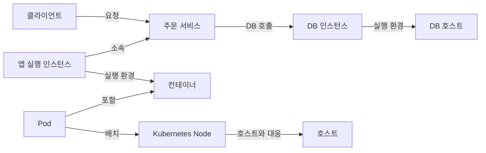

# 도메인 간 장애 분석

> 상태: 검토됨 · 적용 범위: 가상의 서비스 구성과 분석 흐름 제안 · 실환경 검증: 수행하지 않음

통합 모니터링에서는 서비스의 증상을 실행 환경과 외부 의존성으로 연결해 조사해야 합니다. 이 문서는 도메인 문서를 함께 사용하는 방법과 제품이 제공할 탐색 흐름을 제안합니다.

## 예시 구성

아래는 주문 애플리케이션이 Kubernetes에서 실행되고, DB는 별도 호스트에서 실행되는 가상의 구성입니다. 화살표에 적힌 관계를 따라 탐색하며, 모든 시스템이 이 구성을 가진다고 가정하지 않습니다.

이 그림의 서비스는 논리적인 애플리케이션 서비스입니다. Kubernetes의 `Service` 리소스와 구분합니다.

## 분석 예시

가정한 증상은 주문 API의 지연 증가입니다. 아래 순서는 탐색의 출발점이며 환경과 확보한 증거에 따라 바꿉니다.

1. **영향 범위를 정합니다.** 시작 시각, 지연된 요청, 오류 동반 여부, 영향을 받은 버전과 인스턴스를 확인합니다.
2. **데이터를 비교할 조건을 맞춥니다.** 시간 구간, 집계 간격, 측정 위치, 수집 누락 여부를 확인합니다.
3. **지연 구간을 좁힙니다.** 내부 처리, 풀 대기, 외부 호출 중 어느 구간이 증가했는지 조사합니다.
4. **관련 도메인으로 이동합니다.** 실행 환경의 자원, DB 활동·대기, 통신 경로를 가설에 맞춰 확인합니다.
5. **가설을 검증합니다.** 같은 시각에 값이 함께 변했다는 사실과 인과관계를 구분하고, 다른 설명이 가능한지 확인합니다.

| 원인 가설 | 지지할 수 있는 증거 | 가설을 다시 검토할 조건 |
| --- | --- | --- |
| DB 내부 대기로 지연됨 | 해당 요청과 연결된 DB 실행에서 대기 증가가 관측됨 | 지연이 DB 연결 획득 이전에 집중되거나 DB 실행 범위가 다름 |
| 특정 호스트의 경합 영향 | 그 호스트에 배치된 인스턴스에 영향이 집중되고 자원 압력이 동반됨 | 다른 호스트에서도 같은 영향이 나타나거나 시간대가 맞지 않음 |
| 통신 구간의 문제 | 같은 출발지·목적지 경로에서 연결·전송 이상이 관측됨 | 서버 내부 처리 시간만 증가하며 통신 구간의 관측은 일치하지 않음 |
| 배포 변경의 영향 | 변경된 버전과 요청 경로에 영향이 집중됨 | 변경되지 않은 대상에도 같은 시점에 동일 증상이 나타남 |

이 표의 증거 하나만으로 원인을 확정하지 않습니다. 관측 범위가 부족하면 원인 미확인으로 남기고 추가로 필요한 자료를 적습니다.

## 제품이 보존하면 좋은 문맥

다음 항목은 분석을 지원하기 위한 제품 설계 제안입니다.

- 선택한 시간 구간과 시간대, 집계 간격
- 서비스·배포 버전·실행 인스턴스의 식별 정보
- 사건 당시의 Pod·컨테이너·호스트 배치 관계
- 확보한 경우 요청·트레이스와 로그의 연결 정보
- 수집 원천, 마지막 관측 시각, 누락 여부
- 변경 이력과 원인 가설을 뒷받침하거나 반박하는 증거

관계가 추정된 것인지 직접 확인한 것인지 구분하고, 과거 사건을 현재 배치 관계로 해석하지 않도록 유효 시각을 다루는 방안을 검토합니다.

## 상세 분석 사례

1. [느린 주문 요청](slow-requests.md): 풀 대기, DB 잠금, CPU·네트워크 가설 비교
2. [재시작과 자원 경계](resource-failures.md): OOM·eviction, heap·cgroup, WAL 볼륨 증가
3. [적체와 재시도](backlogs-and-retries.md): 캐시 미스, 호출 증폭, 큐 해소 속도
4. [관측 자료 중단](missing-observations.md): 대상 장애와 공통 수집 경로 장애 구분

사례의 모든 수치는 원리를 설명하는 가상 입력입니다. 원인 확정에 필요한 증거와 현재 자료로 알 수 없는 부분을 구분합니다.

관련 문서: [애플리케이션](../application/README.md), [쿠버네티스](../kubernetes/README.md), [호스트](../host/README.md), [DB](../database/README.md), [네트워크](../network/README.md)

## 상세 본문

1. [사례: 느린 주문 요청과 DB 연결 대기](slow-requests.md)
2. [사례: 재시작, 메모리 한도와 볼륨 부족](resource-failures.md)
3. [사례: 캐시 미스, 재시도와 처리 적체](backlogs-and-retries.md)
4. [사례: 여러 그래프가 동시에 멈춘 경우](missing-observations.md)
5. [재현 실습: 계산, 실제 엔진, 운영 검증의 경계](reproducible-labs.md)
6. [종합 연습: 주문 지연을 증거로 좁혀 가기](capstone-investigation.md)
