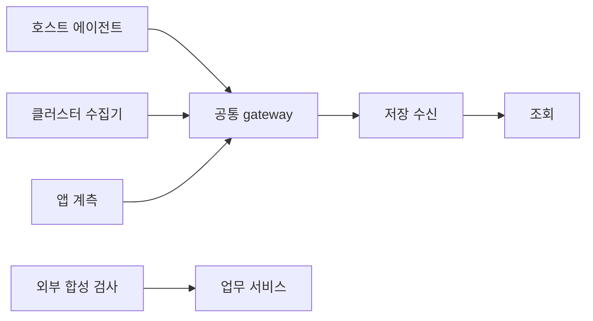

# 사례: 여러 그래프가 동시에 멈춘 경우

> 상태: 학습용 분석 사례 · 가상의 수집 구성과 관측 기록 · 실환경 검증 아님 · 편집 검토일: 2026-10-04

## 먼저 이해할 것

여러 그래프가 동시에 끊기면 여러 서버가 동시에 멈췄을 수도 있고 공통 수집 경로가 실패했을 수도 있습니다. 값이 없는 순간에는 대상 상태와 관측 상태를 분리해야 합니다. 이 사례는 마지막 성공 시각과 독립된 확인 경로로 두 가설을 비교합니다.

값이 사라지면 가장 먼저 대상 시스템이 고장났다고 생각하기 쉽습니다. 하지만 수집·전송·저장·조회 중 어느 경로에서도 무자료 상태가 생길 수 있습니다. **자료 없음은 확인할 사실이며, 원인은 조사할 가설**입니다.

## 구성과 증상

가상의 세 계정에서 호스트·Kubernetes·애플리케이션 자료가 하나의 gateway로 모입니다. 제품 화면은 15:02 이후 여러 대상의 지표를 새로 표시하지 못합니다. 외부 위치의 합성 주문 검사는 여전히 성공합니다.



합성 검사 성공은 그 검사가 통과한 경로의 성공입니다. 모든 사용자·지역·업무가 정상이라는 증거는 아닙니다. 그렇지만 `모든 서비스가 동시에 완전히 종료됐다`는 가설을 약화하는 자료가 됩니다. [사용자 경험과 합성 검사](../application/user-experience.md)

## 단계별로 시간을 확인한다

| 확인 위치 | 이 사례에서 추가로 관측한 사실 | 해석 |
| --- | --- | --- |
| 에이전트 로컬 | 15:02 이후에도 새 표본 생성 | 일부 대상·수집 경로는 계속 동작 |
| gateway 수신 | 수신 건수 계속 증가 | gateway 앞 전송은 일부 성공 |
| gateway exporter | 재시도 증가, 큐의 최고 대기 나이 증가 | 뒤쪽 전송·수신 경로 조사 필요 |
| 저장 수신 | 인증 오류 기록 | 자격 증명·접근 설정 가설 지지 |
| 제품 조회 | 마지막 실제 표본은 15:01:59 | 화면 평가 시각과 실제 freshness 구분 |

이 자료가 동일 tenant·신호·수집 경로를 가리키는지 확인해야 합니다. 다른 exporter의 성공값을 보고 모든 경로가 정상이라고 결론 내리지 않습니다.

예시에서는 자격 증명 교체 뒤 gateway의 설정이 갱신되지 않았다는 추가 증거를 확보했다고 가정합니다. 이로써 해당 전송 중단을 설명할 수 있지만, 중단 중 데이터의 최종 유실량은 아직 별도 확인이 필요합니다.

## 빈 그래프를 0으로 채울 때 생기는 문제

CPU·오류율·요청률을 0으로 채우면 업무가 조용하거나 정상인 것처럼 보일 수 있습니다. 마지막 값을 무기한 유지하면 최신 상태로 오인할 수 있습니다. [시간과 데이터 품질](../foundations/time-and-data-quality.md), [조회와 staleness](../product/storage-and-query.md)

제품은 다음을 별도 표시하는 방식을 검토할 수 있습니다.

- 마지막 실제 관측값과 시각
- 해당 대상의 기대 수집 주기
- 수집·전송·조회 상태
- 현재 범위에서 자료가 불완전하다는 표시

이것은 일반적인 화면 설계 제안입니다. 모든 지표에서 동일한 유지 시간이나 보간법이 맞지는 않습니다.

## 복구 후 늦게 온 자료와 중복

16:00에 전송이 복구되면 15:10에 발생한 표본이 늦게 도착할 수 있습니다. 발생 시각과 수신 시각을 모두 보존하면 backlog와 실제 현재 상태를 구분할 수 있습니다. 같은 표본의 재전송 중복도 가능하므로 단순 건수 증가만으로 유실이 없었다고 판단하지 않습니다. [수집 파이프라인](../product/collection-pipelines.md)

수신 시각으로 과거 표본을 현재 시간에 덧붙이면 16:00에 부하가 폭증한 것처럼 보일 수 있습니다. 반대로 원래 발생 시각으로 넣더라도 이미 평가가 끝난 과거 알림을 다시 계산할지는 제품의 별도 정책입니다. 실시간 통지와 사후 기록 보정의 차이를 정의해야 합니다.

## 완전성 계산의 전제

대상 50개가 1분마다 한 번씩 20분 내내 관측 대상이었다면 기대 관측은 `50 × 20 = 1,000회`입니다. 실제로 중복을 제거하고 확인한 표본이 940개면 이 정의에서 완전성은 94%입니다.

하지만 이것만으로 나머지 60개가 모두 영구 유실되었다고 말할 수는 없습니다. 아직 큐에 남았는지, 원천에서 생성되지 않았는지, 필터로 제거되었는지 확인해야 합니다. 대상 목록 자체가 불완전했다면 기대 관측 분모도 확정할 수 없습니다.

## 사건 기록 예시

```text
확인: 공통 gateway의 해당 exporter가 인증 오류로 전송하지 못함.
영향: 연결된 대상의 최신 상태를 제품에서 확인할 수 없었음.
업무 영향: 합성 경로는 성공했으나 전체 사용자 영향은 별도 확인 중.
데이터 영향: 재전송 완료 범위·누락·중복을 아직 대조 중.
회복 조건: 새 자료 도착 + backlog 처리 + 경로별 수집 상태 확인.
```

## 이해 확인

1. 모든 그래프가 비면 모든 대상이 내려간 것인가? **공통 관측 경로의 장애도 같은 증상을 만들 수 있다.**
2. 재전송이 끝나면 과거 알림도 자동으로 정확해지는가? **과거 재평가 정책과 늦은 자료 처리 규칙을 확인해야 한다.**
3. 합성 검사 하나의 성공이 전체 업무 정상의 증거인가? **해당 검사 범위만 확인한다.**
