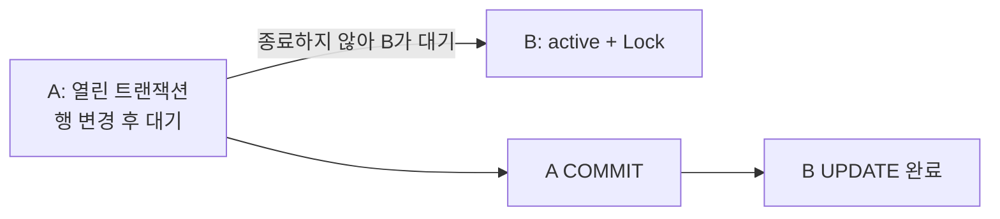

# PostgreSQL 실제 실습: 같은 값, 잠금 대기와 실패한 트랜잭션

> 상태: 검토됨 · 적용 범위: PostgreSQL 18.6, Ubuntu 24.04·WSL2의 전용 임시 인스턴스 · 검토일: 2026-10-04 · 11개 실제 시나리오

## 먼저 이해할 것

DB 연결은 대화 창, 트랜잭션은 그 대화에서 함께 성공하거나 취소할 작업 묶음이라고 생각해 볼 수 있습니다. 두 연결이 같은 행을 읽어도 어떤 시점의 데이터를 볼지, 누가 먼저 바꿀 수 있는지는 트랜잭션 규칙에 따라 달라집니다. CPU가 낮아도 상대 연결의 작업이 끝나기를 기다리느라 요청은 느려질 수 있습니다.

이 장은 [트랜잭션과 잠금](transactions-and-locks.md)을 실제 관측으로 연결합니다. [실행 코드](../../scripts/run_postgres_lab.py)와 [원시 결과](../../labs/results/1.1-postgresql.json)에 순서·버전·SQLSTATE를 보존했습니다.

## 준비와 격리 범위

공식 PostgreSQL APT 패키지의 고정 버전과 SHA256을 [패키지 목록](../../labs/postgresql/packages.json)에 기록했습니다. 추출한 실행 파일을 사용해 매번 새 데이터 디렉터리를 만들었습니다. 시스템 패키지 설치나 기존 DB 접속 없이 실행했고 TCP는 끈 채 권한 0700 임시 디렉터리의 Unix socket만 열었습니다. [공식 Ubuntu 배포 안내](https://www.postgresql.org/download/linux/ubuntu/)

```bash
python3 scripts/get_postgres_lab.py
python3 scripts/run_postgres_lab.py
```

명령은 Ubuntu 24.04 amd64의 일반 사용자로 저장소 루트에서 실행합니다. 결과는 `.lab-runs/postgresql.json`에 기록합니다. 임시 서버는 종료하고 데이터는 삭제합니다. 이 실습의 로컬 trust 인증은 외부 접속이 가능한 운영 DB의 구성 예시로 사용하지 않습니다.

## 실습 1·2: 같은 트랜잭션 안의 두 SELECT

행의 초기 값은 10입니다. A가 읽은 뒤 B가 값을 20으로 바꾸고 commit합니다. 이후 A가 다시 읽고 자기 트랜잭션을 끝낸 뒤 한 번 더 읽습니다.

| A의 격리 수준 | 첫 SELECT | B commit 뒤 같은 트랜잭션 | A 종료 뒤 새 SELECT |
| --- | ---: | ---: | ---: |
| READ COMMITTED | 10 | 20 | 20 |
| REPEATABLE READ | 10 | 10 | 20 |

PostgreSQL READ COMMITTED의 일반 SELECT는 문장 시작 시점의 snapshot을 사용합니다. REPEATABLE READ에서는 트랜잭션의 첫 비제어 문장에서 정한 snapshot을 이후 조회가 공유합니다. 이는 PostgreSQL의 규약이며 이름이 같은 다른 엔진의 모든 세부 동작을 대신하지 않습니다. [PostgreSQL 18 격리 수준](https://www.postgresql.org/docs/18/transaction-iso.html)

화면의 “같은 트랜잭션” 표시만으로 항상 같은 값을 본다고 가정하면 안 됩니다. 격리 수준과 SELECT의 종류도 관측 문맥입니다.

## 실습 3: active인데 CPU를 실행하고 있지 않다

A가 행을 UPDATE하고 commit하지 않았습니다. B가 같은 행을 UPDATE하려고 하자 다음 상태를 관측했습니다.

| 관측 | 실제 값 | 해석 |
| --- | --- | --- |
| A의 state | `idle in transaction` | 열린 트랜잭션 안에서 다음 클라이언트 명령을 기다림 |
| B의 state | `active` | 문장을 수행하는 상태 |
| B의 wait_event_type | `Lock` | 잠금 관련 대기 |
| B의 wait_event | `transactionid` | 이번 실행에서 관측한 구체적 대기 |
| `pg_blocking_pids(B)` | A의 PID 포함 | B가 기다리는 차단 관계 |

A가 commit하자 B도 완료되었습니다. 초기 10에서 각각 1을 더해 최종 값은 12였습니다. `active`는 CPU 실행 중이라는 의미와 동일하지 않으며 state와 wait 정보를 함께 읽습니다. [pg_stat_activity](https://www.postgresql.org/docs/18/monitoring-stats.html#MONITORING-PG-STAT-ACTIVITY-VIEW), [pg_blocking_pids](https://www.postgresql.org/docs/18/functions-info.html)



이 결과로 모든 행 잠금 대기가 항상 같은 wait_event 이름을 가진다고 단정하지 않습니다. 대기 종류, 병렬 작업, prepared transaction 등은 실제 함수 규약에 맞춰 해석합니다.

## 실습 4·5: 시간 초과 이후 연결을 그대로 쓰면

| 설정과 작업 | 첫 실패 SQLSTATE | 같은 트랜잭션의 다음 SELECT |
| --- | --- | --- |
| `lock_timeout=150ms`, 잠긴 행 UPDATE | `55P03` | `25P02` |
| `statement_timeout=75ms`, `pg_sleep(1)` | `57014` | `25P02` |

시간은 짧은 실습용 값입니다. 서비스의 권장 timeout이 아닙니다. `55P03`은 lock_not_available, `57014`는 query_canceled, `25P02`는 in_failed_sql_transaction입니다. 같은 SQLSTATE를 모든 경우 하나의 원인으로 확정하지 않으며, 특히 query_canceled에는 다른 취소 경로도 있습니다. [오류 코드](https://www.postgresql.org/docs/18/errcodes-appendix.html), [클라이언트 연결 기본값과 timeout](https://www.postgresql.org/docs/18/runtime-config-client.html)

이번에는 명시적 BEGIN 안에서 오류를 일으켰습니다. 클라이언트는 rollback 등 올바른 정리를 한 뒤 연결을 다시 사용해야 합니다. 연결 풀이 오류 상태의 연결을 정상 연결처럼 돌려주면 다음 요청은 원래 SQL과 무관한 트랜잭션 오류를 만날 수 있습니다.

## 실습 6·7: 문장 실패와 SAVEPOINT

먼저 A가 10을 40으로 바꾸고, 음수를 금지한 CHECK 제약을 위반했습니다. `23514`가 발생하고 다음 SELECT는 `25P02`였습니다. 전체 ROLLBACK 뒤 값은 10이었습니다.

두 번째 실행에서는 40으로 바꾼 뒤 SAVEPOINT를 만들었습니다. 잘못된 UPDATE 후 그 SAVEPOINT로 돌아가자 SELECT가 가능했고 앞선 40은 유지되었습니다. 이후 commit했습니다. `ROLLBACK TO SAVEPOINT`는 저장점 이후의 작업을 되돌리는 기능입니다. [ROLLBACK TO SAVEPOINT](https://www.postgresql.org/docs/18/sql-rollback-to.html)

[기존 SQLite 실습](../cross-domain/reproducible-labs.md)에서는 CHECK 오류 뒤에도 앞선 변경 40을 같은 트랜잭션에서 읽을 수 있었습니다. **“SQL 문장 하나가 실패하면 다음에 무엇을 할 수 있는가”는 엔진·오류·트랜잭션 문맥에 따라 확인해야 합니다.**

## 실습 8: 서로의 행을 기다리는 교착 상태

A가 1번 행을, B가 2번 행을 변경한 뒤 서로 상대 행을 변경하게 했습니다. 두 UPDATE 중 하나가 `40P01`로 실패하고 다른 하나는 진행했습니다. 어느 연결이 희생될지는 고정하지 않고 결과를 기록한 뒤 두 트랜잭션을 정리했습니다.

일반 잠금 대기는 상대 작업이 끝나면 풀릴 수 있습니다. 교착 상태는 서로가 기다리는 순환 때문에 그대로는 진행할 수 없는 경우입니다. `deadlock_timeout`은 일반 SQL의 최대 실행 시간을 의미하지 않습니다. [명시적 잠금과 교착 상태](https://www.postgresql.org/docs/18/explicit-locking.html#LOCKING-DEADLOCKS)

## 실습 9: 접속 권한과 상세 관측 권한

일반 모니터링 역할로 다른 연결을 조회했을 때 `state`는 NULL, `query`는 `<insufficient privilege>`였습니다. 임시 인스턴스에서 `pg_read_all_stats`를 부여한 뒤 state와 query를 읽을 수 있었습니다. [기본 제공 역할](https://www.postgresql.org/docs/18/predefined-roles.html)

따라서 NULL을 “세션이 idle이다” 또는 “쿼리가 없다”로 바꾸면 실제 접근 제한을 숨기게 됩니다. 이 역할은 범위가 넓으므로 운영 환경에는 수집할 필드와 접근 정책을 먼저 정합니다. 실습 역할을 그대로 모든 제품 배포의 최소 권한이라고 부르지 않습니다.

## 실습 10·11: 통계 snapshot과 실제 수집 SQL

`stats_fetch_consistency=snapshot`인 A의 한 트랜잭션에서 xact_commit은 4로 관측되었습니다. B가 작업하고 통계 flush를 요청한 뒤에도 A는 4를 보았습니다. `pg_stat_clear_snapshot()` 이후에는 10을 읽었습니다. 이 6의 차이를 B의 업무 요청 6건으로 해석하지 않습니다. setup·관측 쿼리도 통계에 영향을 줍니다. [누적 통계의 갱신과 snapshot](https://www.postgresql.org/docs/18/monitoring-stats.html#MONITORING-STATS-VIEWS)

읽기 전용 트랜잭션과 timeout을 포함한 [수집 SQL](../../labs/postgresql/collect-database.sql)도 별도로 실행했습니다. 새 인스턴스에서 `stats_reset`이 NULL인 행이 실제 반환되었습니다. 이 필드를 항상 존재하는 reset 시각으로 가정하지 않고, 인스턴스·DB 식별과 다른 수명 단서를 함께 처리해야 합니다.

## 이해 확인

1. active 세션 수를 CPU 실행 세션 수로 표시해도 되는가? **Lock 등 대기 중인 active 세션을 구분해야 합니다.**
2. 명시적 트랜잭션에서 timeout 뒤 아무 정리 없이 다음 SQL을 보내도 되는가? **이번 실행에서는 25P02가 발생했습니다. 연결·트랜잭션 정리가 필요합니다.**
3. stats_reset이 NULL이면 통계값도 모두 0인가? **실제 결과에서 누적값이 있는 행에도 NULL이 반환되었습니다.**
4. 이 실습이 DB 장애 전환과 디스크 내구성을 검증했는가? **한 임시 인스턴스의 동시성·관측 동작을 확인했습니다. 복제·전원 장애·HA는 별도 범위입니다.**
