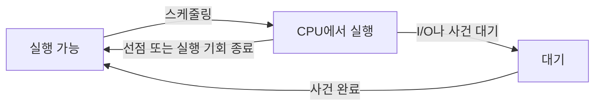

# CPU 실행 시간과 스케줄링 대기

> 상태: 검토됨 · 적용 범위: Linux CPU 관측, man-pages 6.19 및 Linux 6.12 회계 코드 확인 · 원천 확인일: 2026-10-03 · 실습 여부: 원천·가상 예시 중심; 연결 실습의 범위는 본문

## 먼저 이해할 것

CPU 사용 시간은 프로그램이 실제로 실행 기회를 사용한 시간입니다. 응답을 기다린 경과 시간 전체와는 다릅니다. 여러 스레드가 동시에 실행되면 1초 동안 CPU 시간 합계가 1초보다 커질 수 있습니다. 따라서 CPU 100%를 읽을 때는 한 논리 CPU 기준인지 호스트 전체 기준인지부터 확인합니다.

CPU 사용률을 이해하려면 실제 실행 시간, 실행 기회를 기다린 시간, I/O 등 다른 사건을 기다린 시간을 구분해야 합니다. 이 장은 호스트와 프로세스의 CPU 지표를 계산하고 느린 서비스와 연결하는 방법을 설명합니다.

## 실행 가능 상태와 실행 중 상태

운영체제의 스케줄러는 실행 가능한 스레드 중 다음에 CPU를 사용할 대상을 선택합니다. 실행할 수 있어도 다른 스레드가 CPU를 사용 중이면 기다릴 수 있습니다. 우선순위·스케줄링 정책·CPU affinity는 실행 기회에 영향을 줍니다. [Linux sched](https://man7.org/linux/man-pages/man7/sched.7.html)

이 장에서 논리 CPU는 운영체제가 작업을 배치하는 CPU 단위입니다. 논리 CPU 개수만으로 물리 코어 수나 실제 처리 성능을 동일하게 비교하지 않습니다. SMT, 주파수, 명령 특성, 캐시와 메모리 접근 등이 성능 해석에 영향을 줄 수 있어 하드웨어 조건을 함께 기록합니다.



그림은 이해를 위한 단순화입니다. 모든 대기를 CPU 부족으로 분류하지 않습니다. Linux 일반 스케줄러의 내부 알고리즘도 버전에 따라 변하며, 커널 문서는 6.6부터 EEVDF로 전환하기 시작했다고 설명합니다. 모든 Linux를 CFS 하나로 설명하지 않습니다. [Linux EEVDF](https://docs.kernel.org/scheduler/sched-eevdf.html)

## 호스트 CPU 시간의 원천

`/proc/stat`의 `cpu` 행은 집계값, `cpuN` 행은 개별 CPU의 시간을 제공합니다. 단위는 `USER_HZ`이며 실제 변환값은 `_SC_CLK_TCK`로 확인합니다. [Linux proc_stat](https://man7.org/linux/man-pages/man5/proc_stat.5.html)

| 필드 | 의미 |
| --- | --- |
| user | nice≤0인 작업의 사용자 모드 실행 시간 |
| nice | nice>0인, 낮은 우선순위 작업의 사용자 모드 실행 시간 |
| system | 커널 모드 실행 시간 |
| idle | idle 태스크 시간 |
| iowait | I/O 대기와 관련된 CPU 시간 회계 항목 |
| irq | 하드웨어 인터럽트 처리 시간 |
| softirq | 소프트웨어 인터럽트 처리 시간 |
| steal | 가상화 환경에서 다른 실행 때문에 빼앗긴 시간 |

Linux 6.12의 `account_user_time()`은 `task_nice(p) > 0`일 때 nice에, 그렇지 않으면 user에 계정합니다. 따라서 음수 nice의 높은 우선순위 작업도 user에 포함됩니다. [CPU 회계 코드](https://github.com/torvalds/linux/blob/v6.12/kernel/sched/cputime.c#L119-L133)

`guest`와 `guest_nice`는 별도로 노출되지만 해당 게스트 시간은 각각 user와 nice 회계에도 포함됩니다. 총합에 다시 더하면 중복됩니다. 이는 Linux 6.12의 `account_guest_time()`에서도 확인됩니다. [Linux CPU 회계 코드](https://github.com/torvalds/linux/blob/v6.12/kernel/sched/cputime.c)

## 사용률은 포함하는 시간의 정의가 필요하다

아래 “비 idle” 식은 iowait와 steal을 포함하지만 실행 시간 식은 제외합니다. steal은 [가상화의 실행 기회 대기](virtualization.md)와 함께 해석합니다.

서로 같은 구간의 증가량을 `Δ`로 표현하면, 위 표의 첫 여덟 항목을 사용해 다음과 같이 정의할 수 있습니다.

```text
ΔT = Δuser + Δnice + Δsystem + Δidle
     + Δiowait + Δirq + Δsoftirq + Δsteal

실행 시간 비율 = (Δuser + Δnice + Δsystem + Δirq + Δsoftirq) / ΔT
비 idle 비율 = (ΔT - Δidle) / ΔT
```

두 공식은 서로 다른 질문에 답합니다. 이 문서에서는 구분을 설명하려고 이름을 붙였으며 특정 수집기의 `CPU usage` 정의라고 주장하지 않습니다. 수집기가 어떤 항목을 포함하는지 지표 명세에 기록합니다.

논리 CPU 4개를 10초 동안 관측한 **가상 입력**입니다. 모든 값은 초로 변환했고 온라인 CPU 집합은 일정하다고 가정합니다.

| 구분 | 증가한 CPU 시간 |
| --- | ---: |
| user와 nice | 12초 |
| system | 4초 |
| irq와 softirq | 1초 |
| idle | 20초 |
| iowait | 2초 |
| steal | 1초 |
| 총합 | 40초 |

실행 시간 비율은 `17 / 40 = 42.5%`, 비 idle 비율은 `20 / 40 = 50%`입니다. 이름을 모두 CPU 사용률이라고만 적으면 서로 다른 정상적인 계산을 제품 간 오류로 오해할 수 있습니다.

실제 수집에서는 CPU 추가·제거, 재부팅, 카운터 감소, 0인 분모를 처리해야 합니다. 특히 iowait는 정확한 병목 시간으로 해석하기 어렵고 일부 조건에서 감소할 수 있다고 문서에 명시되어 있습니다. [Linux proc_stat의 iowait 설명](https://man7.org/linux/man-pages/man5/proc_stat.5.html)

## 프로세스의 100퍼센트는 호스트의 100퍼센트와 다를 수 있다

**분모 주의:** 경과 초를 어떤 시계로 쟀는지 남깁니다. Linux MONOTONIC도 주파수 조정을 받으므로 [CPU clock·RAW 비교 실습](linux-observation-lab.md)을 참고합니다.

`/proc/PID/stat`에는 사용자 시간 `utime`, 시스템 시간 `stime`, 시작 시각 `starttime` 등이 있습니다. 시간 단위를 확인해 프로세스의 CPU 사용 시간을 계산할 수 있습니다. [Linux proc_pid_stat](https://man7.org/linux/man-pages/man5/proc_pid_stat.5.html)

다음은 자식 프로세스 시간을 제외한 프로세스 자체 시간을 사용하는 **정의 예시**입니다.

```text
사용한 CPU 코어 수 = Δ(utime + stime) / CLK_TCK / 경과 초
논리 CPU 1개 기준 비율 = 사용한 CPU 코어 수 × 100
호스트 전체 기준 비율 = 사용한 CPU 코어 수 / 온라인 CPU 수 × 100
```

여러 스레드가 10초 동안 합계 25 CPU초를 사용했다면 평균 2.5개 논리 CPU에 해당합니다. 한 CPU 기준으로 250%, CPU 8개 호스트 전체 기준으로 31.25%입니다. CPU 집합이 바뀌는 구간이나 제한된 CPU 집합을 사용하는 프로세스에는 분모를 별도로 정의해야 합니다.

## Load average와 PSI

Linux load average는 실행 가능 상태와 D 상태(인터럽트 불가 대기)의 작업을 포함한 부하 평균입니다. `/proc/loadavg`는 1·5·15분 부하와 현재 실행 가능한 스케줄링 대상 수 등을 제공합니다. CPU 사용률 퍼센트가 아닙니다. [Linux proc_loadavg](https://man7.org/linux/man-pages/man5/proc_loadavg.5.html)

PSI는 자원 부족으로 작업의 진행이 막힌 시간을 측정합니다. CPU 사용률과 달리 **진행하지 못한 시간**에 답하며, 시스템 CPU full의 무효 0을 전 CPU 포화율로 읽지 않습니다. 단위·가용성·trigger 계약은 [PSI 정본](numa-and-pressure.md)에 있습니다.

**해석:** 사용률이 높아도 요청이 목표 시간 안에 처리되면 자원을 잘 활용하고 있을 수 있습니다. 반대로 호스트 평균이 낮아도 특정 CPU, 단일 스레드, affinity 또는 컨테이너 한도에서 병목이 생길 수 있습니다. 이 판단은 관측 범위와 서비스 지연을 함께 비교해야 한다는 분석 원칙입니다.

## 장애 조사 순서

| 관측 | 조사할 가설 | 추가 증거 |
| --- | --- | --- |
| 높은 user 비율 | 애플리케이션 계산량 증가 | 요청량, 실행 스레드, CPU 프로파일 |
| 높은 system·인터럽트 비율 | 커널 처리 증가 | 시스템 호출, 통신량, 장치·커널 프로파일 |
| 높은 load와 낮은 실행 비율 | CPU 이외 대기 또는 제한 | 작업 상태, I/O 지연, cgroup 상태 |
| 호스트 평균은 낮고 일부 요청만 느림 | 특정 실행 자원에 집중 | CPU별 사용, 스레드별 시간, 배치·affinity |
| steal 증가 | 가상화 계층의 실행 기회 문제 | 하이퍼바이저 지표와 같은 시간대 비교 |

표는 가설이며 지표 하나로 원인을 확정하지 않습니다.

## 읽기 전용 수집 예시

Linux에서 다음 명령은 원천 값을 읽습니다. 일반적으로 작은 `/proc` 조회이지만 가시성은 컨테이너·권한 설정에 따라 다릅니다. 두 번 이상 관측하고 경과 시각을 함께 기록해야 증가율을 구할 수 있습니다. 이 문서 작성 환경에서는 실행하지 않았습니다.

```bash
getconf CLK_TCK
cat /proc/stat
cat /proc/loadavg
cat /proc/pressure/cpu
```

## 제품 적용 제안과 이해 확인

제품에는 호스트 평균, CPU별 분포, 실행 시간의 구성, 프로세스별 사용과 수집 품질을 연결합니다. CPU 비율의 분모와 포함 항목을 도움말에서 확인할 수 있게 합니다.

- CPU 8개 중 1개만 계속 실행 중이면 호스트 평균은 얼마인가? **동일한 시간 기준에서는 12.5%이다. 해당 CPU의 병목 가능성은 남는다.**
- iowait 20%면 디스크 장치가 20% 사용됐는가? **그렇게 해석할 수 없다. 장치 통계와 다른 회계 항목이다.**
- 프로세스 250%는 잘못된 값인가? **한 논리 CPU 기준이고 여러 스레드를 합쳤다면 가능한 값이다.**

관련: [메모리](memory.md), [블록 I/O](disk-io.md), [컨테이너 자원 제어](../containers/resource-control.md)

이전: [호스트 도메인](README.md) · 다음: [메모리와 가상 주소 공간 및 메모리 압력](memory.md) · [분야 목차](README.md)
