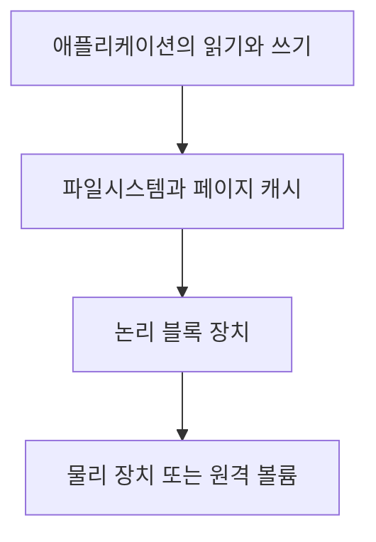

# 블록 I/O와 파일시스템 용량

> 상태: 검토됨 · 범위: Linux 블록 계층과 statvfs, sysstat iostat · 공식 자료 확인: 2026-10-03 · 편집 검토일: 2026-10-04

## 먼저 이해할 것

저장장치에서는 남은 공간과 처리 속도를 따로 봅니다. 창고가 넓어도 출입구가 막힐 수 있듯이 공간이 충분한데 읽기·쓰기가 느릴 수 있습니다. 작은 파일을 많이 읽는 작업과 큰 파일 하나를 읽는 작업은 총 byte가 같아도 I/O 횟수가 다릅니다. IOPS·처리량·지연·용량을 함께 보는 이유입니다.

디스크 문제는 공간이 부족한 문제와 읽기·쓰기가 느린 문제로 나뉩니다. 두 문제는 함께 발생할 수 있지만 수집 원천과 계산은 다릅니다. 이 장에서는 장치별 I/O 통계와 마운트된 파일시스템의 용량을 구분합니다.

## 관측 계층을 먼저 정한다



그림은 대표적인 경로를 단순화한 것입니다. 직접 I/O, 네트워크 파일시스템, 객체 API 등은 경로가 달라집니다. 계층 사이에서 병합·분할·캐시가 개입할 수 있으므로 애플리케이션 호출 수와 장치 작업 수를 같은 단위로 간주하지 않습니다.

Linux 블록 통계에는 완료된 읽기·쓰기 작업, 병합된 요청, 전송 섹터, 작업별 시간, 진행 중 작업 등이 있습니다. 인접한 요청은 병합될 수 있고 통계는 재부팅·장치 재초기화 등에서 초기화될 수 있습니다. [Linux I/O statistics](https://docs.kernel.org/admin-guide/iostats.html)

## 원천 카운터와 단위

`/sys/block/장치/stat`와 `/proc/diskstats`에서 블록 계층의 통계를 얻습니다. 해당 섹터 카운터는 장치의 물리 섹터 크기와 무관하게 **512바이트 단위**입니다. 작업 시간은 병렬 요청 각각의 시간을 더하므로 1초 동안 1,000 ms보다 많이 증가할 수 있습니다. [Linux Block statistics](https://docs.kernel.org/block/stat.html)

| 관측량 | 종류 | 계산에 사용하는 의미 |
| --- | --- | --- |
| 완료 읽기·쓰기 수 | 누적값 | 구간 완료 작업 수 |
| 읽기·쓰기 섹터 수 | 누적값 | 512를 곱해 구간 바이트 수 계산 |
| 읽기·쓰기 시간 | 누적값 | 해당 작업 시간 합계 |
| 진행 중 I/O 수 | 현재값 | 관측 시점의 진행 중 작업 |
| I/O 활성 시간 | 누적값 | 장치의 I/O 활동 시간 회계 |
| 가중 I/O 시간 | 누적값 | 진행 중 작업 수를 반영한 시간 합계 |

커널과 장치 종류에 따라 추가 discard·flush 필드가 있습니다. 필드 수와 버전을 확인하고 읽기·쓰기만의 계산을 전체 작업의 계산이라고 표시하지 않습니다.

## IOPS와 처리량 및 평균 지연

아래는 같은 장치·구간에서 초기화가 없는 경우의 **읽기 지표 정의**입니다.

```text
읽기 IOPS = Δ완료 읽기 수 / 경과 초
읽기 처리량 = Δ읽기 섹터 × 512 / 경과 초
평균 읽기 크기 = Δ읽기 섹터 × 512 / Δ완료 읽기 수
평균 읽기 지연 = Δ읽기 시간(ms) / Δ완료 읽기 수
```

가상 입력에서 10초 동안 읽기 2,000회, 읽기 섹터 32,768개, 읽기 시간 합계 6,000 ms가 증가했습니다.

| 계산 결과 | 값 |
| --- | ---: |
| 읽기 IOPS | 200회/초 |
| 읽기 데이터량 | 16 MiB |
| 읽기 처리량 | 1.6 MiB/초 |
| 평균 읽기 크기 | 8.192 KiB |
| 평균 읽기 지연 | 3 ms |

이 평균으로 p95 지연을 알 수는 없습니다. 구간을 걸쳐 시작·완료되는 요청과 원천 회계 방식 때문에 짧은 구간의 단순 비율은 실제 개별 요청 분포와 다를 수도 있습니다. 작업 수가 0일 때 평균 지연은 정의되지 않으므로 0 ms와 구분하는 정책을 정합니다.

`iostat`의 `await`는 대기열과 처리 시간을 포함하는 평균이며 장치 내부 순수 실행 시간만 뜻하지 않습니다. 읽기와 쓰기, flush 등을 나누어 보면 요청 구성 변화의 영향을 조사할 수 있습니다. [iostat 매뉴얼](https://man7.org/linux/man-pages/man1/iostat.1.html)

## 활성 시간 비율과 처리 한도

가상 예시에서 10초 동안 I/O 활성 시간이 8,000 ms 증가하면 활성 시간 비율은 80%입니다. 이를 장치가 이론적 최대 IOPS의 80%를 사용했다는 뜻으로 해석하면 안 됩니다.

병렬 요청을 처리하는 SSD나 RAID에서는 `iostat`의 `%util`이 장치 성능 한도를 직접 나타내지 않는다고 문서에 명시되어 있습니다. 커널의 활성 시간 집계에도 버전별 회계 특성이 있습니다. [iostat의 %util](https://man7.org/linux/man-pages/man1/iostat.1.html), [Linux I/O 시간 회계](https://docs.kernel.org/admin-guide/iostats.html)

포화 여부는 지연, 작업량, 작업 크기, 대기·동시 처리량, 서비스의 성능 한도를 함께 비교합니다. 모델별 성능 수치를 임의의 모든 디스크 기준값으로 사용하지 않습니다.

## 파일시스템의 용량

`statvfs`는 마운트된 파일시스템의 통계를 제공합니다. `f_blocks`, `f_bfree`, `f_bavail`은 `f_frsize` 단위로 해석하며, `f_bavail`은 비특권 사용자에게 사용 가능한 블록입니다. inode 관련 필드도 별도로 존재합니다. 모든 파일시스템에서 모든 필드가 같은 의미를 갖는다고 보장되지는 않습니다. [statvfs](https://man7.org/linux/man-pages/man2/statvfs.2.html)

```text
총 바이트 = f_blocks × f_frsize
미사용 바이트 = f_bfree × f_frsize
비특권 사용자 가용 바이트 = f_bavail × f_frsize
사용 바이트 = (f_blocks - f_bfree) × f_frsize
```

설명용으로 총 1,000블록, 미사용 200블록, 비특권 가용 150블록을 가정합니다. 사용량은 800블록입니다. 총량 기준 비율은 80%, `사용량 / (사용량 + 비특권 가용량)`은 약 84.21%입니다. 분모가 다르므로 결과가 달라집니다. 제품이 제공하는 비율은 정의를 명시합니다.

파일을 만들 수 없는 문제를 공간 바이트만으로 조사하지 않습니다. inode, 할당량, 마운트의 읽기 전용 상태 등도 확인할 대상입니다.

## 파일을 지웠는데 공간이 남지 않는 경우

Linux에서 마지막 이름을 삭제해도 프로세스가 파일을 열고 있으면 마지막 참조가 닫힐 때까지 파일이 유지될 수 있습니다. [Linux unlink](https://man7.org/linux/man-pages/man2/unlink.2.html)

따라서 파일 이름으로 디렉터리를 합산한 결과와 파일시스템이 보고한 사용량이 다르면 열린 삭제 파일도 조사 후보입니다. 스냅샷·할당 방식·마운트 범위 등 다른 이유도 있으므로 이를 유일한 원인이라고 단정하지 않습니다.

## 장애 조사와 수집 구현

| 증상 | 다음에 확인할 내용 |
| --- | --- |
| 높은 평균 지연 | 읽기·쓰기 구성, 작업 크기, 동시 작업과 하위 계층 지연 |
| 처리량이 일정 수준에서 멈춤 | 장치·호스트·클라우드 볼륨 한도, 작업의 병렬성 |
| 사용량 급증 | 어떤 마운트와 파일·업무가 증가했는지 |
| 공간은 있어 보이는데 쓰기 실패 | 비특권 가용량, inode, 할당량, 오류와 마운트 상태 |
| DB 쓰기 지연 | DB 로그·동기화 동작과 호스트·볼륨 지표의 같은 시간대 변화 |

**제품 적용 제안:** 장치와 파티션, device mapper 계층을 무조건 합산하지 않습니다. 같은 I/O를 서로 다른 계층에서 중복 계산할 수 있으므로 장치 관계와 집계 경계를 정의합니다. 이름 변경에 대비해 장치 식별과 수명도 보존합니다.

Linux의 읽기 전용 조회 예시는 다음과 같습니다. `iostat`는 sysstat 설치가 필요하며 옵션은 설치 버전에서 확인합니다. 파일시스템 조회는 원격·불응답 마운트에서 지연될 수 있어 수집기에 시간 제한을 설계합니다. 이 문서에서는 명령을 실행하지 않았습니다.

```bash
cat /proc/diskstats
iostat -dx -y 1 3
df -h
df -i
```

## 이해 확인

- 초당 100회 I/O가 항상 초당 1,000회보다 적은 바이트를 처리하는가? **작업 크기가 달라 알 수 없다.**
- `%util=100%`면 모든 SSD가 최대 성능인가? **병렬 장치의 성능 한도를 그 값만으로 확정할 수 없다.**
- 평균 지연이 3 ms면 모든 요청이 3 ms 이내인가? **평균은 지연 분포의 상한을 보장하지 않는다.**

관련: [메모리](memory.md), [스토리지](../storage/README.md), [분포와 집계](../foundations/distributions.md)
