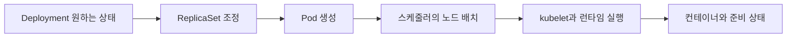

# Kubernetes 객체와 제어 루프

> 상태: 검토됨 · 적용 범위: Kubernetes API의 공통 객체 모델과 내장 컨트롤러 · 원천 확인일: 2026-10-04 · 실습 여부: 원천·가상 예시 중심; 연결 실습의 범위는 본문

## 먼저 이해할 것

Kubernetes에서는 원하는 상태를 API 객체에 적고 controller가 실제 상태를 맞추려고 반복합니다. 복제 수 3을 요청했다는 것과 준비된 Pod가 3개라는 것은 다른 사실입니다. 이 반복 구조를 알아야 desired·current·ready 숫자의 차이를 바로 장애로 단정하지 않고 진행 상태로 해석할 수 있습니다. 제품은 API 수용과 실제 실행·준비 완료를 별도로 표시합니다.

## 선언과 실행 사이의 단계

컨트롤러는 API의 원하는 상태를 관찰하고 실제 상태가 그 방향으로 움직이도록 작업합니다. 여러 컨트롤러가 서로 다른 부분을 담당하며, 한 컨트롤러가 모든 실행을 직접 수행하는 구조가 아닙니다. [Kubernetes Controllers](https://kubernetes.io/docs/concepts/architecture/controller/)

아래는 일반적인 Deployment를 단순화한 흐름입니다. 재시도와 실패 경로는 생략했습니다.



이때 API server는 API 접근을 처리하고, scheduler는 아직 배치되지 않은 Pod의 노드를 선택하며, kubelet은 노드에서 Pod의 실행을 관리합니다. etcd는 클러스터 데이터의 저장소입니다. [Kubernetes 구성 요소](https://kubernetes.io/docs/concepts/overview/components/)

따라서 “배포가 느리다”는 현상은 API 처리, 객체 조정, 배치, 이미지 준비, 컨테이너 시작, 준비 검사 중 어디에서 지연됐는지 나눠 봅니다. 이 경계는 제품의 이벤트 타임라인 설계 제안입니다.

## 이름, UID, 소유 관계

객체 이름은 해당 리소스의 범위 안에서 식별에 쓰입니다. 이름이 같은 객체를 삭제 후 다시 만들 수 있으므로 수명 전체를 식별하려면 UID를 구분해야 합니다. Kubernetes는 클러스터 수명 동안 생성된 객체를 서로 다른 UID로 구별합니다. [Object Names and IDs](https://kubernetes.io/docs/concepts/overview/working-with-objects/names/)

제품 내부 키의 예는 다음과 같습니다. Kubernetes 자체의 새로운 표준 키를 정의하는 것이 아니라 다중 클러스터 수집을 위한 제안입니다.

```text
객체 인스턴스 키 = 제품의 클러스터 ID + metadata.uid
표시 경로 = API group / kind / namespace / name
```

소유 관계는 `metadata.ownerReferences`의 UID를 사용해 추적할 수 있습니다. 이름 접두사를 잘라서 Deployment를 추측하는 방법보다 직접적인 근거입니다. 모든 관계가 소유 관계는 아닙니다. Service의 선택 대상 관계와 Pod의 노드 배치 관계는 별도로 모델링해야 합니다. [Owners and Dependents](https://kubernetes.io/docs/concepts/overview/working-with-objects/owners-dependents/)

## 원하는 수와 준비된 수

Deployment에는 원하는 복제본 수와 갱신·준비·가용 상태를 설명하는 값들이 있습니다. 새 Pod는 준비되었더라도 `minReadySeconds`를 충족하기 전에는 가용 상태로 계산되지 않을 수 있습니다. 진행 제한 시간을 넘기면 진행 실패 조건을 보고하지만 이것이 자동 롤백을 의미하지는 않습니다. [Deployments](https://kubernetes.io/docs/concepts/workloads/controllers/deployment/)

가상 예로 원하는 복제본이 5, 생성된 Pod가 5, 준비된 Pod가 4, 가용 Pod가 3이라면 “Pod 5개 존재”만으로 배포 성공을 판단할 수 없습니다. 제품 화면에는 수치의 정의와 최신 관측 시각을 함께 표시합니다. 비율도 `가용 3 / 원하는 5 = 60%`와 `준비 4 / 생성 5 = 80%`가 서로 다른 질문임을 드러내야 합니다.

## 삭제 요청과 삭제 완료

finalizer가 있는 객체에 삭제를 요청하면 `deletionTimestamp`가 기록되고 정리 조건이 완료될 때까지 객체가 남을 수 있습니다. finalizer는 보통 수행할 코드를 직접 담는 것이 아니라 책임 있는 컨트롤러가 처리할 키를 표현합니다. [Finalizers](https://kubernetes.io/docs/concepts/overview/working-with-objects/finalizers/)

따라서 삭제 API 성공 직후 인벤토리에서 즉시 없애는 설계는 실제 남아 있는 대상을 감출 수 있습니다. 삭제 요청 시각과 관측상 제거 시각을 구별하고, 장시간 남는 경우 관련 컨트롤러와 정리 작업을 조사하도록 제안합니다.

## 관측 시차를 다루는 방법

한 번의 화면 갱신에서 Deployment와 Pod를 서로 다른 시각에 읽을 수 있습니다. 그 사이 조정이 진행되면 집계가 잠시 일치하지 않을 수 있습니다. 제품은 이를 즉시 데이터 손상으로 단정하지 말고 수집 시각과 캐시 동기화 상태를 확인해야 합니다.

`resourceVersion`의 비교는 응답한 API server의 버전·종류와 보장 규약을 기준으로 합니다. 문자열을 보존하고, [인벤토리의 비교·조회 계약](inventory-consistency.md#resourceversion-135-이상과-이전-버전의-경계)을 따릅니다.

## 이해 확인

1. 동일 namespace/name으로 다시 만든 Pod는 과거 Pod와 같은가? **UID가 다른 객체입니다.**
2. API가 Deployment 생성을 받아들이면 모든 Pod가 준비되었는가? **제어 루프와 실행 단계를 더 관측해야 합니다.**
3. 소유 관계와 Service 선택 관계를 같은 간선으로 저장해도 되는가? **의미가 달라 별도 관계로 표현해야 합니다.**

이전: [쿠버네티스 도메인](README.md) · 다음: [Pod 수명, 컨테이너 상태와 건강 검사](pod-lifecycle.md) · [분야 목차](README.md)
