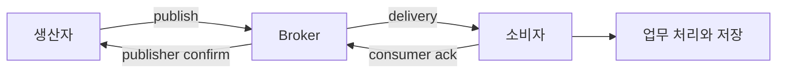

# 메시지 큐: 발행 확인, 전달, 처리와 재전달

> 상태: 검토됨 · 적용 범위: RabbitMQ 4.3, AMQP 0-9-1의 주요 관측 개념 · 원천 확인일: 2026-10-06 · 실습 여부: 원천·가상 예시 중심; 연결 실습의 범위는 본문

## 먼저 이해할 것

메시지 broker가 발송을 수용한 것과 소비자가 업무를 끝낸 것은 별개의 확인입니다. 큐 안에서 전달을 기다리는 메시지와 이미 전달했지만 확인받지 못한 메시지를 나누어 봅니다. 재전달은 같은 업무를 다시 시도하는 것일 수 있어 전달 수를 고유 업무 수로 바꾸지 않습니다. 제품은 생산자·broker·소비자·업무 저장소 중 누가 무엇을 확인했는지 남깁니다.

## 두 종류의 확인

RabbitMQ publisher confirm은 발행자와 broker 사이의 확인이고 consumer acknowledgement는 broker와 소비자 사이의 확인입니다. 둘은 서로 독립적이며 confirm을 받았다는 사실만으로 소비자의 처리가 끝난 것은 아닙니다. 수동 확인 전 연결이 끊기면 재전달이 발생할 수 있습니다. [RabbitMQ Confirms and Acknowledgements](https://www.rabbitmq.com/docs/confirms)

ack와 업무 저장의 순서는 애플리케이션 설계에 달려 있습니다. ack 뒤 업무 저장 전에 소비자가 중단되는 경우와 저장 뒤 ack 전에 중단되는 경우는 결과가 다릅니다. 모니터링 제품은 ack를 임의로 “업무 완료”로 이름 바꾸지 않습니다.

## ready와 unacknowledged

큐 관측에는 전달을 기다리는 메시지와 전달됐으나 아직 확인되지 않은 메시지가 있습니다. publish, deliver, acknowledge, redeliver 비율과 함께 봐야 처리 흐름을 알 수 있습니다. [RabbitMQ Monitoring](https://www.rabbitmq.com/docs/monitoring)

가상 예시에서 ready 800, unacknowledged 200이면 두 범주의 합은 1,000입니다. ready가 0이어도 미확인 200개가 남아 있으면 모든 업무가 완료됐다고 볼 수 없습니다. 반대로 재전달 횟수에는 같은 메시지의 반복 전달이 포함될 수 있으므로 고유 업무 건수와 같지 않습니다.

## prefetch가 바꾸는 범위

prefetch는 미확인 메시지 수를 제한하는 데 사용됩니다. RabbitMQ에서는 일반적인 per-consumer 설정과 channel 단위 제한을 구별하며, 0은 제한 없음을 의미합니다. [RabbitMQ Consumer Prefetch](https://www.rabbitmq.com/docs/consumer-prefetch)

quorum queue는 channel 전체에 하나의 제한을 거는 global QoS prefetch를 지원하지 않습니다. 그 설정을 활성화한 channel로 consume하면 channel error가 반환되므로 per-consumer prefetch를 사용합니다. 앞의 일반 설명을 모든 queue 종류의 지원 목록으로 읽지 않습니다. [Quorum queue의 Global QoS 제한](https://www.rabbitmq.com/docs/quorum-queues#global-qos)

가상의 소비자 4개에 각 50개의 독립 제한이 있고 추가 공통 제한이 없다면 미확인 전달의 설정상 규모는 총 200개입니다. 실제 업무 동시성은 소비자의 내부 처리 방식에 따라 다릅니다. 소비자 한 개가 50개를 받아도 직렬 처리할 수 있으므로 prefetch를 실행 스레드 수로 해석하지 않습니다.

## 재전달과 dead letter

메시지는 거부·만료·길이 제한 등의 조건과 설정에 따라 dead-letter 대상으로 다시 라우팅될 수 있습니다. dead-letter 전달의 보장은 queue 종류와 설정에 따라 다르므로 별도 대상이 있다는 사실만으로 손실 없는 보관을 가정하지 않습니다. [RabbitMQ Dead Letter Exchanges](https://www.rabbitmq.com/docs/dlx)

제품은 최초 전달, 재전달, 거부, 만료, dead-letter 라우팅과 최종 업무 결과를 분리하도록 제안합니다. 반복 실패 메시지가 계속 재큐잉되면 전달률은 높지만 고유 업무 완료는 낮을 수 있습니다.

## 가상 분석

1분 동안 deliver 12,000건, ack 1,000건, redeliver 10,000건이 관측됐다면 전달률만으로 초당 200건의 업무 처리량이라고 보고하지 않습니다. 동일 메시지 반복 여부와 소비자 오류를 확인합니다. 단위·집계 범위·동일 구간 여부를 먼저 맞춥니다.

확인할 지표에는 큐 깊이 외에 메시지 나이, 소비자 수, 연결·channel 변화, confirm 지연과 broker의 메모리·디스크 압박을 포함하는 것이 좋습니다. 실제 제공되는 원천 필드는 버전과 플러그인에 따라 명세합니다.

## Pulsar subscription의 관측 경계

Pulsar의 **batching을 켠 경우 backlog size는 개별 메시지 수가 아니라 batch(entry) 수**입니다. 같은 batch에 여러 메시지가 들어가므로 backlog에 임의의 평균 batch 크기를 곱해 정확한 메시지 수라고 표시하지 않습니다. 단위는 구체적인 원천 지표마다 확인합니다. [Pulsar 4.1 batching](https://pulsar.apache.org/docs/4.1.x/concepts-messaging/#batching)

Pulsar는 subscription 유형에 따라 메시지 전달과 공유 방식이 달라집니다. topic의 backlog와 특정 subscription의 미처리 상태를 구분하고, acknowledgment·redelivery·retention의 경계를 보존합니다. broker 하나의 건강 상태만으로 모든 subscription 처리를 설명하지 않습니다. [Pulsar 4.0 messaging](https://pulsar.apache.org/docs/4.0.x/concepts-messaging/)

## 이해 확인

1. publisher confirm은 소비자 업무 완료인가? **broker와의 확인입니다.**
2. ready 0이면 모든 메시지 처리가 끝났는가? **unacknowledged와 업무 상태를 추가 확인합니다.**
3. prefetch 100이면 100개를 병렬 실행하는가? **전달 제한과 실제 병렬 처리는 다릅니다.**

이전: [Kafka: 파티션, offset, lag와 처리 보장](kafka.md) · 다음: [검색 엔진: 색인, 가시성, shard와 요청 지연](search-engines.md) · [분야 목차](README.md)
