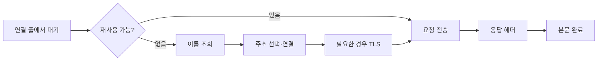

# 이름 조회에서 응답 본문까지: DNS, 연결 재사용과 실패 위치

> 상태: 검토됨 · 적용 범위: DNS·TCP·HTTP의 명시된 규약, Python 3.12.3 HTTP/1.1 로컬 실습 · 검토일: 2026-10-04

## 먼저 이해할 것

주소록에서 전화번호를 찾는 일과 전화가 연결되는 일, 실제 대화를 끝내는 일은 다릅니다. 요청 하나도 이름 조회, 연결 확보, 암호화 협상, 요청 전송, 응답 헤더와 본문 수신을 거칩니다. 어느 단계의 실패인지 알아야 다음에 볼 증거를 정할 수 있습니다.

선수 내용은 [DNS·주소·라우팅](addressing-routing-dns.md), [TLS와 HTTP](tls-http.md), [연결 풀](../application/servers-and-pools.md)입니다.

## 요청 경로를 단계로 나누기



이는 일반적인 조사용 개념도입니다. 실제 구현은 DNS를 미리 조회하거나 여러 연결을 경쟁시키고 프록시를 사용할 수 있습니다. 따라서 각 단계의 합이 항상 단순한 직렬 지연 합이라고 가정하지 않습니다.

## DNS 오류를 한 종류로 뭉치지 않는다

NXDOMAIN은 이름 부재를 나타냅니다. CNAME·DNAME 체인이 있으면 응답 RCODE는 최종 query cycle 기준이므로 원래 별칭의 부재로 곧바로 귀속하지 않습니다. 최초 이름·체인·최종 이름을 함께 봅니다. [RFC 6604 §3](https://www.rfc-editor.org/rfc/rfc6604.html#section-3) NODATA는 이름은 존재하지만 요청한 유형의 자료가 없는 경우를 설명합니다. DNS는 부정 응답도 규약에 따라 캐시할 수 있으므로 이름을 만든 직후 모든 client가 즉시 새 결과를 본다고 보장하지 않습니다. [RFC 2308](https://www.rfc-editor.org/rfc/rfc2308.html)

SERVFAIL, 질의 timeout, 이름 부재를 같은 오류로 저장하면 재조사 방향이 흐려집니다. 응답 코드, 질의 이름·유형, 실제 resolver, 시간과 캐시 문맥을 함께 확인하도록 제안합니다. answer가 비었다는 사실만으로 항상 NXDOMAIN이라고 판단하지 않습니다.

DNS TTL은 해당 DNS 자료의 캐시 수명과 관계가 있습니다. 이미 열린 TCP 연결의 종료 시간을 직접 정하는 값은 아닙니다. 이름 조회와 연결 재사용이 분리된 구현에서는 DNS가 바뀌어도 기존 연결이 남을 수 있습니다. 이것은 연결 수명 정책과 함께 조사할 설계상 관계입니다.

## 주소가 여러 개이면 시도도 여러 개일 수 있다

IPv6·IPv4 등 여러 주소 후보를 다루는 Happy Eyeballs는 연결 성공과 지연을 개선하려는 주소 선택·시도 전략을 정의합니다. 논리 요청 하나와 네트워크 연결 시도 하나를 반드시 1:1로 보지 않습니다. 모든 클라이언트가 같은 알고리즘·간격을 사용한다고 가정하지도 않습니다. [RFC 8305](https://www.rfc-editor.org/rfc/rfc8305.html)

모니터링에는 논리 요청 ID, 각 attempt, 실제 선택 주소, 연결 재사용 여부를 구분하는 설계를 제안합니다. 다른 경로로 재시도해 최종 성공했다면 중간 실패를 최종 사용자 오류와 같은 수로 단순 합산하지 않습니다.

## HTTP keep-alive와 TCP keepalive

HTTP/1.1의 지속 연결은 같은 연결에서 여러 요청·응답을 처리할 수 있게 합니다. 메시지 경계를 정확히 읽어야 다음 응답을 구분할 수 있습니다. TCP keepalive는 유휴 TCP 연결의 상태를 점검하는 별도 소켓 기능입니다. 이름이 비슷해도 설정 목적과 계층이 다릅니다. [HTTP/1.1 연결](https://www.rfc-editor.org/rfc/rfc9112.html#name-connection-management), [Linux TCP 옵션](https://man7.org/linux/man-pages/man7/tcp.7.html)

연결 재사용은 새 DNS·TCP·TLS 작업을 피할 수 있는 경로입니다. 반면 pool 대기와 오래된 연결의 상태 문제도 조사해야 합니다. keepalive를 켰다는 이유만으로 업무 응답의 deadline이 생기거나 모든 중간 장비 timeout이 사라지는 것은 아닙니다.

## 실제 실습 1: 요청 두 개와 TCP 연결 하나

Python의 HTTP/1.1 loopback 서버에 같은 client 객체로 두 GET을 순서대로 보냈습니다. 서버는 길이가 명확한 본문을 반환했고 client는 매번 본문을 끝까지 읽었습니다.

| 관측 | 실제 결과 |
| --- | ---: |
| 정상 GET 요청 | 2회 |
| 서버가 수락한 TCP 연결 | 1개 |
| 두 응답 본문 | 각각 `OK` |

이 결과는 해당 조건에서의 연결 재사용을 확인합니다. 모든 HTTP client·proxy의 기본 재사용 정책이나 HTTP/2 stream 동작을 검증한 것은 아닙니다.

## 실제 실습 2: 200 뒤에도 응답이 실패할 수 있다

세 번째 GET에서 서버는 HTTP 200과 `Content-Length: 10`을 보냈지만 본문을 5B만 쓰고 연결을 닫았습니다. client는 상태 코드 200을 읽은 뒤 본문 수신 중 `IncompleteRead`를 발생시켰습니다. 기록된 수신 5B와 부족 5B가 선언된 10B와 일치했습니다.

HTTP/1.1에서는 메시지 framing에 맞게 본문이 완료됐는지 확인해야 합니다. 상태 코드 수신 시점을 최종 전송 완료로 취급하면 이런 실패를 놓칩니다. [RFC 9112 불완전 메시지](https://www.rfc-editor.org/rfc/rfc9112.html#name-handling-incomplete-message), [Python HTTP client](https://docs.python.org/3.12/library/http.client.html)

이 실습은 본문이 있는 일반 GET 응답입니다. HEAD, 204, 304 등 다른 메시지 길이 규칙은 해당 HTTP 규약을 따릅니다. “Content-Length와 실제 socket byte를 언제나 같은 방법으로 비교”하는 만능 규칙을 만들지 않습니다.

## 증상과 다음 확인 위치

| 관측한 현상 | 다음에 볼 증거 | 바로 단정하지 않을 원인 |
| --- | --- | --- |
| DNS timeout | resolver 응답·질의 유형·경로·재시도 | 대상 서버의 애플리케이션 장애 |
| 연결 확보 대기 | pool active/idle/waiter·반환 정책 | TCP 연결 실패 |
| 연결 거절 | 실제 주소·port·listener·중간 응답 | 항상 방화벽 문제 |
| TLS 실패 | 검증 오류·SNI·인증서·프로토콜 | 단순 네트워크 단절 |
| 헤더 200 뒤 본문 실패 | framing·연결 종료·client 예외 | 성공한 업무 응답 |
| 재시도 후 성공 | attempt별 경로와 deadline | 중간 실패가 없었음 |

이 표는 원인을 확정하는 표가 아니라 조사 순서의 제안입니다. 재시도의 업무 중복 위험은 [timeout과 retry](../application/timeouts-and-retries.md)를 함께 봅니다.

## 재현과 적용 범위

[run_http_lab.py](../../scripts/run_http_lab.py)는 임시 loopback 서버만 사용합니다. [원시 결과](../../labs/results/1.1-http11.json)에 요청·연결 수와 예외가 있습니다.

```bash
python3 scripts/run_http_lab.py
```

실험은 실제 DNS resolver, TLS, HTTP/2·HTTP/3, proxy, 인터넷 구간의 장애를 재현하지 않았습니다. 해당 설명은 위 명세에 근거한 학습 내용입니다.

## 이해 확인

1. 요청 100개면 TCP 연결도 100개인가? **연결을 재사용하거나 다중화할 수 있어 일치하지 않습니다.**
2. DNS TTL이 끝나면 열린 연결도 반드시 닫히는가? **DNS 자료와 연결 수명의 계약을 구분합니다.**
3. HTTP 200을 읽으면 본문 전송도 끝났는가? **실습에서 본문이 잘려 예외가 발생했습니다.**
4. 응답이 timeout이면 서버가 아무 작업도 하지 않았는가? **작업 완료와 응답 전달은 다른 경계입니다.**
