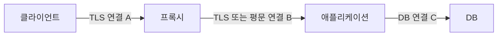

# TLS, HTTP와 요청 단계별 시간

> 상태: 검토됨 · 적용 범위: TLS 1.3, HTTP 의미론·HTTP/2·HTTP/3, curl 시간 필드 · 출처 확인일: 2026-10-03 · 편집 검토일: 2026-10-04

## 먼저 이해할 것

HTTPS를 이해할 때는 보호된 연결을 만드는 TLS와 요청·응답의 뜻을 정하는 HTTP를 나눠 봅니다. 인증서 검증에 실패하는 문제와 서버가 HTTP 500을 응답하는 문제는 조사 위치가 다릅니다. 프록시가 여러 개이면 연결마다 TLS 종단과 측정 시간이 달라질 수 있습니다.

응답 시간 하나만 저장하면 어디에서 시간이 소모됐는지 구분하기 어렵습니다. 동시에 측정 도구가 제공하는 시간이 구간 길이인지 시작 이후 누적 시간인지 확인해야 합니다.

## 보안 연결의 의미

TLS 1.3은 핸드셰이크에서 보안 매개변수를 설정하고 인증과 키 교환을 수행합니다. 인증서 기반 서버 인증 외에 사전 공유 키 방식도 있으며 모든 연결이 매번 같은 인증서 교환을 하는 것은 아닙니다. 재개와 0-RTT도 별도 경로이고, 0-RTT 데이터에는 재전송 공격에 대한 제약이 있으므로 일반 요청과 동일한 안전성을 가정하면 안 됩니다. [TLS 1.3, RFC 8446](https://www.rfc-editor.org/rfc/rfc8446.html)

인증서의 유효 기간만 확인해서는 대상 서비스의 신원을 검증했다고 할 수 없습니다. RFC 9525는 DNS 이름 검증에 `subjectAltName`의 `dNSName`을 사용하며 Common Name의 이름을 검증 대상으로 삼지 않도록 규정합니다. IP 신원에는 `iPAddress`의 정확한 일치가 필요합니다. [TLS 서비스 신원, RFC 9525](https://www.rfc-editor.org/rfc/rfc9525.html)

제품에서는 다음 결과를 분리하는 방식을 제안합니다.

| 검사 | 확인하는 질문 |
| --- | --- |
| 전송 연결 | 주소·포트까지 연결되는가 |
| TLS 핸드셰이크 | 프로토콜 협상이 끝났는가 |
| 인증서 검증 | 신뢰·이름·시간 조건을 통과하는가 |
| HTTP 응답 | 원하는 응답 상태와 내용을 얻었는가 |

인증서 검증을 끈 검사 결과는 검증을 켠 사용자 경로와 같은 성공률로 합치지 않습니다.

## HTTP 버전과 관측 단위

HTTP의 메서드, 상태 코드, 표현과 캐시 의미는 전송 형식과 구분됩니다. `GET`, `POST`, `200`, `503` 등은 요청과 응답 의미를 설명하지만, HTTP 성공 코드가 특정 업무의 최종 완료까지 정의하지는 않습니다. 예를 들어 `202 Accepted`는 처리 요청을 받아들였으나 처리가 완료되지 않은 상태를 나타냅니다. [HTTP 의미론, RFC 9110](https://www.rfc-editor.org/rfc/rfc9110.html)

HTTP/2는 한 연결에서 여러 스트림을 사용합니다. 이로써 요청을 다중화하지만 기반 TCP에서 누락된 바이트로 생기는 전송 계층의 대기는 없애지 못합니다. [HTTP/2, RFC 9113](https://www.rfc-editor.org/rfc/rfc9113.html)

HTTP/3은 QUIC를 사용합니다. 스트림을 구분하는 전송 기반이 달라지지만 헤더 압축의 의존성 등 별도의 대기 원인은 남을 수 있습니다. “HTTP/3에는 모든 형태의 대기가 없다”는 결론은 성립하지 않습니다. [HTTP/3, RFC 9114](https://www.rfc-editor.org/rfc/rfc9114.html)

이에 따라 제품은 TCP 연결, QUIC 연결, HTTP 스트림, 업무 요청을 서로 다른 개체로 모델링하는 것이 좋습니다. 이 문단은 위 프로토콜 차이에 따른 설계 제안입니다.

## 누적 타이머를 더하면 안 되는 이유

curl의 `time_namelookup`, `time_connect`, `time_appconnect`, `time_starttransfer`, `time_total`은 각각 시작 이후 해당 단계에 도달한 시간을 나타냅니다. 연결 대상에는 프록시가 포함될 수 있고 재사용·리다이렉트·프로토콜에 따라 해석이 달라집니다. [curl 공식 매뉴얼: write-out](https://curl.se/docs/manpage.html#-w)

아래는 **새 TCP 연결, 직접 HTTPS 접근, 리다이렉트 없음, 순차 단계**라는 가정의 합성 데이터입니다.

| 필드 | 시작 이후 시간 |
| --- | ---: |
| 이름 해석 완료 | 0.010 s |
| TCP 연결 완료 | 0.040 s |
| TLS 완료 | 0.090 s |
| 첫 응답 바이트 | 0.240 s |
| 전체 완료 | 0.300 s |

```text
이름 해석             = 10 ms
TCP 연결 구간          = 40 − 10 = 30 ms
TLS 구간               = 90 − 40 = 50 ms
TLS 후 첫 바이트까지    = 240 − 90 = 150 ms
첫 바이트 후 완료까지   = 300 − 240 = 60 ms
합계                   = 300 ms
```

누적값을 그대로 더한 680 ms는 잘못된 총시간입니다. 또 150 ms 전체를 서버 CPU 시간으로 부르면 안 됩니다. 요청 전송, 양방향 경로, 서버 대기와 실행 등이 포함될 수 있습니다. 위 차감식은 HTTP/3이나 기존 연결 재사용의 모든 경로에 일반화하는 공식이 아닙니다.

## 프록시가 있으면 연결도 여러 개다

다음은 관측 경계를 설명하는 가상의 배치입니다.



클라이언트가 확인한 인증서는 연결 A의 종단에 대한 것입니다. 연결 B의 인증서나 지연은 따로 확인해야 합니다. 프록시의 요청 시간과 애플리케이션의 처리 시간이 겹칠 수 있으므로 합산하지 말고 타임라인과 측정 범위로 비교합니다.

## 관측 설계 예시

지연 지표에 대상 이름, 실제 주소, HTTP 버전, 연결 재사용 여부, 프록시 사용 여부, 결과 분류를 연결합니다. 경로별 통계를 만들 때 `/orders/123` 같은 원문 URL 대신 `/orders/{id}` 같은 라우트 템플릿을 사용하는 방법은 [시계열 카디널리티](../foundations/time-series.md)와 연결됩니다. 쿼리 문자열은 개인정보와 높은 카디널리티를 모두 유발할 수 있으므로 수집 필드 정책을 명시합니다.

## 이해 확인

1. 인증서 만료가 멀면 TLS 검증은 성공하는가? **이름, 신뢰 체인 등 다른 조건도 필요합니다.**
2. TTFB에서 TLS 완료 시간을 빼면 서버 CPU 시간인가? **아니요. 그 구간에 여러 대기·전송·실행이 포함됩니다.**
3. HTTP 요청 1,000개면 연결도 1,000개인가? **연결 재사용과 다중화 때문에 그렇지 않습니다.**

다음: [인터페이스와 흐름 관측](network-metrics.md) · [네트워크 목차](README.md)
