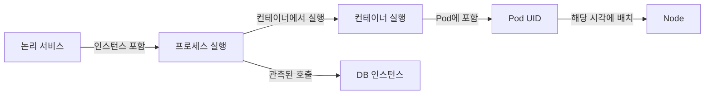

# 관측 대상의 식별과 시간에 따른 관계

> 상태: 검토됨 · 범위: OpenTelemetry 규약과 이를 참고한 제품 모델 제안 · 공식 자료 확인: 2026-10-03 · 편집 검토일: 2026-10-04

## 먼저 이해할 것

entity는 제품이 구분해 관리할 대상이고 topology는 대상들 사이의 관계입니다. 같은 이름으로 다시 생성된 Pod와 장기간 유지되는 업무 서비스를 구분해야 과거 장애가 올바른 실행에 연결됩니다. 포함 관계, 실행 관계, 호출 관계를 서로 다른 종류로 저장하는 것부터 시작합니다.

통합 모니터링의 핵심은 서로 다른 그래프를 한 화면에 배치하는 데서 끝나지 않습니다. 주문 요청을 처리한 프로세스가 어느 컨테이너와 호스트에서 실행되었고, 그 시점에 어느 DB에 연결했는지 설명해야 합니다. 이를 위해 **대상의 정체성, 실행 수명, 관측 출처, 관계의 유효 시간**을 모델링합니다.

## 논리 대상과 실행 대상을 나누는 이유

논리 서비스 `orders`는 배포 후에도 같은 업무를 수행하지만, 실행 인스턴스는 교체됩니다. 서비스 수준의 장기 오류율과 특정 인스턴스의 메모리 증가를 같은 식별자로 처리하면 재시작에 따른 초기화를 놓칩니다.

OpenTelemetry는 `service.namespace`, `service.name`, `service.instance.id`를 통해 서비스 묶음·서비스·실행 인스턴스를 구분합니다. 인스턴스 ID는 같은 namespace와 name 조합에서 고유해야 합니다. 수집기가 발생 인스턴스를 확실히 알 수 없으면 임의로 인스턴스 ID를 부여하는 것을 권하지 않습니다. [Service semantic conventions](https://opentelemetry.io/docs/specs/semconv/resource/service/)

다음 표는 **이 제품을 위한 모델 제안**이며 외부 표준의 필수 스키마가 아닙니다.

| 수준 | 예 | 식별에서 보존할 정보 |
| --- | --- | --- |
| 업무·논리 서비스 | 주문 서비스 | 테넌트, 환경, 서비스 namespace와 이름 |
| 배포·워크로드 | Deployment, VM 그룹 | 원천 시스템, 클러스터·계정 범위, 객체 고유 ID |
| 실행 인스턴스 | 프로세스, Pod, DB 실행 | 고유 ID와 시작·종료 또는 부팅 수명 |
| 기반 자원 | 호스트, 볼륨, NIC | 공급자가 보장하는 ID의 유효 범위 |
| 관측 주체 | 에이전트, 클라우드 수집기 | 수집기 ID, 구성 버전, 권한 범위 |

하나의 논리 서비스를 여러 프로세스가 구현할 수 있고, 한 프로세스가 여러 업무 기능을 처리할 수도 있습니다. 논리 서비스와 프로세스의 일대일 대응을 필수 제약으로 만들지 않습니다.

## 이름, 주소, 고유 ID는 다른 정보다

이름은 표시·검색에 편리합니다. 주소는 특정 네트워크 범위에서 통신할 위치를 나타냅니다. 둘 다 재사용될 수 있습니다. 다음 원칙은 [프로세스 수명](../host/processes.md), [Pod 객체](../kubernetes/objects-and-control-loops.md), [클라우드 자원](../cloud/resources-and-apis.md)의 차이를 공통 모델에 반영한 제안입니다.

- PID만으로 프로세스를 연결하지 않고 호스트 부팅·프로세스 시작 문맥을 사용합니다.
- Kubernetes 객체 이름 대신 클러스터 범위와 UID를 보존합니다.
- IP에는 네트워크·VPC·namespace와 유효 시간을 붙입니다. 서로 다른 사설망의 같은 IP를 합치지 않습니다.
- 원천 ID를 제품 내부 ID로 바꾸더라도 원문과 원천 종류를 남깁니다.

예를 들어 10:00에 종료한 Pod와 10:05에 같은 이름으로 생성한 Pod는 논리 워크로드로 묶을 수 있지만, CPU Counter를 이어 붙이면 안 됩니다. 10:02의 요청에 10:05에 새로 발견한 배치 관계를 적용할 수도 없습니다.

## Resource 속성과 측정 차원

OpenTelemetry Resource는 텔레메트리가 만들어지는 관측 대상을 속성으로 표현하며, SDK에서 불변 객체로 다룹니다. 하나의 Resource에 호스트·컨테이너·Pod 문맥을 함께 담을 수 있습니다. [Resource SDK](https://opentelemetry.io/docs/specs/otel/resource/sdk/)

이것이 제품 DB의 모든 자원 속성도 영구 불변이어야 한다는 뜻은 아닙니다. 제품은 여러 시점의 Resource 관측을 받아 대상 속성의 이력을 구성할 수 있습니다. 제품 내부 변경 이력은 SDK Resource의 불변성과 별개의 설계입니다.

`host.id`와 같은 대상 속성, HTTP route와 같은 측정 차원, 수집기 주소와 같은 관측 주체 속성을 나누면 집계의 의미가 명확해집니다. 수집기를 교체했다는 이유로 업무 인스턴스가 새로 만들어진 것처럼 처리하지 않는 것이 목적입니다.

## 관계는 종류와 근거를 가져야 한다



`contains`, `runs_on`, `calls`, `replicates_to`는 서로 대체할 수 없습니다. Pod가 Node에서 실행된다는 사실만으로 Node가 DB를 호출하는 업무 서비스가 되는 것은 아닙니다. Kubernetes owner reference도 네트워크 호출 증거가 아닙니다.

권장 관계 레코드 예시는 다음과 같습니다. 필드명은 설명용입니다.

```json
{
  "tenant_id": "tenant-a",
  "from_entity": "pod-uid-example",
  "to_entity": "node-uid-example",
  "relation": "scheduled_on",
  "valid_from": "2026-10-03T01:00:00Z",
  "valid_to": "2026-10-03T02:00:00Z",
  "observed_at": "2026-10-03T01:00:04Z",
  "evidence": "kubernetes-api-pod-spec"
}
```

유효 구간을 `[시작, 종료)`로 정의하면 02:00 경계에서 두 관계가 동시에 유효한지 분명하게 판단할 수 있습니다. 종료 시점을 실제로 모르면 null과 마지막 관측 시점을 별도로 남깁니다. 수집 실패 시각을 실제 종료 시각으로 만들지 않습니다.

## 직접 확인한 관계와 추정한 관계

| 관계의 근거 | 알 수 있는 것 | 남는 한계 |
| --- | --- | --- |
| API의 명시적 배치 정보 | 해당 객체가 보고한 실행 위치 | 수집 지연과 이후 변경 |
| 같은 trace의 연결된 span | 계측된 요청 경로 | 누락 span, 비동기 link, sampling |
| 소켓의 출발·목적 주소 | 해당 관측 위치의 통신 | NAT·프록시 뒤의 최종 업무 대상 |
| 이름·태그 일치 | 연관 후보 | 이름 충돌, 수동 태그 오류 |

추정 관계에는 근거와 확인 상태를 표시합니다. 여러 후보가 있으면 가장 그럴듯한 하나를 확정 사실로 저장하지 않습니다. 보존 기간도 맞춰야 합니다. 트레이스가 7일 남아 있는데 당시 배치 정보가 하루 만에 지워지면 오래된 요청의 실행 환경을 재구성할 수 없습니다.

## 이해 확인

1. 같은 IP로 관측한 두 DB는 같은 DB인가? **네트워크 범위·시간·원천 ID를 확인하기 전에는 알 수 없다.**
2. 현재 서비스 지도가 지난주 장애 경로를 설명하는가? **지난주의 관계 이력이 없으면 보장할 수 없다.**
3. 관계가 직접 관측되었다면 장애 원인도 확정되는가? **호출이나 배치의 존재와 장애의 인과관계는 다른 주장이다.**

관련: [시간과 데이터 품질](../foundations/time-and-data-quality.md), [수집 파이프라인](collection-pipelines.md)
