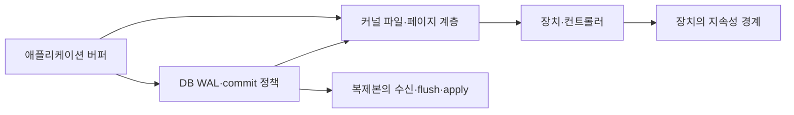

# 쓰기가 끝났다는 뜻: 버퍼, fsync, WAL과 복제

> 상태: 검토됨 · 적용 범위: Linux 파일 API와 PostgreSQL 18의 지속성 규약 · 검토일: 2026-10-04 · 전원 장애·장치 고장·복제 장애는 직접 재현하지 않음 · 2라운드 보강 확인: 2026-10-05 (FLUSH/FUA·PG18 fsync 실패)

## 먼저 이해할 것

메모장에 입력한 글이 화면에 보이는 것, 저장 버튼이 끝난 것, 다른 컴퓨터에서 복구할 수 있는 것은 서로 다른 상태입니다. 서버에서도 프로그램의 버퍼, 운영체제 페이지 캐시, 저장 장치, 복제본 사이에 완료 경계가 있습니다. 모니터링은 어느 경계까지 끝난 지연을 재는지 밝혀야 합니다.

선수 내용은 [저장 모델과 성능](models-and-performance.md), [복제와 복구](../database/replication-and-recovery.md)입니다.

## 한 번의 쓰기가 지나는 계층

이 그림은 경계를 나누는 개념도입니다. 모든 저장소가 같은 경로와 캐시를 갖거나 복제를 항상 이 위치에서 수행한다는 뜻은 아닙니다.

## write가 성공했을 때의 보장

Linux `write()`는 요청한 크기보다 적은 byte를 쓸 수 있으므로 반환 길이를 확인해야 합니다. 또한 성공 반환만으로 데이터가 디스크에 지속됐다고 보장하지 않습니다. 후속 쓰기·fsync·close에서 이전 쓰기와 관련된 오류가 드러날 수도 있습니다. [write 규약](https://man7.org/linux/man-pages/man2/write.2.html)

따라서 제품의 “쓰기 완료 시간”을 설명할 때 호출 반환 시간인지, flush가 포함됐는지, 업무 트랜잭션 commit까지인지 구분합니다. 빠른 write 반환과 빠른 영속 기록은 다른 측정일 수 있습니다.

## flush, fsync, fdatasync

언어 라이브러리의 버퍼를 비우는 `flush()`는 그 라이브러리의 경계입니다. Linux `fsync()`는 파일 데이터와 관련 메타데이터의 동기화를 요청하고 장치가 완료를 보고할 때까지 기다립니다. `fdatasync()`는 이후 데이터 읽기에 필요하지 않은 일부 메타데이터까지 모두 동기화할 필요는 없습니다. [fsync·fdatasync](https://man7.org/linux/man-pages/man2/fsync.2.html)

파일을 새 이름으로 생성하거나 교체할 때는 파일 내용뿐 아니라 디렉터리 항목의 지속성도 문제입니다. 파일에 대한 fsync만으로 그 디렉터리 항목의 기록까지 항상 보장하지 않으며, 해당 경로에는 디렉터리 동기화 조건도 검토합니다. 이것을 모든 파일시스템·스토리지에 동일한 복구 보장을 주는 짧은 레시피로 단순화하지 않습니다.

| 관측한 반환 | 확인할 수 있는 범위 | 추가 확인이 필요한 것 |
| --- | --- | --- |
| 언어의 flush | 사용자 공간 버퍼 처리 | 장치 지속성 |
| write의 byte 반환 | 시스템 호출의 처리량 | 후속 오류·영속 완료 |
| fsync 성공 | OS·장치 인터페이스가 보고한 동기화 완료 | 실제 장치가 약속을 지키는지와 장애 범위 |
| DB commit 응답 | DB 설정이 정의한 완료 경계 | 복제본·HA 전환·전체 업무 완료 |

## 장치 write cache와 FLUSH·FUA

**Linux block 규약, 2026-10-05 확인:** 장치가 휘발성 write-back cache에서 완료를 응답하면 전원 상실 전에 매체에 도달하지 않은 데이터가 있을 수 있습니다. `REQ_PREFLUSH`는 해당 I/O에 앞서 장치의 기존 휘발성 cache를 flush하게 하고, `REQ_FUA`는 그 쓰기 자체가 비휘발성 경계에 도달하기 전에 완료로 보고하지 않게 합니다. 둘은 범위와 순서가 다르며 장치·driver가 기능을 구현하거나 적절히 대체하는 조건이 필요합니다. [Linux write cache 제어](https://docs.kernel.org/block/writeback_cache_control.html)

`O_DIRECT`는 주로 page cache와의 상호작용을 줄이는 I/O 경로 선택입니다. 이것만으로 `O_SYNC`의 동기화 보장을 주지 않습니다. direct I/O 측정이 빠르거나 느린 이유를 설명할 때 cache 우회·정렬 제약·장치 cache·flush 포함 여부를 나눕니다. 제품에서 `direct=true`만으로 “전원 장애에도 지속”이라는 속성을 만들지 않습니다. [open(2)의 O_DIRECT](https://man7.org/linux/man-pages/man2/open.2.html)

## fsync 오류 후 재시도가 성공했다는 의미

첫 fsync가 실패한 뒤 두 번째 fsync가 성공해도 이전 dirty data까지 복구됐다고 단정할 수 없습니다. OS가 실패한 dirty page를 버린다면 재시도는 잃은 내용을 다시 쓰지 못합니다. PostgreSQL 18의 `data_sync_retry`는 기본 `off`이며, 수정한 데이터 파일 동기화 실패에서 PANIC을 발생시킵니다. `on`은 다음 checkpoint에서 재시도하지만 OS 동작에 따라 데이터 손상 위험이 있어 단순 가용성 개선 옵션으로 소개하지 않습니다. [PostgreSQL 오류 처리](https://www.postgresql.org/docs/18/runtime-config-error-handling.html#GUC-DATA-SYNC-RETRY)

제품 적용 제안은 최초 동기화 오류·관련 파일/장치·checkpoint·복구 사건을 남겨 후속 성공으로 덮어쓰지 않는 것입니다. 이 절에서는 cache 설정·`data_sync_retry` 변경이나 실패 주입을 실행하지 않았습니다.

## DB가 데이터 페이지보다 WAL을 먼저 다루는 이유

PostgreSQL은 변경 복구에 필요한 WAL을 이용합니다. commit을 확인할 때 모든 변경 데이터 페이지를 제자리 파일에 즉시 기록해야 하는 방식과 구분합니다. 저장 장치·컨트롤러·파일시스템이 동기화 요구를 올바르게 이행하는 것도 지속성의 전제입니다. [PostgreSQL WAL 신뢰성](https://www.postgresql.org/docs/18/wal-reliability.html), [WAL 개요](https://www.postgresql.org/docs/18/wal-intro.html)

모니터링에서는 데이터 파일 쓰기, WAL 쓰기·동기화, checkpoint, backend 대기를 나누어 봅니다. IOPS가 증가한 사실만으로 어느 경계가 commit 지연을 지배하는지 확정하지 않습니다.

## asynchronous commit과 fsync 해제는 다르다

PostgreSQL의 asynchronous commit에서는 최근에 성공 응답한 트랜잭션이 비정상 종료 후 유실될 수 있습니다. 그러나 WAL 기반 일관성 보장을 유지하는 의미와, `fsync=off`로 저장 동기화 보장을 제거하는 경우의 위험은 다릅니다. 설정 이름을 모두 “디스크를 기다리지 않는 옵션”으로 뭉뚱그리지 않습니다. [Asynchronous commit](https://www.postgresql.org/docs/18/wal-async-commit.html)

모니터링 제품에는 활성 설정과 변경 시점도 필요합니다. commit 지연이 줄었다면 장치가 개선됐을 수도 있지만 완료 보장 수준이 바뀌었을 수도 있습니다. 성능 수치만 비교하기 전에 동일한 보장 아래 측정했는지 확인합니다.

## 복제본의 완료 단계도 다르다

복제본이 WAL을 받았다는 것, 지속성 경계까지 flush했다는 것, 질의에서 읽을 수 있도록 적용했다는 것은 다른 상태입니다. PostgreSQL `synchronous_commit`은 설정에 따라 대기하는 경계가 달라지며 동기 대기 대상 설정과 함께 해석합니다. [WAL 설정](https://www.postgresql.org/docs/18/runtime-config-wal.html#GUC-SYNCHRONOUS-COMMIT)

가상 장애 조사에서 replica의 receive 위치가 빠르게 따라와도 apply 지연 때문에 읽기가 뒤처질 수 있습니다. 반대로 원본 commit 응답이 빠르다고 장애 전환 후 손실 가능성이 자동으로 0이라는 결론은 나오지 않습니다. [DB 고가용성](../database/high-availability.md)의 fencing과 복구 절차도 필요합니다.

## 처리량과 동기화 지연을 따로 읽기

**가상 예시:** 1MiB를 쓰고 동기화까지 20ms가 걸린 단일 작업을 반복한다면 이 이상화된 직렬 흐름의 처리량은 `1MiB / 0.020초 = 50MiB/s`입니다. 이를 장치 전체의 최대 처리량으로 보지 않습니다. 병렬 작업, group commit, queue, 캐시와 다른 I/O가 있으면 관계가 달라집니다.

반대로 작은 commit을 많이 처리하는 workload는 byte/s가 낮아도 동기화 지연에 민감할 수 있습니다. 큰 순차 쓰기 처리량 하나로 작은 동기 쓰기의 응답성을 대신 설명할 수 없습니다.

## 실제 확인과 아직 하지 않은 실험

[Linux 실습](../host/linux-observation-lab.md)은 임시 파일에 쓰고 flush·fsync한 뒤 파일 내용과 프로세스 I/O 계정을 확인했습니다. [PostgreSQL 실습](../database/postgresql-concurrency-lab.md)은 정상 실행 중 트랜잭션과 대기 동작을 확인했습니다.

두 실험 모두 물리 전원 장애, 저장 장치 캐시 고장, 네트워크 파일시스템 단절, 복제본 승격을 수행하지 않았습니다. 성공적인 정상 실행과 장애 시 복구 보장은 구분합니다. 실제 지속성 검증에는 버전·파일시스템·장치·동기화 설정·장애 주입 지점을 명세한 별도 환경이 필요합니다.

## 이해 확인

추가 질문: O_DIRECT 성공이나 fsync 재시도 성공만으로 앞선 실패 데이터의 지속성을 확정할 수 있는가? **직접 I/O·동기화 완료·실패 후 캐시 상태는 서로 다른 계약입니다.**

1. write가 요청 크기를 반환하면 전원 장애에도 보존되는가? **지속성 경계를 확인해야 합니다. write 성공만으로 충분하지 않습니다.**
2. DB commit은 모든 데이터 페이지가 제자리 파일에 기록됐다는 뜻인가? **WAL과 실제 commit 정책을 확인합니다.**
3. receive lag와 apply lag는 같은가? **복제본의 완료 단계가 다릅니다.**
4. fsync를 한 번 실행해 성공했다면 장치의 장애 복구까지 검증했는가? **정상 호출 결과이며 장애 복구 실험은 별도입니다.**
